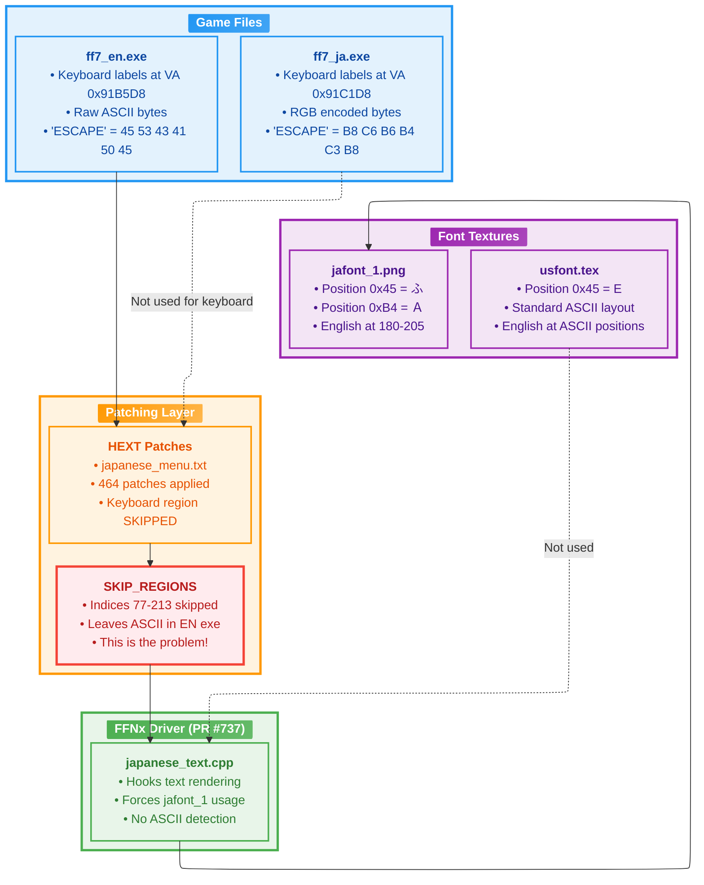
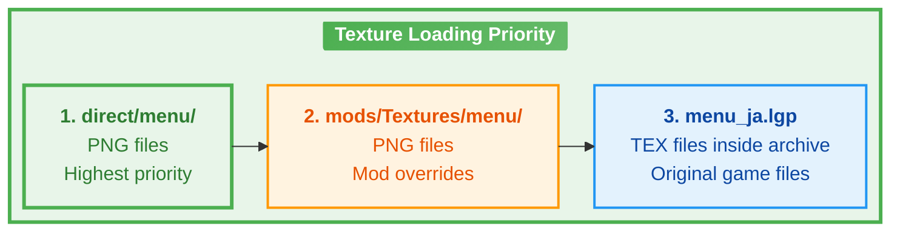
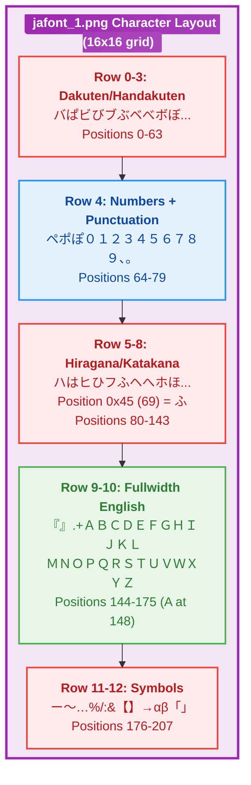
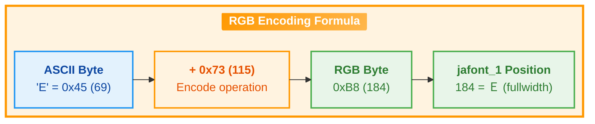
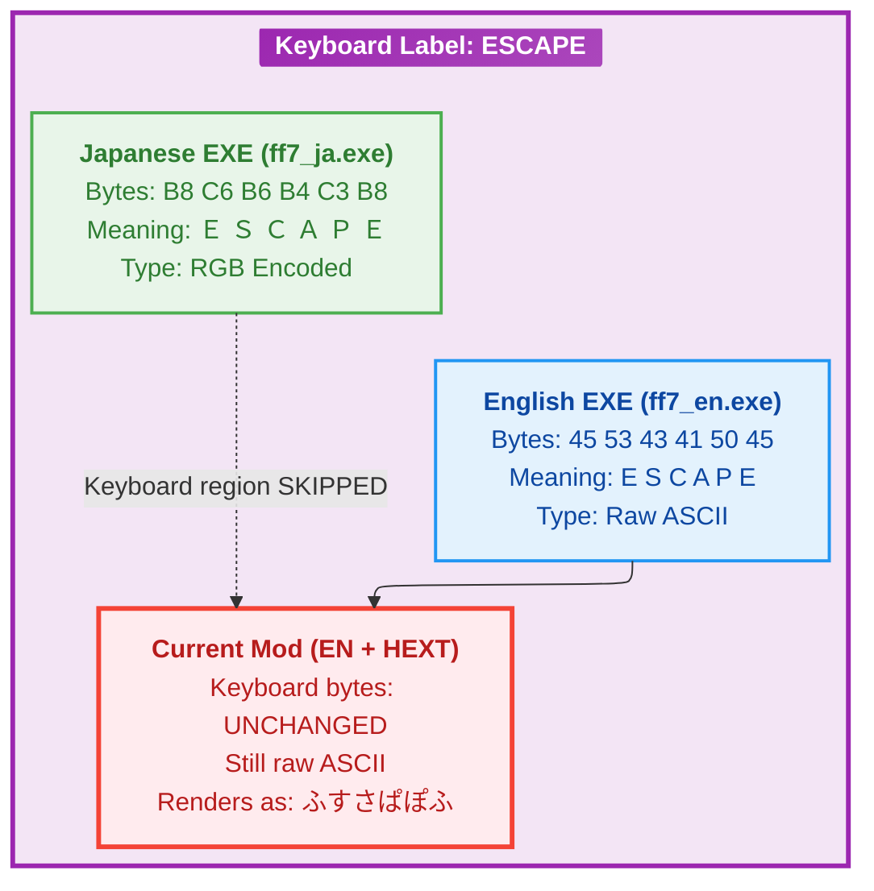
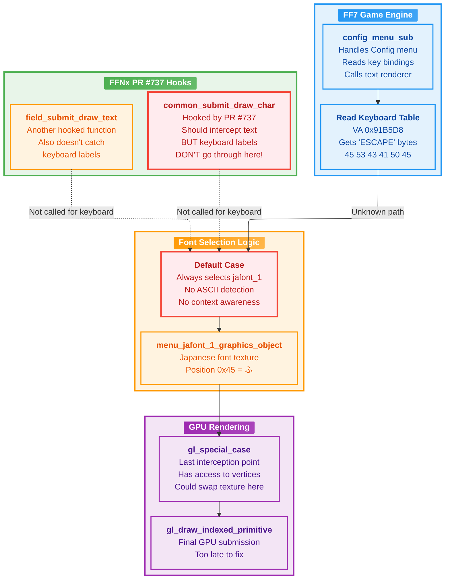
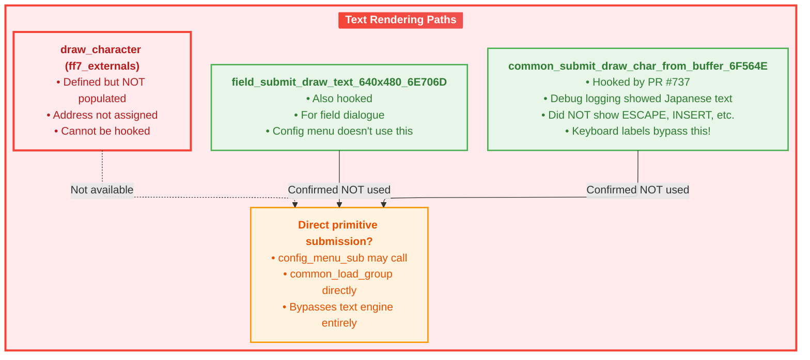
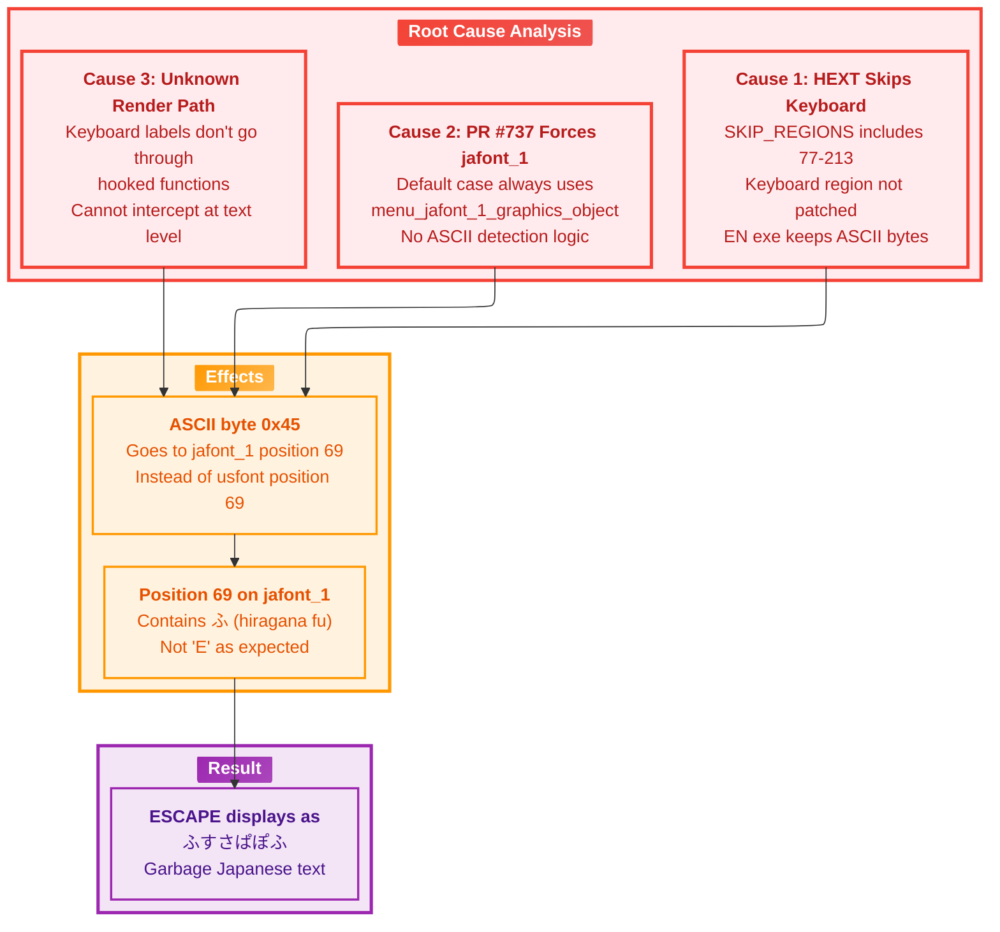
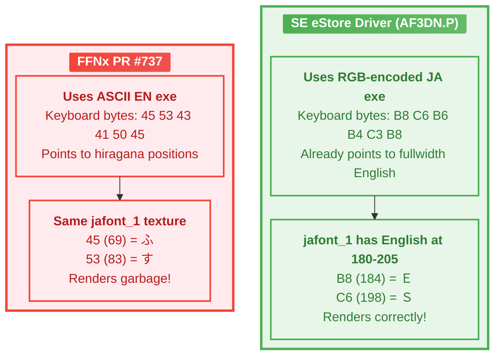
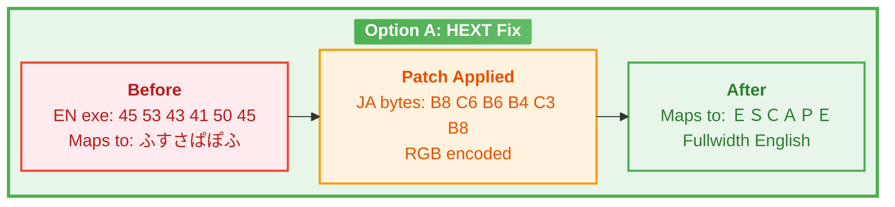

# FF7 Japanese Mod - Keyboard Label Patch Analysis

**Created:** 2025-12-08 10:30 JST (Monday)
**Last Modified:** 2026-01-07 21:33 JST (Wednesday)
**Version:** 1.1.0
**Author:** John Zealand-Doyle
**Session-ID:** f8c6d24b-f455-4439-a554-83e2996b85f8 (encoding type analysis)

---

## Executive Summary

The keyboard labels (ESCAPE, INSERT, PAGE UP, etc.) in the FF7 Japanese mod's Config→Controller→Customize screen display as garbage Japanese characters instead of English text. This document provides a comprehensive technical analysis of the rendering system, the root cause, and potential solutions.

---

## Table of Contents

1. [The Problem](#1-the-problem)
2. [System Architecture Overview](#2-system-architecture-overview)
3. [Font Texture System](#3-font-texture-system)
4. [Text Encoding Systems](#4-text-encoding-systems)
5. [Rendering Pipeline](#5-rendering-pipeline)
6. [The Root Cause](#6-the-root-cause)
7. [Attempted Solutions](#7-attempted-solutions)
8. [Recommended Fix](#8-recommended-fix)
9. [Technical Reference](#9-technical-reference)

---

## 1. The Problem

### Visual Symptom

In the Config→Controller→Customize screen:
- **Expected**: "ESCAPE", "INSERT", "PAGE UP", etc.
- **Actual**: "ふっぽプポほ" (garbage Japanese characters)

### Why This Happens (TL;DR)

1. The English exe stores keyboard labels as raw ASCII (e.g., 'E' = 0x45)
2. FFNx's PR #737 forces ALL text through `jafont_1` (Japanese font texture)
3. On `jafont_1`, position 0x45 contains 'ふ' (hiragana), NOT 'E'
4. Therefore, "ESCAPE" renders as Japanese garbage

---

## 2. System Architecture Overview



---

## 3. Font Texture System

### Texture File Formats

| Extension | Format | Source | Usage |
|-----------|--------|--------|-------|
| `.tim` | PlayStation TIM | Original PSX game | Code references this |
| `.tex` | FF7 PC TEX | Inside LGP archives | What game actually loads |
| `.png` | Standard image | Mod overrides | FFNx can use these |

### Texture Loading Priority



### jafont_1 Character Layout



### Critical Insight: Position Mismatch

| Character | ASCII Value | Encoding Type | jafont_1 Position | What's There |
|-----------|-------------|---------------|-------------------|--------------|
| 'E' | 0x45 (69) | ASCII (RGB type) | 69 | ふ (hiragana fu) |
| 'S' | 0x53 (83) | ASCII (RGB type) | 83 | す (hiragana su) |
| 'Ｅ' (fullwidth) | - | RGB Encoded | 184 (0xB8) | Ｅ (correct!) |
| 'Ｓ' (fullwidth) | - | RGB Encoded | 198 (0xC6) | Ｓ (correct!) |

---

## 4. Text Encoding Systems

### RGB Encoding (Square Enix's Method)



### Why RGB Encoding Exists

The RGB encoding name comes from the original strings it was used for:
- **R**ED, **G**REEN, **B**LUE in the Config menu color settings

SE's Japanese exe uses RGB encoding so that ASCII characters map to fullwidth English letters on jafont_1:
- ASCII 'E' (0x45) + 0x73 = 0xB8 (184) → Position 184 on jafont_1 = Ｅ

### Encoding Type Comparison: EN vs JA Executables

| String Index | Label | EN Encoding | EN Bytes | JA Encoding | JA Bytes | What Renders on jafont_1 |
|--------------|-------|-------------|----------|-------------|----------|--------------------------|
| [000] | "Do you want to quit" | DEF | `24 4F 00 59...` | DEF | (same) | ✅ Correct (Japanese menu text) |
| [077] | "ESCAPE" | RGB (Raw ASCII) | `45 53 43 41 50 45` | RGB (Encoded) | `B8 C6 B6 B4 C3 B8` | ❌ EN: ふすさぱぽふ / ✅ JA: ＥＳＣＡＰＥ |
| [088] | "MINUS" | RGB (Raw ASCII) | `4D 49 4E 55 53` | RGB (Encoded) | `C0 BC C1 C8 C6` | ❌ EN: Garbage / ✅ JA: ＭＩＮＵＳ |
| [192] | "INSERT" | RGB (Raw ASCII) | `49 4E 53 45 52 54` | RGB (Encoded) | `BC C1 C6 B8 C5 C7` | ❌ EN: Garbage / ✅ JA: ＩＮＳＥＲＴ |
| [212] | "BUTTON 9" | ASCII_FIX | `42 55 54 54...` | ASCII_FIX | (similar) | ❌ Both broken (needs fix) |
| [214] | "Pause" | DEF | `30 41 55 53 45 FF` | DEF | (same) | ✅ Correct |

**Key Observation:**
- DEF encoding works on both executables
- RGB strings in EN exe are raw ASCII (wrong for jafont_1)
- RGB strings in JA exe are pre-encoded +0x73 (correct for jafont_1)
- The HEXT generator currently SKIPS indices 77-213, leaving EN's broken ASCII bytes

### Current State in Each Executable



---

## 5. Rendering Pipeline

### Complete Text Rendering Flow



### The Mystery: Where Do Keyboard Labels Go?



---

## 6. The Root Cause

### Problem Summary Diagram



### Why SE's Driver Works



---

## 7. Attempted Solutions

### Solution 1: ASCII Range Check (FAILED)

```cpp
// Attempted in common_submit_draw_char_from_buffer_6F564E_jp
if ((byte)letter >= 0x20 && (byte)letter <= 0x7E) {
    // Use usfont for ASCII
    character_graphics_object = *ff7_externals.menu_font_a_graphics_object_DC100C;
}
```

**Why it failed:** jafont_1 has valid Japanese characters at positions 0x20-0x7E. This broke ALL Japanese text.

### Solution 2: Config Menu Detection (PARTIAL)

```cpp
// Check if in config menu (dword_DC12EC == 8)
if (*ff7_externals.dword_DC12EC == 8 && (byte)letter >= 0x20 && (byte)letter <= 0x7E) {
    character_graphics_object = *ff7_externals.menu_font_a_graphics_object_DC100C;
}
```

**Why it failed:** This is already in the code but keyboard labels don't go through this function!

### Solution 3: Remove SKIP_REGIONS for Keyboard (NOT TESTED)

```python
# In generate_exe_hext.py
# SKIP_REGIONS.update(range(77, 214))  # REMOVE THIS LINE
```

**Theory:** Patch in the RGB-encoded bytes from JA exe. The bytes 0xB8, 0xC6, etc. would then correctly map to fullwidth English on jafont_1.

**Status:** Previous session handoff says this was tried and still failed. Needs investigation.

### Solution 4: gl_special_case Texture Swap (NOT IMPLEMENTED)

Hook at the GPU level in `gl_special_case.cpp`:
1. Detect when jafont_1 is being used
2. Check if UV coordinates map to ASCII range (0x20-0x7E)
3. Swap texture to usfont
4. Recalculate UV coordinates

**Complexity:** High - requires UV coordinate transformation.

---

## 8. Recommended Fix

### Option A: Enable HEXT Patching for Keyboard Region

**Simplest approach** - relies on correct encoding already existing in JA exe:

1. Remove keyboard region from SKIP_REGIONS
2. Regenerate HEXT file
3. JA exe's RGB bytes get patched in
4. RGB bytes correctly map to fullwidth English on jafont_1



### Option B: Texture-Level Fix in gl_special_case

If Option A doesn't work (as reported in previous session):

1. Detect ASCII-range UV coordinates on jafont_1
2. Swap to usfont texture
3. UV coordinates stay the same (if usfont has ASCII at ASCII positions)

### Option C: Modify jafont_1 Texture

Add ASCII letters at ASCII positions (0x20-0x7E) on jafont_1:
- Risk: May overwrite needed Japanese characters
- Benefit: No code changes needed

---

## 9. Technical Reference

### String Encoding Types by Index Range

Based on analysis of english_strings_by_index.txt, the EN executable contains different encoding types across its string table:

| Index Range | Encoding Type | Count | Usage | Notes |
|-------------|---------------|-------|-------|-------|
| 0-76 | DEF (FF7 Default) | 77 | Menu text, standard UI | FF7's custom encoding for Japanese compatibility |
| 77-211 | RGB (Raw ASCII) | 135 | **Keyboard labels** | **PROBLEM AREA** - Raw ASCII bytes |
| 212-213 | ASCII_FIX | 2 | BUTTON 9, BUTTON 10 | Special case keyboard labels |
| 214+ | DEF (FF7 Default) | 554+ | Game text, status names | Standard FF7 encoding |
| Various | EXCLUDED | ~3 | Binary data | Non-text data (e.g., indices 33-35) |

**Key Finding:** The RGB-encoded range (77-211) corresponds exactly to keyboard labels, which explains why they render incorrectly when using jafont_1 without RGB decoding.

### Encoding Type Details

| Type | Description | Example Bytes | Rendering Behavior |
|------|-------------|---------------|-------------------|
| **DEF** | FF7 Default Encoding | `30 41 55 53 45 FF` ("Pause") | Works with both jafont_1 and usfont |
| **RGB** | Raw ASCII (needs +0x73) | `45 53 43 41 50 45` ("ESCAPE") | **BROKEN** on jafont_1, needs RGB encoding |
| **ASCII_FIX** | Raw ASCII (special case) | `42 55 54 54 4F 4E 20 39` ("BUTTON 9") | Same issue as RGB type |
| **EXCLUDED** | Binary data | `C5 B8 B7 FF` | Not displayable text |

### Example Strings by Encoding Type

**DEF (FF7 Default Encoding) - Works Correctly:**
```
[000] 0x00518370  DEF  | Do you want to quit
[005] 0x005188A8  DEF  | Window color
[007] 0x00518908  DEF  | Controller
[214] 0x0051D1E0  DEF  | Pause
[216] 0x0051D246  DEF  | Poison
```

**RGB (Raw ASCII) - BROKEN without RGB Encoding:**
```
[077] 0x00519FE0  RGB  | ESCAPE     (displays as: ふすさぱぽふ)
[086] 0x00519FE0  RGB  | ESCAPE     (E=0x45 → jafont_1[69]=ふ)
[088] 0x0051A010  RGB  | MINUS      (displays as garbage)
[089] 0x0051A018  RGB  | EQUALS     (displays as garbage)
[090] 0x0051A020  RGB  | BACK SPACE (displays as garbage)
[192] 0x0051A5F0  RGB  | INSERT     (displays as garbage)
[193] 0x0051A5F8  RGB  | DELETE     (displays as garbage)
```

**ASCII_FIX (Special Case) - Also BROKEN:**
```
[212] 0x0051A728  ASCII_FIX  | BUTTON 9   (displays as garbage)
[213] 0x0051A734  ASCII_FIX  | BUTTON 10  (displays as garbage)
```

**EXCLUDED (Binary Data) - Not Text:**
```
[033] 0x00519238  EXCLUDED  | [BINARY_DATA:C5B8B7]
[034] 0x0051923E  EXCLUDED  | [BINARY_DATA:BAC5B8B8C1]
[035] 0x00519244  EXCLUDED  | [BINARY_DATA:B5BFC8B8]
```

### Key Memory Addresses (EN EXE v1.02)

| Description | File Offset | Virtual Address |
|-------------|-------------|-----------------|
| Keyboard Table Start | 0x519FD8 | 0x91B5D8 |
| Keyboard Table End | 0x51A740 | 0x91BD40 |
| "ESCAPE" String | 0x519FE0 | 0x91B5E0 |

### Key FFNx Variables

| Variable | Description | Value for Config |
|----------|-------------|------------------|
| `dword_DC12EC` | Menu index | 8 |
| `dword_DC12E4` | Unknown | 0 (doesn't change) |
| `menu_jafont_1_graphics_object` | Japanese font texture | - |
| `menu_font_a_graphics_object_DC100C` | English font texture | - |

### RGB Encoding Table (A-Z)

| ASCII | Byte | Encoding Type | RGB Encoded | jafont_1 Position | Character |
|-------|------|---------------|-------------|-------------------|-----------|
| A | 0x41 | ASCII → RGB | 0xB4 | 180 | Ａ |
| B | 0x42 | ASCII → RGB | 0xB5 | 181 | Ｂ |
| ... | ... | ... | ... | ... | ... |
| E | 0x45 | ASCII → RGB | 0xB8 | 184 | Ｅ |
| ... | ... | ... | ... | ... | ... |
| Z | 0x5A | ASCII → RGB | 0xCD | 205 | Ｚ |

### Build Commands

```bash
# Build FFNx
powershell.exe -Command "cd C:\FFNx; C:\cmake-3.27.8\cmake-3.27.8-windows-x86_64\bin\cmake.exe --build .build --config Release"

# Regenerate HEXT
python3 /home/johnzealanddoyle/projects/ff7OG_japanese/scripts/generate_exe_hext.py \
  "/mnt/c/Program Files (x86)/Steam/steamapps/common/FINAL FANTASY VII/ff7_en.exe" \
  "/mnt/c/Program Files (x86)/Steam/steamapps/common/FINAL FANTASY VII/ff7_ja.exe" \
  -o "/mnt/c/Program Files (x86)/Steam/steamapps/common/FINAL FANTASY VII/hext/ff7/ja/japanese_menu.txt"
```

### Key Files

| File | Purpose |
|------|---------|
| `/mnt/c/FFNx/src/ff7/japanese_text.cpp` | PR #737 text rendering hooks |
| `/mnt/c/FFNx/src/gl/special_case.cpp` | GPU-level interception |
| `/home/johnzealanddoyle/projects/ff7OG_japanese/scripts/generate_exe_hext.py` | HEXT generator |
| `/mnt/c/Program Files (x86)/Steam/steamapps/common/FINAL FANTASY VII/direct/menu/jafont_1.png` | Japanese font texture |

---

## Appendix: Session History

| Session | Date | Key Finding |
|---------|------|-------------|
| 01 | 2025-12-06 | touphScript setup, JA offset = EN + 0xC00 |
| 02 | 2025-12-06 | HEXT generator created, 464 patches |
| 03 | 2025-12-06 | RGB encoding discovered, SE driver analysis |
| 04 | 2025-12-07 | IDA decompilation, RGB encoding confirmed |
| 05 | 2025-12-07 | Memory address detection attempted |
| 06 | 2025-12-07 | Debug logging, keyboard bypasses hooks |
| 07 | 2025-12-08 | This comprehensive analysis |
