# FF7 Game Engine Documentation

**Complete Combined Documentation**

Created: 2025-11-28 12:44:49 JST (Friday)
Last Modified: 2025-11-28 12:44:49 JST (Friday)
Version: 1.0.0
Author: John Zealand-Doyle
Session-ID: b1483492-7356-4e03-95e9-710911d2ed6c

---

This file combines all FF7 game engine documentation pages (excluding Savemap and Playstation Battle Model Format due to their large size).

**Table of Contents:**
- History
- Engine Basics
- Kernel System
- Menu Module
- Field Module
- Battle System
- WorldMap Module
- Sound System
- Technical Documentation

---


---

# FF7

- [FF7](#ff7){#toc-ff7}
  - [Contents](#contents){#toc-contents}


`<small>`{=html} This is a Stub article. A Wiki version of Gears should go here. For more information, select the \"discussion\" tab above so we can best architecture the data. For those who want to start converting, download the [Gears pdf](https://wiki.ffrtt.ru/gears.pdf) [Halkun](User:Halkun "Halkun"){.wikilink} 20:18, 5 Mar 2005 (CST) `</small>`{=html}

\

## Contents

- [History](FF7/History "History"){.wikilink}
- [Engine Basics](FF7/Engine_basics "Engine Basics"){.wikilink}
  - Parts of the Engine
  - Generic Program Flow
- [The Kernel](FF7/Kernel "The Kernel"){.wikilink}
  - [Kernel Overview](FF7/Kernel/Overview "Kernel Overview"){.wikilink}
    - History
    - Kernel Functionality
  - [Memory Management](FF7/Kernel/Memory_management "Memory Management"){.wikilink}
    - RAM Management
    - VRAM Management
    - PSX CD-ROM management
  - [Kernel.bin](FF7/Kernel/Kernel.bin "Kernel.bin"){.wikilink}
    - The KERNEL.BIN Archive
    - The KERNEL2.BIN Archive
  - [Low Level Libraries](FF7/Kernel/Low_level_libraries "Low Level Libraries"){.wikilink}
    - PC to PSX comparison
    - Data Archives
      - BIN Archive data format
      - [ LZSS Archives](FF7/LZSS_format " LZSS Archives"){.wikilink}
      - [ LGP Archives](FF7/LGP_format " LGP Archives"){.wikilink}
    - Textures
      - [ TIM texture data format for PSX](PSX/TIM_format " TIM texture data format for PSX"){.wikilink}
      - [ TEX texture data format for the PC](FF7/TEX_format " TEX texture data format for the PC"){.wikilink}
    - File formats for 3D models
      - [Model Formats for PSX](FF7/Kernel/Low_level_libraries#Model_formats_for_PSX "Model Formats for PSX"){.wikilink}
      - Model Formats for PC
- [The Menu Module](FF7/Menu_Module "The Menu Module"){.wikilink}
  - Menu Overview
  - Menu Initialization
  - Menu Modules
  - Calling the various menus
  - Menu dependencies
  - [The Save Game format](FF7/Savemap "The Save Game format"){.wikilink}
- [ The Field Module](FF7/Field_Module " The Field Module"){.wikilink}
  - Field Overview
  - Field Format (PC)
    - General PC Field File Format
    - PC Field File Header
    - File Section Details
  - [Field Format (PSX)](FF7/Field_Module#Field_Format_.28PSX.29 "Field Format (PSX)"){.wikilink}
    - [PSX DAT Format](FF7/Field_Module#PSX_DAT_Format "PSX DAT Format"){.wikilink}
    - [PSX MIM Format](FF7/Field_Module#PSX_MIM_Format "PSX MIM Format"){.wikilink}
    - [PSX BSX Format](FF7/Field_Module#PSX_BSX_Format "PSX BSX Format"){.wikilink}
    - [PSX BCX Format](FF7/Field_Module#PSX_BCX_Format "PSX BCX Format"){.wikilink}
- The Battle Module
  - Battle Overview
  - [ Battle Mechanics](FF7/Battle/Battle_Mechanics " Battle Mechanics"){.wikilink}
  - [ Battle Field](FF7/Battle/Battle_Field " Battle Field"){.wikilink}
  - [ Battle Scenes (scene.bin)](FF7/Battle/Battle_Scenes " Battle Scenes (scene.bin)"){.wikilink}
    - [ Battle Scripts](FF7/Battle/Battle_Scenes/Battle_Script " Battle Scripts"){.wikilink}
  - [ Battle Models (PSX)](FF7/Playstation_Battle_Model_Format " Battle Models (PSX)"){.wikilink}
  - [ Battle Animation (PC)](FF7/Battle/Battle_Animation_(PC) " Battle Animation (PC)"){.wikilink}
- [ The World Map Module](FF7/WorldMap_Module " The World Map Module"){.wikilink}
  - [ World Map BSZ model file format (PSX)](FF7/World_Map/BSZ " World Map BSZ model file format (PSX)"){.wikilink}
  - [ World Map TXZ file format (PSX)](FF7/World_Map/TXZ " World Map TXZ file format (PSX)"){.wikilink}
  - [ World Map Script Engine](FF7/WorldMap_Module/Script " World Map Script Engine"){.wikilink}
- Sound
  - [PSX Sound](FF7/PSX/PSX_Sound "PSX Sound"){.wikilink}
    - [Overview](FF7/PSX/Sound/Overview "Overview"){.wikilink}
    - [INSTRx.DAT](FF7/PSX/Sound/INSTRx.DAT "INSTRx.DAT"){.wikilink}
    - [INSTRx.ALL](FF7/PSX/Sound/INSTRx.ALL "INSTRx.ALL"){.wikilink}
    - [AKAO frames](FF7/PSX/Sound/AKAO_frames "AKAO frames"){.wikilink}
  - PC Sound
- [ Technical Help](FF7/Technical " Technical Help"){.wikilink}
- [Tools and patches](FF7/Technical/Customising "Tools and patches"){.wikilink}
- [Source Code Forensics](FF7/Technical/Source "Source Code Forensics"){.wikilink}

---

# FF7/History

- [FF7/History](#ff7history){#toc-ff7history}
  - [Preface](#preface){#toc-preface}
  - [Squaresoft and the \"Big N\"](#squaresoft_and_the_big_n){#toc-squaresoft_and_the_big_n}
  - [The Production](#the_production){#toc-the_production}
  - [The Release](#the_release){#toc-the_release}
  - [The PC Port](#the_pc_port){#toc-the_pc_port}
  - [Where are they now?](#where_are_they_now){#toc-where_are_they_now}


`<small>`{=html}*from [Halkun](User:Halkun "Halkun"){.wikilink}\'s \"Gears\" document*`</small>`{=html}

\

### Preface

On January 31st, 1997, Final Fantasy VII was released to the Japanese public. This single game both revolutionized and raised the bar of Japanese style console role playing games. It success was so staggering, it placed Squaresoft firmly on top the the the genre, displacing the Dragon Quest series created by the rival Enix company.

The story of how this game came to be has a story more expansive than the game itself. It starts, as most stories do, with its prequel.

### Squaresoft and the \"Big N\" {#squaresoft_and_the_big_n}

In 1994, Squaresoft released Final Fantasy VI in Japan through an exclusive contract with [Nintendo](http://www.nintendo.com/). The game was for the Super Famicom, or more internationally known as the Super Nintendo Entertainment System. This game was a massive best-seller, and the powers that be decided to have the game \"cross the pond\" as it were for the U.S. audiences.

Sadly, as Nintendo had exclusive distribution rights to all games in the United States, the decision was made to alter the game. The traditional Final Fantasy logo was changed to one American audiences were more used to. The sequel number was also dropped from VI to III. Nintendo had only released two Final Fantasy games in the states. Part I for the NES, and Part IV for the SNES (Part IV was actually going to be a NES game, but was ported up in the middle of it\'s development. That, however is another story). The game was also edited for content. Several silly things like a programmers room and a porno book were removed. All in all the sales were modest, but it was nowhere near the success that the game enjoyed in Japan.

It was often said that the U.S. market was not appropriate for Japanese-style RPGs.

After the release of FF6 in the U.S., Nintendo started work on a new video game system. Codenamed the \"Ultra 64\" it was boasting a new 3D graphics core and a CD-ROM format for it\'s games. At the time, Nintendo and Sony were working together to create the \"PlayStation Expansion\" (PSX) CDROM system as an add-on to the Super Nintendo. It was also rumored that this technology was going to be in the Ultra 64 system as well.

Squaresoft decided that movie-like role playing games that took advantage of this new multimedia technology was the future. They invested billions of yen into SGI workstations when it was learned that the Ultra 64 was going to use a 64 bit R4300 MIPS architecture. A new threaded 3D engine was developed for the Final Fantasy series. A demo of the new technology was created on their new development systems. It was a simple battle engine using the characters from FF6. It was assumed that this would be the beginnings of FF7 for the Ultra 64.

Then the rug was pulled out from under Square\'s feet by Nintendo.

Nintendo and Sony had a falling out. An issue came about when both companies disagreed over who got to license the games for the new CD-ROM systems. Sony wanted control, but Nintendo balked. Nintendo also had problems as Sony was already making the sound chip for the SNES which was difficult to program for. Nintendo wanted more control.

Nintendo went behind Sony and asked Phillips for assistance, as they also could license CD-ROM technology. When Sony found out that Nintendo was going to someone else, (and a foreign one at that!), it was the last straw and pulled their technology. They also convinced Phillips, Matsushita, NEC, and Pioneer not to license any optical drive technology to Nintendo either.

Going alone, Sony decided to take their popular System 11 arcade boards, tack on a CD-ROM and called it the Playstation. You can read about that story in my PSX technical manual \[[<http://www.zophar.net/tech/psx.html>](http://www.zophar.net/tech/psx.html) \"Everything You Ever Wanted to Know About the PSX But Were Afraid to Ask\"\].

Nintendo, without a drive system, quietly disclosed to their third parties that the Ultra 64 was going to be cartridge based. The maximum limit that any game could be was 32 megabytes. Squaresoft was now in a bind, they had invested millions of yen into creating a movie-like RPG experience and now had to cut it down to fit on a cartridge. When it was revealed that the PSX would also be using a MIPS CPU, Square abandoned Nintendo and gained an exclusive distribution contract with Sony. The groundwork for Final Fantasy VII was now laid and could continue unobstructed.

### The Production {#the_production}

Halfway through the production of Final Fantasy VII, two very important things happened. First a second team was spun off to start production of [Final Fantasy VIII](FF8 "Final Fantasy VIII"){.wikilink}. This allowed a staggered development cycle were when one game one done, another would be half done, cutting production time in half. Also half way through production, Hironobu Sakaguchi, the producer, learned that his mother Aki had died. Sakaguchi drew on this death and altered the story in a radical way. It now revolved around life and death and the earth.

### The Release {#the_release}

The game was shipped to stores in Japan January 31, 1997, but not without a few problems. First, the game was incomplete. A few scenes were not able to run correctly before release. Also the extra bosses were not added in time. These were minor issues that no one missed, and were later fixed in the U.S. version.

In the States, a demo of FF7 was released with the game \"Tobal No.1\". It was a modified version of the first part of the game using characters not available until later. It was also the first release in the states that called the game by it\'s proper number. It was also the first time American audiences saw a true Final Fantasy logo. The game was released in the the states September 3rd, 1997. This release included a round of bug fixes, in including of the missing bosses, and the nonworking scenes were added properly.

Later, Japan got a re-release of the expanded U.S. version, along with a scene viewer and other bonus content. This was called \"Final Fantasy VII International\"

### The PC Port {#the_pc_port}

With the wild success of FF7, Square\'s shareholders were beginning to pressure the company to start diversifying their products. At the time, Square was only making games exclusively for Sony, and limiting their market. It also became apparent that their older games were not suitable for more modern systems. Even Final Fantasy VI, the game previous, was fixed to a single platform and could not be adapted easily to other computer systems. Square made the choice to update their old games to modern programming languages and platforms. They also decided to port Final Fantasy VII to the PC.

Square chose Eidos of the publisher for their PC ports. At the time Eidos has successfully handled the conversion and release of Core\'s widely popular \"Tomb Raider\" game from the PSX to PC. Having experience in marketing and distributing PSX to PC conversions, the company seemed to be the right choice.

In the beginning, however, the PC port suffered many problems. When the contract programmers received the FF7 source code from Square, it was a horrible state of atrophy. When work started on the port, it was soon discovered that they had received an earlier, buggy version of the program. Work had to stop while Square accumulated a later version. It was also discovered that the people and equipment used to create the backgrounds for FF7, were now being used for FF8 and FF9. There was no way to re-render the backgrounds and the port team was forced to use the original low color/low resolution PSX dependencies. The movies faired worse. Squaresoft never rendered high resolution versions of the movies. The movie format was incompatible with Microsoft\'s DirectX system, so it was decided to convert the compressed PSX movies to one more native to a PC platform. This caused disastrous results. The movies were now a copy of a copy of a low resolution render.

Square also refused to have anything added. It was to be a straight port of the PSX version with the same exact interface. Concessions were only made to text input. The game could run in a \"high resolution\" mode of 640x480, which isn\'t really a lot in terms of PC resolution. It was also limited to 15-bit color.

More problems arose. The PSX had the ability to use different color depths on the screen at the same time. Many graphical effects depended on this ability. Many PC graphic cards did not have the ability to use color look up tables when placed into high color modes. This caused the game to go into a low resolution software renderer if this functionality wasn\'t available. FF7 was also designed for 15 bit graphics. This caused noticeable color banding on a PC screen. The sound architecture is also wildly different and suffered as well.

The PC port was released in June of 1998. It was late, buggy, and not very well ported. The game initially was incompatible with Cyrix and AMD CPUs, to which Eidos technical support simply refused to support at first. Many people with high-end graphic cards found themselves forced into a software renderer due to a lack of a color lookup system. Movies played upside down, or crashed the system all together, as it used a 3rd-party renderer. The only solution Eidos came up with was to offer a save game past the crash point, destroying hours of work by the user. Many sound cards were not designed for MIDI playback and the software player used too much in the way of resources, slowing the whole system. The initial keyboard configuration was grossly unintuitive, using only the numeric keypad. Many laptops without one couldn\'t even use the game as you had to use the number pad to access the configuration menu\...\.... and the box was ugly.

Eidos was dropped when Final Fantasy VIII for the PC was released.

### Where are they now? {#where_are_they_now}

The PC port is now out of print and does not run on the Windows NT type kernels due to some farflung misallocated pointers. Many now play FF7 via PSX emulation. With this way of playing the game, graphic modes higher than 1024x768 resolution, 32-bit color, and texture filtering, can all be used. The PSX version is also stable and for the most part, bug free. The engine has continued to be built upon. It has also been used in other non-Final Fantasy games such as \"Parasite Eve\", which was the first to support full body textures before FF8. The PC port is still supported by a small band of users. Unofficial patches have also been released with varying degrees of success. Not bad for a little engine that could.

---

# FF7/Engine basics {#ff7engine_basics}

- [FF7/Engine basics](#ff7engine_basics){#toc-ff7engine_basics}
  - [Parts of the Engine](#parts_of_the_engine){#toc-parts_of_the_engine}
  - [Generic Program Flow](#generic_program_flow){#toc-generic_program_flow}


## Parts of the Engine {#parts_of_the_engine}

The engine used to power Final Fantasy 7 is split into several modules. This allowed the programming team to break apart into very distinct groups. It also created a very diverse game playing environment. It also allowed the artists to only have to work within their own module, keeping the artwork as dynamic as possible.

The module system allowed for a single point of entry into, and exit out of, each distinct part of the game. The PSX, which the game was originally developed for, had very limited resources. With only 1 megabyte of video ram and 2 megabytes of system ram, data had to be banked in and out efficiently. Modules were a clean way to dump whole parts of the engine to make way for other parts.

The core system is made up of six modules. They are called the kernel, field, menu, world map, battle, and mini game. They are arranged in the following order.\

<center>
</center>

\

## Generic Program Flow {#generic_program_flow}

Not every module is accessible by every other module. There is a distinct flow between them. For example, you can not access the menu from battle, much to the chagrin of the poor user who had forgotten to equip some last minute item. The field module, second only to the kernel, drives the game. It includes a powerful scripting system that can call any module within the game.


---

## Images


---

# FF7/Kernel

- [FF7/Kernel](#ff7kernel){#toc-ff7kernel}


- [Kernel Overview](FF7/Kernel/Overview "Kernel Overview"){.wikilink}
- [Memory Management](FF7/Kernel/Memory_management "Memory Management"){.wikilink}
- [Kernel.bin](FF7/Kernel/Kernel.bin "Kernel.bin"){.wikilink}
- [Low Level Libraries](FF7/Kernel/Low_level_libraries "Low Level Libraries"){.wikilink}

---

# FF7/Kernel/Overview

- [FF7/Kernel/Overview](#ff7kerneloverview){#toc-ff7kerneloverview}
  - [History](#history){#toc-history}
  - [Kernel Functionality](#kernel_functionality){#toc-kernel_functionality}


## History

The kernel is a throwback to the very first Final Fantasy game for the Nintendo\'s original 8 bit system. The NES could only natively read 32 kilobytes of program ROM. To get around this incredible limitation, Nintendo developed \"memory mappers\" that allowed parts of the program to be switched out, or \"banked\" and replaced with other parts stored on the game cartridge.

FF1 used Nintendo\'s \"Memory Manager Controller #1\" (MMC1) . This controller split the game into sixteen sections, each 16 kilobytes long. (The maximum an MMC1 program could be was 256K). This controller also split the accessible memory from the cartridge into two 16K sections. The top 16K was bankable. The bottom 16K could never be switched out and stayed in memory until you removed the cartridge.

The original FF1 kernel was located in this bottom 16K of memory.

First and foremost the kernel contained the main program loop. It handled all the low level functions for the game. Some of these included controlling interrupts, banking in and out the appropriate part of the game, jumping control to a particular module, playing the music, and other tasks.

As the Final Fantasy franchise grew, so did the size of the games. They all still retained the kernel/module system. During the backporting process, this did cause a few headaches. For example, Final Fantasy 6 was originally developed for the Super Nintendo. When it\'s menu module was banked in, it was done with electronic bank switching. The later PSX port banked the data from the CD-ROM, which caused an unexpected lag that one wasn\'t used to. On the PC version for FF7, them menu system was simply integrated into the main executable.

## Kernel Functionality {#kernel_functionality}

The Kernel is a threaded multitasking program that manages the whole system. It uses a simple software based memory manager that handles both RAM and video memory for all the modules in the game. Assisting the kernel are many statically linked Psy-Q libraries. In the case of the PC port, the Psy-Q libs were replaced with a PC equivalent. For example the SEQ player was replaced with a MIDI player, Both accomplish the same tasks, just with different formats and execution strategies. The table below is a generic representation of how the kernel sits in relation to the other aspects of the program.


---

## Images

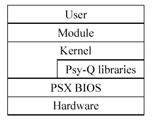


---

# FF7/Kernel/Memory management {#ff7kernelmemory_management}

- [FF7/Kernel/Memory management](#ff7kernelmemory_management){#toc-ff7kernelmemory_management}
  - [RAM management](#ram_management){#toc-ram_management}
  - [VRAM management](#vram_management){#toc-vram_management}
  - [PSX CD-ROM management](#psx_cd_rom_management){#toc-psx_cd_rom_management}


## RAM management {#ram_management}

No matter what module is banked into memory, there is a section of memory 4,340 bytes long (0x10F4 bytes) that is reserved for all the variables for the entire game. This entire image is called the \"[Savemap](FF7/Savemap "Savemap"){.wikilink}\". When it\'s time to save a game, this section of memory is copied to non-volatile ram, such as a hard disk or memory card.

Within the [Savemap](FF7/Savemap "Savemap"){.wikilink} there are 5 banks of memory that are directly accessible by the [field scripting language](FF7/Field_script "field scripting language"){.wikilink}. These can either be accessed 8 bits or 16 bits at a time depending on the field command argument. The following table is basic memory map of the banks and how they relate to the [Savemap](FF7/Savemap "Savemap"){.wikilink}. There is also an allocation for 256 bytes for temporary field variables. These are not used between field files and are not saved.

| Offset | 8 Bit Field Bank | 16 Bit Filed Bank | Description |
|:--:|:--:|:--:|:--:|
| 0x0000 | N/A | N/A | Beginning of [Savemap](FF7/Savemap "Savemap"){.wikilink} |
| 0x0BA4 | 0x1 | 0x2 | Field Script Bank 1 |
| 0x0CA4 | 0x3 | 0x4 | Field Script Bank 2 |
| 0x0DA4 | 0xB | 0xC | Field Script Bank 3 |
| 0x0EA4 | 0xD | 0xE | Field Script Bank 4 |
| 0x0FA4 | 0xF | 0x7 | Field Script Bank 5 |
| 0x10F4 | N/A | N/A | End of [Savemap](FF7/Savemap "Savemap"){.wikilink} |

|  |  |  |  |
|----|----|----|----|
| width: 80px\" \| N/A | width: 80px\" align=\"center\" \| 0x5 | width: 100px\" align=\"center\" \| 0x6 | width: 250px\" \| Temporary field variables (256 bytes) |

## VRAM management {#vram_management}

The kernel is in charge of allocating, caching, and displaying in Video RAM. In the case of the PSX, port, the Playstation only has 1 megabyte of VRAM which makes this task a little complex. This is alleviated somewhat by using the PSX\'s VRAM caching system.

The PSX video memory can best be seen as a rectangular \"surface\" made up of 2048x512 pixels. A slight caveat to this model is that the PSX can hold multiple color depths in VRAM at the same time. To make the VRAM a little easier to visualize, This document represents VRAM as a 1024x512 matrix to allow for some color depth in either direction and to minimize some extreme skewing of the video buffers.

\
The following is a typical state of VRAM during game play.

The two game screens on the left side are the video buffer and the back buffer. The patchwork of graphics on the top right are the field graphics for that scene. The bottom row consists of cached graphics and special effects and on right semi-permanent and permanent textures for the game.

\
The following is a schematic representation of VRAM and all it\'s texture boundaries.

Here the sections of VRAM are much more visible. The large cyan areas are the video frame buffers. The PSX uses a standard double page buffer to animate the game. The blank areas above and below the frame buffers are blank to allow for a correct V-sync. The dark blue areas to the right of the frame buffers are when the game plays 24 bit movies. This requires a slightly larger display and the first two texture caches are overwritten. During times in the game where no movies can take place, such as Battle, textures are commonly placed here.

The magenta area under the video buffers is the Color Look Up Tables (CLUT). This is where the texture palettes are stored. This also allows the PSX to display multiple color depths at the same time. The red area to the right is extra CLUT space when it is needed and there are no textures cached there.

The green area on the right is the permanent menu textures and the yellow is where the menu font is located.

All the blank rectangles are the texture cache boundaries. In order of volatility, the top two rows of cache space are overwritten from left to right, and then the bottom rows are overwritten. The textures on the bottom right are barely overwritten except for key places.

\

## PSX CD-ROM management {#psx_cd_rom_management}

One of the big rules on PSX development is that direct hardware access is a prohibited. Everything must go through the BIOS or the program will risk being incompatible with later systems. This means not only from PSX to PS2, but also all the trivial hardware revisions as well. This creates a problem for the kernel. During module transitions (for example, going from \"Map\" to \"Battle\"), the engine actually \"preloads\" the next module while the current one is still executing. This loading of data can\'t be done with a simple open() or read() BIOS syscall. Whenever you enter the BIOS, the rest of the system comes to a screeching halt until it is exited.

This problem is solved by the FF7 actually controlling the CD-ROM access itself though faster, low-level BIOS calls. The kernel can only load 8 kilobytes at a time in this \"quick mode\" In this mode the kernel also only references files by what sector of the CD-ROM the data is located on, not by filename.


---

## Images

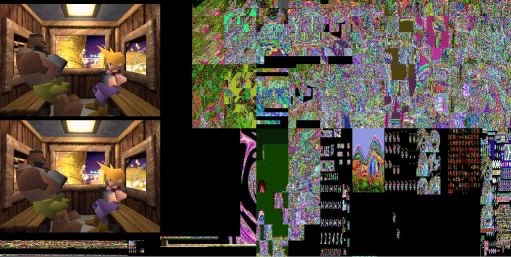

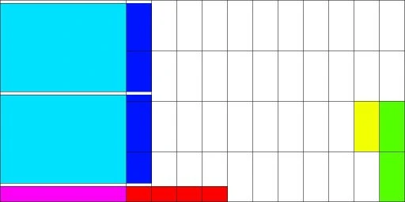


---

# FF7/Kernel/Kernel.bin

- [FF7/Kernel/Kernel.bin](#ff7kernelkernel.bin){#toc-ff7kernelkernel.bin}
  - [Important Files](#important_files){#toc-important_files}
  - [The KERNEL.BIN Archive](#the_kernel.bin_archive){#toc-the_kernel.bin_archive}
  - [The KERNEL2.BIN Archive](#the_kernel2.bin_archive){#toc-the_kernel2.bin_archive}


## Important Files {#important_files}

|   PSX Version    |        PC Version        |
|:----------------:|:------------------------:|
| /INIT/KERNEL.BIN | /DATA/KERNEL/KERNEL.BIN  |
|                  | /DATA/KERNEL/KERNEL2.BIN |

## The KERNEL.BIN Archive {#the_kernel.bin_archive}

The file KERNEL.BIN archive is in [BIN-GZIP format](FF7/Kernel/Low_level_libraries#BIN-GZIP_Type_Archives "BIN-GZIP format"){.wikilink}. It consists of 27 gziped sections concatenated together with a 6 byte header for each. This file is the same both on the PC and PSX versions. This holds all the static data and menu text for the game, with a look up table at the beginning of the section. The first 9 sections of data (i.e. The non-text related items) are in typical BIN file archive format. Sections 10-27 are [FF Text files](FF7/FF_Text "FF Text files"){.wikilink}. The text sections have a header of pointers at the beginning of each section and point to a text block below.

The KERNEL.BIN file consists of the following sections.

| File | Data | Offset |
|----|----|----|
| 1 | [Command data](FF7/Command_data "Command data"){.wikilink} | 0x0006 |
| 2 | [Attack data](FF7/Attack_data "Attack data"){.wikilink} | 0x0086 |
| 3 | [Battle and growth data](FF7/Battle_and_growth_data "Battle and growth data"){.wikilink} | 0x063A |
| 4 | [Initialization data](FF7/Character_starting_stats "Initialization data"){.wikilink} | 0x0F7F |
| 5 | [Item data](FF7/Item_data "Item data"){.wikilink} | 0x111B |
| 6 | [Weapon data](FF7/Weapon_data "Weapon data"){.wikilink} | 0x137A |
| 7 | [Armor data](FF7/Armor_data "Armor data"){.wikilink} | 0x1A30 |
| 8 | [Accessory data](FF7/Accessory_data "Accessory data"){.wikilink} | 0x1B73 |
| 9 | [Materia data](FF7/Materia_data "Materia data"){.wikilink} | 0x1C11 |
| 10 | Command descriptions | 0x1F32 |
| 11 | Magic descriptions | 0x2199 |
| 12 | Item descriptions | 0x28D4 |
| 13 | Weapon descriptions | 0x2EE2 |
| 14 | Armor descriptions | 0x307B |
| 15 | Accessory descriptions | 0x315F |
| 16 | Materia descriptions | 0x3384 |
| 17 | Key Item descriptions | 0x3838 |
| 18 | Command Names | 0x3BE2 |
| 19 | Magic Names | 0x3CCA |
| 20 | Item Names | 0x4293 |
| 21 | Weapon Names | 0x4651 |
| 22 | Armor Names | 0x4B02 |
| 23 | Accessory Names | 0x4C4B |
| 24 | Materia Names | 0x4D90 |
| 25 | Key Item Names | 0x5040 |
| 26 | Battle and Battle-Screen Text | 0x5217 |
| 27 | Summon Attack Names | 0x5692 |

## The KERNEL2.BIN Archive {#the_kernel2.bin_archive}

On the PC version there exists a secondary kernel archive called KERNEL2.BIN. This archive contains only sections 10-27 (Text data) of KERNEL.BIN. The data was ungzipped from the original archive, concatenated together, and then LZSed into a single archive with a 4 byte header giving the length of the file.

The maximum allotted storage space on the PC version for all un-LZSed data in the kernel2.bin is 27KB (27648 bytes). This means that the total size of the extracted files (text and pointers) must be less than this.

---

# FF7/Kernel/Low level libraries {#ff7kernellow_level_libraries}

- [FF7/Kernel/Low level libraries](#ff7kernellow_level_libraries){#toc-ff7kernellow_level_libraries}
  - [PC to PSX comparison](#pc_to_psx_comparison){#toc-pc_to_psx_comparison}
  - [Data Archives](#data_archives){#toc-data_archives}


## PC to PSX comparison {#pc_to_psx_comparison}

The files and data formats used in the PSX version of FF7 and it\'s PC port are conceptually the same thing, and accomplish the same tasks. That being said, they both have wildly different formats, both of which were derived from a third original format that is also somewhat different to the first two.

The original PSX FF7 was created in part using Sony\'s Psy-Q development library. This library uses common formats that are \"native\" to the PSX. Often, a toolkit was used to convert common development-based formats, such as a TGA bitmap or a palleted GIF file, to something a little more suited to Psy-Q, which would be a [TIM file](PSX/TIM_format "TIM file"){.wikilink}.

During the porting process to the PC, some of the original artwork (and artists for that matter) were no longer available. This resulted in the port team having to use the Psy-Q versions of many files, which were ill suited for the PC architecture. In our example, the [TIM file](PSX/TIM_format "TIM file"){.wikilink} was converted to a TEX file, which would be manipulated in the PC\'s video memory a little more efficiently. Sometimes the original artwork was available, such as the pictures of the characters within the menu, or the original MIDI files. Most often times it was not.

To make things a little more confusing, both systems also archive their data files in different ways, making the extraction and rendering of each file a bit of a bear. For the most part the data within each file is the same thing, just a little switched around. Here, we will cover the more generic files first, and then common files used in each module.

## Data Archives {#data_archives}

To save space, quicken access time, and to obfuscate the file structure a little, most of the data files are stored in some kind of archive format. The archives remove such useful items as subdirectories and logical data placement. There is no real \"native\" format these are based on.

### BIN archive data format {#bin_archive_data_format}

The BIN format comes as two different types. They both have the same extension, so one must open the file to see which format is which. They are best described as BIN Types and BIN-GZIP types.

#### BIN Type Archives {#bin_type_archives}

These are uncompressed archives. The header is 4 bytes long and gives the length of the file without the header and then the data beyond that.

#### BIN-GZIP Type Archives {#bin_gzip_type_archives}

Unless otherwise noted, these have a 6 byte header. After this are many gziped sections concatenated together.

<table>
<thead>
<tr>
<th><p>Offset</p></th>
<th><p>Length</p></th>
<th><p>Description</p></th>
</tr>
</thead>
<tbody>
<tr>
<td><p>0x0000</p></td>
<td><p>2 bytes</p></td>
<td><p>Length of gzipped section 1</p></td>
</tr>
<tr>
<td><p>0x0002</p></td>
<td><p>2 bytes</p></td>
<td><p>Length of ungzipped section 1</p></td>
</tr>
<tr>
<td><p>0x0004</p></td>
<td><p>2 bytes</p></td>
<td><p>File type*</p></td>
</tr>
<tr>
<td><p>0x0006</p></td>
<td><p>Varies</p></td>
<td><p>[0x1F8B080000000000...] - Gzip header 1 and data</p></td>
</tr>
<tr>
<td><p>Varies</p></td>
<td><p>2 bytes</p></td>
<td><p>Length of gzipped section 2</p></td>
</tr>
<tr>
<td><p>Varies</p></td>
<td><p>2 bytes</p></td>
<td><p>Length of ungzipped section 2</p></td>
</tr>
<tr>
<td><p>Varies</p></td>
<td><p>2 bytes</p></td>
<td><p>File type*</p></td>
</tr>
<tr>
<td><p>Varies</p></td>
<td><p>Varies</p></td>
<td><p>[0x1F8B080000000000...] - Gzip header 2 and data</p></td>
</tr>
<tr>
<td colspan="3" style="text-align: center;"><p>...</p></td>
</tr>
</tbody>
</table>

\
*\** This particular value might be ignored by the whatever method is decompressing these archive types. Within archives it declares that the compressed file is a particular type. These values seem to be unique to the particular archive that is being opened and is not consistent between archives.

Example 1: Within the [KERNEL.BIN](FF7/Kernel/Kernel.bin "KERNEL.BIN"){.wikilink} the first nine files are all different data sets so are numbered sequentially 0-8. All remaining files are text types and get labeled as type 9.\
Example 2: Within the WINDOW.BIN file there are three files. The first two are type \"0\" and are textures. The third file is type \"1\" and not a texture.

### LZS Archives {#lzs_archives}

The [LZS format](FF7/LZS_format "LZS format"){.wikilink} is used throughout the PSX version of Final Fantasy 7, often ending with the .lzs extension. LZS itself stands for Lempel-Ziv-Shannon-Fano, Statistical plus Arithmetic. It was originally developed by [Professor Haruhiko Okumura](http://oku.edu.mie-u.ac.jp/~okumura/index-e.html) based on the work of [Abraham Lempel](http://www.hpl.hp.com/about/bios/abraham_lempel.html) and [Jacob Ziv](http://www.marconifoundation.org/pages/dynamic/fellows/fellow_details.php?roster_id=23).

### LGP Archives {#lgp_archives}

The LGP file format is only used for the PC port of Final Fantasy 7. These are large \"volume\" type archives that hold most of the game\'s data. These archives can hold thousands of files. Unlike the BIN or LZS type files, this archive does reference the data within it by filename. Its file format is explained [here](FF7/LGP_format "here"){.wikilink}.

## Textures

A texture is just a picture that is placed into video memory. It is later manipulated by the engine and displayed on the screen. The native format of a texture was the Psy-Q [TIM](PSX/TIM_format "TIM"){.wikilink} (Texture Image Map). This is used as the native format for the PSX version as well, with a few caveats explained below. The file can hold multiple color look up tables. This was one of the reasons why a video card on the PC that could do palleted data at high color depths was needed.

### TIM texture data format for PSX {#tim_texture_data_format_for_psx}

The [TIM files](PSX/TIM_format "TIM files"){.wikilink} are found both on raw format and also within several archives, including [BIN](FF7/Kernel/Low_level_libraries#BIN_archive_data_format "BIN"){.wikilink}, [LZS](FF7/Kernel/Low_level_libraries#LZS_Archives "LZS"){.wikilink}, or even MNU. The format proper has the ability to contain 24 bit bitmaps, but is not used in FF7. The format was created because the PSX does not have direct access to it\'s VRAM, and must go through the [GPU](PSX/GPU "GPU"){.wikilink} for any graphic access. [A TIM file](PSX/TIM_format "A TIM file"){.wikilink} is a clean way to load a texture and color look up table into VRAM.

### TEX texture data format for the PC {#tex_texture_data_format_for_the_pc}

TEX files are texture files for the PC. The format for these files are located [here](FF7/TEX_format "here"){.wikilink}.

## File formats for 3D models {#file_formats_for_3d_models}

During the development process, 3D models contain a good deal of information needed by the artist every time they save or load the model. When the model is finished, it is often exported and broken up into smaller files with many unneeded attributes stripped from them. When the models for FF7 were created, they were exported into Psy-Q\'s 3D library formats. These include [resource data (.RSD)](PSX/RSD "resource data (.RSD)"){.wikilink}, polygon data (.PLY), polygon groups (.GRP), materials (.MAT), [textures (.TIM)](PSX/TIM_file "textures (.TIM)"){.wikilink}, [skeletal hierarchy (.HRC)](PSX/HRC "skeletal hierarchy (.HRC)"){.wikilink}, and animation (.ANM).

The models are handled differently between modules. The models in the \"battle\" modules have a different animation system than the field models. When the models were converted to the PC version, they were taken from the Psy-Q formats to a more PC-friendly one. Some are even the original, uncompiled, Psy-Q files.

### Model formats for PSX {#model_formats_for_psx}

The Playstation models are stored in the following directories, \\ENEMY1 \\ENEMY2 \\ENEMY3 \\ENEMY4 \\ENEMY5 \\ENEMY6 (battle models), \\FIELD (field models and field character models), \\MAGIC (Summon magic), and \\STAGE1 \\STAGE2 (battle scenes). Battle model names for special characters and party characters are stored in \\ENEMY6, all models of this type end in an .LZS extension. The same goes with summon magic used they are stored with there animations etc. in \\MAGIC with a .LZS extension. The only exception to this extension is the FIELD models, which use the extensions BSX and BCX for scene models and character models respectively. The [Playstation battle model format](FF7/Playstation_Battle_Model_Format "Playstation battle model format"){.wikilink}, is different than the [Playstation field model format](FF7/Field/BSX "Playstation field model format"){.wikilink}, also the [FF7/Playstation battle scene format](FF7/Playstation_battle_scene_format "FF7/Playstation battle scene format"){.wikilink}, is similiar but not identical to the [Playstation battle model format](FF7/Playstation_Battle_Model_Format "Playstation battle model format"){.wikilink}. The [Playstation magic model](FF7/Playstation_magic_model "Playstation magic model"){.wikilink} format is a work in progress.

### Model Formats for PC {#model_formats_for_pc}

The PC models are stored in the LGP files in the /DATA directory. The names for the models were obfuscated a little. The data can be found in the [Hierarchy files (.HRC)](PSX/HRC "Hierarchy files (.HRC)"){.wikilink}, [Resource data files (.RSD)](PSX/RSD "Resource data files (.RSD)"){.wikilink}, and [Polygon files (.P)](FF7/P "Polygon files (.P)"){.wikilink}.

---

# FF7/LZSS format {#ff7lzss_format}

- [FF7/LZSS format](#ff7lzss_format){#toc-ff7lzss_format}
  - [Format](#format){#toc-format}
  - [LZSS compression](#lzss_compression){#toc-lzss_compression}
  - [Reference format](#reference_format){#toc-reference_format}
  - [Example](#example){#toc-example}
  - [Complications](#complications){#toc-complications}


#### Format

The LZSS archive has a very small header at 0x00 that has the length of the compressed file as an unsigned 32 bit integer. After that is the compressed data.
Some files use the .lzs extension, probably to make the extension 3 characters long. It has caused some confusion, since LZS is a different compression method.

#### LZSS compression {#lzss_compression}

FF7 uses LZSS compression on some of their files, as devised by Professor Haruhiko Okumura. LZSS data works on a control byte scheme.
Each block in the file begins with a single byte indicating how much of the block is uncompressed (\'literal data\'), and how much is compressed (\'references\'). You read the bits LSB-first, with 0=reference, 1=literal.

Literal data means just that: read one byte in from the source (compressed) data, and write it straight to the output.

References take up two bytes, and are essentially a pointer to a piece of data that\'s been written out (i.e. is part of the data you\'ve already decompressed). LZSS uses a 4KiB buffer, so it can only reference data in the last 4KiB of data.

#### Reference format {#reference_format}

A reference takes up two bytes, and has two pieces of information in it: offset (where to find the data, or which piece of data is going to be repeated), and length (how long the piece of data is going to be). The two reference bytes look like this:

`OOOOOOOO  OOOOLLLL`\
\
`(O = Offset, L = Length)`

The 1st byte it the least significant byte of the offset. The second byte has the remaining 4 bits of the offset as it\'s **high** nibble, so some shifting is required to extract it properly. The remaining 4 bits is the length minus 3.

So you get a 12-bit offset and a 4-bit length, but both of these values need modifying to work on directly. The length is easy to work with: just add 3 to it. This is because if a piece of repeated data was less than 3 bytes long, you wouldn\'t bother repeating it - it\'d take up no more space to actually just put literal data in. So all references are at least 3 in length. So a length of 0 means 3 bytes repeated, 1 means 4 bytes repeated, so on.

Since we have 4 bits available, that gives us a final length ranging from 3-18 bytes long. That also means the absolute maximum compression we can ever get using LZSS is a touch under 9:1, since the best possible is to replace 18 bytes of data with two bytes of reference, and then you have to add control bytes as well.

Offset needs a bit work doing on it, depending on how you\'re actually holding your data. If all you have is an input buffer and an output buffer, what you really need is an output position in your buffer to start reading data from. In other words, if you\'ve already written 10,000 bytes to your output, you want to know where to retrieve the repeated data from - it could fall anywhere in the past 4K of data (i.e. from 5904 through to 9999 bytes).

Here\'s how you get it:

`real_offset = tail - ((tail - 18 - raw_offset) mod 4096)`

Here, \'tail\' is your current output position (eg. 10,000), \'raw_offset\' is the 12-bit data value you\'ve retrieved from the compressed reference, and \'real_offset\' is the position in your output buffer you can begin reading from. This is a bit complex because it\'s not exactly the way LZSS traditionally does decompression.

If you use a 4KiB buffer, you can use the offset directly. The offset is absolute, and not relative to the cursor position or the position in the input stream. You should initialize the buffer position to 0xFEE and not zero. The buffer content should be initialized to zero.

Once you\'ve got to the start position for your reference, you just copy the appropriate length of data over to your output, and you\'ve dealt with that piece of data.

#### Example

If we\'re at position 1000 in our output, and we need to read in a new control byte because we\'ve finished with the last one. The next data to look it is:

`0xFC, 0x53, 0x12 .....`

We read in a control byte: 0xFC. In binary, that\'s 11111100. That informs us that the current block of data has two compressed offsets (@ 2 bytes each), followed by 6 literal data bytes. Once we\'d read in the next 10 bytes (the compressed data plus the literal data), we\'d be ready to read in our next control byte and start again.

Looking at the first compressed reference, we read in \$53 \$12. That gives us a base offset of \$153 (the 53 from the first byte, and the \'1\' from the second byte makes up the higher nybble). The base length is \$2 (we just take the low nybble of the second byte).

Our final length is obviously just 5.

Our position in output is still 1000. So our final offset is:

`= 1000 - ((1000 - 18 - 339) and $FFF)`\
` `

The 339 is just \$153 in decimal. The (and \$FFF) is a quick way to do modulus 4096.

`= 1000 - (643 and 0xFFF)`\
` = 1000 - 643`\
` = 357`\
` `

So our final offset is 357. We go to position 357 in our output data, read in 5 bytes (remember the length?), then write those 5 bytes out to our output. Now we\'re ready to read in the next bit of data (another compressed reference), and do the procedure again.

#### Complications

Unfortunately, that doesn\'t quite cover everything - there\'s two more things to be aware of when decompressing data that will ruin you when using FF7 files, since they do use these features.

First, if you end up with an negative offset, i.e. reading data from \'before the beginning of the file\', write out nulls (zero bytes). That\'s because the compression buffer is, by default, initialized to zeros; so it\'s possible, if the start of the file contains a run of zeros, that the file may reference a block you haven\'t written. For example, if you\'re at position 50 in your output, it\'s possible you may get an offset indicating to go back 60 bytes to offset -10. If you have to read 5 bytes from there, you just write out 5 nulls. However, you could have to read 15 bytes from there. In that case, you write out 10 nulls (the part of the data \'before\' the file start), then the 5 bytes from the beginning of the file.

Secondly, you can have a repeated run. This is almost the opposite problem: when you go off the end of your output. Say you\'re at offset 100 in your output, and you have to go to offset 95 to read in a reference. This is okay, but if the reference length is \>5, you loop the output. So if you had to write out 15 bytes, you\'d write out the five bytes that were available, then write them out again, then again, to make up the 15 bytes you needed.

The FF7 files use both of these \'tricks\', so you can\'t ignore them.

If you use a circular 4KiB buffer, you can ignore these issues completely, as long as you do a one-byte-at-a-time copy for the references.

---

# FF7/LGP format {#ff7lgp_format}

- [FF7/LGP format](#ff7lgp_format){#toc-ff7lgp_format}
  - [LGP Archive format for PC by Ficedula](#lgp_archive_format_for_pc_by_ficedula){#toc-lgp_archive_format_for_pc_by_ficedula}


### LGP Archive format for PC by [Ficedula](User:Ficedula "Ficedula"){.wikilink} {#lgp_archive_format_for_pc_by_ficedula}

This section explains how the LGP archives from FF7 PC are constructed. If you\'re looking for a tool that already manages LGP archives, try [Ficedula](User:Ficedula "Ficedula"){.wikilink}\'s [LGP Editor](http://sylphds.net/f2k3/index.html).

Essentially the LGP file is split up into four (maybe less, depending on how you count it) sections.

1.  File header/Table of contents
2.  CRC code
3.  Actual data
4.  File terminator

#### Section 1: File Header {#section_1_file_header}

This contains two parts: A header of fixed size, then the table of contents.

The first item is 12 bytes containing the file creator. This is a standard string, except it is \"rightaligned\". In other words the blank space comes before the actual text, not after. In FF7 it\'s always \"SQUARESOFT\" preceded by two nulls to make it 12 bytes. The only other thing you might see is the header \"FICEDULA-LGP\", which I use to indicate a file is an LGP \*patch\* one of my programs has constructed, not a complete archive.

Next is a four-byte integer saying how many files the archive contains.

Following this is the table of contents (TOC): One entry per file.

Each entry in the TOC has the following structure:

<table>
<thead>
<tr>
<th><p>Offset</p></th>
<th><p>Length</p></th>
</tr>
</thead>
<tbody>
<tr>
<td><p>20 bytes</p></td>
<td><p>Null terminated string, giving filename</p></td>
</tr>
<tr>
<td><p>4 byte integer</p></td>
<td><p>Position in this file where data starts for the file</p></td>
</tr>
<tr>
<td><p>1 byte</p></td>
<td style="background: rgb(155,155,104)"><p>Some sort of check code. File attributes? Normally seems to be<br />
14 but it does vary.</p></td>
</tr>
<tr>
<td><p>2 byte short</p></td>
<td style="background: rgb(155,155,104)"><p>Something to do with duplicate file names. If a name is unique it is 0, otherwise it is assigned a value based on existing duplicates. (Hard to explain)</p></td>
</tr>
</tbody>
</table>

#### Section 2: CRC Code {#section_2_crc_code}

This code is used to validate the LGP archive. The bad news is I have no idea how to make it (I\'ve figured out how to decode it, ie. find out whether the archive is valid, but I can\'t create my own). The good news is you don\'t need to! The only thing this CRC is based on is the number of files in the archive (maybe the filenames too, haven\'t checked that). Anyway, the TOC is the only thing this check relates to. So if you\'re replicating an archive from FF7 for use in the game with the same number of files and filenames you can just copy the CRC section from an existing file.

Normally it\'s 3602 bytes long (one archive may be different, possibly MAGIC.LGP). Anyway, one normally-safe way of calculating the CRC size is to find the end of the TOC and the beginning of the first file. Anything in between is probably CRC code (this is not guaranteed to work. It works with \"official\" archives but editors - such as [LGP Editor](http://www.ficedula.com/) - can alter the TOC to achieve extra things).

#### Section 3: Actual Data {#section_3_actual_data}

The data from the files. However it\'s not that simple: the TOC doesn\'t list how long each file is (somewhat useful). It\'s done here. The offset in the TOC is actually the position of yet another file header. Format is:

|   Size   | Description                             |
|:--------:|-----------------------------------------|
| 20 bytes | Null terminated string, giving filename |
| 4 bytes  | File length                             |
|  Varies  | The file data itself                    |

#### Section 4: Terminator {#section_4_terminator}

After the last piece of data comes the file descriptor. This is a simple string, except instead of being null-terminated it\'s terminated by the end of the file. It\'s \"FINAL FANTASY 7\" for all archives, except LGP patches, where it\'s \"LGP PATCH FILE\".

#### Notes

The game is remarkably flexible about LGP archives. So long as the TOC and the CRC data is intact it\'ll accept just about anything.

- Example 1: The filename in the TOC and in the actual file header don\'t have to match. It only checks the TOC.
- Example 2: You can point two entries in the TOC at the same data and it works.
- Example 3: You can have ANY junk in the data section so long as all the TOC entries point to a valid file header. Not every piece of data has to be \"accounted\" for by the TOC. There can be data not used.

[LGP Editor](http://www.ficedula.com/) uses this to its advantage in the Advanced Editor. If you want to replace a file in an LGP archive with your own copy, it just puts the file on the end of the LGP, writes a new file terminator, and updates the TOC to point at the new file. It even lets you link two TOC entries to the same data or have \"inactive\" files in the archive that aren\'t referenced by any TOC entry.

I don\'t know whether the file terminator has to be intact, but for safety\'s sake my editor preserves it. The CRC must be present and correct. Also, if you\'re replacing an archive with you\'re own custom version make sure it has filenames in the TOC matching the ones in the old one.

The game doesn\'t check archive sizes as long as all filenames are present. So if you want, you could replace an archive containing 95 files with a 98-file archive, so long as 95 of those 98 names matched those present in the original 95-file archive. (However there\'s no point in doing this when the game won\'t use any files other than the 95 it\'s expecting to find).

There are reports on [Qhimm\'s board](http://forums.qhimm.com/) that once you\'ve altered an archive and the game refuses to read it, it won\'t ever read it until you reinstall - even if you fix the problem/restore from a backup. The idea was generally scorned and ignored, but I\'ll mention it because something like that happened to me. No solid conclusion can be drawn here.

Sometimes, there are data \"gaps\" in the file that don\'t appear to be referenced by any file - even by an inactive file. If you\'re only using the TOC method to get at files (the easy way) then you won\'t notice this anyway. However, if you\'re stepping through the file header by header, even reading the unused ones, this can cause problems. If you use my program to update a file with one that\'s smaller than the original (can happen) then it writes it in, but leaves a gap after it (of course). However, to help you out, after the end of the file, it writes a 4 byte integer saying how much more space to skip over to reach the next file header. This really doesn\'t affect many things - only tools (like my Advanced LGP Editor) that bypass the TOC to construct their own file lists. FF7 never notices a thing.

### Useful downloads {#useful_downloads}

Below there are links to known programs that are capable to edit LGP archives:

- [LGP Tools](http://www.sylphds.net/f2k3/programs/lgptools/lgptools160.zip) - with an Advanced LGP Editor allowing edit archive thoughoutly
- [Emerald](http://elentor.com/Projetos/FF7-Tools/Extracting/Emerald.zip) - has mass extracting/repacking function
- [Unmass](http://mirex.mypage.sk/index.php?selected=1#Unmass) - general file extractor with LGP archives support

---

# PSX/TIM format {#psxtim_format}

- [PSX/TIM format](#psxtim_format){#toc-psxtim_format}
  - [Introduction](#introduction){#toc-introduction}
  - [File layout](#file_layout){#toc-file_layout}
  - [Header](#header){#toc-header}
  - [CLUT (color lookup table)](#clut_color_lookup_table){#toc-clut_color_lookup_table}
  - [Image data](#image_data){#toc-image_data}


## Introduction

A TIM file is a standard image file format for the [Sony PlayStation](PSX "Sony PlayStation"){.wikilink}. The file structure closely mimics the way textures are managed in the [frame buffer](PSX/frame_buffer "frame buffer"){.wikilink} by the [GPU](PSX/GPU "GPU"){.wikilink}. TIM files are [little endian](Little_endian "little endian"){.wikilink}-based.

\

## File layout {#file_layout}

A TIM file is made up of three conceptual blocks; the header, the color lookup table (CLUT) and the image data. The CLUT block and the image data block have the same basic layout and are also treated the same way when loading a TIM file into the PlayStation frame buffer. Also, the CLUT block is optional and technically does not need to be present, even when the image data consists of color indices. Such image data is assumed to refer to *some* color lookup table, but not necessarily one stored in the same TIM file. In almost all cases though, the CLUT is included in the same TIM file as the image data using it and can thus be assumed to be applicable.

<center>


</center>

\

## Header

The header starts with a \'tag\' byte; this value is constant for all TIM files and must be 0x10. The immediately following byte denotes the version of the file format. At present, only version \'0\' TIM files are known to exist.

The next 32-bit word contains specific flags denoting the basic properties of the TIM file. The BPP (Bits Per Pixel) value denotes the bit depth of the image data, according to the following values:

**`00`**`  4-bit (color indices)`\
**`01`**`  8-bit (color indices)`\
**`10`**`  16-bit (actual colors)`\
**`11`**`  24-bit (actual colors)`

The CLP (Color Lookup table Present) flag simply denotes whether the CLUT block is present in the TIM file. This flag is typically set when BPP is 00 or 01, and cleared otherwise.

\

## CLUT (color lookup table) {#clut_color_lookup_table}

The CLUT starts with a simple 32-bit word telling the length, in bytes, of the entire CLUT block (including the header). Following that is a set of four 16-bit values telling how the CLUT data should be loaded into the frame buffer. These measurements are in frame buffer pixels, which are 16-bit. Each CLUT is stored in a rectangular portion of the frame buffer, which is typically 16 or 256 pixels wide (corresponding to 4-bit or 8-bit color indices). The rows define one or more \'palettes\' which can be selected at runtime to use when drawing a color-indexed image.

<center>


</center>

The length of the CLUT data is always *width* � *height* � 2 bytes, precisely the amount of data needed to fill a rectangular area of *width* � *height* pixels in the frame buffer. Also, the x coordinate of the CLUT needs to be an even multiple of 16, but the y coordinate can be any value between 0-511. Typically they are stored directly under the front/back buffers. Each 16-bit value is interpreted as real color frame buffer pixels, which have the following format:

<center>


</center>

The red, green and blue samples behave like any RGB-defined color, but the STP (special transparency processing) bit has varying special meanings. Depending on the current transparency processing mode, it denotes if pixels of this color should be treated as transparent or not. If transparency processing is enabled, pixels of this color will be rendered transparent if the STP bit is set. A special case is black pixels (RGB 0,0,0), which **by default** are treated as transparent by the PlayStation *unless* the STP bit is set.

\

## Image data {#image_data}

The image block is structurally identical to the CLUT block and is processed in exactly the same way when loaded into the frame buffer. It starts with a 32-bit word telling the length, in bytes, of the entire image block, then has 4 16-bit values containing the frame buffer positioning information. After that follows the image data, which is always *width* � *height* � 2 bytes long. It is important to realize that the image measurements are in 16-bit frame buffer pixels, which does not necessarily correspond to the size of the contained image. It may help to visualize the entire image data as a *width* � *height* array of 16-bit values, which is then interpreted differently depending on color mode (this is exactly how the PlayStation treats it). To calculate the actual image dimensions, it is thus necessary to take into account the current BPP value (bits per pixel).

<center>


</center>

The image data, while loaded straight into the frame buffer, is structured differently depending on the bit depth of the image. To a TIM file reader, the image data is parsed as a series of 16-bit values with varying interpretations. The most straight-forward interpretation is for 16-bit images (BPP = **10**), in which case the image data has the same format as the frame buffer pixels themselves:

<center>


</center>

The PlayStation is also capable of handling data in 24-bit color (BPP = **11**), in which case the color samples are stored as 3-byte groups. In the event that an image\'s width is an uneven number of pixels, the last byte is left as padding; the first pixel of a new row is always stored at the corresponding first pixel of the frame buffer row. The color samples are stored in the following order:

<center>


</center>

Apart from the two \"real\" color modes, the PlayStation frequently utilizes color indexed images via CLUTs (color lookup tables). Whenever an image with color index data is drawn to the screen, a reference to a CLUT is included and the color indices get replaced with the corresponding value in the table. For 8-bit indexed colors (BPP = **01**), the image pixels are stored two by two in each 16-bit value as follows:

<center>


</center>

These images are used in conjuction with a 256-pixel CLUT. For less color-rich images, 4-bit index colors (BPP = **00**) are also available, for use with a 16-pixel CLUT. These pixels are stored four by four in each 16-bit value:

<center>


</center>


---

## Images

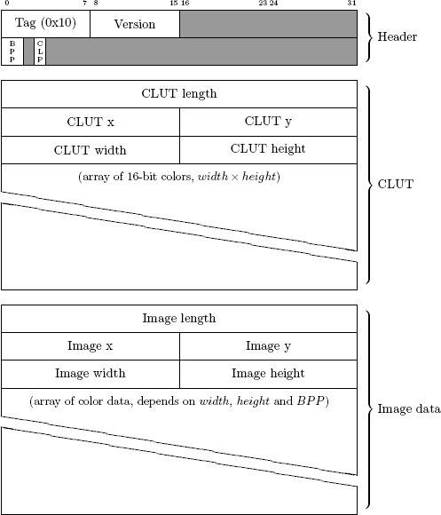

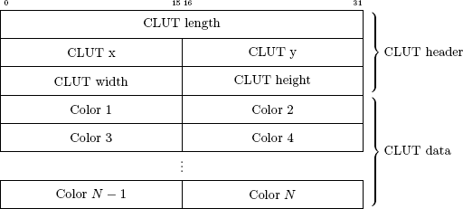

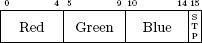

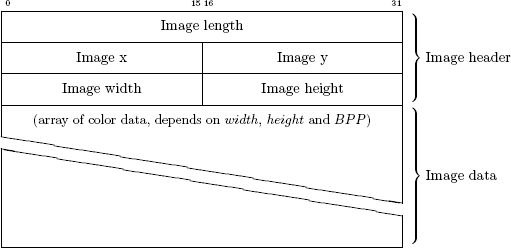


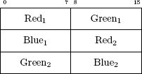

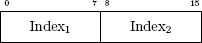

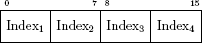


---

# FF7/TEX format {#ff7tex_format}

- [FF7/TEX format](#ff7tex_format){#toc-ff7tex_format}
  - [TEX Texture Data Format for PC by Mirex (Edits by Aali)](#tex_texture_data_format_for_pc_by_mirex_edits_by_aali){#toc-tex_texture_data_format_for_pc_by_mirex_edits_by_aali}


## TEX Texture Data Format for PC by [Mirex](User:Mirex "Mirex"){.wikilink} (Edits by [Aali](User:Aali "Aali"){.wikilink}) {#tex_texture_data_format_for_pc_by_mirex_edits_by_aali}

FF7 PC texture consists of header, an optional palette and bitmap data. Usually data are stored like palletized picture, with bitmap pixels referencing to palette. Color 0 (in palette its usually black) is usually used as transparent color.

*Pixel values of 0 may or may not be transparent, depending on the color key status, more on that later. This also applies to non-paletted formats.*

When bit depth is 16 then data are stored as packed RGB in style RGB555, which means 5 bits per color in one 2 byte entry. I\'m not sure if it is used in FF7 at all, its probably used in FF8.

*The tex format is actually very flexible and can take almost any non-paletted format as long as you describe it properly in the header.*

<table>
<thead>
<tr>
<th style="border: 1px grey; vertical-align: middle; width: 51px; height: 26px; background-color: rgb(130, 130, 130)"><p>Offset</p></th>
<th style="border: 1px grey; vertical-align: middle; width: 126px; height: 26px; background-color: rgb(130, 130, 130)"><p>Size</p></th>
<th style="border: 1px grey; vertical-align: middle; width: 222px; height: 26px; background-color: rgb(130, 130, 130)"><p>Description</p></th>
</tr>
</thead>
<tbody>
<tr>
<td style="border-style: solid none solid solid; border-color: grey; border-width: 1px; vertical-align: top"></td>
<td colspan="2" style="border-style: solid solid solid none; border-color: grey; border-width: 1px"><p>Header</p></td>
</tr>
<tr>
<td><p>0x00</p></td>
<td><p>4 bytes (long)</p></td>
<td><p>Version, must be 1, or FF7 won't load the file</p></td>
</tr>
<tr>
<td><p>0x04</p></td>
<td><p>4 bytes (long)</p></td>
<td><p>Unknown</p></td>
</tr>
<tr>
<td><p>0x08</p></td>
<td><p>4 bytes (long)</p></td>
<td><p>Color key flag</p></td>
</tr>
<tr>
<td><p>0x0C</p></td>
<td><p>4 bytes (long)</p></td>
<td><p>Unknown</p></td>
</tr>
<tr>
<td><p>0x10</p></td>
<td><p>4 bytes (long)</p></td>
<td><p>Unknown</p></td>
</tr>
<tr>
<td><p>0x14</p></td>
<td><p>4 bytes (long)</p></td>
<td><p>Minimum bits per color (D3D driver uses these to determine which texture format to convert to on load)</p></td>
</tr>
<tr>
<td><p>0x18</p></td>
<td><p>4 bytes (long)</p></td>
<td><p>Maximum bits per color</p></td>
</tr>
<tr>
<td><p>0x1C</p></td>
<td><p>4 bytes (long)</p></td>
<td><p>Minimum alpha bits</p></td>
</tr>
<tr>
<td><p>0x20</p></td>
<td><p>4 bytes (long)</p></td>
<td><p>Maximum alpha bits</p></td>
</tr>
<tr>
<td><p>0x24</p></td>
<td><p>4 bytes (long)</p></td>
<td><p>Minimum bits per pixel</p></td>
</tr>
<tr>
<td><p>0x28</p></td>
<td><p>4 bytes (long)</p></td>
<td><p>Maximum bits per pixel</p></td>
</tr>
<tr>
<td><p>0x2C</p></td>
<td><p>4 bytes (long)</p></td>
<td><p>Unknown</p></td>
</tr>
<tr>
<td><p>0x30</p></td>
<td><p>4 bytes (long)</p></td>
<td><p>Number of palettes</p></td>
</tr>
<tr>
<td><p>0x34</p></td>
<td><p>4 bytes (long)</p></td>
<td><p>Number of colors per palette</p></td>
</tr>
<tr>
<td><p>0x38</p></td>
<td><p>4 bytes (long)</p></td>
<td><p>Bit depth</p></td>
</tr>
<tr>
<td><p>0x3C</p></td>
<td><p>4 bytes (long)</p></td>
<td><p>Image Width</p></td>
</tr>
<tr>
<td><p>0x40</p></td>
<td><p>4 bytes (long)</p></td>
<td><p>Image Height</p></td>
</tr>
<tr>
<td><p>0x44</p></td>
<td><p>4 bytes (long)</p></td>
<td><p>Pitch or bytes per row, usually ignored and assumed to be bytes per pixel * width</p></td>
</tr>
<tr>
<td><p>0x48</p></td>
<td><p>4 bytes (long)</p></td>
<td><p>Unknown</p></td>
</tr>
<tr>
<td><p>0x4C</p></td>
<td><p>4 bytes (long)</p></td>
<td><p>Palette flag (this indicates the presence of a palette)</p></td>
</tr>
<tr>
<td><p>0x50</p></td>
<td><p>4 bytes (long)</p></td>
<td><p>Bits per index, always 0 for non-paletted images</p></td>
</tr>
<tr>
<td><p>0x54</p></td>
<td><p>4 bytes (long)</p></td>
<td><p>Indexed-to-8bit flag, never used in FF7</p></td>
</tr>
<tr>
<td><p>0x58</p></td>
<td><p>4 bytes (long)</p></td>
<td><p>Palette size, always number of palettes * colors per palette</p></td>
</tr>
<tr>
<td><p>0x5C</p></td>
<td><p>4 bytes (long)</p></td>
<td><p>Number of colors per palette (again, may be 0 sometimes, the other value will be used anyway)</p></td>
</tr>
<tr>
<td><p>0x60</p></td>
<td><p>4 bytes (long)</p></td>
<td><p>Runtime data, ignored on load</p></td>
</tr>
<tr>
<td><p>0x64</p></td>
<td><p>4 bytes (long)</p></td>
<td><p>Bits per pixel</p></td>
</tr>
<tr>
<td><p>0x68</p></td>
<td><p>4 bytes (long)</p></td>
<td><p>Bytes per pixel, always use this to determine how much data to read, if this is 1 you read 1 byte per pixel, regardless of bit depth</p></td>
</tr>
<tr>
<td style="border-style: solid none solid solid; border-color: black; border-width: 1px; vertical-align: top"></td>
<td colspan="2" style="border-style: solid solid solid none; border-color: black; border-width: 1px"><p>Pixel format (all 0 for paletted images)</p></td>
</tr>
<tr>
<td><p>0x6C</p></td>
<td><p>4 bytes (long)</p></td>
<td><p>Number of red bits</p></td>
</tr>
<tr>
<td><p>0x70</p></td>
<td><p>4 bytes (long)</p></td>
<td><p>Number of green bits</p></td>
</tr>
<tr>
<td><p>0x74</p></td>
<td><p>4 bytes (long)</p></td>
<td><p>Number of blue bits</p></td>
</tr>
<tr>
<td><p>0x78</p></td>
<td><p>4 bytes (long)</p></td>
<td><p>Number of alpha bits</p></td>
</tr>
<tr>
<td><p>0x7C</p></td>
<td><p>4 bytes (long)</p></td>
<td><p>Red bitmask</p></td>
</tr>
<tr>
<td><p>0x80</p></td>
<td><p>4 bytes (long)</p></td>
<td><p>Green bitmask</p></td>
</tr>
<tr>
<td><p>0x84</p></td>
<td><p>4 bytes (long)</p></td>
<td><p>Blue bitmask</p></td>
</tr>
<tr>
<td><p>0x88</p></td>
<td><p>4 bytes (long)</p></td>
<td><p>Alpha bitmask</p></td>
</tr>
<tr>
<td><p>0x8C</p></td>
<td><p>4 bytes (long)</p></td>
<td><p>Red shift</p></td>
</tr>
<tr>
<td><p>0x90</p></td>
<td><p>4 bytes (long)</p></td>
<td><p>Green shift</p></td>
</tr>
<tr>
<td><p>0x94</p></td>
<td><p>4 bytes (long)</p></td>
<td><p>Blue shift</p></td>
</tr>
<tr>
<td><p>0x98</p></td>
<td><p>4 bytes (long)</p></td>
<td><p>Alpha shift</p></td>
</tr>
<tr>
<td><p>0x9C</p></td>
<td><p>4 bytes (long)</p></td>
<td><p>Always 8 - Number of red bits (Not sure what the point of these fields is, they're always ignored anyway)</p></td>
</tr>
<tr>
<td><p>0xA0</p></td>
<td><p>4 bytes (long)</p></td>
<td><p>8 - Number of green bits</p></td>
</tr>
<tr>
<td><p>0xA4</p></td>
<td><p>4 bytes (long)</p></td>
<td><p>8 - Number of blue bits</p></td>
</tr>
<tr>
<td><p>0xA8</p></td>
<td><p>4 bytes (long)</p></td>
<td><p>8 - Number of alpha bits</p></td>
</tr>
<tr>
<td><p>0xAC</p></td>
<td><p>4 bytes (long)</p></td>
<td><p>Red max</p></td>
</tr>
<tr>
<td><p>0xB0</p></td>
<td><p>4 bytes (long)</p></td>
<td><p>Green max</p></td>
</tr>
<tr>
<td><p>0xB4</p></td>
<td><p>4 bytes (long)</p></td>
<td><p>Blue max</p></td>
</tr>
<tr>
<td><p>0xB8</p></td>
<td><p>4 bytes (long)</p></td>
<td><p>Alpha max</p></td>
</tr>
<tr>
<td style="border-style: solid none solid solid; border-color: black; border-width: 1px; vertical-align: top"></td>
<td colspan="2" style="border-style: solid solid solid none; border-color: black; border-width: 1px"><p>End of pixel format</p></td>
</tr>
<tr>
<td><p>0xBC</p></td>
<td><p>4 bytes (long)</p></td>
<td><p>Color key array flag (this indicates the presence of a color key array)</p></td>
</tr>
<tr>
<td><p>0xC0</p></td>
<td><p>4 bytes (long)</p></td>
<td><p>Runtime data</p></td>
</tr>
<tr>
<td><p>0xC4</p></td>
<td><p>4 bytes (long)</p></td>
<td><p>Reference alpha (more on this later)</p></td>
</tr>
<tr>
<td><p>0xC8</p></td>
<td><p>4 bytes (long)</p></td>
<td><p>Runtime data</p></td>
</tr>
<tr>
<td><p>0xCC</p></td>
<td><p>4 bytes (long)</p></td>
<td><p>Unknown</p></td>
</tr>
<tr>
<td><p>0xD0</p></td>
<td><p>4 bytes (long)</p></td>
<td><p>Palette index (runtime data)</p></td>
</tr>
<tr>
<td><p>0xD4</p></td>
<td><p>4 bytes (long)</p></td>
<td><p>Runtime data</p></td>
</tr>
<tr>
<td><p>0xD8</p></td>
<td><p>4 bytes (long)</p></td>
<td><p>Runtime data</p></td>
</tr>
<tr>
<td><p>0xDC</p></td>
<td><p>4 bytes (long)</p></td>
<td><p>Unknown</p></td>
</tr>
<tr>
<td><p>0xE0</p></td>
<td><p>4 bytes (long)</p></td>
<td><p>Unknown</p></td>
</tr>
<tr>
<td><p>0xE4</p></td>
<td><p>4 bytes (long)</p></td>
<td><p>Unknown</p></td>
</tr>
<tr>
<td><p>0xE8</p></td>
<td><p>4 bytes (long)</p></td>
<td><p>Unknown</p></td>
</tr>
<tr>
<td style="border-style: solid none solid solid; border-color: grey; border-width: 1px; vertical-align: top"></td>
<td colspan="2" style="border-style: solid solid solid none; border-color: grey; border-width: 1px"><p>Palette data (ignore this section if palette flag is 0)</p></td>
</tr>
<tr>
<td style="border: 1px grey; vertical-align: top"><p>0xEC</p></td>
<td style="border: 1px grey; vertical-align: top"><p>Palette size * 4</p></td>
<td style="border: 1px grey; vertical-align: top"><p>The raw palette data, always in 32-bit BGRA format</p></td>
</tr>
<tr>
<td style="border-style: solid none solid solid; border-color: grey; border-width: 1px; vertical-align: top"></td>
<td colspan="2" style="border-style: solid solid solid none; border-color: grey; border-width: 1px"><p>Pixel data</p></td>
</tr>
<tr>
<td style="border: 1px grey; vertical-align: top"><p>Varies</p></td>
<td colspan="2" style="border: 1px grey; vertical-align: top"><p>Read width * height * "bytes per pixel" bytes of data. If there's a palette, every pixel is an index into that palette, otherwise use the pixel format specification.</p></td>
</tr>
<tr>
<td style="border-style: solid none solid solid; border-color: grey; border-width: 1px; vertical-align: top"></td>
<td colspan="2" style="border-style: solid solid solid none; border-color: grey; border-width: 1px"><p>Color key array</p></td>
</tr>
<tr>
<td style="border: 1px grey; vertical-align: top"><p>Varies</p></td>
<td colspan="2" style="border: 1px grey; vertical-align: top"><p>Number of palettes * 1 bytes.</p></td>
</tr>
</tbody>
</table>

*Color keying: If the color key flag is zero, no color keying is performed and the color key array is ignored. Otherwise, the current palette index is used to retrieve a single byte from the color key array, this is the new color key flag, zero means don\'t do color keying.* If there is no color key array (and the color key flag is not zero), you should always color key.

*Reference alpha: Only applies to paletted images, if the alpha value sampled from the palette is 0xFE, this value should be replaced with the reference alpha.*

---

# FF7/Menu Module {#ff7menu_module}

- [FF7/Menu Module](#ff7menu_module){#toc-ff7menu_module}
  - [Menu Overview](#menu_overview){#toc-menu_overview}


## Menu Overview {#menu_overview}

### Important Files {#important_files}

|   PSX Version    |       PC Version        |
|:----------------:|:-----------------------:|
|   /MENU/\*.MNU   | /DATA/MENU/MENU_US.LGP  |
| /INIT/WINDOW.BIN | /DATA/KERNEL/WINDOW.BIN |

The menu module is probably the second most powerful module in the game. From here you can set a multitude of environment variables and view character records directly. It\'s really more of a master variable controller than the \"select-o-thing\" it appears to be.

Because the menu can have some rather fancy and complicated management features, it also can be placed in \"Tutorial mode\". This mode, when called from the field module will \"play\" prerecorded menu selections for the player.

Another major function of the menu system is the ability to save your game. This is probably the most powerful and vital part as the Menu has access to every single variable in the system, excluding the script temporary variables.

The Menu module is actually a collection of 13 modules, to which 4 can be called from the field scripting language. The 13 are called Begin, Party, Item, Magic, Eqip, Stat, Change, Limit, Config, Form, Save, Name, and Shop.

## Menu Initialization {#menu_initialization}

Menu has the incredible honor of being initialized right after the kernel. It is also the only module that keeps permanent data in VRAM for other modules to access. In the case of the PSX version, the graphics are loaded out of /INIT/WINDOW.BIN. This is a BIN-GZIP archive described in the Kernel section of this document. WINDOW.BIN has the following format.

| Offset | Length     |       Description       |
|--------|------------|:-----------------------:|
| 0x0000 | 6 bytes    | Header \[0x4827208200\] |
| 0x0006 | 1062 bytes |  Static Menu textures   |
| 0x2754 | 3034 bytes |      Font texture       |
| 0x332E | 163 bytes  |         Unknown         |

After initialization, the first Menu module ran is \"Begin\" The following is a picture of \"Begin\" in VRAM. Things to note is the font and static menu textures from /INIT/WINNDOW.BIN are highlighted in the lower right hand corner.

The following is an expanded picture of the textures from the PC version. The PSX version only differs in texture size and the way the buttons are displayed.

To better see what each section is, here is an annotated version with the more obvious textures labeled.

This is never banked out, however small parts are overwritten and cashed for a while when Battle is loaded, but are overwritten again when menu is loaded. The large blank spot under the menu text is for the Japanese characters that were removed in the non-Japanese version of the game. This spot is unused in these versions.

## Menu Modules {#menu_modules}

The 13 Modules are displayed like the following.

### Begin

This is the begin menu.


This is a screen form the \"save\" module. Begin initializes the menu system and calls save to load a game or to start the game.

### Party


This is the menu you see when you manually enter the menu system. Things to note is the empty box in the lower screen shows what location you are in. Debug rooms have no name most of the time.

### Item

This is the item menu.


### Magic

This is the magic menu.


Both magic and summon are accessed in the same module.

### Equip

The equip menu is a little strange.


Equip and Materia are in the same module.

### Status

This is the status menu.


### Change


Also known as \"Order\", this is the simplest and smallest of all the menu modules, it just changes the order of the party, it uses the party screen as a background.

### Limit

This is the limit menu.


### Config


This is where a good deal of environment variables can be changed.

### Form

This is also known as the PHS screen.


Form can also be called when you need to make a two or three teams of people.

### Save

The all important save screen.


To save time, this will only load the first 80 bytes of each save as a preview. It allows a quick look without having to load the whole memory card, which can take upward of a minute. This is also responsible for loading games too, when called from \"Begin\".

### Name

This is the naming screen.


If you try and use the same name screen twice in a game, you will loose your old name and will be overwritten with the default one.

### Shop

This is your typical shop.


You can, of course, sell items from this module as well.

## Calling the various menus {#calling_the_various_menus}

The PSX version keeps the menu modules contained in a .MNU file. The PC version has the menu code internal to the executable. The highlighted modules can be called with the MENU script command. The MENU command always takes a first argument of 00. The second argument is the Menu ID number, and the third is the argument.

<table>
<thead>
<tr>
<th><p>Module Name</p></th>
<th><p>PSX Filename</p></th>
<th style="text-align: center; background: rgb(104,104,104); width: 100px;"><p>Menu ID Number</p></th>
<th><p>Argument</p></th>
</tr>
</thead>
<tbody>
<tr>
<td><p>Begin</p></td>
<td><p>/MENU/BGINMENU.MNU</p></td>
<td style="text-align: center;"><p>N/A</p></td>
<td><p>N/A</p></td>
</tr>
<tr>
<td style="background: rgb(52,104,155)"><p>Party</p></td>
<td style="background: rgb(52,104,155)"><p>/MENU/PATYMENU.MNU</p></td>
<td style="text-align: center; background: rgb(52,104,155);"><p>0x09</p></td>
<td style="background: rgb(52,104,155)"><p>0x00</p></td>
</tr>
<tr>
<td><p>Item</p></td>
<td><p>/MENU/ITEMMENU.MNU</p></td>
<td style="text-align: center;"><p>N/A</p></td>
<td><p>N/A</p></td>
</tr>
<tr>
<td><p>Magic</p></td>
<td><p>/MENU/MGICMENU.MNU</p></td>
<td style="text-align: center;"><p>N/A</p></td>
<td><p>N/A</p></td>
</tr>
<tr>
<td><p>Equip</p></td>
<td><p>/MENU/EQIPMENU.MNU</p></td>
<td style="text-align: center;"><p>N/A</p></td>
<td><p>N/A</p></td>
</tr>
<tr>
<td><p>Status</p></td>
<td><p>/MENU/STATMENU.MNU</p></td>
<td style="text-align: center;"><p>N/A</p></td>
<td><p>N/A</p></td>
</tr>
<tr>
<td><p>Change</p></td>
<td><p>/MENU/CHNGMENU.MNU</p></td>
<td style="text-align: center;"><p>N/A</p></td>
<td><p>N/A</p></td>
</tr>
<tr>
<td><p>Limit</p></td>
<td><p>/MENU/LIMTMENU.MNU</p></td>
<td style="text-align: center;"><p>N/A</p></td>
<td><p>N/A</p></td>
</tr>
<tr>
<td><p>Config</p></td>
<td><p>/MENU/CNFGMENU.MNU</p></td>
<td style="text-align: center;"><p>N/A</p></td>
<td><p>N/A</p></td>
</tr>
<tr>
<td rowspan="3" style="background: rgb(52,104,155)"><p>Form</p></td>
<td rowspan="3" style="background: rgb(52,104,155)"><p>/MENU/FORMMENU.MNU</p></td>
<td rowspan="3" style="text-align: center; background: rgb(52,104,155);"><p>0x07</p></td>
<td style="background: rgb(52,104,155)"><p>0x00 - Make a party of 3</p></td>
</tr>
<tr>
<td style="background: rgb(52,104,155)"><p>0x01 - Split into 3 groups</p></td>
</tr>
<tr>
<td style="background: rgb(52,104,155)"><p>0x02 - Split into 2 groups</p></td>
</tr>
<tr>
<td style="background: rgb(52,104,155)"><p>Save</p></td>
<td style="background: rgb(52,104,155)"><p>/MENU/SAVEMENU.MNU</p></td>
<td style="text-align: center; background: rgb(52,104,155);"><p>0x0E</p></td>
<td style="background: rgb(52,104,155)"><p>0x00</p></td>
</tr>
<tr>
<td rowspan="10" style="background: rgb(52,104,155)"><p>Name</p></td>
<td rowspan="10" style="background: rgb(52,104,155)"><p>/MENU/NAMEMENU.MNU</p></td>
<td rowspan="10" style="text-align: center; background: rgb(52,104,155);"><p>0x06</p></td>
<td style="background: rgb(52,104,155)"><p>0x00 - Cloud</p></td>
</tr>
<tr>
<td style="background: rgb(52,104,155)"><p>0x01 - Barret</p></td>
</tr>
<tr>
<td style="background: rgb(52,104,155)"><p>0x02 - Tifa</p></td>
</tr>
<tr>
<td style="background: rgb(52,104,155)"><p>0x03 - Aerith</p></td>
</tr>
<tr>
<td style="background: rgb(52,104,155)"><p>0x04 - Red XII</p></td>
</tr>
<tr>
<td style="background: rgb(52,104,155)"><p>0x05 - Yuffie</p></td>
</tr>
<tr>
<td style="background: rgb(52,104,155)"><p>0x06 - Cait Sith</p></td>
</tr>
<tr>
<td style="background: rgb(52,104,155)"><p>0x07 - Vincent</p></td>
</tr>
<tr>
<td style="background: rgb(52,104,155)"><p>0x08 - Cid</p></td>
</tr>
<tr>
<td style="background: rgb(52,104,155)"><p>0x09 - Chocobo</p></td>
</tr>
<tr>
<td style="background: rgb(52,104,155)"><p>Shop</p></td>
<td style="background: rgb(52,104,155)"><p>/MENU/SHOPMENU.MNU</p></td>
<td style="text-align: center; background: rgb(52,104,155);"><p>0x08</p></td>
<td style="background: rgb(52,104,155)"><p>(0x00-0xFF) Shop Number</p></td>
</tr>
</tbody>
</table>

## Menu dependencies {#menu_dependencies}

On the PSX, Menu dependencies are kept in two different directories. The window dressing textures that stay in memory are found in /INIT/WINDOW.BIN and stored as a BIN-GZIP archive. In the MENU directory, some MNU files contain TIM files appended at the end that are displayed when they are loaded. Two of them, PARTYMENU.MNU and FORMMENU.MNU, externally reference TIM files on the disk as they share these resources. SAVEMENU.MNU also externally references the memory card ports.

The PC version has the MNU files internal to the executable and only have external resources. These are kept within the MENU_US.LGP file. The PC version has textures in two different sizes to support the two resolutions the game runs in. The following is a table of the menu resources and where they are located in both the PC and PSX version.

<table>
<thead>
<tr>
<th><p>Picture</p></th>
<th><p>Description</p></th>
<th><p>Low Resolution<br />
PC Filename</p></th>
<th><p>High Resolution<br />
PC Filename</p></th>
<th><p>PSX Location (in<br />
/MENU unless noted)</p></th>
<th><p>TIM Offset</p></th>
</tr>
</thead>
<tbody>
<tr>
<td></td>
<td><p>Cloud Avatar</p></td>
<td><p>CLOUD_L.TEX</p></td>
<td><p>CLOUD.TEX</p></td>
<td><p>CLOUD.TIM</p></td>
<td><p>N/A</p></td>
</tr>
<tr>
<td></td>
<td><p>Barret Avatar</p></td>
<td><p>BARRE_L.TEX</p></td>
<td><p>BARRE.TEX</p></td>
<td><p>BARRE.TIM</p></td>
<td><p>N/A</p></td>
</tr>
<tr>
<td></td>
<td><p>Tifa Avatar</p></td>
<td><p>TIFA_L.TEX</p></td>
<td><p>TIFA.TEX</p></td>
<td><p>TIFA.TIM</p></td>
<td><p>N/A</p></td>
</tr>
<tr>
<td></td>
<td><p>Cloud Avatar</p></td>
<td><p>CLOUD_L.TEX</p></td>
<td><p>CLOUD.TEX</p></td>
<td><p>CLOUD.TIM</p></td>
<td><p>N/A</p></td>
</tr>
<tr>
<td></td>
<td><p>Aeris Avatar</p></td>
<td><p>EARITH_L.TEX</p></td>
<td><p>EARITH.TEX</p></td>
<td><p>EARITH.TIM</p></td>
<td><p>N/A</p></td>
</tr>
<tr>
<td></td>
<td><p>Red XIII Avatar</p></td>
<td><p>RED_L.TEX</p></td>
<td><p>RED.TEX</p></td>
<td><p>RED.TIM</p></td>
<td><p>N/A</p></td>
</tr>
<tr>
<td></td>
<td><p>Yuffie Avatar</p></td>
<td><p>YUFI_L.TEX</p></td>
<td><p>YUFI.TEX</p></td>
<td><p>YUFI.TIM</p></td>
<td><p>N/A</p></td>
</tr>
<tr>
<td></td>
<td><p>Cait Sith Avatar</p></td>
<td><p>KETC_L.TEX</p></td>
<td><p>KETC.TEX</p></td>
<td><p>KETC.TIM</p></td>
<td><p>N/A</p></td>
</tr>
<tr>
<td></td>
<td><p>Vincent Avatar</p></td>
<td><p>BINS_L.TEX</p></td>
<td><p>BINS.TEX</p></td>
<td><p>BINS.TIM</p></td>
<td><p>N/A</p></td>
</tr>
<tr>
<td></td>
<td><p>Cid Avatar</p></td>
<td><p>CIDO_L.TEX</p></td>
<td><p>CIDO.TEX</p></td>
<td><p>CIDO_L.TIM</p></td>
<td><p>N/A</p></td>
</tr>
<tr>
<td></td>
<td><p>Young Cloud Avatar</p></td>
<td><p>PCLOUD_L.TEX</p></td>
<td><p>PCLOUD.TEX</p></td>
<td><p>PCLOUD.TIM</p></td>
<td><p>N/A</p></td>
</tr>
<tr>
<td></td>
<td><p>Sephiroth Avatar</p></td>
<td><p>PCEFI_L.TEX</p></td>
<td><p>PCEFI.TEX</p></td>
<td><p>PCEFI.TIM</p></td>
<td><p>N/A</p></td>
</tr>
<tr>
<td></td>
<td><p>Chocobo Avatar</p></td>
<td><p>CHOCO_L.TEX</p></td>
<td><p>CHOCO.TEX</p></td>
<td><p>CHOCO.TIM</p></td>
<td><p>N/A</p></td>
</tr>
<tr>
<td></td>
<td><p>Placeholder Avatar</p></td>
<td><p>N/A</p></td>
<td><p>N/A</p></td>
<td><p>KALI.TIM</p></td>
<td><p>N/A</p></td>
</tr>
<tr>
<td style="background: rgb(130,130,155)"></td>
<td style="background: rgb(130,130,155)"><p>Cloud Avatar</p></td>
<td style="background: rgb(130,130,155)"><p>CLOUD_L.TEX</p></td>
<td style="background: rgb(130,130,155)"><p>CLOUD.TEX</p></td>
<td style="background: rgb(130,130,155)"><p>NAMEMENU.MNU</p></td>
<td style="background: rgb(130,130,155)"><p>0x1E7C</p></td>
</tr>
<tr>
<td style="background: rgb(130,130,155)"></td>
<td style="background: rgb(130,130,155)"><p>Barret Avatar</p></td>
<td style="background: rgb(130,130,155)"><p>BARRE_L.TEX</p></td>
<td style="background: rgb(130,130,155)"><p>BARRE.TEX</p></td>
<td style="background: rgb(130,130,155)"><p>NAMEMENU.MNU</p></td>
<td style="background: rgb(130,130,155)"><p>0x29A0</p></td>
</tr>
<tr>
<td style="background: rgb(130,130,155)"></td>
<td style="background: rgb(130,130,155)"><p>Tifa Avatar</p></td>
<td style="background: rgb(130,130,155)"><p>TIFA_L.TEX</p></td>
<td style="background: rgb(130,130,155)"><p>TIFA.TEX</p></td>
<td style="background: rgb(130,130,155)"><p>NAMEMENU.MNU</p></td>
<td style="background: rgb(130,130,155)"><p>0x34C4</p></td>
</tr>
<tr>
<td style="background: rgb(130,130,155)"></td>
<td style="background: rgb(130,130,155)"><p>Aeris Avatar</p></td>
<td style="background: rgb(130,130,155)"><p>EARITH_L.TEX</p></td>
<td style="background: rgb(130,130,155)"><p>EARITH.TEX</p></td>
<td style="background: rgb(130,130,155)"><p>NAMEMENU.MNU</p></td>
<td style="background: rgb(130,130,155)"><p>0x3FE8</p></td>
</tr>
<tr>
<td style="background: rgb(130,130,155)"></td>
<td style="background: rgb(130,130,155)"><p>Red XIII Avatar</p></td>
<td style="background: rgb(130,130,155)"><p>RED_L.TEX</p></td>
<td style="background: rgb(130,130,155)"><p>RED.TEX</p></td>
<td style="background: rgb(130,130,155)"><p>NAMEMENU.MNU</p></td>
<td style="background: rgb(130,130,155)"><p>0x4B0C</p></td>
</tr>
<tr>
<td style="background: rgb(130,130,155)"></td>
<td style="background: rgb(130,130,155)"><p>Yuffie Avatar</p></td>
<td style="background: rgb(130,130,155)"><p>YUFI_L.TEX</p></td>
<td style="background: rgb(130,130,155)"><p>YUFI.TEX</p></td>
<td style="background: rgb(130,130,155)"><p>NAMEMENU.MNU</p></td>
<td style="background: rgb(130,130,155)"><p>0x5630</p></td>
</tr>
<tr>
<td style="background: rgb(130,130,155)"></td>
<td style="background: rgb(130,130,155)"><p>Cait Sith Avatar</p></td>
<td style="background: rgb(130,130,155)"><p>KETC_L.TEX</p></td>
<td style="background: rgb(130,130,155)"><p>KETC.TEX</p></td>
<td style="background: rgb(130,130,155)"><p>NAMEMENU.MNU</p></td>
<td style="background: rgb(130,130,155)"><p>0x6154</p></td>
</tr>
<tr>
<td style="background: rgb(130,130,155)"></td>
<td style="background: rgb(130,130,155)"><p>Vincent Avatar</p></td>
<td style="background: rgb(130,130,155)"><p>BINS_L.TEX</p></td>
<td style="background: rgb(130,130,155)"><p>BINS.TEX</p></td>
<td style="background: rgb(130,130,155)"><p>NAMEMENU.MNU</p></td>
<td style="background: rgb(130,130,155)"><p>0x6C78</p></td>
</tr>
<tr>
<td style="background: rgb(130,130,155)"></td>
<td style="background: rgb(130,130,155)"><p>Cid Avatar</p></td>
<td style="background: rgb(130,130,155)"><p>CIDO_L.TEX</p></td>
<td style="background: rgb(130,130,155)"><p>CIDO.TEX</p></td>
<td style="background: rgb(130,130,155)"><p>NAMEMENU.MNU</p></td>
<td style="background: rgb(130,130,155)"><p>0x779C</p></td>
</tr>
<tr>
<td style="background: rgb(130,130,155)"></td>
<td style="background: rgb(130,130,155)"><p>Chocobo Avatar</p></td>
<td style="background: rgb(130,130,155)"><p>CHOCO_L.TEX</p></td>
<td style="background: rgb(130,130,155)"><p>CHOCO.TEX</p></td>
<td style="background: rgb(130,130,155)"><p>NAMEMENU.MNU</p></td>
<td style="background: rgb(130,130,155)"><p>0x82C0</p></td>
</tr>
<tr>
<td></td>
<td><p>Load screen background</p></td>
<td><p>BUSTER.TEX</p></td>
<td><p>N/A</p></td>
<td><p>SAVEMENU.MNU</p></td>
<td><p>0x4EDC</p></td>
</tr>
<tr>
<td></td>
<td><p>Save Icon 1</p></td>
<td><p>N/A</p></td>
<td><p>N/A</p></td>
<td><p>SAVEMENU.MNU</p></td>
<td><p>0xF4F4</p></td>
</tr>
<tr>
<td></td>
<td><p>Save Icon 2</p></td>
<td><p>N/A</p></td>
<td><p>N/A</p></td>
<td><p>SAVEMENU.MNU</p></td>
<td><p>0xF502</p></td>
</tr>
<tr>
<td></td>
<td><p>Save Icon 3</p></td>
<td><p>N/A</p></td>
<td><p>N/A</p></td>
<td><p>SAVEMENU.MNU</p></td>
<td><p>0xF8F8</p></td>
</tr>
<tr>
<td></td>
<td><p>Save Icon 4</p></td>
<td><p>N/A</p></td>
<td><p>N/A</p></td>
<td><p>SAVEMENU.MNU</p></td>
<td><p>0xFCEE</p></td>
</tr>
<tr>
<td></td>
<td><p>Save Icon 5</p></td>
<td><p>N/A</p></td>
<td><p>N/A</p></td>
<td><p>SAVEMENU.MNU</p></td>
<td><p>0x100E4</p></td>
</tr>
<tr>
<td></td>
<td><p>Save Icon 6</p></td>
<td><p>N/A</p></td>
<td><p>N/A</p></td>
<td><p>SAVEMENU.MNU</p></td>
<td><p>0x104DA</p></td>
</tr>
<tr>
<td></td>
<td><p>Save Icon 7</p></td>
<td><p>N/A</p></td>
<td><p>N/A</p></td>
<td><p>SAVEMENU.MNU</p></td>
<td><p>0x108DA</p></td>
</tr>
<tr>
<td></td>
<td><p>Save Icon 8</p></td>
<td><p>N/A</p></td>
<td><p>N/A</p></td>
<td><p>SAVEMENU.MNU</p></td>
<td><p>0x10CC6</p></td>
</tr>
<tr>
<td></td>
<td><p>Save Icon 9</p></td>
<td><p>N/A</p></td>
<td><p>N/A</p></td>
<td><p>SAVEMENU.MNU</p></td>
<td><p>0x110BC</p></td>
</tr>
<tr>
<td></td>
<td><p>Save Icon 10</p></td>
<td><p>N/A</p></td>
<td><p>N/A</p></td>
<td><p>SAVEMENU.MNU</p></td>
<td><p>0x114B2</p></td>
</tr>
<tr>
<td></td>
<td><p>Save Icon 11</p></td>
<td><p>N/A</p></td>
<td><p>N/A</p></td>
<td><p>SAVEMENU.MNU</p></td>
<td><p>0x118A8</p></td>
</tr>
<tr>
<td></td>
<td><p>Save Icon 12</p></td>
<td><p>N/A</p></td>
<td><p>N/A</p></td>
<td><p>SAVEMENU.MNU</p></td>
<td><p>0x11C9E</p></td>
</tr>
<tr>
<td></td>
<td><p>Save Icon 13</p></td>
<td><p>N/A</p></td>
<td><p>N/A</p></td>
<td><p>SAVEMENU.MNU</p></td>
<td><p>0x12094</p></td>
</tr>
<tr>
<td></td>
<td><p>Save Icon 14</p></td>
<td><p>N/A</p></td>
<td><p>N/A</p></td>
<td><p>SAVEMENU.MNU</p></td>
<td><p>0x1248A</p></td>
</tr>
<tr>
<td></td>
<td><p>Save Icon 15</p></td>
<td><p>N/A</p></td>
<td><p>N/A</p></td>
<td><p>SAVEMENU.MNU</p></td>
<td><p>0x12880</p></td>
</tr>
<tr>
<td></td>
<td><p>Coin command</p></td>
<td><p>ZENI.TEX</p></td>
<td><p>ZENI_H.TEX</p></td>
<td><p>ITEMMENU.MNU</p></td>
<td><p>0x3890</p></td>
</tr>
<tr>
<td rowspan="8" style="background: rgb(155,155,155)"></td>
<td rowspan="8" style="background: rgb(155,155,155)"><p>Window Dressings</p></td>
<td><p>BTL_WIN_H.TEX</p></td>
<td><p>BTL_WIN_A_H.TEX</p></td>
<td rowspan="8" style="background: rgb(155,155,155)"><p>/INIT/WINDOW.BIN</p></td>
<td rowspan="8" style="background: rgb(155,155,155)"><p>0x0006</p></td>
</tr>
<tr>
<td></td>
<td><p>BTL_WIN_B_H.TEX</p></td>
</tr>
<tr>
<td></td>
<td><p>BTL_WIN_C_H.TEX</p></td>
</tr>
<tr>
<td></td>
<td><p>BTL_WIN_D_H.TEX</p></td>
</tr>
<tr>
<td><p>BTL_WIN_L.TEX</p></td>
<td><p>BTL_WIN_A_L.TEX</p></td>
</tr>
<tr>
<td></td>
<td><p>BTL_WIN_B_L.TEX</p></td>
</tr>
<tr>
<td></td>
<td><p>BTL_WIN_C_L.TEX</p></td>
</tr>
<tr>
<td></td>
<td><p>BTL_WIN_D_L.TEX</p></td>
</tr>
<tr>
<td rowspan="4" style="background: rgb(155,155,155)"></td>
<td rowspan="4" style="background: rgb(155,155,155)"><p>Menu Font</p></td>
<td><p>USFONT_L.TEX</p></td>
<td><p>USFONT_A_L.TEX</p></td>
<td rowspan="4" style="background: rgb(155,155,155)"><p>/INIT/WINDOW.BIN</p></td>
<td rowspan="4" style="background: rgb(155,155,155)"><p>0x2754</p></td>
</tr>
<tr>
<td></td>
<td><p>USFONT_B_L.TEX</p></td>
</tr>
<tr>
<td><p>USFONT_H.TEX</p></td>
<td><p>USFONT_A_H.TEX</p></td>
</tr>
<tr>
<td></td>
<td><p>USFONT_B_H.TEX</p></td>
</tr>
</tbody>
</table>

## The Save Game format {#the_save_game_format}

The save game format is lengthy; as such you can find the save game format in a seperate section [here](FF7/Savemap "here"){.wikilink}.


---

## Images

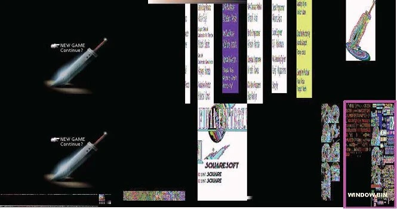

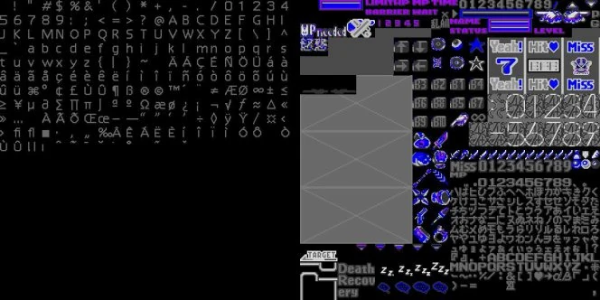

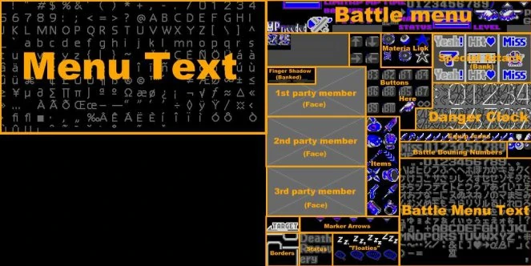

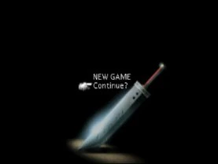

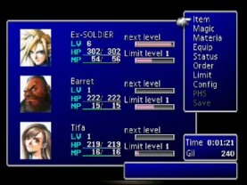

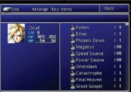

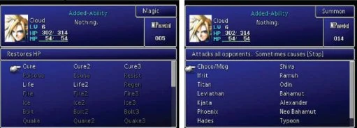

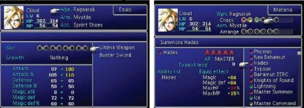

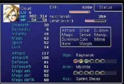

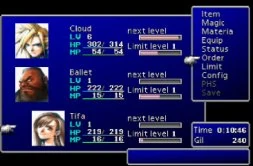

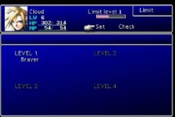

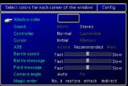

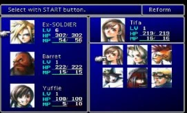

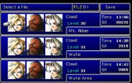

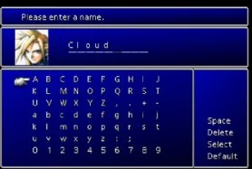

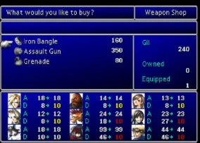


---

# FF7/Field Module {#ff7field_module}

- [FF7/Field Module](#ff7field_module){#toc-ff7field_module}
  - [Important Files](#important_files){#toc-important_files}
  - [Field Overview](#field_overview){#toc-field_overview}
  - [Field Format (PC)](#field_format_pc){#toc-field_format_pc}


## Important Files {#important_files}

|  PSX Version  |       PC Version       |
|:-------------:|:----------------------:|
| /FIELD/\*.DAT | /DATA/FIELD/FLEVEL.LGP |
| /FIELD/\*.MIM | /DATA/FIELD/FLEVEL.LGP |
| /FIELD/\*.BSX |                        |
| /FIELD/\*.BCX |  /DATA/FIELD/CHAR.LGP  |

## Field Overview {#field_overview}

The field module is the core of the game to which everything else is spawned. It is tied very closely with the kernel and contains many low-level calls to it. The field system also contains a self-contained bytecode language called commonly called \"Field Script\". The field module is responsible for the following:

- The loading and parsing of the field files
- The display of the 2D background ands related special effects
- The display of 3D elements in the field such as the camera, perspective and and entities
- The running of the Field Script to display events and to get user input
- The on-demand loading of other modules when needed

The Field module loads modular \"Field Files\". In the PC version, the Field File is a single file with nine sections. In the PSX version, there are three files with the same name but with different extensions that do the same thing. The three files are MIM (Mutiple Image Maps, or the backgrounds), DAT (Field Script Data), and BSX (3D data).

<div class="thumb tright">
<div class="thumbinner" style="width: 182px">

](Field_BackgroundVRAM.jpg "180px-Field_BackgroundVRAM.jpg")

<div class="thumbcaption">

Snapshot of the PSX\'s VRAM demonstrating the background field files in various stages of assembly.

</div>
</div>
</div>

The backgrounds are actually 16x16 blocks that are loaded into VRAM and then assembled into the video buffer every frame. The system allows for layers to obscure the 3D entities using a simple painter\'s algorithm.

In this particular field file, there are six cached sections of background data. Also notice the bright green patches that don\'t show up in in the video buffer. This was to show where a lower layer of 2D data was to be covered by a higher layer. The bright green is for debug purposes. During development, if any bright green showed up, it meant that your upper layer had a \"hole\" in it that a 3D entity could be seen through.

When the PSX version of FF7 is ran in higher resolutions via emulation with texture filtering on, often the lower layers will \"bleed\" outside the upper layer and make artifacts. This was also the reason why the field files were not re-rendered for the PC version of the game. It would of required \"re-cutting\" the layers again in the higher resolution.

Another last thing to note is in the middle of the bottom texture cache there are a sea of eyes. These blink at random times and reflect the random blinking of the characters in the game.

\

## Field Format (PC) {#field_format_pc}

### General PC Field File Format {#general_pc_field_file_format}

Field files are always found in FLEVEL.LGP. They are always [LZS](FF7/LZS_format "LZS"){.wikilink} compressed.

The first two bytes of each (decompressed) field file are blank (zero). The next four bytes is an integer indicating how many sections are present in the file. Then a number of 4-byte integers follow, giving the starting offset for each section.

All field files should contain 9 sections; it\'s what FF7 expects.

### PC Field File Header {#pc_field_file_header}

<table>
<thead>
<tr>
<th><p>Offset</p></th>
<th><p>Size</p></th>
<th><p>Description</p></th>
<th><p>Section Data</p></th>
</tr>
</thead>
<tbody>
<tr>
<td><p>0x00</p></td>
<td><p>2 bytes</p></td>
<td><p>Blank</p></td>
<td><p>Always 0x00</p></td>
</tr>
<tr>
<td><p>0x02</p></td>
<td><p>4 bytes</p></td>
<td><p>Number of Sections</p></td>
<td><p>Always 0x0009</p></td>
</tr>
<tr>
<td><p>0x06</p></td>
<td><p>4 bytes</p></td>
<td><p>Pointer to Section 1</p></td>
<td><p><a href="FF7/Field/Field_Script" class="wikilink" title="Field Script &amp; Dialog">Field Script &amp; Dialog</a></p></td>
</tr>
<tr>
<td><p>0x0A</p></td>
<td><p>4 bytes</p></td>
<td><p>Pointer to Section 2</p></td>
<td><p><a href="FF7/Field/Camera_Matrix" class="wikilink" title="Camera Matrix">Camera Matrix</a></p></td>
</tr>
<tr>
<td><p>0x0E</p></td>
<td><p>4 bytes</p></td>
<td><p>Pointer to Section 3</p></td>
<td><p><a href="FF7/Field/Model_Loader" class="wikilink" title="Model Loader">Model Loader</a></p></td>
</tr>
<tr>
<td><p>0x12</p></td>
<td><p>4 bytes</p></td>
<td><p>Pointer to Section 4</p></td>
<td><p><a href="FF7/Field/Palette" class="wikilink" title="Palette">Palette</a></p></td>
</tr>
<tr>
<td><p>0x16</p></td>
<td><p>4 bytes</p></td>
<td><p>Pointer to Section 5</p></td>
<td><p><a href="FF7/Field/Walkmesh" class="wikilink" title="Walkmesh">Walkmesh</a></p></td>
</tr>
<tr>
<td><p>0x1A</p></td>
<td><p>4 bytes</p></td>
<td><p>Pointer to Section 6</p></td>
<td><p><a href="FF7/Field_Module/DAT/Tile_Map" class="wikilink" title="TileMap">TileMap</a> (Unused)</p></td>
</tr>
<tr>
<td><p>0x1E</p></td>
<td><p>4 bytes</p></td>
<td><p>Pointer to Section 7</p></td>
<td><p><a href="FF7/Field/Encounter" class="wikilink" title="Encounter">Encounter</a></p></td>
</tr>
<tr>
<td><p>0x22</p></td>
<td><p>4 bytes</p></td>
<td><p>Pointer to Section 8</p></td>
<td><p><a href="FF7/Field/Triggers" class="wikilink" title="Triggers">Triggers</a></p></td>
</tr>
<tr>
<td><p>0x26</p></td>
<td><p>4 bytes</p></td>
<td><p>Pointer to Section 9</p></td>
<td><p><a href="FF7/Field/Background" class="wikilink" title="Background">Background</a></p></td>
</tr>
<tr>
<td><p>0x2A</p></td>
<td><p>4 bytes</p></td>
<td><p>Where Pointer to Section 1 points to</p></td>
<td><p>Length of Section 1</p></td>
</tr>
<tr>
<td><p>0x2E</p></td>
<td><p>Varies</p></td>
<td><p>Start of Section 1 data. Continues for the<br />
number of bytes specified in Section Length</p></td>
<td><p><em>See links above</em></p></td>
</tr>
</tbody>
</table>

Each section generally starts with a four byte integer indicating the length of the section. You could just work this out by comparing offsets (how much space until the next section/end of file, etc) but FF7 stores the length at the start of the section anyway. After that the actual data follows. So the first bit of data for a section is actually 4 bytes after the point given in the section header (since the first four bytes are actually the length marker).

To examine each section, please navigate using the links in the table above. For sections 3 and 8, there is some information on [the forum](http://forums.qhimm.com/index.php?topic=4358.msg58674#msg58674).

## Field Format (PS1) {#field_format_ps1}

### PSX DAT Format {#psx_dat_format}

The PSX script is contained in the DAT file, it is compressed with [LZS compression](FF7/LZS_format "LZS compression"){.wikilink}. The first 4 bytes of the compressed DAT file is the length of the compressed data starting at address 0x4.

The header for the DAT file (after it is decompressed), is 28 bytes in size (they are used in the PSX, it\'s a list of 7 long word values which point to locations in PSX RAM). So for each of these sections are addressable by taking the first memory location subtracting it and adding 28.

There are 7 sections each corresponding to the first 7 memory locations at the beginning of the file.

<table>
<thead>
<tr>
<th style="text-align: center; background: rgb(0,155,0);"><p>Section Name</p></th>
<th style="text-align: center; background: rgb(0,155,0);"><p>Section Information</p></th>
</tr>
</thead>
<tbody>
<tr>
<td style="text-align: center; background: rgb(100,155,100);"><p><a href="FF7/Field/Script" class="wikilink" title="Script">Script</a></p></td>
<td style="text-align: center; background: rgb(100,155,100);"><p>Contains conversations, save point interaction etc.</p></td>
</tr>
<tr>
<td style="text-align: center; background: rgb(100,155,100);"><p><a href="FF7/Field/Walkmesh" class="wikilink" title="Walkmesh">Walkmesh</a></p></td>
<td style="text-align: center; background: rgb(100,155,100);"><p>Contains walkmesh triangles and access info.</p></td>
</tr>
<tr>
<td style="text-align: center; background: rgb(100,155,100);"><p><a href="FF7/Field_Module/DAT/Tile_Map" class="wikilink" title="TileMap">TileMap</a></p></td>
<td style="text-align: center; background: rgb(100,155,100);"><p>Contains the information for the background, animation,<br />
and static scene objects.</p></td>
</tr>
<tr>
<td style="text-align: center; background: rgb(100,155,100);"><p><a href="FF7/Field/Camera_Matrix" class="wikilink" title="Camera_Matrix">Camera_Matrix</a></p></td>
<td style="text-align: center; background: rgb(100,155,100);"><p>Contains camera info.</p></td>
</tr>
<tr>
<td style="text-align: center; background: rgb(100,155,100);"><p><a href="FF7/Field/Triggers" class="wikilink" title="Triggers">Triggers</a></p></td>
<td style="text-align: center; background: rgb(100,155,100);"><p>Contains triggers, singles, gateways and so on.</p></td>
</tr>
<tr>
<td style="text-align: center; background: rgb(100,155,100);"><p><a href="FF7/Field/Encounter" class="wikilink" title="Encounter">Encounter</a></p></td>
<td style="text-align: center; background: rgb(100,155,100);"><p>Battle Encounter information for location.</p></td>
</tr>
<tr>
<td style="text-align: center; background: rgb(100,155,100);"><p><a href="FF7/Field/Models" class="wikilink" title="Models">Models</a></p></td>
<td style="text-align: center; background: rgb(100,155,100);"><p>Some info about field models.</p></td>
</tr>
</tbody>
</table>

### PSX MIM Format {#psx_mim_format}

Part of the PSX background data is contained in the [MIM file](FF7/Field/MIMfile "MIM file"){.wikilink}, it is compressed with [LZS compression](FF7/LZS_format "LZS compression"){.wikilink}. It consists of palettes (256 color ones) and screen blocks. No data for locating the blocks on the screen is in this file. The MIM file is a truncated TIM file and contains the normal clut location height and width information. This information is directly loaded into the PSX video ram to be decoded by the field module.

### PSX BSX Format {#psx_bsx_format}

The Field models are contained in the [BSX file](FF7/Field/BSX "BSX file"){.wikilink}, it is compressed with [LZS compression](FF7/LZS_format "LZS compression"){.wikilink}. [FIELD.TDB](FF7/Field/FIELD.TDB "FIELD.TDB"){.wikilink} contains the textures for these models.

### PSX BCX Format {#psx_bcx_format}

The individual characters\' field models are stored in [BCX files](FF7/Field/BCX "BCX files"){.wikilink}. Their textures are also in [FIELD.TDB](FF7/Field/FIELD.TDB "FIELD.TDB"){.wikilink}; they are compressed with [LZS compression](FF7/LZS_format "LZS compression"){.wikilink}.

## Event Scripting {#event_scripting}

Event scripting is handled via a series of script commands and entities spawned for the event. The exception to this is the battle event scripting. This is actually a little bit different. Please refer to the [Field Script](FF7/Field/Script "Field Script"){.wikilink} for more information.

## Script commands {#script_commands}

The event scripting language for FF7 has 246 commands that have a wide array of functions. For a complete listing of the commands, opcodes, arguments and descriptions, please refer to the [opcodes](FF7/Field/Script/Opcodes "opcodes"){.wikilink} section.

## Movies

Movies in FF7 are actually triggered from the [Field Script](FF7/Field/Script "Field Script"){.wikilink}. The [F8 PMVIE](FF7/Field/Script/Opcodes/F8_PMVIE "F8 PMVIE"){.wikilink} opcode is first used to set the movie for which the [F9 MOVIE](FF7/Field/Script/Opcodes/F9_MOVIE "F9 MOVIE"){.wikilink} opcode is used to play. It is important to remember the MOVIE ID may vary in the PS1 versionn depending on what disc you are on. The PC movies were encoded using the DUCK (goose?) format and are AVI video files.

The PS1 movies were encoded using FMV Motion JPEG video files, for the playstation. These files cannot be decode or read directly from the CD disc media because of the Mode 2 format of the files. The files are encoded using ISO Mode 2 which means the sectors are 2302 bytes in length instead of 2048. The video files have interleaved audio (ADPCM format), between video frames and are 320x224 15fps. Video files that have no audio with it actually has empty sectors of space between video frames to prevent the extremely timing sensitive MDEC decoder in the playstation from locking up.

[Cyberman](User:Cyberman "Cyberman"){.wikilink} 14:18, 30 Dec 2006 (CST)

## The 3D Overlay {#the_3d_overlay}

## Data Organization {#data_organization}

## \"A\" Field Animation Files for PC by [Mirex](User:Mirex "Mirex"){.wikilink} (Edits by [Aali](User:Aali "Aali"){.wikilink}) {#a_field_animation_files_for_pc_by_mirex_edits_by_aali}

Each animation file holds one character animation ( run, walk or some other). Some characters have more animation files. Animation is set of frames, in each frame are stored bone rotations.

\-- animation file contents \--

| Name   | Size in bytes         |
|--------|-----------------------|
| header | 36                    |
| frames | frames_count \* frame |

\-- one frame, size is (bones \* 12 + 12 + 12) \--

| Name             | Size                                  |
|------------------|---------------------------------------|
| root rotation    | 12 = 3 floats                         |
| root translation | 12 = 3 floats                         |
| rotations        | bones \* 12 bytes = bones \* 3 floats |

header structure, 36 bytes

```c
struct {
    unsigned int32 version;
    unsigned int32 frames_count;
    unsigned int32 bones_count;
    unsigned char rotation_order[3];
    unsigned char unused;
    unsigned int32 runtime_data[5];
} anim_head;
```

I understand only two values from the header, \'frames_count\' which is number of animation frames and \'bones_count\' which is suprisingly number of animated bones.

*version should always be 1 or FF7 will not load the file*

*rotation order determines in which order rotations are applied, 0 means alpha rotation, 1 beta rotation and 2 gamma rotation.*

*runtime data has no meaning in the animation file and is discarded on load*

If you want to load all possible animations for the model (even animations of different models) then check if animation file has same number of bones as current model.

Frame starts with the root rotations and root translations, followed by rotations for each bone. Rotations are stored as 3 floats (float is 4byte floating-point number).


---

## Images

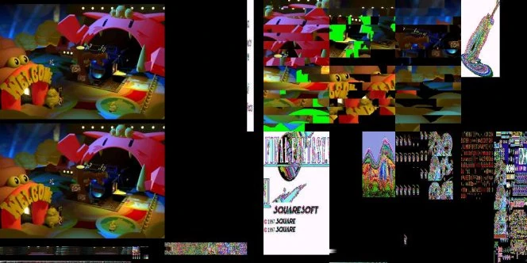


---

# FF7/Battle/Battle Mechanics {#ff7battlebattle_mechanics}

- [FF7/Battle/Battle Mechanics](#ff7battlebattle_mechanics){#toc-ff7battlebattle_mechanics}
  - [Command Defaults](#command_defaults){#toc-command_defaults}
  - [Queued Actions](#queued_actions){#toc-queued_actions}
  - [AI Structure](#ai_structure){#toc-ai_structure}
  - [Active Character Data](#active_character_data){#toc-active_character_data}
  - [Actor Battle Data](#actor_battle_data){#toc-actor_battle_data}


This page will be for Battle memory structures. This is consistent with the memory structure of the PC version. PSX may or may not reflect these structures.

## Command Defaults {#command_defaults}

Each command type has default execution values that can, in some cases, be overridden. These come from a hard-coded structure in the executable.

| Offset | Default            |
|--------|--------------------|
| 0h     | Animation          |
| 1h     | Damage Calculation |
| 2h     | Command Properties |

## Queued Actions {#queued_actions}

When a command is selected either by a player character or an enemy the action is inserted into a priority queue. Up to 64 actions can be queued. On each update loop, the main Queue function will pop off the next action with the lowest priority and execute it in FIFO order within priority bands.

Queue entries have the following structure in memory:

| Offset | Value |
|----|----|
| 0 | Action Priority (limits/counters 0, player chosen spells 6) |
| 1 | Queue position within priority band |
| 2 | Attacker actor ID |
| 3 | Action command index (e.g CMD_MAGIC = 0x02) |
| 4 | Action attack index (e.g Bolt = 0x21). (This index is absolute, not command relative) |
| 6 | Action target mask |

## AI Structure {#ai_structure}

There is a single block of memory that holds AI information on the current running script. Each Actor \"owns\" this while their scripts are executing.

| Offset     | Function                                  |
|------------|-------------------------------------------|
| 0h         | Actor Index                               |
| 4h         | Script Position                           |
| 8h         | Remaining Stack Space (initially 200h)    |
| 0Ch        | Current AI OpCode                         |
| 10h        | OpCode Lower Nybble                       |
| 14h        | OpCode Upper Nybble                       |
| 18h        | First Group Type                          |
| 1Ch        | Second Group Type                         |
| 20h        | OpCode Lower Nybble (related to group 1?) |
| 24h        | OpCode Lower Nybble (related to group 2?) |
| 28h        | Mask of *non-null* values in Group 1      |
| 2Ah        | Mask of *non-null* values in Group 2      |
| 2Ch - 50h  | Group 1 of variables                      |
| 54h - 78h  | Group 2 of variables                      |
| 7Ch - 27Ch | Stack of values                           |

## Active Character Data {#active_character_data}

This is an array that each playable character maintains an instance of.

<table>
<thead>
<tr>
<th><p>Offset</p></th>
<th colspan="2" style="background: rgb(104,104,104)"><p>Value</p></th>
</tr>
</thead>
<tbody>
<tr>
<td><p>000h</p></td>
<td colspan="2"><p>Character ID</p></td>
</tr>
<tr>
<td><p>001h</p></td>
<td colspan="2"><p>Cover Chance</p></td>
</tr>
<tr>
<td><p>002h</p></td>
<td colspan="2"><p>Strength</p></td>
</tr>
<tr>
<td><p>003h</p></td>
<td colspan="2"><p>Vitality</p></td>
</tr>
<tr>
<td><p>004h</p></td>
<td colspan="2"><p>Magic</p></td>
</tr>
<tr>
<td><p>005h</p></td>
<td colspan="2"><p>Spirit</p></td>
</tr>
<tr>
<td><p>006h</p></td>
<td colspan="2"><p>Speed</p></td>
</tr>
<tr>
<td><p>007h</p></td>
<td colspan="2"><p>Luck</p></td>
</tr>
<tr>
<td><p>008h</p></td>
<td colspan="2"><p>Phys Attack</p></td>
</tr>
<tr>
<td><p>00Ah</p></td>
<td colspan="2"><p>Phys Def</p></td>
</tr>
<tr>
<td><p>00Ch</p></td>
<td colspan="2"><p>Mag Attack</p></td>
</tr>
<tr>
<td><p>00Eh</p></td>
<td colspan="2"><p>Mag Def</p></td>
</tr>
<tr>
<td><p>010h</p></td>
<td colspan="2"><p>Current HP</p></td>
</tr>
<tr>
<td><p>012h</p></td>
<td colspan="2"><p>Max HP</p></td>
</tr>
<tr>
<td><p>014h</p></td>
<td colspan="2"><p>Current MP</p></td>
</tr>
<tr>
<td><p>016h</p></td>
<td colspan="2"><p>Max MP</p></td>
</tr>
<tr>
<td><p>018h</p></td>
<td colspan="2"><p>Timer</p></td>
</tr>
<tr>
<td><p>01Ch</p></td>
<td colspan="2"><p>Counter Attack Action Index</p></td>
</tr>
<tr>
<td><p>01Eh</p></td>
<td colspan="2"><p>Counter Attack Chance</p></td>
</tr>
<tr>
<td><p>021h</p></td>
<td colspan="2"><p>Some sort of divisor?</p></td>
</tr>
<tr>
<td><p>023h</p></td>
<td colspan="2"><p>Character Flags (Underwater, Long Range, HP&lt;-&gt;MP, etc)</p></td>
</tr>
<tr>
<td><p>024h</p></td>
<td colspan="2"><p>Eight entries of three bytes...</p></td>
</tr>
<tr>
<td><p>03Ch</p></td>
<td colspan="2"><p>Attacking Elements</p></td>
</tr>
<tr>
<td><p>03Eh</p></td>
<td colspan="2"><p>Halved Elements</p></td>
</tr>
<tr>
<td><p>040h</p></td>
<td colspan="2"><p>Nullified Elements</p></td>
</tr>
<tr>
<td><p>042h</p></td>
<td colspan="2"><p>Absorbed Elements</p></td>
</tr>
<tr>
<td><p>044h</p></td>
<td colspan="2"><p>Attacking Elements</p></td>
</tr>
<tr>
<td><p>048h</p></td>
<td colspan="2"><p>Immune Statuses</p></td>
</tr>
<tr>
<td><p>04Ch</p></td>
<td colspan="2"><p>Enabled Command Menu (16 entries of 6 bytes)</p></td>
</tr>
<tr>
<td><p>0ACh</p></td>
<td colspan="2"><p>Limit Actions for current Limit Level</p></td>
</tr>
<tr>
<td><p>0B4h</p></td>
<td colspan="2"><p>Enabled Limit Data (three entries in Attack Data format(0x1C))</p></td>
</tr>
<tr>
<td><p>108h</p></td>
<td colspan="2"><p>Enabled Magics (54 entries of 8 bytes)</p></td>
</tr>
<tr>
<td rowspan="7" style="background: rgb(104,104,155)"></td>
<td><p>0</p></td>
<td><p>Magic Index</p></td>
</tr>
<tr>
<td><p>1h</p></td>
<td><p>MP Cost</p></td>
</tr>
<tr>
<td><p>2h</p></td>
<td><p>All Count</p></td>
</tr>
<tr>
<td><p>3h</p></td>
<td><p>Quad Enabled?</p></td>
</tr>
<tr>
<td><p>4h</p></td>
<td><p>Quad Count?</p></td>
</tr>
<tr>
<td><p>5h</p></td>
<td><p>Target Data</p></td>
</tr>
<tr>
<td><p>6h</p></td>
<td><p>Properties</p></td>
</tr>
<tr>
<td><p>2C8h</p></td>
<td colspan="2"><p>Enabled Summons (format like above)</p></td>
</tr>
<tr>
<td><p>348h</p></td>
<td colspan="2"><p>Enabled ESkills (format like above)</p></td>
</tr>
<tr>
<td><p>408h</p></td>
<td colspan="2"><p>First 11 bytes of Weapon Data</p></td>
</tr>
<tr>
<td><p>40Dh</p></td>
<td colspan="2"><p>Status of weapon added to Attacking Statuses above</p></td>
</tr>
<tr>
<td><p>410h</p></td>
<td colspan="2"><p>Weapon's Accuracy</p></td>
</tr>
<tr>
<td><p>418h</p></td>
<td colspan="2"><p>Additional Attack Elements</p></td>
</tr>
<tr>
<td><p>41Ch</p></td>
<td colspan="2"><p>Four sets of two DWords : (Stat to increase, Increase value)</p></td>
</tr>
<tr>
<td><p>43Ch</p></td>
<td colspan="2"><p>Gil Bonus granted by this character</p></td>
</tr>
<tr>
<td><p>43Dh</p></td>
<td colspan="2"><p>Encounter rate ""</p></td>
</tr>
<tr>
<td><p>43Eh</p></td>
<td colspan="2"><p>Chocobo Chance ""</p></td>
</tr>
<tr>
<td><p>43Fh</p></td>
<td colspan="2"><p>PreEmptive Chance ""</p></td>
</tr>
</tbody>
</table>

## Actor Battle Data {#actor_battle_data}

Similar to Active Character Data, but more detailed. This data is dependent on who is performing the current action and only one instance of it exists during each action and all stats are relative to the performing actor and current action unless otherwise noted. Addresses 200h and above will change for each target of the action.

<table>
<thead>
<tr>
<th><p>Offset</p></th>
<th colspan="2" style="background: rgb(104,104,104)"><p>Value</p></th>
</tr>
</thead>
<tbody>
<tr>
<td><p>0h</p></td>
<td colspan="2"><p>Index</p></td>
</tr>
<tr>
<td><p>4h</p></td>
<td colspan="2"><p>Level</p></td>
</tr>
<tr>
<td><p>8h</p></td>
<td colspan="2"><p>Formation Entry (Enemy A, Enemy B, etc)</p></td>
</tr>
<tr>
<td><p>0Ch</p></td>
<td colspan="2"><p>Command Index</p></td>
</tr>
<tr>
<td><p>10h</p></td>
<td colspan="2"><p>Action Index</p></td>
</tr>
<tr>
<td><p>14h</p></td>
<td colspan="2"><p>Action Animation Base (for relative to absolute animation indexes)</p></td>
</tr>
<tr>
<td><p>18h</p></td>
<td colspan="2"><p>Allowed Targets (Active and targetable)</p></td>
</tr>
<tr>
<td><p>1Ch</p></td>
<td colspan="2"><p>Active Allies?</p></td>
</tr>
<tr>
<td><p>20h</p></td>
<td colspan="2"><p>Command Animation (player characters only)</p></td>
</tr>
<tr>
<td><p>24h</p></td>
<td colspan="2"><p><a href="FF7/Battle/Attack_Effect_Id_List" class="wikilink" title="Attack Effect">Attack Effect</a></p></td>
</tr>
<tr>
<td><p>28h</p></td>
<td colspan="2"><p>Command Index (again)</p></td>
</tr>
<tr>
<td><p>2Ch</p></td>
<td colspan="2"><p>Action Index (again)</p></td>
</tr>
<tr>
<td><p>30h</p></td>
<td colspan="2"><p>Self Mask</p></td>
</tr>
<tr>
<td><p>38h</p></td>
<td colspan="2"><p>MP Cost</p></td>
</tr>
<tr>
<td><p>3Ch</p></td>
<td colspan="2"><p>Action Accuracy</p></td>
</tr>
<tr>
<td><p>40h</p></td>
<td colspan="2"><p><a href="FF7/Battle/Damage_Calculation" class="wikilink" title="Damage Calculation">Damage Calculation</a></p></td>
</tr>
<tr>
<td><p>44h</p></td>
<td colspan="2"><p><a href="FF7/Battle/Elemental_Data" class="wikilink" title="Action&#39;s Element">Action's Element</a></p></td>
</tr>
<tr>
<td><p>48h</p></td>
<td colspan="2"><p>Action's Power</p></td>
</tr>
<tr>
<td><p>4Ch</p></td>
<td colspan="2"><p>Phys/Mag Attack Power</p></td>
</tr>
<tr>
<td><p>50h</p></td>
<td colspan="2"><p>Action's Target(s) Mask</p></td>
</tr>
<tr>
<td><p>54h</p></td>
<td colspan="2"><p>Normal Impact Sound</p></td>
</tr>
<tr>
<td><p>58h</p></td>
<td colspan="2"><p>Critical Impact Sound</p></td>
</tr>
<tr>
<td><p>5Ch</p></td>
<td colspan="2"><p>Miss Sound</p></td>
</tr>
<tr>
<td><p>60h</p></td>
<td colspan="2"><p>Single Target Camera</p></td>
</tr>
<tr>
<td><p>64h</p></td>
<td colspan="2"><p>Multi Target Camera</p></td>
</tr>
<tr>
<td><p>68h</p></td>
<td colspan="2"><p>Action Reaction Animation Index</p></td>
</tr>
<tr>
<td><p>6Ch</p></td>
<td colspan="2"><p><a href="FF7/Battle/Attack_Special_Effects" class="wikilink" title="Attack Special Effects">Attack Special Effects</a></p></td>
</tr>
<tr>
<td><p>78h</p></td>
<td colspan="2"><p>Non-self target mask?</p></td>
</tr>
<tr>
<td><p>80h</p></td>
<td colspan="2"><p><a href="FF7/Battle/Status_Effects" class="wikilink" title="Inflicting Status(es)">Inflicting Status(es)</a></p></td>
</tr>
<tr>
<td><p>84h</p></td>
<td colspan="2"><p><a href="FF7/Battle/Status_Effects" class="wikilink" title="Curing Status(es)">Curing Status(es)</a></p></td>
</tr>
<tr>
<td><p>88h</p></td>
<td colspan="2"><p><a href="FF7/Battle/Status_Effects" class="wikilink" title="Toggling Status(es)">Toggling Status(es)</a></p></td>
</tr>
<tr>
<td><p>8Ch</p></td>
<td colspan="2"><p>Chance to inflict Status</p></td>
</tr>
<tr>
<td><p>90h</p></td>
<td colspan="2"><p>Command Properties (details pending)</p></td>
</tr>
<tr>
<td><p>94h</p></td>
<td colspan="2"><p>Target Mask</p></td>
</tr>
<tr>
<td><p>98h</p></td>
<td colspan="2"><p>Attack Index position in scene data (enemy only)</p></td>
</tr>
<tr>
<td><p>A0h</p></td>
<td colspan="2"><p>Action Accuracy function (upper nybble of <a href="FF7/Battle/Damage_Calculation" class="wikilink" title="Damage Calculation">Damage Calculation</a>)</p></td>
</tr>
<tr>
<td><p>A4h</p></td>
<td colspan="2"><p>Action Damage function (lower nybble of <a href="FF7/Battle/Damage_Calculation" class="wikilink" title="Damage Calculation">Damage Calculation</a>)</p></td>
</tr>
<tr>
<td><p>ACh</p></td>
<td colspan="2"><p>Quad Magic Count?</p></td>
</tr>
<tr>
<td><p>B0h</p></td>
<td colspan="2"><p>Number of attack damage calculations?</p></td>
</tr>
<tr>
<td><p>B4h</p></td>
<td colspan="2"><p>Follow-up action count (Tifa's Limits, Finishing Touch, etc)</p></td>
</tr>
<tr>
<td><p>B8h</p></td>
<td colspan="2"><p>Number of Targets?</p></td>
</tr>
<tr>
<td><p>BCh</p></td>
<td colspan="2"><p><a href="FF7/Battle/Attack_Special_Effects" class="wikilink" title="Attack Additional Effects">Attack Additional Effects</a></p></td>
</tr>
<tr>
<td><p>C0h</p></td>
<td colspan="2"><p>Additional Effect Modifier</p></td>
</tr>
<tr>
<td><p>C4h</p></td>
<td colspan="2"><p>Attack Power</p></td>
</tr>
<tr>
<td><p>C8h</p></td>
<td colspan="2"><p>Actor's current status</p></td>
</tr>
<tr>
<td><p>D0h - D7h</p></td>
<td colspan="2"><p>Follow-up Action(s)</p></td>
</tr>
<tr>
<td><p>D8h</p></td>
<td colspan="2"><p>Actor's Strength</p></td>
</tr>
<tr>
<td><p>DCh</p></td>
<td colspan="2"><p>Used during String display?</p></td>
</tr>
<tr>
<td><p>E0h</p></td>
<td colspan="2"><p>Number of successful hits</p></td>
</tr>
<tr>
<td><p>F0h</p></td>
<td colspan="2"><p>Character-specific action properties (mp absorb, hp absorb, etc)</p></td>
</tr>
<tr>
<td><p>F8h</p></td>
<td colspan="2"><p>Related to enabled magic. Also ACh above.</p></td>
</tr>
<tr>
<td><p>FCh</p></td>
<td colspan="2"><p>Multiple hit count</p></td>
</tr>
<tr>
<td><p>100h - 1FFh</p></td>
<td colspan="2"><p>large unused gap</p></td>
</tr>
<tr>
<td><p>200h</p></td>
<td colspan="2"><p>???</p></td>
</tr>
<tr>
<td><p>204h</p></td>
<td colspan="2"><p>Character Map (players only)</p></td>
</tr>
<tr>
<td><p>208h</p></td>
<td colspan="2"><p>Current Target Index</p></td>
</tr>
<tr>
<td><p>20Ch</p></td>
<td colspan="2"><p>Formation Slot</p></td>
</tr>
<tr>
<td><p>210h</p></td>
<td colspan="2"><p>Target's Phys/Mag Def (whichever attack type is)</p></td>
</tr>
<tr>
<td><p>214h</p></td>
<td colspan="2"><p>Damage done to target</p></td>
</tr>
<tr>
<td><p>218h</p></td>
<td colspan="2"><p>Properties of attack</p></td>
</tr>
<tr>
<td rowspan="8" style="background: rgb(104,104,155)"></td>
<td><p>1</p></td>
<td><p>missed</p></td>
</tr>
<tr>
<td><p>2</p></td>
<td><p>Physical if set; Magical if unset</p></td>
</tr>
<tr>
<td><p>4</p></td>
<td><p>Attempt Steal</p></td>
</tr>
<tr>
<td><p>20</p></td>
<td><p>Won't Miss</p></td>
</tr>
<tr>
<td><p>4000</p></td>
<td><p>Physical Barrier</p></td>
</tr>
<tr>
<td><p>8000</p></td>
<td><p>Magical Barrier</p></td>
</tr>
<tr>
<td><p>40000</p></td>
<td><p>???</p></td>
</tr>
<tr>
<td><p>800000</p></td>
<td><p>???</p></td>
</tr>
<tr>
<td><p>220h</p></td>
<td colspan="2"><p>More properties (heal, critical, damage MP, etc)</p></td>
</tr>
<tr>
<td><p>224h</p></td>
<td colspan="2"><p>Target's reaction animation</p></td>
</tr>
<tr>
<td><p>228h</p></td>
<td colspan="2"><p>Target's status</p></td>
</tr>
<tr>
<td><p>22Ch</p></td>
<td colspan="2"><p>Target's status immunities</p></td>
</tr>
<tr>
<td><p>230h</p></td>
<td colspan="2"><p>Damage level to current Action</p></td>
</tr>
<tr>
<td rowspan="8" style="background: rgb(104,104,155)"></td>
<td><p>1</p></td>
<td><p>Death (if not immune)</p></td>
</tr>
<tr>
<td><p>2</p></td>
<td><p>Always hit?</p></td>
</tr>
<tr>
<td><p>4</p></td>
<td><p>Double (Damage &amp; Accuracy)</p></td>
</tr>
<tr>
<td><p>8</p></td>
<td><p>Normal (Never checked)</p></td>
</tr>
<tr>
<td><p>10</p></td>
<td><p>Half (Damage &amp; Accuracy)</p></td>
</tr>
<tr>
<td><p>20</p></td>
<td><p>Null (won't miss?)</p></td>
</tr>
<tr>
<td><p>40</p></td>
<td><p>Absorb (won't miss?)</p></td>
</tr>
<tr>
<td><p>80</p></td>
<td><p>Full-Heal</p></td>
</tr>
<tr>
<td><p>234h</p></td>
<td colspan="2"><p>Target condition flags (back exposed, multiple targets, etc)</p></td>
</tr>
<tr>
<td><p>238h</p></td>
<td colspan="2"><p>Status(es) to add to Target</p></td>
</tr>
<tr>
<td><p>23Ch</p></td>
<td colspan="2"><p>Status(es) to Cure from Target</p></td>
</tr>
<tr>
<td><p>240h</p></td>
<td colspan="2"><p>Status(es) to Toggle from Target</p></td>
</tr>
<tr>
<td><p>244h</p></td>
<td colspan="2"><p>All Target's statuses that will be affected from action</p></td>
</tr>
<tr>
<td><p>248h</p></td>
<td colspan="2"><p>Sound to play (determined from hit/critical/miss sounds above)</p></td>
</tr>
<tr>
<td><p>24Ch</p></td>
<td colspan="2"><p>Action Animation to use (varies from single/multiple targets)</p></td>
</tr>
<tr>
<td><p>254h</p></td>
<td colspan="2"><p>Target's Level</p></td>
</tr>
<tr>
<td><p>258h</p></td>
<td colspan="2"><p>Target's HP</p></td>
</tr>
<tr>
<td><p>25Ch</p></td>
<td colspan="2"><p>Target's MP</p></td>
</tr>
<tr>
<td><p>260h</p></td>
<td colspan="2"><p>Action's final Accuracy</p></td>
</tr>
</tbody>
</table>

---

# FF7/Battle/Battle Field {#ff7battlebattle_field}

- [FF7/Battle/Battle Field](#ff7battlebattle_field){#toc-ff7battlebattle_field}
  - [Settings (first file)](#settings_first_file){#toc-settings_first_file}


Battle fields are simple 3d models drawed in 3d space.

They stored in directories STAGE1 and STAGE2. There are lzs archives that unpacked and loaded in PSX space 0x801590e4. Size of unpacked field must be less than 0x8d04. It consist from few concatenated files. First one is settings for field. Last one is texture. All others are meshes.

### Settings (first file) {#settings_first_file}

<table>
<thead>
<tr>
<th style="text-align: center; background: rgb(104,104,104);"><p>Offset</p></th>
<th style="text-align: center; background: rgb(104,104,104);"><p>Size</p></th>
<th style="text-align: center; background: rgb(104,104,104);"><p>Value</p></th>
</tr>
</thead>
<tbody>
<tr>
<td style="text-align: center;"><p>0</p></td>
<td style="text-align: center;"><p>1 byte</p></td>
<td style="text-align: center;"><p>Type of 3d mesh. There are 6 type of meshes:<br />
0 - mesh with horisontal scrolling parts (field 47 - Corel Train Battle).<br />
1 - normal static mesh.<br />
2 - mesh with vertical scrolling parts (field 12 - Shinra Elevators).<br />
3 - mesh with lifestream (field 4e - Final Battle - Sephiroth).<br />
4 - mesh with rotating parts (field 39 - Safer Battle)<br />
5 - normal static mesh, same as 1. (field 01,44,45 - Bizarro Battles)</p></td>
</tr>
<tr>
<td style="text-align: center; background: rgb(155,155,104);"><p>1</p></td>
<td style="text-align: center; background: rgb(155,155,104);"><p>7 bytes</p></td>
<td style="text-align: center; background: rgb(155,155,104);"><p>unknown</p></td>
</tr>
</tbody>
</table>

---

# FF7/Battle/Battle Scenes {#ff7battlebattle_scenes}

- [FF7/Battle/Battle Scenes](#ff7battlebattle_scenes){#toc-ff7battlebattle_scenes}
  - [Introduction](#introduction){#toc-introduction}
  - [Scene.Bin file format](#scene.bin_file_format){#toc-scene.bin_file_format}


## Introduction

FF7 keeps each enemy battle configuration is a file called \"scene.bin\" This file is located in the following directories.

|      PSX Version       |    PC Version     |
|:----------------------:|:-----------------:|
| /DATA/BATTLE/SCENE.BIN | /BATTLE/SCENE.BIN |

This file is exactly the same in both versions. This holds all the battle configurations for all enemies encountered in the game.

## Scene.Bin file format {#scene.bin_file_format}

### Overview

The scene.bin file contains 256 gziped files which give us information for all the FF7 monsters. In order to find these files in scene.bin, you have to know that the file is structured with blocks exactly 0x2000 bytes in length. In the first table (scene.bin block), you will see what contains a block. Blocks are concatenated with each other to form the scene.bin file. So if you want to extract data from scene.bin, you\'ll need to find the correct blocks and to extract the gziped files from it. After that you simply ungzip those files and you\'ll find 256 files, with a length is 7808 bytes. Known information about those files can be found in the second table (The Data File specification). Because extracting file manually would be a pain, several tools was developed in order to help you. You can use [Scene Reader](http://spinningcone.com/ff/stormmedia/projects/SceneReader.zip) for example, it\'s a win32 tool to extract and repack scene.bin archive.

Also note, that in [kernel.bin](FF7/Kernel/Kernel.bin "kernel.bin"){.wikilink} there is a look-up table for scene.bin, which tells how many files there are in each section of scene.bin. You need to update it every time you repack the file and something changes. The table is at offset 0x0F1C of the third section of the kernel.bin file. You can use [SceneFix](http://forums.qhimm.com/index.php?topic=7127.0) program, which\'ll update the table for you.

We have 1024 possible battle numbers: 0 - 1023. Each group of \*4\* Battle Numbers refers to a particular Scene file: for instance, Battles 0-3 refer to File 0 in Scene.bin, Battles 4-7 refer to File 1 in Scene.bin, and so forth.

\

#### Japanese format {#japanese_format}

In the japanese scene.bin, ennemies names and attacks names have a size of 16 bytes, instead of 32 bytes.

\

### General file format {#general_file_format}

<table>
<thead>
<tr>
<th><p>Offset</p></th>
<th><p>Length</p></th>
<th><p>Description</p></th>
</tr>
</thead>
<tbody>
<tr>
<td><p>0x0000</p></td>
<td><p>4 bytes</p></td>
<td><p>Pointer to first data file. You must multiply it by 4 to get actual data file offset. If the pointer is equal to FFFFFFFFh then it means that the end of block has been reached.</p></td>
</tr>
<tr>
<td><p>0x0004</p></td>
<td><p>4 bytes</p></td>
<td><p>Pointer to second data file. You must multiply it by 4 to get actual data file offset. If the pointer is equal to FFFFFFFFh then it means that the end of block has been reached.</p></td>
</tr>
<tr>
<td colspan="3" style="text-align: center;"><p>...</p></td>
</tr>
<tr>
<td><p>0x003C</p></td>
<td><p>4 bytes</p></td>
<td><p>Last pointer, usually it equal FFFFFFFFh.</p></td>
</tr>
<tr>
<td><p>0x0040</p></td>
<td><p>4 * (pointer2 - pointer1) bytes</p></td>
<td><p>First data file in block. It's a gziped file.<br />
<em>Note: Sometimes it may finish by 0xFF bytes, because its size must be multiple of 4.</em></p></td>
</tr>
<tr>
<td><p>pointer2 * 4</p></td>
<td><p>4 * (pointer3 - pointer2) bytes</p></td>
<td><p>Second data file in block. It's a gziped file.<br />
<em>Note: Sometimes it may finish by 0xFF bytes, because its size must be multiple of 4.</em></p></td>
</tr>
<tr>
<td colspan="3" style="text-align: center;"><p>...</p></td>
</tr>
<tr>
<td><p>lastpointer * 4</p></td>
<td><p>4 * (2000h - lastpointer) bytes</p></td>
<td><p>Last data file in block.<br />
<em>Note: There are about 6 to 12 files in each block. Each block finishes by 0xFF bytes, because its length must be 2000h (8192d) bytes.</em></p></td>
</tr>
</tbody>
</table>

### Data file format {#data_file_format}

| Offset | Length | Description |
|----|----|----|
| 0x0000 | 2 bytes | Enemy ID 1 |
| 0x0002 | 2 bytes | Enemy ID 2 |
| 0x0004 | 2 bytes | Enemy ID 3 |
| 0x0006 | 2 bytes | Padding (always FFFFh) |
| 0x0008 | 4 \* 20 bytes | Battle Setup (4 records) ([format explanation](#Battle_Setup_1_format "format explanation"){.wikilink}) |
| 0x0058 | 4 \* 48 bytes | Camera Placement Data (4 records) ([format explanation](#Camera_Placement_Data_format "format explanation"){.wikilink}) |
| 0x0118 | 6 \* 16 bytes | Battle Formation 1 (6 records) ([format explanation](#Battle_Formation_Data "format explanation"){.wikilink}) |
| 0x0178 | 6 \* 16 bytes | Battle Formation 2 (6 records) |
| 0x01E8 | 6 \* 16 bytes | Battle Formation 3 (6 records) |
| 0x0238 | 6 \* 16 bytes | Battle Formation 4 (6 records) |
| 0x0298 | 184 bytes | Enemy Data 1 ([format explanation](#Enemy_data_format "format explanation"){.wikilink}) |
| 0x0350 | 184 bytes | Enemy Data 2 |
| 0x0408 | 184 bytes | Enemy Data 3 |
| 0x04C0 | 32 \* 28 bytes | Attack Data (32 records) ([format explanation](FF7/Attack_data "format explanation"){.wikilink}) |
| 0x0840 | 32 \* 2 bytes | Attack IDs (32 records) |
| 0x0880 | 32 \* 32 bytes | Attack Names (32 records, [in FF Text format](FF7/FF_Text "in FF Text format"){.wikilink}) |
| 0x0C80 | 2 bytes | Formation 1 AI Script Offset |
| 0x0C82 | 2 bytes | Formation 2 AI Script Offset |
| 0x0C84 | 2 bytes | Formation 3 AI Script Offset |
| 0x0C86 | 2 bytes | Formation 4 AI Script Offset |
| 0x0C88 | 0 - 504 bytes | Beginning of Formation AI Data ([format explanation](#AI_Data "format explanation"){.wikilink}) |
| 0x0E80 | 2 bytes | Enemy 1 AI Offset |
| 0x0E82 | 2 bytes | Enemy 2 AI Offset |
| 0x0E84 | 2 bytes | Enemy 3 AI Offset |
| 0x0E86 | 0 - 4090 bytes | Beginning of AI Data ([format explanation](#AI_Data "format explanation"){.wikilink}) |

\

#### Battle Setup 1 format {#battle_setup_1_format}

<table>
<thead>
<tr>
<th><p>Offset</p></th>
<th><p>Length</p></th>
<th><p>Description</p></th>
</tr>
</thead>
<tbody>
<tr>
<td><p>0x0000</p></td>
<td><p>2 bytes</p></td>
<td><p><strong>Battle location, as follows:</strong></p></td>
</tr>
<tr>
<td colspan="2" rowspan="2" style="text-align: center; background: rgb(104,104,155);"></td>
<td></td>
</tr>
<tr>
<td><p>0000h : Blank<br />
0001h : Bizarro Battle - Center<br />
0002h : Grassland<br />
0003h : Mt Nibel<br />
0004h : Forest<br />
0005h : Beach<br />
0006h : Desert<br />
0007h : Snow<br />
0008h : Swamp<br />
0009h : Sector 1 Train Station<br />
000Ah : Reactor 1<br />
000Bh : Reactor 1 Core<br />
000Ch : Reactor 1 Entrance<br />
000Dh : Sector 4 Subway<br />
000Eh : Nibel Caves or AForest Caves<br />
000Fh : Shinra HQ<br />
0010h : Midgar Raid Subway<br />
0011h : Hojo's Lab<br />
0012h : Shinra Elevators<br />
0013h : Shinra Roof<br />
0014h : Midgar Highway<br />
0015h : Wutai Pagoda<br />
0016h : Church<br />
0017h : Coral Valley<br />
0018h : Midgar Slums<br />
0019h : Sector 4 Corridors or Junon Path<br />
001Ah : Sector 4 Gantries or Midgar Underground<br />
001Bh : Sector 7 Support Pillar Stairway<br />
001Ch : Sector 7 Support Pillar Top<br />
001Dh : Sector 8<br />
001Eh : Sewers<br />
001Fh : Mythril Mines<br />
0020h : Northern Crater - Floating Platforms<br />
0021h : Corel Mountain Path<br />
0022h : Junon Beach<br />
0023h : Junon Cargo Ship<br />
0024h : Corel Prison<br />
0025h : Battle Square<br />
0026h : Da Chao - Rapps Battle<br />
0027h : Cid's Backyard<br />
0028h : Final Descent to Sephiroth<br />
0029h : Reactor 5 Entrance<br />
002Ah : Temple of the Ancients - Escher Room<br />
002Bh : Shinra Mansion<br />
002Ch : Junon Airship Dock<br />
002Dh : Whirlwind Maze<br />
002Eh : Junon Underwater Reactor<br />
002Fh : Gongaga Reactor<br />
0030h : Gelnika<br />
0031h : Train Graveyard<br />
0032h : Great Glacier Ice Caves &amp; Gaea Cliffs - Inside<br />
0033h : Sister Ray<br />
0034h : Sister Ray Base<br />
0035h : Forgotten City Altar<br />
0036h : Northern Crater - Initial Descent<br />
0037h : Northern Crater - Hatchery<br />
0038h : Northern Crater - Water Area<br />
0039h : Safer Battle<br />
003Ah : Kalm Flashback - Dragon Battle<br />
003Bh : Junon Underwater Pipe<br />
003Ch : Blank<br />
003Dh : Corel Railway - Canyon<br />
003Eh : Whirlwind Maze - Crater<br />
003Fh : Corel Railway - Rollercoaster<br />
0040h : Wooden Bridge<br />
0041h : Da Chao<br />
0042h : Fort Condor<br />
0043h : Dirt Wasteland<br />
0044h : Bizarro Battle - Right Side<br />
0045h : Bizarro Battle - Left Side<br />
0046h : Jenova*SYNTHESIS Battle<br />
0047h : Corel Train Battle<br />
0048h : Cosmo Canyon<br />
0049h : Caverns of the Gi<br />
004Ah : Nibelheim Mansion Basement<br />
004Bh : Temple of the Ancients - Demons Gate<br />
004Ch : Temple of the Ancients - Mural Room<br />
004Dh : Temple of the Ancients - Clock Passage<br />
004Eh : Final Battle - Sephiroth<br />
004Fh : Jungle<br />
0050h : Ultimate Weapon - Battle on Highwind<br />
0051h : Corel Reactor<br />
0052h : Unused<br />
0053h : Don Corneo's Mansion<br />
0054h : Emerald Weapon Battle<br />
0055h : Reactor 5<br />
0056h : Shinra HQ - Escape<br />
0057h : Ultimate Weapon - Gongaga Reactor<br />
0058h : Corel Prison - Dyne Battle<br />
0059h : Ultimate Weapon - Forest</p></td>
</tr>
<tr>
<td><p>0x0002</p></td>
<td><p>2 bytes</p></td>
<td><p>Upon defeat of all opponents in current formation, begin battle with <a href="FF7/Battle/Battle_scenes#Formation_ID" class="wikilink" title="Formation ID">Formation ID</a> without ending battle scene</p></td>
</tr>
<tr>
<td><p>0x0004</p></td>
<td><p>2 bytes</p></td>
<td><p>Escape Counter</p></td>
</tr>
<tr>
<td><p>0x0006</p></td>
<td><p>2 bytes</p></td>
<td><p>Unused/Align 'FF'</p></td>
</tr>
<tr>
<td><p>0x0008</p></td>
<td><p>4 * 2 bytes</p></td>
<td><p><a href="FF7/Battle/Battle_scenes#Formation_ID" class="wikilink" title="Formation ID">Formation ID</a> of candidates for next Battle Arena battle. (default of 03E7h)</p></td>
</tr>
<tr>
<td><p>0x0010</p></td>
<td><p>2 bytes</p></td>
<td><p>Escapable Flag (Along with other flags)</p></td>
</tr>
<tr>
<td><p>0x0012</p></td>
<td><p>1 byte</p></td>
<td><p>Battle layout type (normal, ambush, side). 0-8 types.</p></td>
</tr>
<tr>
<td colspan="2" rowspan="10" style="text-align: center; background: rgb(104,104,155);"></td>
<td></td>
</tr>
<tr>
<td><p>00 - Normal fight</p></td>
</tr>
<tr>
<td><p>01 - Preemptive</p></td>
</tr>
<tr>
<td><p>02 - Back attack</p></td>
</tr>
<tr>
<td><p>03 - Side attack</p></td>
</tr>
<tr>
<td><p>04 - Attacked from both sides (pincer attack, reverse side attack)</p></td>
</tr>
<tr>
<td><p>05 - Another attack from both sides battle (different maybe?)</p></td>
</tr>
<tr>
<td><p>06 - Another side attack</p></td>
</tr>
<tr>
<td><p>07 - A third side attack</p></td>
</tr>
<tr>
<td><p>08 - Normal battle that locks you in the front row, change command is disabled</p></td>
</tr>
<tr>
<td><p>0x0013</p></td>
<td><p>1 byte</p></td>
<td><p>Indexed Pre-Battle Camera position</p></td>
</tr>
</tbody>
</table>

#### Camera Placement Data format {#camera_placement_data_format}

48 bytes per Formation

<table>
<thead>
<tr>
<th><p>Offset</p></th>
<th><p>Length</p></th>
<th><p>Description</p></th>
</tr>
</thead>
<tbody>
<tr>
<td><p>0x00</p></td>
<td><p>12 bytes</p></td>
<td><p>Primary Battle Idle Camera Position</p></td>
</tr>
<tr>
<td rowspan="7" style="text-align: center; background: rgb(104,104,155);"></td>
<td></td>
<td></td>
</tr>
<tr>
<td><p>0x0</p></td>
<td><p>Camera X Position</p></td>
</tr>
<tr>
<td><p>0x2</p></td>
<td><p>Camera Y Position</p></td>
</tr>
<tr>
<td><p>0x4</p></td>
<td><p>Camera Z Position</p></td>
</tr>
<tr>
<td><p>0x6</p></td>
<td><p>Camera X Direction</p></td>
</tr>
<tr>
<td><p>0x8</p></td>
<td><p>Camera Y Direction</p></td>
</tr>
<tr>
<td><p>0xA</p></td>
<td><p>Camera Z Direction</p></td>
</tr>
<tr>
<td><p>0x0C</p></td>
<td><p>2 * 12 bytes</p></td>
<td><p>Other Camera Positions in the above format referenced in enemies' animations.</p></td>
</tr>
<tr>
<td><p>0x24</p></td>
<td><p>12 bytes</p></td>
<td><p>Unused/Align 'FF'</p></td>
</tr>
</tbody>
</table>

#### Battle Formation Data {#battle_formation_data}

4 Possible battle formations per scene, maximum of 6 enemies per battle. Each enemy entry contains the following data:

<table>
<thead>
<tr>
<th><p>Offset</p></th>
<th><p>Length</p></th>
<th colspan="2" style="text-align: center; background: rgb(104,104,104);"><p>Description</p></th>
</tr>
</thead>
<tbody>
<tr>
<td><p>0x00</p></td>
<td><p>2 bytes</p></td>
<td colspan="2" style="text-align: center;"><p>Enemy ID</p></td>
</tr>
<tr>
<td><p>0x02</p></td>
<td><p>2 bytes</p></td>
<td colspan="2" style="text-align: center;"><p>position X</p></td>
</tr>
<tr>
<td><p>0x04</p></td>
<td><p>2 bytes</p></td>
<td colspan="2" style="text-align: center;"><p>position Y</p></td>
</tr>
<tr>
<td><p>0x06</p></td>
<td><p>2 bytes</p></td>
<td colspan="2" style="text-align: center;"><p>position Z</p></td>
</tr>
<tr>
<td><p>0x08</p></td>
<td><p>2 bytes</p></td>
<td colspan="2" style="text-align: center;"><p>Row</p></td>
</tr>
<tr>
<td><p>0x0A</p></td>
<td><p>2 bytes</p></td>
<td colspan="2" style="text-align: center;"><p><a href="#Binary_.22Cover_Flags.22" class="wikilink" title="Binary &quot;Cover flags&quot;">Binary "Cover flags"</a></p></td>
</tr>
<tr>
<td><p>0x0C</p></td>
<td><p>4 bytes</p></td>
<td colspan="2" style="text-align: center;"><p>Initial condition flags. Only last 5 bits are considered.</p></td>
</tr>
<tr>
<td colspan="2" rowspan="5" style="background: rgb(104,104,155)"></td>
<td style="text-align: center;"><p>0x0001</p></td>
<td style="text-align: center;"><p>Visible</p></td>
</tr>
<tr>
<td style="text-align: center;"><p>0x0002</p></td>
<td style="text-align: center;"><p>Indicates initial direction facing if players get a side attack.</p></td>
</tr>
<tr>
<td style="text-align: center; background: rgb(155,155,104);"><p>0x0004</p></td>
<td style="text-align: center; background: rgb(155,155,104);"><p>Unknown</p></td>
</tr>
<tr>
<td style="text-align: center;"><p>0x0008</p></td>
<td style="text-align: center;"><p>Targetable</p></td>
</tr>
<tr>
<td style="text-align: center;"><p>0x0010</p></td>
<td style="text-align: center;"><p>Main Script Active</p></td>
</tr>
</tbody>
</table>

#### Enemy data format {#enemy_data_format}

<table>
<thead>
<tr>
<th><p>Offset</p></th>
<th><p>Length</p></th>
<th><p>Description</p></th>
</tr>
</thead>
<tbody>
<tr>
<td><p>0x0000</p></td>
<td><p>32 bytes</p></td>
<td><p>Enemy's name (completed by FFh bytes)</p></td>
</tr>
<tr>
<td><p>0x0020</p></td>
<td><p>1 byte</p></td>
<td><p>Enemy's level</p></td>
</tr>
<tr>
<td><p>0x0021</p></td>
<td><p>1 byte</p></td>
<td><p>Enemy's speed</p></td>
</tr>
<tr>
<td><p>0x0022</p></td>
<td><p>1 byte</p></td>
<td><p>Enemy's luck</p></td>
</tr>
<tr>
<td><p>0x0023</p></td>
<td><p>1 byte</p></td>
<td><p>Enemy's evade</p></td>
</tr>
<tr>
<td><p>0x0024</p></td>
<td><p>1 byte</p></td>
<td><p>Enemy's strength</p></td>
</tr>
<tr>
<td><p>0x0025</p></td>
<td><p>1 byte</p></td>
<td><p>Enemy's defense</p></td>
</tr>
<tr>
<td><p>0x0026</p></td>
<td><p>1 byte</p></td>
<td><p>Enemy's magic</p></td>
</tr>
<tr>
<td><p>0x0027</p></td>
<td><p>1 byte</p></td>
<td><p>Enemy's magic defense</p></td>
</tr>
<tr>
<td><p>0x0028</p></td>
<td><p>8 bytes</p></td>
<td><p>Element types (8 records):<br />
00h - Fire<br />
01h - Ice<br />
02h - Bolt<br />
03h - Earth<br />
04h - Bio<br />
05h - Gravity<br />
06h - Water<br />
07h - Wind<br />
08h - Holy<br />
09h - Health<br />
0Ah - Cut<br />
0Bh - Hit<br />
0Ch - Punch<br />
0Dh - Shoot<br />
0Eh - Scream<br />
0Fh - HIDDEN<br />
10h-1Fh - No Effect<br />
20h-3Fh - <a href="FF7/Battle/Status_Effects" class="wikilink" title="Statuses">Statuses</a> (Damage done by actions that inflict these statuses will be modified)<br />
FFh - No element</p></td>
</tr>
<tr>
<td><p>0x0030</p></td>
<td><p>8 bytes</p></td>
<td><p>Element rates for elements above, respectively (8 records):<br />
00h - Death<br />
02h - Double Damage<br />
04h - Half Damage<br />
05h - Nullify Damage<br />
06h - Absorb 100%<br />
07h - Full Cure<br />
FFh - Nothing</p></td>
</tr>
<tr>
<td><p>0x0038</p></td>
<td><p>16 bytes</p></td>
<td><p>Action animation index (1 byte each).</p></td>
</tr>
<tr>
<td><p>0x0048</p></td>
<td><p>32 bytes</p></td>
<td><p>Enemy Attack ID's (2 bytes each).</p></td>
</tr>
<tr>
<td><p>0x0068</p></td>
<td><p>32 bytes</p></td>
<td><p>Enemy Attacks <a href="FF7/Battle/Camera_Movement_Id_List" class="wikilink" title="Camera Movement Id">Camera Movement Id</a> for single and multiple targets (2 bytes each). If set this will overwrite camera movement set in attack itself.</p></td>
</tr>
<tr>
<td><p>0x0088</p></td>
<td><p>4 bytes</p></td>
<td><p>Item drop/steal rates.<br />
These are chances to get items listed in next section. 1 byte per item. If the rate is lower than 80h, for e.g. 08h - then this is a drop item and has 8/63 [63 is max] chance for drop. But if rate is higher than 80h, let's say... A0h, then this is an item for steal, and chances for successful steal is A0h - 80h = 20h = 32/63.</p></td>
</tr>
<tr>
<td><p>0x008C</p></td>
<td><p>8 bytes</p></td>
<td><p>This is a list of Item ID's which are described above. 2 bytes per item. FFFFh means no item.</p></td>
</tr>
<tr>
<td><p>0x0094</p></td>
<td><p>6 bytes</p></td>
<td><p>Indexes of up to three attacks (2 bytes each) that enemy can perform while manipulated or berserked</p></td>
</tr>
<tr>
<td style="background: rgb(155,155,104)"><p>0x009A</p></td>
<td style="background: rgb(155,155,104)"><p>2 bytes</p></td>
<td style="background: rgb(155,155,104)"><p>Unknown data</p></td>
</tr>
<tr>
<td><p>0x009C</p></td>
<td><p>2 bytes</p></td>
<td><p>Enemy's MP</p></td>
</tr>
<tr>
<td><p>0x009E</p></td>
<td><p>2 bytes</p></td>
<td><p>AP points you receive when you win the battle</p></td>
</tr>
<tr>
<td><p>0x00A0</p></td>
<td><p>2 bytes</p></td>
<td><p>Enemy can be morphed into this item. FFFFh if it can't be morphed into anything.</p></td>
</tr>
<tr>
<td><p>0x00A2</p></td>
<td><p>1 byte</p></td>
<td><p>Multiplier for back damage. damage = damage * 0xXX / 8.</p></td>
</tr>
<tr>
<td><p>0x00A3</p></td>
<td><p>1 byte</p></td>
<td><p>align 0xff.</p></td>
</tr>
<tr>
<td><p>0x00A4</p></td>
<td><p>4 bytes</p></td>
<td><p>Enemy's HP</p></td>
</tr>
<tr>
<td><p>0x00A8</p></td>
<td><p>4 bytes</p></td>
<td><p>Exp points you receive when you win the battle</p></td>
</tr>
<tr>
<td><p>0x00AC</p></td>
<td><p>4 bytes</p></td>
<td><p>Gil you receive when you win the battle</p></td>
</tr>
<tr>
<td><p>0x00B0</p></td>
<td><p>4 bytes</p></td>
<td><p>Status immunities</p></td>
</tr>
<tr>
<td style="background: rgb(155,155,104)"><p>0x00B4</p></td>
<td style="background: rgb(155,155,104)"><p>4 bytes</p></td>
<td style="background: rgb(155,155,104)"><p>Unknown [Always FFFFFFFFh]</p></td>
</tr>
</tbody>
</table>

#### Formation ID {#formation_id}

Formation ID is an index to a formation within a given scene. It is the scene index bit shifted 2 to the left plus formation index within the scene.

`0 1 2 3 4 5 6 7 8 9 A B C D E F`\
`[ - - - - - - - - - - - - ] [ ]`\
`        scene index         formation index`

For this reason, the Formation ID will not exceed 03FFh.

example: Formation 028Dh bit shift two to the right to get scene

`028D >> 2 = 00A3 (right-most bits are truncated)`

This is Scene 163 Formation Index is just the ID ANDed with 3.

`028D AND 3 = 01`

Formation 1 So this is Formation 1 in scene 163. (SOLDIER:3rd x2)

#### AI Data {#ai_data}

This section contains Battle Script that is executed before or/and during every fight. Every enemy has it\'s own script, and this script is divided to a number of sections. Each script starts with 32 bytes of header that are divided into 16 parts representing 16 script types. The 2-byte number in any section is an offset relative to the beginning of this 32 byte block that tells the script reader where the script starts for that script type.

| Offset | Script Type      |
|--------|------------------|
| 0x00   | Initialize       |
| 0x02   | Main             |
| 0x04   | General Counter  |
| 0x06   | Death Counter    |
| 0x08   | Physical Counter |
| 0x0A   | Magical Counter  |
| 0x0C   | Battle End       |
| 0x0E   | Pre-Action Setup |
| 0x10   | Custom Event 1   |
| 0x12   | Custom Event 2   |
| 0x14   | Custom Event 3   |
| 0x16   | Custom Event 4   |
| 0x18   | Custom Event 5   |
| 0x1A   | Custom Event 6   |
| 0x1C   | Custom Event 7   |
| 0x1E   | Custom Event 8   |

Its structure and opcodes are described [here](FF7/Battle/Battle_Scenes/Battle_Script "here"){.wikilink}.

NOTES:

- A monster\'s total AI size will always be an even number of bytes. If the actual scripts are an odd number, a single NULL (FFh) will be placed before the next monster\'s AI header (may not be required).
- Battle begins after all characters\' Initialize scripts have been run (Players first, then enemies, then formation).
- The only character with \"Battle End\" is in Cloud\'s AI. It\'s meant to lower the character\'s Love Points with him if he lets them die or he dies with them in the party (not sure which).
- Pre-Action Event occurs on all battle participants prior to any actions performed by any participant regardless of actor or target. This includes all executed 92 commands that have a command index of less than 21h. If any 92 commands are called in this section, the command that caused this script to run has priority.
- The Custom Event sections are not called by any event. They only occur if they are called with the 92 command.

`60 22 <- command index "Run script"`\
`60 0X <- where X is the script section in hex (eg. X = 8 would call Custom Event 1 since it is script id 08`\
`         [not to be confused with offset])`\
`92`

- Custom Event 8 is only used on Mystery Ninja (all), Ultimate Weapons in location other than above Cosmo Canyon, Safer Sephiroth, and the final \"showdown\" between Cloud and Sephiroth. These characters have scripts on them that do not remove them from battle when they are defeated.
- Custom Events 1-7 may not work. (not thoroughly tested)
- The order of scripts executed:

:   :\* Beginning of battle

    :   Pre-Battle (all participants)

    - Once a \"main-script enabled\" enemy\'s time gauge is full:

    :   Main (Enemy performs action)

    - Pre-Attack (If enemy script uses a 92 command with a command index of 20h or less)

    :   Pre-Action Setup (occurs on all participants)

    - Post-Attack
      1.  Death Counter (If script owner died, execution stops here)
      2.  General Counter (Executed by all targets)
      3.  Physical Counter/Magical Counter (Executed by all targets depending on damage type)
    - Battle ends

    :   Battle End (all participants)

#### Binary \"Cover Flags\" {#binary_cover_flags}

These flags are used in conjunction with row to determine if a target can be selected as the target of a **short-range attack**. The determination of this is worked out in this way: An enemy exists in row 1 and another in row 2. If the enemy in row 1 shares a cover flag with the enemy in row 2 then the enemy in row 2 cannot be targeted until all enemies in row 1 that share a cover flag with the row 2 enemy is defeated. It works like this. Two active enemies exist, A and B.

`If ((B's row > A's row) and (B's cover flags AND A's cover flags) > 0) then enemy B cannot be targeted by short-range attacks.`

for any enemies A and B.\
Example:\
Consider the Battery Cap x6 battle in the forest between Nibelheim and Rocket Town. Their cover flags (in binary) are:

`Row 1:       00100`\
`Row 2:    00110 01100`\
`Row 3: 00011 00100 11000`

The battery caps in row 2 cannot be targeted by a short-range attack until the one in row 1 has been defeated because they share the 0x4 cover flag. Once row 1 has been cleared:

`Row 2:    00110 01100`\
`Row 3: 00011 00100 11000`

The battery cap on left in row 2 covers the left two in row 3 because it shares flag 0x4 with the one in the middle and flag 0x2 with the one on the far left. As long as it is active these in row 3 cannot be targeted. Similarly, the battery cap on the right in row 2 shares the 0x4 flag with the middle of row 3 and the 0x8 flag with the far right of row 3 so these cannot be targeted until the right side of row 2 is defeated.\
It is also necessary to note that because row 1 does not share any flags with the extreme right and left of row 3, they can be targeted if the corresponding enemy in row 2 is defeated even if the row 1 enemy is still active.\
Also of note is that enemies in the same row that share cover flags are not considered.\
Only the first five bits may be considered even though the value is stored as a word.\

## Useful downloads {#useful_downloads}

There are few programs written that will help you edit scene.bin file:

- [Scene Reader](http://spinningcone.com/ff/stormmedia/projects/SceneReader.zip)
- [SceneEdit](http://www.subfan.pl/mav/SceneEdit.zip)
- [Scenester](http://aaronserv.dyndns.org/hosting/qhimmwiki/ramza_scenester_0.5.zip)
- [Proud Clod](http://forums.qhimm.com/index.php?topic=8481.0)

---

# FF7/Battle/Battle Scenes/Battle Script {#ff7battlebattle_scenesbattle_script}

- [FF7/Battle/Battle Scenes/Battle Script](#ff7battlebattle_scenesbattle_script){#toc-ff7battlebattle_scenesbattle_script}


(Information on opcodes provided by Terence Fergusson. Almost all information comes from [this post](http://forums.qhimm.com/index.php?topic=3290.msg45951#msg45951) on the forums.)

There are four actions to be explained when dealing with any opcode in AI script: Arguments, Values to take from the stack, what to do with Arguments and Values, and what to put back on the stack. So to fully understand what is happening a brief explanation of the stack is necessary.

The stack is more-or-less a list of values with different lengths. Only the top of the stack (the most recently added value) can be accessed at any given time, but when that value is accessed it is removed from the top of the stack and the previously added value now becomes the top of the stack. Adding to the stack is called \"Pushing\" a value and taking a value off is called \"Popping\". When pushing a value to the stack, the value of the number is pushed followed by the value type. The value type can be one of three different things:\
\
{\| border=\"1\" cellspacing=\"1\" cellpadding=\"3\" align=\"center\" style=\"border: 1px grey; border-collapse: collapse;\"
! style=\"background:rgb(104,104,104)\" align=\"center\" \| Code
! style=\"background:rgb(104,104,104)\" align=\"center\" \| Type
\|-
\| align=\"center\" \| 0Xh
\| Value
\|-
\| align=\"center\" \| 1Xh
\| [Address](FF7/Battle/Battle_Scenes/Battle_AI_Addresses "Address"){.wikilink}
\|-
\| align=\"center\" \| 2Xh
\| Multiple (between 1-10) Values
\|-
\|}\
They are stored as DWords, but the X will determine how many bytes to use: 0 = bit, 1 = Byte, 2 = Word, 3 = Three bytes

Now that we\'ve seen the stack, here are the opcodes:

<table>
<thead>
<tr>
<th style="text-align: center; background: rgb(104,104,104);"><p>Code</p></th>
<th style="text-align: center; background: rgb(104,104,104);"><p>Arguments</p></th>
<th style="text-align: center; background: rgb(104,104,104);"><p>Value(s) to pop</p></th>
<th style="text-align: center; background: rgb(104,104,104);"><p>Value to push</p></th>
</tr>
</thead>
<tbody>
<tr>
<td colspan="4" style="text-align: center; background: rgb(124,124,124);"><p>Push Values</p></td>
</tr>
<tr>
<td style="text-align: center;"><p>0Xh</p></td>
<td style="text-align: center;"><p>2 byte Memory Address</p></td>
<td style="text-align: center;"></td>
<td style="text-align: center;"><p>Type 0X stored at translated Address</p></td>
</tr>
<tr>
<td colspan="4" style="text-align: center; background: rgb(124,124,124);"><p>Push Addresses</p></td>
</tr>
<tr>
<td style="text-align: center;"><p>1Xh</p></td>
<td style="text-align: center;"><p>2 byte Memory Address</p></td>
<td style="text-align: center;"></td>
<td style="text-align: center;"><p>Address value with a scope of X</p></td>
</tr>
<tr>
<td colspan="4" style="text-align: center; background: rgb(124,124,124);"><p>Mathematical and Bit-wise Operators</p></td>
</tr>
<tr>
<td style="text-align: center;"><p>30h</p></td>
<td style="text-align: center;"></td>
<td style="text-align: center;"><p>Two of any type</p></td>
<td style="text-align: center;"><p>Sum of pops</p></td>
</tr>
<tr>
<td style="text-align: center;"><p>31h</p></td>
<td style="text-align: center;"></td>
<td style="text-align: center;"><p>Two of any type</p></td>
<td style="text-align: center;"><p>Difference of pops</p></td>
</tr>
<tr>
<td style="text-align: center;"><p>32h</p></td>
<td style="text-align: center;"></td>
<td style="text-align: center;"><p>Two of any type</p></td>
<td style="text-align: center;"><p>Product of pops</p></td>
</tr>
<tr>
<td style="text-align: center;"><p>33h</p></td>
<td style="text-align: center;"></td>
<td style="text-align: center;"><p>Two of any type</p></td>
<td style="text-align: center;"><p>Quotient of pops</p></td>
</tr>
<tr>
<td style="text-align: center;"><p>34h</p></td>
<td style="text-align: center;"></td>
<td style="text-align: center;"><p>Two of any type</p></td>
<td style="text-align: center;"><p>Remainder from quotient of pops</p></td>
</tr>
<tr>
<td style="text-align: center;"><p>35h</p></td>
<td style="text-align: center;"></td>
<td style="text-align: center;"><p>Two of any type</p></td>
<td style="text-align: center;"><p>Bit-wise AND of pops</p></td>
</tr>
<tr>
<td style="text-align: center;"><p>36h</p></td>
<td style="text-align: center;"></td>
<td style="text-align: center;"><p>Two of any type</p></td>
<td style="text-align: center;"><p>Bit-wise OR of pops</p></td>
</tr>
<tr>
<td style="text-align: center;"><p>37h</p></td>
<td style="text-align: center;"></td>
<td style="text-align: center;"><p>One of any type</p></td>
<td style="text-align: center;"><p>Bit-wise NOT of pop</p></td>
</tr>
<tr>
<td colspan="4" style="text-align: center; background: rgb(124,124,124);"><p>Logical Operators</p></td>
</tr>
<tr>
<td style="text-align: center;"><p>40h</p></td>
<td style="text-align: center;"></td>
<td style="text-align: center;"><p>Two of any type</p></td>
<td style="text-align: center;"><p>True if pops are EQUAL</p></td>
</tr>
<tr>
<td style="text-align: center;"><p>41h</p></td>
<td style="text-align: center;"></td>
<td style="text-align: center;"><p>Two of any type</p></td>
<td style="text-align: center;"><p>True if pops are NOT EQUAL</p></td>
</tr>
<tr>
<td style="text-align: center;"><p>42h</p></td>
<td style="text-align: center;"></td>
<td style="text-align: center;"><p>Two of any type</p></td>
<td style="text-align: center;"><p>True if first pop is GREATER THAN OR EQUAL TO second pop</p></td>
</tr>
<tr>
<td style="text-align: center;"><p>43h</p></td>
<td style="text-align: center;"></td>
<td style="text-align: center;"><p>Two of any type</p></td>
<td style="text-align: center;"><p>True if first pop is LESS THAN OR EQUAL TO second pop</p></td>
</tr>
<tr>
<td style="text-align: center;"><p>44h</p></td>
<td style="text-align: center;"></td>
<td style="text-align: center;"><p>Two of any type</p></td>
<td style="text-align: center;"><p>True if first pop is GREATER THAN second pop</p></td>
</tr>
<tr>
<td style="text-align: center;"><p>45h</p></td>
<td style="text-align: center;"></td>
<td style="text-align: center;"><p>Two of any type</p></td>
<td style="text-align: center;"><p>True if first pop is LESS THAN second pop</p></td>
</tr>
<tr>
<td colspan="4" style="text-align: center; background: rgb(124,124,124);"><p>Logical Comparisons</p></td>
</tr>
<tr>
<td style="text-align: center;"><p>50h</p></td>
<td style="text-align: center;"></td>
<td style="text-align: center;"><p>Two of any type</p></td>
<td style="text-align: center;"><p>True if both pops are NON-ZERO (Logical AND)</p></td>
</tr>
<tr>
<td style="text-align: center;"><p>51h</p></td>
<td style="text-align: center;"></td>
<td style="text-align: center;"><p>Two of any type</p></td>
<td style="text-align: center;"><p>True if either pop is NON-ZERO (Logical OR)</p></td>
</tr>
<tr>
<td style="text-align: center;"><p>52h</p></td>
<td style="text-align: center;"></td>
<td style="text-align: center;"><p>One of any type</p></td>
<td style="text-align: center;"><p>True if pop is ZERO (Logical NOT)</p></td>
</tr>
<tr>
<td colspan="4" style="text-align: center; background: rgb(124,124,124);"><p>Push Constants</p></td>
</tr>
<tr>
<td style="text-align: center;"><p>60h</p></td>
<td style="text-align: center;"><p>1 byte Value</p></td>
<td style="text-align: center;"></td>
<td style="text-align: center;"><p>Argument of type 01</p></td>
</tr>
<tr>
<td style="text-align: center;"><p>61h</p></td>
<td style="text-align: center;"><p>2 byte Value</p></td>
<td style="text-align: center;"></td>
<td style="text-align: center;"><p>Argument of type 02</p></td>
</tr>
<tr>
<td style="text-align: center;"><p>62h</p></td>
<td style="text-align: center;"><p>3 byte Value</p></td>
<td style="text-align: center;"></td>
<td style="text-align: center;"><p>Argument of type 03</p></td>
</tr>
<tr>
<td colspan="4" style="text-align: center; background: rgb(124,124,124);"><p>Script Jumps (No Pushes)</p></td>
</tr>
<tr>
<td style="text-align: center;"><p>70h</p></td>
<td style="text-align: center;"><p>2 byte Script Address</p></td>
<td style="text-align: center;"><p>One of any type</p></td>
<td style="text-align: center;"><p>Jumps to script address in argument if pop is 0</p></td>
</tr>
<tr>
<td style="text-align: center;"><p>71h</p></td>
<td style="text-align: center;"><p>2 byte Script Address</p></td>
<td style="text-align: center;"><p>One of any type</p></td>
<td style="text-align: center;"><p>Jumps to script address in argument if pop and top of stack are not equal</p></td>
</tr>
<tr>
<td style="text-align: center;"><p>72h</p></td>
<td style="text-align: center;"><p>2 byte Script Address</p></td>
<td style="text-align: center;"></td>
<td style="text-align: center;"><p>Jumps to script address in argument</p></td>
</tr>
<tr>
<td style="text-align: center;"><p>73h</p></td>
<td colspan="3" style="text-align: center;"><p>This ends the script</p></td>
</tr>
<tr>
<td style="text-align: center;"><p>74h</p></td>
<td style="text-align: center;"></td>
<td style="text-align: center;"><p>One of any type</p></td>
<td style="text-align: center;"><p>Pops one value from stack. (Not used)</p></td>
</tr>
<tr>
<td style="text-align: center;"><p>75h</p></td>
<td style="text-align: center;"></td>
<td style="text-align: center;"><p>One of any type</p></td>
<td style="text-align: center;"><p>Link all scripts of script owner to popped Character ID.</p></td>
</tr>
<tr>
<td colspan="4" style="text-align: center; background: rgb(124,124,124);"><p>Bit Operations</p></td>
</tr>
<tr>
<td style="text-align: center;"><p>80h</p></td>
<td style="text-align: center;"></td>
<td style="text-align: center;"><p>Two of any type</p></td>
<td style="text-align: center;"><p>First pop masked by second pop</p></td>
</tr>
<tr>
<td style="text-align: center;"><p>81h</p></td>
<td style="text-align: center;"></td>
<td style="text-align: center;"></td>
<td style="text-align: center;"><p>Random Word (0-65535)</p></td>
</tr>
<tr>
<td style="text-align: center;"><p>82h</p></td>
<td style="text-align: center;"></td>
<td style="text-align: center;"><p>One of any type</p></td>
<td style="text-align: center;"><p>Random bit of pop stored as type 02</p></td>
</tr>
<tr>
<td style="text-align: center;"><p>83h</p></td>
<td style="text-align: center;"></td>
<td style="text-align: center;"><p>One of any type</p></td>
<td style="text-align: center;"><p>If pop is Type 01, Type 01 with count of number of bits set in pop<br />
If pop is Type 02, Type 02 filled with value of first non-null value in pop</p></td>
</tr>
<tr>
<td style="text-align: center;"><p>84h</p></td>
<td style="text-align: center;"></td>
<td style="text-align: center;"><p>One of type 2X</p></td>
<td style="text-align: center;"><p>Type 02 indicating which values in popped set were greatest</p></td>
</tr>
<tr>
<td style="text-align: center;"><p>85h</p></td>
<td style="text-align: center;"></td>
<td style="text-align: center;"><p>One of type 2X</p></td>
<td style="text-align: center;"><p>Type 02 indicating which values in popped set were least</p></td>
</tr>
<tr>
<td style="text-align: center;"><p>86h</p></td>
<td style="text-align: center;"></td>
<td style="text-align: center;"><p>One of type 1X</p></td>
<td style="text-align: center;"><p>Type 02 indicating MP Cost of attack index referenced in pop</p></td>
</tr>
<tr>
<td style="text-align: center;"><p>87h</p></td>
<td style="text-align: center;"></td>
<td style="text-align: center;"><p>One of any type</p></td>
<td style="text-align: center;"><p>Type 02 with only bit in pop turned on (1 &lt;&lt; [pop])</p></td>
</tr>
<tr>
<td style="text-align: center;"></td>
<td style="text-align: center;"></td>
<td style="text-align: center;"></td>
<td style="text-align: center;"></td>
</tr>
</tbody>
</table>

 

<table>
<thead>
<tr>
<th colspan="4" style="text-align: center; background: rgb(104,104,104);"><p>Command</p></th>
</tr>
</thead>
<tbody>
<tr>
<td style="text-align: center; background: rgb(124,124,124);"><p>Code</p></td>
<td style="text-align: center; background: rgb(124,124,124);"><p>Arguments</p></td>
<td style="text-align: center; background: rgb(124,124,124);"><p>Value(s) to pop</p></td>
<td style="text-align: center; background: rgb(124,124,124);"><p>Effect</p></td>
</tr>
<tr>
<td style="text-align: center;"><p>90h</p></td>
<td style="text-align: center;"></td>
<td style="text-align: center;"><p>One of type 1X, One of type 0X or 2X</p></td>
<td style="text-align: center;"><p>If first pop &lt; 4000h; Stores second pop at first pop</p></td>
</tr>
<tr>
<td style="text-align: center;"><p>90h</p></td>
<td style="text-align: center;"></td>
<td style="text-align: center;"><p>One of type 1X, One of type 0X or 2X, One of type 1X</p></td>
<td style="text-align: center;"><p>If first pop &gt;= 4000h; Stores second pop at first pop constrained by mask at third pop</p></td>
</tr>
<tr>
<td style="text-align: center;"><p>91h</p></td>
<td style="text-align: center;"></td>
<td style="text-align: center;"><p>One of any type</p></td>
<td style="text-align: center;"><p>Pops one value from stack.</p></td>
</tr>
<tr>
<td style="text-align: center;"><p>92h</p></td>
<td style="text-align: center;"></td>
<td style="text-align: center;"><p>Two of any type</p></td>
<td style="text-align: center;"><p>First pop is attack ID to perform. Second pop action type<br />
</p></td>
</tr>
<tr>
<td style="text-align: center;"><p>93h</p></td>
<td style="text-align: center;"><p>NULL terminated string</p></td>
<td style="text-align: center;"></td>
<td style="text-align: center;"><p>Displays string</p></td>
</tr>
<tr>
<td style="text-align: center;"><p>94h</p></td>
<td style="text-align: center;"></td>
<td style="text-align: center;"><p>Two of any type</p></td>
<td style="text-align: center;"><p>Copy current status, hp and mp as well as some other specific data (like boosts, multipliers) from units in first given mask to units in second mask.</p></td>
</tr>
<tr>
<td style="text-align: center;"><p>95h</p></td>
<td style="text-align: center;"></td>
<td style="text-align: center;"><p>One of type 1X, one of type 00</p></td>
<td style="text-align: center;"><p>If second pop is 1, takes value at local address 2010 and writes value at <a href="FF7/Savemap#Save_Memory_Bank_1.2F2" class="wikilink" title="memory bank 1/2">memory bank 1/2</a> at offset specified by first pop<br />
If second pop is 0, data at memory bank1/2 at offset specified by first pop is stored at local address 2010.<br />
Otherwise, command is ignored.</p></td>
</tr>
<tr>
<td style="text-align: center;"><p>96h</p></td>
<td style="text-align: center;"></td>
<td style="text-align: center;"><p>Two of any type</p></td>
<td style="text-align: center;"><p>Get fighter elemental defense.</p></td>
</tr>
<tr>
<td style="text-align: center;"><p>A0h</p></td>
<td style="text-align: center;"><p>One byte, NULL terminated ASCII</p></td>
<td style="text-align: center;"><p>First argument of any type</p></td>
<td style="text-align: center;"><p>Displays string to debug console, replacing "%d"s with pops</p></td>
</tr>
<tr>
<td style="text-align: center;"><p>A1h</p></td>
<td style="text-align: center;"></td>
<td style="text-align: center;"><p>Two values of any type</p></td>
<td style="text-align: center;"><p>Pops two values from stack (Not Used, but valid command)</p></td>
</tr>
<tr>
<td style="text-align: center;"></td>
<td style="text-align: center;"></td>
<td style="text-align: center;"></td>
<td style="text-align: center;"></td>
</tr>
</tbody>
</table>

\
GENERAL NOTES:

- Command 90h is overloaded.
- If a type 2X is popped and any type is accepted, only the first value will be considered.
- If specific type is expected and that type is not available, the game with either crash or ignore that entire line.
- TRUE and FALSE are stored as type 00 as \'1\' and \'0\' respectively.
- Commands 74h and A1h are never used, but have been documented as valid commands.
- Commands 75h and 96h only appear in the Character AI found in the KERNEL.BIN.
- Commands of group 2X, BX, CX, DX, EX, and FX are treated as NOPs. The script will ignore them and continue processing. Also, any 5X, 6X, 7X, 8X, and 9X value that isn\'t listed above appear to be treated the same way, but it\'s safest to use a value from the 2X group. An incorrect 0X, 1X, 3X, or 4X will have unintended side-effects.

0X & 1X CODES NOTES:

- Valid values for X are 0, 1, 2, and 3.
  - These will store a bit, byte, word, and dword respectively.

3X CODES NOTES:

- The pushed value is type 2x if either of the pops are a 1X or 2X. In that case, the Masks of both pops are ANDed together. In \*all\* cases, the highest pop\'s size is used to determine the new pop\'s size.

4X CODES NOTES:

- The Pushed value will be type 00 if either component is a 1X or 2X type. It will only push TRUE or FALSE
- If both were 0X types, the result will be a type 02 which contains the Mask of all the objects in the pops that passed the comparison

86 CODE NOTES:

- This get the MP Cost of the ability referenced in the pop. The value of pop is referenced to the following areas:

` If Value >= 0xFFFF, return 0`\
` If Value <= 0x00FF, Addr = 00DAAC78 + Value*0x1C`\
` If Value >= 0x0100, match Value with wr[0099AAF4+(ID=[0..31])*2]`\
`    First ID it matches, Addr = 0099A774 + ID*0x1C`\
` If no Addr is found, return 0`\
` Otherwise, return wr[Addr + 4]`

The pushed value is, thus, the MP cost of the defined ability as a type 02. Note that 0x00 to 0xFF are standard magic and always loaded, while 0x100+ are the unique abilities loaded through scene.bin.

92 CODE NOTES:

- Second pop must be one of the following:

:   [Command index](FF7/Command_data "Command index"){.wikilink} in case of character AI
:   20h - For enemy attack
:   22h - Force execution of script (referenced by first pop)
:   24h - Pauses battle engine while string is displayed (in conjunction with code 93)

---

# FF7/Battle/Battle Animation (PC) {#ff7battlebattle_animation_pc}

- [FF7/Battle/Battle Animation (PC)](#ff7battlebattle_animation_pc){#toc-ff7battlebattle_animation_pc}
  - [Battle Animation File Format](#battle_animation_file_format){#toc-battle_animation_file_format}


## Battle Animation File Format {#battle_animation_file_format}

File format discovered/decoded by me, L. Spiro.
This file was written by me, L. Spiro, as can be seen by the proper grammar and perfect spelling.

(Wiki-fied by Halkun)
(Small additions by Borde)

### Part I: Structures {#part_i_structures}

There are 4 basic structures we will use in decoding the file format.
The header of animation data has been considered to be composed of 3 DWORD’s, 3 WORD’s, and one BYTE, however this is not how the header is really intended to be, despite being aligned correctly.

Battle animation files start with a DWORD which tells us how many animations are in the file. This number includes the special animations which are not actually animations at all. Although I have not yet decoded them, I suspect these are sets of keys for actual animation sets; keys that call scripted actions or tell the engine to print the damage numbers.

#### FF7FrameHeader

Cloud’s battle animation file (rtda) has 94 (0x 5E) animations in it.
After this number begins each animation.
Each animation begins with a 12-byte header (3 DWORD’s) we will call \"FF7FrameHeader\".
To get from one animation to the next, start at offset 0x04 in the animation file and begin reading these headers. For each header, skip \"FF7FrameHeader.dwChunkSize\" bytes until you get to the index of the file you want to load. When skipping, remember to skip starting at the end of the \"FF7FrameHeader\" header.
I mentioned a type of special animation data set that is in the header file.
These data sets, when filled with the \"FF7FrameHeader\" header, will have a \"dwChunkSize\" less than eleven, we skip them by jumping over the next 8 bytes that follow.

First, the two main headers in the animation file.

1\.
`<code>`{=html}

    typedef struct FF7FrameHeader {
        DWORD       dwBones;        // Bones in the model + 1 (unless we're dealing with a weapon animation, in which case it's value is always 1). 0x00
                                                    // This field is rather unreliable so better use the number of bones provided by the skeleton file.
        DWORD       dwFrames;       // Frames in the animation. 0x04
        DWORD       dwChunkSize;    // Size of the animation set.   0x08
    } * PFF7FrameHeader;            // Size = 12 bytes.

`</code>`{=html}
2.
`<code>`{=html}

    typedef struct FF7FrameMiniHeader {
        //SHORT     sBones; // Bones in the animation.
        SHORT       sFrames;// Apparently, frames in the animation (but sometimes sFrames > dwFrames)
        SHORT       sSize;  // Size of the animation data.  0x02
        BYTE        bKey;       // A key flag used for decoding.    0x04
    } * PFF7FrameMiniHeader;    // Size = 5 bytes.

`</code>`{=html}

NOTE: sBones should provably be called sFrames since it seems to hold a secondary frames counter. Thus, it should be equal to dwFrames. Unfortunately, it usually isn\'t. In fact, It\'s hard to say which one should actually be trusted. Apparently dwFrames is a more conservative value, meaning there will always be at least that many frames in the animation. But there can be more of them. I can\'t help but wonder if this means the rest of the frames are dummied out information or they serve some sort of purpose. On the other hand, sFrames is sometimes higher than the actual number of frames on the animation chunck.

Anyway, the actual number of frames can be computed by parsing the whole animation chunck.

It\'s also worth mentioning that there is at least one animation (15th from RSAA, the playable frog) which physically lacks the sFrames field. Instead, sSize is at 0x00 and bKey at 0x02. This animation is more than likely damaged, because FF7 doesn\'t seems to be able to handle it.

#### FF7FrameMiniHeader

Most of these members are straight-forward, however there is a very special and VERY important member in the \"FF7FrameMiniHeader\" structure called \"bKey\".
This is used for every rotation-decoding scheme (but one). It determines, essentially, the precision of the rotations and the deltas that follow in successive frames.
The value of “bKey” can only be 0, 2, or 4; the equation \"(12 - bKey)\" is used to determine the length of each raw (uncompressed) rotation.
After decompression, every rotation must be 12 bits, giving it a range from 0 to 4095.
But if \"bKey\" is 4, for example, then that means uncompressed rotations are stored as 8 bits, which gives them a range from 0 to 255. How is this fixed? After the 8 bits are read, they are then shifted left (up) by \"bKey\". This will place them at 12 bits, but with decreased accuracy.
This loss in accuracy is acceptable since rotations work as deltas and usually only change by a small amount.
Most large rotation deltas are things that are spinning, such as the blades on Aero Combatant. These cases are always a nice round number that can be handled with lower precision (in the case of Aero Combatant, it is 90 degrees even).

#### FF7ShortVec

Now the code to skip to any animation, by index, where \"iTarget\" is the index. This code assumes you have already opened the animation file (hFile) and you have skipped pasted the first 4 bytes.

`<code>`{=html}

    FF7FrameHeader  fhHeader;
    DWORD           dwBytesRead;
    for ( int I = 0; I < iTarget; I++ ) {
        if ( !ReadFile( hFile,
            &fhHeader, sizeof( fhHeader ),
            &dwBytesRead, NULL ) ) {

        CloseHandle( hFile );
        return false;
        }
        if ( fhHeader.dwChunkSize < 11 ) {  // If this is a special
                            //  chunk, skip it (it
                            //  is counted as part
                            //  of the total in the
                            //  file).
            if ( SetFilePointer( hFile, 8, NULL, FILE_CURRENT ) ==
            INVALID_SET_FILE_POINTER ) {
                CloseHandle( hFile );
                return false;
            }
            continue;           // Go on to the next
                            //  animation.
        }
        // Skip this animation set, whose size is determined by
        //  fhHeader.dwChunkSize.
        if ( SetFilePointer( hFile, fhHeader.dwChunkSize, NULL,
        FILE_CURRENT ) == INVALID_SET_FILE_POINTER ) {
            CloseHandle( hFile );
            return false;
        }
    }
    // Once we come to this point, we are at the very first byte of the
    //  animation we want to load.  Let’s store it into a BYTE array.
    if ( !ReadFile( hFile,
        &fhHeader, sizeof( fhHeader ),
        &dwBytesRead, NULL ) ) {

        CloseHandle( hFile );
        return false;
    }
    BYTE * pbBuffer = new BYTE[fhHeader.dwChunkSize];
    // Now pbBuffer holds the actual animation data, including the 5-byte
    //  “FF7FrameMiniHeader” header.

`</code>`{=html}

We now have the animation we want loaded into a BYTE array (remember to delete it later).

#### FF7FrameBuffer

Now let’s look at the other structures we will use.

3\.
`<code>`{=html}

    typedef struct FF7ShortVec {
        SHORT   sX, sY, sZ;     // Signed short versions.   0x00
        INT iX, iY, iZ;     // Integer representation.  0x06
        FLOAT   fX, fY, fZ;     // Float version after math.    0x12
    } * PFF7ShortRot;           // Size = 30 bytes.

`</code>`{=html}
Each rotation goes through 3 forms. Firstly, everything is stored as 2-byte SHORT’s. These SHORT’s are stored from 0 to 4096, where 0 = 0 degrees and 4096 = 360 degrees. This is the equation to convert one of these SHORT’s into degrees: (SHORT / 4096 \* 360). Each frame is based off the previous frame, using the SHORT value as its basis.
Each SHORT is converted to an INT, which is the exact same as the SHORT version, except always positive.
Finally, the FLOAT gets filled with the final value, using the INT version as its base.
So, the sequence is:

First frame…

- Read X bits and store as a signed SHORT.
- Convert the SHORT to the INT field, adding 0x1000 if negative.
- Convert to FLOAT using (INT / 4096 \* 360). Apply this FLOAT to your model.

Next frame…

- Read X bits, and add them to the SHORT value from last frame.
- Convert the SHORT to the INT field, adding 0x1000 if negative.
- Convert to FLOAT using (INT / 4096 \* 360). Apply this FLOAT to your model.

Repeat…

This structure is for one bone rotation.
To load an entire frame’s work of bones, we need this structure:
4.
`<code>`{=html}

    typedef struct FF7FrameBuffer {
        DWORD           dwBones;
        FF7ShortVec     svPosOffset;
        FF7ShortVec     *psvRots;

        FF7FrameBuffer() {
            dwBones = 0;
            psvRots = NULL;
        }
        ~FF7FrameBuffer() {
            dwBones = 0;
            delete [] psvRots;
            psvRots = NULL;
        }

        VOID    SetBones( DWORD dwTotal ) {
            // Delete the old.
            dwBones = 0;
            delete [] psvRots;
            
            // Create the new.
            psvRots = new FF7ShortVec[dwTotal];
            if ( psvRots != NULL ) { dwBones = dwTotal; }
        }
    } * PFF7FrameBuffer;

`</code>`{=html}
This structure will allocate enough memory for one frame of rotations. Simply call “FF7FrameBuffer.SetBones” with the number of bones in your animation.

### Part II: Functions and Format {#part_ii_functions_and_format}

First, we need a way to read bits from the BYTE array we have stored.
This is a basic bit-reading function. It reads “dwTotalBits” from “pbBuffer” starting at the “dwStartBit”’th bit.

#### GetBitsFixed

1\.
`<code>`{=html}

    INT GetBitsFixed( BYTE * pbBuffer, DWORD &dwStartBit,
    DWORD dwTotalBits ) {
        INT iReturn = 0;

        for ( DWORD I = 0; I < dwTotalBits; I++ ) {
            iReturn <<= 1;

            __asm mov eax, dwStartBit
            __asm mov eax, [eax]
            __asm cdq
            __asm and edx, 7
            __asm add eax, edx
            __asm sar eax, 3
            __asm mov ecx, pbBuffer
            __asm xor edx, edx
            __asm mov dl, byte ptr ds:[ecx+eax]
            __asm mov eax, dwStartBit
            __asm mov ecx, [eax]
            __asm and ecx, 7
            __asm mov eax, 7
            __asm sub eax, ecx
            __asm mov esi, 1
            __asm mov ecx, eax
            __asm shl esi, cl
            __asm and edx, esi
            __asm test edx, edx
            __asm je INCBIT
            iReturn++;
    INCBIT: dwStartBit++;
        }

        // Force the sign bit to extend across the 32-bit boundary.
        iReturn <<= (0x20 - dwTotalBits);
        iReturn >>= (0x20 - dwTotalBits);
        return iReturn;
    }

`</code>`{=html}

Now that we can read the bits in the buffer we have made, it’s time to know what we’re doing!

##### A.

The animation data begins with one full frame that is uncompressed, but stored in one of 3 ways. Every frame after that is compressed, but compressed in one of three ways; one way can be decoded using the same method as on the first frame, which is why sometimes the second, third, and even fourth frames can be decoded using the same method as was used on the first frame.

`   First Frame:`

Remember that we stored our animation buffer with a 5-byte “FF7FrameMiniHeader” at the beginning of it? We need this header now!

`<code>`{=html}

    PFF7FrameMiniHeader pfmhMiniHeader = (PFF7FrameMiniHeader)pbBuffer;

`</code>`{=html}

After this cast, “pfmhMiniHeader-\>bKey” will contain a number, either 0, 2, or 4.
Each rotation is stored in (12 - “pfmhMiniHeader-\>bKey”) bits. This mean either 12, 10, or 8, respectively.
This is important to know.
But first, there is offset data. Each offset is 16 bits (a signed SHORT).
In the first frame of Cloud’s first animation (rtda), these bytes are 00 00 FE 2E 00 00.
16 bits Ã--- 3 = 48 bits, or 6 bytes.
To get these bits, we first need to make a pointer point to the correct location. “pbBuffer” points 5 bytes before this data, so let’s make a pointer that points to this data directly.

`<code>`{=html}

    BYTE * pbAnimBuffer = &pbBuffer[5];

`</code>`{=html}

When we use “GetBitsFixed()” to get the bits.

`<code>`{=html}

    DWORD dwBitStart = 0;   // The bits at which to begin reading in the
    //  stream.
    SHORT sX = GetBitsFixed( pbAnimBuffer, dwBitStart, 16 );
    SHORT sY = GetBitsFixed( pbAnimBuffer, dwBitStart, 16 );
    SHORT sZ = GetBitsFixed( pbAnimBuffer, dwBitStart, 16 );

`</code>`{=html}

After doing this, we have each of the three offsets, 0, -466, and 0.
The Y (-466) is always stored as its inverse, but for now we don’t worry about that.

The first frame is uncompressed, but it could be 12, 10, or 8 bits per rotation.
How do we know? “pfmhMiniHeader-\>bKey”!

For each bone, there are 3 rotations. So, for each bone, we do this:

`<code>`{=html}

    SHORT sRotX = GetBitsFixed( pbAnimBuffer, dwBitStart,
    12 - pfmhMiniHeader->bKey );
    SHORT sRotY = GetBitsFixed( pbAnimBuffer, dwBitStart,
    12 - pfmhMiniHeader->bKey );
    SHORT sRotZ = GetBitsFixed( pbAnimBuffer, dwBitStart,
    12 - pfmhMiniHeader->bKey );
    // We have each rotation, but for the equation to work, the range
    //  must always be from 0 to 4095.  If we got 8 bytes, for example,
    //  the range would only be from 0 to 255, so here we need to fix
    //  this.
    sRotX <<= pfmhMiniHeader->bKey;
    sRotY <<= pfmhMiniHeader->bKey;
    sRotZ <<= pfmhMiniHeader->bKey;

`</code>`{=html}

The first rotation is always 0, 0, 0. This is the root rotation and is not actually counted as part of the bone network of the character.

#### GetDynamicFrameOffsetBits

The first frame is easy.
Remember that all frames after are stored as relative offsets from the frame before it.
The offsets are relative to the SHORT values of the previous frame rather than the FLOAT or INT values.

Each frame begins with the three position offset values, but in the second frame and after, they can be either 7 or 16 bits.
To determine if which they are, we first get one bit. If that bit is 0, then the following 7 bits are the actual value of the offset (signed).
If it is 1, then the next 16 bits are the value of the offset. In total, the offsets will be either 8 or 17 bits.

Now the code to perform this operation.

2\.
`<code>`{=html}

    SHORT GetDynamicFrameOffsetBits( BYTE * pBuffer, DWORD &dwBitStart ) {
    DWORD dwFirstByte, dwConsumedBits, dwBitsRemainingToNextByte, dwTemp;
        SHORT sReturn;
        __asm {
            mov eax, dwBitStart
            mov eax, [eax]
            cdq
            and edx, 7
            add eax, edx
            sar eax, 3
            mov dwFirstByte, eax
            mov ecx, dwBitStart
            mov edx, [ecx]
            and edx, 7
            mov dwConsumedBits, edx
            mov eax, 7
            sub eax, dwConsumedBits
            mov dwBitsRemainingToNextByte, eax
            mov ecx, pBuffer
            add ecx, dwFirstByte        // Go to the first byte that
                            // has the bit where we
                            // want to begin.
            xor edx, edx
            mov dl, byte ptr ds:[ecx]
            shl edx, 8
            mov eax, pBuffer
            add eax, dwFirstByte
            xor ecx, ecx
            mov cl, byte ptr ds:[eax+1]
            or edx, ecx
            mov dwTemp, edx
            mov ecx, dwBitsRemainingToNextByte
            add ecx, 8
            mov edx, 1
            shl edx, cl
            mov eax, dwTemp
            and eax, edx
            test eax, eax
            jnz SeventeenBits

    EightBits :
            mov ecx, dwConsumedBits
            add ecx, 1
            mov edx, dwTemp
            shl edx, cl
            movsx eax, dx
            sar eax, 9
            mov sReturn, ax
            mov ecx, dwBitStart //
            mov edx, [ecx]      //
            add edx, 8      //
            mov eax, dwBitStart //
            mov [eax], edx      // Increase dwBitStart by 0x8 (8).
            jmp End

    SeventeenBits :
            mov ecx, dwTemp
            shl ecx, 8
            mov edx, pBuffer
            add edx, dwFirstByte
            xor eax, eax
            mov al, byte ptr ds:[edx+2]
            or ecx, eax
            mov dwTemp, ecx
            mov ecx, dwConsumedBits
            add ecx, 1
            mov edx, dwTemp
            shl edx, cl
            shr edx, 8
            mov sReturn, dx
            mov eax, dwBitStart //
            mov ecx, [eax]      //
            add ecx, 0x11       //
            mov edx, dwBitStart //
            mov [edx], ecx      // Increase dwBitStart by 0x11
                        //  (17).

    End :
        }
        return sReturn;
    }

`</code>`{=html}

After the first frame, we know that the positional offsets immediately follow.
So to get the positional deltas for the next frame, we would do this:

`<code>`{=html}

    SHORT sDeltaX = GetDynamicFrameOffsetBits( pbAnimBuffer, dwBitStart );
    SHORT sDeltaY = GetDynamicFrameOffsetBits( pbAnimBuffer, dwBitStart );
    SHORT sDeltaZ = GetDynamicFrameOffsetBits( pbAnimBuffer, dwBitStart );

`</code>`{=html}

Now we have the change from the previous frame. In our “FF7ShortVec” structure, these are the SHORT values. To get the position of this frame, we add these offsets to the last frame’s position.
If “I” is this frame and “I-1” is the last frame, we could do something like this:

`<code>`{=html}

    FF7FrameBuffer[I].svPosOffset.sX = FF7FrameBuffer[I-1].svPosOffset.sX + sX;
    FF7FrameBuffer[I].svPosOffset.sY = FF7FrameBuffer[I-1].svPosOffset.sY + sY;
    FF7FrameBuffer[I].svPosOffset.sZ = FF7FrameBuffer[I-1].svPosOffset.sZ + sZ;

`</code>`{=html}

#### GetEncryptedRotationBits

Now all that is left is to decode the rotations.
Rotations change size in multiple ways.
There is no single simple way to express them.

They are, however, always at least one bit long.
The first bit is a flag. If 0, the rotational change is 0, and that is the end of that rotation.
If it is not 0, then we must get the next 3 bits.
The next 3 bits can tell us to do one of three things.
If the resulting 3-bit signed value is 0, then the rotation delta is (-1 \<\< pfmhMiniHeader-\>bKey). This is the smallest possible decrement for the given precision (remember that precision is based off “pfmhMiniHeader-\>bKey”.
If the 3-bit value is 7, then we treat the rotation the same way as we do in the first frame, where we read (12-pfmhMiniHeader-\>bKey) bits, then shift left by “pfmhMiniHeader-\>bKey”.

The complicated cases are 1 through 6.
If the 3-bit value is from 1 to 6, then this indicates the number of bits in the rotation delta.
For our example, let’s assume the 3-bit value was 4.
This means we need to read the next 4 bits from the stream. These 4 bits will be the animation delta, but we actually have to handle them before we can call it final.
The first bit of this new data is a sign bit which determines if the value is below 0.
If it is below zero, we must subtract from that number (1 \<\< (\[Number of Bits\] â€" 1)).
So, if the 3-bit value was 4, and we read 4 bits from the stream, and the resulting value was negative, we would subtract from that value (1 \<\< 3), or 8.
If the 4-bit value is positive, we add (1 \<\< (\[Number of Bits\] â€" 1)) to it.
After we handle the positive and negative cases, we have to adjust for our precision again.
So, we shift left the resulting value by “pfmhMiniHeader-\>bKey”.
This is all shown in the code below.

3\.
`<code>`{=html}

    SHORT GetEncryptedRotationBits( BYTE * pBuffer, DWORD &dwBitStart,
    INT iKeyBits ) {
        DWORD dwNumBits, dwType;
        INT iTemp;
        SHORT sReturn;
        // Check the first bit.
        INT iBits = GetBitsFixed( pBuffer, dwBitStart, 1 );
        __asm mov eax, iBits    // If the first bit is 0, return 0
                    // and continue. It is not necessary
                    // to mov iBits into EAX, but I do it
                    // anyway.
        __asm test eax, eax
        __asm jnz SecondTest
        __asm jmp ReturnZero    // Return 0

    SecondTest :
        // Otherwise continue by getting the next 3 bits.
        iBits = GetBitsFixed( pBuffer, dwBitStart, 3 );
        __asm mov eax, iBits
        __asm and eax, 7
        __asm mov dwNumBits, eax
        __asm mov ecx, dwNumBits
        __asm mov dwType, ecx   // dwType = ecx = dwNumBits = eax =
                    //  (iBits & 7).
                    //  When we get to the case, all of
                    //  these values are the same.
        __asm cmp dwType, 7
        __asm ja ReturnZero // Is dwType above 7?  If so, return 0.
                    //  This can never actually happen.

        // Otherwise, use it in a switch case.
        switch ( dwType ) {
            case 0 : {
                __asm or eax, 0xFFFFFFFF    // After this, EAX will
                                // always be -1.
                __asm mov ecx, iKeyBits
                __asm shl eax, cl       // Shift left by
                                // precision.
                                // (-1 << iKeyBits)
                __asm mov sReturn, ax       // Return that number.
                __asm jmp End
            }
            case 1 : {}
            case 2 : {}
            case 3 : {}
            case 4 : {}
            case 5 : {}
            case 6 : {
                // Get a number of bits equal to the case switch (1,
                // 2, 3, 4, 5, or 6).
                iTemp = GetBitsFixed( pBuffer, dwBitStart,
                    dwNumBits );
                __asm mov eax, iTemp
                __asm cmp iTemp, 0
                __asm jl IfLessThanZero
                // If greater than or equal to 0…
                __asm mov ecx, dwNumBits    // dwNumBits = (iBits &
                                // 7) from before.
                __asm sub ecx, 1        // dwNumBits - 1.
                __asm mov eax, 1
                __asm shl eax, cl       // (1 << (dwNumBits –
                                // 1)).
                __asm mov ecx, iTemp
                __asm add ecx, eax      // iTemp += (1 <<
                                // (dwNumBits - 1)).
                __asm mov iTemp, ecx
                __asm jmp AfterTests
                // If less than 0…
    IfLessThanZero :
                __asm mov ecx, dwNumBits    // dwNumBits = (iBits &
                                // 7) from before.
                __asm sub ecx, 1        // Decrease it by 1.
                __asm mov edx, 1
                __asm shl edx, cl       // Shift “1” left by
                                // (dwNumBits - 1).
                __asm mov eax, iTemp        // iTemp still has the
                                // bits we read
                                // from before.
                __asm sub eax, edx      // iTemp - (1 <<
                                // (dwNumBits - 1))
                __asm mov iTemp, eax

                // Now, whatever we set on iTemp, we need to shift it
                // up by the precision value.
    AfterTests :
                __asm mov eax, iTemp
                __asm mov ecx, iKeyBits
                __asm shl eax, cl           // iTemp <<= iKeyBits
                __asm mov sReturn, ax
                __asm jmp End
            }

            case 7 : {
                // Uncompressed bits.  Use standard decoding.
                iTemp = GetBitsFixed( pBuffer, dwBitStart,
                    12 - iKeyBits );
                __asm mov ecx, iKeyBits
                __asm shl eax, cl           // iTemp <<= iKeyBits.
                __asm mov sReturn, ax
                __asm jmp End
            }

        }


    ReturnZero :
        __asm xor ax, ax
        __asm mov sReturn, ax

    End :

        return sReturn;
    }

`</code>`{=html}

### Part III: Putting it All Together {#part_iii_putting_it_all_together}

To make life easy, let’s use one function to load an entire frame at a time.
This function will load an entire frame into a “FF7FrameBuffer” structure.
The function will return the bit position where the next frame will begin.
After the function returns, we must translate the rotational INT values to their FLOAT forms (although the function can be modified to do this part itself).
This function will be called in a loop for every frame in the rotation.

#### LoadFrames

1\.
`<code>`{=html}

    DWORD LoadFrames( PFF7FrameBuffer pfbFrameBuffer,
    INT iBones,
    INT iBitStart,
    BYTE * pbAnimBuffer ) {
        // Get backups of the information we need.
    DWORD       dwThisBitStart  = iBitStart;
        INT     iThisBones      = iBones;
        BYTE *  pbThisBuffer    = pbAnimBuffer;

        PFF7FrameMiniHeader pfmhMiniHeader =
            (PFF7FrameMiniHeader)pbAnimBuffer;
        SHORT   sSize = pfmhMiniHeader->sSize;                      
        BYTE    bKeyBits = pfmhMiniHeader->bKey;

        // Skip the first 5 bytes because they are part of the frame header.
        pbThisBuffer += sizeof( FF7FrameMiniHeader );

        if ( iBitStart == 0 ) { // First frame?
            // The first frame is uncompressed and each value is the
            // actual rotation.
            pfbFrameBuffer->svPosOffset.sX = GetBitsFixed( pbThisBuffer, dwThisBitStart, 16 ); //Always 16 bits
            pfbFrameBuffer->svPosOffset.sY = GetBitsFixed( pbThisBuffer, dwThisBitStart, 16 );
            pfbFrameBuffer->svPosOffset.sZ = GetBitsFixed( pbThisBuffer, dwThisBitStart, 16 );

            // This function will set the FLOAT values for the
            //  positions.
            // Any scaling that needs to be done would be done here.
            pfbFrameBuffer->svPosOffset.fX = (FLOAT)pfbFrameBuffer->svPosOffset.sX;
            pfbFrameBuffer->svPosOffset.fY = (FLOAT)pfbFrameBuffer->svPosOffset.sY;
            pfbFrameBuffer->svPosOffset.fZ = (FLOAT)pfbFrameBuffer->svPosOffset.sZ;

            for ( int I = 0; I < iThisBones; I++ ) {
                // Now get each bone rotation (the first bone is
                //  actually the root, not part of the skeleton).
                // During the first frame, the rotations are always
                //  (12 – bKeyBits).
                // We shift by bKeyBits to align it to 12 bits.
                pfbFrameBuffer->psvRots[I].sX = (GetBitsFixed( pbThisBuffer, dwThisBitStart, 12 - bKeyBits ) << bKeyBits);
                pfbFrameBuffer->psvRots[I].sY = (GetBitsFixed( pbThisBuffer, dwThisBitStart, 12 - bKeyBits ) << bKeyBits);
                pfbFrameBuffer->psvRots[I].sZ = (GetBitsFixed( pbThisBuffer, dwThisBitStart, 12 - bKeyBits ) << bKeyBits);

                // Store the INT version as the absolute value
                //  of the SHORT version.
                pfbFrameBuffer->psvRots[I].iX = (pfbFrameBuffer->psvRots[I].sX < 0) ? pfbFrameBuffer->psvRots[I].sX + 0x1000 : pfbFrameBuffer->psvRots[I].sX;
                pfbFrameBuffer->psvRots[I].iY = (pfbFrameBuffer->psvRots[I].sY < 0) ? pfbFrameBuffer->psvRots[I].sY + 0x1000 : pfbFrameBuffer->psvRots[I].sY;
                pfbFrameBuffer->psvRots[I].iZ = (pfbFrameBuffer->psvRots[I].sZ < 0) ? pfbFrameBuffer->psvRots[I].sZ + 0x1000 : pfbFrameBuffer->psvRots[I].sZ;
            }
        }
        else {                  // All other frames.
            SHORT sX, sY, sZ;           // Get the positional
    //  offsets.
            sX = GetDynamicFrameOffsetBits( pbThisBuffer, dwThisBitStart );
            sY = GetDynamicFrameOffsetBits( pbThisBuffer, dwThisBitStart );
            sZ = GetDynamicFrameOffsetBits( pbThisBuffer, dwThisBitStart );

            // When we come to this area of the function,
    //  pfbFrameBuffer will have the previous frame
    //  still stored in it.  Just add the offsets.
            pfbFrameBuffer->svPosOffset.sX += sX;
            pfbFrameBuffer->svPosOffset.sY += sY;
            pfbFrameBuffer->svPosOffset.sZ += sZ;

            pfbFrameBuffer->svPosOffset.fX = (FLOAT)pfbFrameBuffer->svPosOffset.sX;
            pfbFrameBuffer->svPosOffset.fY = (FLOAT)pfbFrameBuffer->svPosOffset.sY;
            pfbFrameBuffer->svPosOffset.fZ = (FLOAT)pfbFrameBuffer->svPosOffset.sZ;
            for ( int I = 0; I < iThisBones; I++ ) {
                // The same applies here.  Add the offsets
                //  and convert to INT form, adding 0x1000
                //  if it is less than 0.
                // When Final Fantasy® VII loads these animations,
                //  it is possible for the value to sneak up above
                //  the 4095 boundary through a series of positive
                //  offsets. 
                sX = GetEncryptedRotationBits( pbThisBuffer, dwThisBitStart, bKeyBits );
                sY = GetEncryptedRotationBits( pbThisBuffer, dwThisBitStart, bKeyBits );
                sZ = GetEncryptedRotationBits( pbThisBuffer, dwThisBitStart, bKeyBits );

                pfbFrameBuffer->psvRots[I].sX += sX;
                pfbFrameBuffer->psvRots[I].sY += sY;
                pfbFrameBuffer->psvRots[I].sZ += sZ;

                pfbFrameBuffer->psvRots[I].iX = (pfbFrameBuffer->psvRots[I].sX < 0) ? pfbFrameBuffer->psvRots[I].sX + 0x1000 : pfbFrameBuffer->psvRots[I].sX;
                pfbFrameBuffer->psvRots[I].iY = (pfbFrameBuffer->psvRots[I].sY < 0) ? pfbFrameBuffer->psvRots[I].sY + 0x1000 : pfbFrameBuffer->psvRots[I].sY;
                pfbFrameBuffer->psvRots[I].iZ = (pfbFrameBuffer->psvRots[I].sZ < 0) ? pfbFrameBuffer->psvRots[I].sZ + 0x1000 : pfbFrameBuffer->psvRots[I].sZ;
            }
        }

        // If we did not read as many bits as there are in the frame,
        //  return the location where the bits should start for the
        //  next frame.
        if ( (SHORT)(dwThisBitStart / 8) < sSize ) {
    return dwThisBitStart;
    }
        // Otherwise, return 0.
        return 0;
    }

`</code>`{=html}
2.

#### A Sample Loop {#a_sample_loop}

This is an example loop that could be used to load a full animation.

`<code>`{=html}

    FF7FrameHeader fhHeader;
    ReadFile( hFile, &fhHeader, sizeof( fhHeader ), &ulBytesRead,
    NULL );
    BYTE * baData = new BYTE[fhHeader.dwChunkSize];
    ReadFile( hFile, &baData, fhHeader.dwChunkSize, &ulBytesRead,
    NULL );

        // This will be our buffer to hold one frame.
        //  We will only buffer one frame at a time, so to
        //  to fully load the animations, you would need to
        //  write your own routine to store the data in
        //  fbFrameBuffer after each loaded frame.
    FF7FrameBuffer fbFrameBuffer;
    fbFrameBuffer.SetBones( fhHeader.dwBones );
    INT iBits = 0;
    for ( DWORD J = 0; J < fhHeader.dwFrames; J++ ) {
        // We pass a pointer to fbFrameBuffer.  The first frame
        //  will load diretly into it.
        // Every frame after that will actually use it with the
        //  offsets loaded to determine the final result of that
        //  frame. 
            iBits = LoadFrames( &fbFrameBuffer, fhHeader.dwBones, iBits, baData );
            // Reverse the Y offset (required).
            fbFrameBuffer.svPosOffset.fY = 0.0f – fbFrameBuffer.svPosOffset.fY;

    // The first rotation set is skipped.  It is not part of
    //  the skeleton.  Skipping is optional, but
    //  Final Fantasy® VII skips it; it is always 0, 0, 0.
    // I believe the actual use for the “root” rotation is
    //  to dynamically make the model point at its target
    //  or face different directions during battle.
    // UPDATE: Although the value of this field is 0,0,0 for most animations, some actually store a base rotation here
    // so it shouldn't be ignored.
            for ( DWORD I = 0; I < fhHeader.dwBones - 1; I++ ) {
                fbFrameBuffer.psvRots[I+1].fX = (FLOAT)fbFrameBuffer.psvRots[I+1].iX / 4096.0f * 360.0f;
                fbFrameBuffer.psvRots[I+1].fY = (FLOAT)fbFrameBuffer.psvRots[I+1].iY / 4096.0f * 360.0f;
                fbFrameBuffer.psvRots[I+1].fZ = (FLOAT)fbFrameBuffer.psvRots[I+1].iZ / 4096.0f * 360.0f;
            }
    // Store the data for this frame here (in your own
    //  routine).

        }

        delete [] baData;

`</code>`{=html}

## Part IV: Qhimm’s Input {#part_iv_qhimmâs_input}

Qhimm has taken the time to rewrite two of these functions used in decoding, so it is easier to understand for people who know C++ better than they know assembly (despite my comments being in the assembly code).
He has also written a more in-depth look at the logistics behind the rotation compression format and explains its limitations

“GetValueFromStream” is the C/C++ version of my “GetDynamicFrameOffsetBits” and his “GetCompressedDeltaFromStream” is the C++ version of my “GetEncryptedRotationBits”.

`<code>`{=html}

    short GetValueFromStream( BYTE *pStreamBytes,
    DWORD *pdwStreamBitOffset )
    {
        // The return value;
        short sValue;
        // The number of whole bytes already consumed in the stream.
        DWORD dwStreamByteOffset = *pdwStreamBitOffset / 8;
        // The number of bits already consumed in the current stream byte.
        DWORD dwCurrentBitsEaten = *pdwStreamBitOffset % 8;
        // The distance from dwNextStreamBytes' LSB to the 'type' bit.
        DWORD dwTypeBitShift = 7 - dwCurrentBitsEaten;
        // A copy of the next two bytes in the stream (from big-endian).
        DWORD dwNextStreamBytes = pStreamBytes[dwStreamByteOffset] << 8 | pStreamBytes[dwStreamByteOffset + 1];

        // Test the first bit (the 'type' bit) to determine the size of the value.
        if (dwNextStreamBytes & (1 << (dwTypeBitShift + 8)))
        {   // Sixteen-bit value:
            // Collect one more byte from the stream.
            dwNextStreamBytes = dwNextStreamBytes << 8 |
                pStreamBytes[dwStreamByteOffset + 2];
            // Shift the delta value into place.
            sValue = (dwNextStreamBytes << (dwCurrentBitsEaten + 1)) >> 8;
            // Update the stream offset.
            *pdwStreamBitOffset += 17;
        }
        else
        {   // Seven-bit value
            // Shift the delta value into place (taking care to preserve the sign).
            sValue = ((short)(dwNextStreamBytes << (dwCurrentBitsEaten + 1))) >> 9;
            // Update the stream offset.
            *pdwStreamBitOffset += 8;
        }

        // Return the value.
        return sValue;
    }


    short GetCompressedDeltaFromStream( BYTE *pStreamBytes, DWORD *pdwStreamBitOffset,
    int nLoweredPrecisionBits )
    {
        unsigned int nBits;
        int iFirstBit = GetBitsFromStream( pStreamBytes, pdwStreamBitOffset, 1 );
        if (iFirstBit)
        {
            unsigned int uType = GetBitsFromStream( pStreamBytes,
                pdwStreamBitOffset, 3 ) & 7;
            switch (uType)
            {
            case 0:
                // Return the smallest possible decrement delta (at given
                //  precision).
                return (-1 << nLoweredPrecisionBits);

            case 1: case 2: case 3: case 4: case 5: case 6:
                // Read a corresponding number of bits from the stream.
                int iTemp = GetBitsFromStream( pStreamBytes,
                    pdwStreamBitOffset, nBits );
                // Transform the value into the full seven-bit value, using the bit
                //  length
                // as part of the encoding scheme (see notes).
                if (iTemp < 0)  iTemp -= 1 << (nBits - 1);
                else            iTemp += 1 << (nBits - 1);
                // Adapt to the requested precision and return.
                return (iTemp << nLoweredPrecisionBits);
            case 7:
                // Read an uncompressed value from the stream (at requested
                //  precision), and return.
                iTemp = GetBitsFromStream( pStreamBytes,
                    pdwStreamBitOffset, 12 - nLoweredPrecisionBits );
                return (iTemp << nLoweredPrecisionBits);
            default:
            }
        }
        // Default/error: return zero.
        return 0;
    }


    /*
        Notes for rotational delta compression scheme
        =============================================

        The delta values are stored in compressed form in a bit stream. Consecutive
        values share no bit correlation or encoding dependencies, rather they are
        encoded separately using a scheme designed to optimize small-scale rotations.

        Rotations are traditionally given in normalized PSX 4.12 fixed-point compatible
        values, where a full rotation is the integer value 4096. Values above 4095 simply
        map down into the [0,4095] range, as expected from rotational arithmetics. When
        encoded, only the required 12 bits of precision are ever considered.

        In some animations, the author can choose to forcibly lower the precision of
        rotational delta values below 12 bits. Though these animations are naturally not
        as precise, they encode far more efficiently, both because of the smaller size of
        'raw' values, and also because of the increased relative span of the 'close-range'
        encodings available for small deltas. The smallest 128 [-64,63] sizes of deltas
        can be stored in compressed form instead of as raw values. This method is
        efficient
        since a majority of the rotational deltas involved in skeletal character animation
        will be small, and thus doubly effective if used with reduced precision. Precision
        can be reduced by either 2 or 4 bits (down to 10 or 8 bits).

        The encoding scheme is capable of encoding any 12-bit value as follows:

        First, a single bit tells us if the delta is non-zero. If this bit is zero, there
        is no delta value (0) and the decoding is done. Otherwise, a 3 bit integer
        follows, detailing how the delta value is encoded. This has 8 different meanings,
        as follows:

        Type   Meaning
        ------ -------------------------------------------------------
        0      The delta is the smallest possible decrement (under the
            current precision)
        1-6    The delta is encoded using this many bytes
        7      The delta is stored in raw form (in the current precision)

        The encoding of small deltas works as follows: The encoded delta can be stored
        using 1-6 bits, giving us a total of 2+4+8+16+32+64 = 126 possible different
        values, which during this explanation will be explained as simple integers (the
        lowest bits of the delta, in current precision). The values 0 (no change) and -1
        (minimal decrement) are already covered, leaving the other 126 values to neatly
        fill out the entire 7 bit range. We do this by encoding each value like follows:

        - The magnitude of the delta is defined as the value of its most significant
          value bit (in two's complement, so the highest bit not equal to the sign bit).
          For example, the values '1' and '-2' have magnitude 1, while the value '30' will
          have a magnitude of 32. For simplicity, we also define the 'signed magnitude' as
          the magnitude multiplied by the sign of the value (so '-2' has a signed
          magnitude of -1).
        - When encoding a value, we subtract its signed magnitude; essentially pushing
          everything down one notch towards zero, setting the most significant value bit
          to equal the sign bit and thus ensuring that none of the transformed values
          require more than six bits to accurately represent in two's complement.
        - The transformed value is then stored starting from its magnitude bit (normally,
          you would have to start one bit higher to include the sign bit and prevent
          signed integer overflow). Small values will be stored using fewer bits, while
          larger values use more bits. The two smallest values, 0 and -1, are not
          encodeable but are instead handled using the previously mentioned scheme.

        When decoding, you only need to know the number of bits of the encoded value, use
        the value of its most significant bit (not the most significant value bit!) as
        the magnitude, multiply it by the sign of the encoded value to get the signed
        magnitude, and then add that to the encoded value to get the actual delta value.

        Some examples of encodings:

        Delta value *      Encoded            *) in current precision, as integer
        ------------------ ------------------
         0                 0
        -1                 1 000
        -5                 1 011 111
        15                 1 100 0111
        128                1 111 xxxx10000000  (length depends on precision)


        (Note: The reduced precision is treated as rounding towards negative infinity)

    */

`</code>`{=html}

---

# FF7/WorldMap Module {#ff7worldmap_module}

- [FF7/WorldMap Module](#ff7worldmap_module){#toc-ff7worldmap_module}
  - [Preamble](#preamble){#toc-preamble}


## Preamble

The following was originaly described by Tonberry, in qhimm\'s forum. It was
completed by Ficedula sometimes later, who reversed texture data.

Additions in *italics* by Aali

### Two formats {#two_formats}

BOT and MAP files are similar; BOT files are redundant and look like
optimized versions of the corresponding MAP files.

*MAP file follows the structure described below and is used to load single blocks on demand. BOT file contains the same blocks but arranged to speed up initial load time by storing each block and 3 of its neighboring blocks together. For instance, the data stored for the first 2 blocks is (numbers refer to the MAP layout below): 0,1,9,10 1,2,10,11. This pattern repeats up to block #62. Replacement blocks 63-68 are divided in groups for each replacement, i.e. block 64 and 65 are part of the same group since they both belong to the Ultima Weapon crater. These groups are then stored using the same algorithm as above, each 4-block group containing a replaced block is written out again. 1-block replacements thus add 4\*4 blocks to the .BOT file while 2-block replacements add 6\*4 blocks. Replacements are to be made **in order**, when writing the data for the Ultima Weapon crater the Temple of the Ancients should be gone and so on. All of this adds up to 63\*4 + 4\*4 + 6\*4 + 4\*4 + 6\*4 = 332 blocks.*

### Content

- WM0 is the above water map.
- WM2 is the underwater (submarine) map.
- WM3 is the snowstorm map.

## MAP Format {#map_format}

### File Structure {#file_structure}

A worldmap file is divided in sections of 0xB800 bytes, each section
representing a square block of the map.

#### Map Block {#map_block}

Each block consists in 16 meshes, organized in a grid-like fashion:

*Map Block mesh arrangement*

|     |     |     |     |
|-----|-----|-----|-----|
| 0   | 1   | 2   | 3   |
| 4   | 5   | 6   | 7   |
| 8   | 9   | 10  | 11  |
| 12  | 13  | 14  | 15  |


A block is recorded following the structure (all pointers are expressed in bytes
relative to offset 0 of block):

*Pointers have to be aligned to 4-byte boundaries, FF7 ignores the last two bits when reading the file.*

For each m in 16 meshes:

|  size   |              description              |
|:-------:|:-------------------------------------:|
| 4 bytes | Pointer to compressed data for mesh m |

Followed by, for each m in 16 meshes:

|   size   |        description         |
|:--------:|:--------------------------:|
| variable | Compressed data for mesh m |

The data for each mesh is independently compressed using LZSS, so the
first 4 bytes are the size in bytes of the compressed data and the
rest is the compressed data itself.

#### WM0.MAP

wm0.map contains 68 blocks. The first 63 of them are arranged in a
grid-like fashion, made of 7 rows of 9 columns, like this:

*wm0.map block arrangement*

|     |     |     |     |     |     |     |     |     |
|-----|-----|-----|-----|-----|-----|-----|-----|-----|
| 0   | 1   | 2   | 3   | 4   | 5   | 6   | 7   | 8   |
| 9   | 10  | 11  | 12  | 13  | 14  | 15  | 16  | 17  |
| 18  | 19  | 20  | 21  | 22  | 23  | 24  | 25  | 26  |
| 27  | 28  | 29  | 30  | 31  | 32  | 33  | 34  | 35  |
| 36  | 37  | 38  | 39  | 40  | 41  | 42  | 43  | 44  |
| 45  | 46  | 47  | 48  | 49  | 50  | 51  | 52  | 53  |
| 54  | 55  | 56  | 57  | 58  | 59  | 60  | 61  | 62  |
|     |     |     |     |     |     |     |     |     |


The last 5 meshes 63, 64, 65, 66, 67 and 68 replaces meshes 50, 41,
42, 60, 47 and 48 (respectively), according to the story of the game.

### Mesh Structure {#mesh_structure}

A worldmap mesh is recorded like this:

#### Header

*Header Structure*

|  size   |     description     |
|:-------:|:-------------------:|
| 2 bytes | Number of triangles |
| 2 bytes | Number of vertices  |


```c
typedef struct
{
  uint16 NumberOfTriangles;
  uint16 NumberOfVertices;
} WorldMeshHeader;
```

#### Triangle

*For each triangle t in *number of triangles**

| size | description |
|:--:|:--:|
| 1 byte | Index of vertex 0 of triangle t |
| 1 byte | Index of vertex 1 of triangle t |
| 1 byte | Index of vertex 2 of triangle t |
| *5 bits (lowest)* | *Walkmap status of triangle t (see below)* |
| *3 bits* | *Unknown, probably script related* |
| 1 byte | Coordinate u in texture for vertex 0 |
| 1 byte | Coordinate v in texture for vertex 0 |
| 1 byte | Coordinate u in texture for vertex 1 |
| 1 byte | Coordinate v in texture for vertex 1 |
| 1 byte | Coordinate u in texture for vertex 2 |
| 1 byte | Coordinate v in texture for vertex 2 |
| *9 bits (lowest)* | *Texture (see below)* |
| *7 bits* | *Location (message ID that will be displayed in menus and savegames)* |


```c
typedef struct
{
 uint8 Vertex0Index;
 uint8 Vertex1Index;
 uint8 Vertex2Index;
 uint8 WalkabilityInfo:5;  // contributor addition
 uint8 Unknown:3;           // contributor addition
 uint8 uVertex0, vVertex0;
 uint8 uVertex1, vVertex1;
 uint8 uVertex2, vVertex2;
 uint16 TextureInfo:9;      // contributor addition
 uint16 Location:7;         // contributor addition
} WorldMeshTriangle;
```

#### Vertex

*For each vertex v in *number of vertices**

| size | description |
|:--:|:--:|
| 2 bytes | Coordinate x of vertex v (signed) |
| 2 bytes | Coordinate y of vertex v (signed) |
| 2 bytes | Coordinate z of vertex v (signed) |
| 2 bytes | (Unknown: Coordinate w of vertex v?) *Never used for anything in the PC version.* |


```c
typedef struct
{
  int16 X, Y, Z;
  uint16 Unused; // fill to fit structure to 32bit boundry
} VertexType;
```

#### Normal

*For each vertex v in *number of vertices**

| size | description |
|:--:|:--:|
| 2 bytes | Coordinate x of normal for vertex v |
| 2 bytes | Coordinate y of normal for vertex v |
| 2 bytes | Coordinate z of normal for vertex v |
| 2 bytes | (Unknown: Coordinate w of normal for vertex v? \"Always 0\") *Never used for anything in the PC version.* |


```c
typedef struct
{
  int16 X, Y, Z;
  uint16 Unused; // fill to fit structure to 32bit boundry
} NormalType;
```

structures added by [Cyberman](User:Cyberman "Cyberman"){.wikilink} 13:43, 10 Jan 2007 (CST)

### Walkmap

*Each triangle can have one of the 32 different walkmap types described below.*

| code | type | description |
|:--:|:--:|:--:|
| *0* | *Grass* | *Most things can go here.* |
| *1* | *Forest* | *No landing here, but anything else goes.* |
| *2* | *Mountain* | *Chocobos and flying machines only.* |
| *3* | *Sea* | *Deep water, only gold chocobo and submarine can go here.* |
| *4* | *River Crossing* | *Buggy, tiny bronco and water-capable chocobos.* |
| *5* | *River* | *Tiny bronco and chocobos.* |
| *6* | *Water* | *Shallow water, same as above.* |
| *7* | *Swamp* | *Midgar zolom can only move in swamp areas.* |
| *8* | *Desert* | *No landing.* |
| *9* | *Wasteland* | *Found around Midgar, Wutai and misc other. No landing.* |
| *10* | *Snow* | *Leaves footprints, no landing.* |
| *11* | *Riverside* | *Beach-like area where river and land meet.* |
| *12* | *Cliff* | *Sharp drop, usually where the player can be on either side.* |
| *13* | *Corel Bridge* | *Tiny bridge over the waterfall from Costa del Sol to Corel.* |
| *14* | *Wutai Bridge* | *Rickety rope bridges south of Wutai.* |
| *15* | *Unused* | *Doesn\'t seem to be used anywhere in the original data.* |
| *16* | *Hill side* | *This is the tiny walkable part at the foot of a mountain.* |
| *17* | *Beach* | *Where land and shallow water meets.* |
| *18* | *Sub Pen* | *Only place where you can enter/exit the submarine.* |
| *19* | *Canyon* | *The ground in cosmo canyon has this type, walkability seems to be the same as wasteland.* |
| *20* | *Mountain Pass* | *The small path through the mountains connecting Costa del Sol and Corel.* |
| *21* | *Unknown* | *Present around bridges, may have some special meaning.* |
| *22* | *Waterfall* | *River type where the tiny bronco can\'t go.* |
| *23* | *Unused* | *Doesn\'t seem to be used anywhere in the original data.* |
| *24* | *Gold Saucer Desert* | *Special desert type for the golden saucer.* |
| *25* | *Jungle* | *Walkability same as forest, used in southern parts of the map.* |
| *26* | *Sea (2)* | *Special type of deep water, only used in one small spot next to HP-MP cave, possibly related to the underwater map/submarine.* |
| *27* | *Northern Cave* | *Inside part of the crater, where you can land the highwind.* |
| *28* | *Gold Saucer Desert Border* | *Narrow strip of land surrounding the golden saucer desert. Probably related to the \"quicksand\" script.* |
| *29* | *Bridgehead* | *Small area at both ends of every bridge. May have some special meaning.* |
| *30* | *Back Entrance* | *Special type that can be set unwalkable from the script.* |
| *31* | *Unused* | *Doesn\'t seem to be used anywhere in the original data.* |

### Texture

The lower 9 bits contain a texture number (0-511, but only 0-281
appear to be used). *Unfortunately, knowing which texture to use is not enough, the UV coordinates found in the mesh data are (presumably) the original PSX VRAM coordinates, so to get the real coordinates you must subtract a texture-specific offset from each of the UV pairs. A complete table with every texture, its original size and offsets can be found [ here](FF7/WorldMap_Module/TextureTable " here"){.wikilink}. Sometimes you will end up with negative values after subtracting the offsets, this is normal, the texture should be assumed to repeat itself indefinitely in all directions.*

---

# FF7/World Map/BSZ {#ff7world_mapbsz}

- [FF7/World Map/BSZ](#ff7world_mapbsz){#toc-ff7world_mapbsz}


\[Lazy Bastard\]: Using a hex editor, I\'ve mapped out a BSZ file, namely WM0.BSZ - Cloud\'s world map model. Incidentally, WM1.BSZ is Tifa\'s world map model, WM2.BSZ is Cid\'s, and WM3.BSZ seems to be every other world map model, similar to a BSX in fields (though I haven\'t confirmed this yet).

There is a remarkable resemblance here to BCX format, so I should be able to create custom world map models fairly soon, using the same techniques I used in fields. \[Update: I did just that; see Qhimm.com forum threads\]

Akari: Perhaps you can use this data to implement a utility and functionality in Q-Gears?

Without further ado:

\_\_\_\_\_\_\_\_\_\_\_\_\_\_\_\_\_\_\_\_\_\_\_\_\_\_\_\_\_\_\_\_\_\_\_\_\_\_

In PSX memory, WM0.BSZ starts at 14A600 (and ends at 14F3B7). Every 80-type offset in this file can be treated as such: offset minus 8014A600 equals in-file offset.

`<b>`{=html}\'BSZ Header Section\'`</b>`{=html} \[at offset 0x00000000\]:

Unknown (always the same) \[at offset 0x00000000\]:

`02 00 00 00 08 00 00 00`

Relative offset from end of \'BSZ Header Section\' to \'Texture Data Section\' \[at offset 0x00000008\]:

`5C 47 00 00`

Offset to Model Section, Header (offset minus 0x8014A600 equals file offset) \[at offset 0x00000010\]:

`18 A6 14 80`

Relative offset from end of \'BSZ Header Section\' to Unknown \[at offset 0x00000014\]:

`54 47 00 00`

Note: \'BSZ Header Section\' runs until \'Model Section\'.

\_\_\_\_\_\_\_\_\_\_\_\_\_\_\_\_\_\_\_\_\_\_\_\_\_\_\_\_\_\_\_\_\_\_\_\_\_\_\_\_\_\_

`<b>`{=html}\'Model Section\'`</b>`{=html} \[at offset 0x00000018\]:

`<b>`{=html}`<i>`{=html}\'Model Section\', Header`</i>`{=html}`</b>`{=html} \[at offset 0x00000018\]:

`01 FF 16 0F 0A 00 00 00 00 00 00 00 00 00 00 00 00 00 00 00 00 00 00 02 58 00 38 02 3C A6 14 80 00 00 00 00`

01 FF - Unknown

16 - Number of bones

0F - Number of parts

0A - Number of animations

00 00 00 00 00 00 00 00 00 00 00 00 00 00 00 00 00 00 02 58 00 - Unknown

38 02 - Total data size of bones+parts (little-endian, so 0x0238)

3C A6 14 80 - Offset to \'Model Section\', Bones (little-endian, so 0x8014A63C)

00 00 00 00 - Unknown

Note: \'Model Section\', Header runs until \'Model Section\', Bones.

\_\_\_\_\_\_\_\_\_\_\_\_\_\_\_\_\_\_\_\_\_\_\_\_\_\_\_\_\_\_

`<b>`{=html}`<i>`{=html}\'Model Section, Bones\'`</i>`{=html}`</b>`{=html} \[at offset 0x0000003C\]:

`00 00 FF 00 00 00 00 01 CB FF 01 01 7B FF 02 01 CB FF 01 00 82 FF 04 00 BA FF 05 01 B7 FF 06 01 74 FF 07 01 CB FF 01 00 82 FF 09 00 BA FF 0A 01 B7 FF 0B 01 74 FF 0C 01 00 00 00 00 C4 FF 0E 01 4F FF 0F 01 39 FF 10 01 00 00 00 00 C4 FF 12 01 4F FF 13 01 39 FF 14 01`

Note: \'Model Section\', Bones runs until \'Model Section\', Parts.

\_\_\_\_\_\_\_\_\_\_\_\_\_\_\_\_\_\_\_\_\_\_\_\_\_\_\_\_\_\_\_\_\_\_\_

`<b>`{=html}`<i>`{=html}\'Model Section, Parts\'`</i>`{=html}`</b>`{=html} \[at offset 0x00000094\]:

`01 01 0E 00 00 00 00 00 00 00 0C 06 00 00 74 00 AC 01 AC 01 AC 01 28 02 14 A9 14 80 00 00 00 00 01 02 20 00 00 00 00 00 00 00 06 1B 00 00 04 01 80 03 80 03 80 03 74 04 C0 AA 14 80 00 00 00 00 01 03 5A 0C 02 06 00 00 00 00 96 0D 03 08 D4 02 EC 0D E0 0D 04 0E 94 13 40 AE 14 80 00 00 00 00 01 06 10 00 00 00 00 00 00 00 0A 09 00 00 84 00 D8 01 D8 01 D8 01 5C 02 4C BC 14 80 00 00 00 00 01 07 10 00 00 00 00 00 00 00 00 0E 00 00 84 00 9C 01 9C 01 9C 01 F8 01 24 BE 14 80 00 00 00 00 01 08 08 00 00 00 00 00 00 00 00 06 00 00 44 00 BC 00 BC 00 BC 00 D8 00 C0 BF 14 80 00 00 00 00 01 0B 10 00 00 00 00 00 00 00 0A 09 00 00 84 00 D8 01 D8 01 D8 01 5C 02 7C C0 14 80 00 00 00 00 01 0C 10 00 00 00 00 00 00 00 00 0E 00 00 84 00 9C 01 9C 01 9C 01 F8 01 54 C2 14 80 00 00 00 00 01 0D 08 00 00 00 00 00 00 00 00 06 00 00 44 00 BC 00 BC 00 BC 00 D8 00 F0 C3 14 80 00 00 00 00 01 0F 0A 00 00 00 00 00 00 00 08 04 00 00 54 00 24 01 24 01 24 01 70 01 AC C4 14 80 00 00 00 00 01 10 15 00 00 00 00 00 00 00 04 0E 00 00 AC 00 04 02 04 02 04 02 68 02 D0 C5 14 80 00 00 00 00 01 11 0A 00 00 00 00 00 00 00 02 07 00 00 54 00 00 01 00 01 00 01 34 01 D4 C7 14 80 00 00 00 00 01 13 0A 00 00 00 00 00 00 00 08 04 00 00 54 00 24 01 24 01 24 01 70 01 D4 C8 14 80 00 00 00 00 01 14 15 00 00 00 00 00 00 00 04 0E 00 00 AC 00 04 02 04 02 04 02 68 02 F8 C9 14 80 00 00 00 00 01 15 0A 00 00 00 00 00 00 00 02 07 00 00 54 00 00 01 00 01 00 01 34 01 FC CB 14 80 00 00 00 00`

Breakdown of first line of \'Model Section\', Parts above:

01 - Unknown; \"0 - not calculate stage lighting and color. 1 - calculate.\"

01 - Bone to which this part is attached to

0E - Number of vertices

00 - Number of Texture coord

00 - number of textured quads (Gourad Shading)

00 - number of textured triangles (Gourad Shading)

00 - number of textured quads (Flat Shading)

00 - number of textured triangles (Flat Shading)

00 - number of monochrome triangles

00 - number of monochrome quads

0C - number of gradated triangles

06 - number of gradated quads

00 00 - number of data in block 4 (flags)

74 00 - Relative offset to ?

AC 01 - Relative offset to ?

AC 01 - Relative offset to texture settings. Indexed by 5th block data (control)

AC 01 - Relative offset to one byte stream for every packet with texture

28 02 - Relative offset to ?

14 A9 14 80 - Offset to skeleton data section (little-endian, so 0x8014A914)

00 00 00 00 - Offset to ?

Note: \'Model Section\', Parts runs until \'Model Section\', Animations.

\_\_\_\_\_\_\_\_\_\_\_\_\_\_\_\_\_\_\_\_\_\_\_\_\_\_\_\_\_\_\_\_\_\_\_\_\_\_\_

`<b>`{=html}`<i>`{=html}\'Model Section\', Animations`</i>`{=html}`</b>`{=html} \[at offset 0x00000274\]:

`01 00 16 00 02 00 B4 00 B4 00 B8 00 FC CC 14 80 0F 00 16 01 01 20 B4 00 D2 00 D4 00 B4 CD 14 80 14 00 16 03 00 26 B4 00 2C 01 2C 01 68 D0 14 80 18 00 16 03 00 33 B4 00 44 01 44 01 8C D4 14 80 0F 00 16 03 00 39 B4 00 0E 01 0E 01 98 DA 14 80 0F 00 16 03 00 34 B4 00 0E 01 0E 01 00 DF 14 80 1E 00 16 00 02 1E B4 00 B4 00 B8 00 1C E3 14 80 1E 00 16 00 02 01 B4 00 B4 00 B8 00 58 E7 14 80 0F 00 16 02 00 2A B4 00 F0 00 F0 00 30 E8 14 80 06 00 16 01 02 2B B4 00 C0 00 C4 00 98 EB 14 80`

Note: In CLOUD.BCX, the above would be the end of the file. In this format, however, the Model Section

(with all its components) comes before actual parts/animations data, after which is texture data, which

comprises the remainder of the file.

Note: \'Model section\', Animations runs into \'Skeleton Data Section\'.

\_\_\_\_\_\_\_\_\_\_\_\_\_\_\_\_\_\_\_\_\_\_\_\_\_\_\_

---

# FF7/World Map/TXZ {#ff7world_maptxz}

- [FF7/World Map/TXZ](#ff7world_maptxz){#toc-ff7world_maptxz}
  - [WM0.TXZ](#wm0.txz){#toc-wm0.txz}


## WM0.TXZ

The following information applies specifically to WM0.TXZ, it is reasonable to assume that the rest of the TXZ files use a similar format, where WM2.TXZ and WM3.TXZ presumably holds equivalent data for the underwater and snowfield maps respectively.

### Compression

TXZ files are compressed using standard LZS compression where the first 4 bytes contain the size of the compressed data.

### TXZ archive format {#txz_archive_format}

Uncompressed TXZ files are divided into several different sections, to extract the different sections a header must be parsed at the beginning of the file. The first 4 bytes will tell you how many sections there are. After that follows 4 \* `<number of sections>`{=html} bytes containing offsets into the file for each section. A section can be assumed to end where the next section begins and the last section runs until the end of the file. Offsets do not include the first 4 bytes of the file! Add 4 to get the actual file offset for each section.

## Sections

### WM0.TXZ, section 0 {#wm0.txz_section_0}

Unknown format, might be a model? Looks like there\'s atleast one or two textures in there.

### WM0.TXZ, section 1 {#wm0.txz_section_1}

Texture data for direct VRAM upload, same format as section 2 but contains only a single block.

### WM0.TXZ, section 2 {#wm0.txz_section_2}

Texture data for the worldmap mesh (see .MAP format), starts with a table of 512 palette/texture identifiers in a format compatible with the PSX GPU, see <http://psx.rules.org/gpu.txt> for more information.

The following structure can be used to read this data:

```c
struct wm_texture
{
   unsigned int clutx:6;
   unsigned int cluty:10;
   unsigned int tx:4;
   unsigned int ty:1;
   unsigned int abr:2;
   unsigned int tp:2;
   unsigned int reserved:7;
};
```

Texture IDs are the same for the PSX and PC version which means that this table maps 1:1 to the table of PC textures which can be found here: [FF7/WorldMap_Module/TextureTable](FF7/WorldMap_Module/TextureTable "FF7/WorldMap_Module/TextureTable"){.wikilink}

After this table follows a number of blocks intended for direct VRAM upload, each block has the following structure:

*VRAM Block*

|            size            |              description              |
|:--------------------------:|:-------------------------------------:|
|          4 bytes           | Size of this block (including header) |
|          2 bytes           |       Destination X coordinate        |
|          2 bytes           |       Destination Y coordinate        |
|          2 bytes           |                 Width                 |
|          2 bytes           |                Height                 |
| Width \* Height \* 2 bytes |              Pixel data               |


A new block can be assumed to start where the previous one ends until the end of this section is reached.

### WM0.TXZ, section 3 {#wm0.txz_section_3}

Unknown format, contains more blocks of VRAM data.

### WM0.TXZ, section 4 {#wm0.txz_section_4}

Contains the script for the overworld map, a copy of the data in wm0.ev?

### WM0.TXZ, section 5-11 {#wm0.txz_section_5_11}

These sections contain songs in standard AKAO format. Presumably the different overworld background themes are in there, don\'t know what else?

---

# FF7/WorldMap Module/Script {#ff7worldmap_modulescript}

- [FF7/WorldMap Module/Script](#ff7worldmap_modulescript){#toc-ff7worldmap_modulescript}
  - [Script Engine](#script_engine){#toc-script_engine}


## Script Engine {#script_engine}

### Instructions & Stack {#instructions_stack}

The Worldmap scripting engine for FF7 is very different from the field scripting format. It is a stack based language and for the most part instructions are the same size (16 bits), instead of having their parameters encoded into the instruction they take a predefined number of items off the stack and operate on that data. There are a few instructions that incorporate another word (16 bits) of immediate data, such instructions are clearly marked in the [opcode list](FF7/WorldMap_Module/Script/Opcodes "opcode list"){.wikilink}.

The stack itself is global, there is only one stack which is shared between all scripts that are currently running. It is 8 levels deep, that is to say a maximum of 8 different items can be on the stack at any given time. A given item on the stack is not evaluated until it is popped off the stack, which can be a little unintuitive. For example, pushing the current X position of the player does not actually read the players position at that time, only when the value is actually used will it be fetched from the player entity. In practice this is not an issue because the script itself would have to change the position in between pushing the value and using it. Refer to the section below for an explanation of why that is the case.

### Contexts

The script engine uses cooperative multitasking to run different scripts in parallel, the state of each script is contained in a separate context. On each frame, the game will loop over every active context and run it until it either returns or enters a waiting state. This means that scripts cannot run too long or they will slow down the game, an infinite loop will lock up the game completely. This also means that from the scripts point of view, nothing will happen until it returns or enters a wait state, the game is not running and no other script can run during this time.

### Entities & Models {#entities_models}

The Worldmap module operates on a fixed set of models, each having a specific model ID.

*Type = 1, Model function*

| Model ID |      Name       |
|:--------:|:---------------:|
|    0     |      Cloud      |
|    1     |      Tifa?      |
|    2     |      Cid?       |
|    3     | Ultimate Weapon |
|    4     |     Unknown     |
|    5     |     Unknown     |
|    6     |     Unknown     |
|    7     |     Unknown     |
|    8     |   Cargo Ship    |
|    9     |     Unknown     |
|    10    |     Unknown     |
|    11    |    Highwind     |
|    12    |     Unknown     |
|    13    |    Submarine    |
|    14    |     Unknown     |
|    15    |     Unknown     |
|    16    |     Unknown     |
|    17    |     Unknown     |
|    18    |     Unknown     |
|    19    |     Chocobo     |
|    20    |     Unknown     |
|    21    |     Unknown     |
|    22    |     Unknown     |
|    23    |     Unknown     |
|    24    |     Unknown     |
|    25    |     Unknown     |


Each model that is currently loaded into the map also has an entity associated with it, this is the state of the model and holds information such as its position, rotation, current animation etc. Most instructions operate on the current active entity, which can be changed with the [330](FF7/WorldMap_Module/Script/Opcodes/330 "330"){.wikilink} opcode. The current active entity can also change as a side effect of certain instructions, all known cases are documented in the opcode descriptions but the list is not complete. The variable holding the current active entity is a global variable that resets every frame, if a script enters a wait state the current active entity is undefined when executing resumes.

Each entity is also a context (see the above section for more information about contexts) and in fact, there is no difference whatsoever between an entity and a context. The distinction is made because of the way they are treated by the scripting engine, the script state of the active entity (or any entity for that matter) cannot be modified (other than asking it to execute a function by means of the [204](FF7/WorldMap_Module/Script/Opcodes/204 "204"){.wikilink} opcode) and conversely, the state of the model corresponding to the context cannot be modified unless it is also the current active entity. This is the default state, whenever a function begins execution the context and current active entity are always equal.

In addition to the contexts associated with the models there is also a system context, this is where execution begins when the worldmap is first loaded and it also handles events which are not specific to any model on the map. The system context is technically an entity because, again, contexts and entities are the same thing but since it does not correspond to a model, manipulating the state of the system \"entity\" is an error.

### Functions

As alluded to earlier, the script engine is driven by executing functions, each model has a set of functions that are executed by the game in response to certain events;

| \# | Name | Description |
|:--:|:--:|:--:|
| 0 | Enter | Called when the model is loaded |
| 1 | Exit | Called when the model is unloaded |
| 2 | Tick | Called each frame if the model is set to recieve ticks? |
| 3 | Movement? | Seems to be called for certain models that move around the map |
| 4 | Unknown |  |
| 5 | Unknown |  |

This table is probably not complete.

There is also a set of system functions that are executed in response to events which are not related to a certain model;

| \# | Name | Description |
|:--:|:--:|:--:|
| 0 | Enter | Called when the worldmap is loaded |
| 1 | Exit | Called when the worldmap is unloaded |
| 2 | Tick | Called each frame |
| 3 | Unknown |  |
| 4 | Unknown |  |
| 5 | Unknown |  |
| 6 | Unknown | Enter highwind interior? |
| 7 | Midgar Zolom | Called when the player touches the midgar zolom in the swamp. |

This table is not complete either.

And finally there is a set of functions which are called when the player enters an area of the walkmesh that is designated to trigger a script (it is not clear exactly which walkmesh types can trigger this event). Which function is executed depends on the mesh coordinates of the player (0-35, 0-27) as well as the exact walkmesh type that triggered the event. In theory there can be more than 2000 unique combinations so no list will be given for these functions :) Fortunately, not all functions need to be implemented, as will become apparent in the next section, functions that do nothing do not need to be implemented at all.

## .ev Format {#ev_format}

### Call Table {#call_table}

The first 0x400 bytes of an .ev file is the call table, a mapping between functions and entry points. Each entry is 4 bytes, 2 bytes of function identifier and 2 bytes instruction pointer. Instruction pointers are in 2-byte increments from the start of the code section. The first two bits (most significant) of the function identifier defines the format of the remaining 14 bits;

*Type = 0, System function*

|            size            | description |
|:--------------------------:|:-----------:|
|           6 bits           |   Padding   |
| 8 bits (least significant) | Function \# |


*Type = 1, Model function*

|            size            | description |
|:--------------------------:|:-----------:|
|           6 bits           |  Model ID   |
| 8 bits (least significant) | Function \# |


*Type = 2, Mesh function*

|            size            |     description     |
|:--------------------------:|:-------------------:|
|          10 bits           | MeshX + MeshZ \* 36 |
| 4 bits (least significant) |    Walkmesh type    |


Call table entries MUST be sorted in ascending order of function identifier! Duplicate function IDs are not recommended as they can cause some very unpredictable behavior. Original FF7 data seems to duplicate the 0 identifier, it is possible that the first entry does not count? It is probably best to ignore the first entry altogether. If the game attempts to call a function for which no identifier can be found in the call table the call will simply be ignored. It is not an error to leave a function unimplemented if it does not have a use. The call table should be kept compact with all empty entries at the end with a function identifier of 0xFFFF and an instruction pointer of 0.

### Code

After the call table follows 0x6C00 bytes of code. The .exe would have to be patched to accommodate for a larger code size. The entire code section is treated as a continuous area of 16-bit values, no padding is necessary between functions and functions do not even have to be contiguous in memory (although it is highly recommended). Due to an implementation detail the first function should start at offset 1 (an instruction pointer of 0 means the context is not active), just in case it is probably a good idea to make the first instruction always be a single [return](FF7/WorldMap_Module/Script/Opcodes/203 "return"){.wikilink} instruction.

---

# FF7/PSX/Sound/Overview

- [FF7/PSX/Sound/Overview](#ff7psxsoundoverview){#toc-ff7psxsoundoverview}
  - [Overview](#overview){#toc-overview}


## Overview

PSX FF7 sound system is tightly connected with PSX SPU implementation. There are 2 main types of sounds in FF7: streaming sound (background noise in video sequences) and tracker sound. Square Enix programmers didn\'t use any standard PSX formats such as SEQ, VAB & VAG, they wrote their own custom tracker. Streaming sound is standard PSX XA-ADPCM format, all sound streaming data is in Mode 2 sectors on FF7 CDROM game discs.

---

# FF7/PSX/Sound/INSTRx.DAT

- [FF7/PSX/Sound/INSTRx.DAT](#ff7psxsoundinstrx.dat){#toc-ff7psxsoundinstrx.dat}
  - [Record format](#record_format){#toc-record_format}


There are two files of such type: SOUND/INSTR.DAT - Main game sounds (93 instruments)

SOUND/INSTR2.DAT - Voices from ending theme \"One Winged Angel\" (4 instruments)

These files contain index data for all instruments from INSTRx.ALL.

## Record format {#record_format}

struct InstrumentIndex

{

```
  /* offsets */
  uint32_t attack_offset // offset to attack part of instrument
  uint32_t loop_offset;  // offset to loop part of instrument
  /* ADSR Envelope settings */
  uint8_t attack_rate;   // ADSR: attack rate (0x00-0x7f)
  uint8_t decay_rate;    // ADSR: decay rate (0x00-0x0f)
  uint8_t sustain_level; // ADSR: sustain level (0x00-0x0f)
  uint8_t sustain_rate;  // ADSR: sustain rate (0x00-0x7f)
  uint8_t release_rate;  // ADSR: release rate (0x00-0x1f)
  uint8_t attack_mode;   // ADSR: attack mode
                         //    0x05 - (exponential)
                         //   other - (linear)
  uint8_t sustain_mode;  // ADSR: sustain mode
                         //    0x01 - (linear, increase)
                         //    0x05 - (exponential, increase)
                         //    0x07 - (exponential, decrease)
                         //   other - (linear, decrease)
  uint8_t release_mode;  // ADSR: release mode
                         //    0x07 - (exponential decrease)
                         //   other - (linear decrease)
  uint32_t pitch[12];    // predefined pitch set for instrument
```

};

Each index file takes 4 CDROM sectors, so rest unused data filled with zeroes. Attack and loop offsets isn\'t real file offsets, it\'s offsets to instruments in SPU internal memory (all instrument data from INSTRx.ALL files are copied by DMA to SPU memory in one chunk), so to translate INSTR.ALL you need tu subtract 0x0ff0 (not sure about INSTR2.DAT file, haven\'t investigate that yet). INSTR.DAT file resides in PSX RAM at address 0x80075f30 and when it\'s needed to load any instrument or to reset pitch for this instrument this table is used.

---

# FF7/PSX/Sound/INSTRx.ALL

- [FF7/PSX/Sound/INSTRx.ALL](#ff7psxsoundinstrx.all){#toc-ff7psxsoundinstrx.all}
  - [File Structure](#file_structure){#toc-file_structure}


There is two files of this structure on FF7 game discs: SOUND/INSTR.ALL - Main game sounds (93 instruments) SOUND/INSTR2.ALL- Voices from ending theme \"One Winged Angel\" (4 instruments) These files contain all sample data for every instrument in game. Every instrument consists of 16-byte PSX ADPCM frames. Frame format is known and there is numerous decompressors for it whether on the net, or in Q-Gears source.

## File Structure {#file_structure}

At file beginning there is two 32-bit numbers. First number isn\'t known yet, but it is somehow related to SPU memory offset. Second number is normal offset of last ADPCM frame of file. Counting from 0x20 file offset there is sample data for all instruments. (using term \"Instrument\" I actually mean serie of ADPCM samples, although in some context I can use term \"Sample\", \"Sound\" or \"Voice\" to describe instrument). All data from INSTR.ALL are loaded by DMA to SPU RAM in one chunk, offset 0x0202. (can\'t say anything about INSTR2.ALL yet).

---

# FF7/PSX/Sound/AKAO frames {#ff7psxsoundakao_frames}

- [FF7/PSX/Sound/AKAO frames](#ff7psxsoundakao_frames){#toc-ff7psxsoundakao_frames}
  - [Introduction](#introduction){#toc-introduction}
  - [AKAO frame structure](#akao_frame_structure){#toc-akao_frame_structure}


## Introduction

AKAO frames are most complicated frames in FF7 sound system. (\"AKAO\" is frame magic, probably developed by Minoru Akao, Square Enix sound programmer :) )

Frame is similar to MIDI sequence - it\'s custom tracker format for playing sequence sound, well tuned specially for PSX.

This frames are in all FF7 game modules: Field, Battle, Worldmap and in minigames.

All files with exension \*.SND are AKAO.

**MINI/ASERI2.SND** - Battle Arena theme

**MINI/SENSUI.SND** - used in Submarine minigame

**ENEMY6/OVER2.SND** - game over sequence

**ENEMY6/FAN2.SND** - battle win \"fanfare\" sequence

**MOVIE/OVER2.SND** - same game over sequence, don\'t know, why to duplicate data

Other AKAO frames are hard-wired in other files.

## AKAO frame structure {#akao_frame_structure}

### Header (size: 16 bytes) {#header_size_16_bytes}

struct AkaoHeader

{

```
  static const uint8_t magic[4]; // "AKAO" C-string aka frame *MAGIC*
  uint16_t id;                   // frame ID, used for playing sequence
  uint16_t length;               // frame length - sizeof(header)
  uint8_t unknown[8];            // some numbers, can't find their usage
```

};

### Channel info (size: 4 bytes + 2 bytes \* `<channels count>`{=html}) {#channel_info_size_4_bytes_2_bytes}

First there is 32-bit number (offset 0x10), which represents bitmask of used channels in this frame, after this frame there is `<channels count>`{=html} offsets to channel opcode data counting from current offset.

### Channel Commands \[AKAO Opcodes\] {#channel_commands_akao_opcodes}

Most complicated part.

For every channel in AKAO frame there is set of commands to perform. This is similar to Field opcodes. Here I\'ll call this sound commands \"opcodes\". Every opcode has it\'s own number of arguments (from no-arguments, to 3 arguments).

## Example (home-created AKAO frame): {#example_home_created_akao_frame}

### Header

**41 4b 41 4f** - AKAO string

**34 12** - frame ID: 0x1234

**16 00** - frame length 0x16 in hex or 22 in decimal

**04 00 96 12 18 22 46 28** - unknown data

### Channel info {#channel_info}

**01 00 00 00** - this indicates, that used only one channel

**00 00** - offset to first channel opcodes: in our example 0x00 means that next to this offset is opcodes for first channel

### Channel commands {#channel_commands}

**e8 a8 66** - sets tempo, parameter 0x66a8

**ea 00 50** - sets reverb depth

**a8 55** - load sample 0x55 from INSTR.ALL to channel

**aa 40** - sets channel volume

**c2** - turns on reverb effect

**a1 0c** - sets volume pan

**c8** - sets loop point

**66** - 0x66 % 11 = 3 (3 means to take 3rd number from play length table), 0x66 / 11 = 9 (9 means to take pitch\[9\] from loaded instrument record index)

**ca** - returns to saved loop point with opcode c8

This example plays Chocobo \"Whoo-Hoo\" (instrument number 0x55) repeatedly.

## Sound Opcode list {#sound_opcode_list}

[0xA0 (Finish Channel)](FF7/PSX/Sound/Opcodes/0xa0 "0xA0 (Finish Channel)"){.wikilink}

[0xA1 (Load Instrument)](FF7/PSX/Sound/Opcodes/0xa1 "0xA1 (Load Instrument)"){.wikilink}

[0xA3 (Volume Modifier)](FF7/PSX/Sound/Opcodes/0xa8aa "0xA3 (Volume Modifier)"){.wikilink}

[0xA5 (Pitch Divider)](FF7/PSX/Sound/Opcodes/0xa5 "0xA5 (Pitch Divider)"){.wikilink}

[0xA8 (Channel Volume)](FF7/PSX/Sound/Opcodes/0xa8aa "0xA8 (Channel Volume)"){.wikilink}

[0xAA (Channel Pan)](FF7/PSX/Sound/Opcodes/0xa8aa "0xAA (Channel Pan)"){.wikilink}

[0xC8 (Loop Point)](FF7/PSX/Sound/Opcodes/0xc8 "0xC8 (Loop Point)"){.wikilink}

[0xCA (Return to Loop Point)](FF7/PSX/Sound/Opcodes/0xca "0xCA (Return to Loop Point)"){.wikilink}

[0xE8 (Tempo)](FF7/PSX/Sound/Opcodes/0xe8 "0xE8 (Tempo)"){.wikilink}

[0xEA (Reverb Depth)](FF7/PSX/Sound/Opcodes/0xea "0xEA (Reverb Depth)"){.wikilink}

[0xC2 (Turn On Reverb)](FF7/PSX/Sound/Opcodes/0xc2 "0xC2 (Turn On Reverb)"){.wikilink}

[0xFD (Unknown)](FF7/PSX/Sound/Opcodes/0xfd "0xFD (Unknown)"){.wikilink}

[0xFE (Unknown)](FF7/PSX/Sound/Opcodes/0xfe "0xFE (Unknown)"){.wikilink}

[0xB4 (Unknown)](FF7/PSX/Sound/Opcodes/0xb4 "0xB4 (Unknown)"){.wikilink}

[0xE0 (Unimplemented, code-referenced to 0xA0)](FF7/PSX/Sound/Opcodes/0xa0 "0xE0 (Unimplemented, code-referenced to 0xA0)"){.wikilink}

[0xE1 (Unimplemented, code-referenced to 0xA0)](FF7/PSX/Sound/Opcodes/0xa0 "0xE1 (Unimplemented, code-referenced to 0xA0)"){.wikilink}

[0xE2 (Unimplemented, code-referenced to 0xA0)](FF7/PSX/Sound/Opcodes/0xa0 "0xE2 (Unimplemented, code-referenced to 0xA0)"){.wikilink}

[0xE3 (Unimplemented, code-referenced to 0xA0)](FF7/PSX/Sound/Opcodes/0xa0 "0xE3 (Unimplemented, code-referenced to 0xA0)"){.wikilink}

[0xE4 (Unimplemented, code-referenced to 0xA0)](FF7/PSX/Sound/Opcodes/0xa0 "0xE4 (Unimplemented, code-referenced to 0xA0)"){.wikilink}

[0xE5 (Unimplemented, code-referenced to 0xA0)](FF7/PSX/Sound/Opcodes/0xa0 "0xE5 (Unimplemented, code-referenced to 0xA0)"){.wikilink}

[0xE6 (Unimplemented, code-referenced to 0xA0)](FF7/PSX/Sound/Opcodes/0xa0 "0xE6 (Unimplemented, code-referenced to 0xA0)"){.wikilink}

[0xE7 (Unimplemented, code-referenced to 0xA0)](FF7/PSX/Sound/Opcodes/0xa0 "0xE7 (Unimplemented, code-referenced to 0xA0)"){.wikilink}

[0xFA (Unimplemented, code-referenced to 0xA0)](FF7/PSX/Sound/Opcodes/0xa0 "0xFA (Unimplemented, code-referenced to 0xA0)"){.wikilink}

[0xFB (Unimplemented, code-referenced to 0xA0)](FF7/PSX/Sound/Opcodes/0xa0 "0xFB (Unimplemented, code-referenced to 0xA0)"){.wikilink}

[0xFC (Unimplemented, code-referenced to 0xA0)](FF7/PSX/Sound/Opcodes/0xa0 "0xFC (Unimplemented, code-referenced to 0xA0)"){.wikilink}

[0xFF (Unimplemented, code-referenced to 0xA0)](FF7/PSX/Sound/Opcodes/0xa0 "0xFF (Unimplemented, code-referenced to 0xA0)"){.wikilink}

[0xCD (Unimplemented)](FF7/PSX/Sound/Opcodes/0xcd "0xCD (Unimplemented)"){.wikilink}

[0xD1 (Unimplemented)](FF7/PSX/Sound/Opcodes/0xd1 "0xD1 (Unimplemented)"){.wikilink}

---

# FF7/Technical

- [FF7/Technical](#ff7technical){#toc-ff7technical}
  - [Before actual game](#before_actual_game){#toc-before_actual_game}
  - [During the game](#during_the_game){#toc-during_the_game}


When trying to play Final Fantasy VII on PC, you can encounter variety of problems. Here I\'ll try to describe most common problems with their solution.

### Before actual game {#before_actual_game}

- [\'Error 112\' during installation](FF7/Technical/Error_112 "'Error 112' during installation"){.wikilink}
- [I get some weird error about C:\\WINDOWS\\SYSTEM32\\AUTOEXEC.NT when launching the installer](FF7/Technical/Autoexec.nt "I get some weird error about C:\WINDOWS\SYSTEM32\AUTOEXEC.NT when launching the installer"){.wikilink}
- [I can\'t select Hardware rendering in game configuration](FF7/Technical/Hardware_rendering "I can't select Hardware rendering in game configuration"){.wikilink}
- [I get some error while starting game executable or game won\'t run at all](FF7/Technical/Game_won't_run "I get some error while starting game executable or game won't run at all"){.wikilink}
- [After pressing \'New game\' I get only black screen or game crashes](FF7/Technical/New_game "After pressing 'New game' I get only black screen or game crashes"){.wikilink}

### During the game {#during_the_game}

- [Game crashes when I try to enter Chocobo races](FF7/Technical/Chocobo_races "Game crashes when I try to enter Chocobo races"){.wikilink}
- [Movies are played upside down](FF7/Technical/Movies "Movies are played upside down"){.wikilink}
- [I have Sound Blaster Live/Audigy card and problems with sound](FF7/Technical/Sound_blaster "I have Sound Blaster Live/Audigy card and problems with sound"){.wikilink}
- [Game backgrounds or text looks crappy](FF7/Technical/Graphic_problems "Game backgrounds or text looks crappy"){.wikilink}
- [Game crashes after first fight in new game](FF7/Technical/1st_fight "Game crashes after first fight in new game"){.wikilink}
- [Bike minigame speed is way too fast](FF7/Technical/Bike_minigame "Bike minigame speed is way too fast"){.wikilink}
- [Game crashes in some places](FF7/Technical/Random_crashes "Game crashes in some places"){.wikilink}
- [Game crashes when entering a battle](FF7/Technical/Swirl "Game crashes when entering a battle"){.wikilink}
- [No movies are played at all](FF7/Technical/NoMovies "No movies are played at all"){.wikilink}

---

# FF7/Technical/Customising

- [FF7/Technical/Customising](#ff7technicalcustomising){#toc-ff7technicalcustomising}
  - [Essentials](#essentials){#toc-essentials}
  - [Modifications](#modifications){#toc-modifications}


## Essentials

The entries in this section are to enable you to play [Final Fantasy VII](FF7 "Final Fantasy VII"){.wikilink} should you encounter issues in running the game.

| Name | Description | Author | Version / Status | Links |
|----|----|----|----|----|
| FF7/FF8 OpenGL Driver | Renders the games with OpenGL, allowing increased compatibility with modern graphics cards and superior graphics. | [Aali](http://forums.qhimm.com/index.php?action=profile;u=2862) | 0.8.1 beta | [Forum](http://forums.qhimm.com/index.php?topic=8306.0) [v0.7.11b](http://backup.ninjaloot.se/share/ff7_opengl-0.7.11b.zip) [v0.7.3b](http://backup.ninjaloot.se/share/ff7_opengl-0.7.3b.zip) |
| FF7 v1.02 Official Patch | Updates the game to version 1.02. | Square / Eidos | 1.02 | [Patch](http://ffsf.aaron-kelley.net/patch.html) |
| FF7 Spanish v1.03 Unofficial Patch | Alternative to Spanish 1.02 patch\--doesn\'t get read as a virus and is compatible with exe mods. | [Titeguy3](http://forums.qhimm.com/index.php?action=profile;u=6305) | 1.03 beta | [Forum](http://forums.qhimm.com/index.php?topic=9603.0)
\|-3 |

## Modifications

The following section maintains a list of projects that can be used in conjunction with [Final Fantasy VII](FF7 "Final Fantasy VII"){.wikilink} to enhance the game beyond starting and playing the game as normal; these range from patches used to enhance graphics, to viewers and editors for game data. Entries are listed by category, then alphabetically.

### Patches

The following are patches that change the overall FFVII experience.

| Project Name | Description | Author | Version / Status | Links |
|----|----|----|----|----|
| Final Fantasy VII Remix Patch | Compilation patch of all of the latest FF7 mods. This installer is grossly out of date and has bugs. It is therefore strongly discouraged. For an alternative, see the Bootleg installer. | [titeguy3](http://forums.qhimm.com/index.php?action=profile;u=6305), [Respective modders credited](http://forums.qhimm.com/index.php?topic=8915.0) | 2.5.1 | [Forum](http://forums.qhimm.com/index.php?topic=8915.0) |
| Team Avalanche\'s Graphical Overhaul | Ongoing project to replace all low-res graphical aspects of the game with high-res textures and models. | [Team Avalanche](http://forums.qhimm.com/index.php?board=15.0), led by [sl1982](http://forums.qhimm.com/index.php?action=profile;u=6423) & [Timu Sumisu](http://forums.qhimm.com/index.php?action=profile;u=5034) | Beta 9 | [Forum](http://forums.qhimm.com/index.php?topic=9151.0) |
| Phoenix Rejuvenation Project | Replaces low-poly Non-Playable Characters with higher-poly versions. Newer version of NPC Reconstruction Project. | [ice_cold513](http://forums.qhimm.com/index.php?action=profile;u=1077), [Borde](http://forums.qhimm.com/index.php?action=profile;u=1176), [stormmedia](http://forums.qhimm.com/index.php?action=profile;u=2476), et al | 0.1 | [Forum](http://forums.qhimm.com/index.php?topic=7422.0) |
| YAMP (Multi-Patcher) | Apply dziugo\'s patches to FF7. | [dziugo](http://forums.qhimm.com/index.php?action=profile;u=1660) | Final | [Forum](http://forums.qhimm.com/index.php?topic=5124.0) |
| FPS SpeedHack | Increases in-game frame limit. | [kranmer](http://forums.qhimm.com/index.php?action=profile;u=4909) | Alpha | [Forum](http://forums.qhimm.com/index.php?topic=9636.0) |
| The Reunion | The Reunion is a collection of game mods. It will install Beacause: Retranslation Project (DLPB/Luksy), Menu Enhancement (DLPB/Kranmer), WEAPON (DLPB), Model Overhaul (Various), 60fps Battles (DLPB), and Soldier Quest (DLPB). | [DLPB](http://forums.qhimm.com/index.php?action=profile;u=6439), [Luksy](http://forums.qhimm.com/index.php?action=profile;u=7258), [Kranmer](http://forums.qhimm.com/index.php?action=profile;u=4909), PRP, SquallFF8, [Kaldarasha](http://forums.qhimm.com/index.php?action=profile;u=14276), and other modellers | R05c, 26.Nov.2016 | [Forum](http://forums.qhimm.com/index.php?topic=14914) |
| Anxious Heart | Final Fantasy VII\'s original soundtrack released in looping ogg format. Also comes with various optional arrangements. | [DLPB](http://forums.qhimm.com/index.php?action=profile;u=6439) | A05 Final, 8.Jun.2016 | [Forum](http://forums.qhimm.com/index.php?topic=12787.0) |

### Viewers / Extractors {#viewers_extractors}

| Project Name | Description | Author | Version / Status | Links |
|----|----|----|----|----|
| Biturn | 3D model and texture viewer. Can convert to different formats, but not back to FF7 formats. Models have to be extracted from .LGP archives first. | [Mirex](http://forums.qhimm.com/index.php?action=profile;u=171) | [v0.87b4](http://mirex.mypage.sk/FILES/bi087b4.rar) | [Website](http://mirex.mypage.sk/index.php?selected=1#Biturn), [Forum](http://forums.qhimm.com/index.php?topic=2819) |
| Leviathan | Battle models (enemy creatures) viewer, also displays creature info. | [Mirex](http://forums.qhimm.com/index.php?action=profile;u=171) | [v0.41](http://mirex.mypage.sk/FILES/lev_041.rar) | [Website](http://mirex.mypage.sk/index.php?selected=1#Leviathan) |
| LGP/UnLGP (command line) | Extracts and packs LGP archives via a command line. | [Aali](http://forums.qhimm.com/index.php?action=profile;u=2862) | [0.5b](http://www.mediafire.com/?zz2adyze5km) | [Forum](http://forums.qhimm.com/index.php?topic=8641.0) |
| ulgp (command line) | Extracts and packs LGP archives via command line or GUI. Expands on Lgp/unlgp by placing both functions into one tool. Tool can add files to archives without the need to extract first. | Original code by [Aali](http://forums.qhimm.com/index.php?action=profile;u=2862), Updated tool by [Luksy](http://forums.qhimm.com/index.php?action=profile;u=7258) | 1.3.2, 22.May.2015 | [Forum](http://forums.qhimm.com/index.php?topic=12831.0) |
| Omega | FF7 & FF8 tool for converting BMP \<\--\> TEX | [M4v3R](http://forums.qhimm.com/index.php?action=profile;u=496) | [1.3](http://www.subfan.pl/mav/Omega.zip) | [Forum](http://forums.qhimm.com/index.php?topic=3373.msg47176) |
| Unmass | Archive unpacker, supports FF7 LGP archives and FF8 .FI archives | [Mirex](http://forums.qhimm.com/index.php?action=profile;u=171) | [v0.82](http://mirex.mypage.sk/FILES/unm_w082.rar) | [Website](http://mirex.mypage.sk/index.php?selected=1#Unmass) |
| jPSXdec | This tool is the best quality extractor of PSX video\'s which currently exists. It is java based. | [m-35](http://forums.qhimm.com/index.php?action=profile;u=4015) | v0.99.6 (beta), 03.Jun.2016 | [Website](http://kenai.com/projects/jpsxdec/pages/Home) |

### Editors

| Project Name | Description | Author | Version / Status | Links |
|----|----|----|----|----|
| Black Chocobo | A feature-filled FF7 save editor that edits all formats of PC and PSX FF7 saves. It is cross-platform and open-source. | [Sithlord48](http://forums.qhimm.com/index.php?action=profile;u=6501) | 1.9.90 | [Website](http://www.blackchocobo.com), [Forum](http://forums.qhimm.com/index.php?topic=9625.0) |
| BoxFF7 | Allows real-time editing of dialogue box position, size, and text. Can edit touphScript files automatically. | [DLPB](http://forums.qhimm.com/index.php?action=profile;u=6439) | 2.0, 02.Oct.2016 | [Forum](http://forums.qhimm.com/index.php?topic=14436.0) |
| DLPB Tools | A set of tools for hex editing memory/files. One tool edits text files. | [DLPB](http://forums.qhimm.com/index.php?action=profile;u=6439) | 3.0, 09.Jan.2017 | [Forum](http://forums.qhimm.com/index.php?topic=13574.0) |
| Final Fantasy 7 Enemy Manipulator | Edits the stats of all enemies simultaneously (useful for difficulty changes). Does not edit status vulnerabilities (use Hojo for this) or individual enemies (use Proud Clod instead). | [drdimension](http://forums.qhimm.com/index.php?action=profile;u=3857;u=737) | 0.9.2 | [Forum](http://forums.qhimm.com/index.php?topic=12555) |
| Hack7 | Allows you to edit FF7 dialogs and other field messages. | [lasyan3](http://forums.qhimm.com/index.php?action=profile;u=737) | v3 | [Forum](http://forums.qhimm.com/index.php?topic=10755.0) |
| Hojo | An enemy stats editor for PSX/PC. | [Squall78](http://forums.qhimm.com/index.php?action=profile;u=2713) | 1.1 | [Forum](http://forums.qhimm.com/index.php?topic=7186.0) |
| Kimera | A .P file format editor. | [Borde](http://forums.qhimm.com/index.php?action=profile;u=1176) | 0.96b | [Forum](http://forums.qhimm.com/index.php?topic=4194.0) |
| LiBrE | A limit break editor for limit break data not found in the KERNEL.BIN. Works for both PC and PSX releases. Open-source. | [Bosola](http://forums.qhimm.com/index.php?action=profile;u=6298) | 0.3 | [Forum](http://forums.qhimm.com/index.php?topic=9548.0) |
| Makou Reactor | Field editor. Cross-Platform | [myst6re](http://forums.qhimm.com/index.php?action=profile;u=4778) | 1.7.2, 12.Nov.2016 | [Forum](http://forums.qhimm.com/index.php?topic=9658.0) |
| Meteor | Field editor, with dialog, script, walkmesh and encounter editing. | [Synergy Blades](User:Synergy_Blades "Synergy Blades"){.wikilink} | 0.2b | [Website](http://www.alaunus.com/wp/?page_id=4), [Forum](http://forums.qhimm.com/index.php?topic=6020.0) |
| Ochu | A feature packed trainer and editor for Final Fantasy VII. | [DLPB](http://forums.qhimm.com/index.php?action=profile;u=6439) | 3.2, 17.Nov.2016 | [Forum](http://forums.qhimm.com/index.php?topic=14194.0) |
| Palmer | Editor for field files that lets you replace any field backgrounds. | [Aali](http://forums.qhimm.com/index.php?action=profile;u=2862) | 0.6b | [Forum](http://forums.qhimm.com/index.php?topic=8450.0) |
| PCreator | Creates new, textured .P field models from 3D Studio .3DS objects. | [Reunion](http://forums.qhimm.com/index.php?action=profile;u=1412) | 0.85b | [Website](http://webpages.charter.net/reunionvii/), [Forum](http://forums.qhimm.com/index.php?topic=5985.0) |
| Proud Clod | (Formerly Heidegger) More-or-less all-purpose scene.bin editor. Edits stats, AI, attacks, enemy placement, battle scenes and more. | [NFITC1](http://forums.qhimm.com/index.php?action=profile;u=4852) | 1.5.0.α\_4 | [Website](http://wmprc.blogspot.com), [Forum](http://forums.qhimm.com/index.php?topic=8481.0) |
| sfxEdit | Easily decode and encode all sound effects in Final Fantasy VII PC. | [Luksy](http://forums.qhimm.com/index.php?action=profile;u=7258) | 0.2, 23.Jan.2012 | [Forum](http://forums.qhimm.com/index.php?topic=12755.0) |
| touphScript | A translation tool which can edit ALL FF7 game text and dialogue. It can auto fix dialogue windows and auto resize the boxes. tS can also fix script bugs. Works with or without The Reunion mod and can work from the command line. Ideal for modders who wish to edit game text without having to distribute numerous files. | [Luksy](http://forums.qhimm.com/index.php?action=profile;u=7258) | 1.3.1, 05.Apr.2016 | [Forum](http://forums.qhimm.com/index.php?topic=11944.0) |
| WallMarket | KERNEL.BIN/kernel2.bin editor for FFVII PC or PSX | [NFITC1](http://forums.qhimm.com/index.php?action=profile;u=4852) | 1.4.5 | [Website](http://wmprc.blogspot.com), [Forum](http://forums.qhimm.com/index.php?topic=7928.0) |
| WhiteChoco | ff7.exe/SHOPMENU.MNU editor for FFVII PC or PSX; edits shop stock and prices. | [titeguy3](http://forums.qhimm.com/index.php?action=profile;u=6305) | 0.7 beta | [Forum](http://forums.qhimm.com/index.php?topic=9475.0) |

### AI Modifications {#ai_modifications}

| Name | Description | Author | Version / Status | Links |
|----|----|----|----|----|
| Climhazzard | A PSX exclusive AI mod that features new encounters, new drop rates, and two difficulty settings. | [ff7rules](http://forums.qhimm.com/index.php?action=profile;u=3977) | Abandoned | [Forum](http://forums.qhimm.com/index.php?topic=8168.0) |
| FF7: Rebirth | A \"comprehensive rebalance\" of the AI and battle mechanics. PSX and PC. | [Bosola](http://forums.qhimm.com/index.php?action=profile;u=6298) | Abandoned (PSX Demo Released) | [Website](http://www.moddb.com/mods/final-fantasy-7-rebirth), [Forum](http://forums.qhimm.com/index.php?topic=9600.0) |
| Gjoerulv\'s Hardcore Mod | Adds some encounters and changes AI to make the game extremely difficult. | [Gjoerulv](http://forums.qhimm.com/index.php?action=profile;u=3668) | 1.0.6s, 27.Jun.2014 | [Forum](http://forums.qhimm.com/index.php?topic=6818.0) |
| New Threat Mod | A complete overhaul of the game\'s difficulty level. | [Sega Chief](http://forums.qhimm.com/index.php?action=profile;u=20997) | 1.4, 14.Oct.2016 | [Forum](http://forums.qhimm.com/index.php?topic=14938.0) |
| Reasonable Difficulty Mod | Changes AI and drop rates to make the game reasonably difficult. | [hay](http://forums.qhimm.com/index.php?action=profile;u=2028) | 1.1 | [Forum](http://forums.qhimm.com/index.php?topic=4759.0) |
| Shalua Rui: A rebalance | A \"balanced, yet difficult\" modification of the game\'s AI. | [Auraplatonic](http://forums.qhimm.com/index.php?action=profile;u=4858) | Abandoned (Disc 1 released) | [Forum](http://forums.qhimm.com/index.php?topic=9470.0) |

### Models/Textures

The following are Models and textures that can be inserted into the game that are not currently associated with any patches.

| Name | Description | Author | Version / Status | Links |
|----|----|----|----|----|
| Advent Children Custom Avatars | Replace character avatars with images from Advent Children. | [Wuz](http://forums.qhimm.com/index.php?action=profile;u=2526) | Final | [Forum](http://forums.qhimm.com/index.php?topic=5485.msg71035#msg71035) |
| Hi-res motorbike mod | Changes the Cloud motorbike minigame model to a high-resolution version. | [bloodshot](http://forums.qhimm.com/index.php?action=profile;u=5124) | v2 Final | [Forum](http://forums.qhimm.com/index.php?topic=10895.0) |
| Advent Children style alternate limit textures | Alternate colors and styles of the limit break flash. | [kela51](http://forums.qhimm.com/index.php?action=profile;u=7157) | Final | [Forum](http://forums.qhimm.com/index.php?topic=9542.0) |
| Loveless Weapon Model for Cloud | A model intended to replace Cloud\'s \"Nailbat\" that mimics the \"Loveless\" sword from Crisis Core. | [SwornEnemy](http://forums.qhimm.com/index.php?action=profile;u=6471) | Final | [Forum](http://forums.qhimm.com/index.php?topic=9105.0) |
| Slayersnext\'s Custom Models | Various custom weapon and character models. | [Slayersnext](http://forums.qhimm.com/index.php?action=profile;u=3397) | Final | [Forum](http://forums.qhimm.com/index.php?topic=6617.0) |

## Misc/Outdated (Do not use) {#miscoutdated_do_not_use}

The following are mods or patches that have been rendered obsolete by other, more modern alternatives.

| Name | Description | Author | Version / Status | Links |
|----|----|----|----|----|
| 9999 Limit Breaker | Allows HP/MP and battle damage to go beyond 9999. Replaced by Aali\'s OpenGL Driver. | [dziugo](http://forums.qhimm.com/index.php?action=profile;u=1660) | Final | [Forum](http://forums.qhimm.com/index.php?topic=5021.0) |
| Aeris | Opens all LGP files. Currently only displays field backgrounds. Replaced by Palmer and unLGP. | [The SaiNt](http://forums.qhimm.com/index.php?action=profile;u=1) | 1.0.2580.4896 | [Forum](http://forums.qhimm.com/index.php?topic=6106.0) |
| Cetra | Old patch manager for FF7.exe; replaced by the likes of Bootleg and YAMP | [Ficedula](http://forums.qhimm.com/index.php?action=profile;u=68) | 0.2 | [Mirror](http://www.breck-mckye.com/final-fantasy-modding/Ficedula-Mirror/cetra020.zip) |
| Chocobo Races Patch | Resolves the game crash at the Chocobo Races. Replaced by Aali\'s OpenGL Driver. | [Qhimm](http://forums.qhimm.com/index.php?action=profile;u=2), [Jedwin](http://forums.qhimm.com/index.php?action=profile;u=363) | Version 2, Release 4 | [Patch](http://www.qhimm.com/ff7_chocobo_patch.zip) |
| Cosmo | Edits dialog and texts from the field archive used by the game. Replaced by quite a few editors (see above). | [Ficedula](http://forums.qhimm.com/index.php?action=profile;u=68) | 0.95c | [Mirror1](http://ficedula.aaron-kelley.net/) [Mirror2](http://www.breck-mckye.com/final-fantasy-modding/Ficedula-Mirror/cosmo095c.zip) |
| FF7Midi | Views and edits the MIDI files and sounds used by the game. Replaced by LGP/unLGP. | [Ficedula](http://forums.qhimm.com/index.php?action=profile;u=68) | 1.01 | [Mirror](http://ficedula.aaron-kelley.net/) |
| High Resolution Cloud | Swaps the Cloud player model with the high-res Cloud battle model. Outdated because it requires LGPTools. | [Dreakon](http://forums.qhimm.com/index.php?action=profile;u=869) | Final | [Binary](http://spinningcone.com/ff/stormmedia/projects/cloud.ffpatch) |
| High Resolution FFVII PC | Sets the screen resolution to 1280x960 in-game. Replaced by Aali\'s OpenGL Driver. | [The SaiNt](http://forums.qhimm.com/index.php?action=profile;u=1) | 1.00 | [Forum](http://forums.qhimm.com/index.php?topic=6005.0) |
| Highwind | LGP extractor and insertor. Replaced by LGP/unLGP. | [Christian](http://forums.qhimm.com/index.php?action=profile;u=2209) | 1.20 | [Website](http://christian59.ch.funpic.de/html/highwind.htm), [Forum](http://forums.qhimm.com/index.php?topic=6389.0) |
| Kaddy | Archive decompressor / recompressor - supporting LGP archives. Replaced by LGP/unLGP. | [Alhexx](http://forums.qhimm.com/index.php?action=profile;u=169) | [1.11](http://www.alhexx.com/releases/kaddy/kaddy111.rar) | [Binary](http://www.alhexx.com/releases/kaddy/kaddy111.rar) |
| LGPTools | Extracts and packs LGP archives with a GUI. Replaced by LGP/unLGP. | [Ficedula](http://forums.qhimm.com/index.php?action=profile;u=68) | 1.60 | [Mirror1](http://ficedula.aaron-kelley.net/) [Mirror2](http://www.breck-mckye.com/final-fantasy-modding/Ficedula-Mirror/lgptools160.zip) |
| Loveless | A mass dialog editor with window resizing capabilities. Replaced by Makou Reactor and touphScript. | [Squall78](http://forums.qhimm.com/index.php?action=profile;u=2713) | 2.4 | [Website](http://stforever.free.fr/Projets), [Forum](http://forums.qhimm.com/index.php?topic=6013.0) |
| NPC Reconstruction Project | Replaces low-poly Non-Playable Characters with higher-poly versions. Replaced by Phoenix Rejuvination Project. | [ice_cold513](http://forums.qhimm.com/index.php?action=profile;u=1077), [Borde](http://forums.qhimm.com/index.php?action=profile;u=1176), [stormmedia](http://forums.qhimm.com/index.php?action=profile;u=2476), et al | 0.6 beta | [Forum](http://forums.qhimm.com/index.php?topic=5105.0) |
| Scenester | Edits the scene.bin file containing encounter data. Replaced by Hojo & Proud Clod. | [Lord Ramza](http://forums.qhimm.com/index.php?action=profile;u=387) | [Beta](http://bin.mypage.sk/FILES/Scenester.zip) | [Forum](http://forums.qhimm.com/index.php?topic=4444.0) |
| SceneEdit | Edit enemy data, view and dump AI script from encounter files in scene.bin. Replaced by Hojo & Proud Clod. | [M4v3R](http://forums.qhimm.com/index.php?action=profile;u=496) | [1.3.0](http://www.subfan.pl/mav/SceneEdit.zip) | [Forum](http://forums.qhimm.com/index.php?topic=4359.0) |
| Scene Reader | Scene.bin (enemy data) unpacker/repacker. Replaced by Proud Clod\'s \"scene data management\" options. | [M4v3R](http://forums.qhimm.com/index.php?action=profile;u=496) | [1.0](http://www.subfan.pl/mav/SceneReader.zip) | [Forum](http://forums.qhimm.com/index.php?topic=3378) |
| TrueMotion 2.0 Codec | Codec required to play the movies in the game. Replaced by Aali\'s OpenGL Driver. | [Google](http://en.wikipedia.org/wiki/On2_Technologies) | 2.0 | [Website](http://codec.alshow.co.kr/Page/en/true.htm) |

---

# FF7/Technical/Source

- [FF7/Technical/Source](#ff7technicalsource){#toc-ff7technicalsource}


Source Code Forensics

The PC port\'s executable contains some very interesting artifacts from it\'s development cycle.
This is a listing of the known source files referenced within Final Fantasy 7\'s PC executable. This
listing is attainable with a single UNIX like command, and cleaned up with a little editing.

strings ff7.exe \| grep \'\[cC\]:\\\\\' \| tr \'\[:upper:\]\' \'\[:lower:\]\' \| sort \| uniq \> filelist.txt

This is by far not a complete listing of source files. These only reference files that did memory
allocation. Their function originally was to trace memory allocations and what source file was
responsible. During the final build, it would seem the debug data was left in the executable, (abet
disabled), and was in a plain-text format that could be grepped with the Linux \"strings\" command.

***Code list***

|                      Filename                      |
|:--------------------------------------------------:|
|            c:\\ff7\\chocobo\\ch_app.cpp            |
|            c:\\ff7\\chocobo\\ch_chr.cpp            |
|           c:\\ff7\\chocobo\\ch_ddraw.cpp           |
|           c:\\ff7\\chocobo\\ch_init.cpp            |
|          c:\\ff7\\coaster\\psxdata_c.cpp           |
|            c:\\ff7\\condor\\cd_app.cpp             |
|           c:\\ff7\\condor\\cd_ddraw.cpp            |
|            c:\\ff7\\condor\\cd_init.cpp            |
|            c:\\ff7\\condor\\cd_tim.cpp             |
|          c:\\ff7\\field\\src\\ad_app.cpp           |
|           c:\\ff7\\field\\src\\ad_bk.cpp           |
|          c:\\ff7\\field\\src\\ad_cdr.cpp           |
|          c:\\ff7\\field\\src\\ad_data.cpp          |
|         c:\\ff7\\field\\src\\ad_ddraw.cpp          |
|         c:\\ff7\\field\\src\\ad_human.cpp          |
|         c:\\ff7\\field\\src\\ad_image.cpp          |
|          c:\\ff7\\field\\src\\ad_list.cpp          |
|          c:\\ff7\\field\\src\\ad_obj.cpp           |
|          c:\\ff7\\field\\src\\ad_pal.cpp           |
|          c:\\ff7\\field\\src\\ad_tile.cpp          |
|          c:\\ff7\\field\\src\\tutaddr.cpp          |
|           c:\\ff7\\highway\\psxdata.cpp            |
|             c:\\ff7\\snobo\\memory.cpp             |
|              c:\\ff7\\snobo\\tmd.cpp               |
|         c:\\ff7\\src\\battle\\b3ddata.cpp          |
|          c:\\ff7\\src\\battle\\battle.cpp          |
|    c:\\ff7\\src\\battle\\battle3d\\amptoanm.cpp    |
|     c:\\ff7\\src\\battle\\battle3d\\bdata.cpp      |
|      c:\\ff7\\src\\battle\\battle3d\\char.cpp      |
|     c:\\ff7\\src\\battle\\battle3d\\enemy.cpp      |
|    c:\\ff7\\src\\battle\\battle3d\\limitbrk.cpp    |
|      c:\\ff7\\src\\battle\\battle3d\\lmd.cpp       |
|      c:\\ff7\\src\\battle\\battle3d\\mdl.cpp       |
|     c:\\ff7\\src\\battle\\battle3d\\stage.cpp      |
|    c:\\ff7\\src\\battle\\myoshiok\\lasboss3.cpp    |
|       c:\\ff7\\src\\battle\\yama\\coloss.cpp       |
|        c:\\ff7\\src\\battle\\yama\\init.cpp        |
|       c:\\ff7\\src\\battle\\yama\\inits.cpp        |
|      c:\\ff7\\src\\battle\\yasui\\deadsef.cpp      |
|       c:\\ff7\\src\\battle\\yasui\\sting.cpp       |
|     c:\\ff7\\src\\battle\\yasui\\vahamut0.cpp      |
|        c:\\ff7\\src\\credits\\credfile.cpp         |
|          c:\\ff7\\src\\main\\initpath.cpp          |
|            c:\\ff7\\src\\main\\main.cpp            |
| c:\\ff7\\src\\menu\\btlmenu\\english\\callback.cpp |
|     c:\\ff7\\src\\menu\\english\\loadmenu.cpp      |
|         c:\\ff7\\src\\movie\\sm_movie.cpp          |
|           c:\\ff7\\src\\wm\\wmdefine.cpp           |
|            c:\\ff7\\src\\wm\\wmfile.cpp            |
|        c:\\lib\\h\\graphics\\sw\\offset.hpp        |
|           c:\\lib\\src\\file\\direct.cpp           |
|            c:\\lib\\src\\file\\file.cpp            |
|           c:\\lib\\src\\file\\is_lib.cpp           |
|          c:\\lib\\src\\file\\registry.cpp          |
|          c:\\lib\\src\\file\\smcdfile.cpp          |
|        c:\\lib\\src\\graphics\\directx.cpp         |
|         c:\\lib\\src\\graphics\\driver.cpp         |
|        c:\\lib\\src\\graphics\\dx_3d2d.cpp         |
|         c:\\lib\\src\\graphics\\dx_dbg.cpp         |
|        c:\\lib\\src\\graphics\\dx_graph.cpp        |
|         c:\\lib\\src\\graphics\\dx_mat.cpp         |
|        c:\\lib\\src\\graphics\\dx_mesh.cpp         |
|         c:\\lib\\src\\graphics\\dx_pal.cpp         |
|        c:\\lib\\src\\graphics\\dx_rend.cpp         |
|        c:\\lib\\src\\graphics\\dx_rend5.cpp        |
|        c:\\lib\\src\\graphics\\dx_rendi.cpp        |
|        c:\\lib\\src\\graphics\\dx_rendx.cpp        |
|         c:\\lib\\src\\graphics\\dx_sfx.cpp         |
|         c:\\lib\\src\\graphics\\dx_spr.cpp         |
|        c:\\lib\\src\\graphics\\dx_stat.cpp         |
|        c:\\lib\\src\\graphics\\dx_view.cpp         |
|         c:\\lib\\src\\graphics\\g_drv.cpp          |
|        c:\\lib\\src\\graphics\\instance.cpp        |
|         c:\\lib\\src\\graphics\\light.cpp          |
|          c:\\lib\\src\\graphics\\psx.cpp           |
|        c:\\lib\\src\\graphics\\psxgraph.cpp        |
|         c:\\lib\\src\\graphics\\render.cpp         |
|          c:\\lib\\src\\graphics\\shp.cpp           |
|         c:\\lib\\src\\graphics\\sw\\sw.cpp         |
|      c:\\lib\\src\\graphics\\sw\\sw_vert.cpp       |
|         c:\\lib\\src\\graphics\\sw\\z.cpp          |
|           c:\\lib\\src\\input\\input.cpp           |
|            c:\\lib\\src\\list\\list.cpp            |
|            c:\\lib\\src\\mem\\heap.cpp             |
|             c:\\lib\\src\\mem\\mem.cpp             |
|           c:\\lib\\src\\movie\\movie.cpp           |
|           c:\\lib\\src\\polygon\\anm.cpp           |
|         c:\\lib\\src\\polygon\\plytopd.cpp         |
|         c:\\lib\\src\\polygon\\polygon.cpp         |
|           c:\\lib\\src\\polygon\\rsd.cpp           |
|           c:\\lib\\src\\polygon\\tim.cpp           |
|            c:\\lib\\src\\sort\\sort.cpp            |
|            c:\\lib\\src\\sound\\acm.cpp            |
|     c:\\lib\\src\\sound\\creative\\sfutils.cpp     |
|          c:\\lib\\src\\sound\\dx_snd.cpp           |
|           c:\\lib\\src\\sound\\midi1.cpp           |
|           c:\\lib\\src\\sound\\sound.cpp           |
|           c:\\lib\\src\\stack\\stack.cpp           |
|          c:\\lib\\src\\thread\\thread.cpp          |
|           c:\\lib\\src\\token\\token.cpp           |
|           c:\\lib\\src\\trans\\trans.cpp           |
|                                                    |

