#### Table of Contents

#### Introduction

History

Engine Basics

- I. Parts of the Engine
- II. Generic Program Flow

#### The Kernel

- I. Kernel Overview
  - 1.1 History
  - 1.2 Kernel Functionality
- II. Memory Management
  - 1.1 RAM Management
  - 1.2 PSX VRAM Management
  - 1.3 PSX CD-ROM Management
- III. Game Resources
  - 1.1 The KERNEL.BIN Archive
  - 1.2 The KERNEL2.BIN Archive
- IV. Low Level Libraries
  - 1. PC to PSX Comparison
    - 1.1 Data Archives
      - 1.1.1. BIN Archive format
        - 1.1.2. LZS Compressed archive for PSX
        - 1.1.3. LGP Archive format for PC
  - 2. Textures
    - 2.1. TIM texture data format for PSX
      - 2.1.1 Basic Terms
      - 2.1.2 TIM File Format
    - 2.2. TEX texture data format for PC
  - 3. File Formats For 3D Models
    - 3.. Model format for PSX
    - 3.2. Model formats for PC
      - 3.2.1. HRC Hierarchy data format for PC
      - 3.2.2. RSD Resource Data format for PC
      - 3.2.3. "P" Polygon data format for PC

#### The Menu Module

- I. Menu Overview
- II. Menu Initialization
- III. Menu Modules
  - 1. Begin
  - 2. Party
  - 3. Item
  - 4. Magic
  - 5. Eqip
  - 6. Stat
  - 7. Change
  - 8. Limit
  - 9. Config.
  - 10. Form
  - 11. Save
  - 12. Name

#### 13. Shop

- VI. Calling the various menus
- V. Menu dependencies
- VI. Save Game Format

#### The Field Module

- I. Field Overview
- A Look at the Debug Rooms
  - 1. Kitase's Room(北)
  - 2. Kyounen's Room(京)
  - 3. Nojima's Room(野)
  - 4. Kichioka's Room(吉)
  - 5. Toyana's Room(鳥)
  - 6. Akiyama's Room(秋)
  - 7. Maysuhara's Room(松)
  - 8. Chiba's Room(千)
  - 9. Tokita's Room
  - 10 Kato's Room
- -3D Overlay

Animation format

- -Event Scripting
  - -Scripting commands
- -Movies

PSX Format

PC Format

#### The Battle Module

- -Battle Overview
- -The Final Fantasy 7 Battle Mechanics
- -The Final Fantasy 7 Party Mechanics
- -The Final Fantasy 7 Enemy Mechanics
- -The Battle Scene
- -Magic Scripting
- -Data Organization
  - -Model format

#### The World Map

- -World Map Overview
- -Land
- -Sea
- -Snow Field
- -Data Format

#### The Mini Games

- -Mini Games Overview
- -Highway Battle
- -Chocobo Races
- -Battle at Condor
- -Sub Battle
- -Snowboarding
- -Chocobo Breeding

#### Appendix

-Source Code Forensics

#### BUGS!

-Cross Platform Bugs

- -PSX Specific Bugs
- -PC Specific Bugs

Introduction [Write last]

-----

# **History**

## Preface

On January 31st, 1997, Final Fantasy VII was released to the Japanese public. This single game both revolutionized and raised the bar of Japanese style console role playing games. Its success was so staggering, it placed Squaresoft firmly on top of the genre, displacing the Dragon Quest series created by the rival Enix company.

The story of how this game came to be has a story more expansive than the game itself. It starts, as most stories do, with its prequel.

#### **Squaresoft and the "Big N"**

In 1994, Squaresoft released Final Fantasy VI in Japan through an exclusive contract with Nintendo. The game was for the Super Famicom, or more internationally known as the Super Nintendo Entertainment System. This game was a massive best-seller, and the powers that be decided to have the game "cross the pond" as it were for the U.S. audiences.

Sadly, as Nintendo had exclusive distribution rights to all games in the United States, the decision was made to alter the game. The traditional Final Fantasy logo was changed to one American audiences were more used to. The sequel number was also dropped from VI to III. Nintendo had only released two Final Fantasy games in the states. Part I for the NES, and Part IV for the SNES (Part IV was actually going to be a NES game, but was ported up in the middle of its development. That, however is another story). The game was also edited for content. Several silly things like a programmers room and a porno book were removed. All in all the sales were modest, but it was nowhere near the success that the game enjoyed in Japan.

It was often said that the U.S. Market was not appropriate for Japanese-style RPGs.

After the release of FF6 in the U.S., Nintendo started work on a new video game system. Codenamed the "Ultra 64" it was boasting a new 3D graphics core and a CD-ROM format for its games. At the time, Nintendo and Sony were working together to create the "PlayStation Expansion" (PSX) CDROM system as an add-on to the Super Nintendo. It was also rumored that this technology was going to be in the Ultra 64 system as well.

Squaresoft decided that movie-like role playing games that took advantage of this new multimedia technology was the future. They invested billions of yen into SGI workstations when it was learned that the Ultra 64 was going to use a 64 bit R4300 MIPS architecture. A new threaded 3D engine was developed for the Final Fantasy series. A demo of the new technology was created on their new development systems. It was a simple battle engine using the characters from FF6. It was assumed that this would be the beginnings of FF7 for the Ultra 64.

Then the rug was pulled out from under Square's feet by Nintendo.

Nintendo and Sony had a falling out. An issue came about when both companies disagreed over who got to license the games for the new CD-ROM systems. Sony wanted control, but Nintendo balked. Nintendo also had problems as Sony was already making the sound chip for the SNES which was difficult to program for. Nintendo wanted more control.

Nintendo went behind Sony and asked Phillips for assistance, as they also could license CD-ROM technology. When Sony found out that Nintendo was going to someone else, (and a foreign one at that!), it was the last straw and pulled their technology. They also convinced Phillips, Matsushita, NEC, and Pioneer not to license any optical drive technology to Nintendo either.

Going alone, Sony decided to take their popular System 11 arcade boards, tack on a CD-ROM and called it the Playstation. You can read about that story in my PSX technical manual [ [http://www.zophar.net/tech/psx.html](http://www.zophar.net/tech/psx.html) "Everything You Ever Wanted to Know About the PSX But Were Afraid to Ask"].

Nintendo, without a drive system, quietly disclosed to their third parties that the Ultra 64 was going to be cartridge based. The maximum limit that any game could be was 32 megabytes. Squaresoft was now in a bind, they had invested millions of yen into creating a movie-like RPG experience and now had to cut it down to fit on a cartridge. When it was revealed that the PSX would also be using a MIPS CPU, Square abandoned Nintendo and gained an exclusive distribution contract with Sony. The groundwork for Final Fantasy VII was now laid and could continue unobstructed.

#### **The Production**

Halfway through the production of Final Fantasy VII, two very important things happened. First a second team was spun off to start production of [Final Fantasy VIII](https://qhimm-modding.fandom.com/wiki/FF8). This allowed a staggered development cycle were when one game one done, another would be half done, cutting production time in half. Also half way through production, Hironobu Sakaguchi, the producer, learned that his mother Aki had died. Sakaguchi drew on this death and altered the story in a radical way. It now revolved around life and death and the earth.

#### **The Release**

The game was shipped to stores in Japan January 31, 1997, but not without a few problems. First, the game was incomplete. A few scenes were not able to run correctly before release. Also the extra bosses were not added in time. These were minor issues that no one missed, and were later fixed in the US version.

In the States, a demo of FF7 was released with the game "Tobal No.1". It was a modified version of the first part of the game using characters not available until later. It was also the first release in the states that called the game by its proper number. It was also the first time American audiences saw a true Final Fantasy logo. The game was released in the states September 3rd, 1997. This release included a round of bug fixes, including of the missing bosses, and the nonworking scenes were added properly.

Later, Japan got a re-release of the expanded U.S. version, along with a scene viewer and other bonus content. This was called "Final Fantasy VII International"

#### **The PC Port**

With the wild success of FF7, Square's shareholders were beginning to pressure the company to start diversifying their products. At the time, Square was only making games exclusively for Sony, and limiting their market. It also became apparent that their older games were not suitable for more modern systems. Even Final Fantasy VI, the game previous, was fixed to a single platform and could not be adapted easily to other computer systems. Square made the choice to update their old games to modern programming languages and platforms. They also decided to port Final Fantasy VII to the PC.

Square chose Eidos of the publisher for their PC ports. At the time Eidos has successfully handled the conversion and release of Core's widely popular "Tomb Raider" game from the PSX to PC. Having experience in marketing and distributing PSX to PC conversions, the company seemed to be the right choice.

In the beginning, however, the PC port suffered many problems. When the contract programmers received the FF7 source code from Square, it was a horrible state of atrophy. When work started on the port, it was soon discovered that they had received an earlier, buggy version of the program. Work had to stop while Square accumulated a later version. It was also discovered that the people and equipment used to create the backgrounds for FF7, were now being used for FF8 and FF9. There was no way to re-render the backgrounds and the port team was forced to use the original low color/low resolution PSX dependencies. The movies fared worse. Squaresoft never rendered high resolution versions of the movies. The movie format was incompatible with Microsoft's DirectX system, so it was decided to convert the compressed PSX movies to one more native to a PC platform. This caused disastrous results. The movies were now a copy of a copy of a low resolution render.

Square also refused to have anything added. It was to be a straight port of the PSX version with the same exact interface. Concessions were only made to text input. The game could run in a "high resolution" mode of 640x480, which isn't really a lot in terms of PC resolution. It was also limited to 15-bit color.

More problems arose. The PSX had the ability to use different color depths on the screen at the same time. Many graphical effects depended on this ability. Many PC graphic cards did not have the ability to use color look up tables when placed into high color modes. This caused the game to go into a low resolution software renderer if this functionality wasn't available. FF7 was also designed for 15-bit graphics. This caused noticeable color banding on a PC screen. The sound architecture is also wildly different and suffered as well.

The PC port was released in June of 1998. It was late, buggy, and not very well ported. The game initially was incompatible with Cyrix and AMD CPUs, to which Eidos technical support simply refused to support at first. Many people with high-end graphic cards found themselves forced into a software renderer due to a lack of a color lookup system. Movies played upside down, or crashed the system all together, as it used a 3rd-party renderer. The only solution Eidos came up with was to offer a save game past the crash point, destroying hours of work by the user. Many sound cards were not designed for MIDI playback and the software player used too much in the way of resources, slowing the whole system. The initial keyboard configuration was grossly unintuitive, using only the numeric keypad. Many laptops without one couldn't even use the game as you had to use the number pad to access the configuration menu....... and the box was ugly.

Eidos was dropped when Final Fantasy VIII for the PC was released.

#### **Where are they now?**

The PC port is now out of print and does not run on the Windows NT type kernels due to some farflung misallocated pointers. Many now play FF7 via PSX emulation. With this way of playing the game, graphic modes higher than 1024x768 resolution, 32-bit color, and texture filtering, can all be used. The PSX version is also stable and for the most part, bug free. The engine has continued to be built upon. It has also been used in other non-Final Fantasy games such as "Parasite Eve", which was the first to support full body textures before FF8. The PC port is still supported by a small band of users. Unofficial patches have also been released with varying degrees of success. Not bad for a little engine that could.

# **Engine Basics**

## *I. Parts of the Engine*

The engine used to power Final Fantasy 7 is split into several modules. This allowed the programming team to break apart into very distinct groups. It also created a very diverse game playing environment. It also allowed the artists to only have to work within their own module, keeping the artwork as dynamic as possible.

The module system allowed for a single point of entry into, and exit out of, each distinct part of the game. The PSX, which the game was originally developed for, had very limited resources. With only 1 megabyte of video ram and 2 megabytes of system ram, data had to be banked in and out efficiently. Modules were a clean way to dump whole parts of the engine to make way for other parts.

The core system is made up of six modules. They are called the kernel, field, menu, world map, battle, and mini game. They are arranged in the following order

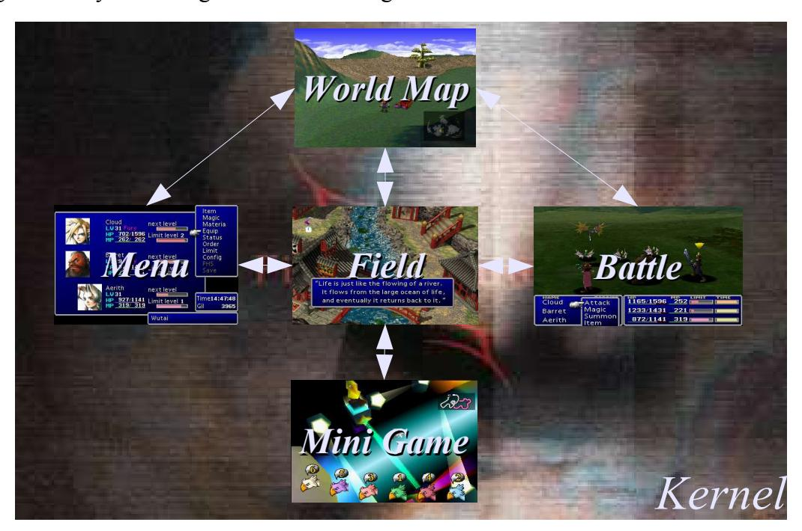

## *II. Generic Program Flow*

Not every module is accessible by every other module. There is a distinct flow between them. For example, you can not access the menu from battle, much to the chagrin of the poor user who had forgotten to equip some last minute item. The field module, second only to the kernel, drives the game. It includes a powerful scripting system that can call any module within the game.

# **The Kernel**

## *I. Kernel Overview* **1.1 History**

The kernel is a throwback to the very first Final Fantasy game for the Nintendo's original 8 bit system. The NES could only natively read 32 kilobytes of program ROM. To get around this incredible limitation, Nintendo developed "memory mappers" that allowed parts of the program to be switched out, or "banked" and replaced with other parts stored on the game cartridge.

FF1 used Nintendo's "Memory Manager Controller #1" (MMC1) . This controller split the game into sixteen sections, each 16 kilobytes long. (The maximum an MMC1 program could be was 256K). This controller also split the accessible memory from the cartridge into two 16K sections. The top 16K was bankable. The bottom 16K could never be switched out and stayed in memory until you removed the cartridge.

The original FF1 kernel was located in this bottom 16K of memory.

First and foremost the kernel contained the main program loop. It handled all the low level functions for the game. Some of these included controlling interrupts, banking in and out the appropriate part of the game, jumping control to a particular module, playing the music, and other tasks.

As the Final Fantasy franchise grew, so did the size of the games. They all still retained the kernel/module system. During the backporting process, this did cause a few headaches. For example, Final Fantasy VI was originally developed for the Super Nintendo. When its menu module was banked in, it was done with electronic bank switching. The later PSX port banked the data from the CD-ROM, which caused an unexpected lag that one wasn't used to. On the PC version for FF7, the menu system was simply integrated into the main executable.

#### **1.2 Kernel Functionality**

The Kernel is a threaded multitasking program that manages the whole system. It uses a simple software based memory manager that handles both RAM and video memory for all the modules in the game. Assisting the kernel are many statically linked Psy-Q libraries. In the case of the PC port, the Psy-Q libs were replaced with a PC equivalent. For example the SEQ player was replaced with a MIDI player, Both accomplish the same tasks, just with different formats and execution strategies. The table below is a generic representation of how the kernel sits in relation to the other aspects of the program.

| User     |                 |  |
|----------|-----------------|--|
| Module   |                 |  |
| Kernel   |                 |  |
|          | Psy-Q libraries |  |
| PSX BIOS |                 |  |
| Hardware |                 |  |

## *II. Memory management*

#### **1.1. RAM management**

No matter what module is banked into memory, there is a section of memory 4,340 bytes long (0x10F4 bytes) that is reserved for all the variables for the entire game. This entire image is called the "Save Map". When it's time to save a game, this section of memory is copied to non-volatile ram, such as a hard disk or memory card.

Within the save map there are 5 banks of memory that are directly accessible by the field scripting language. These can either be accessed 8 bits or 16 bits at a time depending on the field command argument. The following table is basic memory map of the banks and how they relate to the save map. There is also an allocation for 256 bytes for temporary field variables. These are not used between field files and are not saved.

| Offset | 8 Bit Field<br>Bank | 16 Bit Field<br>Bank | Description                           |
|--------|---------------------|----------------------|---------------------------------------|
| 0x0000 | N/A                 | N/A                  | Beginning of Save Map                 |
| 0x0BA4 | 0x1                 | 0x2                  | Field Script Bank 1                   |
| 0x0CA4 | 0x3                 | 0x4                  | Field Script Bank 2                   |
| 0x0DA4 | 0xB                 | 0xC                  | Field Script Bank 3                   |
| 0x0EA4 | 0xD                 | 0xE                  | Field Script Bank 4                   |
| 0x0FA4 | 0x7                 | 0xF                  | Field Script Bank 5                   |
| 0x10F4 | N/A                 | N/A                  | End of Save Map                       |
|        |                     |                      |                                       |
| N/A    | 0x5                 | 0x6                  | Temporary field variables (256 bytes) |

A more complete and annotated save map is in the MENU section.

#### **1.2. VRAM management**

The kernel is in charge of allocating, caching, and displaying in Video RAM. The the case if the PSX, port, the Playstation only has 1 megabyte of VRAM which makes this task a little complex. This is alleviated somewhat by using the PSX's VRAM caching system.

The PSX video memory can best be seen as a rectangular "surface" made up of 2048x512 pixels. A slight caveat to this model is that the PSX can hold multiple color depths in VRAM at the same time. To make the VRAM a little easier to visualize, This document represents VRAM as a 1024x512 matrix to allow for some color depth in either direction and to minimize some extreme skewing of the video buffers.

The following is a typical state of VRAM during game play.


The two game screens on the left side are the video buffer and the back buffer. The patchwork of graphics on the top right are the field graphics for that scene. The bottom row consists of cached graphics and special effects and on right semi-permanent and permanent textures for the game.

The following is a schematic representation of VRAM and all its texture boundaries.

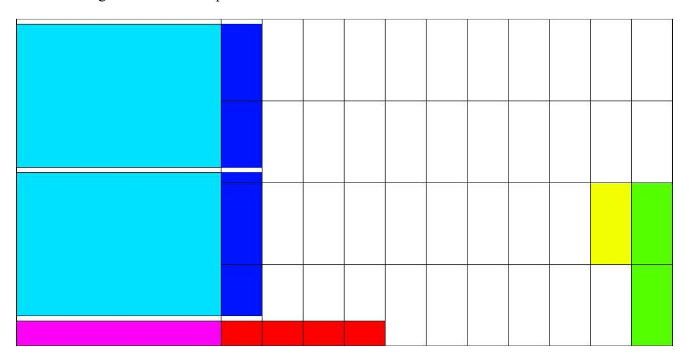

Here the sections of VRAM are much more visible. The large cyan areas are the video frame buffers. The PSX uses a standard double page buffer to animate the game. The blank areas above and below the frame buffers are blank to allow for a correct V-sync. The dark blue areas to the right of the frame buffers are when the game plays 24 bit movies. This requires a slightly larger display and the first two texture caches are overwritten. During times in the game where no movies can take place, such as Battle, textures are commonly placed here.

The magenta area under the video buffers is the Color Look Up Tables (CLUT). This is where the texture palettes are stored. This is also allows the PSX to display multiple color depths at the same time. The red area to the right is extra CLUT space when it is needed and there are no textures cached there.

The green area on the right is the permanent menu textures and the yellow is where the menu font is located.

All the blank rectangles are the texture cache boundaries. In order of volatility, the top two rows of cache space are overwritten from left to right, and then the bottom rows are overwritten. The textures on the bottom right are barely overwritten except for key places.

#### **1.3. PSX CD-ROM management**

One of the big rules on PSX development is direct hardware access is a prohibited. Everything must go through the BIOS or the program will risk being incompatible with later systems. This means not only the from PSX to PS2, but also all the trivial hardware revisions as well. This creates a problem for the kernel. During module transitions, (For example, going from "Map" to "Battle"), the engine actually "preloads" the next module while the current one is still executing. This loading of data can't be done with a simple open() or read() BIOS syscall. Whenever you enter the BIOS, the rest of the system comes to a screeching halt until it is exited.

This problem is solved by the FF7 actually controlling the CD-ROM access itself though faster, lowlevel BIOS calls. The kernel can only load 8 kilobytes at a time in this "quick mode" The in this mode the kernel also only references files by what sector of the CD-ROM the data is located on, not by filename.

## *III. Game resources*

#### Important files:

| PSX Version      | PC Version               |
|------------------|--------------------------|
| /INIT/KERNEL.BIN | /DATA/KERNEL/KERNEL.BIN  |
|                  | /DATA/KERNEL/KERNEL2.BIN |

#### **1.1 The KERNEL.BIN Archive.**

The file /INIT/KERNEL.BIN is in BIN-GZIP format. This format is explained later in this document. It consists of 27 gziped sections concatenated together with a 6 byte header for each. This file is the same both on the PC and PSX versions. This holds all the static data and menu text for the game, with a look up table at the beginning of the section. Sections 10-27 are FF Text files.

The KERNEL.BIN file consists of the following sections.

| File | Data                          | Offset |
|------|-------------------------------|--------|
| 1    | Command data                  | 0x0006 |
| 2    | Attack data                   | 0x0086 |
| 3    | Unknown (Savemap?)            | 0x063A |
| 4    | Character starting stats      | 0x0F7F |
| 5    | Item data                     | 0x111B |
| 6    | Weapon data                   | 0x137A |
| 7    | Armor data                    | 0x1A30 |
| 8    | Accessory data                | 0x1B73 |
| 9    | Materia data                  | 0x1C11 |
| 10   | Command Descriptions          | 0x1F32 |
| 11   | Magic Descriptions            | 0x2119 |
| 12   | Item Descriptions             | 0x28D4 |
| 13   | Weapon Descriptions           | 0x2EE2 |
| 14   | Armor Descriptions            | 0x307B |
| 15   | Accessory Descriptions        | 0x315F |
| 16   | Materia Descriptions          | 0x3384 |
| 17   | Key Item Description          | 0x3838 |
| 18   | Command Names                 | 0x3BE2 |
| 19   | Magic Names                   | 0x3CCA |
| 20   | Item Names                    | 0x4293 |
| 21   | Weapon Names                  | 0x4651 |
| 22   | Armor Names                   | 0x4B02 |
| 23   | Accessory Names               | 0x4C4B |
| 24   | Materia Names                 | 0x4D90 |
| 25   | Key Item Names                | 0x5040 |
| 26   | Battle and Battle-Screen Text | 0x5217 |
| 27   | Summon Attack Names           | 0x5692 |

#### KERNEL.BIN Section formats

The first 9 sections of data (i.e. The non-text related items) have a typical BIN file format. The text sections (10-27) do not have the typical 6 byte header. The text sections have a header of pointers to the text block. The text is in FF text format.

#### Section 1: Command data format

This contains the data for Menu commands. Each recored is 16 bytes long

| Offset | Length | Description |  |
|--------|--------|-------------|--|
|        |        |             |  |
|        |        |             |  |
|        |        |             |  |
|        |        |             |  |
|        |        |             |  |
|        |        |             |  |
|        |        |             |  |
|        |        |             |  |
|        |        |             |  |
|        |        |             |  |
|        |        |             |  |

#### Section 2: Attacks data format

This contains the data for the different attacks. Each record is 28 bytes long.

| Offset | Length  | Description      |                         |
|--------|---------|------------------|-------------------------|
| 0x00   | 4 bytes | Unknown          |                         |
| 0x04   | 1 byte  | Casting cost     |                         |
| 0x05   | 5 bytes | Unknown          |                         |
| 0x0A   | 1 byte  | Attack type      |                         |
| 0x0B   | 2 bytes | Attack attribute |                         |
|        |         | 0x0000           | Escape/Exit-Type        |
|        |         | 0x0001           | Ribbon-Like             |
|        |         | 0x0003           | Enemy Skill(?)          |
|        |         | 0x0005           | Enemy Skill(?)          |
|        |         | 0x0007           | Enemy Skill(?)          |
|        |         | 0x000D           | Restorative/Protective  |
|        |         | 0x000F           | Status-giving/Elemental |
|        |         | 0x0011           | Shield                  |
|        |         | 0x0013           | Limit Break             |
|        |         | 0x0015           | Cait Seith Limit Break  |
|        |         | 0x0017           | Summon                  |
|        |         | 0x00C7           | Roulette                |

| Offset | Length  |                 | Description                  |
|--------|---------|-----------------|------------------------------|
|        |         | 0x0097          | Multiple Strike Limit breaks |
|        |         | 0xFF01          | Phoenix Down                 |
|        |         | 0xFF03          | X-needles attack             |
|        |         | 0xFF17          | Final Limit break            |
| 0x0D   | 1 byte  | ID Number       |                              |
| 0x0E   | 1 byte  | Restore Apply   |                              |
| 0x0F   | 1 byte  | Strength        |                              |
| 0x10   | 1 byte  | Restore type    |                              |
|        |         | 0x00            | Restore HP                   |
|        |         | 0x01            | Restore MP                   |
|        |         | 0x02            | Restore Ailment              |
|        |         | 0xFF            | None                         |
| 0x11   | 2 bytes | Unknown         |                              |
| 0x13   | 1 byte  | Times attacking |                              |
| 0x14   | 4 bytes | Statuses        |                              |
| 0x18   | 2 bytes | Element         |                              |
| 0x20   | 2 bytes | Unknown         |                              |

#### Section 3 Savemap

This is all the initial values and structure for most of the Savemap, excluding the header data and the tail of the last bank. (0x0054 to 0x0fe7). This is copied into ram on initialization. This format is explained in the "Menu" Section.

#### Section 4 Initialization data

This contains the starting stats for the characters and related game states. On "New Game", this data is copied directly into the save map, (From offset 0x0054 to 0x0BAF) which is explained in the "Menu" section. This data has the same format as the data explained in that section.

#### Section 5 Item data format

This contains the item data. Each item record is 27 bytes long.

| Offset | Length  | Description      |                                                                             |  |
|--------|---------|------------------|-----------------------------------------------------------------------------|--|
| 0x00   | 8 bytes | Unknown          | [Always 0xFFFFFFFF]                                                         |  |
| 0x08   | 2 bytes | Unknown          |                                                                             |  |
| 0x0A   | 1 byte  | Restriction Mask |                                                                             |  |
|        |         | 0xFF             | Appears in Item Menu. Does not appear in<br>Battle Menu (Not usable at all) |  |
|        |         | 0xFE             | Appears in Battle Menu & Item Menu (Not<br>usable at all)                   |  |

| Offset | Length  | Description       |                                                                                                |
|--------|---------|-------------------|------------------------------------------------------------------------------------------------|
|        |         | 0xFD              | Appears in Item Menu. Does not appear in<br>Battle Menu (Usable in Battle Menu)                |
|        |         | 0xFC              | Appears in Battle Menu & Item Menu (Usable<br>in Battle Menu)                                  |
|        |         | 0xFB              | Appears in Item Menu. Does not appear in<br>Battle Menu (Usable in Item Menu)                  |
|        |         | 0xFA              | Appears in Battle Menu & Item Menu (Usable<br>in Item Menu)                                    |
|        |         | 0xF9              | Appears in Item Menu. Does not appear in<br>Battle Menu (Usable in Item Menu & Battle<br>Menu) |
|        |         | 0xF8              | Appears in Battle Menu & Item Menu (Usable<br>in Item Menu & Battle Menu)                      |
|        |         | 0xF7              | Appears in Item Menu. Does not appear in<br>Battle Menu (Usable in Battle Menu)                |
|        |         | 0xF6              | Appears in Battle Menu & Item Menu (Usable<br>in Battle Menu)                                  |
| 0x0B   | 2 bytes | Attack Target     |                                                                                                |
|        |         | 0x01              | One Target                                                                                     |
|        |         | 0x03              | Unknown                                                                                        |
|        |         | 0x05              | Multiple Targets                                                                               |
|        |         | 0x07              | Unknown                                                                                        |
|        |         | 0x10              | On Party Only                                                                                  |
| 0x0D   | 1 byte  | Item ID           |                                                                                                |
| 0x0E   | 1 byte  | Restore Apply     |                                                                                                |
|        |         | 0x00              | Unknown                                                                                        |
|        |         | 0x08              | Apply also to MP                                                                               |
|        |         | 0x22              | Unknown                                                                                        |
|        |         | 0x23              | Unknown                                                                                        |
|        |         | 0x24              | Damage / Restore by %                                                                          |
|        |         | 0x26              | Damage / Restore by 20 X Amount Multiplier                                                     |
|        |         | 0x37              | Causes Damage                                                                                  |
|        |         | 0x47              | Unknown                                                                                        |
|        |         | 0x50              | Affects Stats                                                                                  |
|        |         | 0xFF              | None                                                                                           |
| 0x0F   | 1 byte  | Amount Multiplier |                                                                                                |
| 0x10   | 1 byte  | Restore Type      |                                                                                                |

| Offset | Length  | Description    |                 |
|--------|---------|----------------|-----------------|
|        |         | 0x00           | Restore HP      |
|        |         | 0x01           | Restore MP      |
|        |         | 0x02           | Restore Ailment |
|        |         | 0xFF           | None            |
| 0x11   | 3 bytes | Unknown        |                 |
| 0x14   | 4 bytes | Status effects |                 |
| 0x18   | 2 bytes | Element        |                 |
| 0x1A   | 2 bytes | Unknown        |                 |

#### Section 6 Weapon data format

This contains the weapon data. Each Weapon attribute is 44 Bytes Long.

|                                |        | This contains the weapon data. Each Weapon attribute is 44 Bytes Long. |                                                                                                                                                                                                                                                   |  |
|--------------------------------|--------|------------------------------------------------------------------------|---------------------------------------------------------------------------------------------------------------------------------------------------------------------------------------------------------------------------------------------------|--|
| Offset                         | Length | Description                                                            |                                                                                                                                                                                                                                                   |  |
| 0x00<br>1 byte<br>Weapon Range |        |                                                                        |                                                                                                                                                                                                                                                   |  |
|                                |        | 0x03                                                                   | Long Range                                                                                                                                                                                                                                        |  |
|                                |        | 0x23                                                                   | Normal Range                                                                                                                                                                                                                                      |  |
| 0x01                           | 1 byte |                                                                        | Unknown [Always 0xFF]                                                                                                                                                                                                                             |  |
| 0x02                           | 1 byte |                                                                        | Special Options (Attack Modifiers)                                                                                                                                                                                                                |  |
|                                |        | 0x11                                                                   | Normal                                                                                                                                                                                                                                            |  |
|                                |        | 0xA0                                                                   | 1 + Number of Status Effects Tifa has out of following:<br>Near-death, Poison, Sadness, Silence, Slow, Darkness + 2 *<br>Number of Status Effects Tifa has out of following: Death<br>sentence, Slow-numb                                         |  |
|                                |        | 0xA1                                                                   | Power up when near death                                                                                                                                                                                                                          |  |
|                                |        | 0xA2                                                                   | 1 + Number of Allies in Death Status                                                                                                                                                                                                              |  |
|                                |        | 0xA3                                                                   | (Target's Level / 16) When used against allies, the weapon<br>will act like a physical hit, but will cause no damage (not<br>even a Miss or a 0). The Weapon has no Morph modifier; it<br>does the same damage with or without Morph. (Conformer) |  |
|                                |        | 0xA4                                                                   | (1 + [48 * Player's HP / Player's Max HP]) / 16                                                                                                                                                                                                   |  |
|                                |        | 0xA5                                                                   | (1 + [48 * Player's MP / Player's Max MP]) / 16                                                                                                                                                                                                   |  |
|                                |        | 0xA6                                                                   | (1 + [Total AP on Weapon / 10000]) / 16                                                                                                                                                                                                           |  |
|                                |        | 0xA7                                                                   | (10 + [Player's Kills / 128]) / 16                                                                                                                                                                                                                |  |
|                                |        | 0xA8                                                                   | (1 + [Player's Limit Level * Player's Limit Units / 16]) / 16                                                                                                                                                                                     |  |
| 0x03                           | 1 byte | Unknown [Always 0xFF]                                                  |                                                                                                                                                                                                                                                   |  |
| 0x04                           | 1 byte | Weapon Attack                                                          |                                                                                                                                                                                                                                                   |  |
| 0x05                           | 1 byte | Unknown [Always 0xFF]                                                  |                                                                                                                                                                                                                                                   |  |
| 0x06                           | 1 byte | Materia growth rate                                                    |                                                                                                                                                                                                                                                   |  |

| Offset | Length  | Description                        |                          |  |
|--------|---------|------------------------------------|--------------------------|--|
| 0x07   | 1 byte  | Unknown                            |                          |  |
| 0x08   | 1 byte  | Weapon attack percentage           |                          |  |
| 0x09   | 3 bytes | Weapon Model ID                    |                          |  |
| 0x0C   | 2 bytes |                                    | Unknown [Aways 0xFFFF]   |  |
| 0x0E   | 2 bytes | Equip Mask                         |                          |  |
|        |         | 0x0001                             | Equipable on Cloud       |  |
|        |         | 0x0002                             | Equipable on Barret      |  |
|        |         | 0x0004                             | Equipable on Tifa        |  |
|        |         | 0x0008                             | Equipable on Aeris       |  |
|        |         | 0x0010                             | Equipable on Red XIII    |  |
|        |         | 0x0020                             | Equipable on Yuffie      |  |
|        |         | 0x0040                             | Equipable on Cait Sith   |  |
|        |         | 0x0080                             | Equipable on Vincent     |  |
|        |         | 0x0100                             | Equipable on Cid         |  |
|        |         | 0x0200                             | Equipable on Young Cloud |  |
|        |         | 0x0400                             | Equipable on Sephiroth   |  |
| 0x10   | 2 bytes | Attack Type                        |                          |  |
|        |         | 0x0004                             | Cut                      |  |
|        |         | 0x0008                             | Hit                      |  |
|        |         | 0x0010                             | Punch                    |  |
|        |         | 0x0020                             | Hit                      |  |
| 0x12   | 2 bytes | Unknown [Always 0xFFFF]            |                          |  |
| 0x14   | 4 bytes | Increase Stat Type                 |                          |  |
|        |         | 0xFF                               | None                     |  |
|        |         | 0x00                               | Strength                 |  |
|        |         | 0x01                               | Vitality                 |  |
|        |         | 0x02                               | Magic                    |  |
|        |         | 0x03                               | Spirit                   |  |
|        |         | 0x04                               | Dexterity                |  |
|        |         | 0x05                               | Luck                     |  |
| 0x18   | 4 bytes | Stat Amount Increased(Based on IT) |                          |  |
| 0x1C   | 8 bytes | Materia Slots                      |                          |  |

| Offset | Length  | Description           |                                                                                             |  |  |
|--------|---------|-----------------------|---------------------------------------------------------------------------------------------|--|--|
|        |         | 0x00                  | No Slot                                                                                     |  |  |
|        |         | 0x05                  | Unlinked Slot                                                                               |  |  |
|        |         | 0x06                  | Left Linked Slot                                                                            |  |  |
|        |         | 0x07                  | Right Linked Slot                                                                           |  |  |
| 0x24   | 3 bytes | Unknown               |                                                                                             |  |  |
| 0x27   | 1 byte  |                       | Attack texture graphic                                                                      |  |  |
| 0x28   | 2 byes  |                       | Unknown [Always 0xFFFF]                                                                     |  |  |
| 0x2A   | 1 byte  |                       | Restriction Mask                                                                            |  |  |
|        |         | 0xFF                  | Appears in Item Menu. Does not appear in Battle Menu<br>(Not usable at all)                 |  |  |
|        |         | 0xFE                  | Appears in Battle Menu & Item Menu (Not usable at all)                                      |  |  |
|        |         | 0xFD                  | Appears in Item Menu. Does not appear in Battle Menu<br>(Usable in Battle Menu)             |  |  |
|        |         | 0xFC                  | Appears in Battle Menu & Item Menu (Usable in Battle<br>Menu)                               |  |  |
|        |         | 0xFB                  | Appears in Item Menu. Does not appear in Battle Menu<br>(Usable in Item Menu)               |  |  |
|        |         | 0xFA                  | Appears in Battle Menu & Item Menu (Usable in Item<br>Menu)                                 |  |  |
|        |         | 0xF9                  | Appears in Item Menu. Does not appear in Battle Menu<br>(Usable in Item Menu & Battle Menu) |  |  |
|        |         | 0xF8                  | Appears in Battle Menu & Item Menu (Usable in Item<br>Menu & Battle Menu)                   |  |  |
|        |         | 0xF7                  | Appears in Item Menu. Does not appear in Battle Menu<br>(Usable in Battle Menu)             |  |  |
|        |         | 0xF6                  | Appears in Battle Menu & Item Menu (Usable in Battle<br>Menu)                               |  |  |
| 0x2B   | 1 byte  | Unknown [Always 0xFF] |                                                                                             |  |  |

#### Section 7 Armor data format

This contains the armor data. Each record is 36 bytes long.

| Offset | Length | Description                                        |           |  |
|--------|--------|----------------------------------------------------|-----------|--|
| 0x01   | 1 byte | Unknown                                            |           |  |
| 0x02   | 1 byte | Damage Type,<br>Based off values of Elemental Type |           |  |
|        |        | 0xFF                                               | Normal    |  |
|        |        | 0x00                                               | Absorb    |  |
|        |        | 0x01                                               | No Damage |  |
|        |        | 0x02                                               | Half      |  |

| Offset | Length  | Description                |                   |  |
|--------|---------|----------------------------|-------------------|--|
| 0x03   | 1 byte  | Defense                    |                   |  |
| 0x04   | 1 byte  | Magic Defense              |                   |  |
| 0x05   | 1 byte  | Defense %                  |                   |  |
| 0x06   | 1 byte  | Magic Defense %            |                   |  |
| 0x07   | 3 bytes | Unknown                    |                   |  |
| 0x08   | 8 Bytes | Materia Slots              |                   |  |
|        |         | 0x00                       | No Slot           |  |
|        |         | 0x05                       | Unlinked Slot     |  |
|        |         | 0x06                       | Left Linked Slot  |  |
|        |         | 0x07                       | Right Linked Slot |  |
| 0x12   | 1 byte  | Materia Growth             |                   |  |
| 0x13   | 1 byte  | Equip Mask                 |                   |  |
|        |         | 0xFF01                     | Everyone          |  |
|        |         | 0x2C00                     | All Females       |  |
|        |         | 0xD303                     | All Males         |  |
| 0x15   | 1 byte  | Element                    |                   |  |
|        |         | 0x01                       | Fire              |  |
|        |         | 0x02                       | Ice               |  |
|        |         | 0x04                       | Bolt              |  |
|        |         | 0xFF                       | All Elements      |  |
| 0x16   | 1 byte  | Unknown                    |                   |  |
| 0x17   | 2 bytes | Unknown                    | [Always 0x00FF]   |  |
| 0x19   | 2 bytes | Stat Bonus                 |                   |  |
|        |         | 0xFF                       | None              |  |
|        |         | 0x00                       | Strength          |  |
|        |         | 0x01                       | Vitality          |  |
|        |         | 0x02                       | Magic             |  |
|        |         | 0x03                       | Spirit            |  |
|        |         | 0x04                       | Dexterity         |  |
|        |         | 0x05                       | Luck              |  |
| 0x1B   | 2 bytes | Unknown                    | [Always 0xFFFF]   |  |
| 0x1D   | 2 bytes | Stat increase              |                   |  |
| 0x1F   | 2 bytes | Unknown<br>[Always 0xFFFF] |                   |  |
| 0x21   | 1 byte  | Restriction Mask           |                   |  |

| Offset | Length  | Description |                                                                                                |  |
|--------|---------|-------------|------------------------------------------------------------------------------------------------|--|
|        |         | 0xFF        | Appears in Item Menu. Does not<br>appear in Battle Menu (Not usable<br>at all)                 |  |
|        |         | 0xFE        | Appears in Battle Menu & Item<br>Menu (Not usable at all)                                      |  |
|        |         | 0xFD        | Appears in Item Menu. Does not<br>appear in Battle Menu (Usable in<br>Battle Menu)             |  |
|        |         | 0xFC        | Appears in Battle Menu & Item<br>Menu (Usable in Battle Menu)                                  |  |
|        |         | 0xFB        | Appears in Item Menu. Does not<br>appear in Battle Menu (Usable in<br>Item Menu)               |  |
|        |         | 0xFA        | Appears in Battle Menu & Item<br>Menu (Usable in Item Menu)                                    |  |
|        |         | 0xF9        | Appears in Item Menu. Does not<br>appear in Battle Menu (Usable in<br>Item Menu & Battle Menu) |  |
|        |         | 0xF8        | Appears in Battle Menu & Item<br>Menu (Usable in Item Menu &<br>Battle Menu)                   |  |
|        |         | 0xF7        | Appears in Item Menu. Does not<br>appear in Battle Menu (Usable in<br>Battle Menu)             |  |
|        |         | 0xF6        | Appears in Battle Menu & Item<br>Menu (Usable in Battle Menu)                                  |  |
| 0x22   | 3 bytes | Unknown     | [Aways 0xFFFFFF]                                                                               |  |

#### Section 8 Accessory data format

This contains the accessory data. Each record is 16 bytes long.

| Offset          | Length  | Description  |           |  |
|-----------------|---------|--------------|-----------|--|
| 0x00            | 2 bytes | Stat Bonus   |           |  |
|                 |         | 0xFF         | None      |  |
|                 |         | 0x00         | Strength  |  |
|                 |         | 0x01         | Vitality  |  |
|                 |         | 0x02         | Magic     |  |
|                 |         | 0x03         | Spirit    |  |
|                 |         | 0x04         | Dexterity |  |
|                 |         | 0x05         | Luck      |  |
| 0x02<br>2 bytes |         | Bonus Amount |           |  |

| Length  | Description        |                            |
|---------|--------------------|----------------------------|
| 1 byte  | Elemental Strength |                            |
|         | 0x00               | Drains                     |
|         | 0x01               | Nullifies                  |
| 1 byte  | Special Effect     |                            |
|         | 0x00               | Haste                      |
|         | 0x01               | Fury                       |
|         | 0x02               | Curse Ring Effect          |
|         | 0x03               | Reflect                    |
|         | 0x04               | Increase Stealing Rate     |
|         | 0x05               | Increase Manipulation Rate |
|         | 0x06               | Barrier / MBarrier         |
| 2 bytes | Elemental Type     |                            |
|         | 0x01               | Fire                       |
|         | 0x02               | Ice                        |
|         | 0x04               | Lightning                  |
|         | 0x08               | Earth                      |
|         | 0x10               | Poison                     |
|         | 0x20               | Gravity                    |
|         | 0x40               | Water                      |
|         | 0x80               | Wind                       |
|         | 0x0001             | Holy                       |
|         | 0xFF01             | All of the above           |
| 4 bytes | Status Protect     |                            |
|         | 0x00               | None                       |
|         | 0x01               | Death                      |
|         | 0x02               | Near Death                 |
|         | 0x04               | Sleep                      |
|         | 0x08               | Poison                     |
|         | 0x10               | Sadness                    |
|         | 0x20               | Fury                       |
|         | 0x40               | Confusion                  |
|         | 0x80               | Silence                    |
|         |                    | Haste                      |
|         | 0x0020             | Slow                       |
|         |                    | 0x0010                     |

| Offset | Length | Description                      |                                                                                    |  |
|--------|--------|----------------------------------|------------------------------------------------------------------------------------|--|
|        |        | 0x0040                           | Stop                                                                               |  |
|        |        | 0x0080                           | Frog                                                                               |  |
|        |        | 0x0001<br>Small                  |                                                                                    |  |
|        |        | 0x0002                           | Slow-numb                                                                          |  |
|        |        | 0x0004                           | Petrify                                                                            |  |
|        |        | 0x0008                           | Regen                                                                              |  |
|        |        | 0xFFFF                           | All Of The Above                                                                   |  |
| 0x0C   | 2 byes | Equip Mask                       |                                                                                    |  |
|        |        | 0x0001                           | Equipable on Cloud                                                                 |  |
|        |        | 0x0002                           | Equipable on Barret                                                                |  |
|        |        | 0x0004                           | Equipable on Tifa                                                                  |  |
|        |        | 0x0008                           | Equipable on Aeris                                                                 |  |
|        |        | 0x0010                           | Equipable on Red XIII                                                              |  |
|        |        | 0x0020                           | Equipable on Yuffie                                                                |  |
|        |        | 0x0040<br>Equipable on Cait Sith |                                                                                    |  |
|        |        | 0x0080                           | Equipable on Vincent                                                               |  |
|        |        | 0x0100<br>Equipable on Cid       |                                                                                    |  |
|        |        | 0x0200                           | Equipable on Young Cloud                                                           |  |
|        |        | 0x0400                           | Equipable on Sephiroth                                                             |  |
| 0x0E   | 1 byte | Restriction Mask                 |                                                                                    |  |
|        |        | 0xFF                             | Appears in Item Menu. Does<br>not appear in Battle Menu<br>(Not usable at all)     |  |
|        |        | 0xFE                             | Appears in Battle Menu &<br>Item Menu (Not usable at all)                          |  |
|        |        | 0xFD                             | Appears in Item Menu. Does<br>not appear in Battle Menu<br>(Usable in Battle Menu) |  |
|        |        | 0xFC                             | Appears in Battle Menu &<br>Item Menu (Usable in Battle<br>Menu)                   |  |
|        |        | 0xFB                             | Appears in Item Menu. Does<br>not appear in Battle Menu<br>(Usable in Item Menu)   |  |
|        |        | 0xFA                             | Appears in Battle Menu &<br>Item Menu (Usable in Item<br>Menu)                     |  |

| Offset | Length | Description |                                                                                                   |  |
|--------|--------|-------------|---------------------------------------------------------------------------------------------------|--|
|        |        | 0xF9        | Appears in Item Menu. Does<br>not appear in Battle Menu<br>(Usable in Item Menu &<br>Battle Menu) |  |
|        |        | 0xF8        | Appears in Battle Menu &<br>Item Menu (Usable in Item<br>Menu & Battle Menu)                      |  |
|        |        | 0xF7        | Appears in Item Menu. Does<br>not appear in Battle Menu<br>(Usable in Battle Menu)                |  |
|        |        | 0xF6        | Appears in Battle Menu &<br>Item Menu (Usable in Battle<br>Menu)                                  |  |
| 0x0F   | 1 byte | Unknown     | [Always 0xFF]                                                                                     |  |

#### Section 9 Materia data format

This contains the Materia data. Each record is 20 bytes long.

| Offset | Length  | Description        |                                                                                |  |  |  |
|--------|---------|--------------------|--------------------------------------------------------------------------------|--|--|--|
| 0x00   | 8 bytes | Level-up AP limits | Multiples of 100 (4x WORD)                                                     |  |  |  |
| 0x08   | 1 byte  | Equip Effect       | [See table below]                                                              |  |  |  |
| 0x09   | 3 bytes | Status Bitmask     |                                                                                |  |  |  |
| 0x0C   | 1 byte  | Element            |                                                                                |  |  |  |
| 0x0D   | 1 Byte  | Materia Type       |                                                                                |  |  |  |
|        |         | 0x00               | Unknown                                                                        |  |  |  |
|        |         | 0x08               | Master Command: All commands are available                                     |  |  |  |
|        |         | 0x0A               | Master Magic: All spells are available                                         |  |  |  |
|        |         | 0x0C               | Master Summon: All summons are available                                       |  |  |  |
|        |         | 0x12               | Command: Command at offset 0x0E to 0x12 is<br>available, depending on AP level |  |  |  |
|        |         | 0x16               | Command: Commands at offset 0x0E to 0x12<br>become available as you level up.  |  |  |  |
|        |         | 0x19               | Magic: Spells 0x0E to 0x11 become available<br>as you level up                 |  |  |  |
|        |         | 0x20               | Booster%: 0x0E is boosted by offset 0x0F to<br>0x13 depending on AP level      |  |  |  |
|        |         | 0x21               | Unknown                                                                        |  |  |  |
|        |         | 0x25               | Unknown                                                                        |  |  |  |
|        |         | 0x30               | Unknown                                                                        |  |  |  |

| Offset | Length | Description        |                                                                                           |  |
|--------|--------|--------------------|-------------------------------------------------------------------------------------------|--|
|        |        | 0x33               | W-Command: Command at 0x0E is added to the<br>battle menu                                 |  |
|        |        | 0x35               | Unknown                                                                                   |  |
|        |        | 0x3B               | Summon: Spell at 0x0E can be used from offset<br>0x0F to 0x13 times depending on AP level |  |
|        |        | 0x57               | Enemy Skill:Enables command 'Enemy Skill'                                                 |  |
| 0x0E   | 1 byte | Materia attributes | [See Above]                                                                               |  |
| 0x0F   | 1 byte | Materia attributes | [See Above]                                                                               |  |
| 0x10   | 1 byte | Materia attributes | [See Above]                                                                               |  |
| 0x11   | 1 byte | Materia attributes | [See Above]                                                                               |  |
| 0x12   | 1 byte | Materia attributes | [See Above]                                                                               |  |
| 0x13   | 1 byte | Materia attributes | [See Above]                                                                               |  |

Equip Effects

| Byte | STR | VIT | MAG | MDEF | MAXHP | MAXMP | LUCK | DEX |
|------|-----|-----|-----|------|-------|-------|------|-----|
| 0x00 |     |     |     |      |       |       |      |     |
| 0x01 | -02 | -01 | +02 | +01  | -05%  | +05%  |      |     |
| 0x02 | -04 | -04 | +04 | +02  | -10%  | +10%  |      |     |
| 0x06 |     | +01 |     |      |       |       |      |     |
| 0x07 |     |     |     |      |       |       | +01  |     |
| 0x08 |     |     |     |      |       |       | -01  |     |
| 0x0A |     |     |     |      |       |       |      | +02 |
| 0x0B | -01 |     | +01 |      | -02%  | +02%  |      |     |
| 0x0C |     |     | +01 |      | -02%  | +02%  |      |     |
| 0x0D |     |     | +01 | +01  | -05%  | +05%  |      |     |
| 0x0E |     |     | +02 | +02  | -10%  | +10%  |      |     |
| 0x0F |     |     | +04 | +04  | -10%  | +15%  |      |     |
| 0x10 |     |     | +08 | +08  | -10%  | +20%  |      |     |

#### **2.1 The KERNEL2.BIN Archive.**

On the PC version there exists a secondary kernel archive called KERNEL2.BIN.This archive contains only sections 10-27 (Text data) of KERNEL.BIN. The data was ungzipped from the original archive, concatenated together, and then LZSed into a single archive with a 4 byte header giving the length of the file. See the section on BIN types and LZS compression later in this document for more information.

## *IV. Low Level Libraries*

#### **1. PC to PSX comparison**

The files and data formats used in the PSX version of FF7 and its PC port are conceptually the same thing, and accomplish the same tasks. That being said, they both have wildly different formats. Both of which were derived from a third original format that is also somewhat different than the first two.

The original PSX FF7 was created in part using Sony's Psy-Q development library. This library uses common formats that are "native" to the PSX. Often times a toolkit was used to convert common development- based formats, such as a TGA bitmap or a palleted GIF file, to something a little more suited to Psy-Q, which would be a TIM file.

During the porting process to the PC, some of the original artwork, (and artists for that matter), were no longer available. This resulted in the port team having to use the Psy-Q versions of many files, which were ill suited for the PC architecture. In our example, the TIM file was converted to a TEX file, which would be manipulated in the PC's video memory a little more efficiently. Sometimes the original artwork was available, such as the pictures of the characters within the menu, or the original MIDI files. Most often times it was not.

To make things a little more confusing, both systems also archive their data files in different ways, making the extraction and rendering of each file a bit of a bear. For the most part the data within each file is the same thing, just a little switched around. This manual will cover the more generic files first, and then common files used in each module.

### **1.1 DATA ARCHIVES**

To save space, quicken access time, and to obfuscate the file structure a little, most of the data files are stored in some kind of archive format. The archives remove such useful items as subdirectories and logical data placement. There is no real "native" format these are based on.

#### **1.1.1 BIN archive data format**

The BIN format comes as two different types. They both have the same extension, so one must open the file to see which format is which. They are best described as BIN Types and Bin-GZIP types

#### BIN Types

These are uncompressed archives. The header consists of a 4 byte header that gives the length of the file without the header and then the data beyond that.

#### BIN-GZIP Types

Unless otherwise noted, these have a 6 byte header. After this are many gziped sections concatenated together.

| Offset | Length  | Description                          |  |
|--------|---------|--------------------------------------|--|
| 0x0000 | 2 bytes | Length of gzipped sections           |  |
| 0x0002 | 2 bytes | Unknown                              |  |
| 0x0004 | 2 bytes | File number                          |  |
| 0x0006 | varies  | [0x1F8B080000000000] - Gzip header 1 |  |
| varies | 2 bytes | Length of gzipped sections           |  |

| Offset | Length  | Description                          |  |  |
|--------|---------|--------------------------------------|--|--|
| varies | 2 bytes | Unknown                              |  |  |
| varies | 2 bytes | File number                          |  |  |
| varies | varies  | [0x1F8B080000000000] - Gzip header 2 |  |  |
|        |         |                                      |  |  |

#### **1.1.2 LZS Compressed archive for PSX by Ficedula**

#### Format

The LZS archive has a very small header at 0x00 that has the length of the decompressed file as an unsigned 32 bit integer. After that is the compressed data.

### LZS compression

FF7 uses LZS compression on some of their files - more properly, a slightly modified version of LZSS compression as devised by Professor Haruhiko Okumura.

LZS data works on a control byte scheme. So each block in the file begins with a single byte indicating how much of the block is uncompressed ('literal data'), and how much is compressed ('references'). You read the byte right-to-left, with 1=literal, 0=reference.

Literal data means just that: read one byte in from the source (compressed) data, and write it straight to the output.

References take up two bytes, and are essentially a pointer to a piece of data that's been written out (i.e. is part of the data you've already decompressed). LZSS uses a 4K buffer, so it can only reference data in the last 4K of data.

#### Reference format

A reference takes up two bytes, and has two pieces of information in it: offset (where to find the data, or which piece of data is going to be repeated), and length (how long the piece of data is going to be). The two reference bytes look like this:

OOOO OOOO OOOO LLLL (O=Offset, L=Length).

So you get a 12-bit offset and a 4-bit length, but both of these values need modifying to work on directly. The length is easy to work with: just add 3 to it. Why? Well, if a piece of repeated data was less than 3 bytes long, you wouldn't bother repeating it - it'd take up no more space to actually just put literal data in. So all references are at least 3 in length. So a length of 0 means 3 bytes repeated, 1 means 4 bytes repeated, so on. Since we have 4 bits available, that gives us a final length ranging from 3-18 bytes long. (That also means the absolute maximum compression we can ever get using LZSS is a touch under 9:1, since the best possible is to replace 18 bytes of data with two bytes of reference, and then you have to add control bytes as well.)

Offset needs a bit work doing on it, depending on how you're actually holding your data. If all you

have is an input buffer and an output buffer, what you really need is an output position in your buffer to start reading data from. In other words, if you've already written 10,000 bytes to your output, you want to know where to retrieve the repeated data from - it could fall anywhere in the past 4K of data, (i.e. from 5904 through to 9999 bytes.)

Here's how you get it:

```
real_offset = tail - ((tail - 18 - raw_offset) mod 4096)
```

Here, 'tail' is your current output position (eg. 10,000), 'raw\_offset' is the 12-bit data value you've retrieved from the compressed reference, and 'real\_offset' is the position in your output buffer you can begin reading from. This is a bit complex because it's not exactly the way LZSS traditionally does (de) compression; it uses a 4K circular buffer; if you do that, the offset is more or less usable directly.

Once you've got to the start position for your reference, you just copy the appropriate length of data over to your output, and you've dealt with that piece of data.

#### Example

If we're at position 1000 in our output, and we need to read in a new control byte because we've finished with the last one. The next data to look it is:

0x03, 0x53, 0x12 .....

We read in a control byte: \$03. In binary, that's 00000011. That informs us that the current block of data has two compressed offsets (@ 2 bytes each), followed by 6 literal data bytes. Once we'd read in the next 10 bytes (the compressed data plus the literal data), we'd be ready to read in our next control byte and start again.

Looking at the first compressed reference, we read in \$53 \$12. That gives us a base offset of \$153 (the 53 from the first byte, and the '1' from the second byte makes up the higher nybble). The base length is \$2 (we just take the low nybble of the second byte).

Our final length is obviously just 5. Our position in output is still 1000. So our final offset is:

=1000 - ((1000 - 18 - 339) and \$FFF)

The 339 is just \$153 in decimal.

The (and \$FFF) is a quick way to do modulus 4096.

```
=1000 - (643 and 0xFFF)
=1000 - 643
=357
```

So our final offset is 357. We go to position 357 in our output data, read in 5 bytes (remember the length?), then write those 5 bytes out to our output. Now we're ready to read in the next bit of data (another compressed reference), and do the procedure again...

## Complications

Unfortunately, that doesn't quite cover everything - there's two more things to be aware of when decompressing data that \*will\* ruin you when using FF7 files, since they do use these features. First, if you end up with an negative offset, i.e. reading data from 'before the beginning of the file', write out nulls (zero bytes). That's because the compression buffer is, by default, initialized to zeros; so it's possible, if the start of the file contains a run of zeros, that the file may reference a block you haven't written...

EG: If you're at position 50 in your output, it's possible you may get an offset indicating to go back 60 bytes to offset -10! If you have to read 5 bytes from there, it's simple: you just write out 5 nulls. However, you \*could\* have to read 15 bytes from there. In that case, you write out 10 nulls (the part of the data 'before' the file start), then the 5 bytes from the beginning of the file.

Secondly, you can have a repeated run. This is almost the opposite problem: when you go off the end of your output. Say you're at offset 100 in your output, and you have to go to offset 95 to read in a reference. That's OK ... but what if the reference length is >5? In that case, you loop the output. So if you had to write out 15 bytes, you'd write out the five bytes that \*were\* available ... and then write them out again ... then again, to make up the 15 bytes you needed.

The FF7 files use both of these 'tricks', so you can't ignore them!

#### **1.1.3. LGP Archive format for PC by Ficedula**

This section explains how the LGP archives from FF7 PC are constructed. If you're looking for a tool that already manages LGP archives, try [Ficedula](https://qhimm-modding.fandom.com/wiki/User:Ficedula)'s [LGP Editor](http://sylphds.net/f2k3/index.html).

Essentially the LGP file is split up into four (maybe less, depending on how you count it) sections.

1. File header/Table of contents
2. CRC code
3. Actual data
4. File terminator

#### SECTION 1: FILE HEADER

This contains two parts: A header of fixed size, then the table of contents.

The first item is 12 bytes containing the file creator. This is a standard string, except it is "rightaligned". In other words the blank space comes before the actual text, not after. In FF7 it's always "SQUARESOFT" preceded by two nulls to make it 12 bytes. The only other thing you might see is the header "FICEDULA-LGP", which I use to indicate a file is an LGP \*patch\* one of my programs has constructed, not a complete archive.

Next is a four-byte integer saying how many files the archive contains.

Following this is the table of contents (TOC): One entry per file.

Each entry in the TOC has the following structure:

| Offset | Length |
| --- | --- |
| 20 bytes | Null terminated string, giving filename |
| 4 byte integer | Position in this file where data starts for the file |
| 1 byte | Some sort of check code. File attributes? Normally seems to be 14 but it does vary. |
| 2 byte short | Something to do with duplicate file names. If a name is unique it is 0, otherwise it is assigned a value based on existing duplicates. (Hard to explain) |

## SECTION 2: CRC CODE

This code is used to validate the LGP archive. The bad news is I have no idea how to make it (I've figured out how to decode it, ie. find out whether the archive is valid, but I can't create my own). The good news is you don't need to! The only thing this CRC is based on is the number of files in the archive (maybe the filenames too, haven't checked that). Anyway, the TOC is the only thing this check relates to. So if you're replicating an archive from FF7 for use in the game with the same number of files and filenames you can just copy the CRC section from an existing file.

Normally it's 3602 bytes long (one archive may be different, possibly MAGIC.LGP). Anyway, one normally-safe way of calculating the CRC size is to find the end of the TOC and the beginning of the first file. Anything in between is probably CRC code (this is not guaranteed to work. It works with "official" archives but editors - such as [LGP Editor](http://www.ficedula.com/) - can alter the TOC to achieve extra things).

## SECTION 3: ACTUAL DATA

The data from the files. However it's not that simple: the TOC doesn't list how long each file is (somewhat useful). It's done here. The offset in the TOC is actually the position of yet another file header. Format is:

| Size | Description |
| :-: | --- |
| 20 bytes | Null terminated string, giving filename |
| 4 bytes | File length |
| Varies | The file data itself |

#### SECTION 4: TERMINATOR

After the last piece of data comes the file descriptor. This is a simple string, except instead of being null-terminated it's terminated by the end of the file. It's "FINAL FANTASY 7" for all archives, except LGP patches, where it's "LGP PATCH FILE".

#### NOTES

The game is remarkably flexible about LGP archives. So long as the TOC and the CRC data is intact it'll accept just about anything.

Example 1: The filename in the TOC and in the actual file header don't have to match. It only checks the TOC.

Example 2: You can point two entries in the TOC at the same data and it works.

Example 3: You can have ANY junk in the data section so long as all the TOC entries point to a valid file header. Not every piece of data has to be "accounted" for by the TOC. There can be data not used.

[LGP Editor](http://www.ficedula.com/) uses this to its advantage in the Advanced Editor. If you want to replace a file in an LGP archive with your own copy, it just puts the file on the end of the LGP, writes a new file terminator, and updates the TOC to point at the new file. It even lets you link two TOC entries to the same data or have "inactive" files in the archive that aren't referenced by any TOC entry.

I don't know whether the file terminator has to be intact, but for safety's sake my editor preserves it. The CRC must be present and correct. Also, if you're replacing an archive with your own custom version make sure it has filenames in the TOC matching the ones in the old one.

The game doesn't check archive sizes as long as all filenames are present. So if you want, you could replace an archive containing 95 files with a 98-file archive, so long as 95 of those 98 names matched those present in the original 95-file archive. (However there's no point in doing this when the game won't use any files other than the 95 it's expecting to find).

There are reports on [Qhimm's board](http://forums.qhimm.com/) that once you've altered an archive and the game refuses to read it, it won't ever read it until you reinstall - even if you fix the problem/restore from a backup. The idea was generally scorned and ignored, but I'll mention it because something like that happened to me. No solid conclusion can be drawn here.

Sometimes, there are data "gaps" in the file that don't appear to be referenced by any file - even by an inactive file. If you're only using the TOC method to get at files (the easy way) then you won't notice this anyway. However, if you're stepping through the file header by header, even reading the unused ones, this can cause problems. If you use my program to update a file with one that's smaller than the original (can happen) then it writes it in, but leaves a gap after it (of course). However, to help you out, after the end of the file, it writes a 4 byte integer saying how much more space to skip over to reach the next file header.

This really doesn't affect many things - only tools (like my Advanced LGP Editor) that bypass the TOC to construct their own file lists. FF7 never notices a thing.

**Useful downloads:**

Below there are links to known programs that are capable to edit LGP archives:

- [LGP Tools](http://www.sylphds.net/f2k3/programs/lgptools/lgptools160.zip) - with an Advanced LGP Editor allowing edit archive thoroughly
- [Emerald](http://elentor.com/Projetos/FF7-Tools/Extracting/Emerald.zip) - has mass extracting/repacking function
- [Unmass](http://mirex.mypage.sk/index.php?selected=1#Unmass) - general file extractor with LGP archives support

#### **2. TEXTURES**

A texture is just a picture that's placed into video memory. It is later manipulated by the engine and displayed on the screen. The native format of a texture was the Psy-Q TIM (Texture Image Map). This is used as the native format for the PSX version as well, with a few caveats explained below. The file can hold multiple color look up tables. This was one of the reasons why you needed a video card on the PC that could do palleted data even at high color depths.

#### **2.1 TIM texture data format for PSX**

The TIM files are found both on raw format and also within several archives, including BIN, LZS, or

even MNU. The format proper has the ability to contain 24 bit bitmaps, but is not used in FF7. The Format was created because the PSX does not have direct access to its VRAM, and must go through the GPU for any graphic access. A TIM file is a clean way to load a texture and color look up table into VRAM.

#### **2.1.1. Basic Terms**

#### CLUT:

Color look up table. In the PSX's VRAM, it allocates a high color depth table and uses it as a reference for palleted textures. The CLUT in VRAM can be directly changed by the GPU and have the updated color data appear automatically on the screen without having to re-render the view port.

#### VRAM Location:

This is the location the TIM is to be loaded into video memory. The PSX uses a "surface" that one can place viewing windows, textures, and color look up tables using an X/Y coordinate. There are also several cache areas in the PSX's VRAM, and this allows you to place the texture in the correct cache. It also helps to know where your texture is located.

#### CLUT Location:

This is the location where the CLUT is to be loaded into video memory.

#### **2.1.2 TIM file Format**

A TIM has a slightly different format for each color depth. They are explained below.

#### 4 Bits Per Pixel

| Offset              | Size                                | Description             |  |  |
|---------------------|-------------------------------------|-------------------------|--|--|
| 0x00                | 4 bytes                             | 10 00 00 00 : TIM ID    |  |  |
| 0x04                | 4 bytes                             | 08 00 00 00 : 4bpp flag |  |  |
| 0x08                | 4 bytes                             | Unknown                 |  |  |
| 0x0c                | 2 bytes                             | CLUT Location X         |  |  |
| 0x0e                | 2 bytes                             | CLUT Location Y         |  |  |
| 0x10                | 2 bytes                             | Unknown                 |  |  |
| 0x12                | 2 bytes                             | Number Of CLUT entries  |  |  |
| 0x14                | 32 bytes<br>per CLUT<br>(16 colors) | CLUT Data               |  |  |
| After the CLUT data |                                     |                         |  |  |
| +0x00               | 4 bytes                             | Unknown                 |  |  |
| +0x04               | 2 bytes                             | VRAM Location X         |  |  |
| +0x06               | 2 bytes                             | VRAM Location Y         |  |  |
| +0x08               | 2 bytes                             | Image Width / 4         |  |  |
| +0x10               | 2 bytes                             | Image Height            |  |  |
| +0x12               | Varies                              | See below               |  |  |

| Offset | Size | Description |
|--------|------|-------------|
|--------|------|-------------|

Within the Texture data, each byte contains the left and right pixel, with each value corresponding to a color index with 16 entries loaded by the CLUT data

[1,2][3,4][5,6].....

#### 8 Bits Per Pixel

| Offset                                          | Size         | Description             |  |  |  |
|-------------------------------------------------|--------------|-------------------------|--|--|--|
| 0x00                                            | 4 bytes      | 10 00 00 00 : TIM ID    |  |  |  |
| 0x04                                            | 4 bytes      | 09 00 00 00 : 8bpp flag |  |  |  |
| 0x08                                            | 4 bytes      | Unknown                 |  |  |  |
| 0x0c                                            | 2 bytes      | CLUT Location X         |  |  |  |
| 0x0e                                            | 2 bytes      | CLUT Location Y         |  |  |  |
| 0x10                                            | 2 bytes      | Unknown                 |  |  |  |
| 0x12                                            | 2 Bytes      | Number Of CLUT entries  |  |  |  |
| 0x14                                            | 512 bytes    | CLUT Data               |  |  |  |
|                                                 | per CLUT     |                         |  |  |  |
|                                                 | (256 colors) |                         |  |  |  |
|                                                 |              | After the CLUT data     |  |  |  |
| +0x00                                           | 4 bytes      | Unknown                 |  |  |  |
| +0x04                                           | 2 bytes      | VRAM Location X         |  |  |  |
| +0x06                                           | 2 bytes      | VRAM Location Y         |  |  |  |
| +0x08                                           | 2 bytes      | Image Width / 2         |  |  |  |
| +0x10                                           | 2 bytes      | Image Height            |  |  |  |
| +0x12                                           | Texture data | See below               |  |  |  |
| Within the Texture data, each byte contains one |              |                         |  |  |  |

Within the Texture data, each byte contains one pixel, with each value corresponding to a color index with 256 entries loaded by the CLUT data.

[1][2][3][4].....

#### 16 Bits Per Pixel

| Offset | Size    | Description               |
|--------|---------|---------------------------|
| 0x00   | 4 bytes | 10 00 00 00 : TIM ID      |
| 0x04   | 4 bytes | 02 00 00 00 : 16bpp flag. |
| 0x08   | 4 bytes | Unknown                   |
| 0x0c   | 2 bytes | VRAM Location X           |

| Offset                                                                                                    | Size    | Description             |  |  |  |  |  |
|-----------------------------------------------------------------------------------------------------------|---------|-------------------------|--|--|--|--|--|
| 0x0e                                                                                                      | 2 bytes | VRAM Location Y         |  |  |  |  |  |
| 0x10                                                                                                      | 2 bytes | Image Width             |  |  |  |  |  |
| 0x12                                                                                                      | 2 bytes | Image Height            |  |  |  |  |  |
| 0x14                                                                                                      | Varies  | Texture data. See below |  |  |  |  |  |
| This texture data is stored with 1 pixel per<br>every two bytes. It's a in BGR format with<br>a mask bit. |         |                         |  |  |  |  |  |
| [ggg[rrrrr][m][bbbbb]gg]                                                                                  |         |                         |  |  |  |  |  |

#### **2.2 TEX Texture Data Format for PC by Mirix**

FF7 PC texture consists of header, an optional palette and bitmap data. Usually data are stored like palletized picture, with bitmap pixels referencing to palette. Color 0 (in palette its usually black) is usually used as transparent color.

Sometimes, (I'm not sure if it is used in ff7 at all), when bit depth is 16 data are stored as packed RGB in style RGB555, which means 5 bits per color in one 2 byte entry.

| Offset | Size                                                                                    | Description                                                                                                                                                                                                      |
|--------|-----------------------------------------------------------------------------------------|------------------------------------------------------------------------------------------------------------------------------------------------------------------------------------------------------------------|
| 0x00   | 56 bytes                                                                                | Unknown                                                                                                                                                                                                          |
| 0x38   | 4 bytes (long)                                                                          | bit depth - can be 4, 8, 16                                                                                                                                                                                      |
| 0x3c   | 4 bytes (long)                                                                          | Image Width                                                                                                                                                                                                      |
| 0x40   | 4 bytes (long)                                                                          | Image Height                                                                                                                                                                                                     |
| 0x44   | 20 bytes                                                                                | Unknown                                                                                                                                                                                                          |
| 0x58   | 4 bytes (long)                                                                          | Number of Palette Entries                                                                                                                                                                                        |
| 0x5c   | 144 bytes                                                                               | Unknown                                                                                                                                                                                                          |
| 0xec   | Palette Entries * 4                                                                     | Every 4 bytes from palette<br>represent one color, BGRA -<br>Blue Green Red Alpha, but I'm<br>not sure about the alpha byte. I'm<br>using only the BGR part                                                      |
|        |                                                                                         | After the Palette data                                                                                                                                                                                           |
| Varies | (sizex * sizey) if<br>bit depth is 4 or 8,<br>(sizex * sizey * 2)<br>if bit depth is 16 | The bitmap: If bit depth is 4 or 8,<br>every byte of bitmap data is<br>reference to palette color.<br>If bit depth is 16, bitmap is<br>composed from 16bit (2byte,<br>short) values, which are<br>RGB555 colors. |

#### **3. File formats for 3D models**

During the development process, 3D models contain a good deal of information needed by the artist every time they save or load the model. When the model is finished, it is often exported and broken up into smaller files with many unneeded attributes striped from them. When the models for FF7 were created, they were exported into Psy-Q's 3D resource data (RSD) files, polygon data (PLY), polygon groups (GRP), materials (MAT), textures (TIM), skeletal hierarchy (HRC), and animation (ANM).

The models are handled differently between modules. The models in the "battle" modules have a different animation system than the field models. When the models were converted to the PC version, they were converted from Psy-Q to a more PC-friendly format, some even involving plain text.

#### **3.1 Model Formats for PSX**

Lorem ipsum dolor sit amet, consectetuer adipiscing elit, sed diam nonummy nibh euismod tincidunt ut laoreet dolore magna aliquam erat volutpat. Ut wisi enim ad minim veniam, quis nostrud exerci tation ullamcorper suscipit lobortis nisl ut aliquip ex ea commodo consequat. Duis autem vel eum iriure dolor in hendrerit in vulputate velit esse molestie consequat, vel illum dolore eu feugiat nulla facilisis at vero eros et accumsan et iusto odio dignissim qui blandit praesent luptatum zzril delenit augue duis dolore te feugait nulla facilisi. Nam liber tempor cum soluta nobis eleifend option congue nihil imperdiet doming id quod mazim placerat facer possim assum. Typi non habent claritatem insitam; est usus legentis in iis qui facit eorum claritatem. Investigationes demonstraverunt lectores legere me lius quod ii legunt saepius. Claritas est etiam processus dynamicus, qui sequitur mutationem consuetudium lectorum. Mirum est notare quam littera gothica, quam nunc putamus parum claram, anteposuerit litterarum formas humanitatis per seacula quarta decima et quinta decima. Eodem modo typi, qui nunc nobis videntur parum clari, fiant sollemnes in futurum.

#### **3.2 Model Formats for PC**

The PC models are stored in the LGP files in the /DATA directory. The names for the models were obfuscated a little, but can be recovered via the plain text Hierarchy (HRC) and resource data (RSD) files.

#### **3.2.1 HRC Hierarchy data format for PC by Alhexx**

"HRC? What's this?" Well, that's a file which contains info about the skeleton of a FF7 Field Character (from char.lgp), Battle Models use another Format. To be more exact, it's not a Skeleton, but only a "HieRarChy" File...

But I think that since you read this document, you've got some knowledge 'bout 3D models and skeletons. Let's just start, this format's quite simple! ^\_^

1. "HRC-File-Look-A-Like-Contest" or: How does a HRC file look like? Since the HRC files are simple plain-text files, you can open them in notepad or any other text editor. Here are the first four bones of "abjb.hrc" (Yuffie's Hierarchy, continued on next page)

```
:HEADER_BLOCK 2
:SKELETON
sd_yufi_sk
:BONES 24
hip
root
2.9662
1 ABJC
chest
hip
4.0621967
1 ABJE
head
chest
5.017107
1 ACAA
joint
head
3.5236073
0 
ribon_a
joint
8.52051
1 ACAF
....
```

The other bones look the same as the ones I've listed here.Okay, let's see what we've got here...

#### 2. Header

As most files, also the HRC files have got a kind of header. That are the first three lines.

```
:HEADER_BLOCK 2
```

Don't ask what this is... it seems to be a simple "ID". As far as I know, this is the first line in all HRCs...

```
:SKELETON sd_yufi_sk
```

This tells you the name of the skeleton, in our example "sd\_yufi\_sk".

:BONES 24

Tells you how much bones are stored in this skeleton.

#### 3. Bones

Every bone consist of 4 Lines, which look like this. Let's first take a look at the lines of the first bone:

hip root 2.9662 1 ABJC

First Line: ("hip")

This is the name of the current bone.

Second Line: ("root")

This is the name of the parent bone. The parent bone must be already listed above in the skeleton file, or it can be "root" (origin).

Third Line: ("2.9662")

That's the Length of the bone.

Fourth Line #1: ("0")

Fourth Line #2: ("1 ABJC")

Fourth Line #3: ("2 ABJC ABJD")

This line consist of 2 or more different values. First, there is a number telling you how many RSD files are aligned to this model. If it has no RSD File, the number is 0. If the number is 1, there is a string after the number telling you the name of the Resource Data File (RSD). The RSD file tells you which . p Model is to use.

There may be even more than 2 RSD Files on 1 Bone, however, I haven't seen such a file... i

#### 4. Notes

You might wonder that there are no bone angles, just bone lengths? Well, like I said, ther HRC file aren't skeletons, they're a hierarchy. If you want to build up a skeleton, you'll have to read out the .a files, too!

Well, erm ... that's it! Simple, huh?

#### **3.2.2 RSD Resource Data Format for PC by Alhexx**

The RSD files (I think RSD stands for "Resource Data") contain some useful info for a FF7 Field Model. I don't wanna talk too much, let's see how it looks like. Oh, and they're plain text files as the HRC files.

This is "acaa.rsd", the RSD File for Yuffie's Head:

```
@RSD940102
# Output by SGI RSD fileset library libRsdObj.
PLY=ACAB.PLY
MAT=ACAB.MAT
GRP=ACAB.GRP
# Texture files
NTEX=3
TEX[0]=ACAC.TIM
TEX[1]=ACAD.TIM
TEX[2]=ACAE.TIM
```

The first line seems to be an ID. It is always the following.

```
@RSD940102
```

[Ed note: 940102 appears to be a date. January 2nd, 1994, three years previous to the FF7 release?]

The Second line is a comment. Every line beginning with "#" is ignored by the engine.

```
# Output by SGI RSD fileset library libRsdObj.
```

The next line tells you the Polygon Mesh File (.p Model) for this model.

PLY=x

This is the Material File for this Model.

```
MAT=x
```

The Group file..

GRP=x

You might wonder why "PLY", "MAT" and "GRP" ? Well, I wonder, too. All RSD files I have seen had the same file for "PLY", "MAT" and "GRP", since this info is all stored in the .p File...

The next line is telling how many textures this model uses. Usually it is 0, and there are no more lines. However, in our example it is 3, and there are 3 textures in here.

```
NTEX=x
```

In the last section you can see an array telling you the filenames for the textures. However, if you want to have the "real" filename, you'll have to replace "TIM" by "TEX" "ACAC.TIM" --> "ACAC.TEX"

```
TEX[x]=y
```

#### **3.2.3 "P" Polygon File Format by Alhexx, (With help from Ficedula, and Mirex)**

#### Introduction by Alhexx

First I've got to say that this description contains parts of Ficedula's and mirex' descriptions, but I don't think they've got anything against that I use them...

Okay, I'm not going to explain the basics of Polygon and 3D models like Fice. If you don't know what a polygon is, you should close this file.

I've also got to say, that this file will be updated and there may be a lot of bugs in it, but I think if you're trying to hack the .p format, it's going to be useful.

Oh, and I'm using Hex-Offsets, too. I will explain values this way: 0x80 The lengths are in decimal (as in Fice's description)

One thing, before I begin: This file can be 'split' into 2 parts: The First part (1.x) describes how the File is build together. The Second part (2.x) describes how the model is split into different Groups.

#### Preface: General File Structure

Here's a short diagram of the file structure

```
.p-File
 |
 +- Header
 |
 +- Vertices[]
 |
 (+- Normals[])
 |
 (+- Texture Coords[])
 |
 +- Vertice Colors[]
 |
 +- Polygon Colors[]
 |
 +- Edges[]
 |
 +- Polygons[]
 |
 +- Hundrets[]
 |
 +- Groups[]
 |
 +- BoundingBox
 |
 +- Normal Index Table[]
[] = a variable-sized array
```

#### 1.1 .P File Header

The .p files have a 128-Byte-long Header. We know 'till know to decode the first 64 Bytes. Perhaps the other 64 Bytes aren't really a header, perhaps they're a part of data. Dunno. Here's what I know:

(You should know that from a hex-editor)

| Off | 00         | 01 | 02                   | 03 | 04       | 05 | 06      | 07       | 08          | 09 | 0a       | 0b          | 0c | 0d | 0e | 0f |
|-----|------------|----|----------------------|----|----------|----|---------|----------|-------------|----|----------|-------------|----|----|----|----|
| 00  | 01         | 00 | 00                   | 00 | 01       | 00 | 00      | 00       | VertexColor |    | NumVerts |             |    |    |    |    |
| 10  | NumNormals |    |                      | 00 | 00       | 00 | 00      | NumTexCs |             |    |          | NumNormInds |    |    |    |    |
| 20  |            |    | NumEdges             |    | NumPolys |    | 00      | 00       | 00          | 00 | 00       | 00          | 00 | 00 |    |    |
| 30  |            |    | mirex_h<br>NumGroups |    |          |    | mirex_g |          |             |    | 01       | 00          | 00 | 00 |    |    |

All Values, that can be Read out in this part of the header are 4-Byte-Integers

```
typedef struct
{
    long off00;
    long off04;
    long VertexColor;
    long NumVerts;
    long NumNormals;
    long off14;
    long NumTexCs;
    long NumNormInds;
    long NumEdges;
    long NumPolys;
    long off28;
    long off2c;
    long mirex_h;
    long NumGroups;
    long mirex_g;
    long off3c;
    long unknown[16];
} t_p_header;
```

#### Here are the meanings:

| VertexColor | Specifies if Vertex-Colors are used (0=no,1=yes; default: 1) |
|-------------|--------------------------------------------------------------|
| NumVerts    | Count of Vertices                                            |
| NumNormals  | Count of Normals (always 0 in Battle files)                  |
| NumTexCs    | Count of Texture Coords                                      |
| NumNormInds | Count of Normal Indices                                      |
| NumEdges    | Count of Lines for WireFrame-Model                           |
| NumPolys    | Count of Polygons                                            |

| VertexColor | Specifies if Vertex-Colors are used (0=no,1=yes; default: 1) |
|-------------|--------------------------------------------------------------|
| mirex_h     | Count of Hundrets Chunk Entries (Textures?)                  |
| NumGroups   | Count of Groups                                              |
| mirex_g     | ? (sometimes 0 or 1)(but usually 1)                          |

All the other values, which are mostly the same, are used, too, but I don't know for what. If you change one of these 1 in the header, FF7 will crash. I've tried it.

#### P File Construction

Here's written down, how the parts of the .p file are put together. There are 11 Parts after the Header, in which the .p file can be split: IMPORTANT: This Part of this documentation shows only how the structures look like and how they have to be interpreted. How a .p Model is build up from these parts is written in Chapter II.

#### 1.2. Vertex Chunk

Okay, now I'm going to tell you what I know about the vertex Chunk:

| Start Offset | Length        |
|--------------|---------------|
| 0x80         | NumVerts * 12 |

Here's how it is put together: Additional + Numverts are the count of the vertexes saved in the .p file. Every Vertex consists of 12 Bytes, 4 for each coord (X/Y/Z). Every coord is a 4-Byte Float

#### The C/C++ Struct:

```
typedef struct
{
    float x;
    float y;
    float z;
} t_p_vertex;
```

NOTE: Of course, you could also use a simple Array with 3 elements, one element for every coordinate, but I like that X, Y, Z thingy :P

#### 1.3 Normals Chunk

| Start Offset           | Length          |
|------------------------|-----------------|
| 0x80 + (NumVerts * 12) | NumNormals * 12 |

#### 1.4 Texture Coordinate Chunk

| Start Offset                        | Length       |
|-------------------------------------|--------------|
| 0x80 + (NumVerts + NumNormals * 12) | NumTexCs * 8 |

These are the Texture coordinates. They're build up similar to the Vertex type, just with 2 elements:

#### C/C++:

```
typedef struct
{
    float x;
    float y;
} t_p_texturecoord;
```

X and Y are the offsets on the texture relative to the texture size. The values can between 0.0 and 1.0. So if a TexCoord has X = 0 and Y = 0, it is in the upper left corner, if it has X = 1 and Y = 1 it is in the lower right corner (or at least I hope so...)

Sometimes, the values may be even higher than 1.0. In that case, i.e. 1.3 is the same as 0.3. So if a value exceeds 1.0, simply subtract 1.0 from it.

#### 1.5 Vertex Color Chunk

| Start Offset                                         | Length       |
|------------------------------------------------------|--------------|
| 0x80 + (NumVerts + NumNormals) * 12 + (NumTexCs * 8) | NumVerts * 4 |

That are the Color Values. Every Vertex has its own Vertex Color. They're saved as 4 x 1-Byte-Integers (a.c.:Byte). The Values are saved in a 'standard RGB-QUAD':

```
typedef struct
{
     unsigned char blue;
     unsigned char green;
     unsigned char red;
     unsigned char
reserved;
} t_p_color;
```

#### 1.6 Polygon Color Chunk

| Start Offset                                                        | Length       |
|---------------------------------------------------------------------|--------------|
| 0x80 + (NumVerts + NumNormals) * 12 + (NumTexCs * 8) + NumVerts * 4 | NumPolys * 4 |

As every Vertex has its own Color, every Polygon also has its own. The Type/Struct is the same as in I.V

#### 1.7 Edge Chunk

| Start Offset                                                                        | Length       |
|-------------------------------------------------------------------------------------|--------------|
| 0x80 + (NumVerts + NumNormals) * 12 + (NumTexCs * 8) +<br>(NumVerts + NumPolys) * 4 | NumEdges * 4 |

The Edge Chunk consists of a couple of 2-Byte Integers. The Edge Chunk saves the Wireframe model of the model. Every Entry is one line of the Model.

#### C/C++:

```
typedef struct
{
    short vertex[2];
} t_p_edge;
```

#### 1.8 Polygon Chunk

| Start Offset                                                                                   | Length        |
|------------------------------------------------------------------------------------------------|---------------|
| 0x80 + (NumVerts + NumNormals) * 12 + (NumTexCs * 8) +<br>(NumVerts + NumPolys + NumEdges) * 4 | Numpolys * 24 |

As you can see, every polygon consists of 24-Bytes. I'm first going to explain the Type...

```
typedef struct
{
    short Tag1;
    short Vertex[3];
    short Normal[3];
    short Edge[3];
    long Tag2;
} t_p_polygon;
```

Now I'm going to explain what I know 'bout the parts:

## Tag1

| Tag1      | Unknown, but always 0                              |
|-----------|----------------------------------------------------|
| Vertex[*] | Vertex * for the polygon                           |
| Normal[*] | Normal* for the polygon (always 0 in Battle Files) |
| Edge[*]   | Edge * for WireFrame-Model                         |
| Tag2      | Unknown, but always \$0C FC EA 00                  |

Note: The Normal Indices are absolute, not related to the Group!

#### 1.9 Hundrets Chunk

| Start Offset                                                                                                    | Length        |
|-----------------------------------------------------------------------------------------------------------------|---------------|
| 0x80 + (NumVerts + NumNormals) * 12 + (NumTexCs * 8) +<br>(NumVerts + NumPolys + NumEdges) * 4 + (NumPolys * 24 | mirex-h * 100 |

I don't really know what is stored here, but I suppose it has to do with the textures... well, dunno. In the C/C++ Struct, there is the info how this struct is usually filled. So if you want to create a new Hundrets Entry, you should use these values. Here is the (very long) type:

#### C/C++:

```
typedef struct
{ // 1st 2nd 3rd
    long off00; // 0x00000001
    long off04; // 0x00000001
    char off08; // 0x00
    char off09; // 0x82 0x86 0x86
    short off0a; // 0x0003
    char off0c; // 0x02
    char off0d; // 0x00 0x04 0x04
    short off0e; // 0x0002
    long off10; // 0x00000000 0x00000000 0x00000001
    long off14; // 0x00000000
    long off18; // 0x00000000 0x00000001 0x00000001
    long off1c; // 0x00000000 0x00000025 0x00000025
    char off20; // 0x00 x00 x40 x80 x00 x40 x80
    char off21; // 0x00 0x78 0x78
    short off22; // 0x0000
    long off24; // 0x00000002 0x00000001 0x00000001
    long off28; // 0xFFFFFFFF
    long off2c; // 0x00000000
    long off30; // 0x00000000
    long off34; // 0x00000002 0x00000005 0x00000005
    long off38; // 0x00000001 0x00000006 0x00000006
    long off3c; // 0x00000002
    long off40; // 0x00000000
    long off44; // 0x00000004 0x00000000 0x00000000
    long off48; // 0x00000000
    long off4c; // 0x00000000
    long off50; // 0x00000000
    long off54; // 0x00000000
    long off58; // 0x00000000
    long off5c; // 0x000000FF 0x00000080 0x00000080
    long off60; // 0x00000000
} t_p_hundrets;
```

1st, 2nd and 3rd tells you how the \* Hundrets Chunk looks like.Here are some ideas:

| Index of Texture(?) | Width/Height (?) |
|---------------------|------------------|
| off18               | off5c            |

#### 1.10 Group Chunk

| Start Offset                                                                                                                        | Length         |
|-------------------------------------------------------------------------------------------------------------------------------------|----------------|
| 0x80 + (NumVerts + NumNormals) * 12 + (NumTexCs * 8) +<br>(NumVerts + NumPolys + NumEdges) * 4 + (NumPolys * 24) +<br>Mirex-H * 100 | NumGroups * 56 |

I was hacking quite long, to find out how this Chunk's calculated...

After looooooong time of hacking I finally found out for what this Chunk is good for... it's a Group Chunk. It divides the .p Model into several Parts.

```
typedef struct
{
   long polyType;
   long offPoly;
   long numPoly;
   long offVert;
   long numVert;
   long offEdge;
   long numEdge;
   long off18; // 0
   long off1c; // 0
   long off20; // 0
   long off24; // 0
   long offTex;
   long texFlag;
   long texID;
} t_p_group;
```

#### Explanation:

polyType:

Specifies the Polygon Type for this Group:

- 1 nontextured Polygons
- 2 textured Polygons with normals
- 3 textured Polygons without normals

#### offPoly:

The First Polygon used in this Group

numPoly:

Number of Polygons used in this Group

offVert:

see above

numVert:

see above

offEdge:

The First Edge used in this Group

numEdge:

see below

offTex:

The first Texture Coord used in this Group

texFlag:

Texture Flag:

- 0 No texture on this Group
- 1 Textured

texID:

Index of Texture (see below)

Now it's gettin' more complicated... The numEdge value is usually 0. So if you want to know how many Edges are used in Chunk i, then you'll have to see the offEdge in Chunk i+1 and get the difference ... blabla ... ahhh, take a look at this:

```
t_fiftysix[i].numEdge = t_fiftysix[i+1].offEdge - t_fiftysix[i].offEdge
```

BUT: If you want to get the numEdge for the LAST Group, then, of course, you'll have to do this:

```
t_fiftysix[i].numEdge = t_header.NumEdges - t_fiftysix[i].offEdge
```

I hope you know what I mean.

NOTE: If you're going to generate you own Groups, you CAN save the numEdge values to the struct; FF7 won't crash.

As for the texID entry:

In Field files, this is the Index used by the RSD Files.

In Battle files it \*should\* be like this:

(Example: Yuffie: RX\*\*)

- 1 rxac
- 2 rxad
- 3 rxae

...

#### 1.11 BoundingBox

| Start Offset                                                                                                                                                 | Length |
|--------------------------------------------------------------------------------------------------------------------------------------------------------------|--------|
| 0x80 + (NumVerts + NumNormals) * 12 + (NumTexCs * 8) +<br>(NumVerts + NumPolys + NumEdges) * 4 + (NumPolys * 24) +<br>(Mirex-H * 100) + (NumGroups * 56) + 4 | 24     |

This is the model's bounding box.

```
typedef struct
{
    float max_x;
    float max_y;
    float max_z;
    float min_x;
    float min_y;
    float min_z;
} t_p_boundingbox;
```

- OR maybe even better: -

```
typedef struct
{
    t_p_vertex max;
    t_p_vertex min;
} t_p_boundingbox;
```

It can be simply generated by going through the whole Vertex Array and looking for values.

#### 1.12 Normal Index Table

| Start Offset                                                                                                                                                      | Length          |
|-------------------------------------------------------------------------------------------------------------------------------------------------------------------|-----------------|
| 0x80 + (NumVerts + NumNormals) * 12 + (NumTexCs * 8) +<br>(NumVerts + NumPolys + NumEdges) * 4 + (NumPolys * 24) +<br>(Mirex-H * 100) + (NumGroups * 56) + 4 + 24 | NumNormInds * 4 |

Heh, it took me a long time top hack these values, too! But it's quite simple! This is just a normal index table! It's just an array of 32Bit integers. That means if you want to know which normal is used by vertex \*, you will have to take a look into that table.

```
So let's say:
NormalIndex[0] = 4
NormalIndex[1] = 7
NormalIndex[2] = 2
...
So the Vertex 0 uses Normal 4,
... Vertex 1 uses Normal 7,
... Vertex 2 uses Normal 2,
and so on...
```

#### 2. GROUPING

Since a part from the Group Chunk is decoded, we should now take a look at the Groups in the p File Format, since it isn't that easy. However, I hope I'm able to describe it understandably...

INFO: If you want to have a look at what I'm talking here, download Ultima 0.40 from my site, load a Model and click on let Ultima generate an Info file. Or take a look att two of them at: http://www.alhexx.com/fyuffie.txt http://www.alhexx.com/byuffie.txt

#### 2.1 General

Like I said, the p Model is split up into Groups. Usually only models which are textured have more than one group, but I'm sure that there are non-textured models which are grouped, too. Well, almost every part in the p File is split up into Groups, except the Header and, but this is not sure yet: Hundrets Chunk, Normals Chunk and Texture Coordinates . I'm sure that the Tex Coordinates ARE grouped, too, but I haven't found any Grouping behavior yet. Since I don't have enough time to check that now, I will do that later and update this document.

There is something unusual about the Groups in the p Format. Usually, in a model there is, to keep it simple, only a Vertex, a Polygon and a Group Chunk. There are let's say 4 Verts and 2 Polygons in 2 Groups. Now every Polygon point to the absolute Vertex index, not the index of the Vertex within this Group... let me guess, you don't have an idea what I'm talking about, huh? So here's a small "image" to demonstrate it.

#### STEP 1:

Here we've got a basic "Model":

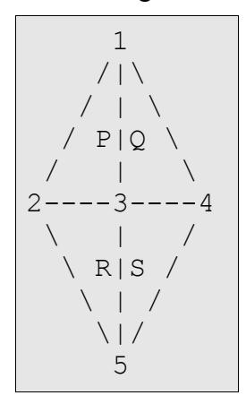

Here are 5 Vertices, numerated from 1 to 5:

(I used 2 Coordinates per vertex, since this document is 2D and not 3D)

| Vert | X  | Y  |
|------|----|----|
| 1    | 1  | 0  |
| 2    | 0  | -1 |
| 3    | 0  | 0  |
| 4    | 0  | 1  |
| 5    | -1 | 0  |

...and we've got 4 Polygons from P to S:

| Poly | Vertex1 | Vertex2 | Vertex3 |
|------|---------|---------|---------|
| P    | 1       | 2       | 3       |
| Q    | 2       | 3       | 4       |
| R    | 3       | 2       | 5       |
| S    | 3       | 5       | 4       |

I think this is easy to understand.

#### STEP 2:

Now we've got to add something that isn't sooo important, but I will need this in STEP 4. We'll get some names for those Polygon lines (Edges).

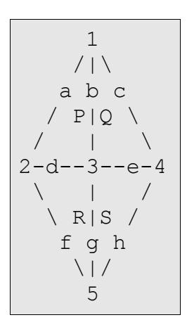

You see, we'ge got 8 Lines.

| Line | V1 | V2 |
|------|----|----|
| a    | 1  | 2  |
| b    | 1  | 3  |
| c    | 1  | 5  |
| d    | 2  | 3  |
| e    | 3  | 4  |
| f    | 2  | 5  |
| g    | 3  | 5  |
| h    | 4  | 5  |

#### STEP 3:

Now let's divide the model into 2 Groups:

 1 /|\ a.b~c /.P|Q~\ /...|~~~\ 2-d--3--e-4 \...|~~~/ \.R|S~/ f.g~h \|/ 5

The Vertex Coords and Polygon Indices are the same as in STEP 1. But we've got 2 Groups now:

DOT-Group:

Vertices: 1, 2, 3, 5 Polygons: P, R Lines: a, b, d, f, g

TILDE-Group:

Vertices: 1, 3, 4, 5 Polygons: Q, S Lines: b, c, e, g, h

That's the way a "normal" Model Format would group the Model. The Group tells you that it uses these Vertices, Polygons and Lines.

## STEP 4:

But now the p Format isn't a "normal" Format :-| I think Square wanted to create a riddle for us hackers... ;)

The FF7 engine will "violently" rip this model into 2 DIFFERENT groups...

Every Vertex and Edge, that is used by both Groups, will be "cloned", so every Group is independent from each other. Now the Indices of the Polygons and Lines will have to be corrected...

#### 4.1 DOT-Group:

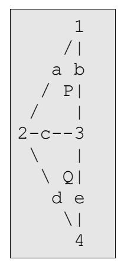

#### 4.2 TILDE-Group:

1 |\ a-b |P \ | \ 2--c-3 | / |Q / d-e |/ 4

As you can see, every Group now has its own Indices for Vertices, Polygons and Lines. But there is only 1 Vertex Chunk, 1 Polygon Chunk and 1 Edge Chunk in the p Model...

So let's now draw both Groups at once:

(I've had to let space between the two groups, in fact the Vertices 1 and 5 are on excatly the same coords...)

#### 4.3 ABSOLUTE INDICES:

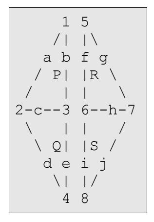

So every Vertex, Polygon and Edge can be "called" in 2 ways; By its absolute Index and its Index within the Group. Here's a listing:

| Absolute | DOT | TILDE |
|----------|-----|-------|
| 1        | 1   | -     |
| 2        | 2   | -     |
| 3        | 3   | -     |
| 4        | 4   | -     |
| 5        | -   | 1     |
| 6        | -   | 2     |
| 7        | -   | 3     |
| 8        | -   | 4     |
| a        | a   | -     |
| b        | b   | -     |
| c        | c   | -     |
| d        | d   | -     |
| e        | e   | -     |
| f        | -   | a     |
| g        | -   | b     |
| h        | -   | c     |

| Absolute | DOT | TILDE |
|----------|-----|-------|
| i        | -   | d     |
| j        | -   | e     |
| P        | P   | -     |
| Q        | Q   | -     |
| R        | -   | P     |
| S        | -   | Q     |

In other Words: Vertex 1 of the DOT-Group is Vertex 1 in the (absolute) Vertex Chunk, and Vertex 1 of the TILDE-Group is Vertex 5 in the (abs.) Vertex Chunk. The Same Thing it with the Polygons and Edges.

#### STEP 5:

Now, in the FF7 p Format, there is another "problem".

Take a look at the TILDE-Group in Image 4.2 and 4.3 Do you see it?

Let's take Polygon P from 4.2. It is Polygon R in 4.3.

But that's not the problem. The Problem is that in 4.2 the Polygon uses Vertices 1, 2 and 3 (from this Group) and in 4.3, the Polygon uses Vertices 5, 6 and 7. In 4.2 the Polygon consists of the Lines a, b and c, in 4.3 it consists of f, g and h.

This is the way the Indices are handled in the FF7 p format. So in the Vertex Chunk there are all vertices of Group 1 first, then all of Group 2 and so on. So, if you want to add a Vertex to Group 1, you will have to correct the Vertex Offset of Group 2, 3, ...

#### NOTE:

You can now take a look at those Ultima Info Files to see what I mean. Scroll throught the file until you reach the end of the Polygon Chunk. The Indices of the Vertices and Edges rise and rise, but then, suddenly, they start from 0 again. This is where a new group begins.

There is another problem, which is, at least in my opinion, totally unlogical. In the same file, scroll down (or up) to the end of the Edges Chunk. And? Hm ... you won't see any groups there.

#### IMPORTANT:

This is because the Edges Chunk hold the ABSOLUTE Vertex Indices, not the Group-Ones !!!

So if you want to add a Vertex to Group 1, you will not only have to correct the Edges offset, but also the Vertex Indices in the Edges of Group 2.

# **The Menu Module**

## *I. Menu Overview*

Important files:

| PSX Version      | PC Version              |
|------------------|-------------------------|
| /MENU/*.MNU      | /DATA/MENU/MENU_US.LGP  |
| /INIT/WINDOW.BIN | /DATA/KERNEL/WINDOW.BIN |
|                  | /DATA/MENU/MENU_US.LGP  |

The menu module is probably the second most powerful module in the game. From here you can set a multitude of environment variables and view character records directly. It's really more of a master variable controller than the "select-o-thing" it appears to be.

Because the menu can have some rather fancy and complicated management features, it also can be placed in "Tutorial mode". This mode, when called from the field module will "play" prerecorded menu selections for the player.

Another major function of the menu system is the ability to save your game. This is probably the most powerful and vital part as the Menu has access to every single variable in the system, excluding the script temporary variables.

The Menu module is actually a collection of 13 modules, to which 4 can be called from the field scripting language. The 13 are called Begin, Party, Item, Magic, Eqip, Stat, Change, Limit, Config, Form, Save, Name, and Shop.

## *II. Menu Initialization*

Menu has the incredible honor of being initialized right after the kernel. It is also the only module that keeps permanent data in VRAM for other modules to access. In the case of the PSX version, the graphics are loaded out of /INIT/WINDOW.BIN. This is a BIN-GZIP archive described in the Kernel section of this document. WINDOW.BIN has the following format.

| Offset | Length     | Description           |  |
|--------|------------|-----------------------|--|
| 0x0000 | 6 bytes    | Header [0x4827208200] |  |
| 0x0006 | 1062 bytes | Static Menu textures  |  |
| 0x2754 | 3034 bytes | Font texture          |  |
| 0x332e | 163 bytes  | Unknown               |  |

After initialization, the first Menu module ran is "Begin" The following is a picture of "Begin" in VRAM. Things to note is the font and static menu textures from /INIT/WINNDOW.BIN are highlighted in the lower right hand corner.


The following is an expanded picture of the textures from the PC version. The PSX version only differs in texture size and the way the buttons are displayed.


To better see what each section is, here is an annotated version with the more obvious textures labeled

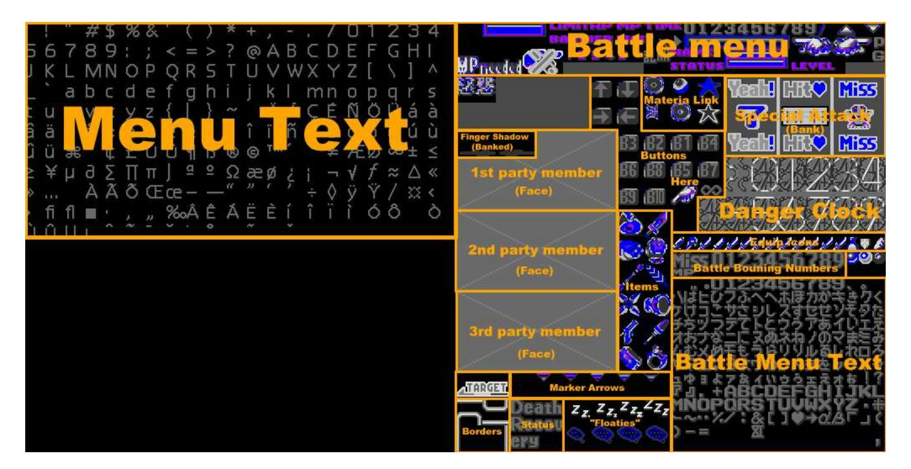

This is never banked out, however small parts are overwritten and cashed for a while when Battle is loaded, but are overwritten again when menu is loaded. The large blank spot under the menu text is for the Japanese characters that were removed in the non-Japanese version of the game. This spot is unused in these versions.

## *III. Menu Modules*

The 13 Modules are displayed like the following.

### 1 Begin

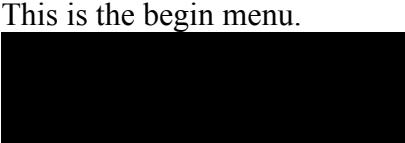

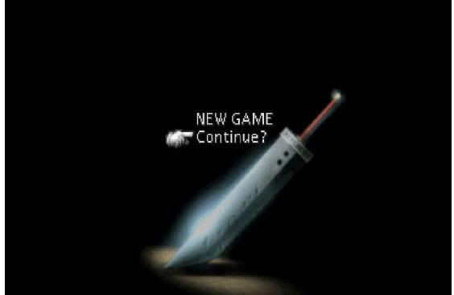

This is a screen form the "save" module. Begin initializes the menu system and calls save to load a game or to start the game.

#### 2 Party

Here is the party menu.


This is the menu you see when you manually enter the menu system. Things to note is the empty box in the lower screen shows what location you are in. Debug rooms have no name most of the time.

#### 3 Item

Item is the following.

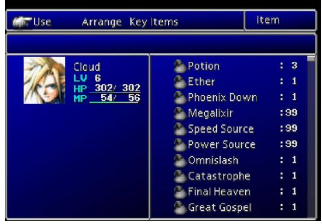

#### 4 Magic

This is the magic menu module

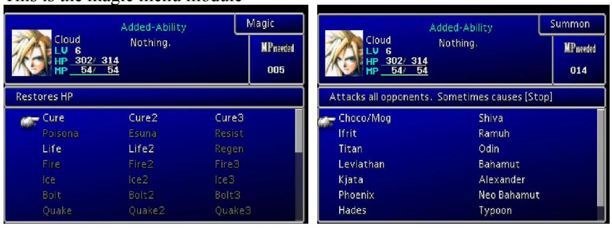

Both magic and summon are accessed in the same module.

#### 5 Eqip

The Eqip module is a little strange.

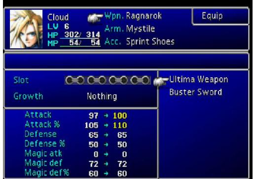

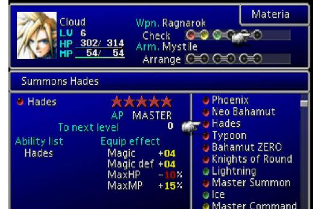

Equip and Materia are in the same module.

#### 6 Stat

This is the status menu


#### 7 Change

This is the change module.


Also known as "Order", this is the simplest and smallest of all the menu modules, it just changes the order of the party, it uses the party screen as a background.

#### 8 Limit

The Limit menu

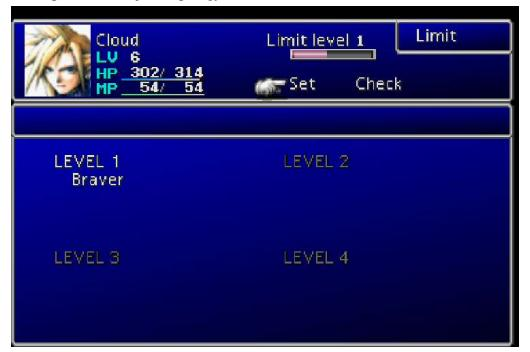

Limits are set here.

#### 9 Config

The config menu


This is where a good deal of environment variables can be changed.

#### 10 Form

This is also known as the PHS screen.


Form can also be called when you need to make a two or three teams of people.

#### 11 Save

The all important save screen.


To save time, this will only load the first 80 bytes of each save as a preview. It allows a quick look without having to load the whole memory card, which can take upward of a minute. This is also responsible for loading games too, when called from "begin"

#### 12 Name

This is the naming screen


If you try and use the same name screen twice in a game, you will loose your old name and will be overwritten with the default one.

#### 13 Shop

This is your typical shop.

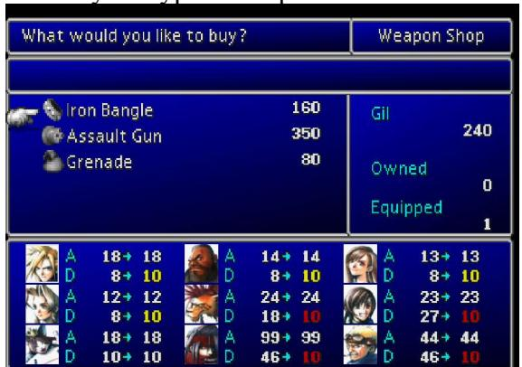

You can, of course, sell items from this module as well.

## *VII. Calling the various menus*

The PSX version keeps the menu modules contained in a .MNU file. The PC version has the menu code internal to the executable. The highlighted modules can be called with the MENU script command. The MENU command always takes a first argument of 00. The second argument is the Menu ID number, and the third is the argument.

| Module<br>Name | PSX Filename       | Menu ID<br>Number | Argument                   |  |
|----------------|--------------------|-------------------|----------------------------|--|
| Begin          | /MENU/BGINMENU.MNU | N/A               | N/A                        |  |
| Party          | /MENU/PATYMENU.MNU | 0x09              | 0x00                       |  |
| Item           | /MENU/ITEMMENU.MNU | N/A               | N/A                        |  |
| Magic          | /MENU/MGICMENU.MNU | N/A               | N/A                        |  |
| Eqip           | /MENU/EQIPMENU.MNU | N/A               | N/A                        |  |
| Stat           | /MENU/STATMENU.MNU | N/A               | N/A                        |  |
| Change         | /MENU/CHNGMENU.MNU | N/A               | N/A                        |  |
| Limit          | /MENU/LIMTMENU.MNU | N/A               | N/A                        |  |
| Config         | /MENU/CNFGMENU.MNU | N/A               | N/A                        |  |
| Form           | /MENU/FORMMENU.MNU | 0x07              | 0x00 - Make a party of 3   |  |
|                |                    |                   | 0x01 - Spit into 3 groups  |  |
|                |                    |                   | 0x02 - Split into 2 groups |  |
| Save           | /MENU/SAVEMENU.MNU | 0x0E              | 0x00                       |  |
| Name           | /MENU/NAMEMENU.MNU | 0x06              | 0x00 - Cloud               |  |
|                |                    |                   | 0x01-<br>Barret            |  |
|                |                    |                   | 0x02 - Tifa                |  |
|                |                    |                   | 0x03 - Aerith              |  |
|                |                    |                   | 0x04 - Red XII             |  |
|                |                    |                   | 0x05 - Yuffie              |  |
|                |                    |                   | 0x06 - Cait Sith           |  |
|                |                    |                   | 0x07 - Vincent             |  |
|                |                    |                   | 0x08 - Cid                 |  |
|                |                    |                   | 0x09 - Chocobo             |  |
| Shop           | /MENU/SHOPMENU.MNU | 0x08              | (0x00-0xFF) Shop Number    |  |

## *V. Menu dependencies*

On the PSX, Menu dependencies are kept in two different directories. The window dressing textures that stay in memory are found in /INIT/WINDOW.BIN and stored as a BIN-GZIP archive. In the MENU directory, some MNU files contain TIM files appended at the end that are displayed when they are loaded. Two of them, PARTYMENU.MNU and FORMMENU.MNU, externally reference TIM files on the disk as they share these resources. SAVEMENU.MNU also externally references the memory card

#### ports.

The PC version has the MNU files internal to the executable and only have external resources. These are kept within the MENU\_US.LGP file. The PC version has textures in two different sizes to support the two resolutions the game runs in. The following is a table of the menu resources and where they are located in both the PC and PSX version.

| Picture | Description              | Low Resolution PC<br>Filename | High Resolution PC<br>Filename | PSX Location(in /<br>MENU unless<br>noted) | TIM<br>Offset |
|---------|--------------------------|-------------------------------|--------------------------------|--------------------------------------------|---------------|
|         | Cloud<br>Avatar          | CLOUD_L.TEX                   | CLOUD.TEX                      | CLOUD.TIM                                  | N/A           |
|         | Barret<br>Avatar         | BARRE_L.TEX                   | BARRE.TEX                      | BARRE.TIM                                  | N/A           |
|         | Tifa Avatar              | TIFA_L.TEX                    | TIFA.TEX                       | TIFA.TIM                                   | N/A           |
|         | Aerith<br>Avatar         | EARITH_L.TEX                  | EARITH.TEX                     | EARITH.TIM                                 | N/A           |
|         | Red XII<br>Avatar        | RED_L.TEX                     | RED.TEX                        | RED.TIM                                    | N/A           |
|         | Yuffie<br>Avatar         | YUFI_L.TEX                    | YUFI.TEX                       | YUFI.TIM                                   | N/A           |
|         | Cait Sith<br>Avatar      | KETC_L.TEX                    | KETC.TEX                       | KETC.TIM                                   | N/A           |
|         | Vincent<br>Avatar        | BINS_L.TEX                    | BINS.TEX                       | BINS.TIM                                   | N/A           |
|         | Cid Avatar               | CIDO_L.TEX                    | CIDO.TEX                       | CIDO.TIM                                   | N/A           |
|         | Young<br>Cloud<br>Avatar | PCLOUD_L.TEX                  | PCLOUD.TEX                     | PCLOUD.TIM                                 | N/A           |
|         | Sephiroth<br>Avatar      | PCEFI_L.TEX                   | PCEFI.TEX                      | PCEFI.TIM                                  | N/A           |
|         | Chocobo<br>Avatar        | CHOCO_L.TEX                   | CHOCO.TEX                      | CHOCO.TIM                                  | N/A           |
|         | Placeholder<br>Avatar    | N/A                           | N/A                            | KALI.TIM                                   | N/A           |
|         | Cloud<br>Avatar          | CLOUD_L.TEX                   | CLOUD.TEX                      | NAMEMENU.MNU                               | 0x1E7C        |

| Picture | Description               | Low Resolution PC<br>Filename | High Resolution PC<br>Filename | PSX Location(in /<br>MENU unless<br>noted) | TIM<br>Offset |
|---------|---------------------------|-------------------------------|--------------------------------|--------------------------------------------|---------------|
|         | Barret<br>Avatar          | BARRE_L.TEX                   | BARRE.TEX                      | NAMEMENU.MNU                               | 0x29A0        |
|         | Tifa Avatar               | TIFA_L.TEX                    | TIFA.TEX                       | NAMEMENU.MNU                               | 0x34C4        |
|         | Aerith<br>Avatar          | EARITH_L.TEX                  | EARITH.TEX                     | NAMEMENU.MNU                               | 0x3FE8        |
|         | Red XII<br>Avatar         | RED_L.TEX                     | RED.TEX                        | NAMEMENU.MNU                               | 0x4B0C        |
|         | Yuffie<br>Avatar          | YUFI_L.TEX                    | YUFI.TEX                       | NAMEMENU.MNU                               | 0x5630        |
|         | Cait Sith<br>Avatar       | KETC_L.TEX                    | KETC.TEX                       | NAMEMENU.MNU                               | 0x6154        |
|         | Vincent<br>Avatar         | BINS_L.TEX                    | BINS.TEX                       | NAMEMENU.MNU                               | 0x6C78        |
|         | Cid Avatar                | CIDO_L.TEX                    | CIDO.TEX                       | NAMEMENU.MNU                               | 0x779C        |
|         | Chocobo<br>Avatar         | CHOCO_L.TEX                   | CHOCO.TEX                      | NAMEMENU.MNU                               | 0x82C0        |
|         | Load screen<br>background | BUSTER.TEX                    | N/A                            | SAVEMENU.MNU                               | 0x4EDC        |
|         | Save Icon 1               | N/A                           | N/A                            | SAVEMENU.MNU                               | 0xF4F4        |
|         | Save Icon 2               | N/A                           | N/A                            | SAVEMENU.MNU                               | 0xF502        |
|         | Save Icon 3               | N/A                           | N/A                            | SAVEMENU.MNU                               | 0xF8F8        |
|         | Save Icon 4               | N/A                           | N/A                            | SAVEMENU.MNU                               | 0xFCEE        |
|         | Save Icon 5               | N/A                           | N/A                            | SAVEMENU.MNU                               | 0x100E4       |
|         | Save Icon 6               | N/A                           | N/A                            | SAVEMENU.MNU                               | 0x104DA       |
|         | Save Icon 7               | N/A                           | N/A                            | SAVEMENU.MNU                               | 0x108D0       |
|         | Save Icon 8               | N/A                           | N/A                            | SAVEMENU.MNU                               | 0x10CC6       |
|         | Save Icon 9               | N/A                           | N/A                            | SAVEMENU.MNU                               | 0x110BC       |
|         | Save Icon 10              | N/A                           | N/A                            | SAVEMENU.MNU                               | 0x114B2       |
|         | Save Icon 11              | N/A                           | N/A                            | SAVEMENU.MNU                               | 0x118A8       |
|         | Save Icon 12              | N/A                           | N/A                            | SAVEMENU.MNU                               | 0x11C9E       |
|         | Save Icon 13              | N/A                           | N/A                            | SAVEMENU.MNU                               | 0x12094       |

| Picture | Description     | Low Resolution PC<br>Filename | High Resolution PC<br>Filename | PSX Location(in /<br>MENU unless<br>noted) | TIM<br>Offset |
|---------|-----------------|-------------------------------|--------------------------------|--------------------------------------------|---------------|
|         | Save Icon 14    | N/A                           | N/A                            | SAVEMENU.MNU                               | 0x1248A       |
|         | Save Icon 15    | N/A                           | N/A                            | SAVEMENU.MNU                               | 0x12880       |
|         | Coin<br>command | ZENI.TEX                      | ZENI_H.TEX                     | ITEMMENU.MNU                               | 0x3890        |
|         | Window          | BTL_WIN_H.TEX                 | BTL_WIN_A_H.TEX                | /INIT/WINDOW.<br>BIN                       | 0x0006        |
|         | Dressings       |                               | BTL_WIN_B_H.TEX                |                                            |               |
|         |                 |                               | BTL_WIN_C_H.TEX                |                                            |               |
|         |                 |                               | BTL_WIN_D_H.TEX                |                                            |               |
|         |                 | BTL_WIN_L.TEX                 | BTL_WIN_A_L.TEX                |                                            |               |
|         |                 |                               | BTL_WIN_B_L.TEX                |                                            |               |
|         |                 |                               | BTL_WIN_C_L.TEX                |                                            |               |
|         |                 |                               | BTL_WIN_D_L.TEX                |                                            |               |
|         | Menu Font       | USFONT_L.TEX                  | USFONT_A_L.TEX                 | /INIT/WINDOW.<br>BIN                       | 0x2754        |
|         |                 |                               | USFONT_B_L.TEX                 |                                            |               |
|         |                 | USFONT_H.TEX                  | USFONT_A_H.TEX                 |                                            |               |
|         |                 |                               | USFONT_B_H.TEX                 |                                            |               |

## *VI. The Save game format.*

The following is the general save format for the game. This data excludes the header data that differs between the PSX and PC version.

**Table 1: The Final Fantasy Save Slot**

| Offset | Length    | Description                                                                                                                                                                                                         |  |
|--------|-----------|---------------------------------------------------------------------------------------------------------------------------------------------------------------------------------------------------------------------|--|
| 0x0000 | 2 bytes   | Checksum                                                                                                                                                                                                            |  |
| 0x0004 | 1 byte    | Preview: Lead character's level.<br>[Note: Changing any preview descriptions are only cosmetic. They do not<br>change any in-game values. It is only used so a player can preview the data<br>within the save file] |  |
| 0x0005 | 1 byte    | Preview: Lead character's portrait.                                                                                                                                                                                 |  |
|        |           | 0x00: Cloud<br>0x07: Vincent<br>0x01: Barret<br>0x08: Cid<br>0x02: Tifa<br>0x09: Young Cloud<br>0x03: Aerith<br>0x0A: Sephiroth<br>0x04: Red XII<br>0x0B: Chocobo<br>0x05: Yuffie<br>0xFF: None<br>0x06: Cait Sith  |  |
| 0c0006 | 1 byte    | Preview: 2nd character's portrait                                                                                                                                                                                   |  |
| 0x0007 | 1 byte    | Preview: 3nd character's portrait                                                                                                                                                                                   |  |
| 0x0008 | 16 bytes  | Preview:<br>Lead character's name, terminated with 0xFF                                                                                                                                                             |  |
| 0x0018 | 2 bytes   | Preview: Lead character's Current HP                                                                                                                                                                                |  |
| 0x001A | 2 bytes   | Preview: Lead character's Max HP                                                                                                                                                                                    |  |
| 0x001C | 2 bytes   | Preview: Lead character's Current MP                                                                                                                                                                                |  |
| 0x001E | 2 bytes   | Preview: Lead character's Max HP                                                                                                                                                                                    |  |
| 0x0020 | 4 bytes   | Preview:<br>Amount of Gil                                                                                                                                                                                           |  |
| 0x0024 | 4 bytes   | Preview: Total number of seconds played                                                                                                                                                                             |  |
| 0x0028 | 32 bytes  | Preview:<br>Save location, FF Text format, terminated with 0xFF                                                                                                                                                     |  |
| 0x0048 | 3 bytes   | RGB value for for upper left corner of window                                                                                                                                                                       |  |
| 0x004B | 3 bytes   | RGB value for for upper right corner of window                                                                                                                                                                      |  |
| 0x004E | 3 bytes   | RGB value for for lower left corner of window                                                                                                                                                                       |  |
| 0x0051 | 3 bytes   | RGB value for for lower right corner of window                                                                                                                                                                      |  |
| 0x0054 | 132 bytes | Character record: Cloud [Note: See table 2 for Character record format]                                                                                                                                             |  |
| 0x00D8 | 132 bytes | Character record: Barret                                                                                                                                                                                            |  |
| 0x015C | 132 bytes | Character record: Tifa                                                                                                                                                                                              |  |
| 0x01E0 | 132 bytes | Character record: Aerith                                                                                                                                                                                            |  |
| 0x0264 | 132 bytes | Character record: Red XIII                                                                                                                                                                                          |  |
| 0x02E8 | 132 bytes | Character record: Yuffie                                                                                                                                                                                            |  |

| Offset | Length    | Description                                                                          |
|--------|-----------|--------------------------------------------------------------------------------------|
| 0x036C | 132 bytes | Character record: Cait Sith                                                          |
| 0x03F0 | 132 bytes | Character record: Vincent                                                            |
| 0x0474 | 132 bytes | Character record: Cid                                                                |
| 0x04F8 | 1 byte    | Party member in slot 1, uses same data format as character<br>portrait above         |
| 0x04F9 | 1 byte    | Party member in slot 2                                                               |
| 0x04FA | 1 byte    | Party member in slot 3                                                               |
| 0x04FB | 1 byte    | 0xFF                                                                                 |
| 0x04FC | 640 bytes | Party Item stock, 2 bytes per item, 320 item slots max<br>[See save item list below] |
| 0x077C | 800 bytes | Party Materia stock, 4 bytes per materia, 200 materia max<br>[See materia list]      |
| 0x0A9C | 224 bytes | Unknown                                                                              |
| 0x0B7C | 4 bytes   | Party's Gil amount                                                                   |
| 0x0B80 | 4 bytes   | Total number of seconds played                                                       |
| 0x0B84 | 16 bytes  | Unknown                                                                              |
| 0x0B94 | 2 bytes   | Current map                                                                          |
| 0x0B96 | 2 bytes   | Current location                                                                     |
| 0x0B98 | 2 bytes   | Unknown                                                                              |
| 0x0B9A | 2 bytes   | X location on world map                                                              |
| 0x0B9C | 2 bytes   | Y location on world map                                                              |
| 0x0B9E | 2 bytes   | Z location on world map                                                              |
| 0x0BA0 | 4 bytes   | Unknown                                                                              |
| 0x0BA4 | 2 bytes   | Plot Progression Variable<br>[BEGINNING OF SCRIPT MEMORY BANK 1/2]                   |
| 0x0BA5 | 3 bytes   | Unknown                                                                              |
| 0x0BA7 | 1 byte    | Aerith's current love points                                                         |
| 0x0BA8 | 1 byte    | Tifa's current love points                                                           |
| 0x0BA9 | 1 byte    | Yuffie's current love points                                                         |
| 0x0BAA | 1 byte    | Barret's current love points                                                         |
| 0x0BAB | 5 bytes   | Unknown                                                                              |
| 0x0BB0 | 2 bytes   | Number of battles fought                                                             |
| 0x0BB2 | 2 bytes   | Number of escapes                                                                    |
| 0x0BB4 | 1 byte    | Game timer (Hours)                                                                   |
| 0x0BB5 | 1 byte    | Game timer (Minutes)                                                                 |
| 0x0BB6 | 1 byte    | Game timer (Seconds)                                                                 |
| 0x0BB7 | 1 byte    | Game timer (Tenths)                                                                  |
| 0x0BB8 | 0x0BBD    | Unknown (curse ring usage?)                                                          |

| Offset | Length   | Description                                                                                  |  |  |
|--------|----------|----------------------------------------------------------------------------------------------|--|--|
| 0x0BBC | 2 bytes  | Number of battles fought                                                                     |  |  |
| 0x0BBE | 2 bytes  | Number of escapes                                                                            |  |  |
| 0x0BBF | 0x0BE3   | Unknown                                                                                      |  |  |
| 0x0BE4 | 8 bytes  | Key items<br>[see Key Item List]                                                             |  |  |
| 0x0BEC | 0x0BC9   | Unknown                                                                                      |  |  |
| 0x0BF9 | 1 byte   | Field Chocobo rating                                                                         |  |  |
| 0x0BFA | 1 byte   | Field Chocobo rating                                                                         |  |  |
| 0x0BFB | 1 byte   | Field Chocobo rating                                                                         |  |  |
| 0x0BFC | 1 byte   | Field Chocobo rating                                                                         |  |  |
| 0x0BFD | 0x0BC8   | Unknown                                                                                      |  |  |
| 0x0BC9 | 2 bytes  | Menu Visibility Mask, Quit on PC is not affected                                             |  |  |
|        |          | LSB<br>item<br>magic<br>mtra<br>eqip<br>status<br>ordr<br>limit<br>cfg<br>PHS<br>save<br>MSB |  |  |
| 0x0BCB | 2 bytes  | Menu locking Mask, 1 = locked. Quit on PC can't be locked                                    |  |  |
|        |          | LSB<br>item<br>magic<br>mtra<br>eqip<br>status<br>ordr<br>limit<br>cfg<br>PHS<br>save<br>MSB |  |  |
|        |          |                                                                                              |  |  |
| 0x0C02 | 1 byte   | Rating for Penned Chocobo Number 1 - (01 = Wonderful <-> 08 = the worst)                     |  |  |
| 0x0C03 | 1 byte   | Rating for Penned Chocobo Number 2                                                           |  |  |
| 0x0C04 | 1 byte   | Rating for Penned Chocobo Number 3                                                           |  |  |
| 0x0C05 | 1 byte   | Rating for Penned Chocobo Number 4                                                           |  |  |
| 0x0C06 | 0x0CA3   | Unknown                                                                                      |  |  |
| 0x0CA4 |          | [BEGINNING OF FIELD BANK 3/4]                                                                |  |  |
| 0x0CA5 | 0x0CED   | Unknown                                                                                      |  |  |
| 0x0CEE | 2 bytes  | Party GP (0-10000)                                                                           |  |  |
| 0x0CF0 | 12 bytes | Unknown                                                                                      |  |  |
| 0x0CFC | 1 byte   | Number of chocobo stables owned                                                              |  |  |
| 0x0CFD | 1 byte   | Unknown                                                                                      |  |  |
| 0x0CFE | 1 byte   | Number of occupied stables                                                                   |  |  |
| 0x0CFF | 1 byte   | Mask of occupied stables                                                                     |  |  |
| 0x0D00 | 0x0DA3   | Unknown                                                                                      |  |  |
| 0x0DA4 |          | [BEGINNING OF FIELD BANK B/C]                                                                |  |  |
| 0x0DA5 | 0x0DC3   |                                                                                              |  |  |
| 0x0DC4 | 16 bytes | Chocobo slot 1 [Note: See table 3 For Chocobo slot format]                                   |  |  |
| 0x0DD4 | 16 bytes | Chocobo slot 2                                                                               |  |  |
| 0x0DE4 | 16 bytes | Chocobo slot 3                                                                               |  |  |

| Offset | Length   | Description                                                               |
|--------|----------|---------------------------------------------------------------------------|
| 0x0DF4 | 16 bytes | Chocobo slot 4 [Note: Chocobo slots 5 and 6 are located at 0x1084-0x10A3] |
| 0x0D04 | 0x0EA3   | Unknown                                                                   |
| 0x0EA4 | 1 byte   | Current CD<br>[BEGINNING OF FIELD BANK D/E]                               |
| 0x0EA5 | 31 bytes | Unknown                                                                   |
| 0x0EC4 | 6 bytes  | 1st Chocobo's name, FF Text format                                        |
| 0x0ECA | 6 bytes  | 2nd Chocobo's name, FF Text format                                        |
| 0x0ED0 | 6 bytes  | 3rd Chocobo's name, FF Text format                                        |
| 0x0ED6 | 6 bytes  | 4th Chocobo's name, FF Text format                                        |
| 0x0EDC | 6 bytes  | 5th Chocobo's name, FF Text format                                        |
| 0x0EE2 | 6 bytes  | 6th Chocobo's name, FF Text format                                        |
| 0x0EE8 | 2 bytes  | 1st Chocobo's stamina                                                     |
| 0x0EEA | 2 bytes  | 2nd Chocobo's stamina                                                     |
| 0x0EEC | 2 bytes  | 3rd Chocobo's stamina                                                     |
| 0x0EEE | 2 bytes  | 4th Chocobo's stamina                                                     |
| 0x0EF0 | 2 bytes  | 5th Chocobo's stamina                                                     |
| 0x0EF2 | 2 bytes  | 6th Chocobo's stamina                                                     |
| 0x0EF4 | 0x0EFD   | Unknown                                                                   |
| 0x0EFD | 1 byte   | turns off(00)/on(FF) the submarine                                        |
| 0x0EFE | 0x0F14   | Unknown                                                                   |
| 0x0F15 | 24 bytes | Name of location, FF Text format                                          |
| 0x0F24 | 0x0F32   | Unknown                                                                   |
| 0x0F32 | 1 byte   | Don't(00)/Do(08) display World Map instructions                           |
| 0x0F33 | 0x0F65   | Unknown                                                                   |
| 0x0F66 | 1 byte   | Party's X location on the world map (Tile)                                |
| 0x0F67 | 1 byte   | Party's Y location on the world map (Tile)                                |
| 0x0F68 | 1 byte   | Party's Heading (some examples: 00 South, 40 East, 80 North, C0 West)     |
| 0x0F69 | 1 byte   | Party's X ?                                                               |
| 0x0F6A | 1 byte   | Party's Y ?                                                               |
| 0x0F6B | 1 byte   | Party's Z ?                                                               |
| 0x0F6C | 0x0F85   | Unknown                                                                   |
| 0x0F86 | 1 byte   | Submarine's X location on the world map (Tile)                            |
| 0x0F87 | 1 byte   | Submarine's Y location on the world map (Tile)                            |
| 0x0F88 | 1 byte   | Submarine's Heading (some examples: 00 South, 40 East, 80 North, C0 West) |
| 0x0F89 | 1 byte   | Submarine X ?                                                             |

| Offset | Length   | Description                                                                                                  |  |  |
|--------|----------|--------------------------------------------------------------------------------------------------------------|--|--|
| 0x0F8A | 1 byte   | Submarine Y ?                                                                                                |  |  |
| 0x0F8B | 1 byte   | Submarine Z ?                                                                                                |  |  |
| 0x0F8C | 0x0FA5   | Unknown                                                                                                      |  |  |
| 0x0FA4 |          | [BEGINNING OF FIELD BANK 7/F]                                                                                |  |  |
| 0x0FA5 | 1 byte   | Unknown                                                                                                      |  |  |
| 0x0FA6 | 1 byte   | World map camera & map display. Add two values together (one from camera,<br>one from map) and set the byte. |  |  |
|        |          | Camera - Aerial(00), Closeup (20)                                                                            |  |  |
|        |          | Map - Off (80), Small (00), Large (40).                                                                      |  |  |
| 0x0FA7 | 0x0FAA   | Unknown                                                                                                      |  |  |
| 0x0FAB | 1 byte   | Must be 0x00 or game crashes                                                                                 |  |  |
| 0x0FAC | 0x102F   | Unknown                                                                                                      |  |  |
| 0x1030 | 1 byte   | Field screen rain switch. Non-zero turns on the rain effect                                                  |  |  |
| 0x1031 | 0x1083   | Unknown                                                                                                      |  |  |
| 0x1084 | 16 bytes | Chocobo slot 5                                                                                               |  |  |
| 0x1094 | 16 bytes | Chocobo slot 6                                                                                               |  |  |
| 0x10A3 |          | [END OF FIELD SCRIPT MEMORY BANKS]                                                                           |  |  |
| 0x10A3 | 0x10AE   | Unknown                                                                                                      |  |  |
| 0x10AD | 2 bytes  | PHS Locking Mask                                                                                             |  |  |
|        |          | LSB<br>Cloud<br>Barret<br>Tifa<br>Aerith<br>Red<br>Yuffie<br>Vince<br>Cait<br>Cid<br>MSB                     |  |  |
| 0x10AF | 2 bytes  | PHS Visibility Mask, does not turn off characters in your party                                              |  |  |
|        |          | LSB<br>Cloud<br>Barret<br>Tifa<br>Aerith<br>Red<br>Yuffie<br>Vince<br>Cait<br>Cid<br>MSB                     |  |  |
| 0x10B0 | 0x10D7   | Unknown                                                                                                      |  |  |
| 0x10D8 | 1 byte   | Battle speed (0x00 = fastest, 0xFF = Slowest)                                                                |  |  |
| 0x10D9 | 1 byte   | Battle message speed                                                                                         |  |  |
| 0x10DA | 2 bytes  | Flag bits (?)                                                                                                |  |  |
| 0x10DC | 16 bytes | Unknown                                                                                                      |  |  |
| 0x10EC | 1 byte   | Message speed                                                                                                |  |  |
| 0x10ED | 7 bytes  | Unknown                                                                                                      |  |  |

| Table 2: Character record |          |                                                    |  |  |
|---------------------------|----------|----------------------------------------------------|--|--|
| Offset                    | Length   | Description                                        |  |  |
| 0x00                      | 1 byte   | Sephiroth flag for changing Vincent into Sephiroth |  |  |
| 0x01                      | 1 byte   | Level (0-99)                                       |  |  |
| 0x02                      | 1 byte   | Strength (0-255)                                   |  |  |
| 0x03                      | 1 byte   | Vitality (0-255)                                   |  |  |
| 0x04                      | 1 byte   | Magic (0-255)                                      |  |  |
| 0x05                      | 1 byte   | Spirit (0-255)                                     |  |  |
| 0x06                      | 1 byte   | Dexterity (0-255)                                  |  |  |
| 0x07                      | 1 byte   | Luck (0-255)                                       |  |  |
| 0x08                      | 1 byte   | Strength Bonus (Power Sources used)                |  |  |
| 0x09                      | 1 byte   | Vitality Bonus (Guard Sources used)                |  |  |
| 0x0A                      | 1 byte   | Magic Bonus (Magic Sources used)                   |  |  |
| 0x0B                      | 1 byte   | Spirit Bonus (Mind Sources used)                   |  |  |
| 0x0C                      | 1 byte   | Dexterity Bonus (Speed Sources used)               |  |  |
| 0x0D                      | 1 byte   | Luck Bonus (Luck Sources used)                     |  |  |
| 0x0E                      | 1 byte   | Current limit level (1-4)                          |  |  |
| 0x0F                      | 1 byte   | Current limit bar (0xFF = limit break)             |  |  |
| 0x10                      | 12 bytes | Name, FF Text format                               |  |  |
| 0x1C                      | 1 byte   | Equipped weapon                                    |  |  |
| 0x1D                      | 1 byte   | Equipped armor                                     |  |  |
| 0x1E                      | 1 byte   | Equipped accessory                                 |  |  |
| 0x1F                      | 3 bytes  | Character flags                                    |  |  |
| 0x22                      | 2 bytes  | Learned limit skills                               |  |  |
| 0x24                      | 2 bytes  | Number of Kills                                    |  |  |
| 0x26                      | 2 bytes  | Times Limit 1-1 Has been used                      |  |  |
| 0x28                      | 2 byes   | Times Limit 2-1 Has been used                      |  |  |
| 0x2A                      | 2 bytes  | Times Limit 3-1 Has been used                      |  |  |
| 0x2C                      | 2 bytes  | Current HP                                         |  |  |
| 0x2E                      | 2 bytes  | Base HP (before materia alterations)               |  |  |
| 0x30                      | 2 bytes  | Current MP                                         |  |  |
| 0x32                      | 2 bytes  | Base MP (before materia alterations)               |  |  |
| 0x34                      | 4 bytes  | Unknown                                            |  |  |
| 0x38                      | 2 bytes  | Maximum HP (after materia alterations)             |  |  |
| 0x3A                      | 2 bytes  | Maximum MP (after materia alterations)             |  |  |
| 0x3C                      | 4 bytes  | Current EXP                                        |  |  |
|                           |          |                                                    |  |  |

| Offset | Length  | Description                  |
|--------|---------|------------------------------|
| 0x40   | 1 byte  | Weapon materia slot number 1 |
| 0x41   | 1 byte  | Weapon materia slot number 2 |
| 0x42   | 1 byte  | Weapon materia slot number 3 |
| 0x43   | 1 byte  | Weapon materia slot number 4 |
| 0x44   | 1 byte  | Weapon materia slot number 5 |
| 0x45   | 1 byte  | Weapon materia slot number 6 |
| 0x46   | 1 byte  | Weapon materia slot number 7 |
| 0x47   | 1 byte  | Weapon materia slot number 8 |
| 0x48   | 1 byte  | Armor materia slot number 1  |
| 0x49   | 1 byte  | Armor materia slot number 2  |
| 0x4A   | 1 byte  | Armor materia slot number 3  |
| 0x4B   | 1 byte  | Armor materia slot number 4  |
| 0x4C   | 1 byte  | Armor materia slot number 5  |
| 0x4D   | 1 byte  | Armor materia slot number 6  |
| 0x4E   | 1 byte  | Armor materia slot number 7  |
| 0x4F   | 1 byte  | Armor materia slot number 8  |
| 0x80   | 4 bytes | EXP to next level            |

**Table 3: Chocobo Record**

| Offset | Length  | Description                         |
|--------|---------|-------------------------------------|
| 0x0    | 2 bytes | Sprint speed                        |
| 0x2    | 2 bytes | Max Sprint speed                    |
| 0x4    | 2 bytes | Speed                               |
| 0x6    | 2 bytes | Max Speed                           |
| 0x8    | 1 byte  | Acceleration                        |
| 0x9    | 1 byte  | Cooperation                         |
| 0xA    | 1 byte  | Intelligence                        |
| 0xB    | 1 byte  | Personality                         |
| 0xC    | 1 byte  | Pcount(?)                           |
| 0xD    | 1 byte  | Number of races won                 |
| 0xE    | 1 byte  | Sex (0=male,1=female)               |
| 0xF    | 1 byte  | Type (Yellow,Green,Blue,Black,Gold) |

# **The Field Module**

Important files:

| PSX Version  | PC Version             |
|--------------|------------------------|
| /FIELD/*.DAT | /DATA/FIELD/FLEVEL.LGP |
| /FIELD/*.MIM | /DATA/FIELD/CHAR.LGP   |
| /FIELD/*.BSX |                        |

## *I. Field Overview*

The field module is the core of the game to which everything else is spawned. It is tied very closely with the kernel and contains many low-level calls to it. The field system also contains a self-contained bytecode language called commonly called "Field Script". The field module is responsible for the following:

- -The loading and parsing of the field files.
- -The display of the 2D background ands related special effects
- -The display of 3D elements in the field such as the camera, perspective and and entities.
- -The running of the Field Script to display events and to get user input.
- -The on-demand loading of other modules when needed.

The Field module loads modular "Field Files". In the PC version, the Field File is a single file with nine sections. In the PSX version, there are three files with the same name but with different extensions that do the same thing. The three files are MIM, (Mutiple Image Maps, or the backgrounds), DAT, (Field Script Data), and BSX, (3D data).

The following snapshot of the PSX's VRAM demonstrates the background field files in various stages

of assembly.


The backgrounds are actually 16x16 blocks that are loaded into VRAM and then assembled into the video buffer every frame. The system allows for layers to obscure the 3D entities using a simple painter's algorithm.

In this particular field file, there are six cached sections of background data. Also notice the bright green patches that don't show up in in the video buffer. This was to show where a lower layer of 2D data was to be covered by a higher layer. The bright green is for debug purposes. During development, if any bright green showed up, it meant that your upper layer had a "hole" in it that a 3D entity could be seen through.

When the PSX version of FF7 is ran in higher resolutions via emulation with texture filtering on, often the lower layers will "bleed" outside the upper layer and make artifacts. This was also the reason why the field files were not re-rendered for the PC version of the game. It would of required "re-cutting" the layers again in the higher resolution.

Another last thing to note is in the middle of the bottom texture cache there are a sea of eyes. These blink at random times and reflect the random blinking of the characters in the game.

## *II. Field Format (PC)*

## **General PC Field File format**

Field files are always found in FLEVEL.LGP. They are always LZS compressed (see my other documents/tools for details of LZS compression and tools to do it).

The first two bytes of each (decompressed) field file are blank (zero).

The next four bytes is an integer indicating how many sections are present in the file.

Then a number of 4-byte integers follow, giving the starting offset for each section.

All field files should contain 9 sections; it's what FF7 expects.

#### PC Field File Header

| Offset | Size    | Description          | Section Data            |
|--------|---------|----------------------|-------------------------|
| 0x00   | 2 bytes | Blank                | Always 0x00             |
| 0x02   | 4 bytes | Number of Sections   | Always 0x0009           |
| 0x06   | 4 bytes | Pointer to Section 1 | Field Script & Dialog   |
| 0x0A   | 4 bytes | Pointer to Section 2 | Camera Matrix           |
| 0x0E   | 4 bytes | Pointer to Section 3 | Unknown (Model Loader?) |
| 0x12   | 4 bytes | Pointer to Section 4 | Palette                 |
| 0x16   | 4 bytes | Pointer to Section 5 | Walkmesh                |
| 0x1A   | 4 bytes | Pointer to Section 6 | Unknown                 |
| 0x1E   | 4 bytes | Pointer to Section 7 | Encounter               |
| 0x22   | 4 bytes | Pointer to Section 8 | Unknown                 |
| 0x26   | 4 bytes | Pointer to Section 9 | Background              |

| Offset | Size    | Description                                                                               | Section Data        |
|--------|---------|-------------------------------------------------------------------------------------------|---------------------|
| 0x2A   | 4 bytes | Where Pointer to Section 1 points to                                                      | Length of Section 1 |
| 0x2E   | Varies  | Start of Section 1 data. Continues for the<br>number of bytes specified in Section Length | Field Script        |

Each section generally starts with a four byte integer indicating the length of the section. You could just work this out by comparing offsets (how much space until the next section/end of file, etc) but FF7 stores the length at the start of the section anyway. After that the actual data follows. So the first bit of data for a section is actually 4 bytes after the point given in the section header (since the first four bytes are actually the length marker).

#### **Section 1 Dialog and Event (Halkun, Lasyan, and Fice)**

The First section holds the Field Script logic and Dialog data for that particular field file. The first section of the PSX DAT file (excluding the DAT header) and the data in this section are the same. A recap of the PSX DAT file format is later in this document.

The data in this section also has a header with the following format.

#### Section 1 Header

```
struct FF7SCRIPTHEADER {
 u16 unknown1;
 char nEntities; // Number of entities
 u16 unknown2; // Always less than nEntities; possibly visible entities?
 u16 wStringOffset; // Offset to strings
 u16 nExtraOffsets; // An optional number of extra offsets... unknown
 u16 unknown4[4];
 char szCreator[8]; // Field creator (never shown)
 char szName[8]; // Field name (never shown)
 char szEntities[nEntities][8]; // Field entity names
 u32 dwExtraOffsets[nExtraOffsets]; // Said extra offsets... unknown
 u16 vEntityScripts[nEntities][32]; // Entity script entry points, or more
                                     // explicitly, subroutine offsets
};
```

#### Event Script Subsection

Here we have all of the pointers tables, one for each section. Pointers are 2 bytes length. Each table has a length of 64 bytes, which means a section can have 32 scripts max. Each pointer refers to the first command of the current script. The section number N begins at the offset header\_length+N\*64. Note: the only way to retrieve the length of a script is to subtract the position of the next script to the position of the current script.

#### Dialog Subsection

Right after the last script of the last section, we find the pointer's table of the dialogs. The first 2 bytes show the number of dialogs in the file, so you can deduct the length of the table: number\_of\_dialogs\*2. After these 2 bytes we have the pointers for each dialog. Be aware that the pointers are relative to the table, which means you must add the position of the table to each pointer in order to find the right position of the dialog. The dialogs begin right after the table, and the code 255 means the end of the dialog.

Note: some <<hidden>> dialogs are not referenced in the table!

#### **Section 2 Camera Matrix (Kero)**

This is yet to be completely understand, I am pretty sure that this is not exactly trash, since it is based on at least 300 changes of field files. It was pretty nasty, as you can imagine, first divide sections of field file, load section 2 into hexedit, change byte, save section 2, run .bat file that complete new field file with new section 2 and compress it. After that I always had to use ficedula lgp tools, awful, I am definitely going to program command line program for this, in gui i had to alway on original field file, click, replace, click instead of just adding line to .bat file. After that run ff7.exe, go to destinated location and observe what happened.

I am working on program to load walkmesh along with camera matrix. I am pretty sure about vectors, after all, they are all same length and they are orthogonal, but i could misinterpret order of them, position of center is little uncertain and resize factor too. The program should help me to figure out these thing.

#### Description of section 2 (field file) - camera

Goal of this section is to define camera matrix. In fact it seems pretty simple. For camera matrix, you need vector for axis x, vector for axis y, vector for axis z and position of camera in world space. Vectors for axis x,y,z are defined in world space and in camera space are normally united.

Example: You have axis x defined as vector (0.176,-0.512,0.840) but thats in the world space, in camera space it is just (1,0,0)

- \* Every offset is relative here, 00 is at the start of section 2 (after length indicator).
- \* This will will be in the left handed coordinated system= x axis from left to right, y axis from bottom to top, z axis from near to far.
- \* In here, I am changing signs so these vectors should be correct for file loaded right from section 5 walkmesh. While in walkmesh you don't change any signs, here I am changing them, so they will fit and if you use this article with unchanged values for walkmesh, you should get right image , same as in ff7. (FIXME: not yet true)

This is an overview the camera data format.

#### Section 2 Format

| Offset | Size    | Description             |
|--------|---------|-------------------------|
| 0x00   | 6 bytes | Camera Vector X axis    |
| 0x06   | 6 bytes | Camera Vector Y axis    |
| 0x0C   | 6 bytes | Camera Vector Z axis    |
| 0x12   | 2 bytes | Unknown                 |
| 0x14   | 4 byes  | Camera Space X position |
| 0x18   | 4 bytes | Camera Space Y position |
| 0x1C   | 4 bytes | Camera Space Z position |
| 0x20   | 4 byes  | Unknown                 |
| 0x24   | 2 bytes | Zoom                    |

How to get vectors for the axis:

Vectors are stored right at the beginning of section 2.

```
typedef struct {
S16 x; 
S16 y; 
S16 z; 
} vector3s;
```

You will load first vector for axis x (from offset 0 to 5), for axis y(6 to 11) and axis z (12-17). These values are in fixed point with multiply constant 4096. Length of vectors x,y and z is always 4096 (first vecsize is for x, then y and last z), thats make out multiplication constant. These vectors are also always ortognormal, as you can see in ORTO 1-2 (1=x,2-y,3=z) ORTO U-Vis scalar product of U and V. As you can see, very near zero (first value is without division of multi constant). Now you have three vectors, but they are not looking in correct direction, you have to change some signs. For each vector change sign of y and z values. Now these vectors should point in correct direction, same as in ff7.

I am now suppose that you have vectors for axises loaded, each component of each vector was divided by 4096 (don't forget to store it in float) and you changed signs for component y and z. After vectors is one S16 number (from offset 18 to 19), same as z component of vector for z axis.

Now you want to have position of center of the camera matrix. Get three S32 numbers for position of center (x from 20 to 23, y from 24-27 and z from 28-31). These number are not position of center in worlds pace, but they are position of center of camera space, defined in space, where position of center is in 0,0,0 and axis for vectors are the ones you read, but have opposite signs. You get center of camera matrix like this:

```
// vx,vy,vz are axis you read, divided, y,z signs changed 
// (tx,ty,tz) is position of camera matrix in world space 
// ox,oy,oz are S32 numbers you read from offset 20 to 31 
tx = -(ox*vx.x + oy*vy.x + oz*vz.x); 
ty = -(ox*vx.y + oy*vy.y + oz*vz.y); 
tz = -(ox*vx.z + oy*vy.z + oz*vz.z);
```

After this is just blank U32 number, seems always zero and last, but not least the zoom (36-37) (don't know whether Signed or Unsigned). The bigger resize number is, the bigger is the model and walkmesh.

#### **Section 4 Pallette (Terrence)**

The following is an overview of the palette data

#### Section 4 Palette Format

| Offset | Size    | Description                               |
|--------|---------|-------------------------------------------|
| 0x00   | 2 bytes | Length (Repeat of previous length header) |
| 0x02   | 2 bytes | Unknown                                   |
| 0x04   | 1 byte  | Unknown (often blank)                     |
| 0x05   | 4 byes  | Number of colors in palette               |
| 0x09   | 1 byte  | Unknown (often blank)                     |
| 0x0A   | varies  | Palette data                              |

After the first length indicator comes another integer, also indicating length. Useless, but it's there.

Then there's one more integer; unknown purpose.

Then one byte; unknown (blank often).

Then a word; number of colors in the palette plus one. No idea why. You can work numcolors out from the section length, but FF7 stores it anyway; why add one? Dunno.

One more byte; unknown (blank often).

Then the actual palette data.

Each palette entry is a 16-bit color. This is unusual - normally palettes store as high quality data as possible, usually 24/32 bit. However since FF7 only ever runs in 16 bit I guess there isn't much point storing any other kind of data. Actually, the data is 15-bit (5-bit Red, 5-bit Green, 5-bit Blue, and 1 mask bit).

|              | Palette Data |   |   |   |   |   |   |      |      |   |   |   |   |   |   |
|--------------|--------------|---|---|---|---|---|---|------|------|---|---|---|---|---|---|
| Red<br>Green |              |   |   |   |   |   |   | Blue | Mask |   |   |   |   |   |   |
| r            | r            | r | r | r | g | g | g | g    | g    | b | b | b | b | b | m |

That's it for the palette! Only other thing you need to know is, palettes generally contain a number of colors that's a multiple of 256. This is because the palette is split up into 256-color 'pages' internally. So the first color is page 0/color 0. Color 256 is page 1/color 0. Color 628 is page 2/color 116. You'll see why in the background section.

#### **Section 5 Walkmesh (Kero)**

Every every offset is here relative, 00 is at the start of section 5 (after lenght indicator)

Section 5 of field files is stored walkmesh. Walkmesh is mesh of polygons on which is character moving, it is telling engine for example how height it is and thanks to that PC can, for example, cross bridge with real feeling that in the middle he is on higher place than on both sides. It has very simple structure.

#### Header

---------

Startofs 0x00

Lenght 0x04

Walkmesh doesn't have header, it as only one 4 bytes long unsigned int, called NoS (Number of sectors)

## Sector pool

```
--------------
Startofs 0x04
Lenght NoS*24
typedef struct {
short x,z,y,res; // short is 2 bytes long integer
} vertex_3s; // 3 short 
typedef struct {
vertex_3d v[3];
} sect_t;
```

In sector pool are sectors, in fact just triangles and its position. For each sector you have three vertex\_3s. Just store them. It seems that res and z are very often same, but not always, I don't know why. It seems that all polygons are clockwise. I didnt check it, but it is probably in order to know wheather point is in triangle. If you give it in other direction, point will be detected outside if it is inside and vice versa. Nothing difficult

## Access pool ------------

Startofs 0x04 + NoS\*24 Lenght NoS\*6 typedef { short acces1,acces2,acces3;

} In access pool you have id of poly, you should go into if you cross line.

acces1 is for line from vertex 0 to 1

acces2 is for line from vertex 1 to 2

acces3 is for line from vertex 2 to 0

If acces1/2/3 is FFFF then you are not allowed to cross this line. Acces pool and sector pool are same size (NoT), so you will just use same index for both pools.

If access don't translate you, it just says, you should be here, if you are not, then there is a problem. If you design polymesh where you cross line and access tells you that you should be in poly 12, but you are god know where then FF7 stops.

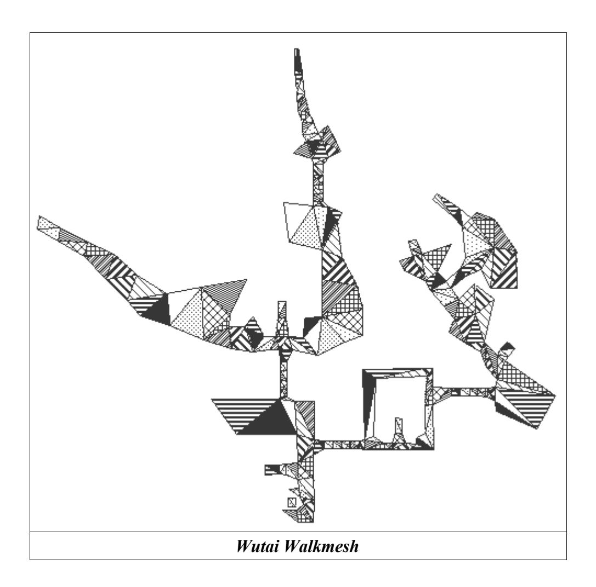

#### **Section 7 (Terrence)**

As stated, Section 7 is the Encounter listing, and is generally 48 bytes long (not including the Length dword). I've not even started to decrpyt what the other bytes mean around there... I suspect encounter rates and other things. Each encounter is stored something like: xxxxxxxx yyyyyyxx, where the 'x's are the standard Battle ID we're familiar with, and the 'y's are something connected to that specific encounter. Encounters where you can get ambushed appear to be held seperately from the others, too, starting at... what... 0x14? Unsure.

Anyhow, feel free to play with it. I remain disappointed that this has yielded no trace of Ho-chu in Ancient Forest... was hoping it would at least be some really rare battle or something....

EDIT: Few more notes on the Encounters section.

First, \*EVERY\* Field file's Encounter section is 48 bytes long (52 if you include the size). It's then split into definite partitions:

0x00: Encounter Data 1, possibly enounter rate in 2nd bytes? (2 bytes) 0x02-0x0D: Encounter+Chance(?) bytes, as stated before. The total of the 'Chance(?)' bytes for this part always adds up to 64 if encounters are possible.

0x0E-0x17: Secondary encounters. Sometimes blank, sometimes gaps. No clue on the chance bytes, or how it relates to previous data.

0x18: Encounter Data 2, same setup as Encounter Data 1. Very often blank, no idea what this data is for.

0x1A-0x25: Encounter+Chance(?) bytes for Encounter Data 2. Again, adds up to 64.

0x26-0x2F: Secondary encounters for Encounter Data 2. Again, no idea what it's used for.

To get more information, I'm going to have to go and start changing things, but thought you'd like an update on what I had for now.

Funnily enough, it seems that Tonberry got as far as making it \*into\* some random encounter data... unfortunately, it's in a scene-only room - trnad\_51 : The room where Sephiroth is encased in the center of the Whirlwind Maze - and never gets a chance to be called. What a pity....

#### **Section 9 Background (Terrence)**

Firstly, a number of variables.

At offset \$28, a Word = background width (BGWidth)

At offset \$2A, a Word = background height (BGHeight)

At offset \$2C, a Word = number of background sprites (NumBGSprites)

At offset \$32, the background sprite data. See below for format (each sprite is 52 bytes long)

After the background sprite data, another \$7 bytes, unknown purpose.

Then (ie. at offset \$32 + NumBGSprites\*52 + \$7) a Word = number of 2nd layer background sprites (NumBG2Sprites)

Then another \$12 bytes, unknown purpose.

Then (ie. at offset \$32 + NumBGSprites\*52 + \$1B) the background layer 2 sprite data. See below for format.

Then another \$3D bytes, unknown purpose.

Then (ie. at offset \$32 + NumBGSprites\*52 + NumBG2Sprites\*52 + \$58) the raw image data.

#### Background paradigm

-------------------

(It isn't \*really\* a paradigm, but it sounds impressive if you say it is.)

FF7 stores its backgrounds in a rather complex format. Basically, you have the data split up into various sections:

- 1) Palette. List of colours.
- 2) Background sprites, layers 1 and 2. Just references to other bits of data.
- 3) Raw image data. Palettized data (ie. "grayscale" if viewed directly).

Each background sprite represents a 16x16 pixel block on the finished background. The sprite essentially contains the following information:

- -"Target" block, ie. where on the background to draw this 16x16 square
- -"Source" block, ie. where on the raw image data to take the pixels from
- -Palette "page", ie. which 256-colour palette block to apply to the raw image data

This is a very efficient way to store the image; on the one hand, it's in 16-bit colour, far better than just palettizing the whole image (ie. 256 colours over the \*whole\* background). On the other hand, each 16x16 pixel block takes much less space than if you'd stored it directly in 16-bit colour format. It isn't, however, easy to decode or (especially!) encode.

Format of a background sprite:

```
Type
 TFF7BgSprite = packed record
 ZZ1,X,Y: Smallint;
 ZZ2: Array[0..1] of Smallint;
 SrcX,SrcY: Smallint;
 ZZ3: Array[0..3] of Smallint;
 Pal: Smallint;
 Flags: Word;
 ZZ4: Array[0..2] of Smallint;
 Page,Sfx: Smallint;
 NA: Longint;
 ZZ5: Smallint;
 OffX,OffY: Longint;
 ZZ6: Smallint;
 end;
```

ZZ1,2,3,4,5,6: Unknown data X,Y: Target position SrcX,SrcY: Source position

Pal: Which palette page to use

Flags: Indicate special effects ... not really understood properly.

Page: Which image source page to use

Sfx: More special effects?

NA: Unknown OffX,OffY: Unknown

The image source data is split up into 256x256 pixel pages; that's why as well as a source X and Y, you also have a source page

(which 256x256 block to take data from). On the other hand, the destination background is stored as one big bitmap with no limits on size, so there, you just have a target X/Y position which can be used directly.

Also, note that each source image data "page" is preceded by 6 bytes of header.

So, say the raw image data starts at offset ImageData. Given a background sprite, the offset where that sprites data starts is:

```
StartOffset := (Page shl 16) or ((SrcY shl 8) or SrcX) + (Page+1)*6;
this is equivalent to
```

StartOffset := (Page \* \$FFFF) + (SrcY \* \$FF) + SrcX + (Page+1)\*6;

(Page shl 16), (Page\*\$FFFF): Each page takes up 256x256 = \$FFFF bytes, so skip that many for each page.

(SrcY shl 8), (SrcY\*\$FF): Each pixel row takes up 256 = \$FF bytes, so skip that many to get to the right row.

SrcX: Taken directly.

(Page+1)\*6: Skip 6 bytes of header per page. (Page+1) since even page 0 has 6 bytes preceding it.

Incidentally, the shifts are used in preference to multiplication since shifting is more efficient. Shifting on a computer is equivalent to multiplying/dividing by 2, 4, 8, .....

For the destination, note that you can use X/Y directly; however 0,0 \*appears\*, I \*think\*, to be at the image \*centre\*, not at the top/bottom left corner like with most programs.

So, now you know:

- -Where the raw image data for that sprite starts
- -Where you're drawing it to
- -Which palette page to use

Now, you just copy the pixels across, filtering the palette into it. IE:

Read a pixel from source image (one byte).

Set current colour to that colour in palette.

Draw onto target.

So, if you read a byte = 55 from the source image, you'd draw colour 55 in the selected palette to the target bitmap.

#### Other points

------------

Currently, Qhimms (and therefore mine too) source code doesn't draw a sprite if the Sfx is non-zero; this is because we don't understand what it does.

All variables above (Page, Pal, X, Y) start from ZERO; palette page zero is the first one, page one is the next one, etc.

The image data in FF7 palettes is stored in reverse order; ie. on Windows, data is stored Red first, then Green, then Blue. FF7

stores it the opposite way around, so you need to exchange the red/blue data. Here's how I do it in Cosmo:

```
 DCol := 0;
 DCol := DCol or ( (Col^ and $1F) shl 10 );
 DCol := DCol or (Col^ and $3E0);
 DCol := DCol or ( (Col^ and $7C00) shr 10);
```

Converts Col, an FF7 colour, into DCol, a (16-bit) Delphi colour.

The first background sprites are drawn "behind" the layer 2 sprites.

Variable conventions; I'm using Delphi names, which are as follows:

Byte: 8 bit, unsigned, integer Word: 16 bit, unsigned, integer Smallint: 16 bit, signed, integer Integer/Longint:32 bit, signed, integer

(Unsigned = positive values only. Signed can hold positive or negative values).

Also, whenever I use numbers with \$ signs above, it means I'm using hex values (hexadecimal).

----------------------------

#### PSX DAT FORMAT

The PSX script is contained in the DAT file, it is compressed with LZS compression. After it's decompressed, here is the header format for that..

First, we have 28 unused bytes (in fact, they are used by the PSX, it's a list of 7 2-bytes values which refer to a place in the RAM). So each time you'll find a value which is an adress in the file, you'll have to add 28 to it in order to find the right position in the file (or else you can simply remove the first 28 bytes of the file).

Note: the first byte in the header is byte 0

(Follow PC Version)

----------------

PSX MIM FORMAT

--------------

PSX BCX FORMAT

------------------

## *III. A Look at the Debug Rooms*

The "debug room" is an artifact of the development process. It allowed the programmers and the play testers to access all the parts of the game as opposed to playing 40 hours plus just to get to a particular bug. In the alpha and beta versions of the game, you could quickly enter the debug room from anywhere. Only after the final compile, where the game was placed into "production mode", was the debug room "locked out". It was not removed entirely, just in case.

The easiest and most unobtrusive way of entering the debug room is using a save game. This works on a nice cross platform sort of way and you don't have to worry about making anything unstable, (at least, not until you start messing with the engine).

#### **STARTMAP**

Startmap is the first "debug room". If you enter from a save. It appears as such.

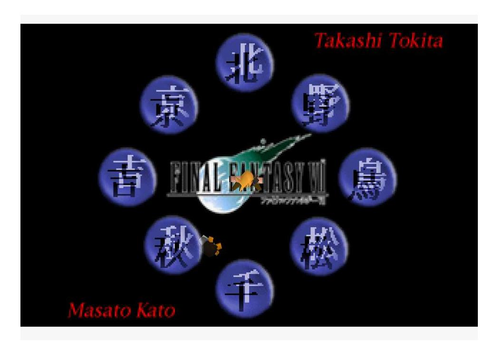

On the PC version, the background is missing, so you don't see the logo, names, or Japanese characters on the screen. This field file is useful in many ways. First, is has a very simple background with alpha transparencies. It also sets the camera and the main character at the mathematical origin of the map (0,0,0) for alignment purposes. The camera and player are also at a rotation of 0,0,0 as well.

#### **Names and the Japanese characters**

All the Japanese letters and words you see are names. Each leads to a room that that contains events that particular person was responsible for. Here is a list of Japanese letters and who it represents.

 1(北) 2(京) 3(野) 4(吉) 5(鳥) 6(秋) 7(松) 8(千)

#### 1. Kita (北) - Yoshinori Kitase (北瀬佳範)

Mr. Kitase was the director of the Final Fantasy Project, he also helped write the story and assisted in event planning.

- 2. Kyou (京) Hidemi Kyounen (京念秀史) Event planner.
- 3. No (野) Kazushige Nojima (野島一成)

Mr. Nojima also helped write the story and was one of the main event planners.

- 4. Yoshi (吉) Kazuhiko Kichioka (吉岡加寿彦) Event planner.
- 5. Tori (鳥) Motomu Toyama (鳥山モトム) Event planner.
- 6. Aki (秋) Jun Akiyama (秋山淳) Event planner.
- 7. Matsu (松) Hiroyuki Matsuhara (松原啓介) Event planner.
- 8. Sen (千) Hiroki Chiba (千葉広樹) Event planner.
- 9. Takashi Tokita (時田貴司)

Mr. Tokita assisted in the event planning for Final Fantasy 7. He did general event flow throughout the game. You access his room by walking off the screen to the north.

#### 10. Masao Kato (加藤正人)

Mr. Kato also assisted with event planning, mostly working on the lifestream sequences and the final battle with Sephiroth. You access his room by walking off the screen to the south.

#### The world map

Walking off of the left of the screen will place you on the world map dictated by what is set in the current map location (Default is outside Midgar.)

#### Yuffie's Menu

Yuffie is standing here between to the 'Aki' and 'Sen' rooms. Taking to her give you the following menus.

NEXT - Next menu.

MENU ON - Enables all the right hand options in the menu.

BATTLE LOCK - Disables all random encounters.

BATTLE UNLOCK - Enables all random encounters.

MOVIE LOCK - Skips all the movies.

MOVIE UNLOCK - Enables movies again.

GLOBAL RESET - Resets money and party.

FULL NAME - Tests the display window for the name by filling it with characters

NEW START - Resets all the event flags in the whole game.

EXIT - Cancels

#### Menu 2:

BACK - Returns to the previous menu.

SOUND RESET - Turns off any playing sound effects or music.

FULL MATERIA - Calls a SPECIAL function three times to fill your inventory with materia.

BATTLE999 - Debug battle #999, for more information in this, see the section on the Battle module. EXIT

### **1. Kitase's Room (**北**)**

This is Kitse's room.

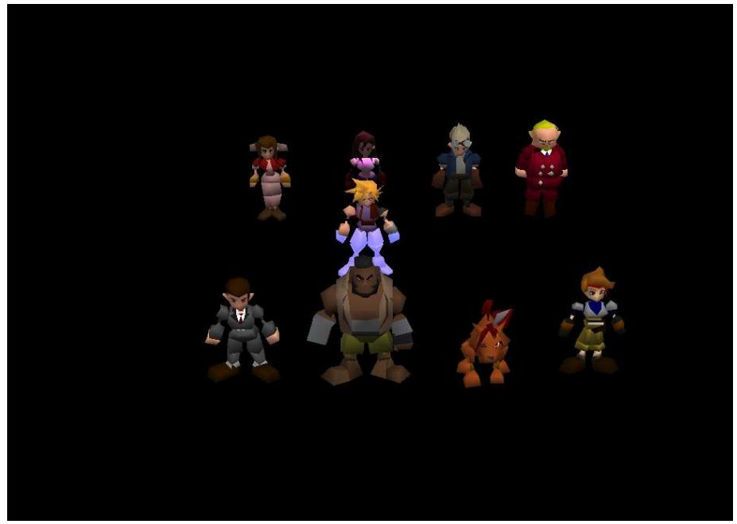

In this room there are several things to note. First, most of the scripts are triggered by stepping close to the character. Secondly, there are some lighting effects are in this room. Aerith uses a bit of dynamic lighting, Tifa is colored with a purple light, and cloud sports a "walking in water" color set that animates when the room is initialized. The following is a breakdown of each character's script.

```
1.1 Aerith
cancel - cancel.
bone after arma - Bone village, after Armageddon. The event flags are not correctly set, do the dialog
       is not correct.
san dun - Climbing caves in Corral Valley.
sleep forest - Entrance of the sleeping forest.
ancient forest - Ancient forest secret area.
lost lake - The City of the Ancients with the huge jeweled pedestal.
water pray - Event where Aerith is praying before Sephiroth kills her.
Aeris dead - Event after Jenova-LIFE battle.
rocket (□ first) - Event before Palmer fight at Cid's.
       (Hold □ for the event when the party first sees the Tiny Bronco).
bone first - Bone village entrance event.
bone luna - Bone Village before the City of the Ancients event.
los in - Event at Junon when the party realize Sister Ray is missing.
1.2 Tifa:
past jenova (□ egg) - Event where Sephiroth nearly kills Tifa/Cloud remembers the truth.
       (Hold square for event after Cloud has stabbed Sephiroth.)
join vincent - Event under the mansion where Vincent joins the party.
shinra house vincent (□ Present) - Shinra mansion. Cloud can't get out of the bed?
       (Hold □ for the entrance to the mansion just before the 'reunion'.)
Shinra under (□ awake) - Event outside the library of Shinra mansion (flashback)
       (Hold □ for second library event).
nivl reactor - Outside the egg room.
nivl reactor out (□ with Tifa) - Arrival at Mt. Nibel's Mako reactor Event (flashback)
       (Hold □ for Outside the reactor chasing after Sephiroth)
nivl mt entrance (□ past) - Mt. Nibel 'fly-by' FMV.
       (Hold □for Mt. Nibel flashback event when Cloud and Tifa were children.)
materia cave - Event Just outside of the materia cave in Mt. Nibel (flashback).
new event sininb34 - event outside of Shinra Mansion library with Zack.
new event sininb35 - Beginning of Zack flashback event.
new midgal - Event where Zack is killed.
nivgate - Zack carries Cloud stagger out of Nibelheim.
() - Cancels.
1.3 Cid
opening - Opening event with movie.
Feel Wind -Diamond weapon battle event.
gate 1 open - The event outside the mako reactor 1 after leaving the station.
T road - T road event Avalanche enters the first mako reactor. (Biggs stands watch)
       (Hold □for escape event.)
1reactor (□ 5reactor) - On bridge leading to first boss battle.
       (Hold down □ for same location in sector 5's reactor)
junon - Tifa's live execution in junon. 
       (Hold □ for the same, but with Yuffie disguised as a camera man later on.)
       (Press R1 for Tifa gas chamber escape event).
() - cancel
```

#### 1.4 President Shinra

white - Tifa's gas chamber event.

white boogen(key) - Event where the music box projects an image.

white boogen(nokey) - Event before Bugenhagen examines the music box.

before - The same as above, but with environment flags set

after - After 'music box' event has been finished with proper flags

white 2 - The same as above, but without the environment flags

Junonn in2 - Music box 'projection' scene.

#### 1.5 Shinra Employee

Para - Parachute event.

66F - Board meeting on the 66th floor.

67F (□) - 67F when Hojo enters the room

(Hold □ for 'captured' event.)

68F - Just before boss fight with HO512.

68F2 - Event where Red XIII first appears.

70F - Launches a submenu

plate down meeting - Heidegger and Reeve talk to P.Shinra about the Sector 7 pillar sabotage plan.

caught - scene where the team are introduced to President Shinra by Rude.

dead president - Arrival in P.Shinra's office only to find him dead.

app rufaus - Rufus arrives outside in his helicopter.

after heli - scene just before Rufus boss battle.

elevetr - Scene where the turks capture everyone in the lift.

() - cancels

#### 1.6 Barret

(No menu, JUMPMAP to Final dungeon.)

#### 1.7 Red XIII:

7 pillar - Sector 7 pillar battle event.

Kolneo under - Event under Don Corneo's mansion, in the sewer.

high way - Event after Motor Ball boss

5 out - Event where party leaves Midgar for the first time.

airport (□ gelnica) - Outside Highwind at Junon airport

(Hold □ for the Gelnika airport scene).

after fire sephiros - Event after Sephiroth walks through the fire.

jairo sky - Crashing Tiny Bronco event.

jairo sea - Event where Tiny Bronco has landed in the sea.

junon cannon - Event where weapon is attacking Junon/ Barret escapes.

junon medical - Event after Tifa's Flashback in Junon while being held prisoner.

() - cancel

#### 1.8 Jessie

Cancel - cancel Aerith - Adds Aerith to the character pool Tifa - Adds Tifa to the character pool Barret - Adds Barret to the character pool Red - Adds Red XIII to the character pool cid - Adds Cid to the character pool (blank) - Adds Cait Sith to the character pool Yuffie Adds Cait Sith to the character pool Sephiroth - Adds a Sephiroth'ed Vincent to the character pool Cloud Lock - Keeps cloud as party leader Change members - Loads a menu requiring to make a party of three.

## **2. Kyounen's Room (**京**)**

This is Kyounen's room.

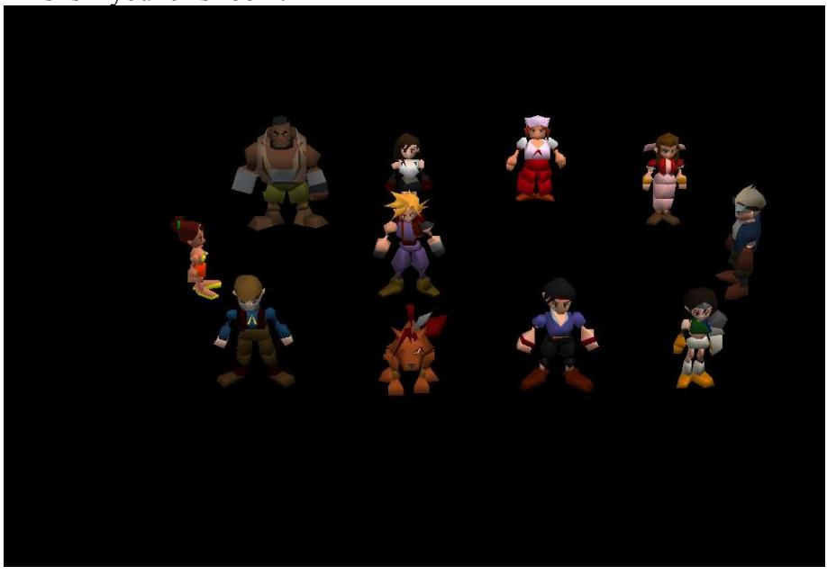

#### 2.1 Priscilla

all members - add all members to the character pool quit - quits

without Yuffie - removes Yuffie from the character pool without Vince - removes Vincent from the character pool without Ballet - removes Barret from the character pool without Tifa - removes Tifa from the character pool without Erith - removes Aerith from the character pool without Red - removes Red XIII from the character pool without Cid - removes Cid from the character pool without Ketcy - removes Cait Sith from the character pool

#### 2.2 Barret

"Who do you want in the Party?

Tifa - Places Tifa in the active party

Ballet - Places Barret in the active party

Red - Places Red XII in the active party

Cid - Places Cid in the active party

Yufi - Places Yuffie in the active party

Ketcy - Places Cait Sith in the active party

Vince - Places Vincent in the active party

Put Cid on point - Removes all characters and places Cid as the party leader Forget it - quits

#### 2.3 Tifa

Going to North Corel. It doesn't matter whether or not Ballet is in this event.

Barret of North Corel - North entrance to Corel town.

ropeway - Gold Saucer ropeway entrance (Corel side).

North Corel - Event if you fail to stop the runaway train.

Quit - quits.

#### 2.4 Nurse

These set various event flags within the game.

Palmer - Flags Palmer battle has finished.

Highwind - Gives you the Highwind.

Materia mission - Flags that the Corel-based Matera mission has been done.

Cloud's revival - Flags Cloud has been rescued from the Lifestream.

Rocket launch - Huge materia rocket ready to launch.

Sister Ray - Going to stop the Sister Ray.

Train Success - Flags the train was stopped

Train Failure - Flags the train was not stopped

Train Last - Doesn't touch the train flags

Quit - Takes you to North Corel with no location information.[STUCK]

#### 2.5 Aerith

"Snowboard Game"

(Plays the Story-version snowboard game)

#### 2.6 Cid

I'm sickle...xxxx. I mean Icicle inn...ok bad joke." (Icicle inn just before snowboard event)

#### 2.7 Yuffie

"Hydroplane event"

Deck No.1 - Weapons awakening event.

Parachute Deck - Midgar parachuting event.

bridge no. 1 - Event before the Sister Ray is used by Hojo.

bridge no. 2 - Event where Reeve explains the problem with Hojo to Cloud.

bridge no. 3 - Event after Reeve is captured/Highwind heads for Midgar.

Conference room 1 - Heidegger/Scarlet explain huge materia plan to Rufus.

Conference room 2 - Reeve attempts control of the Sister Ray

Conference room 3 - Reeve is arrested

Send-off people - Event just before parachuting into Midgar

#### 2.8 Man

"Gaea's Cliff test"

Gaea's cliff no.1 - 1st Freezing climb event.

Gaea's cliff no.2 - 2nd freezing climb event.

Gaea's cliff 1 of 3 - 3rd freezing climb event.

Gaea's cliff 2 of 3 - Last climb to top of the cliff.

Base of Gaea's cliff - Outside Mr. Holzoff's house.

Quit - cancels.

#### 2.9 Red XIII

"Where are you going underneath Junon?"

Under junon 1 - Junon fishing town next to the beach.

There'll be monsters - Junon fishing town, after you've saved Priscila.

Dolphin Jump - 'Dolphin jump' event

Artificial respiration - 'CPR' event.

#### 2.10 Corel Miner

Crater no.1 - Start of Crater reunion event.

Whirlwind Maze no. 1 - Event where Sephiroth tricks Red XIII.

Whirlwind Maze no. 2 - Next screen on from 'Crater no. 1 '.

Atmospheric barrier no. 1 - First 'Barrier' event.

Atmospheric barrier no. 2 - Second 'barrier' event.

Atmospheric barrier no. 3 - third 'barrier' event.

Quit - cancels.

#### **3. Nojima's room (**野**) - BLACKBG5**

Here is am overview of Nojima's room. Cloud was moved to the left for clarity.

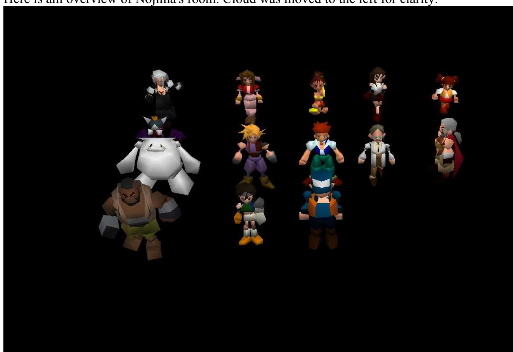

#### 3.1 Sephiroth (cefiros)

Sephiroth related

Quit - cancels.

from pinball - Truck flashback event

from Cam's inn - Young Cloud going to Nibelheim with Sephiroth event.

starry sky - Young Cloud and Tifa at the well event.

gate - Clouds's flawed memory, Sephiroth and Cloud arrive at Nibelheim.

gate no.2 - Lifestream visit to Nibelheim.

starry sky - Well flashback in Lifestream.

village no.2 - Nibelheim, bad JUMPMAP

truck no.2 - The real events with young Cloud and Zack at Nibelheim.

#### 3.2 Aerith (earith)

Church

First of all - Cloud waking up in the flowerbed after falling

Following roof incident - Inside the church with the children looking at the flowers.

After Aeris's death - Return to church to see the ghost of Aerith. Unlike many many Internet rumors, this scene contains no "unfinished code" that point to Aerith's revival. The reason why you can't talk with her is because Cloud hasn't stepped on the trigger near the door to make her disappear yet.

#### 3.3 Priscilla (pri)

These has some bad JUMPMAP commands with no location data, player gets stuck

Highwind (Not going) - cancel

Shinra's highwind - Rufus flys to the 'reunion'.

Party's highwind - First event on the captured Highwind bridge.

Evening's highwind - same event as 'Shinra's Highwind'.

sign - Parachute deck of the Highwind, [STUCK]

passageway - Middle room of the Highwind. [STUCK]

Conference room - Highwind conference room, Cloud apologizing..

Chocobo - Inside Highwind Chocobo stable. [STUCK]

{Cloud} Highwind - usual Highwind bridge scene.

#### 3.4 Tifa (tifa)

My dear hometown Nibelheim

village - Flashback event of Nibelheim at town square.

1st floor of inn - [STUCK]

2nd floor of inn - [STUCK]

store - Item shop [STUCK]

{Cloud}'s house - Cloud's house (leaps to flashback event).

{Tifa}'s house - Opens a submenu.

1st floor - [STUCK]

2nd floor - [STUCK]

2nd floor window - Tifa as a child flashback event.

reminiscing - Event of Tifa's mother's death.

1st floor of house - Bottom of house in Nibelheim. [STUCK]

2nd floor of house - Attic room of house. [STUCK]

Quit - Cancels.

#### 3.5 Little Girl (girl)

Goodbye to party members {Cloud}

(Zack flashback event)

#### 3.6 Cait Sith (ketcy)

Tragedy of Nibelheim quit - Quits

Part 1 - Sephiroth's version of Nibelheim events..

Part 2 - Sephiroth shows Cloud the truth.

#### 3.7 Red haired Man (nbman)

Global Re-set

Yes - Resets all the game flags - SPECIAL (FE)

no - cancels

ended reflecting on the past - sets flag to signal flashbacks are done.

#### 3.8 Doctor (doctor)

Present day Nibelheim

Go - Nibelheim [STUCK]

Don't go - Cancels.

#### 3.9 Zangan (zangan)

Zangan's script points to two blank dialog messages (009 and 00A) containing a single {stop} character. These were probably deleted test scripts

#### 3.10 Barret (ba)

This is a broken dialog script. The dialog is never shown. This is because the number of members that you can point to is more that the number of items in the dialog script. From the script file, the dialog is supposed to contain the following commands. Counting the blips of the finger moving from the top will give an idea where it is.

[empty] - Nothing happens because menu is incorrectly aligned.

{Cloud} - Puts Cloud in Party

{Barret} - Puts Barret in party

{Tifa} - Puts Aerith in party (misalignment)

{Aerith} - Puts Red XIII in party

Red XIII - Puts Yuffie in party

{Yuffie} - Puts Cait Sith in party

Cait Sith - Puts Vincent in party

{Vincent} - Puts Cid in party.

{Cid} - Makes young Cloud party leader

only {Cloud} 16 - Makes Cloud party leader.

only {Cloud} - Makes Tifa party leader.

{Tifa} leads the way - Makes Cid party leader.

{Cid} leads the way - Quit

#### 3.11 Yuffie (yufi)

quit - Cancels.

TRNAD51 - Event just after Cloud gives Sephiroth the black materia.

TRNAD52 - Event before Cloud gives Sephiroth the black materia.

TRNAD53 - This is an unused field file with a walkmesh that was used for debugging

BLACKBGD - Disk switch for end of Disk 2. Starts event to northen cave/Highwind.

#### 3.12 Highwind Crew Member (crew2)

quit - Cancels.

regular hours - After getting Cloud back, heading to junon on the Highwind.

star's scream - Cid speech on Highwind.

weapon appears - Diamond weapon attacks Midgar

What happened to Sephiroth? - Heading to the Northen Cave

On the final day - Event where Cloud tells everyone to go.

everyone came home. - The party all rejoin Cloud and Tifa on the Highwind.

called from the last dungeon - On Highwind at the end of the game.

### **4. Kichioka's room (**吉**) - BLACKBG7**

This is what Kichioka's room looks like.


## 4.1 Cid

First a battle against against Vagyrisk takes place at Fort Condor. After the battle, a menu appears. Man - wall market as Cloud

Be Girl - Wall market as Cloud in dress.

#### 4.2 Red XIII

Train Grave

MDS7ST2 - Second screen of the Train Graveyard.

MDS7ST1 - Party enters the start of the Train Graveyard.

Cancel - cancels

#### 4.3 Reeve

- 1 Shinra meeting and unveiling of the 'Sister Ray' event.
- 2 Firing of Sister Ray
- 3 After firing of Sister Ray/The death of Rufus.

Last 0-3 - Start of North cave (leaving Highwind)

Cancel - cancels

#### 4.4 Barret

Organaize Party?

Yes - Gives you three dialog boxes of names. Each one will place that character in the active party. No - cancels

#### 4.5 Snow Woman

(blank) - Snow board landing at Great Glacier, near trees

(blank) - Snow board landing, next to Ice Gate sign at Great Glacier.

(blank) - Snow board landing at the above sign post.

(blank) - Snow board landing in forest.

HYOU3 - Snow board landing in rock valley.

HYOU13-1 (After) - Outside Snow Woman's cave, after the battle.

HYOU13-1 (Before) - Outside Snow Woman's cave before the battle.

HYOU5-2 - Ice jumping mini game.

Cancel - Cancels.

#### 4.6 Cait Sith

Climb Wire, after 7th plate falling

WCRIMB1(with Battery) - First part of wall climbing event with batteries.

WCRIMB1(without Battery) - First part of wall climbing event without batteries.

WCRIMB2 - Last climb event with batteries.

WCRIMB1 - swinging pole event with batteries.

Cancel - Cancels

#### 4.7 Man With Hat

#### CONDOR1

(blank 1) - Leads to sub menu:

(blank 1a) - Entrance to Fort Condor Cloud is leader

(blank 1b) - Entrance to Fort Condor, but Tifa is party leader.

(blank 1c) - Entrance to Fort Condor, but Cid is party leader.

cancel - cancels.

#### (blank 2) - Leads to sub menu:

(blank 2a) - Fort Condor already upstairs. Cloud leader + Tifa + Cid.

(blank 2b) - Fort Condor already upstairs. Tifa leader + Young Cloud + Cid

(blank 2c) - Fort Condor already upstairs. Cid leader + Young Cloud + Sephiroth

cancel - Fort Condor upstairs with your current party

#### (blank 3) - 3. Leads to:

(blank 3a) - Entrance to Fort Condor after final huge materia battle. Cloud leader + Cid + Tifa.

(blank 3b) - Same as above, but Tifa is party leader plus Cid and Young Cloud

(blank 3c) - Same as above, but Cid is party leader plus Young Cloud + Sephiroth

cancel - Same as above but with current party

#### (blank 4) - . Leads to:

(blank 4a) - Entrance to Fort Condor

(blank 4b) -Entrance to Fort Condor, but Tifa is party leader.

(blank 4c) - Entrance to Fort Condor, but Cid is party leader.

cancel - Fort Condor with Cid leader, Young Cloud, and Cloud.

#### (blank 5) - 5. Leads to:

(blank 5a) - Fort Condor before Huge materia battle. Cloud+Tifa+Cid

(blank 5b) - Fort Condor before Huge materia battle. Tifa+Cid+Young Cloud.

(blank 5c) - Fort Condor, same as above. Cid+Young Cloud+Sephiroth

cancel - Fort Condor Battle 2 (Current party).

#### (blank 6) - Leads to:

(blank 6a) -After winning Huge materia battle. Cloud+Tifa+Cid.

(blank 6b) After winning Huge materia battle. Tifa+Young Cloud+Cid.

(blank 6c) - Same as above but with Cid+Sephiroth+Young Cloud

cancel - Same as above, but with current party.

(blank 7) - After Huge materia battle talking to old man downstairs.

(blank 8) - In command shed after losing a battle.

(blank 9) -

(blank 10) Cancels.

#### 4.8 Aerith

MRKT1 - Top half of Wall Market.

MRKT2 (After) - First visit to Wall Market with Aerith

MRKT2 (Before) - Wall Market before 'Plate climb' event.

Cancel - Cancels

#### 4.9 Tifa

Options which give you:

(blank) - Gives you another 300 Gil.

(blank) - Gives you another 131072 Gil.

(blank) - Gives you 99 of every item.

(blank) - Battle 999

(blank) - Resets all game flags, and unlocks the menu.

(blank) -

(blank) -

(blank) - Quit

#### 4.10 Yuffie

20 Movie

Look - View movie, these are for disk two.

Plus - Add one to the movie counter.

Cancel - Cancels

#### 4.11 Wrestler

Play Fort Condor Minigame

- 1 Difficulty level 1
- 2 Difficulty level 2
- 3 Difficulty level 3
- 4 Difficulty level 4
- 5 Difficulty level 5
- 6 Difficulty level 6

Last - Huge Materia version.

### **5. Toriyama's Room (**鳥**) - BLACKBG2**

This is Toriyama's room, the following is a picture of the layout when the PC first enters on the US PSX version.


This room also tests the STPAL, ASPAL and LDPAL commands for field light shading. It also tests the direct scripts, BGaimn scripts, sand windowing systems. (WSIZW, WCLSE)

There are some debug keys associated with this room. They are the following.

Select: Help menu for the below.

Square: "Reset Flag" - [Calls script commands SEPCIAL(FE) and SPECIAL(FF)]

L1: "Battle off" - switches off battles. Press again to re-enable.

L2: "Set Normal Party" - Gives you Cloud, Barret and Tifa in party.

R1: "Reset Flag" - same as Square

R2: "Default Name&No Money" - Gives default names and no money

R2: (again): Debug Name&Debug Money" - removes all names and gives you 131071 gil. (CHGLD) These are defined in the (direct) script.

#### 5.1 Aeris (earith)

"Working Now" - Aeris is a link to a scene that was broken in the Japanese version. (Hence why she says "Working now"). Her script also includes a quick animation and also 5 other scenes that are disabled.

#### 5.2 Sailor Barret (ballet)

This leads to various events on "7th Street" which are areas within and around Barret's bar. Selecting him gives you the following menus.

"7th Street" - 'Beginner's Hall' event.

Welcome Home -Return to 7th Heaven after first reactor 1 mission.

Before Memory - Tifa event about "The Promise".

Materia - Down stairs in the hideout, before "After memory" event.

Good Morning - Next Morning Event.

Before Battle - Before the Sector 7 Pillar battle event.

Cancel - Cancels

After Memory - Talking to Tifa after the promise flashback event.

#### 5.3 Tifa (tifa)

She is the party testing script. Her script tests the MMB+- command (Add/remove backup characters), PRTYE command (implicitly adds/removes all three characters to and from the 3 member battle group) and the PRTYP command (adds and removes one character to the battle group). It also tests the party select screen (Menu 7).

#### 5.4 Train Station Guard (guard)

Train Station Guard: "Last train from Midgar"

Cargo - Begins after you've met with Barret in the train boxcar.

Train 1 - Talking to Jessie about the ID system

Train 2 - Second train car, event where the alarm goes off.

Train 3 - Fourth car of the rain where AVALANCHE escape.

Train 4 - Third of train escape event

Monitor - Monitor sequence with Jessie.

Station 1 - Arrival back at sector 7 after first mission.

Station 2 - Train to the second reactor mission.

StationFlashback - Flashback event of Elmyra finding Aerith.

#### 5.5 "Honey Bee Inn" Girl (dancer)

The girl goes through a bit of an animation test. She also tests the SWCOL command to change the window colors to something a little more......romantic.

First Time - First visit to Honey Bee Inn, asking for Tifa.

2nd Time - Visit with members pass..

3rd Time - Return when Cloud is dressed as woman..

After All - Return when Shinra have occupied the inn.

Cancel

#### 5.6 Rude(workman)

This script also tests the TLKON, SOLID, and VISI script commands on the character.

"Everyday My Works are..." - Cancels

Got The Jyro - Resets Flag on little Bronco

After The Meteo...TIFA - Makes Tifa Party leader

After the Meteo...CID - Makes Cid party leader

After the Meteo...CLOUD - Makes Cloud party leader

Mako Under The sea - [SET-WORD ( 20, 00, E2, 04 )]

Hp&Mp 1 - Kills lead character and removes all Mp (MP- and HP- test)

No Money - Removes all money. (Tests the GOLD- command)

MoneyMoneyMoney - Gives you 365294 Gil. (does GOLD+ twice to test gold addition)

Got The keystone - Gives you Keystone Key item.

#### 5.7 Dog (junon3)

The dog is going through a KAWAI loop. (KAWAI == the animator's name) Also this script also calls MAPJUMPs without setting location variables. This causes the PC to get stuck. Why a dog? Because The Japanese sounds for the English "Dog" and "Dock" are similar (doggu, dokku) "JUNONDOC"

JUNONDOC1 - Junon. Scene where party boards boat to new continent. Also restores default party names and removes all money.

JUNONDOC2 - Puts you at the empty dock at Junon. In the middle of the ocean. [STUCK]

ROAD1 - Puts you in the SOLDIER base just before the main Junon town.

(Cancel) - Cancels

ROAD3 - Puts you in tunnel in Junon SOLDIER base. [STUCK]

ROAD4 - Junon Huge materia sequence in tunnel guarded by dog. [STUCK]

ROAD5 - Another corridor leading to the Junon underwater reactor. [STUCK]

ROAD6 - Puts you in Junon shop, [STUCK]

ROAD7 - Bottom of Junon liftshaft.

ELE 1 - Puts you in the Junon underwater reactor lift [STUCK]

ELE 2 - Puts you at top of Junon town liftshaft.

ROOM - Same as ROAD1.

#### 5.8 Cat (junon2)

This is the left side of Junon. There are also MAPJUMP commands called without setting location information, causing the PC to be stuck sometimes.

"JUNONL" (This also acts as quit)

JUNONL1 - Junon Town street. [STUCK]

JUNONL2 - Left side of Sliding Junon lift. [STUCK]

JUNONL3 - Part of Junon street [STUCK]

JUNONL-W - Junon weapons shop. [STUCK]

JUNONL-I1 - Junon accessories shop. [STUCK]

JUNONL-I2 - Junon Item shop. [STUCK]

JUNONL-INN - Appear at Junon inn. [STUCK]

JUNONL-PUB - Appear at Junon Shinra bar. [STUCK]

JUNONL-MIN0 - Secret beginners room in Junon inn.

JUNONL-MIN1 - SOLDIER barracks. [STUCK]

JUNONL-MIN2 - Top floor of barracks. [STUCK]

#### 5.9 Dolphin ( junon1)

One again, just a bunch of JUMPMAPs with no location information. This is Junon's right side "JUNONR" (Also quits)

JUNONR1 - Junon Parade performance.

JUNONR2 - Starts outside the sliding lift. Scene is after WEAPON attacks.

JUNONR3 - Entrance to Shinra headquarters above Junon.

PARADE - Starts at the actual parade minigame, [STUCK]

JUNONR-W - Junon Weapons shop. [STUCK]

JUNONR-PUB - Junon Pub. [STUCK]

JUNONR-I - Item shop. [STUCK]

JUNONR-M - Weapon Shop. [STUCK]

JUNONR-MIN1 - SOLDIER barracks. [STUCK]

JUNON-MIN2 - Cat room of SOLDIER barracks [STUCK]

JUNON-MIN3 - SOLDIER barracks bedroom - [STUCK]

JUNON-MIN4 - Same as second part of 'JUNONR1'

#### 5.10 Sailor (crew)

This is a jump to the sub base and related minigames. Some sanity checking is done in the way of adding characters for you, but the JUMPMAPs have no location data here too.

"Submarine" (Cancels and leads to party screen)

SubmarineDock - Red Submarine in dock SIAW.

BridgRed - Bridge of red submarine SIAW.

BridgeBlue - Bridge of Blue Submarine.

SubmarineRed - Scene just before 'Bridgered'

SubmarineBlue - Scene just before 'Bridgeblue'

Escape - Escape from submarine dock (if you failed to get a sub)

Minigame0 - Submarine game at various difficulties.

Minigame1 -

Minigame2 -

Minigame3 -

Minigame4 -

#### 5.11 Wizard (ket)

Temple of the ancients events.

"Temple of the Ancients" - (quits and leads to party screen)

Temple - Leads to The entrance to the temple - after it's been destroyed.

After Collapse - Almost the same as 'temple'

Altar - At the Alter where you put the keystone.

Alter2 - Keystone placement scene (leading to maze).

Temple of The Ancients - Maze section

Shop Of The Ancients - Shop of the ancients .

The Rock - Rolling rocks trap scene.

The Hole Of the Time - Giant Clock Scene

Tirano - Battle with monster at the bottom of the clockface.

Treasure - Treasure room. you can't open the chest or leave.

Chase - Wizard chase sequence. Leaving takes you to boss battle scene.

Next Page - Leads to second page of locations:

"Temple of the Ancients 2" - Leads to a nice picture of a wall. [STUCK]

Mateo - Leave and then re-enter for 'Cloud's mind' scene.

Sephiros - Sephiroth explains his evil scheme

Hole1 - A blocked tunnel in the temple of the ancients in the clock [STUCK]

Hole2 - Another tunnel in the temple. [STUCK]

Boss - Scene after you have killed 'Demon's Gate' boss.

Mateo2 - Same as 'Mateo' option.

Cancel - Cancels.

#### 5.12 Costa Del Sol Barmaid (cos)

This girl also is in a very small animation loop

"Costa Del Sol" - Cancels

Town - Costa Del Sol at early part of the game

Beach - Beach of Costa Del Sol

Harbor - Harbor scene

Debug - Rufus arrives at Costa Del Sol

#### 5.13 Sephiroth (mtcrl)

Tests a small animation loop as well.

"Mt. Corel"

Mountain Road - Start of pathway up Mt. Corel.

(Cancel) - Cancels

Vally - Mt. Corel railway bridge (leading to 'Rollercoaster' section).

Up&Down - Scene where you fall off the railway track and can climb up to get some items.

River - Bridge over the Corel river (the bridge is already lowered).

Hole - Secret Miner's cavern under Mt. Corel.

PiyoPuyo - Secret Birdsnest scene.

Bridge - Rope bridge from North Corel.

Railway - 'Rollercoaster' railway section.

Ballet's Memory - Barret flashback sequence of him and Dyne watching North Corel burn.

Cancel - Cancels

## **6. Akiyama's Room (**秋**)**

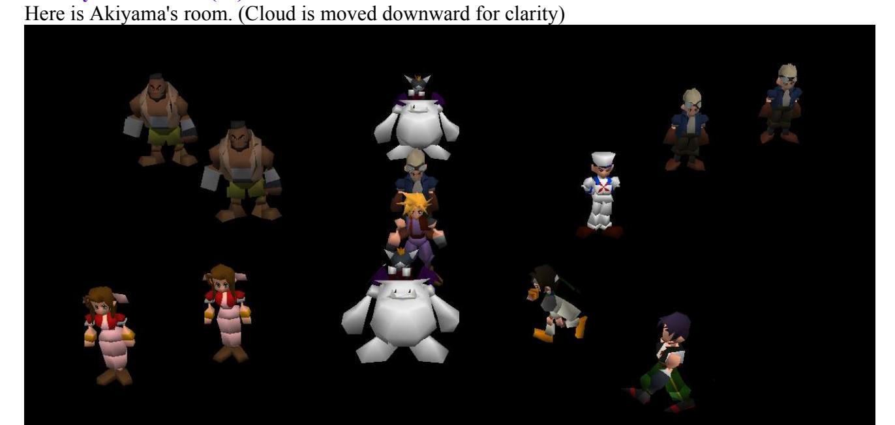

#### 6.1 Cid (in center)

"Colneo" - (Don Corneo)

Ponbiki - (Pimp) - Don's Mansion

Irasshai - (Welcome) - Inside Mansion. (Nothing seems to happen).

Tifa to goryuu - (Hooking up with Tifa) - Tifa is taken to Corneo. You go in the room dressed as a girl.

Yame - (Stop) - cancel

#### 6.2 Cait Sith (Top)

Cloud Dake - (Only Cloud) - Cloud Party Leader Tifa Dake - (Only Tifa) - Tifa Party Leader Cid Dake - (Only Sid) - Cid Party leader

#### 6.3 Sailor

utai iriguti - (Wutai entrance) - Just entering Wutai.

yufi wo oe! - (Yufie! HEY!) - Entering Wutai persuing Yuffie.

yufi nakamani - (In company with Yuffie) - Event where you first meet Yuffie.

yufi nigeru1 - (Yuffie running away 1) - Event where you are ambushed by Shinra troops after Yuffie steals your materia.

yufi nigeru2 - (Yuffie running away 2) - Same as above with a different battle camera angle.

meteo1 - Event where meteor is hit by the rocket.

meteo2 - Cosmo Canyon after above event.

meteo3 - Same as above, but not getting Huge Materia.

yame - (Stop) - Cancels.

#### 6.4 Cid (Above Sailor)

tifa to saikai - Cloud meets up with Tifa in the Don's mansion.

earith to gouryuu - (Hooking up with Aerith) - Aerith gets to 'meet' Corneo..

colneo sonogo - Later on in the game in the basement of the Don's mansion with Kotch tied up. yame - (stop) - cancel.

#### 6.5 Cid (Upper right)

"iroiro" - (Many things)

colneo kobun beya - Cloud and Corneo's thugs event.

sinra kaiden 1 - (Shinra starway 1) - 1st set of Shinra building stairs..

sinra kaiden 2 - (Shinra starway 2) -2nd set of stairs.

sinra kaiden 3 - (Shinra starway 3) -Last set of stairs.

sinra 59F - 59th Floor of shinra building. [STUCK]

sinra elevetor - Elevator after breaking in to the shinra building.

sinrabil totunyuu - (Shinra building plaza) - Event outside Shinra building when you first climb up.

sinrabil dasshutu - (Shinra Building lobby) - Event where cloud rides down on moterbike.

yame - (stop) - cancel.

#### 6.6 Yuffie:

cosmo materia ya - Cosmo Canyon materia shop.

cosmo touchaku - (Cosmo Panorama) - Zoomed out view from when you first visit Cosmo Canyon.

seto no kabe - (Seto's Wall) - Event where Red XIII arrives at the statue of Seto.

Movie Check - Plays film of Bugenhagen's planetarium when disk one is inserted.

boogen jikkensitu - (Boogen laboratory) - Boogenhagen shows his planet lab.

sayonara cosmo - (Goodbye cosmo) - Cloud leaves Cosmo Canyon, only to be joined by Red XIII.

meteo go cosmo - (Cosmo after Meteo) - Cosmo Canyon after the threat of Meteor.

onegai boogen - (Please boogen) - Inside Bugenhagen's room, before planetarium event.

hyuji materia - (Huge Materia) - Huge materia display.

sayonara boogen - (Goodbye boogen) - In Bugenhagen's room.

............ - Bugenhagen 'goes away' and gives Red XIII his Ultimate Weapon.

#### 6.7 Dyne

sinra 60F - Video of guard falling asleep. Bad JUMPMAP [STUCK]

sinra 61F - 61F of Shinra building.

sinra 64F - 64F of Shinra building (gym). [STUCK]

sinra 63F - 63F of Shinra building (item maze) STUCK]

sinra 62F - 62F library

sinrabil shoumen - (Shinra Building Plaza) - Outside Shinra HQ.

sinrabil uraguti - (Shinra backdoor) Shinra back entrance.

minigame - Motorbike game. Afterwards Cloud appears in an empty debug room.

sinrabil matane - (Waiting by the Shinra building) - Outside Shinra Building. [STUCK]

yame - (stop) cancel

#### 6.8 Cait Sith (Bottom)

Unpansen - In disguise on board the cargo ship to Costa Del Sol.

corel kaisou1 - (Corel flashback 1) - Barret flashback to the original North Corel town/Shinra meeting.

corel kaisou2 - (Corel flashback 1) Shinra/townspeople meeting event of flashback.

aishuukessen - (Final battle) - End of the game. Cloud travels towards the light..

yame - (stop) - Cancels.

#### 6.9 Aeris (top)

Cloud erabeu - (Cloud chosen) - Cloud Chosen by Don Corneo

Earith erabeu - (Aerith chosen) - Aerith chosen

Tifa erabeu - (Tifa chosen) - Tifa Chosen

Yame - (stop) - Cancel

#### 6.10 Aerith (Bottom)

Cloud no Baai - (Cloud's situation) - Cloud in Corneos' room

Earith no Baai - (Aerith's situation) - Aeris in the room

Tifa no Baai - (Tifa's situation)- Tifa in the room

Yame - cancel

#### 6.11 Barret (right)

"5Bangai" (Sector 5)

kyoukai no yane - (The church roof) - Aerith talking to Cloud on the church roof.

yane pyon - (rooftop jumping) - Event of jumping on roof tops with Aerith.

yane kara oriru - (Decending from the rooftops) - Cloud and Aerith jump off the last roof.

yame - (stop)- Cancel.

#### 6.12 Barret (left)

"5Bangai2" (Sector 5 part 2)

slum chuusin - (Slum Center) - Sector 5 main area.

dokan - Inside the sickman's house/pipe place.

icchaya - (first arrival) - Outside of main Sector 5 (when you're trying to sneak away without Aeris).

yame - (stop) - Cancel.

## **7. Matsuhara's Room (**松**) - BLACKBG3**

This room appears As follows:

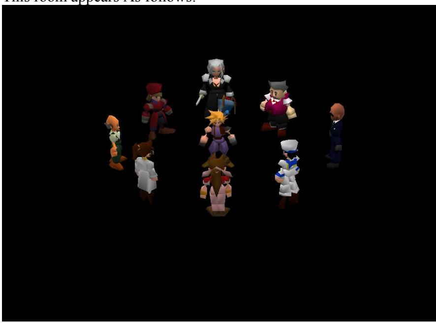

Entering this room sets the "Sephiroth Flag", changing Vincent to Sephiroth and then adds him to your party. These are the characters going clockwise.

#### 7.1 Sephiroth (p8)

This is a movie tester, it runs a group of movies in a set. It also tests the color depth switches between the 8 bit overlay movies and the 15 bit hi-color types. During each sequence, the appropriate is selected and played of available. It also does minimal CD checking (using DSKCG) to make sure the correct CD is in the drive.

#### CG Movie Viewer

use - leads to :

South Reactor - Reactor explosion (where Cloud falls)

(Blank space) - sector 7 pilar explosion

NIVILHIAM tragedy - Scene where monster emerges from reactor/Sephiroth fire scene.

(Blank Space) - Aborted rocket launch scene.

Gold Saucer - Cable car departure/arrival. Also Round square ride films.

take off Tiny Bronco - Tiny Bronco sequence.

AERITH death - Aerith death scene

SEPHIROTH - Sephiroth black materia/weapons awaken.

WEAPON Attack - Attack on Junon + Highwind escape.

CLOUD psychoanalusis - Mideel destruction/lifestream choice scenes.

(Blank Space) - Rocket take off

METEO intercept failure - escape capsule/meteor scene.

shoot SISTER LAY - Firing of the 'Sister Ray'.

cancel - cancels

(Blank Space) - returns to main room

#### 7.2 Kalm Bartender (p3)

Various events in the town of Kalm

"KARM Town"

cancel - cancels

First come - Kalm when you first get there. Adds Barret, Aerith, Red 13, and Tifa to the character pool, then run the chracter select screen.

After Armagedon - set environment after the casting of meteo, brings up a submenu

Check Oldman's event?

Yes - leads to old man quest flags as below:

old man event:

get GUIDE BOOK - Guide Book key item

get DESERT ROSE - Desert Rose key item

get EARTH HARP - Earth Harp key item

event start - sends you to Kalm pub with the selected items.

No - leads to the pub in Kalm

#### 7.3 Rude (p5)

Mithril mine events

#### "SOUTH DUNGEON"

cancel - cancels

Meet TARCKS - outside the scene where you meet the Turks in Mithril Mine. Give you a sub menu.

Join AERITH?

Yes - Aerith joins the party

No - She does not

we can't go - reorganize party, then leads to Mithril mine.

#### 7.4 Sailor(p2)

### "ANOTHER CHECK"

Last Dungeon - Adds all the characters to the pool, selects the last dungeon and presents a submenu. join YUFE - adds Yuffie to the pool

join VINCENT - adds a non-Sephiroth Vincent to the pool. It will share the same attributes as the Vincent with the "Sephiroth flag" set. Because the menu system sees the two characters as the same, and because the field script is not programmed to tell anything different, the preloaded Sephiroth will change to Vince's avatar. If you start the last dungeon with Sephiroth-vincent (The one with the "Sephiroth flag" set) in your party, he will be killed and removed from the battle engine because you can't have two of the same character in your party.

join BOTH - adds both to the pool

join CANCEL - doesn't add either to the character pool

The game will then load the character selection screen so you can pick your characters, it will then return to another submenu

SAVE CRYSTAL...

Give 99!! - Give 99 save crystals, only allows one on the screen at a time.

No need - does not add them to inventory

HIGHWAY Minigame - You play the storyline version of the bike mini game,

Shinra Airship - Takes you to the crashed Gelnika, if you leave up the ladder you will be taken to the underwater world map in debug mode. Here the sub marine is replaced with a model of the key to the Ancients. This allows you full access to the underwater world map, with the ability to go on top of the cliffs and survey for any location.

#### 7.5 Aerirh

#### "AERITH EVENT"

Decline Church - Church escape sequence.

Forgotten Relm - Top of the City of the Ancients

Go To Northland - Appear in City of the Ancients after Aerirh's death.

#### 7.6 Shera

#### "ROCKET VILLAGE"

Meet CID - scene before rocket launch.

METEO intercept - same as above.

Rocket at space - Rocket in space..

#### 7.7 Gongaga Villager

#### "GONGAGA VILLAGE"

Cancel - cancels

Meet TARCKS - Plays the Turks event battle in Gongaga village.

Who am I? - Takes you to The City of the ancients from Gongaga village.

#### 7.8 Railway Guard

"TUNNEL"

Cancel - cancels

Tunnel - Take you to a submenu for the Midgar tunnels after the train escape event.

"LEVEL of TORIYAMA EVENT"

Perfect! - least distance to reactor.

Normal - Normal distance from reactor.

OH NO! - Miles away from reactor

5th Reactor - AIRBUSTER ambush.

#### **8. Chiba's room (**千**) - BLACKBG4**

The room appears as such.


This is many of the Gold Saucer events, Aerith scenes, along with the last dungeon. Some of the character scripts have secondary functions when pressing the square button. This will create a window with the message "2P" within it to let you know it's switched, pressing square again will switch it back to "1P"

This room also puts the animation system through it's paces. Each character is initialized with it's own animation routine. The Player Character, in this case Cloud, is also set with a new "rest" animation as well.

#### 8.1 Center Cloud (cloud)

Ima.. - (Now I'm...) - renames the charcater. This script runs Menu 6 (rename) though it's paces. Chokobo - Chocobo race (Gives you a new chocobo to name then starts the Chocobo race mingame). Jet - Play Speed Square Gold Saucer Game.

Yame - Cancel

#### 8.2 Cloud with Sword

This will remove all party members before using the JUMPMAP command.

8Bangai - (translation: Sector number 8)

tojikomerarechatta - (Locked away) Scene in tunnel after first reactor mission where Jessie is setting a bomb.

BOOM to kitamonda - (BOOM and and way north) Tunnel explodes from bomb.

hajimete earith - (First time with earith) - Meet Aerith for the first time after first reactor mission. tobe cloud - (Cloud jumps) - Scene where Cloud gets trapped by troops and jumps on the train.

hoka ga ii - (I'm fine) - Cancels.

#### 8.3 Cloud's mother (mv)

This is a movie viewer for the various transition scenes. When possible, the current room's camera will follow the movies and you will see the debug characters standing on the walkmesh overlay. This script has a 1P and 2P menu

(1P)

Movie Check

doka~n - (Ka-boom) - Explosion where door is blown off to escape the first mission.

tou! - (jump!) - Cloud jumping onto the train after the first reactor mission.

dongaragashan - (Explosion noise) - Scene where pillar collapses/AVALANCHE escape.

touchaku - (Arrival) - Gold Saucer train entering Corel.

departu - (Depature)- Entering Gold Saucer.

Sample - Scene at Junon where Cloud climbs up to the airport

(camera pans back to show the Highwind).

Sample - Plays opening scene

Yame - (Stop) - Cancel.

(2P)

Movie Check

saishono - (Very first beginning) - Rope way train goes to the Gold Saucer for the first time.

jet - Round Square ride passing through the Speed square track.

chokobo - Round square ride going past the Chocobo races.

diozou - (Dio's Statue) - passing the statue of Dio.

hotel - passing the Ghost Hotel.

hiroba - (the plaza) passing the Event Square.

hanabi1 - (Fireworks 1) - Firework display.

hanabi2 - (Fireworks 2) - Far view of Gold Saucer, final date movie.

yame - (stop) - Cancel.

#### 8.4 Tifa (next to Cloud's mother) (san)

6Bangai - (Sector 6)

Love love - Aerith visit to playground.

7ban dokan - (Number 7's Explosion) - Recovery after pillar collapse scene.

matte matte - (Wait! Wait) Scene after Sector 7 pillar crash.

checkyou kouen - (Children's park) - On the way to wall Market.

yameta - (stop) - cancel

#### 8.5 Aerith (Jumping ) (koutai)

Party?

un - (yea) - change party. This is a party picker without the use of the party selection screen, which was being developed by another event programmer. It asks three times for characters, and places them in a active slot. It's smart enough to not have two of one character in the active slots.

uun - (nah) - cancel

#### 8.6 Turks Vincent (waving) (boku)

This is the various states of the chocobo farm.

bokujou - (farm)

ie no naka (R1 de mage) - (inside the house, R1 for further) -Talking to chocobo Bill about Sephiroth (Hold R1 for the menu that you get later on in the game where you can ask for stalls, advice, etc).

soto(R1 de mage) - (outside , R1 for further) - Chocobo ranch at the at start of the game (Hold R1 for the later version where you can actually ride Chocobos, etc).

bobou(R1 de mage) - (barn, R1 for further) - Chocobo barn, initial version (R1 for later version).

(Blank Space) - Lucrecia/Sephiroth flashback. This does not leave the debug room in an active state so you will find your PC changed to Lucrecia and not able to move.

sittitai - (I want to know) - Slaughtered Midgar Zolom scene.

Yame - stop - Cancel.

#### 8.7 Tifa (pointing) (tift)

Chokobo ijiri (Meddling with Chocobos)

ST Check - Stats check. Choose the chocobo to check. Chocobos in stables only. This will open a sub window and give you the data.

TSP: Maximum Stamina

TS: Current Stamina

SPP: Maximum Speed

SP: Current Speed

ST: Unknown

AC: Acceleration

T: Intelligence (out of 100).

LOY: Loyalty. How well the Chocobo behaves (100 is best).

CHR: Unknown CHCT: Unknown

SEX: (0 Male, 1 Female)

COL: (Colour)

0 Normal

1 Green

2 Blue

3 Black

6 Gold

CL: Number of times Chocobo has been ridden in a race

R: unknown

Tukamaeta - Controls the types of Chocobo in the paddock outside the Chocobo farm. The sub menu appears 4 times, once for every empty space in the paddock. Use Vincent's options to visit the farm (hold R1).

owari - quit.

A - Wonderful Chocobo

B - Great Chocobo

C - Good Chocobo

D - So-so Chocobo

E - Average Chocobo

F - Not bad Chocobo

G - Not very good..

H - "I really can't recommend this one."

Yasai to mi ippai - Gives you all the different types of Chocobo food (nuts as well as greens).

Magego Bokujou - Go to Chocobo farm [Cam does not pan down]

Yaoya - Buy Chocobo Greens.

Yame - Cancel.

#### 8.8 Tifa (Scratching head)(tift2)

Some of these are MAPJUMPs with zeroed locations. May cause the character to be unplayable. This also has a 1P and 2P menu

(1P)

Lasdan (Last Dungeon)

LAS3-1 - Start of second choice route after going Left.

LAS3-2 - Second screen of above, but stuck on a platform.

LAS3-3 - Last screen of above [STUCK]

LAS4-0 - Last screen of main Dungeon (party all together).

LAS4-1 - Screen just before the above [STUCK]

LAS4-2 - Floating islands before fighting Jenova.

LAS4-3 - Last set of islands, before Jenova.

LAS4-4 - Screen where Jenova appears.

LAS4-42 - Scene after Jenova where the columns fly up the screen.

Ikisaki - Lets you assign each member of the party to the 3 different groups possible in the final boss fight against 'Bizarro-Sephiroth'.

Dokoitta? - Checks the group assignments as above.

Yame - cancel

(2P)

hokora1 - Sleeping man's cave (gives you Mithril every time?).

hokora2 - Gongaga Weapon salesman's house (where you get Aeris's limit break).

hokora3 - Chocobo Sage's house [STUCK]

hokora4 - Lucrecia's cavern.

hokora5 - Materia Cave (Mime) [STUCK]

hokora6 - Materia Cave (HP<->MP) [STUCK]

hokora7 - Materia Cave (Quadra Magic).

hokora8 - Materia Cave (Knights Of The Round) [STUCK]

yame - Cancels.

#### 8.9 Vincent (Brushing dust off his suit) (t2)

Corel

hajime - (first time) - Arrival at Corel prison.

sonchou - (respect) Just before Cloud enters the old house (where Barret shoots the guy hiding behind the sofa).

dyne kessen - (Dyne battle) - Dyne goes one-on-one with Barret.

ueniikunone - (Let's go up, right?) - Barret talks to 'Mr.Coates'.

yame - (stop) cancel

#### 8.10 Aerith (hands togeather, looks right) (iti)

#### EARITH HOME

1F okaasan au - (1F Mom's here) Aerith arrives home with Cloud.

1F katari haha - (1F Talking Mom) - Cloud and chums report that Elmyra's only daughter has been abducted for use in experiments by Hojo.

2F nigeru - (2F Running away) - Scene just before Cloud has to sneak out of Aeris's house.

2F ballet naku - (2F Barret cuddle) Barret cuddles Marlene.

Hoka wo ataru - Not at the moment

```
8.11 Yuffie (punching)(yufi)
```

This has two menus for 1P and 2P

(1P)

ijiru (Tinkering)

Love\_para ijiri - (Tinkering with Love Points) Love points. How many 'love points' each character has received from your actions so far in the game. Whoever has the most points dates Cloud at the Gold Saucer. The odds are stacked heavily in Aerith's favor.

submenu

earith 1ban - (Aerith Number 1) - Maximum points to Aeris

tifa 1ban - (Tifa number 1) - Maximum points to Tifa

yufi 1ban - (Yuffie number 1) - Maximum points to Yuffie

Ballet 1ban - (Barret Number 1) Maximum points to Barret

Nakamiru - (Look at current) - View totals

Okane ippai - Lots of money, adds max gold that GOLD+ can

Okane nasi - No Money, removes all money that GOLD- can

G Reset - Resets game clock, and game flags

dflname Kaeru - Changes names with "Earith" and "Ballet".

GP ippai - Lots of GP (100000)

member zenin - Gives you all characters in the character pool

member yufi vin igai - Gives you all characters except Yuffie and Vincent.

item iroiro - Give you many high-level items.

Yame - Cancel

(2P)

Same menu as the Yuffie in the main debug room.

#### 8.12 Yuffie (Looks back and forth) (gss)

This script also has a P1 and P2 menu. It is best to have Cait Sith in your party for most of these locations as when you play the game normally he would be permanently in your party.

(1P)

GS (Gold Saucer options)

Hotel - Takes you to Hotel lobby.

jet - takes you to outside Speed Square Game

game1F - 1st room of wonder square

game2F - 2nd room of wonder square. (Note that you can't snowboard..)

Kanransha - Outside tour ride

Hiroba - Theatre. You're stuck on the stage!

eki (R1 de mage) - Leads to Gold Saucer entrance.

Karansha naka - Tour ride with 3 people. Third character gets stuck in the ticket booth afterwards..

Tougijou - Battle Square.

Yame - cancel

(2P)

date chuu to GS2

jet - Speed square with Aeris on 'date'.

game1F - First Wonder square arcade room with Aeris.

game2F - Second wonder square room with Aeris.

kanransha - Entering Round Square ride with Aeris.

hiroba - Start of Event Square play with Aeris.

chokobo - Chocobo Square with Aeris.

tougijou - Battle Square with Aeris.

mogo - Playing 'Mog's House' game (with Aeris).

yame - Cancel

#### 8.13 Yuffie 3 (sighing)(cait)

This also has a 1P and 2P Menu.

(1P)

Gold

Ballet Punpun - (Angey Barret)Scene where Aerith makes Barret angry.

Caitsith toujou - GS entrance before you meet Cait Sith.

dio toujou - GS entrance before you have met Dio.

tougijou de - Battle square massacre scene.

kaettekita cloud - Scene in lift before chocobo race.

under corel - Arrival in Corel prison.

Yameta - Cancel

(P2)

GS2

eki - Arrival at Gold Saucer. [STUCK]

hotel matome - Cloud tells us "the story so far.." at the Ghost Hotel.

cs uragiri - End of 'date' sequence [STUCK]

dio no tenjistu - Talking to Dio about obtaining the Keystone.

date no osasoi - 'Date' character comes to Cloud's room.

nigeta cs no saigo - Cait Sith gives the keystone to Tseng.

hotel deppatu - In Cloud's room before leaving the hotel.

yame - Cancel.

## **9. Tokita's Room - BLACKBGI**

Here is Tokita's room, you enter by walking off the top of the main debug room screen.


#### 9.1 Vincent

This script will add members to the active party in order, overwriting the last one if the party is full.

"party make"

Ballet - Adds Barret

Tifa - Adds Tifa

erith - Adds Aerith

red - Adds Red XII

yufi - Adds Yuffie

ketcy - Adds Cait Sith

vincent - Adds Vincent

cid - Adds Cid

no - cancels

#### 9.2 Red XIII

This script has bad JUMPMAP commands with zeroed locations, causing loaded field files to not execute correctly.

cancel - Cancels.

SPGATE - underwater reactor [STUCK]

SPIPE 1 - In glass tunnel leading to the underwater reactor.

SPIPE 2 - End of glass tunnel. [STUCK]

SEMKIN 1 - Inside pressure lift. [STUCK]

SEMKIN 2 - Stuck on Red Submarine in reactor.

SEMKIN 8 - Underwater reactor scene before boss fight.

SEMKIN 3 - Main scene of underwater reactor. STUCK]

SEMKIN 4 - The reactor chimney. [STUCK]

SEMKIN 5 - Huge Materia loaded into red submarine. S[STUCK]

SEMKIN 6 - Before boarding submarine. [STUCK]

SEMKIN 7 - Shinra troops on the run. [STUCK]

#### 9.3 Yuffie

Also has bad JUMPMAPs as well.

Cancel - cancels

Tucks union - Turks on vacation in Wutai. Flips flag on or off.

DATIO 1 - Dao-Chao base, Wutai.

DATIO 2 - Dao-Chao, center.

DATIO 3 - Dao-Chao, extreme left.

DATIO 4 - Dao-Chao, extreme right .

DATIO 5 - Dao-Chao, lower.

DATIO 6 - Dao-Chao, hand under face.

DATIO 7 - On top of 'saluting' fingers at Dao-Chao.

DATIO 8 - Fire Cave, Dao-Chao.

5TOWER - Bottom of the 'Pagoda of the Five Mighty Gods'.

#### 9.4 Middle Person

Quit - Cancels.

next page - Page 2 of options.

BLACKBGH - Jumps to the BLACKBGH field file, which is blank.

BLACKBGI - Jumps to the BLACKBGI field file, which is the current debug room.

TUNNEL 6 - Railway tunnels in the 'Siege on Midgar' event.

MD8 6 - Outside trapdoor leading to under Midgar. [STUCK]

MD8 B1 - Sector 8 ladder maze, [STUCK]

MD8 B2 - Sector 8 Ladder maze second part.[STUCK]

MD8 32 - Sector 8 below walkway to the Sister Ray.[STUCK]

MD8 BRDG2 - Before you fight the 'Proud Clod'. [STUCK]

TUNNEL 4 - In the train tunnels, trapped behind a closed door.

TUNNEL 5 - Sector 8 train tunnel. [STUCK]

## PAGE 2:

prepage - back to page 1.

CANON 1 - Walkway to the Sister Ray. [STUCK]

CANON 2 - Hojo preparing the Sister Ray.

MTCRL 2 - Outside Mt. Corel Mako Reactor (Huge materia scene).

ZCOAL 1 - Coal train Engineers platform. [STUCK]

ZCOAL 2 - Coal Train crash event.

ZCOAL 3 - Fight against train driver.

4SBWY 22 - Crawling through air duct into Sector 8 train tunnels.

#### 9.5 Aerith

"player change"

cloud - puts Cloud in lead

tifa - Tifa is leader

cid - the same, but with Cid.

cancel - cancels.

#### 9.6 Barret

"materia max"

Yes - Gives you a many Bahamut materias.

No - cancel.

#### 9.7 Cait Sith

cancel - cancels.

LAS2 1 - Final dungeon. 'Left' path, at the fork in the road.

LAS2 2 - First screen of 'watery' route.

LAS2 3 - Second screen of 'watery' route. SIAW.

LAS2 4 - In the middle of the 'glowing crater' (mega all materia). SIAW.

LAS0 6 - End of the 'vertical descent' section of the FD.

LAS0 7 - Side tunnel of above section. SIAW.

LAS0 8 - Start of 'right' path. SIAW.

MOGU 1 - Play 'Mog House' game. Then leads to Gold Saucer.

#### 9.8 Save Point

Tests the save point. (Generic save point script)

#### **10. Katou's Room**

This the final debug room.


A menu opens upon entering.

For those in a hurry - Takes you to Aerith's menu For those with a little time - Lets you walk around

#### 10.1 Aerith

"Hello there, wanna be-hero. You ready for your journey?"

"So? Where to?"

To Mideel! - Mideel before it has been destroyed. [No PC]

To Mideel Clinic! - Scene where Cloud is in hospital and Tifa is watching him.[No PC]

To the Mideel Talk Event! - Game hangs unless you talk to the Doctor first to set flags

To the Attack Event! - In Mideel Clinic [No PC]

To the Lifestream! - Event in cinic as the ground begins to shake.

To the Mindzone! - Cloud sinking into the Lifestream. To the Spirit World! - Start of 'inside Cloud's mind' event.

To Spirit World2! - Middle part of Lifestream event.

To Spirit World3! - Event where Young Cloud Talks with Tifa.

To the Spirit World again! - Destroyed Mideel.

To Mideel after it fell! - Visit to Nibelheim in Cloud's mind (misaligned menu option).

To Hades! - "It is Hades..."

NOTE: Choosing "For those in a hurry", produces the same results, but the bottom option is now "Hold it, I need a break!", which leads to the battle with WEAPON. The other options are the same, but seem to work much more reliably.

#### 10.2 Nurse

"Who're you going with?"

I'm starting over - Removes all players from the active party.

ster - adds cloud

Princess - adds Aerith

lonia - adds Tifa

alator - adds Barret

Little - adds Yuffie

Red XIII - adds Red XIII

Cait Sith - adds Cait Sith

'Ol - adds Cid

(blank) - adds Vincent

#### 10.3 Doctor

"Take down a flag?"

Mideel - Mideel destroyed flag. Switch this on to enable the "Mideel talk event!" option from Aerith.

Ionia - Tifa flag?

Materia - Huge materia?

To the Dark Hill - Cloud and Tifa together under the Highwind..

To the Light Hill - The morning after.

(Blank) - Highwind whilst Cloud and Tifa are at Mideel.

#### 10.4 The floor

This is a spot on the floor in front of Aerith that when you step on, it talks. It's a trigger test.

#### **Event Scripting**

#### **Script commands**

The event scripting language for FF7 has 246 commands that have a wide array of functions. The following is a complete listing of the commands, opcodes, arguments, and descriptions.

#### Opcode Matrix

|    | 00       | 01           | 02       | 03           | 04      | 05       | 06      | 07       | 08       | 09        | 0a     | 0b       | 0c       | 0d      | 0e     | 0f       |
|----|----------|--------------|----------|--------------|---------|----------|---------|----------|----------|-----------|--------|----------|----------|---------|--------|----------|
| 00 | RET      | REQ          | REQSW    | REQEW        | PREQ    | PRQSW    | PRQEW   | RETTO    | JOIN     | SPLIT     | SPTYE  | GTPYE    | ?0C?     | ?0D?    | DSKCG  | SPECIAL  |
| 10 | GotoNext | GotoNextLong | GotoPrev | GotoPrevLong | IfUByte | IfUByteL | IfSWord | IfSWordL | IfUSWord | IfUSWordL | ­      | ­        | ?1C?     | ­       | ­      | ­        |
| 20 | MINIGAME | TUTOR        | BTMD2    | BTRLD        | wait    | NFADE    | BLINK   | BGMOVIE  | KAWAI    | KAWIW     | PMOVA  | SLIP     | BGPDH    | BGSCR   | WCLS   | WSIZW    |
| 30 | IF­KEY   | IF­KEYON     | IF­KEYOF | UC           | PDIRA   | PTURA    | WSPCL   | WNUMB    | STTIM    | GOLD+     | GOLD­  | CHGLD    | HMPMAX1  | HMPMAX2 | MHMMX  | HMPMAX3  |
| 40 | message  | MPARA        | MPRA2    | MPNAM        | ­       | MP+      | ­       | MP­      | ASK      | MENU      | MENU2  | BTLTB    | ­        | HP+     | ­      | HP       |
| 50 | window   | WMOVE        | WMODE    | WREST        | WCLSE   | WROW     | GWCOL   | SWCOL    | ST­ITM   | DL­ITM    | CK­ITM | SM­TRA   | DM­TRA   | CM­TRA  | SHAKE  | NOP      |
| 60 | MAPJUMP  | SCRLO        | SCRLC    | SCRLA        | SCR2D   | SCRCC    | SCR2DC  | SCRLW    | SCR2DL   | MPDSP     | VWOFT  | FADE     | FADEW    | IDLCK   | LSTMP  | SCRLP    |
| 70 | battle   | BTLON        | BTLMD    | PGTDR        | GETPC   | PXYZI    | PLUS!   | PLUS2!   | MINUS!   | MINUS2!   | INC!   | INC2!    | DEC!     | DEC2!   | TLKON  | RDMSD    |
| 80 | set byte | SET­WORD     | BIT­ON   | BIT­OFF      | BIT­XOR | PLUS     | PLUS2   | MINUS    | MINUS2   | MUL       | MUL2   | DIV      | DIV2     | MOD     | MOD2   | AND      |
| 90 | AND2     | OR           | OR2      | XOR          | XOR2    | INC      | INC2    | DEC      | DEC2     | RANDOM    | LBYTE  | HBYTE    | 2BYTE    | SETX    | GETX   | SEARCHX  |
| a0 | PC       | CHAR         | DFANM    | ANIME1       | VISI    | XYZI     | XYI     | XYZ      | MOVE     | CMOVE     | MOVA   | TURA     | ANIMW    | FMOVE   | ANIME2 | ANIM!1   |
| b0 | CANIM1   | CANM!1       | MSPED    | DIR          | TURNGEN | TURN     | DIRA    | GETDIR   | GETAXY   | GETAI     | ANIM!2 | CANIM2   | CANM!2   | ASPED   | ­      | CC       |
| c0 | JUMP     | AXYZ         | LADER    | OFST         | OFSTW   | TALKR    | SLIDR   | SOLID    | PRTYP    | PRTYM     | PRTYE  | IF­PRTYQ | IF­MEMBQ | MMB+­   | MMBLK  | MMBUK    |
| d0 | LINE     | LINON        | MPJPO    | SLINE        | SIN     | COS      | TLKR2   | SLDR2    | PMJMP    | PMJMP2    | AKAO2  | FCFIX    | CCANM    | ANIMB   | TURNW  | MPPAL    |
| e0 | BGON     | BGOFF        | BGROL    | BGROL2       | BGCLR   | STPAL    | LDPAL   | CPPA     | RTPAL    | ADPAL     | MPPAL2 | STPLS    | LDPLS    | CPPAL2  | RTPAL2 | ADPAL2   |
| f0 | MUSIC    | Sound        | AKAO     | MUSVT        | MUSVM   | MULCK    | BMUSC   | CHMPH    | PMVIE    | MOVIE     | MVIEF  | MVCAM    | FMUSC    | CMUSC   | CHMST  | GAMEOVER |

| Opcode                                                                                                       | Name   |  |  |  |  |  |  |
|--------------------------------------------------------------------------------------------------------------|--------|--|--|--|--|--|--|
| 0x00                                                                                                         | RET    |  |  |  |  |  |  |
| Arguments<br>Definition                                                                                      |        |  |  |  |  |  |  |
| (none)                                                                                                       | (none) |  |  |  |  |  |  |
| Description                                                                                                  |        |  |  |  |  |  |  |
| Returns control back to the standard program loop.<br>Usually you can control the PC again after this point. |        |  |  |  |  |  |  |

| Opcode                                                                                                       | Name   |  |  |  |  |  |
|--------------------------------------------------------------------------------------------------------------|--------|--|--|--|--|--|
| 0x01                                                                                                         | REQ    |  |  |  |  |  |
| Arguments<br>Definition                                                                                      |        |  |  |  |  |  |
| (none)                                                                                                       | (none) |  |  |  |  |  |
| Description                                                                                                  |        |  |  |  |  |  |
| Returns control back to the standard program loop.<br>Usually you can control the PC again after this point. |        |  |  |  |  |  |

| Opcode    | Name       |
|-----------|------------|
| 0x30      | WINDOW     |
| Arguments | Definition |
| id=byte   | Window ID  |

| Name                                        |  |  |
|---------------------------------------------|--|--|
| X coordinate for the upper left hand corner |  |  |
| X coordinate for the upper left hand corner |  |  |
| Width of window in pixels                   |  |  |
| Hight of window in pixels                   |  |  |
| Description                                 |  |  |
|                                             |  |  |

Initializes a windowpane. This does not display a window, but allows for a "container" for the commands ASK and MESSAGE to place text within. It is referenced by it's window ID

| Opcode       | Name                                      |  |
|--------------|-------------------------------------------|--|
| 0x48         | ASK                                       |  |
| Arguments    | Definition                                |  |
| unknown=byte | Unknown                                   |  |
| win=byte     | Window ID to place data into              |  |
| mes=byte     | Which dialog to display from dialog table |  |
| 1st=byte     | Which line is the first choice            |  |
| nth=byte     | Which line is the last choice             |  |
| var=byte     | Unknown                                   |  |
| Description  |                                           |  |

The ASK command opens a window with a set of choices to be picked with the "selector finger" (Yubi) [WHERE IS THIS RETURNED?]

#### **Movies**

#### **The 3D Overlay**

Lorem ipsum dolor sit amet, consectetuer adipiscing elit, sed diam nonummy nibh euismod tincidunt ut laoreet dolore magna aliquam erat volutpat. Ut wisi enim ad minim veniam, quis nostrud exerci tation ullamcorper suscipit lobortis nisl ut aliquip ex ea commodo consequat. Duis autem vel eum iriure dolor in hendrerit in vulputate velit esse molestie consequat, vel illum dolore eu feugiat nulla facilisis at vero eros et accumsan et iusto odio dignissim qui blandit praesent luptatum zzril delenit augue duis dolore te feugait nulla facilisi. Nam liber tempor cum soluta nobis eleifend option congue nihil imperdiet doming id quod mazim placerat facer possim assum. Typi non habent claritatem insitam; est usus legentis in iis qui facit eorum claritatem. Investigationes demonstraverunt lectores legere me lius quod ii legunt saepius. Claritas est etiam processus dynamicus, qui sequitur mutationem consuetudium lectorum. Mirum est notare quam littera gothica, quam nunc putamus parum claram, anteposuerit litterarum formas humanitatis per seacula quarta decima et quinta decima. Eodem modo typi, qui nunc nobis videntur parum clari, fiant sollemnes in futurum.

#### **Data Organization**

Lorem ipsum dolor sit amet, consectetuer adipiscing elit, sed diam nonummy nibh euismod tincidunt ut laoreet dolore magna aliquam erat volutpat. Ut wisi enim ad minim veniam, quis nostrud exerci tation ullamcorper suscipit lobortis nisl ut aliquip ex ea commodo consequat. Duis autem vel eum iriure dolor in hendrerit in vulputate velit esse molestie consequat, vel illum dolore eu feugiat nulla facilisis at vero eros et accumsan et iusto odio dignissim qui blandit praesent luptatum zzril delenit augue duis dolore te feugait nulla facilisi. Nam liber tempor cum soluta nobis eleifend option congue nihil imperdiet doming id quod mazim placerat facer possim assum. Typi non habent claritatem insitam; est usus legentis in iis qui facit eorum claritatem. Investigationes demonstraverunt lectores legere me lius quod ii legunt saepius. Claritas est etiam processus dynamicus, qui sequitur mutationem consuetudium lectorum. Mirum est notare quam littera gothica, quam nunc putamus parum claram, anteposuerit litterarum formas humanitatis per seacula quarta decima et quinta decima. Eodem modo typi, qui nunc nobis videntur parum clari, fiant sollemnes in futurum.

- -Textures
- -Polygons
- -Bone Hierarchy
- -Animation
- -Models
- -Movies

#### **"A" Field Animation Files for PC by Mirex**

Each animation file holds one character animation ( run, walk or some other). Some characters have more animation files. Animation is set of frames, in each frame are stored bone rotations.

#### -- animation file contents --

| Name   | Size in bytes |
|--------|---------------|
| header | 24            |

| Name    | Size in bytes        |
|---------|----------------------|
| unknown | 12                   |
| frames  | frames_count * frame |

```
-- one frame, size is ( bones * 12 + 24 ) --
unknown 24 bytes = 6 floats
rotations bones * 12 bytes = bones * 3 floats
```

| Name      | Size                                |
|-----------|-------------------------------------|
| unknown   | 24 = 6 floats                       |
| rotations | bones * 12 bytes = bones * 3 floats |

#### header structure, 24 bytes

```
struct {
 unsigned long x1;
 unsigned long frames_count;
 unsigned long bones_count;
 unsigned long x2, x3, x4;
} anim_head;
```

I understand only two values from the header, 'frames\_count' which is number of animation frames and 'bones\_count' which is suprisingly number of animated bones. ;)

If you want to load all possible animations for the model (even animations of different models) then check if animation file has same number of bones as current model.

After header there is 12 bytes of data that are unknown to me. It could be some center of the coordinate system or anything.

Frame starts with 6 floats (unknown), followed by rotations for each bone. Rotations are stored as 3 floats (float is 4byte floating-point number).

## **Movies**

# **The Battle Module**

#### **Battle Overview**

#### **The Final Fantasy 7 Battle Mechanics by Terence Fergusson.**

This document is entirely my work, and was written and is owned by me, Terence Fergusson. All copyrights and trademarks are acknowledged where not specifically mentioned. If you wish to reproduce this document AS IS, you may do so without having to ask for my permission, providing that the entire document including this copyright notice is left intact, and preferably in ASCII text format.

## **VERSION HISTORY**

v0.8 : 23/03/02 : Original Release - Not accompanied by sister guides

#### **FOREWORD**

These guides have been a long time in the making.

It started with a webpage. Just a small private one that I created early in April 1999. It was more practice than anything else, and I put up most of my findings about the game at that time. Most of it was incorrect, but I had some basics down.

I changed to pure text format soon after when I realized that a webpage was very difficult to update with the number of tables such a Mechanics document requires. Pure text is also a lot easier to simply add stuff to. Updates can be made in seconds.

But this was still a private thing. It's been private for years, in fact. But that's not to say it wasn't added to or the information wasn't utilized.

During this time, I've met many people who share the same fascination that I have with this subject. We've helped each other too; some of the information included here is due to information that was pointed out to me in the memory dumps. I've learned from it, I've progressed. And the guide grew.

Recently, it's become more and more apparent that this kind of information is not only useful, but also in demand. True, it doesn't help the average player, whose only concern is to get from A to B without too much trouble and just having fun along the way... but to others, it's fun to learn how the game works, and exactly what makes the monsters they fight tick.

As such, I have finally managed to complete this to my satisfaction. It may not be finished yet, and I may not ever find the time to update it so that it is complete... but at least it is whole.

And this is it.

NOTE (23/03/0003): This isn't a finished product. It may never be a finished product. As it stands, only this guide of the three planned is being released. Please do not e-mail asking on the progress of the other two; the Battle Mechanics guide is being released now as something to work on. The other two will follow when they're structurally complete, and not before.

#### **COMPONENT GUIDES**

*-The FF7 Game Mechanics Guides* are split into three files. This guide, the first, will detail the basic formulas, terms and statuses used in battle. The other two are:

#### *-The FF7 Party Mechanics:*

Covers the various battle formulas relating to the party, notably formulas regarding spell damage, materia use, and limit breaks.

#### *-The FF7 Enemy Mechanics:*

A list of enemies focusing on their attacks and attributes, and how the damage from those attacks are factored into the battle mechanics formulas.

The FF7 Battle Mechanics is the main one to start with, since it will define many terms that will be used in both Party and Enemy Mechanics.

Note that this guide is based on the PC version. While most alleged gameplay differences between the PC and PSX versions have been proven false, more may exist.

NOTE (23/03/0003): Only the Battle Mechanics Guide has been released as of this point. The other two will follow when they are done, which may not be soon. Please don't hold your breath waiting for them.

#### **CONTENTS**

- 1. Definitions
- 1.1 Character Stats
- 1.2 Special Term Definitions
- 1.2.1 Basic Terms
- 1.2.2 Types of Attack
- 1.2.3 Target Types
- 1.2.4 Equipment Modifiers
- 2. Basic Damage Formulae
- 3. Battle Damage
- 4. Statuses
- 4.1 Status Attributes
- 4.2 Special Notes On Statuses
- 5. Game Over

#### **1. DEFINITIONS**

## **1.1 Character Stats**

There are seven Primary Stats and seven Derived Stats that make up your basic character. The Primary Stats are:

| Str: Strength | Dex: Dexterity |
|---------------|----------------|
| Vit: Vitality | Mag: Magic     |
| Spr: Spirit   | Lck: Luck      |
| Lvl: Level    |                |

The Derived Stats are:

| Atk: Attack     | At%: Attack%   |
|-----------------|----------------|
| Def: Defense    | Df%: Defense%  |
| MAt: Magic atk  | MDf: Magic def |
| MD%: Magic def% |                |

NOTE! There is a bug in FF7 such that Armour MDefense Bonus is \*not\* added to Magic Def. This is reflected in many places, including the Status screen (but the bonus you are supposed to get is visible in the Equip screen). To my knowledge, it is definitely evident in both the PC version and the PSX version. You will take the same amount of magic damage regardless of your Armour's MDefense rating.

The Primary Stats dictate the overall strengths of your character. Level dictates exactly how powerful the character is, while the last six stats round off the character. Each character has a starting value for their Primary Stats, and every level, there is a chance that these stats will be raised by a random number of points. In addition, it's possible to further raise these stats permanently using Sources.

The Derived Stats are based from your Primary Stats and your currently worn equipment. They are derived as such:

| Atk | Str + Weapon Attack Bonus               |
|-----|-----------------------------------------|
| At% | Weapon Attack% Bonus                    |
| Def | Vit + Armour Defense Bonus              |
| Df% | (Dexterity / 4) + Armour Defense% Bonus |
| MAt | Magic                                   |
| MDf | Spirit + Armour MDefense Bonus          |
| MD% | Armour MDefense% Bonus                  |

Your Derived Stats, along with a few of the Primary Stats(mostly Level and Luck), are what's used in every battle to determine battle damage, spell strength, and so on.

In addition to the above, many pieces of amour, weaponry and accessories will give you special bonuses to your Primary Stats which, in turn, affect your Derived Stats. You can only see these bonuses in effect on the Status screen though, not on the Equip screen. These bonuses are factored into battle, however.

From now on, the three letter abbreviations next to each Stat will be used instead of their full names.

#### **1.2 Special Term Definitions**

The following terms will be used throughout the Game Mechanics guides.

#### **1.2.1 Basic Terms**

#### *Base Damage:*

This is a special term which means the basic power of most basic types of attack. For physical attacks, Base Damage is dependent on Atk and Lvl. For magical attacks, it is dependent on MAt and Lvl. Most attacks will use Base Damage to determine the damage they do. In ability formulas, this will be listed as Base.

#### *NRV:*

Short for No Random Variation, this means that the attack will not vary in power according to a random factor.

#### *Caster:*

The character that used the ability. Also known as the source of the attack's effect.

#### *Target:*

The character that is affected by the ability.

#### *BD (Before Defense) Modifier:*

This term applied to quite a number of abilities. The primary use for BD Modifiers is for Ultimate Weapons. In this case, the name which has been given to them is UW Modifier. As of writing, only one BD Modifier is known that is not connected to Ultimate Weapons, but the distinction, however slim, still stands. All BD Modifiers take the form of a fraction with a denominator of 16. (For example: 3/16) See below for details.

#### *UW (Ultimate Weapon) Modifier:*

A subset of BD Modifiers. UW Modifiers are for Ultimate Weapons only. They are separated for clarity. Take note that UW Modifiers are only applied to Base Command skills, which are defined as: Attack, 2x-Cut, 4x-Cut, Slash-All, Mug, Morph and D. blow.

#### *Added Damage Effect:*

This term applies to certain weapons and abilities. It is a modifier that is multiplied to the damage during damage calculations. See below for details.

#### *Element:*

Some attacks will use a special Element that will determine certain factors about the attack. Most enemies will have certain elemental weaknesses and strength; this factor will determine whether the attack will do extra damage or be defended against. For example, an attack described as a 'Elm: Fire' attack will do Fire Elemental damage.

#### Note that FF7 uses the following common Elements:

| Fire   | Ice         | Lightning | Earth |
|--------|-------------|-----------|-------|
| Poison | Gravity     | Water     | Wind  |
| Holy   | Restorative |           |       |

The absence of any Element is termed Non-Element, which, while not technically an element in itself, will be used to denote this state.

Also note that there are five more Elements that apply only to Physical Attacks. While FF7 is aware of them, they are not normally utilized in Elemental calculations because almost nothing is weak or defends against them:

| Cut   | Hit   | Punch |
|-------|-------|-------|
| Shoot | Shout |       |

And finally, there is a 16th Hidden Element that was obviously supposed to have been dummied out, but due to sloppy coding, has ended up having unexpected effects with the Elemental Materia and certain attacks.

Hidden

Of the above Elements, Restorative, Cut, Hit, Punch, Shoot, Shout and Hidden are not made known to the player. They can be described as follows:

| Element     | Description                                                                                                                                                                                                                                                                                                                |
|-------------|----------------------------------------------------------------------------------------------------------------------------------------------------------------------------------------------------------------------------------------------------------------------------------------------------------------------------|
| Restorative | See below for the definition of Restore. Restorative is the<br>difference between the Cure and Life series of spells which give<br>back HP, and the Holy Elemental attack spells like Alexander,<br>which cause Holy Element damage. While Undead are often said<br>to be Weak to Holy, they *Absorb* Restorative instead. |
| Cut         | Used to describe an attack that uses an edged weapon.                                                                                                                                                                                                                                                                      |
| Hit         | Used to describe an attack that uses a blunt weapon.                                                                                                                                                                                                                                                                       |
| Punch       | Used to describe an attack that uses a piercing weapon.                                                                                                                                                                                                                                                                    |
| Shoot       | Used to describe attacks that use projectile weapons.                                                                                                                                                                                                                                                                      |
| Shout       | Used to describe attacks that are sonic or energy-based in nature.                                                                                                                                                                                                                                                         |
| Hidden      | Unknown. Unlike the others, Hidden is the name I've given it.<br>Very few attacks have this element. Any that do can be protected<br>from by linking any non-Element Materia with the Elemental<br>Materia in a character's armor.                                                                                         |

## **1.2.2 Types of Attack**

When an attack type is given, the following terms will be used to describe them. These are the most common terms; unique terms will be described within the notes for the appropriate ability itself.

| Type of<br>Attack | Description                                                                                                                                                                                                           |
|-------------------|-----------------------------------------------------------------------------------------------------------------------------------------------------------------------------------------------------------------------|
| Physical          | Any attack termed as Physical will use Att and Def as the primary damage calculating<br>stats, and is affected by Barrier. It will also normally use the Physical Formula for Base<br>Damage, unless noted otherwise. |

| Type of<br>Attack | Description                                                                                                                                                                                                                                                                                                                                                                                                                                                                                                                                                                                                                                                                                                                                          |  |  |  |
|-------------------|------------------------------------------------------------------------------------------------------------------------------------------------------------------------------------------------------------------------------------------------------------------------------------------------------------------------------------------------------------------------------------------------------------------------------------------------------------------------------------------------------------------------------------------------------------------------------------------------------------------------------------------------------------------------------------------------------------------------------------------------------|--|--|--|
| Magical           | Any attack termed as Magical will use MAt and MDf as the primary damage calculating<br>stats, and is affected by MBarrier. It will also normally use the Magical Formula for<br>Base Damage, unless noted otherwise.                                                                                                                                                                                                                                                                                                                                                                                                                                                                                                                                 |  |  |  |
| Piercing          | This means that the attack will ignore the target's Defense and Magic def stats when<br>determining how much damage it will do to them.                                                                                                                                                                                                                                                                                                                                                                                                                                                                                                                                                                                                              |  |  |  |
| Attack            | Any attack with this modifier will cause damage to some stat. By default, this is HP, but<br>this can be modified. For example, MP Attack would mean an ability that reduces the<br>target's MP.                                                                                                                                                                                                                                                                                                                                                                                                                                                                                                                                                     |  |  |  |
| Absorb            | The same as Attack, except that the caster benefits in some way from the damage given<br>to the target. Unless otherwise noted, the benefit is equal and opposite to the damage<br>dealt to the target                                                                                                                                                                                                                                                                                                                                                                                                                                                                                                                                               |  |  |  |
| LR                | Short for Long Range, this means that the ability will not factor Back Row modifiers into<br>the formula. Thus, the ability will do full damage no matter what the distance. This also<br>means that the ability can target enemies that are 'Can't reach'                                                                                                                                                                                                                                                                                                                                                                                                                                                                                           |  |  |  |
| Restore           | Restorative is a special Element that has the damage rules for Elements reversed.<br>Specifically, with no Restorative affinity, targets will gain HP or MP from this Element.<br>However, targets that are listed as Absorb Restorative will alternatively take damage<br>from this element. If an attack is listed as Restorative, it will replace the Attack<br>modifier. Restore is used just to remind that this is a healing ability; 'Elm: Restorative'<br>will still be listed within the attack, and in all other ways, it is classed as an Attack.                                                                                                                                                                                         |  |  |  |
| Recovery          | A special type of attack, this ability will completely refill the target's HP and MP. It can<br>function without an Element, but if it does have one, then against any target that Absorbs<br>the ability's Element, it will inflict Death status instead of restoring their HP and MP.<br>The words 'Recovery' or 'Death' will flash up over the target to demonstrate which is<br>being used.                                                                                                                                                                                                                                                                                                                                                      |  |  |  |
| Change<br>Status  | This attack type attempts to change the statuses on a target. Changes in Status are<br>divided into three types:<br>Cure, Inflict or<br>Toggle. Cure will remove an instance of that<br>Status. Inflict will attempt to give the target that Status. Toggle will either Inflict the<br>Status on the target, or Cure it if the target already has that Status. If at any time a spell<br>or ability is described as Curing, Inflicting or Toggling a Status, it will also have a<br>number in square brackets. This number is the relative chance of success.<br>(Example: [15] Inflict 'Death' is a Rating 15 chance of inflicting the Death Status. The<br>exact formula is not yet known, but a rough guide is to think of the Rating as a chance |  |  |  |
|                   | out of 64. This approximation works well when used against enemies of equal level to<br>you)                                                                                                                                                                                                                                                                                                                                                                                                                                                                                                                                                                                                                                                         |  |  |  |
|                   | A Change Status ability, like any other attack, will be either Physical or Magical;<br>however, if Change Status is used, then this means that the attack itself does no damage.<br>The only reason Physical or Magical is listed is for certain enemies that may react to one<br>or the other. If the chance reads [63], then the Status Chance is as near enough to 100%<br>as it's going to get. I've only ever seen a [63] Rating fail once thus far, and that was<br>Death Dealer's Hidden One against a L99 Barret                                                                                                                                                                                                                             |  |  |  |

| Type of<br>Attack | Description                                                                           |
|-------------------|---------------------------------------------------------------------------------------|
| Misc              | Any ability that is not adequately described by the above categories falls under this |
| Ability           | category by default. Whatever effect the ability has will be depicted under Notes.    |

#### **1.2.3 Target Types**

Any ability used will often require a target to be given. The following shorthand will be used:

| Op  | Opponent                  |
|-----|---------------------------|
| Al  | Ally                      |
| Tar | Target (Opponent or Ally) |

#### *1 Tar:*

This means that the ability can only hit one selected target. Normally, this target will be selected by the player or enemy. Multi-hit attacks that only hit one selected target also fall under this category.

#### *<n> Tar:*

This special variation of the above means that the ability will hit <n> randomly selected targets in the chosen target group. For example, Omnislash will be listed as '15 Op', which means it will hit 15 randomly selected targets in a selected opponent target group.

#### *All Tar:*

This means that the ability will hit all targets within the selected target group once each. If this Target Type is used, the strength of the ability must be multiplied by 2/3; that strength is then used to determine the damage for each single target in the group. Note that if there is only one Target in the group, then the ability is used at full strength instead; it's counted as a 1 Tar attack.

#### *All Tar (NS):*

NS stands for No Split. This means that the strength of the ability is NOT multiplied by 2/3 when used against All Targets. It will thus do full damage to each and every single target in the group.

### *Area:*

This means that the entire battlefield is a valid target for the ability. Both the party and the enemies will be affected.

#### *Random:*

This means that the target will actually be a randomly selected single target out of a valid group. Similar to <n> Tar, except that the valid group is what's being specified. Random [All] specifies a single random target out of a single target group. Random [Area] specifies a single random target out of all valid target groups in battle. (Example: Random [All Tar] would allow you to decide which target group to attack, and then a single target would be picked randomly from that group. Random [Area] would have no such choice, and the single target would be picked from all targetable characters in the battle.)

#### **1.2.4 Equipment Modifiers**

The following terms will be used as shorthand to describe various modifiers equipment and accessories

may give.

*+?? <Stat>:*

 This indicates that wearing the given equipment will give the indicated bonus to the described Basic Stat. In the Weapon List found in the FF7 Player Mechanics, there are columns already for Mag, Spr, Vit and Dex bonuses, so bonuses for those stats given by Weapons will be found in those columns instead.

#### *Half/Void/Absorb <Elemental>:*

The equipment will automatically allow you to either Halve, Void or Absorb damage from the relevant Elements. If you have a better Elemental Defense than the one given, it will not be affected; the better Defense automatically takes priority.

#### *Immune <Status>:*

Wearing this equipment will automatically make you immune to the given Status. Note that Immunity is really a Resist. If you are Immune to that Status, then it is also impossible to Cure that Status should you have it on you. This is best shown by wearing a Ribbon and using a Hyper outside of battle; you will gain the 'Fury' Status, but nothing will be able to remove that Status while you are inside battle.

#### *Start with <Status>:*

This means that wearing the piece of equipment will make sure you begin each battle with the named Status(es). You cannot protect yourself from this initial infliction.

#### **2. BASIC DAMAGE FORMULAE**

First, it is important that you are familiar with the [x] convention. Basically, [x] is the greatest integer equal to or less than x. Thus, [4.5] would be 4. This convention will be used throughout the guides, and is very important for battle damage. In addition, you should also be familiar with the following convention - x ... y - which defines an integer random number between x and y inclusive. For example, 3 ... 8 would be a random number out of 3, 4, 5, 6, 7 and 8.

Finally, a function Rnd is defined here, since it is also required by this guide. Rnd picks a random number between 0 and 1 inclusive. It is not known yet what precision of accuracy Rnd uses at this point.

The Base Damage formula is the most important battle formula in the game, so it will be listed here.

The Physical Formula for Base Damage is defined as such:

Base Damage = Att + 
$$[(Att + Lvl) / 32] * [(Att * Lvl) / 32]$$

The Magical Formula for Base Damage is defined likewise:

Base Damage = 
$$6 * (MAt + Lvl)$$

Note that while Att and MAt are used in the above formulas, it is possible for FF7 abilities to be coded to use each formula with the opposite attack stat (using MAt instead of Att in the Physical Formula, for instance). However, this is purely academic, since no known ability has been found within the game code that does this.

#### **3. BATTLE DAMAGE**

Now that the basic terms and formulae have been covered, the basic battle process of determining damage can be defined. Note that certain abilities may skip certain aspects of this procedure; for example, Mindblow will never need to work out either Base Damage, DefMod or Random Variation, because it is a Piercing attack with NRV, and uses a formula that doesn't need Base.

#### *1. Define Negative Damage*

A boolean flag named 'Negative Damage' shall be defined at this point. The only factor it checks at this stage is whether the attack contains the Restorative Element. If it does, then Negative Damage is true. Otherwise, it begins as false. The purpose of this flag shall become clear later.

#### *2. Find Base Damage*

First, for most attacks, Base Damage must be worked out. If the formula used for the ability does not use Base, then this part may be skipped.The Base Damage formulae are listed in the previous section, and depend on whether the attack is Physical or Magical.

If the character is 'Small', then Base Damage must be worked out with Att = 0.

Finally, the character's Physical Base Mod and Magical Base Mod are checked. Hero Drinks (as an example) raise both of these by 30 each time you drink them, to a maximum of 100.

If the attack is physical:

```
Base Damage = [Base Damage * (100 + Physical Base Mod) / 100
```

If the attack is magical:

```
Base Damage = [Base Damage * (100 + Magical Base Mod) / 100]
```

#### *3. Use the Appropriate Formula*

Next, the formula for the attack is worked out. This is usually either an independent formula or a multiple of Base. This gives us the power of the attack. FF7 has several formulas that it may use:

Physical Base Damage Formula \* Power of Attack

Magical Base Damage Formula \* Power of Attack

Percentage of Target's HP

Percentage of Target's Max HP

Magical Formula + Power of Attack (the Cure Formula)

Fixed Power of Attack

Recovery

Special Formulas

The last in that list refers to formulas that require special variables that aren't normally checked in battle, like for Chocobuckle, which requires the number of times the party has escaped from battle as a defining variable.

In addition, there are many different Fixed Power formulas. Since this is not a hex debug document, no attempt will be made to further explain this; the formulas used will instead be listed next to each ability in the FF7 Party Mechanics and the FF7 Enemy Mechanics.

Many abilities will have either the Non-Damaging formula or a Power of 0. Thus, they may skip this part, since these are generally abilities that change statuses or do other non-damage related abilities. Element checking may still take place though to determine success of certain abilities.

At this point:

$$dam = [dam]$$

### *4. Factor is the BD (Before Defense) Modifiers*

BD Modifiers are factored in now, since they're a measure of your base damage. Note that UW (Ultimate Weapon) Modifiers are classified as BD Modifiers.

BD Modifiers on weapons \*ONLY\* take effect if the ability used is a BASE Command skill. These commands are: Attack, 2x-Cut, 4x-Cut, Slash-All, Mug, Morph and D. blow. Limit, Magic, Summon, Item and E. Skill are exempt from this (thus, an Ultimate Weapon will not lend its added damage capability to a Limit Break, for example). In addition, attacks that don't use Base Damage or use their own formula (like Throw) are also exempt from this.

The key thing is to note how two BD Modifiers are put together (this should only be necessary when using Morph with most Ultimate Weapons, but the method is listed here just in case). The formula is:

New BDM = 
$$[(BD1 * BD2 * 16) + (15 / 16)] / 16$$

This may seem confusing, but what we're actually doing is every time we multiply two BD Modifiers together, we have to round \*up\* to the nearest 1/16th. For example:

9/16 \* 2/16 = 18/256 = 9/128

Which rounds up to 2/16 or 1/8.

If we use the formula to check this, we get:

```
New BDM = [(9/16 * 2/16 * 16) + (15 / 16)] / 16
= [(9 * 2/16) + 15/16] / 16
= [18/16 + 15/16] / 16
= [33/16] / 16
= [2 + 1/16] / 16
= 2 / 16
```

By going through the BD Modifiers as above, you should eventually end up with one final BD

Modifier. This is applied to the damage like so:

dam = [BD Modifier \* dam]

#### *5. Calculate All Tar if appropriate*

Attacks that target All Targets are granted a modification now. If the attack is No Split (listed as All Tar (NS)), then this section is skipped. In addition, if there is only 1 target in the group, then this section is skipped (it counts as if it was only used against 1 Tar instead).

Whether an ability is No Split or not depends on the formula and valid target data for the ability in question. Attacks that use the Physical Formula will always split their damage (they can never have the No Split ability). Attacks that use the Magical Formula are only No Split if they cannot be switched between All Tar and 1 Tar. Any ability that works with the All Materia will thus automatically be denied No Split. The exception here is the Cure Formula, which always splits no matter what the valid target data. The rest of the formulas will generally be No Split, but exceptions will be noted.

If the attack is not No Split:

$$dam = [dam * 2 / 3]$$

#### *6. Calculate Quadra Magic if available*

If the ability is linked to Quadra Magic and Quadra Magic works with it,then:

$$dam = [dam / 2]$$

This happens no matter what, unless the ability does not do any kind ofdamage or healing. (Demi and FullCure are affected as well)

## *7. Calculate Defense*

Defense comes next, if warranted. If the attack is Piercing, then this part is ignored. If the attack is Physical, then the target's Def stat is used; otherwise, if the attack is Magical, the MDf stat is used.

The Defense Mod and MDefense Mod of the character is checked at this point. This is a special battleonly stat that is modified by Hero Drinks and Dragon Force (as examples). Each Hero Drink raises both Mods by 30. Each Dragon Force raises both Mods by 50. Neither Mod can ever exceed 100. The two values are applied as such:

If attack is Physical:

DefNum = [Def \* (100 + Defense Mod) / 100]

If attack is Magical:

$$DefNum = [MDf * (100 + MDefense Mod) / 100]$$

And finally, we apply the damage reduction:

```
 dam = [dam * (512 - DefNum) / 512]
```

#### *8. Calculate Berserk and Critical Strike*

If the character is in 'Berserk' and the ability uses a Physical Base, then:

$$dam = [dam * 1.5]$$

Critical Strikes and Deathblow damage are also done at this point. If the attack is a Critical Strike (either through luck, via the Deathblow command, the Lucky Girl status, or any other move that has automatic Criticals), and the ability uses a Physical Base then:

$$dam = dam * 2$$

#### *9. Frog Check*

At this point, after Critical Strike, if the Caster is a 'Frog' and the attack utilises Physical Base Damage, then:

$$dam = [dam / 4]$$

#### *10. MP Turbo Check*

MP Turbo also gets a look in at this point if the ability is compatible and is currently paired with the requisite Materia. Depending on the level of the MP Turbo Materia, damage is adjusted accordingly:

$$dam = [dam * (1 + (MP Turbo Level / 10))]$$

#### *11. Back Row Check*

Back Row modifier occurs now. If the attack is Magical or is Long Range, then this part is ignored. If either the Caster or the Target is in the back row, then:

$$dam = [dam / 2]$$

Note that the above applies even if attacking an ally or even yourself. It is only applied once though; you will do 1/2 rather than 1/4 damage if you attack yourself with a non-LR physical attack while in the back row.

#### *12. Barrier and MBarrier Check.*

Barrier and MBarrier are now looked at. If the target has Barrier and the attack is Physical and does not have the No Barrier attribute, then:

$$dam = [dam / 2]$$

The same goes for MBarrier; if the target has MBarrier and the attack is Magical and does not have the No Barrier attribute, then:

$$dam = [dam / 2]$$

Generally, only the Physical Formula, the Magical Formula and the Cure Formula attacks are affected by Barrier and MBarrier. The rest will usually be No Barrier. As always, exceptions will be noted as and when we come to them.

#### *13. Sadness Check*

Sadness is skipped if the ability is NRV, a Restore or from an Item.

If the target has the Status 'Sadness', then the damage is modified accordingly:

$$dam = dam - [dam * 79 / 256]$$

#### *14. Random Variation Factored In*

If the ability being used is listed as NRV, then we skip this part:

Random Variation comes next. Thus, the following is applied:

$$dam = [dam * (15 + Rnd) / 16]$$

## *15. Lower bound sanity check*

Lower bound sanity checking takes place at this point. Thus:

If 
$$(dam < 1)$$
 Then:  $dam = 1$ 

Damage greater than 9999 is left unchanged at this point.

#### *16. Added Damage Effects*

Added Damage Effects are now done. These are simple integer multipliers.

Added Damage Effects on weapons, like BD Modifiers above, \*ONLY\* take effect if the ability used is a BASE Command skill. No doubling up of Yoshiyuki with Goblin Punch, for example.

In any case, for all Added Damage Effects that must be done:

dam = dam \* Added Damage Effect

#### *17. Elemental Damage and Final Status Checks*

Finally, Elemental Damage and Final Status Checks takes place. Once one Elemental is found in the order of priority, the others will be skipped. Note that Poison Element is special; if you're Immune to the status, then you also count as being Immune to the element (but Asrb: Poison will always be checked first).

Within this section, checks against Shield, Peerless and certain special abilities of enemies are also made. It is impossible to be sure of the order this happens in, so no attempt will be made to integrate these checks into the below Elemental system. However, relative notes on the subject can be found in the respective Status descriptions and the specific enemy attributes this applies to.

Also, once again, any Elemental affinity the player has on their weapon is only taken into consideration for base Command abilities. You can't have a Fire-element Omnislash, for example, or Throw Gravity-element Mythril Sabers.

First, check if the target Absorbs one of the Elements of the attack. If so, then the Negative Damage flag is toggled (if Negative Damage was true, it's now false; and vice versa).

If the target doesn't Absorb any of the Elements, but does Void it, then:

$$dam = 0$$

If the target doesn't Absorb or Void any of the Elements, but does Half it, then:

$$dam = [(dam + 1) / 2]$$

Finally, if the target hasn't Absorbed, Voided or Halved any of the Elements already, then Weak is checked. If the target is Weak against any of the Elements, then:

$$dam = dam * 2$$

## *18. The 9999 "Sanity Check"*

After all this, only one thing remains.

If 
$$(dam > 9999)$$
 Then:  $dam = 9999$ 

If the attack does damage to MP and the target does not have the 'HP<->MP' Materia equipped, then the sanity check is instead:

If 
$$(dam > 999)$$
 Then:  $dam = 999$ 

The 999 'Sanity Check' is also used if the target \*does\* have 'HP<->MP' equipped and the damage is dealt to HP instead of MP (the 'HP<->MP' Materia not only reverses HP and MP, but it also reverses the max damage allowed against that target).

### *19. Negative Damage*

The final damage has, at that point, been calculated. All that remains is to check the status of the Negative Damage flag.

If Negative Damage is true, then the amount 'dam' will be healed to the target. The type of the attack will define what exactly is healed and what else is done with the 'dam' variable.

If Negative Damage is false, then the amount 'dam' will be used as damage against the target's appropriate stat (usually HP).

The above sequence can be summarized as such:

Small Check

Base Formula

Hero Drink Check

BD Modifier

All Tar Reduction

Quadra Magic

Defense

Berserk / Critical Strike

Frog Check

MP Turbo Check

Back Row / Long Range

Barrier / MBarrier

Sadness Check

Random Variation

Damage < 1

Added Damage Effects

Elemental Damage and Final Status Checks

Damage > 9999

Negative Damage

Note: This order may not be 100% accurate. There are too many combinations of factors to test them all, and without seeing the code for the battle algorithms, a lot of what is displayed here are educated guesses derived from results seen. It is presumed accurate enough for 99% of all results at this present time though.

#### **4. STATUSES**

There are 31 major Statuses in the game, although a few of them are not shown on the Status screen and are sometimes transparent to the user. The statuses available are thus:

| Death     | Near-death | Sleep   | Poison      | Sadness        | Fury       | Confusion  | Silence  |
|-----------|------------|---------|-------------|----------------|------------|------------|----------|
| Haste     | Slow       | Stop    | Frog        | Small          | Slow-numb  | Petrify    | Regen    |
| Barrier   | MBarrier   | Reflect | Shield      | Death-sentence | Manipulate | Berserk    | Peerless |
| Paralysed | Darkness   | Dual    | Death Force | Resist         | Lucky Girl | Imprisoned |          |

Of those, Death Force, Resist and Lucky Girl are nearly transparent to the player, and a few of the others (like Imprisoned) are completely invisible save for their effect. Several are not listed on the Status screen; these are: *Dual*, *Death Force*, *Resist*, *Lucky Girl* and *Imprisoned*.

What follows is a breakdown of the statuses visual effects and gameplay attributes.

#### **4.1 Status Attributes**

#### Death

The ultimate offensive Status Attribute. If you're successfully hit with it, you are immediately reduced to 0 HP. Death is also the state of having 0 HP.

You can protect from it, fortunately. That is, you can protect yourself from 'Sudden Death', which is any attack that causes you to instantly die, regardless of how much HP you have or how much damage the attack actually caused. However, if you are reduced to 0 HP by taking too much damage... well, you can't protect against that at all.

| Visuals      | Character lies down                                                                                  |
|--------------|------------------------------------------------------------------------------------------------------|
| Effects:     | Character flagged as 'Dead'<br>Removes all Statuses except for 'Frog' and 'Small'                    |
| Duration     | Until cured                                                                                          |
| Protected by | Petrify', 'Peerless', 'Resist', Safety Bit, Destruct+Added<br>Effect, Odin+Added Effect, Death Force |
| Cured by     | Life, Life2, Phoenix Down, Angel Whisper, Phoenix                                                    |

#### Near-Death

When your character is heavily wounded, but still able to fight, they are classed as Near-death. They kneel down and their HP indicator turns yellow to notify of this. Otherwise, this Status Attribute means nothing else; it occurs only when your HP is 25% or less of your current Max HP, and you are not yet dead.

| Visuals      | Character kneels                                          |
|--------------|-----------------------------------------------------------|
| Effects:     | None                                                      |
| Duration     | Until cured                                               |
| Protected by | Anything that prevents HP loss                            |
| Cured by     | Anything that serves to boost your HP above 25% of Max HP |

#### Sleep

This nasty affliction is one of four temporary 'Can't Act' Status Attributes in FF7. Once under this Status, the character is asleep, and cannot fight normally. However, Sleep is easily reversed; any Physical hit is enough to wake up a sleeping character.

| Visuals      | Character kneels/has Zzz above head                                                     |
|--------------|-----------------------------------------------------------------------------------------|
| Effects:     | Character cannot Act                                                                    |
| Duration     | 26 units                                                                                |
| Protected by | Petrify', 'Peerless', 'Resist', Ribbon, Headband, Seal+Added Effect, Hades+Added Effect |
| Cured by     | Any Physical Hit, Esuna, Remedy, White Wind, Angel Whisper                              |

#### Poison

Any character inflicted with this Status will continually take Poison Elemental damage throughout the battle. It won't be purged naturally until the battle ends.

| Visuals      | Character kneels/flashes Green                                                                                                          |
|--------------|-----------------------------------------------------------------------------------------------------------------------------------------|
| Effects:     | Character takes [1/32 of Max HP] of<br>Physical Poison Elemental damage every<br>2.5 units of time (ignores Def, Barrier and<br>is NRV) |
| Duration     | Until end of battle                                                                                                                     |
| Protected by | 'Petrify', 'Peerless', 'Resist', Ribbon,<br>Poison Ring, Star Pendant, Fairy Ring,<br>Poison+Added Effect, Hades+Added<br>Effect        |
| Cured by     | Poisona, Esuna, Remedy, White Wind,<br>Angel Whisper, Antidote                                                                          |

Note: The Status Attribute Poison is different from the Element Poison. But, if you Void or Absorb Poison Elemental, any attack that does Poison damage will no longer inflict the Poison Attribute. However, you will still be vulnerable to things like Bad Breath, which causes various Status Attributes without causing damage. The reverse also has effects; being Immune to the Status Attribute Poison will mean that you are also considered Immune to the element.

#### Sadness

A character inflicted with Sadness is more subdued and careful in battle. They tend to take less damage from attacks, but they find it difficult to get angry at anything. Hence, the growth of their Limit Bar is severely reduced. The Limit Bar turns blue to notify you of this condition.

| Visuals      | Limit bar is blue                                                                                                                          |
|--------------|--------------------------------------------------------------------------------------------------------------------------------------------|
| Effects:     | Character takes approximately 177/256x damage<br>from most attacks (see Section 3: Battle Damage<br>for details), Limit Bar growth halved. |
| Duration     | Until cured                                                                                                                                |
| Protected by | 'Petrify', 'Peerless', 'Resist', Ribbon, Peace Ring                                                                                        |
| Cured by     | Hyper, Esuna, Remedy                                                                                                                       |

#### Fury

Anyone in Fury status is more prone to rushing the enemy, and attacking them with greater fervour. As such, while they don't benefit from the reduced damage of Sadness, they instead get an increase in the growth of their Limit Bar, allowing them to pull of Limit Breaks with greater frequency. However, their attacks are more erratic, and miss more often. The Limit Bar turns red to notify you of this condition.

| Visuals      | Limit bar is red                                      |
|--------------|-------------------------------------------------------|
| Effects:     | Character Attack% reduced<br>Limit Bar growth doubled |
| Duration     | Until cured                                           |
| Protected by | 'Petrify', 'Peerless', 'Resist', Ribbon, Peace Ring   |
| Cured by     | Tranquilizer, Esuna, Remedy                           |

#### Confusion

The pure opposite of Berserk, despite the fact that the character suffering from Confusion doesn't have any increased damage potential. You immediately lose control of the character, and they will randomly attack their allies, even themselves. Fortunately, it's easy to cure; a single Physical hit will take care of it. However, a recently Confused character will always carry out the last command they were asked to irregardless; but it will always be against you.

| Visuals      | Character continually spins in place                                                                                   |
|--------------|------------------------------------------------------------------------------------------------------------------------|
| Effects:     | Character randomly attacks allies                                                                                      |
| Duration     | Until end of battle                                                                                                    |
| Protected by | 'Petrify', 'Peerless', 'Resist', Ribbon, Peace Ring, Contain+Added<br>Effect, Mystify+Added Effect, Hades+Added Effect |
| Cured by     | Any Physical Hit, Esuna, Remedy, White Wind, Angel Whisper                                                             |

#### Silence

The power of this affliction is often underestimated. While under its influence, you are unable to cast any Magic, Enemy Skills or Summons. However, your other commands are untouched. Its usefulness lies in using it on the enemy; many of them have attacks that would be better left sealed with Silence.

| Visuals      | Character kneels/has speech bubble over head                                      |
|--------------|-----------------------------------------------------------------------------------|
| Effects:     | Character cannot use Magic/Enemy<br>Skills/Summons                                |
| Duration     | Until end of battle                                                               |
| Protected by | 'Petrify', 'Peerless', 'Resist', Ribbon,<br>Seal+Added Effect, Hades+Added Effect |
| Cured by     | Esuna, Remedy, White Wind, Angel Whisper,<br>Echo Screen                          |

#### Haste

One of the best Status Attributes, Haste has your time bar filling up twice as fast as normal. However, on the flip-side, all timed effects like Slow-numb, Barrier and so forth, will run out twice as quickly. But, the pros far outweigh the cons in this instance.

| Visuals      | Character Animation speed doubled |
|--------------|-----------------------------------|
| Effects:     | Time Unit speed doubled           |
| Duration     | Until end of battle               |
| Protected by | 'Petrify', 'Peerless', 'Resist'   |
| Cured by     | DeSpell                           |

#### Slow

The complete opposite of Haste, Slow causes your time bar to fill up twice as slow as normal. But, it has its good side; Barrier, MBarrier, Slow-numb, Death-sentence... all those take far longer to run out of time.

| Visuals      | Character Animation speed halved                   |
|--------------|----------------------------------------------------|
| Effects:     | Time Unit speed halved                             |
| Duration     | Until end of battle                                |
| Protected by | 'Petrify', 'Peerless', 'Resist', Time+Added Effect |
| Cured by     | DeSpell, White Wind, Angel Whisper                 |

#### Stop

The second worst of the four temporary 'Can't Act' Status Attributes, Stop completely shuts off the Time counter for that character. However, on the other hand, things like Barrier, MBarrier, Regen and so on will not count down during this time, until Stop has worn off or it's been dispelled.

| Visuals      | Character Animation speed paused                                                                       |
|--------------|--------------------------------------------------------------------------------------------------------|
| Effects:     | Time Unit speed reduced to zero<br>Character cannot Act                                                |
| Duration     | 15 units                                                                                               |
| Protected by | 'Petrify', 'Peerless', 'Resist', Contain+Added<br>Effect, Time+Added EFfect, Choco/Mog+Added<br>Effect |
| Cured by     | DeSpell, White Wind, Angel Whisper                                                                     |

#### Frog

Perhaps the worst of the transformation Statuses, Frog both reduces your attack power, as well as preventing you from using almost all of your Materia. The only options available to you are Fight, Item, and if you have it equipped, the Magic Spell 'Toad'. You can't even perform Limit Breaks while transformed into a frog.

| Visuals      | Character is a frog!                                                                                                            |
|--------------|---------------------------------------------------------------------------------------------------------------------------------|
| Effects:     | All Physical attacks do 1/4 of Base Damage<br>Character can only use Fight (not Limit), Item<br>(including W-Item) or cast Toad |
| Duration     | Until end of battle                                                                                                             |
| Protected by | 'Petrify', 'Peerless', 'Resist', Ribbon, White<br>Cape,Transform+Added Effect, Hades+Added Effect                               |
| Cured by     | Esuna, Remedy, White Wind, Angel Whisper, Toad,<br>Maiden's Kiss, Impaler                                                       |

#### Small

While not as bad as Frog, this is still a terrible condition. While Magic is still wide open to you, every physical attack you do will have an Attack of 0; you will do 1 HP damage until modifications added after the random variation are added. Elemental attacks and Added Damage Effects will use the 1 HP damage as the basis for their calculations.

| Visuals      | Character size is significantly reduced                                                           |  |  |
|--------------|---------------------------------------------------------------------------------------------------|--|--|
| Effects:     | Character Attack reduced to 0                                                                     |  |  |
| Duration     | Until end of battle                                                                               |  |  |
| Protected by | 'Petrify', 'Peerless', 'Resist', Ribbon, White<br>Cape,Transform+Added Effect, Hades+Added Effect |  |  |
| Cured by     | Esuna, Remedy, White Wind, Angel Whisper, Mini,<br>Cornucopia, Shrivel                            |  |  |

#### Slow-numb

One of the banes of the beginner player, Slow-numb can easily take out a character within moments if you're not prepared for it. Essentially, it's a countdown to petrify; you have 30 units of time (as shown by the counter above the character's head) to cure them of the affliction, or end the battle. Otherwise, they are inflicted by the Status Petrify.

| Visuals      | Character has timer above head/flashes Grey                                               |
|--------------|-------------------------------------------------------------------------------------------|
| Effects:     | 30-unit Timer set on character<br>When Timer reaches 0, Petrify is inflicted on character |
| Duration     | 30 units                                                                                  |
| Protected by | 'Petrify', 'Peerless', 'Resist', Ribbon, Jem Ring, Safety Bit                             |
| Cured by     | Esuna, Remedy, White Wind, Angel Whisper, Soft                                            |

### Petrify

Completely turned to stone, this is a very bad Status Attribute to earn. You can't act, and even worse, you're flagged as 'Dead'; if everyone in your party is flagged as 'Dead', then the game is over. However, it's easily curable, and while Petrified, you cannot be inflicted with any other Status Attributes, or take damage in any way at all. However, that also means you can't have damage healed while Petrified either.

| Visuals      | Character Animation speed paused/Character coloured Grey                                           |
|--------------|----------------------------------------------------------------------------------------------------|
| Effects:     | Character cannot Act<br>Character flagged as 'Dead'<br>Voids all damage<br>Prevents Status changes |
| Duration     | Until end of battle                                                                                |
| Protected by | 'Peerless', 'Resist', Ribbon, Jem Ring, Safety Bit,<br>Contain+Added Effect                        |
| Cured by     | Esuna, Remedy, White Wind, Angel Whisper, Soft                                                     |

#### Regen

An alternative to the standard healing spells, Regen has the potential to be greater than any of them, for half the cost of Cure3. However, its healing ability takes place over time, and it heals at a rate proportional to your current Max HP value. In addition, it has a short duration, and it can be DeSpelled.

| Visuals |              | Character flashes Orange                                                              |
|---------|--------------|---------------------------------------------------------------------------------------|
|         | Effects:     | Character steadily gains approximately 1/32 of<br>their Max HP over each unit of time |
|         | Duration     | 32 units                                                                              |
|         | Protected by | 'Petrify', 'Peerless', 'Resist'                                                       |
|         | Cured by     | DeSpell                                                                               |

#### Barrier

A protective Status Attribute, and the first available to you. It halves the damage from all Physical attacks, but it has a limited duration. The time left for Barrier can be checked in the Barrier gauge in the left window, next to the character name.

| Visuals      | Barrier gauge is active         |
|--------------|---------------------------------|
| Effects:     | Halves all Physical damage      |
| Duration     | 30 units                        |
| Protected by | 'Petrify', 'Peerless', 'Resist' |
| Cured by     | DeBarrier, DeSpell              |

#### MBarrier

The counterpart of Barrier, MBarrier simply halves the damage from all Magical attacks. Again, it only has a limited duration; the time left for MBarrier can be checked in the MBarrier gauge in the left window, next to the Character name.

| Visuals      | MBarrier gauge is active        |
|--------------|---------------------------------|
| Effects:     | Halves all Magical damage       |
| Duration     | 30 units                        |
| Protected by | 'Petrify', 'Peerless', 'Resist' |
| Cured by     | DeBarrier, DeSpell              |

#### Reflect

One of the most interesting Status Attributes, Reflect allows you to bounce away certain spells up to a maximum of four times per casting per character. A list of spells that cannot be reflected can be located in the next section.

| Visuals      | None                                                                                                                                     |
|--------------|------------------------------------------------------------------------------------------------------------------------------------------|
| Effects:     | Will reflect spells up to four times back at<br>caster, or random enemy if caster is an ally<br>Will only reflect certain magical spells |
| Duration     | Until end of battle or exhausted                                                                                                         |
| Protected by | 'Petrify', 'Peerless', 'Resist'                                                                                                          |
| Cured by     | DeBarrier, DeSpell                                                                                                                       |

#### Shield

A very powerful defensive Status Attribute, second only to Peerless. It voids all normal attacks, and absorbs all Elemental Magic. However, it will not absorb Non-Elemental damage, and also, Items seem able to breach Shield and still cause full damage, whether they're Elemental items or not.

| Visuals      | None                                                                                                                                       |
|--------------|--------------------------------------------------------------------------------------------------------------------------------------------|
| Effects:     | Voids normal attacks<br>Absorbs Elemental Magic and Physical damage<br>Does not defend against Item damage or Non<br>Element Magic attacks |
| Duration     | 17.5 units                                                                                                                                 |
| Protected by | 'Petrify', 'Resist'                                                                                                                        |
| Cured by     | DeBarrier, DeSpell                                                                                                                         |

#### Death-sentence

Under this condition, a counter positioned above the character's head begins to count down to zero. If it does reach zero, then the Status Death is inflicted on the character, subject to protection from Death.

| Visuals      | Character kneels/has timer above head                                                   |
|--------------|-----------------------------------------------------------------------------------------|
| Effects:     | 60-unit Timer set on character<br>When Timer reaches 0, Death is inflicted on character |
| Duration     | 60 units                                                                                |
| Protected by | 'Petrify', 'Peerless', 'Resist', 'Death Force', Ribbon,<br>Safety Bit                   |
| Cured by     | None                                                                                    |

#### Manipulate

The only Status Attribute that cannot be used on your party, Manipulate is a very useful tool. Using it on an enemy, if they're susceptible to it, will place the enemy under the character's command. Note that each character can only Manipulate one enemy at a time, and a single Physical hit will free the enemy from your control.

| Visuals      | Character flashes Cyan                                         |
|--------------|----------------------------------------------------------------|
| Effects:     | Character is controlled by whomever used<br>Manipulate on them |
| Duration     | Until end of battle                                            |
| Protected by | 'Petrify', 'Resist', 'Sleep', 'Stop', 'Paralysed'              |
| Cured by     | Any Physical hit, White Wind                                   |

#### Berserk

This is a very risky Status Attribute. On the plus side, a character under this Attribute hits harder than usual with every attack. But on the minus, they cannot be controlled, and they randomly attack the enemy any time they can. It is also impossible to Critical Strike when under Berserk Status. Berserk has another use; it's an effective alternative to Silence when used on the enemy....

| Visuals      | Character flashes Red                                                                                                                         |
|--------------|-----------------------------------------------------------------------------------------------------------------------------------------------|
| Effects:     | Character's Physical Damage is multiplied by 1.5<br>Character attacks random Enemy with Physical Attack<br>Impossible to get Critical Strikes |
| Duration     | Until end of battle                                                                                                                           |
| Protected by | 'Petrify', 'Peerless', 'Resist', Ribbon, Peace Ring,<br>Mystify+Added Effect                                                                  |
| Cured by     | Esuna, Remedy, White Wind, Angel Whisper                                                                                                      |

#### Peerless

The ultimate defensive Status Attribute. Unfortunately, only one character has the ability to use this: Aeris. When used, it fully voids all damage of any type, as well as acting like Resist with regards to Status Attributes. However, it has a limited duration, and the Void state makes it impossible to heal while under it, but it is still a formidable Attribute.

| Visuals      | Character flashes Yellow                            |
|--------------|-----------------------------------------------------|
| Effects:     | Voids all damage<br>Immune to all Status Attributes |
| Duration     | 17.5 units                                          |
| Protected by | 'Petrify', 'Resist'                                 |
| Cured by     | None                                                |

#### Paralysed

The least powerful of the temporary 'Can't Act' Status Attributes, it's still a pain at times. It acts almost exactly like Sleep and while it lasts for a very short time, you can't cure it with a simple Physical attack.

| Visuals      | Character kneels/Character animation speed paused |
|--------------|---------------------------------------------------|
| Effects:     | Character cannot Act                              |
| Duration     | 8 units                                           |
| Protected by | 'Petrify', 'Peerless', 'Resist', Ribbon, Jem Ring |
| Cured by     | Esuna, Remedy, White Wind, Angel Whisper          |

#### Darkness

A nuisance at best, Darkness simply reduces your attack accuracy, causing you to miss more often. It's easily cured, however, and it has little tactical use.

| Visuals      | Character kneels/flashes Black                                      |
|--------------|---------------------------------------------------------------------|
| Effects:     | Character Accuracy% reduced                                         |
| Duration     | Until end of battle                                                 |
| Protected by | 'Petrify', 'Peerless', 'Resist', Ribbon, Silver Glasses, Fairy Ring |
| Cured by     | Esuna, Remedy, White Wind, Angel Whisper, Eye drop                  |

### Dual

This extremely rare Status only turns up during one battle; that with Bottomswell. Whenever Bottomswell uses Waterpolo at you, both Imprisoned and Dual are placed on you. Dual is dangerous however; it acts like a reverse Regen. HP is drained over time, requiring swift attention.

| Visuals      | None                                                                                  |
|--------------|---------------------------------------------------------------------------------------|
| Effects:     | Character steadily loses approximately 1/32 of<br>their Max HP over each unit of time |
| Duration     | ???                                                                                   |
| Protected by | ???                                                                                   |
| Cured by     | Killing Waterpolo                                                                     |

#### Death Force

A useful status, which allows you to temporarily give yourself protection from Death until the end of the battle. Its usefulness stems from the fact that very few enemies actually use the Death Status. Recognize them, and you can possibly spare an Accessory slot or a few Materia slots and just rely on Death Force for protection when you need it. Of course, the disadvantage is that the immunity is temporary; if that character gets hit by DeSpell or White Wind or gets killed, then they will lose the immunity immediately.

| Visuals      | None                |
|--------------|---------------------|
| Effects:     | Immune 'Death'      |
| Duration     | Until end of battle |
| Protected by | ???                 |
| Cured by     | DeSpell, White Wind |

#### Resist

You are never given any indication of when you have Resist, but its effects are quickly apparent; any Status change is prevented by the power of Resist. Unfortunately, that can also mean, for example, if you have Frog and then Resist is placed on you, you cannot then cure Frog without removing Resist first. Its best use is to trap enemies with certain Status Attributes so that they can't heal themselves. As a secondary use, it can be used as a temporary defense against nasty Statuses, but it's expensive, and not easy to remove.

| Visuals      | None                            |
|--------------|---------------------------------|
| Effects:     | Immune to all Status Attributes |
| Duration     | Until end of battle             |
| Protected by | None                            |
| Cured by     | DeSpell, White Wind             |

#### Lucky Girl

Only one attack in the game can inflict this Status: Lucky Girl. This is one of the Limit Combinations in Cait Sith's Slot Limit. It is a somewhat useful status, causing all subsequent attacks to be Critical Strikes. However, this is offset by its rarity; most players will go through the game without ever seeing Lucky Girl.

| Visuals      | None                                       |
|--------------|--------------------------------------------|
| Effects:     | All attacks are automatic Critical Strikes |
| Duration     | ???                                        |
| Protected by | ???                                        |
| Cured by     | None                                       |

#### Imprisoned

The final temporary 'Can't Act' Status. Unfortunately, the temporary nature of this status is dependant on what is causing it; various enemies have a few ways of dealing out this attribute, and each requires its own method of removing it. In addition, the character is flagged as 'Dead'. It is easily the worst of the four 'Can't Act' Statuses.

| Visuals      | Character Animation speed paused                                                                      |
|--------------|-------------------------------------------------------------------------------------------------------|
| Effects:     | Character cannot Act<br>Character flagged as 'Dead'<br>Character cannot be targeted by attacks/spells |
| Duration     | Until end of battle                                                                                   |
| Protected by | None                                                                                                  |
| Cured by     | Killing Pyramid, Waterpolo or Left Arm/Right Arm                                                      |

#### **4.2 Special Notes On Statuses**

In addition to the above, the following notes must be taken into account.

#### Colours

The different colors you flash have a priority system; if you currently have a Status that has a higher priority than another one you have, then you will flash the color of the higher priority Status. The priorities are:

| Highest Priority |        |         |          | Lowest Priority |          |        |            |  |
|------------------|--------|---------|----------|-----------------|----------|--------|------------|--|
| Slow-numb        | Poison | Berserk | Peerless |                 | Darkness | Regen  | Manipulate |  |
| GREY             | GREEN  | RED     | YELLOW   |                 | BLACK    | ORANGE | CYAN       |  |

Thus, if your character has both Darkness and Berserk on them, they'll flash Red rather than Black, because Berserk is the more important one to know about. (For instance, you don't want to mistake Slow-numb for Death-sentence just because you've got Regen on, do you?)

#### Status Incompatibilities

Various statuses will cancel out other ones as soon as they're inflicted upon a character. The following table will demonstrate this:

| Status Name | Cancels                                     |
|-------------|---------------------------------------------|
| Death       | All Status Attributes except Frog and Small |
| Sleep       | Manipulate                                  |
| Sadness     | Fury                                        |
| Fury        | Sadness                                     |
| Haste       | Slow                                        |
| Slow        | Haste                                       |
| Stop        | Manipulate                                  |

| Status Name | Cancels               |
|-------------|-----------------------|
| Petrify     | Slow-numb, Manipulate |
| Paralysed   | Manipulate            |

#### Removing Conditions

What follows are the various ways of removing multiple Status Attributes at the same time. Those not listed are self-explanatory (ie they tell you what they cure. Also, if something cures Petrify, then it also cures Slow-numb)

Note: Healing spells and effects work in strict order, first healing HP, then removing Status Attributes from the top down. Thus, White Wind takes two tries to be able to remove, for example, Frog and Resist; the first time, it can't remove Frog because of Resist. The second try, Resist is gone, so it can finally remove Frog. Keep this in mind.

| Status Name    | Esuna | Remedy | DeBarrier | DeSpell | White Wind | Angel Whisper |
|----------------|-------|--------|-----------|---------|------------|---------------|
| Death          | -     | -      | -         | -       | -          | O             |
| Sleep          | O     | O      | -         | -       | O          | O             |
| Poison         | O     | O      | -         | -       | O          | O             |
| Sadness        | O     | O      | -         | -       | -          | -             |
| Fury           | O     | O      | -         | -       | -          | -             |
| Confusion      | O     | O      | -         | -       | O          | O             |
| Silence        | O     | O      | -         | -       | O          | O             |
| Haste          | -     | -      | -         | O       | -          | -             |
| Slow           | -     | -      | -         | O       | O          | O             |
| Stop           | -     | -      | -         | O       | O          | O             |
| Frog           | O     | O      | -         | -       | O          | O             |
| Small          | O     | O      | -         | -       | O          | O             |
| Slow-numb      | O     | O      | -         | -       | O          | O             |
| Petrify        | O     | O      | -         | -       | O          | O             |
| Regen          | -     | -      | -         | O       | -          | -             |
| Barrier        | -     | -      | O         | O       | -          | -             |
| MBarrier       | -     | -      | O         | O       | -          | -             |
| Reflect        | -     | -      | O         | O       | -          | -             |
| Shield         | -     | -      | O         | O       | -          | -             |
| Death-sentence | -     | -      | -         | -       | -          | -             |
| Manipulate     | -     | -      | -         | -       | O          | -             |

| Status Name | Esuna | Remedy | DeBarrier | DeSpell | White Wind | Angel Whisper |
|-------------|-------|--------|-----------|---------|------------|---------------|
| Berserk     | O     | O      | -         | -       | O          | O             |
| Peerless    | -     | -      | -         | -       | -          | -             |
| Paralysed   | O     | O      | -         | -       | O          | O             |
| Darkness    | O     | O      | -         | -       | O          | O             |
| Death Force | -     | -      | -         | O       | O          | -             |
| Resist      | -     | -      | -         | O       | O          | -             |

Note: Due to space constraints, it is difficult to fit any more abilities onto the above list. What's shown above are the most common ways of removing multiple statuses. The others can be summarized as such:

Holy Torch: Cures everything DeSpell does except 'Death Force' and 'Resist'.

#### Reflection

Finally, the following skills can be reflected using the Status Reflect.

#### Magic:

| Cure   | Cure2 | Cure3 | Poisona | Esuna    | Resist | Life    | Life2 | Regen   | Fire    |
|--------|-------|-------|---------|----------|--------|---------|-------|---------|---------|
| Fire2  | Fire3 | Ice   | Ice2    | Ice3     | Bolt   | Bolt2   | Bolt3 | Quake   | Quake2  |
| Quake3 | Bio   | Bio2  | Bio3    | Sleepel  | Confu  | Silence | Mini  | Toad    | Berserk |
| Haste  | Slow  | Stop  | Barrier | MBarrier | Death  | Freeze  | Break | Tornado | Flare   |
| Wall   |       |       |         |          |        |         |       |         |         |

#### Enemy Skills:

| Frog Song | L4 Suicide  | Magic Hammer | Death Force  | Flame Thrower |
|-----------|-------------|--------------|--------------|---------------|
| Laser     | Matra Magic | Aqualung     | Shadow Flare | Pandora's Box |

All Summons and Items are non-reflectable. As a companion to this section, here are the specific Magic and Enemy Skills that *CANNOT* be reflected.

#### Magic:

| Demi   | Demi2  | Demi3 | Reflect | DeBarrier | DeSpell |
|--------|--------|-------|---------|-----------|---------|
| Escape | Remove | Comet | Comet2  | FullCure  | Shield  |
| Ultima |        |       |         |           |         |

#### Enemy Skills:

| White Wind   | Big Guard | Angel Whisper | Dragon Force | Bad Breath | Beta           | Trine    |
|--------------|-----------|---------------|--------------|------------|----------------|----------|
| Magic Breath | ????      | Goblin Punch  | Chocobuckle  | L5 Death   | Death Sentence | Roulette |

#### **5. GAME OVER**

There are a number of ways to lose the game, most of which can only occur in battle.

The most common way is to have all three characters in your battle party flagged as 'Dead'. This involves losing each of your characters to any of the following situations:

- 1. Gaining the Status 'Death'
- 2. Gaining the Status 'Petrify'
- 3. Gaining the Status 'Imprisoned'

(This occurs if you are either picked up by one of Carry Armor's arms, or you are surrounded by Reno's Pyramid or Bottomswell's Waterpolo. You must destroy whatever is imprisoning the character to bring them back)

4. Being knocked out of battle by Eat (used by Hungry), Goanni (used by Ghost Ship) or Whirlsand (used by Ruby Weapon). Midgar Zolom's Blown Away, Scissors(Upper)'s Scissor Tornado and Gighee's Sun Diver all knock you out of battle, but flag the character as escaped instead of dead; so instead, if all other characters die or are knocked out, the battle itself will count as an escape.

If you are still flagged as 'Dead' at the end of a successful battle, then that character will gain no EXP or AP from the battle. However, the Status 'Death' is the only one that lasts into the next battle if you don't cure it.

You will also lose the battle in one other special case: running out of time in the Emerald Weapon battle. This only occurs if you do not have the Underwater Materia equipped during that battle, however.

Note that if you lose a battle in Battle Square, the Five Gods Pagoda or Fort Condor, you won't lose the game, just the battle. In all other cases, losing a battle means 'Game Over'.

Finally, if you run out of time in the Mako Reactor 1 Mission, you will automatically lose the game, without having to be in battle.

#### **6. CREDITS**

A large majority of the work here is my own... but there are some people that I feel it is necessary to mention on this long road.

The Denizens of alt.games.final-fantasy.rpg:

My old haunt. More a shout-out rather than credit, but hey, it's where I began, really ^\_^ It's also where I met...

#### Qhimm:

 ...with whom I worked on the FF8 savemap with. Lots of fun, and we actually got something useful out of it: a working save editor that he programmed named Griever. It was also on his site that met others who took the same interest in this field. Which leads to....

The Denizens of Qhimm's Forum:

The SaiNt. Ficedula. Alhexx. And \*especially\* L.Spiro. There were others, of course, but those are

the names who stand out. Enemy Stats and Attack Properties would've been hell to compile without the effort made by those at Qhimm's Forum. I collected data myself, but understanding it? L.Spiro provided the first and most important step in deciphering the attack and enemy dumps.

And... that's that, really. Hope you've enjoyed the show.

**The FF7 Battle Mechanics, copyright 2001-2003 Terence Fergusson**

#### **FF7 Party Mechanics**

Lorem ipsum dolor sit amet, consectetuer adipiscing elit, sed diam nonummy nibh euismod tincidunt ut laoreet dolore magna aliquam erat volutpat. Ut wisi enim ad minim veniam, quis nostrud exerci tation ullamcorper suscipit lobortis nisl ut aliquip ex ea commodo consequat. Duis autem vel eum iriure dolor in hendrerit in vulputate velit esse molestie consequat, vel illum dolore eu feugiat nulla facilisis at vero eros et accumsan et iusto odio dignissim qui blandit praesent luptatum zzril delenit augue duis dolore te feugait nulla facilisi. Nam liber tempor cum soluta nobis eleifend option congue nihil imperdiet doming id quod mazim placerat facer possim assum. Typi non habent claritatem insitam; est usus legentis in iis qui facit eorum claritatem. Investigationes demonstraverunt lectores legere me lius quod ii legunt saepius. Claritas est etiam processus dynamicus, qui sequitur mutationem consuetudium lectorum. Mirum est notare quam littera gothica, quam nunc putamus parum claram, anteposuerit litterarum formas humanitatis per seacula quarta decima et quinta decima. Eodem modo typi, qui nunc nobis videntur parum clari, fiant sollemnes in futurum.

#### **FF7 Enemy Mechanics**

#### **The Battle Scene**

#### **1. ENEMY BATTLE SCENES (SCENE.BIN)**

FF7 keeps each enemy battle configuration is a file called "scene.bin" This file is located in the following directories.

| PSX Version            | PC Version        |  |  |
|------------------------|-------------------|--|--|
| /DATA/BATTLE/SCENE.BIN | /BATTLE/SCENE.BIN |  |  |

This file is exactly the same in both versions. This holds all the battle configurations for all enemies encountered in the game. It's format is as follows:

#### **1.1 Scene.bin file format by Fremen**

Date : September 30, 2003

These specifications are incomplete, so if you have got any idea about the unknown data blocks, please let me know. :)

The scene.bin file contains 256 gziped files which give us information for all the FF7 monsters. In order to find these files in scene.bin, you have to know that the file is structured with blocks exactly 0x2000 bytes in length. In the first table (scene.bin block), you will see what contains a block. Blocks are concatenated with each other to form the scene.bin file. So if you want to extract data from scene.bin, you'll need to find the correct blocks and to extract the gziped files from it. After that you simply ungzip those files and you'll find 256 files, with a length is 7808 bytes. Known information about those files can be found in the second table (The Data File specification).

We have 1024 possible battle numbers: 0 - 1023. Each group of \*4\* Battle Numbers refers to a particular Scene file: for instance, Battles 0-3 refer to File 0 in Scene.bin, Battles 4-7 refer to File 1 in Scene.bin, and so forth.

Scene.bin block (length : 0x2000 bytes)

| Offset | Length  | Description                                                           |  |  |
|--------|---------|-----------------------------------------------------------------------|--|--|
| 0x0000 | 4 bytes | Pointer (in DWORD) of the first data file. Example :                  |  |  |
|        |         | Offset_of_first_data_file_in_bytes = pointer*4                        |  |  |
|        |         | pointer = 0xFFFFFFFF means that the end of block has been<br>reached. |  |  |
| 0x0004 | 4 bytes | Second pointer of the second data file.                               |  |  |
|        |         | pointer = 0xFFFFFFFF means that the end of block has been<br>reached. |  |  |
|        |         |                                                                       |  |  |
| 0x003C | 4 bytes | Last pointer. Usually 0xFFFFFFFF.                                     |  |  |

| Offset          | Length                                | Description                                                                              |
|-----------------|---------------------------------------|------------------------------------------------------------------------------------------|
| 0x0040          | 4 * (pointer2-<br>pointer1) bytes     | First data file in block. It's a gziped file.                                            |
|                 |                                       | Note : Sometimes it may finish by 0xFF bytes, because its size<br>must be multiple of 4. |
| pointer2 * 4    | 4 * (pointer3-                        | Second data file in block. It's a gziped file.                                           |
|                 | pointer2) bytes                       | Note : Sometimes it may finish by 0xFF bytes, because its size<br>must be multiple of 4. |
| lastpointer * 4 | 4 * (0x2000-<br>lastpointer)<br>bytes | Last data file.                                                                          |
|                 |                                       | Note : There's usually about 10 files in each block.                                     |
|                 |                                       | Note : Each block finishes by 0xFF bytes, because its length must<br>be 0x2000 bytes.    |

Data File specifications (length : 7808 bytes)

| Offset | Length   | Description                  |
|--------|----------|------------------------------|
| 0x0000 | 2 bytes  | Enemy ID 1                   |
| 0x0002 | 2 bytes  | Enemy ID 2                   |
| 0x0004 | 2 bytes  | Enemy ID 3                   |
| 0x0006 | 2 bytes  | Padding (always 0xFFFF)      |
| 0x0008 | 20 bytes | Battle set up 1, record 1    |
| 0x001C | 20 bytes | Battle set up 1, record 2    |
| 0x0030 | 20 bytes | Battle set up 1, record 3    |
| 0x0044 | 20 bytes | Battle set up 1, record 4    |
| 0x0058 | 48 bytes | Battle Setup 2, record 1     |
| 0x0088 | 48 bytes | Battle Setup 2, record 2     |
| 0x00B8 | 48 bytes | Battle Setup 2, record 3     |
| 0x00E8 | 48 bytes | Battle Setup 2, record 4     |
| 0x0118 | 16 bytes | Battle Formation 1, record 1 |
| 0x0128 | 16 bytes | Battle Formation 1, record 2 |
| 0x0138 | 16 bytes | Battle Formation 1, record 3 |
| 0x0148 | 16 bytes | Battle Formation 1, record 4 |
| 0x0158 | 16 bytes | Battle Formation 1, record 5 |
| 0x0168 | 16 bytes | Battle Formation 1, record 6 |
| 0x0178 | 16 bytes | Battle Formation 2, record 1 |
| 0x0188 | 16 bytes | Battle Formation 2, record 2 |
| 0x0198 | 16 bytes | Battle Formation 2, record 3 |
| 0x01A8 | 16 bytes | Battle Formation 2, record 4 |
| 0x01B8 | 16 bytes | Battle Formation 2, record 5 |

| Offset | Length    | Description                  |
|--------|-----------|------------------------------|
| 0x01C8 | 16 bytes  | Battle Formation 2, record 6 |
| 0x01D8 | 16 bytes  | Battle Formation 3, record 1 |
| 0x01E8 | 16 bytes  | Battle Formation 3, record 2 |
| 0x01F8 | 16 bytes  | Battle Formation 3, record 3 |
| 0x0208 | 16 bytes  | Battle Formation 3, record 4 |
| 0x0218 | 16 bytes  | Battle Formation 3, record 5 |
| 0x0228 | 16 bytes  | Battle Formation 3, record 6 |
| 0x0238 | 16 bytes  | Battle Formation 4, record 1 |
| 0x0248 | 16 bytes  | Battle Formation 4, record 2 |
| 0x0258 | 16 bytes  | Battle Formation 4, record 3 |
| 0x0168 | 16 bytes  | Battle Formation 4, record 4 |
| 0x0278 | 16 bytes  | Battle Formation 3, record 5 |
| 0x0288 | 16 bytes  | Battle Formation 4, record 6 |
| 0x0298 | 184 bytes | Enemy Data 1                 |
| 0x0350 | 184 bytes | Enemy Data 2                 |
| 0x0408 | 184 bytes | Enemy Data 3                 |
| 0x04C0 | 28 bytes  | Attack Data 1                |
| 0x04DC | 28 bytes  | Attack Data 2                |
| 0x04F8 | 28 bytes  | Attack Data 3                |
| 0x0514 | 28 bytes  | Attack Data 4                |
| 0x0530 | 28 bytes  | Attack Data 5                |
| 0x054C | 28 bytes  | Attack Data 6                |
| 0x0568 | 28 bytes  | Attack Data 7                |
| 0x0584 | 28 bytes  | Attack Data 8                |
| 0x05A0 | 28 bytes  | Attack Data 9                |
| 0x05BC | 28 bytes  | Attack Data 10               |
| 0x05BC | 28 bytes  | Attack Data 11               |
| 0x05F4 | 28 bytes  | Attack Data 12               |
| 0x0610 | 28 bytes  | Attack Data 13               |
| 0x062C | 28 bytes  | Attack Data 14               |
| 0x0648 | 28 bytes  | Attack Data 15               |
| 0x0664 | 28 bytes  | Attack Data 16               |
| 0x0680 | 28 bytes  | Attack Data 17               |
| 0x069C | 28 bytes  | Attack Data 18               |

| Offset | Length   | Description    |
|--------|----------|----------------|
| 0x06B8 | 28 bytes | Attack Data 19 |
| 0x06D4 | 28 bytes | Attack Data 20 |
| 0x06F0 | 28 bytes | Attack Data 21 |
| 0x070C | 28 bytes | Attack Data 22 |
| 0x0728 | 28 bytes | Attack Data 23 |
| 0x0744 | 28 bytes | Attack Data 24 |
| 0x0760 | 28 bytes | Attack Data 25 |
| 0x077C | 28 bytes | Attack Data 26 |
| 0x0798 | 28 bytes | Attack Data 27 |
| 0x07B4 | 28 bytes | Attack Data 28 |
| 0x07D0 | 28 bytes | Attack Data 29 |
| 0x07EC | 28 bytes | Attack Data 30 |
| 0x0808 | 28 bytes | Attack Data 31 |
| 0x0824 | 28 bytes | Attack Data 32 |
| 0x0840 | 2 bytes  | Attack ID 1    |
| 0x0842 | 2 bytes  | Attack ID 2    |
| 0x0844 | 2 bytes  | Attack ID 3    |
| 0x0846 | 2 bytes  | Attack ID 4    |
| 0x0848 | 2 bytes  | Attack ID 5    |
| 0x084A | 2 bytes  | Attack ID 6    |
| 0x084C | 2 bytes  | Attack ID 7    |
| 0x084E | 2 bytes  | Attack ID 8    |
| 0x0850 | 2 bytes  | Attack ID 9    |
| 0x0852 | 2 bytes  | Attack ID 10   |
| 0x0854 | 2 bytes  | Attack ID 11   |
| 0x0856 | 2 bytes  | Attack ID 12   |
| 0x0858 | 2 bytes  | Attack ID 13   |
| 0x085A | 2 bytes  | Attack ID 14   |
| 0x085C | 2 bytes  | Attack ID 15   |
| 0x085E | 2 bytes  | Attack ID 16   |
| 0x0860 | 2 bytes  | Attack ID 17   |
| 0x0862 | 2 bytes  | Attack ID 18   |
| 0x0864 | 2 bytes  | Attack ID 19   |
| 0x0866 | 2 bytes  | Attack ID 20   |

| Offset | Length   | Description              |
|--------|----------|--------------------------|
| 0x0868 | 2 bytes  | Attack ID 21             |
| 0x086A | 2 bytes  | Attack ID 22             |
| 0x086C | 2 bytes  | Attack ID 23             |
| 0x086E | 2 bytes  | Attack ID 24             |
| 0x0870 | 2 bytes  | Attack ID 25             |
| 0x0872 | 2 bytes  | Attack ID 26             |
| 0x0874 | 2 bytes  | Attack ID 27             |
| 0x0876 | 2 bytes  | Attack ID 28             |
| 0x0878 | 2 bytes  | Attack ID 29             |
| 0x087A | 2 bytes  | Attack ID 30             |
| 0x087C | 2 bytes  | Attack ID 31             |
| 0x087E | 2 bytes  | Attack ID 32             |
| 0x0880 | 32 bytes | Attack name 1 (FF Text)  |
| 0x08A0 | 32 bytes | Attack name 2 (FF Text)  |
| 0x08C0 | 32 bytes | Attack name 3 (FF Text)  |
| 0x08E0 | 32 bytes | Attack name 4 (FF Text)  |
| 0x0900 | 32 bytes | Attack name 5 (FF Text)  |
| 0x0920 | 32 bytes | Attack name 6 (FF Text)  |
| 0x0940 | 32 bytes | Attack name 7 (FF Text)  |
| 0x0960 | 32 bytes | Attack name 8 (FF Text)  |
| 0x0980 | 32 bytes | Attack name 9 (FF Text)  |
| 0x09A0 | 32 bytes | Attack name 10 (FF Text) |
| 0x09C0 | 32 bytes | Attack name 11 (FF Text) |
| 0x09E0 | 32 bytes | Attack name 12 (FF Text) |
| 0x0A00 | 32 bytes | Attack name 13 (FF Text) |
| 0x0A20 | 32 bytes | Attack name 14 (FF Text) |
| 0x0A40 | 32 bytes | Attack name 15 (FF Text) |
| 0x0A60 | 32 bytes | Attack name 16 (FF Text) |
| 0x0A80 | 32 bytes | Attack name 17 (FF Text) |
| 0x0AA0 | 32 bytes | Attack name 18 (FF Text) |
| 0x0AC0 | 32 bytes | Attack name 19 (FF Text) |
| 0x0AE0 | 32 bytes | Attack name 20 (FF Text) |
| 0x0B00 | 32 bytes | Attack name 21 (FF Text) |
| 0x0B20 | 32 bytes | Attack name 22 (FF Text) |

| Offset | Length     | Description               |
|--------|------------|---------------------------|
| 0x0B40 | 32 bytes   | Attack name 23 (FF Text)  |
| 0x0B60 | 32 bytes   | Attack name 24 (FF Text)  |
| 0x0B80 | 32 bytes   | Attack name 25 (FF Text)  |
| 0x0BA0 | 32 bytes   | Attack name 26 (FF Text)  |
| 0x0BC0 | 32 bytes   | Attack name 27 (FF Text)  |
| 0x0BE0 | 32 bytes   | Attack name 28 (FF Text)  |
| 0x0C00 | 32 bytes   | Attack name 29 (FF Text)  |
| 0x0C20 | 32 bytes   | Attack name 30 (FF Text)  |
| 0x0C40 | 32 bytes   | Attack name 31 (FF Text)  |
| 0x0C60 | 32 bytes   | Attack name 32 (FF Text)  |
| 0x0C80 | 512 bytes  | FF Padding (0xFF)         |
| 0x0E80 | 2 bytes    | Enemy AI Offset, record 1 |
| 0x0E82 | 2 bytes    | Enemy AI Offset, record 2 |
| 0x0E84 | 2 bytes    | Enemy AI Offset, record 3 |
| 0x0E86 | 26 bytes   | Unknown                   |
| 0x0EA0 | 4063 bytes | Beginning of AI Data      |
|        |            | Starts with 6 bytes of FF |

Battle Setup 1 Record format (length : 16 bytes)

| Offset | Length  | Description                                 |
|--------|---------|---------------------------------------------|
| 0x0000 | 2 bytes | Battle Location, description is as follows: |
|        |         | 0x0000: Blank                               |
|        |         | 0x0001: Bizarro Battle - Center             |
|        |         | 0x0002: Grassland                           |
|        |         | 0x0003: Mt Nibel                            |
|        |         | 0x0004: Forest                              |
|        |         | 0x0005: Beach                               |
|        |         | 0x0006: Desert                              |
|        |         | 0x0007: Snow                                |
|        |         | 0x0008: Swamp                               |
|        |         | 0x0009: Sector 1 Train Station              |
|        |         | 0x000A: Reactor 1                           |
|        |         | 0x000B: Reactor 1 Core                      |
|        |         | 0x000C: Reactor 1 Entrance                  |
|        |         | 0x000D: Sector 4 Subway                     |

| 0x000E: Nibel Caves or AForest Caves<br>0x000F: Shinra HQ<br>0x0010: Midgar Raid Subway<br>0x0011: Hojo's Lab<br>0x0012: Shinra Elevators<br>0x0013: Shinra Roof<br>0x0014: Midgar Highway<br>0x0015: Wutai Pagoda<br>0x0016: Church<br>0x0017: Coral Valley<br>0x0018: Midgar Slums<br>0x0019: Sector 4 Corridors or Junon Path<br>0x001A: Sector 4 Gantries or Midgar Underground<br>0x001B: Sector 7 Support Pillar Stairway<br>0x001C: Sector 7 Support Pillar Top<br>0x001D: Sector 8<br>0x001E: Sewers<br>0x001F: Mythril Mines<br>0x0020: Northern Crater - Floating Platforms<br>0x0021: Corel Mountain Path<br>0x0022: Junon Beach<br>0x0023: Junon Cargo Ship | Offset | Length | Description |  |
|-------------------------------------------------------------------------------------------------------------------------------------------------------------------------------------------------------------------------------------------------------------------------------------------------------------------------------------------------------------------------------------------------------------------------------------------------------------------------------------------------------------------------------------------------------------------------------------------------------------------------------------------------------------------------|--------|--------|-------------|--|
|                                                                                                                                                                                                                                                                                                                                                                                                                                                                                                                                                                                                                                                                         |        |        |             |  |
|                                                                                                                                                                                                                                                                                                                                                                                                                                                                                                                                                                                                                                                                         |        |        |             |  |
|                                                                                                                                                                                                                                                                                                                                                                                                                                                                                                                                                                                                                                                                         |        |        |             |  |
|                                                                                                                                                                                                                                                                                                                                                                                                                                                                                                                                                                                                                                                                         |        |        |             |  |
|                                                                                                                                                                                                                                                                                                                                                                                                                                                                                                                                                                                                                                                                         |        |        |             |  |
|                                                                                                                                                                                                                                                                                                                                                                                                                                                                                                                                                                                                                                                                         |        |        |             |  |
|                                                                                                                                                                                                                                                                                                                                                                                                                                                                                                                                                                                                                                                                         |        |        |             |  |
|                                                                                                                                                                                                                                                                                                                                                                                                                                                                                                                                                                                                                                                                         |        |        |             |  |
|                                                                                                                                                                                                                                                                                                                                                                                                                                                                                                                                                                                                                                                                         |        |        |             |  |
|                                                                                                                                                                                                                                                                                                                                                                                                                                                                                                                                                                                                                                                                         |        |        |             |  |
|                                                                                                                                                                                                                                                                                                                                                                                                                                                                                                                                                                                                                                                                         |        |        |             |  |
|                                                                                                                                                                                                                                                                                                                                                                                                                                                                                                                                                                                                                                                                         |        |        |             |  |
|                                                                                                                                                                                                                                                                                                                                                                                                                                                                                                                                                                                                                                                                         |        |        |             |  |
|                                                                                                                                                                                                                                                                                                                                                                                                                                                                                                                                                                                                                                                                         |        |        |             |  |
|                                                                                                                                                                                                                                                                                                                                                                                                                                                                                                                                                                                                                                                                         |        |        |             |  |
|                                                                                                                                                                                                                                                                                                                                                                                                                                                                                                                                                                                                                                                                         |        |        |             |  |
|                                                                                                                                                                                                                                                                                                                                                                                                                                                                                                                                                                                                                                                                         |        |        |             |  |
|                                                                                                                                                                                                                                                                                                                                                                                                                                                                                                                                                                                                                                                                         |        |        |             |  |
|                                                                                                                                                                                                                                                                                                                                                                                                                                                                                                                                                                                                                                                                         |        |        |             |  |
|                                                                                                                                                                                                                                                                                                                                                                                                                                                                                                                                                                                                                                                                         |        |        |             |  |
|                                                                                                                                                                                                                                                                                                                                                                                                                                                                                                                                                                                                                                                                         |        |        |             |  |
|                                                                                                                                                                                                                                                                                                                                                                                                                                                                                                                                                                                                                                                                         |        |        |             |  |
| 0x0024: Corel Prison                                                                                                                                                                                                                                                                                                                                                                                                                                                                                                                                                                                                                                                    |        |        |             |  |
| 0x0025: Battle Square                                                                                                                                                                                                                                                                                                                                                                                                                                                                                                                                                                                                                                                   |        |        |             |  |
| 0x0026: Da Chao - Rapps Battle                                                                                                                                                                                                                                                                                                                                                                                                                                                                                                                                                                                                                                          |        |        |             |  |
| 0x0027: Cid's Backyard                                                                                                                                                                                                                                                                                                                                                                                                                                                                                                                                                                                                                                                  |        |        |             |  |
| 0x0028: Final Descent to Sephiroth                                                                                                                                                                                                                                                                                                                                                                                                                                                                                                                                                                                                                                      |        |        |             |  |
| 0x0029: Reactor 5 Entrance                                                                                                                                                                                                                                                                                                                                                                                                                                                                                                                                                                                                                                              |        |        |             |  |
| 0x002A: Temple of the Ancients - Escher Room                                                                                                                                                                                                                                                                                                                                                                                                                                                                                                                                                                                                                            |        |        |             |  |
| 0x002B: Shinra Mansion                                                                                                                                                                                                                                                                                                                                                                                                                                                                                                                                                                                                                                                  |        |        |             |  |
| 0x002C: Junon Airship Dock                                                                                                                                                                                                                                                                                                                                                                                                                                                                                                                                                                                                                                              |        |        |             |  |
| 0x002D: Whirlwind Maze                                                                                                                                                                                                                                                                                                                                                                                                                                                                                                                                                                                                                                                  |        |        |             |  |
| 0x002E: Junon Underwater Reactor                                                                                                                                                                                                                                                                                                                                                                                                                                                                                                                                                                                                                                        |        |        |             |  |
| 0x002F: Gongaga Reactor                                                                                                                                                                                                                                                                                                                                                                                                                                                                                                                                                                                                                                                 |        |        |             |  |

| Offset | Length | Description                                            |  |  |
|--------|--------|--------------------------------------------------------|--|--|
|        |        | 0x0030: Gelnika                                        |  |  |
|        |        | 0x0031: Train Graveyard                                |  |  |
|        |        | 0x0032: Great Glacier Ice Caves & Gaea Cliffs - Inside |  |  |
|        |        | 0x0033: Sister Ray                                     |  |  |
|        |        | 0x0034: Sister Ray Base                                |  |  |
|        |        | 0x0035: Forgotten City Altar                           |  |  |
|        |        | 0x0036: Northern Crater - Initial Descent              |  |  |
|        |        | 0x0037: Northern Crater - Hatchery                     |  |  |
|        |        | 0x0038: Northern Crater - Water Area                   |  |  |
|        |        | 0x0039: Safer Battle                                   |  |  |
|        |        | 0x003A: Kalm Flashback - Dragon Battle                 |  |  |
|        |        | 0x003B: Junon Underwater Pipe                          |  |  |
|        |        | 0x003C: Blank                                          |  |  |
|        |        | 0x003D: Corel Railway - Canyon                         |  |  |
|        |        | 0x003E: Whirlwind Maze - Crater                        |  |  |
|        |        | 0x003F: Corel Railway - Rollercoaster                  |  |  |
|        |        | 0x0040: Wooden Bridge                                  |  |  |
|        |        | 0x0041: Da Chao                                        |  |  |
|        |        | 0x0042: Fort Condor                                    |  |  |
|        |        | 0x0043: Dirt Wasteland                                 |  |  |
|        |        | 0x0044: Bizarro Battle - Right Side                    |  |  |
|        |        | 0x0045: Bizarro Battle - Left Side                     |  |  |
|        |        | 0x0046: Jenova*SYNTHESIS Battle                        |  |  |
|        |        | 0x0047: Corel Train Battle                             |  |  |
|        |        | 0x0048: Cosmo Canyon                                   |  |  |
|        |        | 0x0049: Caverns of the Gi                              |  |  |
|        |        | 0x004A: Nibelheim Mansion Basement                     |  |  |
|        |        | 0x004B: Temple of the Ancients - Demons Gate           |  |  |
|        |        | 0x004C: Temple of the Ancients - Mural Room            |  |  |
|        |        | 0x004D: Temple of the Ancients - Clock Passage         |  |  |
|        |        | 0x004E: Final Battle - Sephiroth                       |  |  |
|        |        | 0x004F: Jungle                                         |  |  |
|        |        | 0x0050: Ultimate Weapon - Battle on Highwind           |  |  |
|        |        | 0x0051: Corel Reactor                                  |  |  |
|        |        |                                                        |  |  |

| Offset | Length<br>Description |                                           |  |  |
|--------|-----------------------|-------------------------------------------|--|--|
|        |                       | 0x0052: Unused                            |  |  |
|        |                       | 0x0053: Don Corneo's Mansion              |  |  |
|        |                       | 0x0054: Emerald Weapon Battle             |  |  |
|        |                       | 0x0055: Reactor 5                         |  |  |
|        |                       | 0x0056: Shinra HQ - Escape                |  |  |
|        |                       | 0x0057: Ultimate Weapon - Gongaga Reactor |  |  |
|        |                       | 0x0058: Corel Prison - Dyne Battle        |  |  |
|        |                       | 0x0059: Ultimate Weapon - Forest          |  |  |
|        |                       |                                           |  |  |
| 0x0002 | 14 bytes              | Unknown                                   |  |  |

Enemy Data (length : 184 bytes)

| Offset | Length   | Description                            |                 |  |  |
|--------|----------|----------------------------------------|-----------------|--|--|
| 0x0000 | 32 bytes | Enemy's name (completed by 0xFF bytes) |                 |  |  |
| 0x0020 | 1 byte   | Enemy's level                          |                 |  |  |
| 0x0021 | 1 byte   | Enemy's speed                          |                 |  |  |
| 0x0022 | 1 byte   | Enemy's luck                           |                 |  |  |
| 0x0023 | 1 byte   | Enemy's physical dodge                 |                 |  |  |
| 0x0024 | 1 byte   | Enemy's strength                       |                 |  |  |
| 0x0025 | 1 byte   | Enemy's physical defense               |                 |  |  |
| 0x0026 | 1 byte   | Enemy's magic power                    |                 |  |  |
| 0x0027 | 1 byte   | Enemy's magic defense                  |                 |  |  |
| 0x0028 | 8 bytes  | Elements :                             |                 |  |  |
|        |          | 0x00 Fire                              | 0x08 Scare      |  |  |
|        |          | 0x01 Ice                               | 0x09 Health     |  |  |
|        |          | 0x02 Bolt                              | 0x0A Cut        |  |  |
|        |          | 0x03 Earth                             | 0x0B Hit        |  |  |
|        |          | 0x04 Bio                               | 0x0C Punch      |  |  |
|        |          | 0x05 Gravity                           | 0x0D Shoot      |  |  |
|        |          | 0x06 Water                             | 0x0E Scream     |  |  |
|        |          | 0x07 Wind                              | 0xFF No element |  |  |

| Offset | Length   | Description                                                                                  |  |  |  |
|--------|----------|----------------------------------------------------------------------------------------------|--|--|--|
| 0x0030 | 8 bytes  | Describes the link between the enemy and the previous<br>elements (respectively) as follows: |  |  |  |
|        |          | 0x00 Death                                                                                   |  |  |  |
|        |          | 0x02 Weakness (200% damage)                                                                  |  |  |  |
|        |          | 0x04 Resist (50% damage)                                                                     |  |  |  |
|        |          | 0x05 Defense (0% damage)                                                                     |  |  |  |
|        |          | 0x06 Absorb (-100% damage)                                                                   |  |  |  |
|        |          | 0x07 HP Max                                                                                  |  |  |  |
|        |          | 0xFF Nothing                                                                                 |  |  |  |
| 0x0038 | 84 bytes | Unknown data. Seems to contain informations about<br>every action and attitude of the Enemy. |  |  |  |
| 0x008C | 2 bytes  | Object you can win at the battle's end.                                                      |  |  |  |
| 0x008F | 2 bytes  | Object you can steel. 0xFFFF if not.                                                         |  |  |  |
| 0x0091 | 12 bytes | Unknown data                                                                                 |  |  |  |
| 0x009D | 2 bytes  | Enemy's MP                                                                                   |  |  |  |
| 0x009F | 2 bytes  | AP you receive when you finish the battle                                                    |  |  |  |
| 0x00A1 | 2 bytes  | Enemy can be transformed to this object. 0xFFFF if not.                                      |  |  |  |
| 0x00A3 | 2 bytes  | Usually 0x10 and 0xFF                                                                        |  |  |  |
| 0x00A5 | 4 bytes  | Enemy's HP                                                                                   |  |  |  |
| 0x00A9 | 4 bytes  | Exp you receive if you finish the battle                                                     |  |  |  |
| 0x00AD | 4 bytes  | Gil you receive if you finish battle                                                         |  |  |  |
| 0x00B1 | 4 bytes  | Usually 4 "random" numbers                                                                   |  |  |  |
| 0x00B5 | 4 bytes  | Usually FF FF FF FF                                                                          |  |  |  |

#### **Magic Scripting**

Lorem ipsum dolor sit amet, consectetuer adipiscing elit, sed diam nonummy nibh euismod tincidunt ut laoreet dolore magna aliquam erat volutpat. Ut wisi enim ad minim veniam, quis nostrud exerci tation ullamcorper suscipit lobortis nisl ut aliquip ex ea commodo consequat. Duis autem vel eum iriure dolor in hendrerit in vulputate velit esse molestie consequat, vel illum dolore eu feugiat nulla facilisis at vero eros et accumsan et iusto odio dignissim qui blandit praesent luptatum zzril delenit augue duis dolore te feugait nulla facilisi. Nam liber tempor cum soluta nobis eleifend option congue nihil imperdiet doming id quod mazim placerat facer possim assum. Typi non habent claritatem insitam; est usus legentis in iis qui facit eorum claritatem. Investigationes demonstraverunt lectores legere me lius quod ii legunt saepius. Claritas est etiam processus dynamicus, qui sequitur mutationem consuetudium lectorum. Mirum est notare quam littera gothica, quam nunc putamus parum claram, anteposuerit litterarum formas humanitatis per seacula quarta decima et quinta decima. Eodem modo typi, qui nunc nobis videntur parum clari, fiant sollemnes in futurum.

#### **PSX 3D battle Scenes by Micky**

Backgrounds are stored in probably the easiest model format used in FF7. I reconstructed this from the code for my background-to-Maya converter, so there could be errors. I haven't seen any other documentation on this, so please excuse any duplication...

The backgrounds are stored in LZS files in the STAGE1 and STAGE2 directories. They are using the ff7-standard lzs compression.

They begin with a directory: The first word is the number of sections, then there is one pointer for each sections. Each section contains a mesh for the background, except for the first that contains some unknown data and the last that contains the TIM-format texture and palettes.

Each section starts with vertex data, followed by a triangle and a quad data.

```
Vertex data:
1 u32 size of vertex data
8 byte per vertex:
3 u16 x,y,z
1 u16 pad(?)
Triangle data
1 u16 number of triangles
1 u16 texture page (among other flags)
16 bytes per triangle:
3 u16 offset into vertex table
1 u16 unknown
2 u8 u1, v1
1 u16 palette (and some other flags)
2 u8 u2, v2
```

Quad data

2 u8 u3, v3

- 1 u16 number of quads
- 1 u16 texture page (among other flags)

#### 20 bytes per quad:

- 4 u16 offset into vertex table
- 2 u8 u1, v1
- 1 u16 palette
- 2 u8 u2, v2
- 2 u8 u3, v3
- 2 u8 u4, v4
- 1 u16 unknown

Displaying the backgrounds is a bit tricky on modern graphics boards, as they don't support palletized textures anymore. Which is understandable given the large number of fetches that would be required for displaying a properly filtered texture - but not very helpful. I solved that by a pre-process that stores the palette on each pixel and then looks up the color during export.

#### **PSX battle models structure by Cyberman**

#### Terms

BYTE - is an unsigned 8 bit binary string WORD - is an unsigned 16 bit binary string DOUBLE WORD - is an unsigned 32 bit binary string Values are SIGNED if they say so, otherwise they are assumable as unsigned.

Many of the PSX files data files use LZS compression.

#### Combat Models

Combat Models occupy directories

ENEMY1

ENEMY2

ENEMY3

ENEMY4

ENEMY5

ENEMY6

on the CD

ENEMY6 contains the character models and their weapons, including the hires version of Cloud and Sepheroth.

#### Model format

The first 4 bytes of the LZS file contains the uncompressed size of the LZS compressed data, as a double word. The actual compressed data follows after this this double word.

After the compressed information is decompressed in the model. The first double word contains the number of sections in the model file (SEC\_COUNT). Following this is SEC\_COUNT double words. This is an array of offsets to data sections within the model.

```
Format information
[ DOUBLE WORD ] Section Count
[ DOUBLE WORD ] OFFSET SECTION 1 
[ DOUBLE WORD ] OFFSET SECTION 2
... 
[ DOUBLE WORD ] OFFSET SECTION N
```

Section Identification, what they are.

The first section of a model is the actual model information.

There is ALWAYS a TIM image as one of the sections, you MUST find this TIM section before doing anything with the model. For models that have no textures applied to them, the TIM image consists of a 16 entry palette and a 1 unit tall 0 units wide 4bits per pixel image.

All sections from section 2 to before the TIM image are animation sequences. This is nearly identical to the format used on the PC.

On character models there are 16 sections past the TIM image, these are the weapon models. They have the same format as section 1.

#### Section 1 format.

Section 1 has several parts to it. It is important to VERY carefully look at the structure starting this section. The begining of the section is the BONE COUNT. The ROOT BONE follows this, it is NOT counted as a bone and is ALL ZEROs.

A bone is a structure here it is in C/C++

```
typedef struct 
{ 
UINT16 Parent; 
INT16 Length; 
UINT32 Offset; 
} 
FF7_BONE;
```

Parent 0 is the root bone (the root bone is always relative to itself since it is the ROOT). Offset is the offset from the beginning of the section to the actual data for the polygons that makes on the 3d structure. A bone with an OFFSET of ZERO is a JOINT. It has NO physical shape. Objects are drawn from parent to child. All bone lengths are negative and should be drawn with this is mind (otherwise it will mess up rendering it).

#### Physical shape data:

The bone offset points to a double word whose value is \* 8 the vertex count (or it is the SIZE in bytes of the vertex pool and therefore is always a multiple of 8) After the vertex pool comes the texture triangle count and offset. This will be zero if there are no textures. Next come the textured triangles.

```
typedef struct 
{ 
UINT16 A; 
UINT16 B; 
UINT16 C; 
UINT16 D; 
} 
FF7_POLY; 
typedef struct 
{ 
FF7_POLY Vertexs; 
UINT8 U0, V0; 
UINT16 PAL; 
UINT8 U1, V1; 
UINT8 U2, V2; 
} 
FF7_TTRI;
```

Two structures are shown for a reason. FF7\_POLY is a list of offsets into the Vertex pool for each vertex the triangle is made up of. Square follows the LEFT HAND RULE for there ordering to know which way the surface is facing. PAL is actually a bit field that includes information as to which palette the texture information for this triangle is using (see TIM format). U, V are the offset from the upper left corner of the image the coordinates of the texture are pined on.

Next comes the textured Quads count and the textured quads. The textured quads are a structured as follows.

```
typedef struct 
{ 
FF7_POLY Vertexs; 
UINT8 U0, V0; 
UINT16 PAL; 
UINT8 U1, V1; 
UINT8 U2, V2; 
UINT8 U3, V3; 
UINT16 ZZ1; 
} 
FF7_TQUAD;
```

The purpose of ZZ1 in the Quadric version is UNKOWN. On ALL quads in the PSX version of FF7 the ordering of the vertices are A B D C. This is a result of the hardware on the PSX rendering a quadric using 2 triangles in hardware. It is again following the LEFT HAND rule of ordered vertices. To compute the palette number to use you tal PAL and shift it right 7 bits then and it with 7. These three bits are the palette to use for the texture for that triangle or quadric.

Next comes the triangle count and the triangles, the format of the colored vertex triangles are as follows.

```
typedef struct 
{ 
UINT8 R; 
UINT8 G; 
UINT8 B; 
UINT8 U; 
} 
FF7_CLR; 
typedef struct 
{ 
FF7_POLY Vertexs; 
FF7_CLR Colors[3]; 
} 
FF7_TRI;
```

The vertices for these are again word sized offsets into the vertex pool. The game uses 24 bit colored vertices in spite of being shown in only 15bit color.

Next comes the colored vertex quadric count and information there format is as follows.

```
typedef struct 
{ 
FF7_POLY Vertexs; 
FF7_CLR Colors[4]; 
} 
FF7_QUAD;
```

It has the same A B D C ordering as the textured quads, be sure to follow this or things will NOT come out right.

There is NO more information after this save likely the vertex pool for the next bone.

It is important to remember that the TIM image contains where to place the time data and often 1 to 3 palettes. The palettes are used in conjunction with the bit data. There are transparent pixels sometimes in textures. These choose the palette entry that has bit 15 set. This is the transparency bit on the PSX, ALWAYS REMEMBER that it makes that part of the texture transparent when trying to display the model.

Animation format covered elsewhere.

The TIM format is covered elsewhere.

The battle models are IDENTICAL in format as the physical bone description. They consist of 1 bone with one vertex pool and NO textures, any special transparencies one might see in the game are handled by the game, it's not part of the model. The same code you would use to show a single bone, you can use to show a weapon.

#### **PC battle models structure by Mirex**

Final Fantasy 7 battle models are stored in file 'battle.lpg' under FF7/DATA/BATTLE directory. Data can be unpacked by my program Unmass (you can get it at my web, http://mirex.mypage.sk) or by other programs like Ficedula's LGPtools (at http://ficedula.cjb.net)

The LPG file contains many small files with 4-letters long filenames. File classification can be determined by first two letters of the filename. Files with same first two letters belong to same 3d model. Files 'aa'-'of' are Enemy models, 'og'-'rr' are battle scenes, and 'rs'-'sm' are player models. For example files starting with 'rt' belong to Cloud's model. More info can be found in Alhexx's battle database (http://www.alhexx.com/descriptions/other/battle\_database.txt) or in my database (http://mirex.mypage.sk/FILES/monsters.txt)

Every character model has around 20-40 files, depends on its complexity. File type can be determined by 3rd and 4th character of filename. Files that end with 'aa', are skeleton informations, 'ac'-'al' are textures (.TEX files) 'am'-'cj' are body parts (.P files), 'ck'-'cz' are player's weapons(.P files), 'da' are animations files. I have no idea what is inside 'ab' file. For example 'rtck' is model file which contains Cloud's first weapon, Buster sword, because 'rt' = clouds files and 'ck' = 1st weapon file.

Summon models are stored similarly to battle models, but they are stored in magic.lgp, and their filenames are different. Models (P-files) have names "creature.p??" where ?? is model part number, textures have names "creature.t??", skelet info has name "creature.d" and animations are in files "creature.a??".

#### File Structure Info

-- 'AA' - skeleton - file consists of these parts: --

header - (see structure FF7AAheader below, 52 bytes) it is followed by bone info for each bone (FF7AAbone structure, 12 bytes each) And thats it. Nothing more there.

If bone's parent is -1 then it begins at center of coordinate system. Else it is child of its parent bone

```
//offset
struct {
     unsigned long u1[3]; //0
     unsigned long bones; //12 number of model bones
     unsigned long u2[3]; //16
     unsigned long a; //28
     unsigned long b; //32 maybe number of body part models
     unsigned long u3[4]; //36
} FF7AAheader; //size is 52 bytes
struct {
     long parent; //0 index of parent bone, -1 = root node
     float length; //4 length of bone, always is negative.
     unsigned long model; //8 1=bone has body part, 0=has no body part
} FF7AAbone; //size is 12 bytes
```

-- 'DA' - animations - file consists of these parts: -- First there is 4 bytes long integer which holds number of animations in the file

Then for each animation there is:

FF7AAanimHdr structure (see below) and animation data (see below too)

```
struct s_FF7AAanimHdr {
    unsigned long rec_a; //0
    unsigned long rec_b; //4
    unsigned long block_len; //8
    unsigned short block_a; //12
    unsigned short real_data_len; //14
    unsigned short translat[3]; //16
    unsigned char u1; //22
} FF7AAanimHdr; //size = 23 bytes
```

Size of animation data is ( FF7AAanimHdr.block\_len - 11 ), because variables (block\_a, real\_data\_len, translat, u1 are in it) are included in data length.

#### Animation Data

In the animation data there are rotation angles for each bone of the 3D model. Angles are not stored as its usual, in 4 byte floats, but in 12bit integers (that means one integer takes 1.5 byte, 3 angles (rotations for one bone) take up 4.5 bytes !). 4.5 bytes = 36 bits = 3 \* 12 bits, so for example if model has 10 bones all rotations are stored in 45 bytes. 12bits can hold value from 0 to 4095. It can be translated into usual angles

```
0 euler = 0 degrees and 4096 euler = 360 degrees, so formula is degrees = euler * 360 / 4096
```

The animation data are not understood well yet, so usually only first frame and few other frames look as they should when you read them this way.

Example of rotation data:

#### Data in hex:

| DC | BF | FE | 00 | 3E |
|----|----|----|----|----|
|----|----|----|----|----|

#### Data in binary:

| D       | C    | B    | F       | F    | E    | 0       | 0    | 3                             | E    |
|---------|------|------|---------|------|------|---------|------|-------------------------------|------|
| 1101    | 1100 | 1011 | 1111    | 1111 | 1110 | 0000    | 0000 | 0011                          | 1110 |
| Angle X |      |      | Angle Y |      |      | Angle Z |      | Beginning of another rotation |      |

| X   | Y   | Z   |   |
|-----|-----|-----|---|
| DCB | FFE | 003 | E |

#### Data in decimal, euler

| X    | Y    | Z |
|------|------|---|
| 3531 | 4094 | 3 |

#### Data in degrees ( \* 360 / 4096 )

| X     | Y     | Z   |  |
|-------|-------|-----|--|
| 310.3 | 359.8 | 0.2 |  |

#### **Data Organization**

- -Textures
- -Sprites
- -Models

# **The World Map**

## *I. World Map Overview*

Lorem ipsum dolor sit amet, consectetuer adipiscing elit, sed diam nonummy nibh euismod tincidunt ut laoreet dolore magna aliquam erat volutpat. Ut wisi enim ad minim veniam, quis nostrud exerci tation ullamcorper suscipit lobortis nisl ut aliquip ex ea commodo consequat. Duis autem vel eum iriure dolor in hendrerit in vulputate velit esse molestie consequat, vel illum dolore eu feugiat nulla facilisis at vero eros et accumsan et iusto odio dignissim qui blandit praesent luptatum zzril delenit augue duis dolore te feugait nulla facilisi. Nam liber tempor cum soluta nobis eleifend option congue nihil imperdiet doming id quod mazim placerat facer possim assum. Typi non habent claritatem insitam; est usus legentis in iis qui facit eorum claritatem. Investigationes demonstraverunt lectores legere me lius quod ii legunt saepius. Claritas est etiam processus dynamicus, qui sequitur mutationem consuetudium lectorum. Mirum est notare quam littera gothica, quam nunc putamus parum claram, anteposuerit litterarum formas humanitatis per seacula quarta decima et quinta decima. Eodem modo typi, qui nunc nobis videntur parum clari, fiant sollemnes in futurum.

#### PC Format !!!!!!!!!!!!!!!!!!!!!!!!!!!!!!!

By the way, also had a brief look at the World Map... although things are different between that and the field files, it naturally has many of the same data structures... dialogue's in 'mes', the event files are in 'wm0.ev', 'wm2.ev' and 'wm3.ev' (I assume... though I've not gotten any conclusive proof that this is the case through a \*brief\* glance through them), and the encounters are stored in 'enc\_w.bin' (but may or may not follow the same rules regarding encounter chances... unsure yet)

-----

Well, enough data to warrant its own post to follow.

Encounter data for the World Map starts at offset 0xB8, and each section is 32 bytes each. A section is defined as follows:

0x00: 01

0x01: Encounter Rate (1 byte)(?) (lower numbers mean higher encounter rates) 0x02-0x0D: Normal Battle+Chance of that battle (2 bytes each, 6 records)

0x0E-0x15: Special Formation Battles+Chance (2 bytes each, 4 records)

0x16-0x1F: Chocobo Battles (2 bytes each, 5 records)

Again, the chance byte for normal battles seems to always add up to 64.

Anyhow, as for how they're \*stored\*...

...each area in the game has four fields, and they're aligned something like this:

Area - Grass

Area - Dirt/Snow

Area - Forest/Desert

Area - Beach

And the areas are naturally in this order:

Midgar Area

Kalm Area

Junon Area

Corel Area

Gold Saucer Area

Gongaga Area

Cosmo Area

Nibel Area

Rocket Area

Wutai Area

Woodlands Area

Icicle Area (Not sure what Forest is for this, since the forests in this area are supposed to have no encounters)

Mideel Area

North Corel Area (Materia Cave north of Corel)(?)

Cactus Island

Goblin Island (Goblin Island lacks a full empty Beach encounter list)

## *II. Land*

Lorem ipsum dolor sit amet, consectetuer adipiscing elit, sed diam nonummy nibh euismod tincidunt ut laoreet dolore magna aliquam erat volutpat. Ut wisi enim ad minim veniam, quis nostrud exerci tation ullamcorper suscipit lobortis nisl ut aliquip ex ea commodo consequat. Duis autem vel eum iriure dolor in hendrerit in vulputate velit esse molestie consequat, vel illum dolore eu feugiat nulla facilisis at vero eros et accumsan et iusto odio dignissim qui blandit praesent luptatum zzril delenit augue duis dolore te feugait nulla facilisi. Nam liber tempor cum soluta nobis eleifend option congue nihil imperdiet doming id quod mazim placerat facer possim assum. Typi non habent claritatem insitam; est usus legentis in iis qui facit eorum claritatem. Investigationes demonstraverunt lectores legere me lius quod ii legunt saepius. Claritas est etiam processus dynamicus, qui sequitur mutationem consuetudium lectorum. Mirum est notare quam littera gothica, quam nunc putamus parum claram, anteposuerit litterarum formas humanitatis per seacula quarta decima et quinta decima. Eodem modo typi, qui nunc nobis videntur parum clari, fiant sollemnes in futurum.

## *III. Underwater*

Eodem modo typi, qui nunc nobis videntur parum clari, fiant sollemnes in futurum.

## *IV. Snow Field*

Lorem ipsum dolor sit amet, consectetuer adipiscing elit, sed diam nonummy nibh euismod tincidunt ut laoreet dolore magna aliquam erat volutpat. Ut wisi enim ad minim veniam, quis nostrud exerci tation ullamcorper suscipit lobortis nisl ut aliquip ex ea commodo consequat. Duis autem vel eum iriure dolor in hendrerit in vulputate velit esse molestie consequat, vel illum dolore eu feugiat nulla facilisis at vero eros et accumsan et iusto odio dignissim qui blandit praesent luptatum zzril delenit augue duis dolore te feugait nulla facilisi. Nam liber tempor cum soluta nobis eleifend option congue nihil imperdiet doming id quod mazim placerat facer possim assum. Typi non habent claritatem insitam; est usus legentis in iis qui facit eorum claritatem. Investigationes demonstraverunt lectores legere me lius quod ii legunt saepius. Claritas est etiam processus dynamicus, qui sequitur mutationem consuetudium lectorum. Mirum est notare quam littera gothica, quam nunc putamus parum claram, anteposuerit litterarum formas humanitatis per seacula quarta decima et quinta decima. Eodem modo typi, qui nunc nobis videntur parum clari, fiant sollemnes in futurum.

## *V. Data Format*

# **The Mini Games**

## *I. Mini Game Overview*

Lorem ipsum dolor sit amet, consectetuer adipiscing elit, sed diam nonummy nibh euismod tincidunt ut laoreet dolore magna aliquam erat volutpat. Ut wisi enim ad minim veniam, quis nostrud exerci tation ullamcorper suscipit lobortis nisl ut aliquip ex ea commodo consequat. Duis autem vel eum iriure dolor in hendrerit in vulputate velit esse molestie consequat, vel illum dolore eu feugiat nulla facilisis at vero eros et accumsan et iusto odio dignissim qui blandit praesent luptatum zzril delenit augue duis dolore te feugait nulla facilisi. Nam liber tempor cum soluta nobis eleifend option congue nihil imperdiet doming id quod mazim placerat facer possim assum. Typi non habent claritatem insitam; est usus legentis in iis qui facit eorum claritatem. Investigationes demonstraverunt lectores legere me lius quod ii legunt saepius. Claritas est etiam processus dynamicus, qui sequitur mutationem consuetudium lectorum. Mirum est notare quam littera gothica, quam nunc putamus parum claram, anteposuerit litterarum formas humanitatis per seacula quarta decima et quinta decima. Eodem modo typi, qui nunc nobis videntur parum clari, fiant sollemnes in futurum.

## *II. Highway Battle*

Lorem ipsum dolor sit amet, consectetuer adipiscing elit, sed diam nonummy nibh euismod tincidunt ut laoreet dolore magna aliquam erat volutpat. Ut wisi enim ad minim veniam, quis nostrud exerci tation ullamcorper suscipit lobortis nisl ut aliquip ex ea commodo consequat. Duis autem vel eum iriure dolor in hendrerit in vulputate velit esse molestie consequat, vel illum dolore eu feugiat nulla facilisis at vero eros et accumsan et iusto odio dignissim qui blandit praesent luptatum zzril delenit augue duis dolore te feugait nulla facilisi. Nam liber tempor cum soluta nobis eleifend option congue nihil imperdiet doming id quod mazim placerat facer possim assum. Typi non habent claritatem insitam; est usus legentis in iis qui facit eorum claritatem. Investigationes demonstraverunt lectores legere me lius quod ii legunt saepius. Claritas est etiam processus dynamicus, qui sequitur mutationem consuetudium lectorum. Mirum est notare quam littera gothica, quam nunc putamus parum claram, anteposuerit litterarum formas humanitatis per seacula quarta decima et quinta decima. Eodem modo typi, qui nunc nobis videntur parum clari, fiant sollemnes in futurum.

## *III. Chocobo Races*

## *IV. Battle at Condor*

Lorem ipsum dolor sit amet, consectetuer adipiscing elit, sed diam nonummy nibh euismod tincidunt ut laoreet dolore magna aliquam erat volutpat. Ut wisi enim ad minim veniam, quis nostrud exerci tation ullamcorper suscipit lobortis nisl ut aliquip ex ea commodo consequat. Duis autem vel eum iriure dolor in hendrerit in vulputate velit esse molestie consequat, vel illum dolore eu feugiat nulla facilisis at vero eros et accumsan et iusto odio dignissim qui blandit praesent luptatum zzril delenit augue duis dolore te feugait nulla facilisi. Nam liber tempor cum soluta nobis eleifend option congue nihil imperdiet doming id quod mazim placerat facer possim assum. Typi non habent claritatem insitam; est usus legentis in iis qui facit eorum claritatem. Investigationes demonstraverunt lectores legere me lius quod ii legunt saepius. Claritas est etiam processus dynamicus, qui sequitur mutationem consuetudium lectorum. Mirum est notare quam littera gothica, quam nunc putamus parum claram, anteposuerit litterarum formas humanitatis per seacula quarta decima et quinta decima. Eodem modo typi, qui nunc nobis videntur parum clari, fiant sollemnes in futurum.

## *V. Sub Battle*

Lorem ipsum dolor sit amet, consectetuer adipiscing elit, sed diam nonummy nibh euismod tincidunt ut laoreet dolore magna aliquam erat volutpat. Ut wisi enim ad minim veniam, quis nostrud exerci tation ullamcorper suscipit lobortis nisl ut aliquip ex ea commodo consequat. Duis autem vel eum iriure dolor in hendrerit in vulputate velit esse molestie consequat, vel illum dolore eu feugiat nulla facilisis at vero eros et accumsan et iusto odio dignissim qui blandit praesent luptatum zzril delenit augue duis dolore te feugait nulla facilisi. Nam liber tempor cum soluta nobis eleifend option congue nihil imperdiet doming id quod mazim placerat facer possim assum. Typi non habent claritatem insitam; est usus legentis in iis qui facit eorum claritatem. Investigationes demonstraverunt lectores legere me lius quod ii legunt saepius. Claritas est etiam processus dynamicus, qui sequitur mutationem consuetudium lectorum. Mirum est notare quam littera gothica, quam nunc putamus parum claram, anteposuerit litterarum formas humanitatis per seacula quarta decima et quinta decima. Eodem modo typi, qui nunc nobis videntur parum clari, fiant sollemnes in futurum.

## *VI. Snowboarding*

## *VI. Chocobo Breeding*

Editor's Note: Chocobo Breeding isn't a separate module like the others, but is written entirely in Field Script. It's connected to Chocobo racing in a way, but expansive enough to warrant it's own section. The following guide was written by Terence Fergusson.

#### **1. STAT GLOSSARY**

First, let's define the stats a Chocobo has:

| Name           | Definition                                                           |
|----------------|----------------------------------------------------------------------|
| Dash           | The Chocobo's current sprinting speed                                |
| Max Dash       | The maximum sprinting speed this Chocobo will ever aspire to         |
| Run            | The Chocobo's normal running speed                                   |
| Max Run        | The maximum running speed this Chocobo will ever aspire to           |
| Stamina        | The Chocobo's stamina, maxes at 9999                                 |
| Accel          | The Chocobo's acceleration                                           |
| Co-Op          | The Chocobo's co-operation (How well it obeys Manual Control)        |
| Int            | The Chocobo's intelligence (How well it uses Auto Control)           |
| Performance    | The Chocobo's running performance (0:Normal to 2:Sprinter)           |
| RT Count       | A counter connected to Performance regarding feeding                 |
| Races Won      | The number of races the Chocobo has won                              |
| Gender         | The gender of the Chocobo                                            |
| Color          | The color of the Chocobo                                             |
| Rating         | How *good* the Chocobo is. 1 is the best(Wonderful!), 8 is the worst |
| [Dash / 34]    | The Speed that Chocobo Racing will report                            |
| [Stamina / 10] | The Stamina that Chocobo Racing will report                          |

#### **2. BASE CHOCOBOS**

When you catch a Chocobo, it is placed in the yard. The \*only\* stat stored for it is the Rating: Wonderful, Great, Good, etc. The stats are not decided until you confirm with Billy that you'll move them into the stable.

The Ratings we will call them by are: Wonderful, Great, Good, So-So, Average, Poor, Bad, Terrible

Naturally, all Chocobos caught will be Yellow Chocobos with the Rating they were given when you caught them. As for the rest of the stats, they are covered in the following sections:

#### Max Dash and Stamina

For each Rating, the base value of Max Dash and Stamina can be each have up to 8 different values. The values are linked: if you get a certain value for Max Dash, you will get the corresponding value for Stamina as well. Here's a table showing the 8 choices for each Rating:

|           |       | 1    | 2    | 3    | 4    | 5    | 6    | 7    | 8    |
|-----------|-------|------|------|------|------|------|------|------|------|
| Wonderful | MDash | 3500 | 3600 | 3700 | 3800 | 3800 | 3900 | 4000 | 4000 |
|           | Stam  | 4500 | 4300 | 4200 | 4000 | 4000 | 4000 | 3800 | 3500 |
| Great     | MDash | 3000 | 3000 | 3100 | 3200 | 3300 | 3400 | 3500 | 3600 |
|           | Stam  | 3800 | 3600 | 3500 | 3400 | 3300 | 3200 | 3200 | 3000 |
| Good      | MDash | 2800 | 2800 | 3000 | 3000 | 3100 | 3100 | 3200 | 3300 |
|           | Stam  | 3500 | 3300 | 3200 | 3100 | 3000 | 2900 | 2800 | 2600 |
| So-So     | MDash | 2400 | 2500 | 2600 | 2700 | 2800 | 3000 | 3000 | 3000 |
|           | Stam  | 3300 | 3100 | 3000 | 3000 | 2800 | 2700 | 2600 | 3000 |
| Average   | MDash | 2000 | 2200 | 2300 | 2400 | 2600 | 2800 | 2500 | 2500 |
|           | Stam  | 2500 | 2300 | 2200 | 2100 | 1900 | 1800 | 2000 | 2000 |
| Poor      | MDash | 1800 | 1900 | 2100 | 2200 | 2300 | 2000 | 2000 | 2000 |
|           | Stam  | 2000 | 1700 | 1500 | 1300 | 1000 | 1600 | 1600 | 1600 |
| Bad       | MDash | 1500 | 1600 | 1700 | 1900 | 2000 | 1800 | 1800 | 1800 |
|           | Stam  | 1300 | 1200 | 1100 | 900  | 800  | 1000 | 1000 | 1000 |
| Terrible  | MDash | 1300 | 1400 | 1600 | 1700 | 1800 | 1500 | 1500 | 1500 |
|           | Stam  | 1000 | 900  | 700  | 600  | 500  | 800  | 800  | 800  |

Once the base values for Max Dash and Stamina have been determined, they will be adjusted separately:

```
1/2 chance of being increased by Rnd(0..127)
1/2 chance of being decreased by Rnd(0..127)
```

#### Dash

A lot simpler than the previous section, Dash is set to merely a percentage of the Max Stat. The formula used depends on the Rating:

Wonderful, Great, Good and So-So:

```
Dash = [Max Dash / 10] * Rnd(5..8)
```

Average, Poor, Bad and Terrible:

```
Dash = [Max Dash / 10] * ([Rnd(0..255) / 50] + 3)
```

#### Run and Max Run

These are again related, so we will deal with them together.

First, we must define a modifier we will be using. It differs depending on the Rating of the Chocobo:

```
Wonderful, Great, Good and So-So: x = 100 * Rnd(2..4)
Average, Poor, Bad and Terrible: x = 100 * Rnd(2..5)
```

Once this is defined, then:

```
Max Run = Max Dash - x
Run = Dash - x
```

And now the base stats are done.

#### **The Rest of the Stats**

Let's go over the rest.

Co-Op, RT Count and Races Won are all set to 0, naturally.

Gender is randomly determined between Male and Female, 50/50 chance of either.

Acceleration and Intelligence are randomly determined multiples of 10, again based on the Rating:

|                 | Acceleration | Intelligence |
|-----------------|--------------|--------------|
| Wonderful/Great | 10 * Rnd(67) | 10 * Rnd(56) |
| Good/So-So      | 10 * Rnd(56) | 10 * Rnd(34) |
| Average/Poor    | 10 * Rnd(35) | 10 * Rnd(02) |
| Bad/Terrible    | 10 * Rnd(25) | 10 * Rnd(02) |

And finally, Performance is randomly determined. First, you have a chance at Performance 0 - the Normal Performance - and this depends on the Rating again:

|                 | Chance of Performance 0 |
|-----------------|-------------------------|
| Wonderful/Great | 7/8                     |
| Good/So-So      | 3/4                     |
| Average/Poor    | 1/2                     |
| Bad/Terrible    | 1/2                     |

If you don't get Performance 0, then you have a 50/50 chance each of Performances 1 and 2.

And that's that! The new Chocobo is created. All that remains is to name it and put in the stable. And then we can get to feeding it...

#### **3. FEEDING GREENS**

Fairly simple: each Green increases certain stats by random amounts per Green. Here's how each of the Greens change a Chocobo's stats.

| Green   | Attribute change                                                                                                                                                                                                                                                   |
|---------|--------------------------------------------------------------------------------------------------------------------------------------------------------------------------------------------------------------------------------------------------------------------|
| Gysahl  | x = Rnd(03)<br>Dash increases by x, Maximum of Max Dash<br>Run increases by Rnd(02), Maximum of Max Run<br>Stamina increases by 3 - x, Maximum of 9999<br>Co-Op increases by 1, Maximum of 100                                                                     |
| Krakka  | Int increases by Rnd(12), Maximum of 100<br>Co-Op increases by 1, Maximum of 10                                                                                                                                                                                    |
| Tantal  | Dash increases by Rnd(14), Maximum of Max Dash<br>Run increases by Rnd(14), Maximum of Max Run<br>Stamina increases by Rnd(12), Maximum of 9999<br>Int increases by 1, Maximum of 100<br>Co-Op increases by 1, Maximum of 100                                      |
| Pahsana | Int increases by Rnd(18), Maximum of 100<br>If Performance > 0, Then RT Count increases by Rnd(14)<br>If RT Count reaches the maximum of 100, Performance = 0<br>Co-Op increases by 1, Maximum of 100<br>75% chance Co-Op will increase by 1 again, Maximum of 100 |
| Curiel  | Dash increases by Rnd(03), Maximum of Max Dash<br>Run increases by Rnd(03), Maximum of Max Run<br>Stamina increases by Rnd(310), Maximum of 9999<br>Co-Op increases by 2, Maximum of 100                                                                           |

| Green  | Attribute change                                                                                                                                                                                                                                                                                                                                                                                                                                                                                                                                  |
|--------|---------------------------------------------------------------------------------------------------------------------------------------------------------------------------------------------------------------------------------------------------------------------------------------------------------------------------------------------------------------------------------------------------------------------------------------------------------------------------------------------------------------------------------------------------|
| Mimett | Dash increases by Rnd(116), Maximum of Max Dash<br>Run increases by Rnd(310), Maximum of Max Run<br>25% chance: Accel increases by 1, Maximum of 80<br>Co-Op increases by 2, Maximum of 100                                                                                                                                                                                                                                                                                                                                                       |
| Reagan | x = [Dash / 20]<br>y = [Rnd(0255) / 25]<br>50% chance: x = x + y<br>50% chance: x = x - y, Minimum of 0<br>Increase Dash by x, Maximum of Max Dash<br>x = [Run / 20]<br>y = [Rnd(0255) / 25]<br>50% chance: x = x + y<br>50% chance: x = x - y, Minimum of 0<br>Increase Run by x, Maximum of Max Run<br>x = [Stamina / 100]<br>y = [Rnd(0255) / 25]<br>50% chance: x = x + y<br>50% chance: x = x - y, Minimum of 0<br>Increase Stamina by x, Maximum of 9999<br>Co-Op increases by 3, Maximum of 100                                            |
| Sylkis | x = [Dash / 10]<br>y = [Rnd(0255) / 25]<br>50% chance: x = x + y<br>50% chance: x = x - y, Minimum of 0<br>Increase Dash by x, Maximum of Max Dash<br>x = [Run / 10]<br>y = [Rnd(0255) / 25]<br>50% chance: x = x + y<br>50% chance: x = x - y, Minimum of 0<br>Increase Run by x, Maximum of Max Run<br>x = [Stamina / 50]<br>y = [Rnd(0255) / 25]<br>50% chance: x = x + y<br>50% chance: x = x - y, Minimum of 0<br>Increase Stamina by x, Maximum of 9999<br>Int increases by Rnd(14), Maximum of 100<br>Co-Op increases by 4, Maximum of 100 |

And now, on to the final section: breeding....

#### **4. BREEDING DATA**

When you're ready to mate two Chocobos to create a newborn one... well, the most important choice you get to make is which Nut you'll feed them. Therefore, we will go over each Nut in turn.

A few notes before we begin. The first Chocobo you pick is very important when determining the stats of a baby for most of the Nuts. You'll also notice the following:

- 1) It is impossible to make your first Green or Blue Chocobo without a Carob Nut.
- 2) However, it \*IS\* possible to make a Black Chocobo with any Nut except a Zeio.
- 3) While it's possible to get a guaranteed Gold Chocobo when mating a Black and a Wonderful Chocobo (providing they have won enough total races), mating a Black and a Gold is \*NOT\* a guarantee unless the Gold has a Wonderful Rating.

So, some fairly interesting things to see.

In addition, the code is very complicated, and I can't guarantee I haven't made any mistakes with translating it into readable form. This document was difficult enough to compile.

# **Pepio Nut**

| Basic Stats |                                                              |  |
|-------------|--------------------------------------------------------------|--|
| Max Dash    | Average of Parents' Max Dash - 100*Rnd(12)<br>Minimum of 300 |  |
| Dash        | Average of Parents' Dash - 100*Rnd(12)<br>Minimum of 300     |  |
| Max Run     | Average of Parents' Max Run - 100*Rnd(14)<br>Minimum of 300  |  |
| Run         | Average of Parents' Run - 100*Rnd(12)<br>Minimum of 300      |  |
| Stamina     | Average of Parents' Stamina - Rnd(0255)<br>Minimum of 1      |  |

Note: The minimums only apply for the initial values; further reductions can safely ignore them

- -If Dash is greater than or equal to Max Dash, subtract 100 from it until it is lower than Max Dash
- -If Max Run is greater than or equal to Max Dash, subtract 100 from it until it is lower than Max Dash
- -If Run is greater than or equal to either Dash or Max Run, subtract 100 from it until it is lower than both

-If the baby chocobo's Max Dash is under 4000, there is a 1/512 chance that a bonus will be applied to the Chocobo's Dash stats, using the following:

| 1/128  | Max Dash is set to 4000 |
|--------|-------------------------|
| 1/128  | Max Dash is set to 4100 |
| 2/128  | Max Dash is set to 4200 |
| 3/128  | Max Dash is set to 4300 |
| 1/128  | Max Dash is set to 4500 |
| 20/128 | No change to Max Dash   |

Its Dash is then set to its Max Dash, and then 6 random numbers each between 0 and 255 (Rnd(0..255)) are subtracted from it. That means that it could end up anywhere between 0 to 1530 beneath your Max Dash.

| Extra Stats |                              |  |
|-------------|------------------------------|--|
| Accel       | Average of Parents' Accel    |  |
| Co-Op       | 0                            |  |
| Int         | Average of Parents' Int      |  |
| Performance | See Notes                    |  |
| RT Count    | 0                            |  |
| Races Won   | 0                            |  |
| Gender      | 50% chance of Male or Female |  |

#### Color/Rating:

- If mating a Green and Blue Chocobo together, there is a 25% chance of a Black Chocobo.
- If that fails or you're not using a Green and Blue, then it's 50% chance of the father's color and 50% chance of the mother's color.
- -In all cases, the baby's Rating has a 50% chance of being equal to thefather's, and 50% chance of being equal to the mother's.

## **Luchile Nut**

| Basic Stats |                                                                          |  |
|-------------|--------------------------------------------------------------------------|--|
| Max Dash    | 50% chance of Average of Parents' Max Dash                               |  |
|             | 50% chance of Average of Parents' Max Dash - Rnd(0255)<br>Minimum of 300 |  |
| Dash        | 50% chance of Average of Parents' Dash                                   |  |
|             | 50% chance of Average of Parents' Dash - Rnd(0255)<br>Minimum of 300     |  |

| Basic Stats |                                                                           |  |
|-------------|---------------------------------------------------------------------------|--|
| Max Run     | 50% chance of Average of Parents' Max Run                                 |  |
|             | 50% chance of Average of Parents' Max Run - 2*Rnd(0255)<br>Minimum of 300 |  |
| Run         | 50% chance of Average of Parents' Run                                     |  |
|             | 50% chance of Average of Parents' Run - 2*Rnd(0.255)<br>Minimum of 30     |  |
| Stamina     | Average of Parents' Stamina                                               |  |

Note: The minimums only apply for the initial values; further reductions can safely ignore them

- -If Dash is greater than or equal to Max Dash, subtract 100 from it until it is lower than Max Dash
- -If Max Run is greater than or equal to Max Dash, subtract 100 from it until it is lower than Max Dash
- -If Run is greater than or equal to either Dash or Max Run, subtract 100 from it until it is lower than both

| Extra Stats |                              |  |
|-------------|------------------------------|--|
| Accel       | Average of Parents' Accel    |  |
| Co-Op       | 0                            |  |
| Int         | Average of Parents' Int      |  |
| Performance | See Notes                    |  |
| RT Count    | 0                            |  |
| Races Won   | 0                            |  |
| Gender      | 50% chance of Male or Female |  |

#### Color/Rating:

- If mating a Green and Blue Chocobo together, there is a 25% chance of a Black Chocobo
- If that fails or you're not using a Green and Blue, then it's 50% chance of the father's color and 50% chance of the mother's color
- In all cases, the baby's Rating has a 50% chance of being equal to the father's, and 50% chance of being equal to the mother's

## **Saraha Nut**

| Basic Stats |                                                                                     |  |
|-------------|-------------------------------------------------------------------------------------|--|
| Max Dash    | 3/32 chance of the *first* Parent's Max Dash increased by 1/33rd<br>Maximum of 6000 |  |
|             | 3/32 chance of the *first* Parent's Max Dash decreased by1/33rd<br>Minimum of 1     |  |
|             | 26/32 chance of average of Parent's Max Dash                                        |  |
| Dash        | Average of Parents' Dash                                                            |  |
| Max Run     | 3/32 chance of the *first* Parent's Max Run increased by 1/33rd<br>Maximum of 6000  |  |
|             | 3/32 chance of the *first* Parent's Max Run decreased by 1/33rd<br>Minimum of 1     |  |
|             | 26/32 chance of average of Parent's Max Run                                         |  |
| Run         | Average of Parents' Run                                                             |  |
| Stamina     | 3/32 chance of the *first* Parent's Stamina increased by1/33rd<br>Maximum of 9999   |  |
|             | 3/32 chance of the *first* Parent's Stamina decreased by 1/33rd<br>Minimum of 100   |  |
|             | 26/32 chance of average of Parent's Stamina                                         |  |

- If Max Run got the 3/32 chance of a 1/33rd increase and Max Run is greater than or equal to Max Dash, subtract 100 from it until it is lower than Max Dash
- If Run is greater than or equal to Max Run, subtract 100 from it until it is lower than Max Run

| Extra Stats |                              |  |
|-------------|------------------------------|--|
| Accel       | Average of Parents' Accel    |  |
| Co-Op       | 0                            |  |
| Int         | Average of Parents' Int      |  |
| Performance | See Notes                    |  |
| RT Count    | 0                            |  |
| Races Won   | 0                            |  |
| Gender      | 50% chance of Male or Female |  |

- If mating a Green and Blue Chocobo together, there is a 50% chance of a Black Chocobo
- If that fails or you're not using a Green and Blue, then it's 50% chance of the father's color and 50% chance of the mother's color
- In all cases, the baby's Rating has a 50% chance of being equal to the father's, and 50% chance of being equal to the mother's

## **Lasan Nut**

| Basic Stats |                                                                                       |  |
|-------------|---------------------------------------------------------------------------------------|--|
| Max Dash    | 50/256 chance of the *first* Parent's Max Dash increased by 1/20th<br>Maximum of 6000 |  |
|             | 25/256 chance of the *first* Parent's Max Dash decreased by1/20th<br>Minimum of 1     |  |
|             | 181/256 chance of average of Parent's Max Dash                                        |  |
| Dash        | Average of Parents' Dash                                                              |  |
| Max Run     | 50/256 chance of the *first* Parent's Max Run increased by1/20th<br>Maximum of 6000   |  |
|             | 25/256 chance of the *first* Parent's Max Run decreased by1/20th<br>Minimum of 1      |  |
|             | 81/256 chance of average of Parent's Max Run                                          |  |
| Run         | Average of Parents' Run                                                               |  |
| Stamina     | 50/256 chance of the *first* Parent's Stamina increased by1/20th<br>Maximum of 9999   |  |
|             | 25/256 chance of the *first* Parent's Stamina decreased by1/20th<br>Minimum of 100    |  |
|             | 181/256 chance of average of Parent's Stamina                                         |  |

- If Max Run got the 50/256 chance of a 1/20th increase and Max Run is greater than or equal to Max Dash, subtract 100 from it until it is lower than Max Dash
- If Run is greater than or equal to Max Run, subtract 100 from it until it is lower than Max Run

| Extra Stats |                              |  |  |
|-------------|------------------------------|--|--|
| Accel       | Average of Parents' Accel    |  |  |
| Co-Op       | 0                            |  |  |
| Int         | Average of Parents' Int      |  |  |
| Performance | See Notes                    |  |  |
| RT Count    | 0                            |  |  |
| Races Won   | 0                            |  |  |
| Gender      | 50% chance of Male or Female |  |  |

- If mating a Green and Blue Chocobo together, there is a 50% chance of a Black Chocobo
- If that fails or you're not using a Green and Blue, then it's 50% chance of the father's color and 50% chance of the mother's color
- In all cases, the baby's Rating has a 50% chance of being equal to the father's, and 50% chance of being equal to the mother's

## **Pram Nut**

| Basic Stats |                                                                                      |  |
|-------------|--------------------------------------------------------------------------------------|--|
| Max Dash    | 50/256 chance of the *first* Parent's Max Dash increased by1/18th<br>Maximum of 6000 |  |
|             | 25/256 chance of the *first* Parent's Max Dash decreased by 1/33rd<br>Minimum of 1   |  |
|             | 181/256 chance of average of Parent's Max Dash                                       |  |
| Dash        | Average of Parents' Dash                                                             |  |
| Max Run     | 50/256 chance of the *first* Parent's Max Run increased by 1/18th<br>Maximum of 6000 |  |
|             | 206/256 chance of average of Parent's Max Run                                        |  |
| Run         | Average of Parents' Run                                                              |  |
| Stamina     | 50/256 chance of the *first* Parent's Stamina increased by 1/18th<br>Maximum of 9999 |  |
|             | 35/256 chance of the *first* Parent's Stamina decreased by1/10th<br>Minimum of 100   |  |
|             | 171/256 chance of average of Parent's Stamina                                        |  |

- If Max Run got the 50/256 chance of a 1/18th increase and Max Run is greater than or equal to Max Dash, subtract 100 from it until it is lower than Max Dash
- If Run is greater than or equal to Max Run, subtract 100 from it until it is lower than Max Run

| Extra Stats |                              |  |  |
|-------------|------------------------------|--|--|
| Accel       | Average of Parents' Accel    |  |  |
| Co-Op       | 0                            |  |  |
| Int         | Average of Parents' Int      |  |  |
| Performance | See Notes                    |  |  |
| RT Count    | 0                            |  |  |
| Races Won   | 0                            |  |  |
| Gender      | 50% chance of Male or Female |  |  |

- If mating a Green and Blue Chocobo together, there is a 50% chance of a Black Chocobo
- If that fails or you're not using a Green and Blue, then it's 50% chance of the father's color and 50% chance of the mother's color
- In all cases, the baby's Rating has a 50% chance of being equal to the father's, and 50% chance of being equal to the mother's

## **Porov Nut**

| Max Dash<br>Dash<br>Max Run | 70/256 chance of the *first* Parent's Max Dash increased by 1/15th<br>Maximum of 6000<br>186/256 chance of average of Parent's Max Dash<br>Average of Parents' Dash |
|-----------------------------|---------------------------------------------------------------------------------------------------------------------------------------------------------------------|
|                             |                                                                                                                                                                     |
|                             |                                                                                                                                                                     |
|                             |                                                                                                                                                                     |
|                             | 50/256 chance of the *first* Parent's Max Run increased by 1/15th<br>Maximum of 6000                                                                                |
|                             | 25/256 chance of the *first* Parent's Max Run decreased by 1/20th<br>Minimum of 1                                                                                   |
|                             | 181/256 chance of average of Parent's Max Run                                                                                                                       |
| Run                         | Average of Parents' Run                                                                                                                                             |
| Stamina                     | 50/256 chance of the *first* Parent's Stamina increased by 1/20th<br>Maximum of 9999                                                                                |
|                             | 206/256 chance of average of Parent's Stamina                                                                                                                       |

- If Max Run got the 50/256 chance of a 1/15th increase and Max Run is greater than or equal to Max Dash, subtract 100 from it until it is lower than Max Dash
- If Run is greater than or equal to Max Run, subtract 100 from it until it is lower than Max Run

| Extra Stats |                              |  |  |
|-------------|------------------------------|--|--|
| Accel       | Average of Parents' Accel    |  |  |
| Co-Op       | 0                            |  |  |
| Int         | Average of Parents' Int      |  |  |
| Performance | See Notes                    |  |  |
| RT Count    | 0                            |  |  |
| Races Won   | 0                            |  |  |
| Gender      | 50% chance of Male or Female |  |  |

#### Color/Rating:

- If mating a Green and Blue Chocobo together, there is a 25% chance of a Black Chocobo
- If that fails or you're not using a Green and Blue, then it's 50% chance of the father's color and 50% chance of the mother's color

- In all cases, the baby's Rating has a 50% chance of being equal to the father's, and 50% chance of being equal to the mother's

## **Carob Nut**

| Basic Stats |                                                                                    |  |
|-------------|------------------------------------------------------------------------------------|--|
| Max Dash    | See below                                                                          |  |
| Dash        | Average of Parent's Dash                                                           |  |
| Max Run     | 30/256 chance of highest of Parents' Max Run increased by1/10th<br>Maximum of 6000 |  |
|             | 55/256 chance of highest of Parents' Max Run decreased by 1/20th<br>Minimum of 1   |  |
|             | 161/256 chance of average of Parents' Max Run                                      |  |
| Run         | Average of Parent's Run                                                            |  |
| Stamina     | 50/256 chance of highest of Parents' Stamina increased by1/20th<br>Maximum of 9999 |  |
|             | 216/256 chance of average of Parents' Stamina                                      |  |

- If a Black Chocobo was born (see below for what causes this) and the average of the Parents' Max Dash is less than 4000, then the following 'bonuses' will be applied:

| 7/16 | Max Dash is set to 4000 |
|------|-------------------------|
| 4/16 | Max Dash is set to 4200 |
| 1/16 | Max Dash is set to 4300 |
| 1/16 | Max Dash is set to 4400 |
| 2/16 | Max Dash is set to 4500 |
| 1/16 | Max Dash is set to 4800 |

After this bonus, the Max Dash is further modified:

```
x = [Rnd(0..255) / 5]
50% chance that Max Dash is increased by 'x'
otherwise, Max Dash is decreased by 'x'
```

Otherwise (if the baby is not a Black Chocobo or the average Max Dash was greater or equal to 4000):

| 60/256  | The baby's Max Dash will be set to the highest of the Parents' Max Dash increased<br>by 1/10th<br>Maximum of 6000 |
|---------|-------------------------------------------------------------------------------------------------------------------|
| 196/256 | The baby's Max Dash will be set to the average of the Parents' Max Dash                                           |

- If the Chocobo's Max Run is greater or equal to its Max Dash, then Max Run is reduced by 100 repeatedly until it is lower than Max Dash.
- Finally, if the baby Chocobo's Run is greater or equal to its Max Run, the Run value is reduced by 100 repeatedly until it is lower than Max Run.

| Extra Stats |                              |  |
|-------------|------------------------------|--|
| Accel       | Average of Parents' Accel    |  |
| Co-Op       | 0                            |  |
| Int         | Average of Parents' Int      |  |
| Performance | See Notes                    |  |
| RT Count    | 0                            |  |
| Races Won   | 0                            |  |
| Gender      | 50% chance of Male or Female |  |

- If a Blue and a Green Chocobo are being mated, then:
  - -If the total number of races won by its parents is 9 or more, then the baby is automatically a Black Chocobo
  - -If it's less than 9:

10/256 chance: Black Chocobo 128/256 chance: Blue Chocobo 118/256 chance: Green Chocobo

The baby's Rating will be either Great (50%) or Good (50%)

- Otherwise, if both of the parents are Great or Good Chocobos:
  - If the total number of races won by the parents is 4 or more, then the baby is automatically either a Blue (50%) or Green (50%) Chocobo
  - If it's less:

69/256 chance: Blue Chocobo 69/256 chance: Green Chocobo 118/256 chance: Yellow Chocobo

The Rating of the newborn Chocobo will be Great if both parents have the same Rating, and will have an equal chance of Great or Good if the parents were of different Ratings.

- If the \*first\* Parent you picked was a Great or Good Chocobo, but the second isn't, then there's a 25% chance that it won't matter, and it'll use the above condition (both parents are Great/Good) to work out Color and Rating. The Rating of the newborn in this case will be the same as the first Parent
- If \*everything else\* fails, then the baby will be a Yellow Chocobo, and have a 50/50 chance of getting either its mother's or its father's Rating

## **Zeio Nut**

| Basic Stats |                                                                                      |  |
|-------------|--------------------------------------------------------------------------------------|--|
| Max Dash    | See below                                                                            |  |
| Dash        | Average of Parent's Dash                                                             |  |
| Max Run     | 80/256 chance of highest of Parents' Max Run increased by 1/8th<br>Maximum of 6000   |  |
|             | 15/256 chance of highest of Parents' Max Run decreased by 1/20th<br>Minimum of 1     |  |
|             | 161/256 chance of average of Parents' Max Run                                        |  |
| Run         | Average of Parent's Run                                                              |  |
| Stamina     | 175/256 chance of highest of Parents' Stamina increased by 1/20th<br>Maximum of 9999 |  |
|             | 81/256 chance of average of Parents' Stamina                                         |  |

- If a Gold Chocobo was born (see below for what causes this) and the average of the Parents' Max Dash is less than 5000, then the following 'bonuses' will be applied:

| 7/16 | Max Dash is set to 5000 |
|------|-------------------------|
| 2/16 | Max Dash is set to 5100 |
| 2/16 | Max Dash is set to 5200 |
| 1/16 | Max Dash is set to 5300 |
| 1/16 | Max Dash is set to 5400 |
| 2/16 | Max Dash is set to 5500 |
| 1/16 | Max Dash is set to 5950 |

After this bonus, the Max Dash is further modified:

```
x = [Rnd(0..255) / 10]
50% chance that Max Dash is increased by 'x'
otherwise, Max Dash is decreased by 'x'
```

Otherwise (the baby is not a Gold Chocobo or the average Max Dash was greater or equal to 5000):

| 55/256  | The baby's Max Dash will be set to the highest of the Parents' Max Dash<br>increased by 1/10th, maximum of 6000 |
|---------|-----------------------------------------------------------------------------------------------------------------|
| 201/256 | The baby's Max Dash will be set to the average of the Parents' Max Dash                                         |

- If the Chocobo's Max Run is greater or equal to its Max Dash, then Max Run is reduced by 100 repeatedly until it is lower than Max Dash.
- If a Gold Chocobo was born and its Max Run is less than 4000, then it gets a bonus of 1000 to its Max Run. This can potentially cause it to go above Max Dash.
- Finally, if the baby Chocobo's Run is greater or equal to its Max Run, the Run value is reduced by 100 repeatedly until it is lower than Max Run.

| Extra Stats |                              |  |  |  |  |  |  |
|-------------|------------------------------|--|--|--|--|--|--|
| Accel       | Average of Parents' Accel    |  |  |  |  |  |  |
| Co-Op       | 0                            |  |  |  |  |  |  |
| Int         | Average of Parents' Int      |  |  |  |  |  |  |
| Performance | See Notes                    |  |  |  |  |  |  |
| RT Count    | 0                            |  |  |  |  |  |  |
| Races Won   | 0                            |  |  |  |  |  |  |
| Gender      | 50% chance of Male or Female |  |  |  |  |  |  |

- First, if you are mating a Black and a Wonderful Chocobo, then:
  - 1/32 chance: Gold Chocobo
  - 31/32 chance: Gold Chocobo \*ONLY\* if the total number of Races Won by the parents add up to 12 or more
    - If you get a Gold Chocobo by this method, then it will have a Rating of Great
- If you don't get an automatic Gold Chocobo or aren't mating a Black and a Wonderful Chocobo in the first place, then you have a 50% chance of the father's color and a 50% chance of the mother's color. Under those circumstances, there's a 50/50 chance it'll get either the father's or the mother's Rating

#### FINAL BREEDING NOTES

The Parent Chocobos must wait 3-10 battles before they recover.

The Baby Chocobo must wait 3-18 battles before it matures.

There is a 17/256 chance that the new Chocobo will be naturally more adapt at dashing than running, which places penalties on its Run stats and grants bonuses to its Dash stats. However, it requires a couple of extra conditions:

First, 
$$x = 100 * Rnd(3..10)$$

Now, the modifications will only go ahead if the Baby's Run stat is greater than x, and that the Baby's Max Dash stat, when increased by x, does not exceed 6000.

- If this is true, then:
  - Baby's Run and Max Run stats are reduced by x.
  - Baby's Dash and Max Dash stats are increased by x.

Finally, the Performance of the Baby Chocobo is determined like so:

- If both of the parents had a Performance that was not 0, then the Baby has a 50% chance each of Performances 1 and 2.
- If at least one of them had a Performance that was 0, there is a 50% chance that the baby will have either Performances 1 or 2 (equal chance).
- Otherwise, what the baby gets becomes slightly more complicated. It \*should\* be Performance 0, but because FF7 does not reinitialize the variable, it is \*possible\* for the baby to get the Performance of the previous chocobo that was born provided you haven't left the screen since the last breeding. Since it's only possible to get two babies without leaving the ranch, this generally has very little effect... but it is, at least, possible. In general though, you should get Performance 0 if the previous conditions failed.

# **Appendix**

#### **Item Listings**

#### **1. Keeping track of item inventory**

Record length: 2 bytes Byte 1 = ID byte

Byte 2 = Quantity (read on)

This one's a bit complicated... there are way more than 256 types of items in the game (319 actually, excluding key items) So some items share the same ID byte, to distinguish between the two, the Quantity byte is used. For instance, for ID byte 0x00, it can be either Potion or Bronze Bangle. If the byte is an EVEN value, it's a Potion; if it's ODD, then it's Bronze Bangle. To find the ACTUAL quantity, divide the byte value by 2 (integer divide, ignore remainders for ODD bytes).

Example: 03 07 - ID byte is 03, if byte 2 is EVEN: Ether if byte 2 is ODD: Mythril Armlet.

 Quantity byte is 07, which is ODD, so this means Mythril Armlets. 7 divided by 2 is 3, so these bytes mean 3 Mythril Armlets

This only apply to items with ID 0x00 - 0x3F, for the others the Quantity byte must be an EVEN value.

ID (Hex): For ID 0x00 - 0x3F, the first item name is what you'll get when used with an EVEN quantity byte. The second item name for an ODD quantity byte. For ID 0x40 - 0xFF, the quantity byte must be EVEN.

----------------------------------------------------------------------

00 = Potion

Bronze Bangle

01 = Hi-Potion

Iron Bangle

02 = X-Potion

Titan Bangle

03 = Ether

Mythril Armlet

04 = Turbo Ether

Carbon Bangle

05 = Elixir

Silver Armlet

06 = Megalixir

Gold Armlet

07 = Phoenix Down Diamond Bangle

08 = Antidote

Crystal Bangle

09 = Soft

Platinum Bangle

0A = Maiden's Kiss

Rune Armlet

0B = Cornucopia

Edincoat

0C = Echo Screen

Wizard Bracelet

0D = Hyper

Adaman Bangle

0E = Tranquilizer

Gigas Armlet

0F = Remedy

Imperial Guard

10 = Smoke Bomb

Aegis Armlet

11 = Speed Drink

Fourth Bracelet

12 = Hero Drink

Warrior Bangle

13 = Vaccine

Shinra Beta

14 = Grenade

Shinra Alpha

15 = Shrapnel

Four Slots

16 = Right arm

Fire Armlet

17 = Hourglass

Aurora Armlet

18 = Kiss of Death

Bolt Armlet

19 = Spider Web

Dragon Armlet

1A = Dream Powder

Minerva Band

1B = Mute Mask

Escort Guard

1C = War Gong

Mystile

1D = Loco weed

Ziedrich

1E = Fire Fang

Precious Watch

1F = Fire Veil

Chocobracelet

20 = Antarctic Wind

Power Wrist

21 = Ice Crystal

Protect Vest

22 = Bolt Plume

Earring

23 = Swift Bolt

Talisman

24 = Earth Drum

Choco Feather

25 = Earth Mallet

Amulet

26 = Deadly Waste

Champion Belt

27 = M-Tentacles

Poison Ring

28 = Stardust

Touph Ring

29 = Vampire Fang

Circlet

2A = Ghost Hand

Star Pendant

2B = Vagyrisk Claw

Silver Glasses

2C = Light Curtain

Headband

2D = Lunar Curtain

Fairy Ring

2E = Mirror

Jem Ring

2F = Holy Torch

White Cape

30 = Bird Wing

Sprint Shoes

31 = Dragon Scales

Peace Ring

32 = Impaler

Ribbon

33 = Shrivel

Fire Ring

34 = Eye drop

Ice Ring

35 = Molotov

Bolt Ring

36 = S-mine

Tetra Elemental

37 = 8inch Cannon

Safety Bit

38 = Graviball

Fury Ring

39 = T/S Bomb

Curse Ring

3A = Ink

Protect Ring

3B = Dazers

Cat's Bell

3C = Dragon Fang

Reflect Ring

3D = Cauldron

Water Ring

3E = Sylkis Greens

Sneak Glove

3F = Reagan Greens

HypnoCrown

40 = Mimett Greens

41 = Curiel Greens

42 = Pahsana Greens

43 = Tantal Greens

44 = Krakka Greens

45 = Gysahl Greens

46 = Tent

47 = Power Source

48 = Guard Source

49 = Magic Source

4A = Mind Source

4B = Speed Source

4C = Luck Source

4D = Zeio Nut

4E = Carob Nut

4F = Porov Nut

50 = Pram Nut

51 = Lasan Nut

52 = Saraha Nut

53 = Luchile Nut

54 = Pepio Nut

55 = Battery

56 = Tissue

57 = Omnislash

58 = Catastrophe

59 = Final Heaven 5A = Great Gospel

5B = Cosmo Memory

5C = All Creation

5D = Chaos

5E = Highwind

5F = 1/35 Soldier

60 = Super Sweeper

61 = Masamune Blade

62 = Save Crystal

63 = Combat Diary

64 = Autograph

65 = Gambler

66 = Desert Rose

- 67 = Earth Harp
- 68 = Guide Book
- 80 = Buster Sword
- 81 = Mythril Saber
- 82 = Hardedge
- 83 = Butterfly Edge
- 84 = Enhance Sword
- 85 = Organics
- 86 = Crystal Sword
- 87 = Force Stealer
- 88 = Rune Blade
- 89 = Murasame
- 8A = Nail Bat
- 8B = Yoshiyuki
- 8C = Apocalypse
- 8D = Heaven's Cloud
- 8E = Ragnarok
- 8F = Ultima Weapon
- 90 = Leather Glove
- 91 = Metal Knuckle
- 92 = Mythril Claw
- 93 = Grand Glove
- 94 = Tiger Fang
- 95 = Diamond Knuckle
- 96 = Dragon Claw
- 97 = Crystal Glove
- 98 = Motor Drive
- 99 = Platinum Fist
- 9A = Kaiser Knuckle
- 9B = Work Glove
- 9C = Powersoul
- 9D = Master Fist
- 9E = God's Hand
- 9F = Premium Heart
- A0 = Gatling Gun
- A1 = Assault Gun
- A2 = Cannon Ball
- A3 = Atomic Scissorss
- A4 = Heavy Vulcan
- A5 = Chainsaw
- A6 = Microlaser
- A7 = A-M Cannon
- A8 = W Machine Gun
- A9 = Drill Arm
- AA = Solid Bazooka
- AB = Rocket Punch
- AC = Enemy Launcher
- AD = Pile Banger
- AE = Max Ray
- AF = Missing Score
- B0 = Mythril Clip

- B1 = Diamond Pin
- B2 = Silver Barrette
- B3 = Gold Barrette
- B4 = Adaman Clip
- B5 = Crystal Comb
- B6 = Magic Comb
- B7 = Plus Barrette
- B8 = Centclip
- B9 = Hairpin
- BA = Seraph Comb
- BB = Behimoth Horn
- BC = Spring Gun Clip
- BD = Limited Moon
- BE = Guard Stick
- BF = Mythril Rod
- C0 = Full Metal Staff
- C1 = Striking Staff
- C2 = Prism Staff
- C3 = Aurora Rod
- C4 = Wizard Staff
- C5 = Wizer Staff
- C6 = Fairy Tale
- C7 = Umbrella
- C8 = Princess Guard
- C9 = Spear
- CA = Slash Lance
- CB = Trident
- CC = Mast Ax
- CD = Partisan
- CE = Viper Halberd
- CF = Javelin
- D0 = Grow Lance
- D1 = Mop
- D2 = Dragoon Lance
- D3 = Scimitar
- DB = Hawkeye
- D4 = Flayer
- D5 = Spirit Lance
- D6 = Venus Gospel
- D7 = 4-point Shuriken
- D8 = Boomerang
- D9 = Pinwheel
- DA = Razor Ring
- DC = Crystal Cross
- DD = Wind Slash
- DE = Twin Viper
- DF = Spiral Shuriken
- E0 = Superball
- E1 = Magic Shuriken
- E2 = Rising Sun
- E3 = Oritsuru

- E4 = Conformer
- E5 = Yellow M-phone
- E6 = Green M-phone
- E7 = Blue M-phone
- E8 = Red M-phone
- E9 = Crystal M-phone
- EA = White M-phone
- EB = Black M-phone
- EC = Silver M-phone
- ED = Trumpet Shell
- EE = Gold M-phone
- EF = Battle Trumpet
- F0 = Starlight Phone
- F1 = HP Shout
- F2 = Quicksilver
- F3 = Shotgun
- F4 = Shortbarrel
- F5 = Lariat
- F6 = Winchester
- F7 = Peacemaker
- F8 = Buntline
- F9 = Long Barrel R
- FA = Silver Rifle
- FB = Sniper CR
- FC = Supershot ST
- FD = Outsider
- FE = Death Penalty
- FF = Masamune

#### **Matera Listing**

====================================================================== Materia List

# ======================================================================

Record length: 4 bytes Byte 1 = ID byte (Verified to be identical to the lists in the PSX

GameShark codes, saves us a hell lot of work :) )

Byte 2-4 = AP (FF FF FF = Master)

- ID (hex):
- 00 = MP Plus
- 01 = HP Plus
- 02 = Speed Plus
- 03 = Magic Plus
- 04 = Luck Plus
- 05 = EXP. Plus
- 06 = Gil Plus
- 07 = Enemy Away
- 08 = Enemy Lure
- 09 = Chocobo Lure
- 0A = Pre-emptive

- 0B = Long Range
- 0C = Mega All
- 0D = Counter Attack
- 0E = Slash-All
- 0F = Double Cut
- 10 = Cover
- 11 = Underwater
- 12 = HP <-> MP
- 13 = W-Magic
- 14 = W-Summon
- 15 = W-Item
- 17 = All
- 18 = Counter
- 19 = Magic Counter
- 1A = MP Turbo
- 1B = MP Absorb
- 1C = HP Absorb
- 1D = Elemental
- 1E = Added Effect
- 1F = Sneak Attack
- 20 = Final Attack
- 21 = Added Cut
- 22 = Steal as well
- 23 = Quadra Magic
- 24 = Steal
- 25 = Sense
- 27 = Throw
- 28 = Morph
- 29 = Deathblow
- 2A = Manipulate
- 2B = Mime
- 2C = Enemy Skill \* (See note below)
- 30 = Master Command
- 31 = Fire
- 32 = Ice
- 33 = Earth
- 34 = Lightning
- 35 = Restore
- 36 = Heal
- 37 = Revive
- 38 = Seal
- 39 = Mystify
- 3A = Transform
- 3B = Exit
- 3C = Poison
- 3D = Demi
- 3E = Barrier
- 40 = Comet
- 41 = Time
- 44 = Destruct
- 45 = Contain

- 46 = Full Cure
- 47 = Shield
- 48 = Ultima
- 49 = Master Magic
- 4A = Choco/Mog
- 4B = Shiva
- 4C = Ifrit
- 4D = Titan
- 4E = Ramuh
- 4F = Odin
- 50 = Leviathan
- 51 = Bahamut
- 52 = Kujata
- 53 = Alexander
- 54 = Phoenix
- 55 = Neo Bahamut
- 56 = Hades
- 57 = Typoon
- 58 = Bahamut ZERO
- 59 = Knights of Round
- 5A = Master Summon
- FF = Not equipped / none

#### **Resource Lookup Table**

# **Final Fantasy Letter Map**

Final Fantasy doesn't use a standard ASCII map for it's characters. Here is a table for the English letter mappings

|    | 00          | 01        | 02     | 03     | 04    | 05       | 06      | 07     | 08       | 09      | 0.4     | 0B       | ОС     | 0D       | 0E       | 0F       |
|----|-------------|-----------|--------|--------|-------|----------|---------|--------|----------|---------|---------|----------|--------|----------|----------|----------|
| 00 | {SPACE}     | !         | "      | #      | \$    | %        | &       |        | (        | )       | *       | +        | ,      | -        | -        | /        |
| 10 | 0           | 1         | 2      | 3      | 4     | 5        | 6       | 7      | 8        | 9       | :       | ;        | <      | =        | >        | ?        |
| 20 | @           | A         | В      | С      | D     | Е        | F       | G      | Н        | I       | J       | K        | L      | M        | N        | 0        |
| 30 | P           | Q         | R      | S      | T     | U        | V       | W      | X        | Y       | Z       | [        | \      | ]        | ^        | -        |
| 40 |             | a         | b      | С      | d     | e        | f       | g      | h        | i       | j       | k        | l      | m        | n        | 0        |
| 50 | р           | q         | r      | S      | t     | u        | v       | w      | X        | У       | Z       | {        | 1      | }        | ~        |          |
| 60 | Ä           | Á         | Ç      | É      | Ñ     | Ö        | Ü       | á      | à        | â       | ä       | ã        | å      | ç        | é        | è        |
| 70 | ê           | ë         | í      | ì      | î     | ï        | ñ       | ó      | ò        | ô       | ö       | õ        | ú      | ù        | û        | ü        |
| 80 | {Comnd}     | 0         | ¢      | £      | Ú     | Ù        | 1       | В      | ®        | ©       | TM      | '        |        | #        | Æ        | Ø        |
| 90 | ∞           | ±         | ≦      | ≧      | ¥     | μ        | д       | Σ      | П        | π       | J       | 우        | 87     | Ω        |          |          |
| A0 |             |           |        |        |       |          |         |        |          |         |         |          |        |          | <9b>     | <9c>     |
| B0 |             |           | <93>   | <94>   |       |          |         |        |          |         |         |          |        |          |          |          |
| СО |             |           |        |        |       |          |         |        |          |         |         |          |        |          |          |          |
| Dθ |             |           | {GRAY} | {BLUE} | {RED} | (PURPLE) | {GREEN} | {CYAN} | {YELLOW} | {WHITE} |         |          |        |          |          |          |
| E0 | {TAB}       |           | ,      |        |       |          |         | {EOL}  | {PAUSE}  |         | {Cloud} | {Barret} | {Tifa} | {Aerith} | {Red 13} | {Yuffie} |
| FØ | {Cait Sith} | {Vincent} | {Cid}  |        |       |          | 0       | Δ      |          | ×       |         |          |        |          |          | {STOP}   |

#### **Source Code Forensics**

The PC port's executable contains some very interesting artifacts from it's development cycle. This is a listing of the known source files referenced within Final Fantasy 7's PC executable. This listing is attainable with a single UNIX like command, and cleaned up with a little editing.

```
strings ff7.exe | grep '[cC]:\\' | tr '[:upper:]' '[:lower:]' \
| sort | uniq > filelist.txt
```

```
c:\ff7\chocobo\ch_app.cpp
c:\ff7\chocobo\ch_chr.cpp
c:\ff7\chocobo\ch_ddraw.cpp
c:\ff7\chocobo\ch_init.cpp
c:\ff7\coaster\psxdata_c.cpp
c:\ff7\condor\cd_app.cpp
c:\ff7\condor\cd_ddraw.cpp
c:\ff7\condor\cd_init.cpp
c:\ff7\condor\cd_tim.cpp
c:\ff7\field\src\ad_app.cpp
c:\ff7\field\src\ad_bk.cpp
c:\ff7\field\src\ad_cdr.cpp
c:\ff7\field\src\ad_data.cpp
c:\ff7\field\src\ad_ddraw.cpp
c:\ff7\field\src\ad_human.cpp
c:\ff7\field\src\ad_image.cpp
c:\ff7\field\src\ad_list.cpp
c:\ff7\field\src\ad_obj.cpp
c:\ff7\field\src\ad_pal.cpp
c:\ff7\field\src\ad_tile.cpp
c:\ff7\field\src\tutaddr.cpp
c:\ff7\highway\psxdata.cpp
c:\ff7\snobo\memory.cpp
c:\ff7\snobo\tmd.cpp
c:\ff7\src\battle\b3ddata.cpp
c:\ff7\src\battle\battle.cpp
c:\ff7\src\battle\battle3d\amptoanm.cpp
c:\ff7\src\battle\battle3d\bdata.cpp
c:\ff7\src\battle\battle3d\char.cpp
c:\ff7\src\battle\battle3d\enemy.cpp
c:\ff7\src\battle\battle3d\limitbrk.cpp
c:\ff7\src\battle\battle3d\lmd.cpp
c:\ff7\src\battle\battle3d\mdl.cpp
c:\ff7\src\battle\battle3d\stage.cpp
c:\ff7\src\battle\myoshiok\lasboss3.cpp
c:\ff7\src\battle\yama\coloss.cpp
c:\ff7\src\battle\yama\init.cpp
c:\ff7\src\battle\yama\inits.cpp
c:\ff7\src\battle\yasui\deadsef.cpp
c:\ff7\src\battle\yasui\sting.cpp
c:\ff7\src\battle\yasui\vahamut0.cpp
c:\ff7\src\credits\credfile.cpp
c:\ff7\src\main\initpath.cpp
c:\ff7\src\main\main.cpp
c:\ff7\src\menu\btlmenu\english\callback.cpp
c:\ff7\src\menu\english\loadmenu.cpp
c:\ff7\src\movie\sm_movie.cpp
c:\ff7\src\wm\wmdefine.cpp
c:\ff7\src\wm\wmfile.cpp
                                               c:\lib\h\graphics\sw\offset.hpp
                                               c:\lib\src\file\direct.cpp
                                               c:\lib\src\file\file.cpp
                                               c:\lib\src\file\is_lib.cpp
                                               c:\lib\src\file\registry.cpp
                                               c:\lib\src\file\smcdfile.cpp
                                               c:\lib\src\graphics\directx.cpp
                                               c:\lib\src\graphics\driver.cpp
                                               c:\lib\src\graphics\dx_3d2d.cpp
                                               c:\lib\src\graphics\dx_dbg.cpp
                                               c:\lib\src\graphics\dx_graph.cpp
                                               c:\lib\src\graphics\dx_mat.cpp
                                               c:\lib\src\graphics\dx_mesh.cpp
                                               c:\lib\src\graphics\dx_pal.cpp
                                               c:\lib\src\graphics\dx_rend.cpp
                                               c:\lib\src\graphics\dx_rend5.cpp
                                               c:\lib\src\graphics\dx_rendi.cpp
                                               c:\lib\src\graphics\dx_rendx.cpp
                                               c:\lib\src\graphics\dx_sfx.cpp
                                               c:\lib\src\graphics\dx_spr.cpp
                                               c:\lib\src\graphics\dx_stat.cpp
                                               c:\lib\src\graphics\dx_view.cpp
                                               c:\lib\src\graphics\g_drv.cpp
                                               c:\lib\src\graphics\instance.cpp
                                               c:\lib\src\graphics\light.cpp
                                               c:\lib\src\graphics\psx.cpp
                                               c:\lib\src\graphics\psxgraph.cpp
                                               c:\lib\src\graphics\render.cpp
                                               c:\lib\src\graphics\shp.cpp
                                               c:\lib\src\graphics\sw\sw.cpp
                                               c:\lib\src\graphics\sw\sw_vert.cpp
                                               c:\lib\src\graphics\sw\z.cpp
                                               c:\lib\src\input\input.cpp
                                               c:\lib\src\list\list.cpp
                                               c:\lib\src\mem\heap.cpp
                                               c:\lib\src\mem\mem.cpp
                                               c:\lib\src\movie\movie.cpp
                                               c:\lib\src\polygon\anm.cpp
                                               c:\lib\src\polygon\plytopd.cpp
                                               c:\lib\src\polygon\polygon.cpp
                                               c:\lib\src\polygon\rsd.cpp
                                               c:\lib\src\polygon\tim.cpp
                                               c:\lib\src\sort\sort.cpp
                                               c:\lib\src\sound\acm.cpp
                                               c:\lib\src\sound\creative\sfutils.cpp
                                               c:\lib\src\sound\dx_snd.cpp
                                               c:\lib\src\sound\midi1.cpp
                                               c:\lib\src\sound\sound.cpp
                                               c:\lib\src\stack\stack.cpp
                                               c:\lib\src\thread\thread.cpp
                                               c:\lib\src\token\token.cpp
                                               c:\lib\src\trans\trans.cpp
```

The above is by far not a complete listing of source files. These only reference files that did memory allocation. Their function originally was to trace memory allocations and what source file was responsible. During the final build, it would seem the debug data was left in the executable, (abet disabled), and was in a plain-text format that could be grepped with the Linux "strings" command.

# **BUGS!**

#### **Cross Platform Bugs**

#### Battle:

- Armour MDefense Bonus is \*not\* added to Magic Def. This is reflected in many places, including the Status screen (but the bonus you are supposed to get is visible in the Equip screen). You will take the same amount of magic damage regardless of your Armour's MDefense rating.

#### Chocobo Breeding:

In determing the Performance variable of a baby chocobo, It \*should\* be a Performance of 0, but because FF7 does not reinitialize the variable, it is \*possible\* for the baby to get the Performance of the previous chocobo that was born provided you haven't left the screen since the last breeding. Since it's only possible to get two babies without leaving the ranch, this generally has very little effect... but it is, at least, possible. In general though, you should get Performance 0 if the previous conditions failed.

#### **PSX Specific Bugs**

Lorem ipsum dolor sit amet, consectetuer adipiscing elit, sed diam nonummy nibh euismod tincidunt ut laoreet dolore magna aliquam erat volutpat. Ut wisi enim ad minim veniam, quis nostrud exerci tation ullamcorper suscipit lobortis nisl ut aliquip ex ea commodo consequat. Duis autem vel eum iriure dolor in hendrerit in vulputate velit esse molestie consequat, vel illum dolore eu feugiat nulla facilisis at vero eros et accumsan et iusto odio dignissim qui blandit praesent luptatum zzril delenit augue duis dolore te feugait nulla facilisi. Nam liber tempor cum soluta nobis eleifend option congue nihil imperdiet doming id quod mazim placerat facer possim assum. Typi non habent claritatem insitam; est usus legentis in iis qui facit eorum claritatem. Investigationes demonstraverunt lectores legere me lius quod ii legunt saepius. Claritas est etiam processus dynamicus, qui sequitur mutationem consuetudium lectorum. Mirum est notare quam littera gothica, quam nunc putamus parum claram, anteposuerit litterarum formas humanitatis per seacula quarta decima et quinta decima. Eodem modo typi, qui nunc nobis videntur parum clari, fiant sollemnes in futurum.

#### **PC Specific Bugs**

Eodem modo typi, qui nunc nobis videntur parum clari, fiant sollemnes in futurum.

# **The Qhimm Team**

Qhimm

Halkun

Nori

Alhexx

Ficedula

Mirex

Lasyan3

Kero