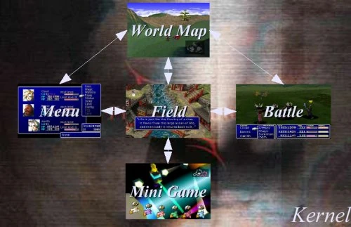

# FF7/Engine basics {#ff7engine_basics}

- [FF7/Engine basics](#ff7engine_basics){#toc-ff7engine_basics}
  - [Parts of the Engine](#parts_of_the_engine){#toc-parts_of_the_engine}
  - [Generic Program Flow](#generic_program_flow){#toc-generic_program_flow}

## Parts of the Engine {#parts_of_the_engine}

The engine used to power Final Fantasy 7 is split into several modules. This allowed the programming team to break apart into very distinct groups. It also created a very diverse game playing environment. It also allowed the artists to only have to work within their own module, keeping the artwork as dynamic as possible.

The module system allowed for a single point of entry into, and exit out of, each distinct part of the game. The PSX, which the game was originally developed for, had very limited resources. With only 1 megabyte of video ram and 2 megabytes of system ram, data had to be banked in and out efficiently. Modules were a clean way to dump whole parts of the engine to make way for other parts.

The core system is made up of six modules. They are called the kernel, field, menu, world map, battle, and mini game. They are arranged in the following order.\

\

## Generic Program Flow {#generic_program_flow}

Not every module is accessible by every other module. There is a distinct flow between them. For example, you can not access the menu from battle, much to the chagrin of the poor user who had forgotten to equip some last minute item. The field module, second only to the kernel, drives the game. It includes a powerful scripting system that can call any module within the game.

---

## Images

