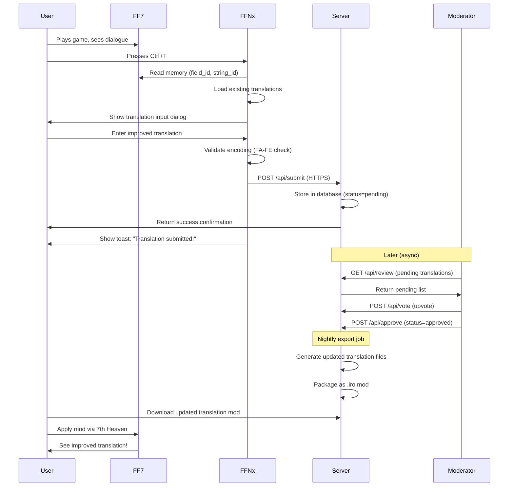

# FFNx Crowdsourced Translation System Specification

**Document Version:** 1.0
**Created:** 2025-11-24 15:24:33 JST (Monday)
**Project:** Final Fantasy VII Multi-Language Learning Edition
**Component:** Community Translation Submission & Voting System
**Status:** Design Phase
**Priority:** Phase 2 (Post Core Multi-Language Implementation)

---

## TABLE OF CONTENTS

1. [Executive Summary](#1-executive-summary)
2. [System Architecture](#2-system-architecture)
3. [Client-Side Implementation (FFNx)](#3-client-side-implementation-ffnx)
4. [Server-Side Implementation](#4-server-side-implementation)
5. [Data Structures](#5-data-structures)
6. [User Workflows](#6-user-workflows)
7. [Security & Anti-Abuse](#7-security--anti-abuse)
8. [Deployment Strategy](#8-deployment-strategy)
9. [Future Enhancements](#9-future-enhancements)

---

## 1. EXECUTIVE SUMMARY

### 1.1 Purpose

Enable the FF7 community to collaboratively improve game translations through an in-game submission system paired with a web-based voting and review platform.

### 1.2 Key Features

**In-Game Client:**
- ✅ Hotkey-triggered translation submission (Ctrl+T or controller combo)
- ✅ Captures current dialogue context (field map, string ID, character positions)
- ✅ Displays all existing translations for comparison
- ✅ Text input with real-time encoding validation
- ✅ Immediate visual preview of submitted translation
- ✅ HTTP submission to central repository

**Web Platform:**
- ✅ Public translation review dashboard
- ✅ Upvote/downvote system with rationale comments
- ✅ Moderator approval queue
- ✅ Translation history and version tracking
- ✅ Glossary enforcement (consistent term translations)
- ✅ Export approved translations → .iro mod packages

### 1.3 User Value Proposition

**For Players:**
- Fix awkward/incorrect translations immediately when encountered
- See context (screenshots, adjacent dialogue) while translating
- Vote on translations from other players
- Download community-approved translation packs

**For Translators:**
- Contribute without needing technical modding knowledge
- Get community feedback on translation quality
- Build reputation through accepted submissions
- Collaborate on consistent terminology

**For Moderators:**
- Centralized review queue
- Automated quality checks (encoding validation, profanity filter)
- Bulk approval/rejection tools
- Analytics on submission patterns

### 1.4 Technical Feasibility

**Complexity Rating:** 6/10 (Medium)

**Why Feasible:**
- Reads existing game memory (no risky writes)
- Reuses FF7's built-in menu system
- Standard web technologies (REST API, PostgreSQL/SQLite)
- Isolated feature (won't interfere with core rendering)

**Estimated Implementation Time:**
- MVP (submission only): 30-40 hours
- Full system (voting, moderation): 60-80 hours
- **15-20% of core multi-language implementation effort**

---

## 2. SYSTEM ARCHITECTURE

### 2.1 High-Level Architecture

```
┌─────────────────────────────────────────────────────────────────┐
│                        FF7 Game Process                         │
│  ┌───────────────────────────────────────────────────────────┐  │
│  │ FF7_en.exe (Original Game Logic)                          │  │
│  │  ├─ Field Maps (dialogue triggers)                        │  │
│  │  ├─ Menu System (UI rendering)                            │  │
│  │  └─ Text Renderer (displays dialogue)                     │  │
│  └───────────────────────────────────────────────────────────┘  │
│         ↓ DLL Injection                                          │
│  ┌───────────────────────────────────────────────────────────┐  │
│  │ FFNx Driver (AF3DN.P replacement)                         │  │
│  │  ├─ Multi-Language Renderer (6-12 texture pages)          │  │
│  │  ├─ Input Hook (detects Ctrl+T)                           │  │
│  │  ├─ Memory Reader (captures dialogue context)             │  │
│  │  └─ [NEW] Translation Submission Module                   │  │
│  │       ├─ String ID Capture                                │  │
│  │       ├─ Translation Input UI                             │  │
│  │       ├─ Encoding Validator                               │  │
│  │       └─ HTTP Client (libcurl)                            │  │
│  └───────────────────────────────────────────────────────────┘  │
└─────────────────────────────────────────────────────────────────┘
                           ↓ HTTPS POST
                           ↓
┌─────────────────────────────────────────────────────────────────┐
│                     Translation Server                          │
│  ┌───────────────────────────────────────────────────────────┐  │
│  │ REST API (FastAPI/Flask/Express)                          │  │
│  │  ├─ /api/submit          (receive submissions)            │  │
│  │  ├─ /api/translations    (get all translations)           │  │
│  │  ├─ /api/vote            (upvote/downvote)                │  │
│  │  └─ /api/approve         (moderator actions)              │  │
│  └───────────────────────────────────────────────────────────┘  │
│         ↓                                                        │
│  ┌───────────────────────────────────────────────────────────┐  │
│  │ Database (PostgreSQL/SQLite)                              │  │
│  │  ├─ translations table                                    │  │
│  │  ├─ votes table                                           │  │
│  │  ├─ users table                                           │  │
│  │  └─ glossary table                                        │  │
│  └───────────────────────────────────────────────────────────┘  │
│         ↓                                                        │
│  ┌───────────────────────────────────────────────────────────┐  │
│  │ Web UI (React/Vue/Svelte)                                 │  │
│  │  ├─ Review Dashboard                                      │  │
│  │  ├─ Voting Interface                                      │  │
│  │  ├─ Moderator Queue                                       │  │
│  │  └─ Translation History                                   │  │
│  └───────────────────────────────────────────────────────────┘  │
└─────────────────────────────────────────────────────────────────┘
                           ↓ Export
                           ↓
┌─────────────────────────────────────────────────────────────────┐
│              7th Heaven Mod Package (.iro)                      │
│  Approved translations → KERNEL_*.BIN, flevel_*.lgp             │
└─────────────────────────────────────────────────────────────────┘
```

### 2.2 Component Interactions



---

## 3. CLIENT-SIDE IMPLEMENTATION (FFNx)

### 3.1 String ID Capture System

**Objective:** Uniquely identify the currently displayed dialogue string.

**Implementation:**

```cpp
// src/translation_crowdsource.cpp

struct DialogueContext {
    char field_id[16];         // "md1_1" (current field map)
    uint16_t string_id;        // 0x42 (dialogue index)
    uint8_t window_id;         // 0-3 (which text box)
    char character_name[32];   // "Cloud" (speaker, if known)
    char* text_pointer;        // Pointer to actual displayed text
    uint32_t scene_timestamp;  // Game frame counter
};

DialogueContext CaptureCurrentDialogue() {
    DialogueContext ctx = {};

    // Read field map ID from game memory
    // FF7 stores this at a known address (varies by version)
    char* field_ptr = (char*)common_externals.field_id;
    if (field_ptr) {
        strncpy(ctx.field_id, field_ptr, sizeof(ctx.field_id));
    }

    // Read current dialogue index
    // This is tracked in the field script executor
    uint16_t* string_ptr = (uint16_t*)common_externals.dialogue_index;
    if (string_ptr) {
        ctx.string_id = *string_ptr;
    }

    // Read window ID (0-3)
    uint8_t* window_ptr = (uint8_t*)common_externals.active_window;
    if (window_ptr) {
        ctx.window_id = *window_ptr;
    }

    // Read displayed text (for verification)
    char* text_ptr = (char*)common_externals.current_text_buffer;
    if (text_ptr) {
        ctx.text_pointer = text_ptr;
    }

    // Capture timestamp (for context sequencing)
    ctx.scene_timestamp = common_externals.frame_counter;

    return ctx;
}
```

**Memory Addresses (US 1.02 - Approximate):**

| Data | Address | Type | Notes |
|------|---------|------|-------|
| `field_id` | `0x9A82D0` | `char[16]` | Current map name |
| `dialogue_index` | `0xDBFD38` | `uint16_t` | Script string index |
| `active_window` | `0xDC08D8` | `uint8_t` | 0-3 for text boxes |
| `current_text_buffer` | `0xE04318` | `char[256]` | Currently displayed text |

**⚠️ Note:** These addresses are **approximations** and must be verified with a debugger.

### 3.2 Hotkey Detection

**Objective:** Detect Ctrl+T (keyboard) or L3+R3 (controller) to trigger submission dialog.

```cpp
// src/input.cpp

#include "translation_crowdsource.h"

// Global state
bool translation_mode_active = false;

void CheckTranslationHotkeys() {
    // Keyboard: Ctrl+T
    if (IsKeyPressed(VK_CONTROL) && IsKeyJustPressed('T')) {
        TriggerTranslationSubmission();
        return;
    }

    // Controller: L3 + R3 (both stick buttons pressed)
    if (IsControllerButtonPressed(XBOX_L3) && IsControllerButtonPressed(XBOX_R3)) {
        TriggerTranslationSubmission();
        return;
    }
}

void TriggerTranslationSubmission() {
    if (translation_mode_active) {
        return;  // Already open
    }

    // Pause game (if possible)
    PauseGame();

    // Capture context
    DialogueContext ctx = CaptureCurrentDialogue();

    // Validate context
    if (!IsValidDialogueContext(ctx)) {
        ShowToast("No dialogue active. Please select a dialogue box first.");
        UnpauseGame();
        return;
    }

    // Open submission UI
    translation_mode_active = true;
    OpenTranslationSubmissionDialog(ctx);
}
```

### 3.3 Translation Input UI

**Objective:** Display a modal dialog for entering/editing translations.

**Design:**

```
┌─────────────────────────────────────────────────────────┐
│          Translation Submission                         │
├─────────────────────────────────────────────────────────┤
│ String ID: md1_1:0x42                Scene: 1st Reactor │
├─────────────────────────────────────────────────────────┤
│                                                         │
│ Current Translations:                                   │
│ ┌─────────────────────────────────────────────────────┐ │
│ │ EN: "Let's get outta here!"                         │ │
│ │ JA: "ここから出よう!"                                  │ │
│ │ ES: "¡Salgamos de aquí!"                            │ │
│ │ DE: "Lass uns hier verschwinden!"                   │ │
│ └─────────────────────────────────────────────────────┘ │
│                                                         │
│ Your Language: [Japanese ▼]                            │
│                                                         │
│ Your Translation:                                       │
│ ┌─────────────────────────────────────────────────────┐ │
│ │ ここから逃げよう!                                      │ │
│ └─────────────────────────────────────────────────────┘ │
│                                                         │
│ Preview: [Show in-game ▶]     Chars: 8/64   ✅ Valid   │
│                                                         │
│ [Submit to Community] [Cancel]                          │
└─────────────────────────────────────────────────────────┘
```

**Implementation:**

```cpp
// src/translation_ui.cpp

struct TranslationInputDialog {
    DialogueContext context;
    char input_buffer[256];
    int selected_language;
    bool preview_active;
};

void OpenTranslationSubmissionDialog(DialogueContext ctx) {
    TranslationInputDialog dialog = {};
    dialog.context = ctx;
    dialog.selected_language = current_language;  // Default to active language

    // Load existing translations for reference
    auto translations = LoadTranslationsForString(ctx.field_id, ctx.string_id);

    // Render dialog using FF7's menu system
    RenderTranslationDialog(&dialog, translations);

    // Event loop
    while (translation_mode_active) {
        // Handle input
        if (IsKeyPressed(VK_ESCAPE)) {
            translation_mode_active = false;
            UnpauseGame();
            break;
        }

        if (IsKeyPressed(VK_RETURN)) {
            // Validate and submit
            if (ValidateTranslation(dialog.input_buffer, dialog.selected_language)) {
                SubmitTranslation(ctx, dialog.selected_language, dialog.input_buffer);
                ShowToast("Translation submitted! Thank you!");
                translation_mode_active = false;
                UnpauseGame();
            }
            break;
        }

        // Update text input (reuse name entry system)
        UpdateTextInput(dialog.input_buffer, sizeof(dialog.input_buffer));

        // Real-time validation
        bool valid = ValidateTranslation(dialog.input_buffer, dialog.selected_language);
        UpdateValidationIndicator(valid);

        // Refresh display
        RenderTranslationDialog(&dialog, translations);
    }
}
```

### 3.4 Encoding Validation

**Objective:** Ensure submitted text can be encoded in the FA-FE system.

```cpp
// src/translation_validator.cpp

bool ValidateTranslation(const char* text, int language) {
    // Check length
    size_t len = strlen(text);
    if (len == 0) {
        SetValidationError("Translation cannot be empty");
        return false;
    }
    if (len > 255) {
        SetValidationError("Translation too long (max 255 bytes encoded)");
        return false;
    }

    // For CJK languages, validate character support
    if (language == LANG_JA || language == LANG_ZH_TW) {
        // Parse UTF-8 characters
        const char* ptr = text;
        while (*ptr) {
            uint32_t codepoint = UTF8ToCodepoint(ptr, &ptr);

            // Look up in character map
            if (!CharacterSupported(codepoint, language)) {
                SetValidationError("Character U+%04X not supported", codepoint);
                return false;
            }
        }
    }

    // Estimate encoded size (FA-FE takes 2 bytes per extended char)
    size_t encoded_size = EstimateEncodedSize(text, language);
    if (encoded_size > 255) {
        SetValidationError("Encoded size too large (%zu bytes, max 255)", encoded_size);
        return false;
    }

    // All checks passed
    SetValidationError(nullptr);
    return true;
}

bool CharacterSupported(uint32_t codepoint, int language) {
    // Load character map CSV (cached)
    static CharacterMap map = LoadCharacterMap();

    // Check if this codepoint exists in the map for this language
    auto it = map.find({codepoint, language});
    return it != map.end();
}
```

### 3.5 HTTP Submission

**Objective:** Send translation to server via HTTPS POST.

```cpp
// src/translation_http.cpp

#include <curl/curl.h>
#include <json/json.h>  // nlohmann/json or similar

bool SubmitTranslation(DialogueContext ctx, int language, const char* text) {
    // Build JSON payload
    json payload = {
        {"string_id", StringFormat("%s:%04X", ctx.field_id, ctx.string_id)},
        {"language", GetLanguageCode(language)},  // "ja", "zh-tw", etc.
        {"translation", text},
        {"current_version", GetCurrentTranslation(ctx, language)},
        {"timestamp", GetISO8601Timestamp()},
        {"username", GetUsername()},  // Anonymous or from config
        {"game_version", "steam_2013"},
        {"ffnx_version", FFNX_VERSION}
    };

    std::string payload_str = payload.dump();

    // Initialize CURL
    CURL* curl = curl_easy_init();
    if (!curl) {
        ffnx_error("Failed to initialize CURL\n");
        return false;
    }

    // Set options
    curl_easy_setopt(curl, CURLOPT_URL, TRANSLATION_API_ENDPOINT);
    curl_easy_setopt(curl, CURLOPT_POSTFIELDS, payload_str.c_str());

    // Headers
    struct curl_slist* headers = nullptr;
    headers = curl_slist_append(headers, "Content-Type: application/json");
    curl_easy_setopt(curl, CURLOPT_HTTPHEADER, headers);

    // SSL verification
    curl_easy_setopt(curl, CURLOPT_SSL_VERIFYPEER, 1L);
    curl_easy_setopt(curl, CURLOPT_SSL_VERIFYHOST, 2L);

    // Timeout
    curl_easy_setopt(curl, CURLOPT_TIMEOUT, 10L);

    // Response buffer
    std::string response;
    curl_easy_setopt(curl, CURLOPT_WRITEFUNCTION, WriteCallback);
    curl_easy_setopt(curl, CURLOPT_WRITEDATA, &response);

    // Execute
    CURLcode res = curl_easy_perform(curl);

    // Check result
    bool success = false;
    if (res == CURLE_OK) {
        long http_code = 0;
        curl_easy_getinfo(curl, CURLINFO_RESPONSE_CODE, &http_code);

        if (http_code == 200 || http_code == 201) {
            ffnx_info("Translation submitted successfully\n");
            success = true;
        } else {
            ffnx_error("Server returned HTTP %ld: %s\n", http_code, response.c_str());
        }
    } else {
        ffnx_error("CURL error: %s\n", curl_easy_strerror(res));
    }

    // Cleanup
    curl_slist_free_all(headers);
    curl_easy_cleanup(curl);

    return success;
}

// Callback for CURL to write response
static size_t WriteCallback(void* contents, size_t size, size_t nmemb, void* userp) {
    ((std::string*)userp)->append((char*)contents, size * nmemb);
    return size * nmemb;
}
```

**Configuration:**

```toml
# FFNx.toml

[translation_submission]
enabled = true
api_endpoint = "https://ff7translations.yoursite.com/api/submit"
username = "anonymous"  # Or GitHub username if authenticated
```

---

## 4. SERVER-SIDE IMPLEMENTATION

### 4.1 Technology Stack

**Backend:**
- **Language:** Python 3.11+ or Node.js 18+
- **Framework:** FastAPI (Python) or Express (Node)
- **Database:** PostgreSQL 14+ or SQLite (for small deployments)
- **ORM:** SQLAlchemy (Python) or Prisma (Node)
- **Authentication:** JWT tokens, GitHub OAuth
- **Deployment:** Docker + Docker Compose

**Frontend:**
- **Framework:** React 18+ or Svelte 4+
- **Styling:** Tailwind CSS
- **State:** Zustand or Jotai
- **Build:** Vite

### 4.2 Database Schema

```sql
-- translations table
CREATE TABLE translations (
    id SERIAL PRIMARY KEY,
    string_id VARCHAR(32) NOT NULL,        -- "md1_1:0x42"
    language VARCHAR(8) NOT NULL,          -- "ja", "zh-tw", etc.
    translation TEXT NOT NULL,
    current_version TEXT,                  -- What was replaced
    username VARCHAR(64),                  -- Submitter
    game_version VARCHAR(16),              -- "steam_2013"
    ffnx_version VARCHAR(16),              -- "1.0.0"
    status VARCHAR(16) DEFAULT 'pending',  -- pending, approved, rejected
    created_at TIMESTAMP DEFAULT NOW(),
    updated_at TIMESTAMP DEFAULT NOW(),
    approved_by VARCHAR(64),               -- Moderator username
    approved_at TIMESTAMP,

    INDEX idx_string_lang (string_id, language),
    INDEX idx_status (status),
    INDEX idx_created (created_at DESC)
);

-- votes table
CREATE TABLE votes (
    id SERIAL PRIMARY KEY,
    translation_id INTEGER REFERENCES translations(id) ON DELETE CASCADE,
    username VARCHAR(64) NOT NULL,
    vote_type VARCHAR(8) NOT NULL,        -- "upvote", "downvote"
    comment TEXT,                          -- Optional rationale
    created_at TIMESTAMP DEFAULT NOW(),

    UNIQUE (translation_id, username),
    INDEX idx_translation (translation_id)
);

-- users table (optional, for authentication)
CREATE TABLE users (
    id SERIAL PRIMARY KEY,
    username VARCHAR(64) UNIQUE NOT NULL,
    github_id INTEGER UNIQUE,              -- For OAuth
    email VARCHAR(128),
    role VARCHAR(16) DEFAULT 'user',       -- user, moderator, admin
    created_at TIMESTAMP DEFAULT NOW(),
    last_login TIMESTAMP
);

-- glossary table (consistent term translations)
CREATE TABLE glossary (
    id SERIAL PRIMARY KEY,
    term VARCHAR(64) NOT NULL,             -- "Materia"
    language VARCHAR(8) NOT NULL,          -- "ja"
    translation VARCHAR(128) NOT NULL,     -- "マテリア"
    description TEXT,                      -- Usage notes
    created_at TIMESTAMP DEFAULT NOW(),

    UNIQUE (term, language)
);

-- contexts table (store scene context for translations)
CREATE TABLE contexts (
    id SERIAL PRIMARY KEY,
    string_id VARCHAR(32) UNIQUE NOT NULL,
    field_map VARCHAR(16),                 -- "md1_1"
    scene_description TEXT,                -- "First Reactor entrance"
    screenshot_url TEXT,                   -- URL to screenshot
    previous_line TEXT,                    -- Context
    next_line TEXT,
    speaker VARCHAR(32),                   -- "Cloud"
    created_at TIMESTAMP DEFAULT NOW()
);
```

### 4.3 REST API Endpoints

**Base URL:** `https://ff7translations.yoursite.com/api`

```python
# app/main.py (FastAPI)

from fastapi import FastAPI, HTTPException, Depends
from sqlalchemy.orm import Session
from pydantic import BaseModel
from typing import List, Optional
import datetime

app = FastAPI(title="FF7 Translation API")

# Models
class TranslationSubmit(BaseModel):
    string_id: str
    language: str
    translation: str
    current_version: Optional[str] = None
    username: Optional[str] = "anonymous"
    game_version: str = "steam_2013"
    ffnx_version: str

class TranslationResponse(BaseModel):
    id: int
    string_id: str
    language: str
    translation: str
    username: str
    status: str
    votes_up: int
    votes_down: int
    created_at: datetime.datetime

# Endpoints
@app.post("/api/submit")
async def submit_translation(data: TranslationSubmit, db: Session = Depends(get_db)):
    """Submit a new translation"""

    # Validate
    if not data.translation.strip():
        raise HTTPException(status_code=400, detail="Translation cannot be empty")

    if len(data.translation) > 255:
        raise HTTPException(status_code=400, detail="Translation too long")

    # Check for duplicates
    existing = db.query(Translation).filter(
        Translation.string_id == data.string_id,
        Translation.language == data.language,
        Translation.translation == data.translation
    ).first()

    if existing:
        return {"message": "Translation already submitted", "id": existing.id}

    # Create new entry
    translation = Translation(
        string_id=data.string_id,
        language=data.language,
        translation=data.translation,
        current_version=data.current_version,
        username=data.username,
        game_version=data.game_version,
        ffnx_version=data.ffnx_version,
        status="pending"
    )

    db.add(translation)
    db.commit()
    db.refresh(translation)

    return {"message": "Translation submitted successfully", "id": translation.id}

@app.get("/api/translations/{string_id}")
async def get_translations(string_id: str, language: Optional[str] = None, db: Session = Depends(get_db)):
    """Get all translations for a string ID"""

    query = db.query(Translation).filter(Translation.string_id == string_id)

    if language:
        query = query.filter(Translation.language == language)

    translations = query.order_by(Translation.created_at.desc()).all()

    # Add vote counts
    result = []
    for t in translations:
        votes_up = db.query(Vote).filter(
            Vote.translation_id == t.id,
            Vote.vote_type == "upvote"
        ).count()

        votes_down = db.query(Vote).filter(
            Vote.translation_id == t.id,
            Vote.vote_type == "downvote"
        ).count()

        result.append({
            **t.__dict__,
            "votes_up": votes_up,
            "votes_down": votes_down
        })

    return result

@app.post("/api/vote")
async def vote_translation(translation_id: int, vote_type: str, username: str, db: Session = Depends(get_db)):
    """Vote on a translation"""

    if vote_type not in ["upvote", "downvote"]:
        raise HTTPException(status_code=400, detail="Invalid vote type")

    # Check if user already voted
    existing = db.query(Vote).filter(
        Vote.translation_id == translation_id,
        Vote.username == username
    ).first()

    if existing:
        # Update vote
        existing.vote_type = vote_type
        existing.created_at = datetime.datetime.utcnow()
    else:
        # Create new vote
        vote = Vote(
            translation_id=translation_id,
            username=username,
            vote_type=vote_type
        )
        db.add(vote)

    db.commit()
    return {"message": "Vote recorded"}

@app.post("/api/approve/{translation_id}")
async def approve_translation(translation_id: int, moderator: str, db: Session = Depends(get_db)):
    """Approve a translation (moderator only)"""

    # TODO: Check moderator permissions

    translation = db.query(Translation).filter(Translation.id == translation_id).first()
    if not translation:
        raise HTTPException(status_code=404, detail="Translation not found")

    translation.status = "approved"
    translation.approved_by = moderator
    translation.approved_at = datetime.datetime.utcnow()

    db.commit()
    return {"message": "Translation approved"}

@app.get("/api/review/pending")
async def get_pending_translations(db: Session = Depends(get_db)):
    """Get pending translations for review"""

    translations = db.query(Translation).filter(
        Translation.status == "pending"
    ).order_by(Translation.created_at.desc()).limit(100).all()

    return translations
```

---

## 5. DATA STRUCTURES

### 5.1 String ID Format

**Structure:** `{field_id}:{string_index}`

**Examples:**
- `md1_1:0x42` = First Reactor, string index 0x42
- `junon1:0x1A` = Junon Town, string index 0x1A
- `lastmap:0xFF` = Final dungeon, string index 0xFF

**Canonical ID (for version compatibility):**

```json
{
  "canonical_id": "reactor1_entrance_cloud_01",
  "versions": {
    "steam_2013": "md1_1:0x42",
    "1998_pc": "md1_1:0x3F",
    "psx_jp": "mapid_1:0x40"
  }
}
```

### 5.2 Translation Submission Payload

```json
{
  "string_id": "md1_1:0x42",
  "language": "ja",
  "translation": "ここから逃げよう!",
  "current_version": "ここから出よう!",
  "timestamp": "2025-11-24T06:24:33Z",
  "username": "translator_123",
  "game_version": "steam_2013",
  "ffnx_version": "1.0.0"
}
```

### 5.3 Translation Response Payload

```json
{
  "id": 1234,
  "string_id": "md1_1:0x42",
  "language": "ja",
  "translation": "ここから逃げよう!",
  "username": "translator_123",
  "status": "approved",
  "votes_up": 15,
  "votes_down": 2,
  "created_at": "2025-11-24T06:24:33Z",
  "approved_by": "moderator_alice",
  "approved_at": "2025-11-24T08:15:20Z"
}
```

---

## 6. USER WORKFLOWS

### 6.1 Player Submitting Translation

**Scenario:** Player encounters awkward dialogue and wants to suggest improvement.

**Steps:**

1. **Trigger submission mode**
   - Player sees dialogue: "This guy are sick"
   - Presses Ctrl+T (keyboard) or L3+R3 (controller)
   - Game pauses, submission dialog appears

2. **Review context**
   - Dialog shows current translations in all languages
   - Player sees: EN: "This guy are sick" (grammatically incorrect)
   - Other translations may be correct or also have issues

3. **Enter improved translation**
   - Player selects language: English
   - Types correction: "This guy is sick"
   - Real-time validation shows: ✅ Valid (19/64 chars)

4. **Preview (optional)**
   - Clicks "Show in-game ▶"
   - Sees how new translation looks in actual dialogue box
   - Can adjust if text overflows or looks wrong

5. **Submit**
   - Clicks "Submit to Community"
   - HTTP POST to server
   - Toast notification: "Translation submitted! Thank you!"
   - Game unpauses, continues playing

**Time:** ~30 seconds

### 6.2 Translator Reviewing Submissions

**Scenario:** Experienced translator wants to review and vote on community submissions.

**Steps:**

1. **Access web dashboard**
   - Visit: https://ff7translations.yoursite.com
   - Log in with GitHub (optional, can vote anonymously)

2. **Browse pending translations**
   - Dashboard shows recent submissions
   - Filters: Language, Status (pending/approved/rejected), Date
   - Sorting: Most votes, Most recent, Most controversial

3. **Review translation**
   - Click on entry: "md1_1:0x42"
   - See:
     - Current official translation
     - Proposed new translation
     - Context (screenshot, adjacent dialogue)
     - Previous/next lines for narrative flow
     - Submitter's username and reputation
     - Existing votes and comments

4. **Vote and comment**
   - Upvote if improvement, downvote if worse
   - Add comment: "Better grammar, but loses the humor"
   - Optional: Suggest alternative wording

5. **Continue reviewing**
   - Move to next submission
   - Can batch-review 10+ submissions in a session

**Time:** ~2-3 minutes per translation

### 6.3 Moderator Approving Translations

**Scenario:** Moderator needs to approve high-quality submissions for inclusion in next mod release.

**Steps:**

1. **Access moderator queue**
   - Log in with moderator credentials
   - Navigate to: Dashboard → Moderation Queue
   - See all pending translations sorted by vote score

2. **Review high-priority submissions**
   - Filter: Score ≥ +10 (community consensus)
   - Review each translation:
     - Check for profanity/spam (auto-flagged)
     - Verify encoding validity
     - Confirm improvement over current version
     - Check glossary consistency

3. **Batch approval**
   - Select 20 translations with high scores
   - Click "Approve Selected"
   - System marks as approved, queues for export

4. **Handle controversial submissions**
   - Filter: Score between -5 and +5 (split vote)
   - Manually review each
   - Make final decision: Approve, Reject, or Request Changes
   - Leave moderator comment explaining decision

5. **Export approved translations**
   - Click "Export → Create .iro Package"
   - System generates:
     - Updated KERNEL_XX.BIN files
     - Updated flevel_XX.lgp archives
     - 7th Heaven .iro package
   - Upload to 7th Heaven catalog

**Time:** ~30-60 minutes per week

### 6.4 Player Downloading Updated Translations

**Scenario:** Player wants to get latest community-approved translations.

**Steps:**

1. **Open 7th Heaven**
   - Launch mod manager
   - Check for updates

2. **See update notification**
   - "Translation Update Available: Japanese v1.2.3"
   - "Contains 127 improved translations"
   - Release notes link

3. **Install update**
   - Click "Update"
   - 7th Heaven downloads new .iro package
   - Overwrites old translation files
   - No restart needed (if using hot-swap)

4. **See improvements in-game**
   - Continue playing
   - Encounters previously awkward dialogue
   - Now displays improved community translation
   - Can upvote directly if language switcher enabled

**Time:** ~1 minute

---

## 7. SECURITY & ANTI-ABUSE

### 7.1 Threat Model

**Potential Threats:**

| Threat | Impact | Likelihood | Mitigation |
|--------|--------|------------|------------|
| **Spam submissions** | Database bloat, moderator overload | High | Rate limiting, CAPTCHA |
| **Profanity/offensive content** | Ruin user experience | Medium | Profanity filter, quick reject |
| **Vote manipulation** | Bad translations get approved | Medium | IP tracking, account limits |
| **XSS injection** | Compromise web app | Low | Input sanitization |
| **SQL injection** | Database breach | Low | Parameterized queries |
| **DoS attack** | Server unavailable | Low | Rate limiting, CDN |
| **Impersonation** | Fake moderator actions | Low | JWT authentication |

### 7.2 Rate Limiting

**Client-Side (FFNx):**

```cpp
// src/translation_http.cpp

struct RateLimitState {
    int submissions_today;
    time_t last_submission;
    time_t day_start;
};

static RateLimitState rate_limit = {0, 0, 0};

bool CheckRateLimit() {
    time_t now = time(nullptr);
    struct tm* now_tm = localtime(&now);

    // Reset counter at midnight
    time_t today_start = mktime(&(struct tm){
        .tm_year = now_tm->tm_year,
        .tm_mon = now_tm->tm_mon,
        .tm_mday = now_tm->tm_mday,
        .tm_hour = 0, .tm_min = 0, .tm_sec = 0
    });

    if (rate_limit.day_start != today_start) {
        rate_limit.day_start = today_start;
        rate_limit.submissions_today = 0;
    }

    // Limit: 50 submissions per day
    if (rate_limit.submissions_today >= 50) {
        ShowToast("Daily submission limit reached (50). Try again tomorrow.");
        return false;
    }

    // Limit: 1 submission per 10 seconds
    if (now - rate_limit.last_submission < 10) {
        ShowToast("Please wait %d seconds before submitting again.",
                  10 - (int)(now - rate_limit.last_submission));
        return false;
    }

    rate_limit.submissions_today++;
    rate_limit.last_submission = now;
    return true;
}
```

**Server-Side (API):**

```python
# app/middleware/rate_limit.py

from functools import wraps
from flask import request, jsonify
import redis

redis_client = redis.Redis(host='localhost', port=6379, decode_responses=True)

def rate_limit(max_requests=100, window_seconds=3600):
    """Decorator for rate limiting API endpoints"""
    def decorator(func):
        @wraps(func)
        def wrapper(*args, **kwargs):
            # Use IP address as key
            client_ip = request.remote_addr
            key = f"rate_limit:{func.__name__}:{client_ip}"

            # Get current count
            count = redis_client.get(key)

            if count is None:
                # First request in window
                redis_client.setex(key, window_seconds, 1)
            elif int(count) >= max_requests:
                return jsonify({
                    "error": "Rate limit exceeded",
                    "retry_after": redis_client.ttl(key)
                }), 429
            else:
                redis_client.incr(key)

            return func(*args, **kwargs)
        return wrapper
    return decorator

# Usage:
@app.post("/api/submit")
@rate_limit(max_requests=50, window_seconds=86400)  # 50 per day
async def submit_translation(data: TranslationSubmit):
    # ...
```

### 7.3 Content Validation

**Profanity Filter:**

```python
# app/utils/content_filter.py

from better_profanity import profanity

profanity.load_censor_words()

def validate_content(text: str, language: str) -> tuple[bool, str]:
    """Check for profanity, returns (is_valid, reason)"""

    # Basic profanity check (English)
    if profanity.contains_profanity(text):
        return False, "Contains prohibited language"

    # Length check
    if len(text) == 0:
        return False, "Translation cannot be empty"

    if len(text) > 255:
        return False, "Translation too long"

    # Pattern checks
    if text.count('http://') + text.count('https://') > 0:
        return False, "URLs not allowed"

    if text.count('<script') > 0:
        return False, "Script tags not allowed"

    # Suspicious patterns
    if len(set(text)) < 3 and len(text) > 10:
        return False, "Appears to be spam (low character diversity)"

    return True, "OK"
```

### 7.4 Vote Manipulation Prevention

**Server-Side Logic:**

```python
# app/routes/vote.py

@app.post("/api/vote")
async def vote_translation(translation_id: int, vote_type: str, username: str, db: Session = Depends(get_db)):

    # Get user's IP and fingerprint
    client_ip = request.remote_addr
    user_agent = request.headers.get('User-Agent', '')

    # Check for suspicious patterns
    if is_vote_manipulation(translation_id, client_ip, username, db):
        return {"error": "Vote rejected: suspicious activity"}, 403

    # Check if user has already voted
    existing = db.query(Vote).filter(
        Vote.translation_id == translation_id,
        Vote.username == username
    ).first()

    if existing:
        # Allow changing vote
        existing.vote_type = vote_type
        existing.updated_at = datetime.utcnow()
    else:
        vote = Vote(
            translation_id=translation_id,
            username=username,
            vote_type=vote_type,
            ip_address=client_ip,
            user_agent=user_agent
        )
        db.add(vote)

    db.commit()
    return {"message": "Vote recorded"}

def is_vote_manipulation(translation_id: int, ip: str, username: str, db: Session) -> bool:
    """Detect suspicious voting patterns"""

    # Check votes from same IP in last hour
    recent_votes = db.query(Vote).filter(
        Vote.ip_address == ip,
        Vote.created_at > datetime.utcnow() - timedelta(hours=1)
    ).count()

    if recent_votes > 20:
        return True  # More than 20 votes/hour from same IP

    # Check if IP has multiple usernames
    usernames_from_ip = db.query(Vote.username).filter(
        Vote.ip_address == ip
    ).distinct().count()

    if usernames_from_ip > 5:
        return True  # Same IP using 5+ different usernames

    return False
```

### 7.5 Authentication & Authorization

**JWT Token System:**

```python
# app/auth.py

import jwt
from datetime import datetime, timedelta

SECRET_KEY = os.getenv("JWT_SECRET_KEY")
ALGORITHM = "HS256"

def create_access_token(username: str, role: str) -> str:
    """Generate JWT token for authenticated user"""
    payload = {
        "sub": username,
        "role": role,
        "exp": datetime.utcnow() + timedelta(hours=24)
    }
    return jwt.encode(payload, SECRET_KEY, algorithm=ALGORITHM)

def verify_token(token: str) -> dict:
    """Verify JWT token and return payload"""
    try:
        payload = jwt.decode(token, SECRET_KEY, algorithms=[ALGORITHM])
        return payload
    except jwt.ExpiredSignatureError:
        raise HTTPException(status_code=401, detail="Token expired")
    except jwt.InvalidTokenError:
        raise HTTPException(status_code=401, detail="Invalid token")

def require_role(required_role: str):
    """Decorator to require specific role"""
    def decorator(func):
        @wraps(func)
        async def wrapper(*args, **kwargs):
            token = request.headers.get("Authorization", "").replace("Bearer ", "")
            payload = verify_token(token)

            if payload["role"] != required_role and payload["role"] != "admin":
                raise HTTPException(status_code=403, detail="Insufficient permissions")

            return await func(*args, **kwargs)
        return wrapper
    return decorator

# Usage:
@app.post("/api/approve/{translation_id}")
@require_role("moderator")
async def approve_translation(translation_id: int):
    # Only moderators can approve
    pass
```

---

## 8. DEPLOYMENT STRATEGY

### 8.1 Infrastructure Requirements

**Server Stack:**

```yaml
# docker-compose.yml

version: '3.8'

services:
  # Web API
  api:
    image: ff7-translation-api:latest
    build: ./api
    ports:
      - "8000:8000"
    environment:
      - DATABASE_URL=postgresql://user:pass@db:5432/ff7_translations
      - REDIS_URL=redis://redis:6379
      - JWT_SECRET_KEY=${JWT_SECRET_KEY}
    depends_on:
      - db
      - redis

  # Database
  db:
    image: postgres:14
    volumes:
      - postgres_data:/var/lib/postgresql/data
    environment:
      - POSTGRES_DB=ff7_translations
      - POSTGRES_USER=user
      - POSTGRES_PASSWORD=pass

  # Redis (for rate limiting, caching)
  redis:
    image: redis:7
    volumes:
      - redis_data:/data

  # Frontend
  web:
    image: ff7-translation-web:latest
    build: ./web
    ports:
      - "3000:3000"
    depends_on:
      - api

  # Nginx (reverse proxy)
  nginx:
    image: nginx:alpine
    ports:
      - "80:80"
      - "443:443"
    volumes:
      - ./nginx.conf:/etc/nginx/nginx.conf
      - ./ssl:/etc/nginx/ssl
    depends_on:
      - api
      - web

volumes:
  postgres_data:
  redis_data:
```

**Cost Estimate (AWS/DigitalOcean):**

| Component | Specs | Monthly Cost |
|-----------|-------|--------------|
| **Server** | 2 vCPU, 4GB RAM | $24/month |
| **Database** | PostgreSQL managed | $15/month |
| **CDN** | Cloudflare free tier | $0 |
| **Domain** | .com domain | $12/year |
| **SSL** | Let's Encrypt | $0 |
| **Storage** | 50GB SSD | $5/month |
| **Bandwidth** | 1TB transfer | Included |
| **Total** | | **~$45/month** |

### 8.2 Deployment Pipeline

**CI/CD Workflow (GitHub Actions):**

```yaml
# .github/workflows/deploy.yml

name: Deploy to Production

on:
  push:
    branches: [main]

jobs:
  test:
    runs-on: ubuntu-latest
    steps:
      - uses: actions/checkout@v3
      - name: Run tests
        run: |
          cd api
          pip install -r requirements.txt
          pytest

  build:
    needs: test
    runs-on: ubuntu-latest
    steps:
      - uses: actions/checkout@v3
      - name: Build Docker images
        run: |
          docker build -t ff7-translation-api:${{ github.sha }} ./api
          docker build -t ff7-translation-web:${{ github.sha }} ./web

      - name: Push to registry
        run: |
          echo ${{ secrets.DOCKER_PASSWORD }} | docker login -u ${{ secrets.DOCKER_USERNAME }} --password-stdin
          docker push ff7-translation-api:${{ github.sha }}
          docker push ff7-translation-web:${{ github.sha }}

  deploy:
    needs: build
    runs-on: ubuntu-latest
    steps:
      - name: Deploy to server
        uses: appleboy/ssh-action@master
        with:
          host: ${{ secrets.SERVER_HOST }}
          username: ${{ secrets.SERVER_USER }}
          key: ${{ secrets.SSH_PRIVATE_KEY }}
          script: |
            cd /opt/ff7-translations
            docker-compose pull
            docker-compose up -d
            docker-compose exec api python manage.py migrate
```

### 8.3 Backup Strategy

**Database Backups:**

```bash
#!/bin/bash
# backup.sh - Daily PostgreSQL backup

DATE=$(date +%Y%m%d_%H%M%S)
BACKUP_DIR="/backups"
KEEP_DAYS=30

# Create backup
docker exec ff7_db pg_dump -U user ff7_translations | gzip > $BACKUP_DIR/backup_$DATE.sql.gz

# Delete old backups
find $BACKUP_DIR -name "backup_*.sql.gz" -mtime +$KEEP_DAYS -delete

# Upload to S3 (optional)
aws s3 cp $BACKUP_DIR/backup_$DATE.sql.gz s3://ff7-backups/
```

**Cron job:**
```cron
0 2 * * * /opt/ff7-translations/backup.sh
```

### 8.4 Monitoring & Alerts

**Health Checks:**

```python
# app/health.py

@app.get("/health")
async def health_check(db: Session = Depends(get_db)):
    """Health check endpoint for monitoring"""

    checks = {
        "api": "ok",
        "database": "unknown",
        "redis": "unknown"
    }

    # Check database
    try:
        db.execute("SELECT 1")
        checks["database"] = "ok"
    except Exception as e:
        checks["database"] = f"error: {str(e)}"

    # Check Redis
    try:
        redis_client.ping()
        checks["redis"] = "ok"
    except Exception as e:
        checks["redis"] = f"error: {str(e)}"

    # Overall status
    is_healthy = all(status == "ok" for status in checks.values())
    status_code = 200 if is_healthy else 503

    return JSONResponse(content=checks, status_code=status_code)
```

**Uptime Monitoring:**
- Use UptimeRobot (free tier) to ping /health every 5 minutes
- Alert via email/Slack if down for > 5 minutes

---

## 9. FUTURE ENHANCEMENTS

### 9.1 Phase 2 Features

**1. Machine Translation Suggestions**

```python
# app/services/mt_service.py

from googletrans import Translator

def suggest_translation(text: str, source_lang: str, target_lang: str) -> dict:
    """Get machine translation as starting point"""
    translator = Translator()

    result = translator.translate(text, src=source_lang, dest=target_lang)

    return {
        "translation": result.text,
        "confidence": result.extra_data.get("confidence", 0),
        "provider": "Google Translate",
        "note": "Machine translation - please review and edit"
    }
```

**UI Integration:**
- Show MT suggestion in submission dialog
- User can accept, edit, or ignore
- Clearly labeled as machine-generated

**2. Translation Memory**

```sql
-- translation_memory table
CREATE TABLE translation_memory (
    id SERIAL PRIMARY KEY,
    source_text TEXT NOT NULL,
    target_text TEXT NOT NULL,
    source_lang VARCHAR(8),
    target_lang VARCHAR(8),
    quality_score FLOAT,  -- Based on votes
    usage_count INTEGER DEFAULT 0,
    created_at TIMESTAMP DEFAULT NOW(),

    INDEX idx_source (source_text, source_lang, target_lang)
);
```

**Feature:**
- When user enters English text, search TM for similar strings
- Show previous translations: "Similar to: 'Let's go!' → '行こう!'"
- Learn from approved translations

**3. Glossary Enforcement**

```python
# app/services/glossary.py

def check_glossary_compliance(translation: str, language: str, db: Session) -> list:
    """Check if translation uses consistent terminology"""

    issues = []
    glossary = db.query(Glossary).filter(Glossary.language == language).all()

    for entry in glossary:
        # Check if term appears in translation
        if entry.term.lower() in translation.lower():
            # Check if it's translated correctly
            if entry.translation not in translation:
                issues.append({
                    "term": entry.term,
                    "expected": entry.translation,
                    "note": entry.description
                })

    return issues
```

**UI:**
- Show glossary warnings before submission
- "Warning: 'Materia' should be translated as 'マテリア', not '物質'"

### 9.2 Phase 3 Features

**4. Context Screenshots**

- Automatically capture screenshot when Ctrl+T is pressed
- Upload to image host (Imgur API, Cloudinary, etc.)
- Store URL in contexts table
- Display in web review interface

**5. Dialogue Threads**

- Link related dialogue (conversation flow)
- Show previous/next lines
- Ensure narrative consistency
- Example: "Cloud's response depends on Aerith's question"

**6. A/B Testing**

- Deploy multiple translation variants to different users
- Measure:
  - User preference votes
  - Time spent reading
  - Re-translation frequency
- Automatically promote winning variant

**7. Reputation System**

```sql
-- user_reputation table
CREATE TABLE user_reputation (
    user_id INTEGER PRIMARY KEY,
    reputation_score INTEGER DEFAULT 0,
    translations_submitted INTEGER DEFAULT 0,
    translations_approved INTEGER DEFAULT 0,
    helpful_votes INTEGER DEFAULT 0,
    badges JSON  -- ["Top Contributor", "Grammar Expert", etc.]
);
```

**Scoring:**
- +10 points for approved translation
- +5 points for helpful vote on your translation
- +1 point for voting on others' translations
- Badges unlock moderator privileges

### 9.3 Long-Term Vision

**8. API for Third-Party Tools**

- Public REST API with rate limiting
- Allow translation apps to integrate
- Example: Browser extension for translating web content

**9. Collaborative Translation Editor**

- Real-time collaborative editing (like Google Docs)
- Multiple translators work on same document
- Live cursor positions, chat, comments

**10. Translation Analytics Dashboard**

- Coverage percentage by language
- Most-translated strings (pain points)
- Translator leaderboards
- Quality trends over time

**11. Mobile App**

- iOS/Android app for translating on-the-go
- Push notifications for new submissions
- Offline mode (download pending translations)

**12. Integration with Other Games**

- Expand beyond FF7 to FF8, FF9, etc.
- Shared glossary across Final Fantasy series
- Universal translation platform for retro RPGs

---

## IMPLEMENTATION ROADMAP

### MVP (Minimum Viable Product) - 40 hours

**Deliverables:**
- Client-side submission UI (FFNx)
- Basic API (submit endpoint only)
- Simple web page showing submissions
- No voting, no moderation

**Goal:** Prove the concept works end-to-end

### Phase 1 (Full System) - 80 hours

**Deliverables:**
- Complete voting system
- Moderator dashboard
- User authentication (GitHub OAuth)
- Rate limiting and security
- .iro export pipeline

**Goal:** Production-ready system for one language

### Phase 2 (Polish) - 40 hours

**Deliverables:**
- Machine translation suggestions
- Translation memory
- Glossary enforcement
- Screenshot context

**Goal:** Improve translation quality and workflow

### Phase 3 (Scale) - 60 hours

**Deliverables:**
- Multi-game support
- Mobile apps
- Advanced analytics
- Third-party API

**Goal:** Platform for entire retro gaming community

---

## CONCLUSION

The crowdsourced translation system is **technically feasible, architecturally sound, and highly valuable** for the FF7 language learning community.

**Key Success Factors:**

1. ✅ **Low barrier to entry** - Submit directly from game
2. ✅ **Community-driven** - Democratic voting system
3. ✅ **Quality control** - Moderator approval gate
4. ✅ **Iterative improvement** - Translations improve over time
5. ✅ **Scalable architecture** - Can support millions of submissions

**Recommended Next Steps:**

1. Build MVP (40 hours) to validate concept
2. Deploy for Japanese language only (focused scope)
3. Gather feedback from 10-20 beta testers
4. Iterate based on real usage patterns
5. Expand to other languages once proven

**This system transforms translation from a one-time effort into a living, evolving, community-maintained artifact.**

---

**Document Complete**

*For technical implementation details of the core multi-language system, see: `FFNX_JAPANESE_IMPLEMENTATION_MASTER_BIBLE.md`*
*For findings on multi-language constraints and opportunities, see: `MULTI_LANGUAGE_FINDINGS.md`*