# Chinese Traditional FF7 Patch (繁體補丁v1.3) - Technical Analysis

**Created**: 2026-01-07 16:30 JST (Wednesday)
**Last Modified**: 2026-01-07 16:30 JST (Wednesday)
**Version**: 1.0.0
**Author**: John Zealand-Doyle
**Session-ID**: 7393413e-daf6-4f5d-bfc1-8fa9e10094b5

---

## Table of Contents

1. [Executive Summary](#executive-summary)
2. [Contact Information](#contact-information)
3. [System Architecture Overview](#system-architecture-overview)
4. [Runtime Hooking Mechanism](#runtime-hooking-mechanism)
5. [Text Replacement Pipeline](#text-replacement-pipeline)
6. [Data Flow Diagrams](#data-flow-diagrams)
7. [Font Texture System](#font-texture-system)
8. [Comparison: Chinese Patch vs Native FFNx Approach](#comparison-chinese-patch-vs-native-ffnx-approach)
9. [Pros and Cons Analysis](#pros-and-cons-analysis)
10. [Key Insights for Japanese Implementation](#key-insights-for-japanese-implementation)

---

## Executive Summary

The Chinese Traditional patch achieves CJK text rendering through an **external text replacement system** rather than modifying the game engine's text rendering pipeline. This is fundamentally different from the FFNx Japanese PR approach which implements true CJK font rendering.

**Key Discovery**: They bypass the need for engine-level CJK support by:
1. Hooking into the game at runtime with `ali213.dll`
2. Intercepting text loads and substituting translated text
3. Using massive pre-rendered font texture atlases (8.4MB each)
4. Applying memory patches via HEXT to adjust UI spacing

---

## Contact Information

**Author**: ffsaga (Taiwan)

**Known Presence**:
- **YouTube Channel**: <https://www.youtube.com/watch?v=WqLrZOt9JoY>
- **YouTube Playlist**: <https://www.youtube.com/watch?v=YsYVq_E0HB0&list=PLD32Z3oZMD0mY4jETpnHcXIG6-Mv4-EoC>
- **Document Author Metadata**: "ffsaga" appears in all .htm files

**No direct contact information found** (no email, Discord, GitHub, or forum links in the patch files). The YouTube channel would be the best avenue for contact.

---

## System Architecture Overview

This diagram shows the complete architecture of how the Chinese patch integrates with FF7:

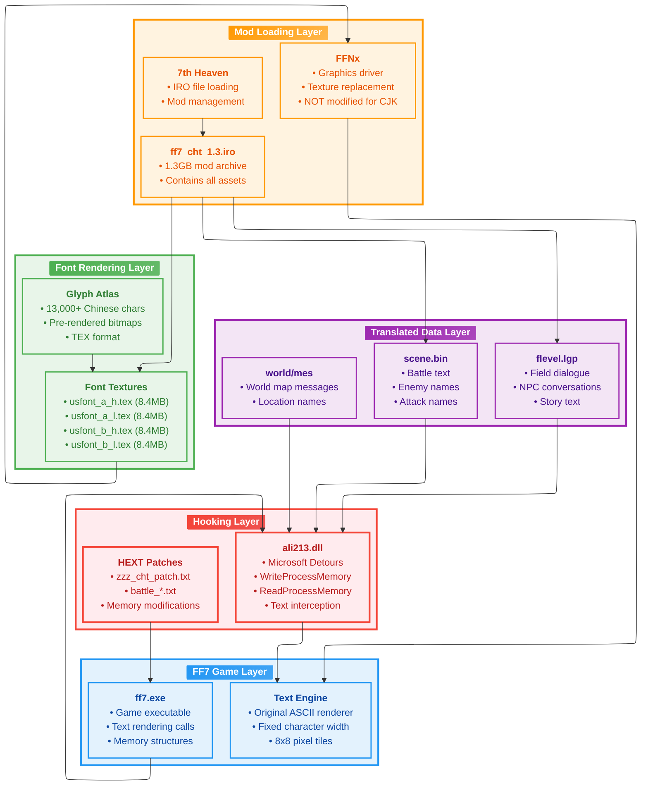

---

## Runtime Hooking Mechanism

This sequence diagram shows how `ali213.dll` intercepts text at runtime:

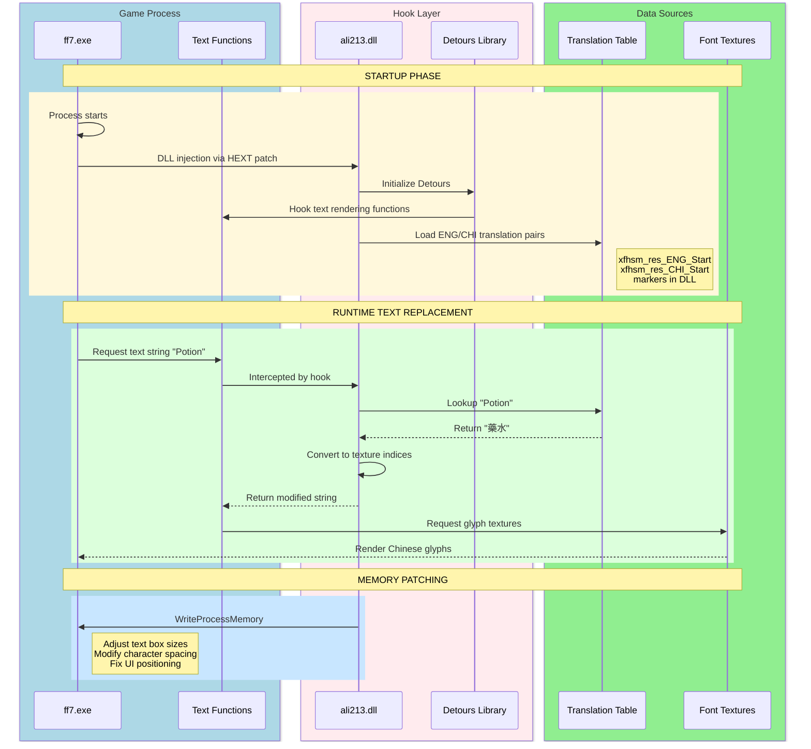

---

## Text Replacement Pipeline

This flowchart details the text replacement process step-by-step:

```mermaid
---
config:
  layout: elk
  flowchart:
    htmlLabels: true
    subGraphTitleMargin:
      top: 10
      bottom: 25
---
flowchart LR
    classDef input fill:#e3f2fd,stroke:#2196f3,stroke-width:2px,color:#0d47a1
    classDef process fill:#fff3e0,stroke:#ff9800,stroke-width:2px,color:#e65100
    classDef decision fill:#f3e5f5,stroke:#9c27b0,stroke-width:2px,color:#4a148c
    classDef output fill:#e8f5e9,stroke:#4caf50,stroke-width:2px,color:#2e7d32
    classDef data fill:#fce4ec,stroke:#e91e63,stroke-width:2px,color:#880e4f

    subgraph Input["`**<span style='background:linear-gradient(135deg, #2196f3, #42a5f5);color:white;padding:5px 10px;border-radius:4px'>Game Request</span>**`"]
        style Input fill:#e3f2fd,stroke:#2196f3,stroke-width:3px
        A["`**Original Text**
English string
from game data`"]:::input
    end

    subgraph Interception["`**<span style='background:linear-gradient(135deg, #ff9800, #ffb74d);color:white;padding:5px 10px;border-radius:4px'>Hook Interception</span>**`"]
        style Interception fill:#fff3e0,stroke:#ff9800,stroke-width:3px
        B["`**ali213.dll**
Catches text call`"]:::process
        C{"`**Lookup**
In translation
table?`"}:::decision
    end

    subgraph Translation["`**<span style='background:linear-gradient(135deg, #9c27b0, #ab47bc);color:white;padding:5px 10px;border-radius:4px'>Translation Mapping</span>**`"]
        style Translation fill:#f3e5f5,stroke:#9c27b0,stroke-width:3px
        D["`**Translation Table**
ENG_Start markers
CHI_Start markers`"]:::data
        E["`**Get Chinese**
Map to CHI text`"]:::process
    end

    subgraph Encoding["`**<span style='background:linear-gradient(135deg, #e91e63, #ec407a);color:white;padding:5px 10px;border-radius:4px'>Character Encoding</span>**`"]
        style Encoding fill:#fce4ec,stroke:#e91e63,stroke-width:3px
        F["`**Big5 Encoding**
Traditional Chinese
character codes`"]:::process
        G["`**Texture Index**
Map to glyph
position in atlas`"]:::process
    end

    subgraph Output["`**<span style='background:linear-gradient(135deg, #4caf50, #66bb6a);color:white;padding:5px 10px;border-radius:4px'>Rendered Output</span>**`"]
        style Output fill:#e8f5e9,stroke:#4caf50,stroke-width:3px
        H["`**Font Texture**
8.4MB pre-rendered
Chinese glyphs`"]:::output
        I["`**Display**
Chinese text
on screen`"]:::output
    end

    J["`**Pass Through**
Original English`"]:::input

    A --> B --> C
    C -->|Yes| D --> E --> F --> G --> H --> I
    C -->|No| J --> I
```

---

## Data Flow Diagrams

### Overall Data Flow Architecture

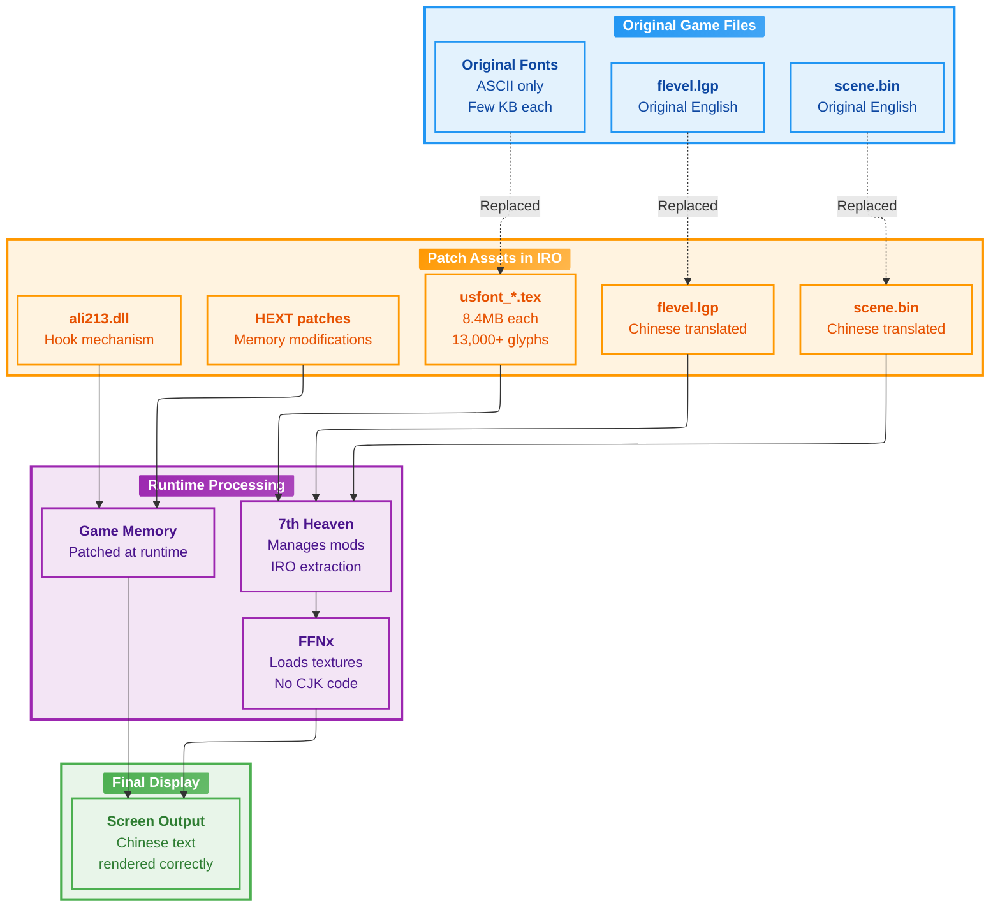

### Memory Patching Details

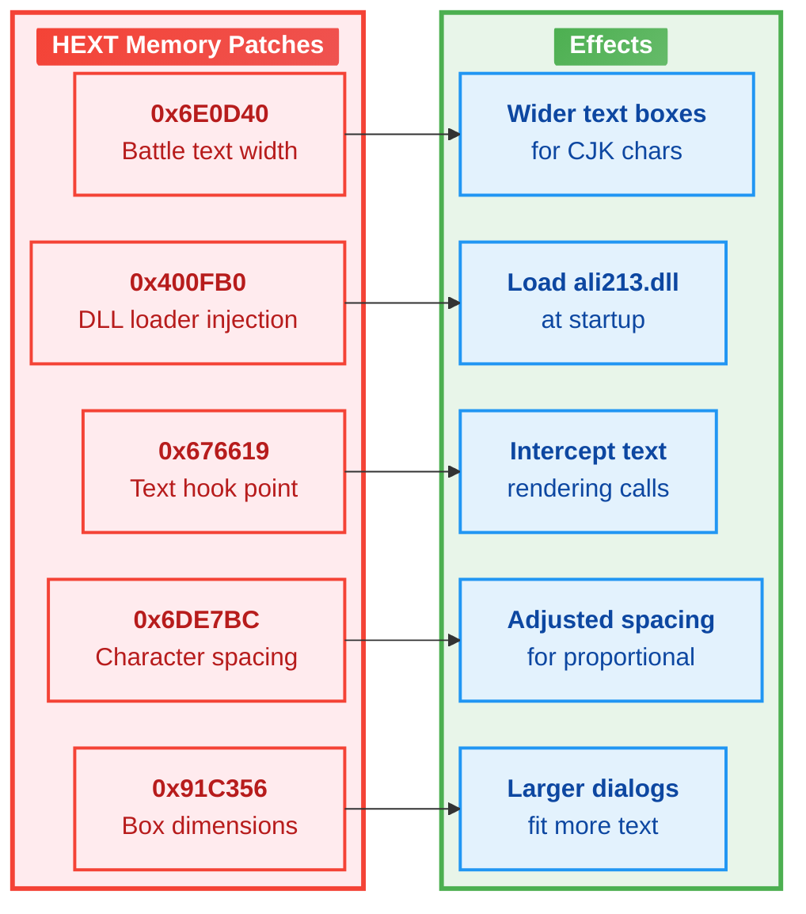

---

## Font Texture System

### Font Texture Structure

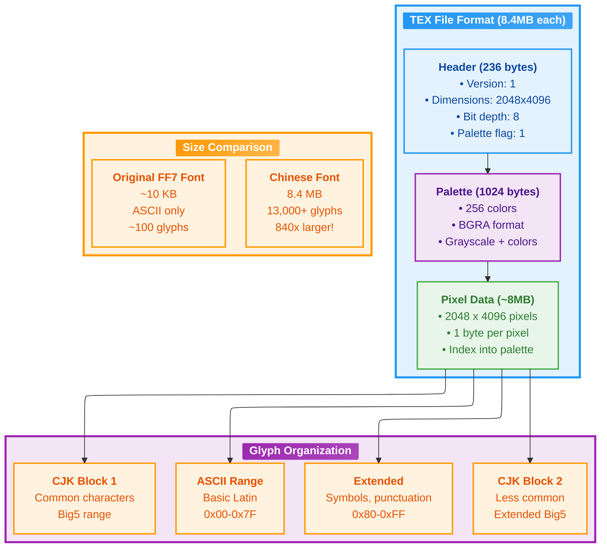

### Font File Variants

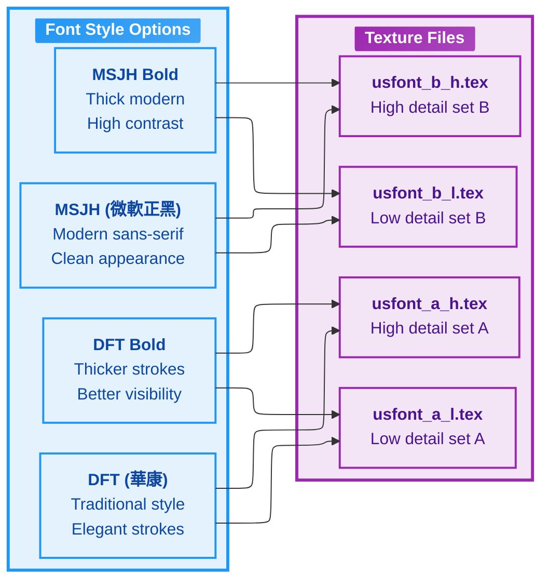

---

## Comparison: Chinese Patch vs Native FFNx Approach

### Architecture Comparison

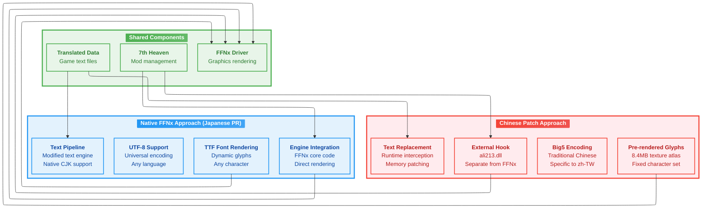

### Feature Comparison Matrix

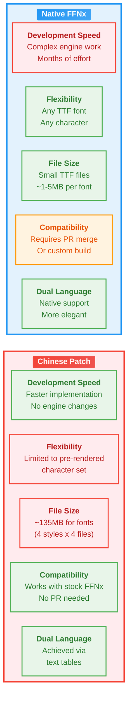

---

## Pros and Cons Analysis

### Chinese Patch Method - Detailed Analysis

```mermaid
---
config:
  layout: elk
  flowchart:
    htmlLabels: true
    subGraphTitleMargin:
      top: 10
      bottom: 25
---
flowchart TB
    classDef pro fill:#e8f5e9,stroke:#4caf50,stroke-width:2px,color:#2e7d32
    classDef con fill:#ffebee,stroke:#f44336,stroke-width:2px,color:#b71c1c
    classDef neutral fill:#fff3e0,stroke:#ff9800,stroke-width:2px,color:#e65100

    subgraph Pros["`**<span style='background:linear-gradient(135deg, #4caf50, #66bb6a);color:white;padding:5px 10px;border-radius:4px'>PROS - Chinese Method</span>**`"]
        style Pros fill:#e8f5e9,stroke:#4caf50,stroke-width:3px

        P1["`**No Engine Modification**
Works with stock FFNx
No PR approval needed`"]:::pro
        P2["`**Faster Development**
Sidesteps complex
font rendering code`"]:::pro
        P3["`**Proven Working**
Released and functional
Dual language achieved`"]:::pro
        P4["`**Isolated Changes**
External DLL approach
Easy to update`"]:::pro
        P5["`**User Control**
Multiple font options
Style selection`"]:::pro
    end

    subgraph Cons["`**<span style='background:linear-gradient(135deg, #f44336, #ef5350);color:white;padding:5px 10px;border-radius:4px'>CONS - Chinese Method</span>**`"]
        style Cons fill:#ffebee,stroke:#f44336,stroke-width:3px

        C1["`**Massive File Size**
135MB+ for fonts
vs ~5MB for TTF`"]:::con
        C2["`**Fixed Character Set**
Cannot add new chars
without new textures`"]:::con
        C3["`**Quality Limitations**
Pre-rendered at fixed
resolution/size`"]:::con
        C4["`**Maintenance Burden**
Separate from FFNx
updates may break`"]:::con
        C5["`**Not Reusable**
Specific to Chinese
new language = new work`"]:::con
    end
```

### Native FFNx Method - Detailed Analysis

```mermaid
---
config:
  layout: elk
  flowchart:
    htmlLabels: true
    subGraphTitleMargin:
      top: 10
      bottom: 25
---
flowchart TB
    classDef pro fill:#e8f5e9,stroke:#4caf50,stroke-width:2px,color:#2e7d32
    classDef con fill:#ffebee,stroke:#f44336,stroke-width:2px,color:#b71c1c
    classDef neutral fill:#fff3e0,stroke:#ff9800,stroke-width:2px,color:#e65100

    subgraph Pros["`**<span style='background:linear-gradient(135deg, #4caf50, #66bb6a);color:white;padding:5px 10px;border-radius:4px'>PROS - Native FFNx</span>**`"]
        style Pros fill:#e8f5e9,stroke:#4caf50,stroke-width:3px

        P1["`**Universal Solution**
Works for any language
Japanese, Korean, etc.`"]:::pro
        P2["`**Small File Size**
Standard TTF fonts
1-5MB each`"]:::pro
        P3["`**Dynamic Rendering**
Any character supported
No pre-generation`"]:::pro
        P4["`**Quality Scaling**
Renders at any size
Resolution independent`"]:::pro
        P5["`**Official Support**
Part of FFNx codebase
Maintained upstream`"]:::pro
        P6["`**Future Proof**
New languages easy
Community benefits`"]:::pro
    end

    subgraph Cons["`**<span style='background:linear-gradient(135deg, #f44336, #ef5350);color:white;padding:5px 10px;border-radius:4px'>CONS - Native FFNx</span>**`"]
        style Cons fill:#ffebee,stroke:#f44336,stroke-width:3px

        C1["`**Development Complexity**
Months of work
Deep engine changes`"]:::con
        C2["`**PR Approval Required**
Merge may be slow
or rejected`"]:::con
        C3["`**Breaking Changes Risk**
Core modifications
affect stability`"]:::con
        C4["`**Testing Burden**
Many edge cases
complex text layouts`"]:::con
    end
```

---

## Key Insights for Japanese Implementation

### What You Can Learn from the Chinese Approach

```mermaid
---
config:
  layout: elk
  flowchart:
    htmlLabels: true
    subGraphTitleMargin:
      top: 10
      bottom: 25
---
flowchart TB
    classDef insight fill:#e3f2fd,stroke:#2196f3,stroke-width:2px,color:#0d47a1
    classDef action fill:#e8f5e9,stroke:#4caf50,stroke-width:2px,color:#2e7d32
    classDef warning fill:#fff3e0,stroke:#ff9800,stroke-width:2px,color:#e65100

    subgraph Insights["`**<span style='background:linear-gradient(135deg, #2196f3, #42a5f5);color:white;padding:5px 10px;border-radius:4px'>Key Technical Insights</span>**`"]
        style Insights fill:#e3f2fd,stroke:#2196f3,stroke-width:3px

        I1["`**HEXT is Powerful**
Memory patches can
adjust UI on-the-fly`"]:::insight
        I2["`**Dual Language Works**
Text tables with markers
ENG/target switching`"]:::insight
        I3["`**Font Textures Scale**
Large atlases work
if properly indexed`"]:::insight
        I4["`**External Hooks Viable**
DLL injection works
without engine changes`"]:::insight
    end

    subgraph YourAdvantages["`**<span style='background:linear-gradient(135deg, #4caf50, #66bb6a);color:white;padding:5px 10px;border-radius:4px'>Your FFNx Approach Advantages</span>**`"]
        style YourAdvantages fill:#e8f5e9,stroke:#4caf50,stroke-width:3px

        A1["`**True Font Rendering**
TTF support means
any character, any size`"]:::action
        A2["`**Smaller Distribution**
Font file vs texture
10x smaller`"]:::action
        A3["`**Better Quality**
Dynamic rendering
crisp at any resolution`"]:::action
        A4["`**Reusable Foundation**
Your work helps
ALL future languages`"]:::action
    end

    subgraph Recommendations["`**<span style='background:linear-gradient(135deg, #ff9800, #ffb74d);color:white;padding:5px 10px;border-radius:4px'>Recommendations</span>**`"]
        style Recommendations fill:#fff3e0,stroke:#ff9800,stroke-width:3px

        R1["`**Contact ffsaga**
Via YouTube
Share knowledge`"]:::warning
        R2["`**Study HEXT patches**
UI spacing values
May be reusable`"]:::warning
        R3["`**Dual language design**
Their marker system
is elegant`"]:::warning
        R4["`**Continue FFNx work**
Superior long-term
Worth the effort`"]:::warning
    end

    I1 --> R2
    I2 --> R3
    I3 --> A1
    I4 --> A4
```

### Strategic Decision Matrix

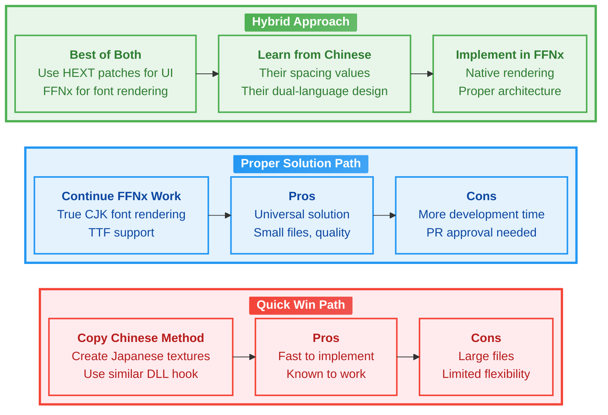

---

## Summary

The Chinese patch represents an **ingenious workaround** that achieves CJK text display without modifying FFNx's core rendering engine. While impressive in its results, it's fundamentally a **baked solution** using pre-rendered textures and runtime memory patching.

Your FFNx work, while more complex, provides a **proper solution** that will:
- Support any language with a TTF font
- Scale to any resolution
- Require minimal distribution size
- Benefit the entire FF7 modding community

**Recommendation**: Continue your FFNx native implementation, but study the Chinese patch for:
1. HEXT UI spacing values (directly reusable)
2. Dual-language switching mechanism (design inspiration)
3. Proof that the community wants this feature

Contact ffsaga via YouTube to potentially collaborate or share insights.

---

*Document generated from analysis of 繁體補丁v1.3 patch files*
