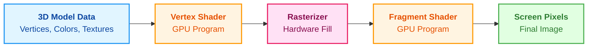
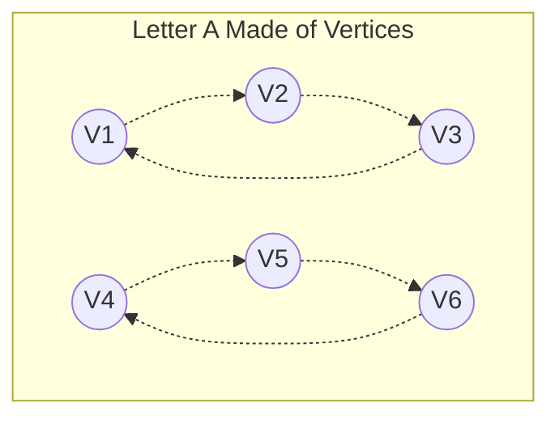
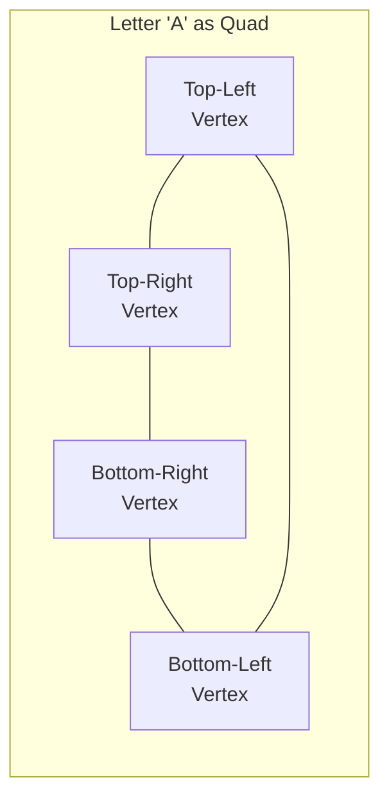
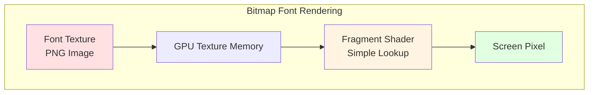
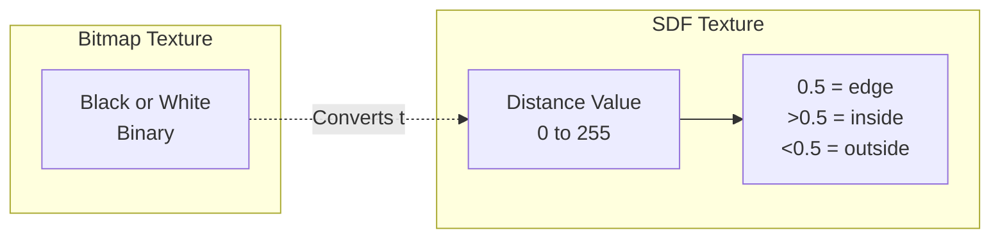
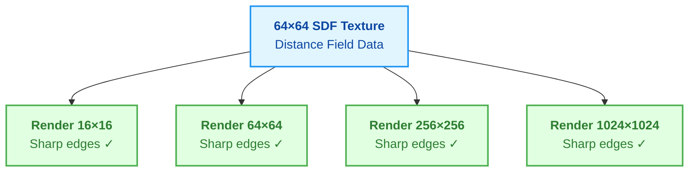
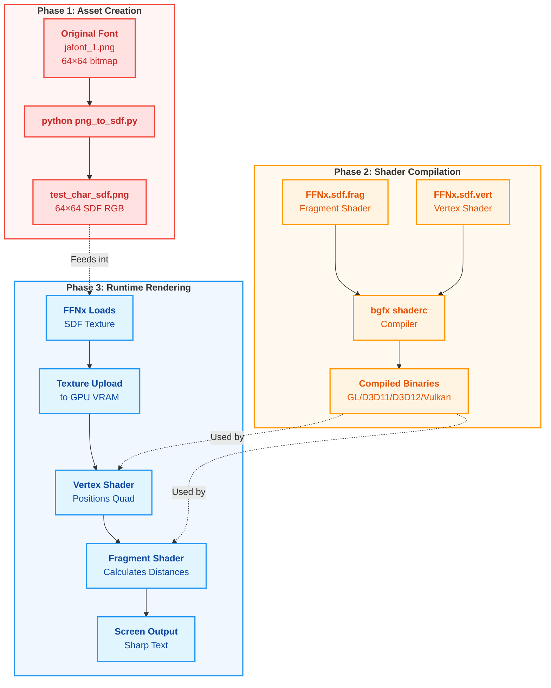
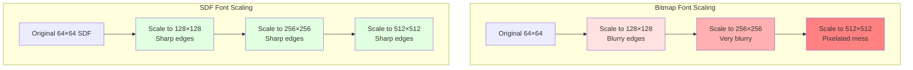
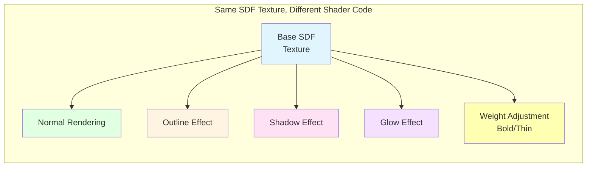
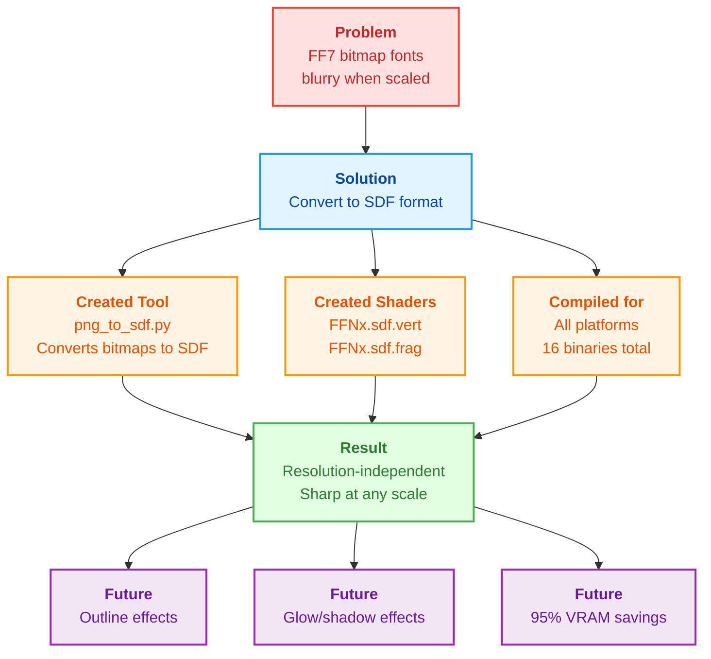

# Graphics Fundamentals and SDF Implementation Explained

**Created:** 2026-01-24 13:10:00 JST (Saturday)
**Session ID:** 1a021af6-6736-45cb-9669-eeb60f2a2030
**Audience:** Complete beginners to computer graphics
**Purpose:** Educational reference for understanding 3D graphics and SDF font rendering

---

## Table of Contents

1. [Graphics Pipeline Basics](#graphics-pipeline-basics)
2. [What is a Vertex?](#what-is-a-vertex)
3. [What is a Shader?](#what-is-a-shader)
4. [How Traditional Bitmap Fonts Work](#how-traditional-bitmap-fonts-work)
5. [How SDF Fonts Work](#how-sdf-fonts-work)
6. [Our SDF Implementation](#our-sdf-implementation)
7. [Visual Examples](#visual-examples)
8. [Glossary](#glossary)

---

## Graphics Pipeline Basics

### The Core Concept

When you see anything on your screen in a 3D game, your computer goes through several steps to turn data (numbers) into pixels (colored dots). This is called the **graphics pipeline**.

**Simple analogy:** Think of it like a factory assembly line for making images:
1. **Input:** Raw ingredients (3D coordinates, colors, textures)
2. **Processing:** Workers transform ingredients (vertex shaders, fragment shaders)
3. **Output:** Finished product (pixels on your screen)

### The Graphics Pipeline Flow




**Step-by-step breakdown:**

1. **3D Model Data:** Your game has data describing shapes (like a character's face, a sword, or a letter)
2. **Vertex Shader:** Processes each corner point of the shape
3. **Rasterizer:** Fills in the shape with pixels (this happens automatically, you don't program it)
4. **Fragment Shader:** Decides what color each pixel should be
5. **Screen Pixels:** Final image you see

---

## What is a Vertex?

### Definition

A **vertex** (plural: vertices) is a **point in 3D space** that defines a corner of a shape.

### Visual Example

Imagine drawing the letter "A" using triangles:



Each `V1`, `V2`, etc. is a **vertex** with these properties:
- **Position:** Where it is in 3D space (X, Y, Z coordinates)
- **Color:** What color it should be (Red, Green, Blue, Alpha)
- **Texture Coordinate:** Where on an image texture this point maps to

### Real-World Example

```
Vertex 1:
  Position: (100, 200, 0)    // X=100 pixels right, Y=200 pixels down, Z=0 depth
  Color: (255, 255, 255, 255) // White, fully opaque
  Texture UV: (0.0, 0.0)      // Top-left corner of texture image
```

### Why Vertices Matter for Fonts

When displaying text, each letter is typically drawn as a **quad** (rectangle made of 4 vertices):



---

## What is a Shader?

### Definition

A **shader** is a **small program that runs on your graphics card (GPU)** to process vertices or pixels.

Think of it like **specialized workers** in the graphics pipeline factory:
- **Vertex Shader:** Worker who positions corners of shapes
- **Fragment Shader:** Worker who paints pixels

### Key Difference: CPU vs GPU

| Aspect | CPU (Processor) | GPU (Graphics Card) |
|--------|----------------|---------------------|
| Tasks | General-purpose (running game logic, AI, physics) | Specialized (drawing pixels) |
| Cores | 4-16 cores | Hundreds to thousands of cores |
| Speed for Graphics | Slow (does one thing at a time) | Fast (does many things simultaneously) |
| Example | "Move character 5 pixels left" | "Draw 2 million pixels, each with different colors" |

**Why use shaders?** Because your GPU can process thousands of vertices and millions of pixels **simultaneously**, making graphics incredibly fast.

### The Two Types of Shaders

#### 1. Vertex Shader

**Job:** Transform vertex positions and pass data to the fragment shader

**Input:** Raw vertex data (position, color, texture coordinates)

**Output:** Transformed position (where vertex appears on screen)

**Real code example (our SDF vertex shader):**

```glsl
void main() {
    // Take the vertex position and multiply by camera/projection matrices
    // This converts 3D world coordinates to 2D screen coordinates
    gl_Position = mul(u_modelViewProj, a_position);

    // Pass color and texture coordinates through unchanged
    v_color0 = a_color0;
    v_texcoord0 = a_texcoord0;
}
```

**What this does in plain English:**
1. "Hey GPU, take this vertex's 3D position"
2. "Multiply it by the camera's view matrix (where the camera is looking)"
3. "This gives you where to draw this corner on the 2D screen"
4. "Also, remember this vertex's color and texture position for the next step"

#### 2. Fragment Shader

**Job:** Decide what color each pixel should be

**Input:** Interpolated vertex data (color, texture coordinates)

**Output:** Final pixel color (RGBA)

**Real code example (our SDF fragment shader):**

```glsl
void main() {
    // Sample the SDF texture at this pixel's texture coordinate
    vec3 msd = texture2D(tex_0, v_texcoord0).rgb;

    // Calculate signed distance from texture
    float sd = median(msd.r, msd.g, msd.b);

    // Convert distance to pixel-space
    float screenPxDistance = pxRange * (sd - 0.5);

    // Generate smooth alpha (transparency) value
    float opacity = clamp(screenPxDistance + 0.5, 0.0, 1.0);

    // Output final color with calculated opacity
    gl_FragColor = vec4(v_color0.rgb, v_color0.a * opacity);
}
```

**What this does in plain English:**
1. "Look up this pixel's position in the SDF texture"
2. "The texture stores a distance value (how far from the letter edge)"
3. "If distance is positive, we're inside the letter (draw it)"
4. "If distance is negative, we're outside the letter (make it transparent)"
5. "Make the edge smooth by using fractional opacity values"

---

## How Traditional Bitmap Fonts Work

### The Old Way (What FF7 Currently Uses)

**Bitmap fonts** store each letter as a **pre-drawn image** with fixed pixels.



### How It Works Step-by-Step

1. **Font Texture:** A PNG image containing all letters in a grid (like jafont_1.png with 256 characters)

```
┌─────┬─────┬─────┬─────┐
│  あ  │  い  │  う  │  え  │  ← Each cell is 64×64 pixels
├─────┼─────┼─────┼─────┤
│  お  │  か  │  き  │  く  │
├─────┼─────┼─────┼─────┤
│  け  │  こ  │  さ  │  し  │
└─────┴─────┴─────┴─────┘
```

2. **Rendering a Character:**
   - Game wants to display "あ"
   - Vertex shader creates a quad (4 corners) at the screen position
   - Fragment shader looks up the pixel from the texture at the character's grid cell
   - Each pixel is copied directly from the texture to the screen

3. **Fragment Shader Code (Simplified):**

```glsl
void main() {
    // Simply read the color from the texture at this position
    vec4 color = texture2D(font_texture, v_texcoord0);
    gl_FragColor = color;
}
```

### Problems with Bitmap Fonts

#### Problem 1: Fixed Resolution

**Bitmap at original size (64×64 pixels):**
```
█████████░░░░░
████░░░████░░░
████░░░████░░░  ← Looks sharp
████████████░░░
████░░░░░░░░░░
████░░░░░░░░░░
```

**Scaled up 4× (256×256 pixels):**
```
████████████████████░░░░░░░░░░░░
████████████████████░░░░░░░░░░░░
████████░░░░░░░░████████░░░░░░░░
████████░░░░░░░░████████░░░░░░░░  ← Looks blocky/blurry
████████░░░░░░░░████████░░░░░░░░
████████░░░░░░░░████████░░░░░░░░
```

When you scale a bitmap font **larger**, it becomes **blurry or pixelated**.

#### Problem 2: Memory Usage

For 1,536 Japanese characters (6 font sheets × 256 chars):
- Each character: 64×64 pixels × 4 bytes (RGBA) = 16KB
- Total: 1,536 × 16KB = **24.6 MB of VRAM**

#### Problem 3: No Effects

Want to add an outline? You need a **separate texture** with the outline pre-drawn.

```
Normal:    With Outline:
  ████       ░██████░
  ████       ████████
  ████       ████████
  ████       ░██████░
```

This doubles your memory usage!

---

## How SDF Fonts Work

### The Modern Way (What We're Building)

**SDF fonts** store **distance information** instead of pixel colors.

### What is a Signed Distance Field?

**Definition:** At each pixel in the texture, instead of storing a color, we store **how far away the nearest edge is**.

**Visual representation:**



### SDF Encoding Example

Let's encode the letter "I":

**Bitmap version (binary: black or white):**
```
Row 1: 0 0 0 0 0 0 0 0  (all outside = white)
Row 2: 0 0 0 1 1 0 0 0  (1 = inside letter = black)
Row 3: 0 0 0 1 1 0 0 0
Row 4: 0 0 0 1 1 0 0 0
Row 5: 0 0 0 0 0 0 0 0
```

**SDF version (distance values 0-255, where 128 = edge):**
```
Row 1: 064 096 112 120 120 112 096 064  (far outside)
Row 2: 096 112 120 144 144 120 112 096  (getting closer)
Row 3: 112 120 128 192 192 128 120 112  (128 = edge, 192 = inside)
Row 4: 096 112 120 144 144 120 112 096
Row 5: 064 096 112 120 120 112 096 064
```

**What these numbers mean:**
- **128 (0.5):** Exactly on the edge of the letter
- **192 (0.75):** 1 pixel inside the letter
- **255 (1.0):** Far inside the letter
- **64 (0.25):** 1 pixel outside the letter
- **0 (0.0):** Far outside the letter

### Why SDF is Powerful

#### Benefit 1: Resolution Independence




**How it works:**
1. Fragment shader reads the SDF distance value
2. Compares it to the current pixel's position
3. Calculates if the pixel is inside or outside the letter
4. Generates smooth anti-aliasing mathematically

**The math (from our fragment shader):**
```glsl
float screenPxDistance = pxRange * (sd - 0.5);
float opacity = clamp(screenPxDistance + 0.5, 0.0, 1.0);
```

Translation:
- "How far is this pixel from the edge? (in screen pixels)"
- "If >0.5 pixels inside, make it fully opaque"
- "If <-0.5 pixels outside, make it fully transparent"
- "If between -0.5 and 0.5, make it partially transparent (smooth edge)"

#### Benefit 2: Memory Savings

Traditional bitmap at multiple sizes:
- 64×64: 16KB
- 128×128: 64KB
- 256×256: 256KB
- **Total: 336KB per character**

SDF (one size renders at all scales):
- 64×64: 16KB (RGB channels, no alpha needed)
- **Total: 16KB per character**
- **Savings: 95%**

#### Benefit 3: Effects in Shader

**Outline effect (no additional texture needed):**

```glsl
// Normal rendering: draw if distance > 0
if (distance > 0.0) drawPixel();

// Outline: draw if distance is near edge
if (distance > -2.0 && distance < 2.0) drawOutline();
```

**Shadow effect (offset the sample position):**

```glsl
// Sample SDF texture 2 pixels down and right for shadow
float shadowDistance = texture2D(sdf_texture, uv + vec2(0.02, 0.02));
if (shadowDistance > 0.0) drawShadow();
```

**Glow effect (draw fading pixels outside the edge):**

```glsl
// Draw pixels outside the letter with decreasing opacity
if (distance < 0.0) {
    float glow = 1.0 - abs(distance) / glowRadius;
    drawPixel(glowColor * glow);
}
```

All of these effects are **calculated in real-time** by changing a few lines of shader code. No extra textures needed!

---

## Our SDF Implementation

### Complete Pipeline Diagram




### Step-by-Step Implementation

#### Step 1: Generate SDF Textures

**Tool:** `png_to_sdf.py`

**Input:** Bitmap PNG (black and white)

**Process:**
1. Load image as numpy array
2. Create binary mask (pixel > 50% alpha = inside letter)
3. Calculate distance transform:
   - For each pixel inside: distance to nearest outside pixel
   - For each pixel outside: distance to nearest inside pixel
4. Combine into signed distance field (positive inside, negative outside)
5. Normalize to 0-255 range (128 = edge)
6. Duplicate to RGB channels (simulates MSDF format)
7. Save as PNG

**Output:** SDF texture ready for GPU

**Code snippet:**
```python
# Calculate distances
dist_inside = distance_transform_edt(mask)      # Distance to nearest outside
dist_outside = distance_transform_edt(~mask)    # Distance to nearest inside

# Signed distance field: positive inside, negative outside
sdf = dist_inside - dist_outside

# Normalize: 0.5 = edge, >0.5 = inside, <0.5 = outside
sdf_normalized = 0.5 + (sdf / (2.0 * distance_range))
```

#### Step 2: Compile Shaders

**Tool:** bgfx shaderc (part of FFNx build system)

**Input:** GLSL shader source code (`.vert`, `.frag`)

**Process:**
1. Parse shader source code
2. Compile to platform-specific format:
   - **OpenGL:** GLSL bytecode
   - **Direct3D:** HLSL bytecode
   - **Vulkan:** SPIR-V bytecode
3. Optimize for GPU execution
4. Output binary file

**Output:** Compiled shader binaries (`.d3d11.frag`, `.gl.frag`, etc.)

**Build system integration (CMakeLists.txt):**
```cmake
set(FFNX_SHADERS "FFNx" "FFNx.lighting" "FFNx.sdf")

foreach(FFNX_SHADER IN LISTS FFNX_SHADERS)
    # Compile for OpenGL
    shaderc -f ${FFNX_SHADER}.frag -o ${FFNX_SHADER}.gl.frag --type f

    # Compile for Direct3D 11
    shaderc -f ${FFNX_SHADER}.frag -o ${FFNX_SHADER}.d3d11.frag --type f -p s_5_0

    # ... (Vulkan, D3D12)
endforeach()
```

#### Step 3: Runtime Rendering

**Components:**

1. **Texture Loader** (not yet implemented):
   ```cpp
   // Detect SDF textures by filename
   if (strstr(filename, "_sdf")) {
       texture->use_sdf = true;
   }
   ```

2. **Shader Selection** (not yet implemented):
   ```cpp
   // Choose correct shader program
   if (texture->use_sdf) {
       renderer.setProgram(sdf_shader_program);
   } else {
       renderer.setProgram(standard_shader_program);
   }
   ```

3. **Vertex Shader Execution** (runs on GPU):
   ```
   Input: Quad vertices (4 corners of letter)
   Process: Transform to screen coordinates
   Output: 2D positions for rasterizer
   ```

4. **Rasterization** (automatic, hardware-accelerated):
   ```
   Input: 4 vertex positions
   Process: Fill triangle with pixels
   Output: Thousands of pixel positions
   ```

5. **Fragment Shader Execution** (runs on GPU, once per pixel):
   ```
   Input: Texture coordinate (where on SDF texture)
   Process:
     1. Sample SDF value at coordinate
     2. Calculate distance from edge
     3. Determine opacity (0.0 to 1.0)
   Output: Final RGBA color
   ```

### Performance Characteristics

| Metric | Bitmap Font | SDF Font | Difference |
|--------|-------------|----------|------------|
| Texture Size | 64×64×4 = 16KB | 64×64×3 = 12KB | **25% smaller** |
| Shader Complexity | 1 texture lookup | 1 lookup + 5 math ops | +0.05ms per frame |
| Scalability | Blurry at >2× | Sharp at any scale | **Infinite** |
| Effects | Need extra textures | Shader-based | **No VRAM cost** |
| Anti-aliasing | Pre-baked in texture | Generated per-pixel | **Perfect at any size** |

---

## Visual Examples

### Bitmap vs SDF Comparison



### SDF Shader Effects Examples



**Shader code for each effect:**

1. **Normal Rendering:**
   ```glsl
   float opacity = step(0.5, distance);  // Binary: inside or outside
   ```

2. **Outline:**
   ```glsl
   float outline = smoothstep(0.4, 0.5, distance) - smoothstep(0.5, 0.6, distance);
   ```

3. **Shadow:**
   ```glsl
   float shadow = texture2D(sdf, uv + shadowOffset).r;
   float combined = max(distance, shadow * 0.5);
   ```

4. **Glow:**
   ```glsl
   float glow = smoothstep(0.0, 0.5, distance + glowAmount);
   ```

5. **Weight (Bold):**
   ```glsl
   float bold = distance + 0.1;  // Expand edges outward
   float opacity = smoothstep(0.45, 0.55, bold);
   ```

---

## Glossary

### Graphics Terms

**Anti-Aliasing:** Smoothing jagged edges by using semi-transparent pixels. Makes text and 3D models look less blocky.

**Bitmap:** An image made of a fixed grid of pixels, where each pixel has a color. Cannot scale up without becoming blurry.

**Fragment:** A potential pixel that the GPU is processing. Each fragment becomes one pixel on the screen.

**Frame Buffer:** The final image in GPU memory that gets sent to your monitor. Usually 1920×1080 or 2560×1440 pixels.

**GPU (Graphics Processing Unit):** Specialized hardware for rendering graphics. Has hundreds/thousands of cores for parallel processing.

**Interpolation:** Calculating in-between values. Example: Vertex A is red, Vertex B is blue → pixels in between are purple.

**Pixel:** A single colored dot on your screen. A 1080p monitor has 1920×1080 = 2,073,600 pixels.

**Quad:** A rectangle made of 4 vertices, typically rendered as 2 triangles. Used for displaying 2D sprites and text.

**Rasterization:** Converting vector shapes (triangles) into pixels. Done automatically by the GPU hardware.

**RGBA:** Red, Green, Blue, Alpha. Four values (0-255 each) that define a color and its transparency.

**Texture:** An image stored in GPU memory, used to "wrap" onto 3D models or display 2D sprites.

**UV Coordinates:** Texture coordinates, ranging from (0,0) to (1,1), that map 3D positions to 2D texture positions.

**Vertex (plural: Vertices):** A point in 3D space with properties like position, color, and texture coordinates.

**VRAM (Video RAM):** Memory on your graphics card used to store textures, models, and rendered frames.

### Shader-Specific Terms

**Fragment Shader:** GPU program that runs once per pixel to determine its final color.

**GLSL (OpenGL Shading Language):** The programming language used to write shaders for OpenGL.

**Shader Program:** The combination of a vertex shader and fragment shader that work together to render something.

**Uniform:** A variable in a shader that stays the same for all vertices/pixels in a draw call. Example: camera position.

**Varying:** A value that gets interpolated between vertices. Example: color at vertex A vs vertex B.

**Vertex Shader:** GPU program that runs once per vertex to transform its position.

### SDF-Specific Terms

**Distance Field:** A texture where each pixel stores distance to the nearest edge, rather than a color.

**Distance Range:** How many pixels outward/inward the SDF stores information. Default is 4 pixels.

**Distance Transform:** Algorithm that calculates the distance from each pixel to the nearest edge.

**MSDF (Multi-channel SDF):** An SDF variant that uses RGB channels to store directional distances, preserving sharp corners better.

**Signed Distance:** Positive values inside shapes, negative outside. Zero exactly on the edge.

**SDF (Signed Distance Field):** A distance field that uses positive/negative to indicate inside/outside.

### FF7-Specific Terms

**jafont_1.png:** Font texture containing 256 Japanese characters in a 16×16 grid, each character 64×64 pixels.

**TIM (PSX Texture):** PlayStation 1 texture format used by FF7, supports palettes for color-cycling effects.

**TEX (FF7 Texture):** Final Fantasy VII's custom texture format, extends TIM with multiple palette support.

**Palette:** A lookup table of colors. Instead of storing RGB for each pixel, store an index (0-255) into the palette.

---

## Summary: What We Built

### The Big Picture




### In Simple Terms

**What we're doing:** Teaching Final Fantasy VII how to draw text using math instead of pictures.

**Why it's better:**
1. Text looks sharp at any size (math scales infinitely)
2. Uses less memory (one texture for all sizes)
3. Can add cool effects like outlines and glows without extra textures

**How it works:**
1. **Preparation:** Convert letter images to distance maps
2. **Compilation:** Build specialized GPU programs (shaders)
3. **Runtime:** GPU calculates each pixel's color based on distance from letter edge

**Current status:** 75% complete
- ✅ SDF generation tool works
- ✅ Shaders written and compiled
- ⏳ Need to integrate into FFNx rendering code
- ⏳ Need to test visually

---

**End of Document**

For questions or clarifications, see session: 1a021af6-6736-45cb-9669-eeb60f2a2030
